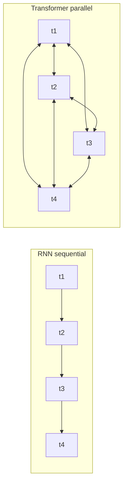
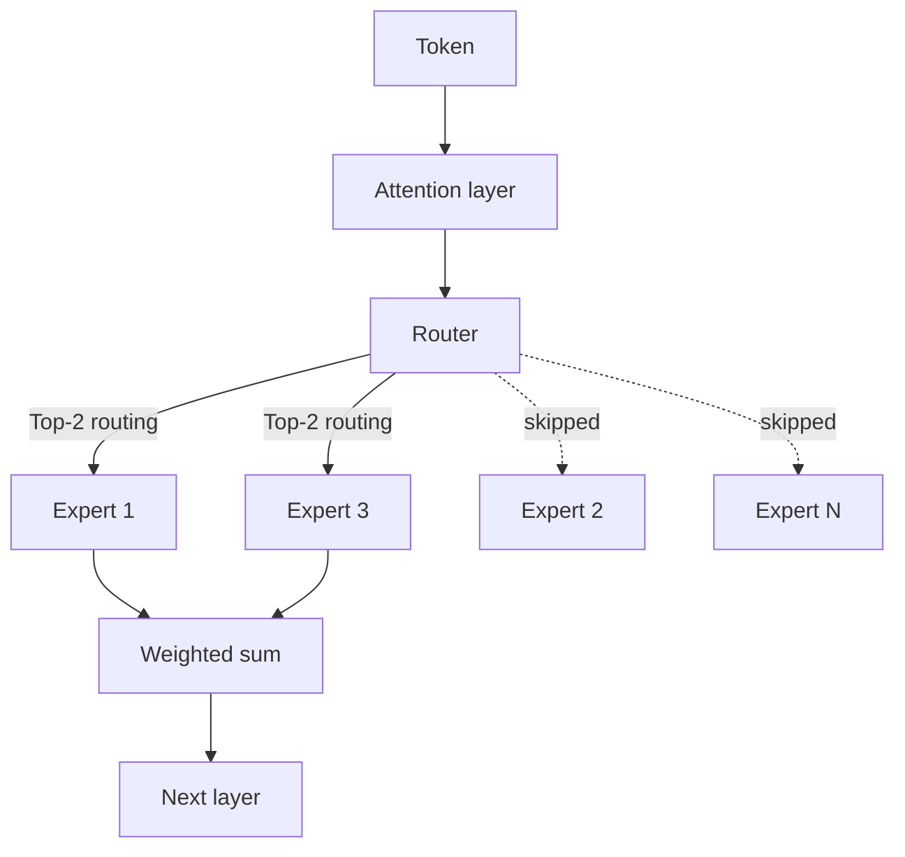

# LLM Internals

The architectural core of modern LLMs: transformers, MoE, attention math, RoPE, GQA, KV cache, and the inference-optimal scaling shift driving 2026 model design.

This chapter covers the core concepts behind large language models. Understanding these internals is essential for making informed architectural decisions about AI systems. For practical implications of these architectural choices, see [Inference Optimization](../04-inference-optimization/) (KV cache, PagedAttention), [Model Taxonomy](../02-model-landscape/01-model-taxonomy.md) (MoE models in production), and [Glossary](../GLOSSARY.md) for definitions of MoE, RoPE, ALiBi, GQA, MLA.

## Table of Contents

- [The Transformer Revolution](#the-transformer-revolution)
- [Architecture Variants](#architecture-variants)
- [Mixture of Experts (MoE)](#mixture-of-experts-moe)
- [Scaling Laws: Training vs. Inference Optimal](#scaling-laws-training-vs-inference-optimal)
- [Native Multimodality](#native-multimodality)
- [Self-Attention Mechanism](#self-attention-mechanism)
- [Multi-Head Attention](#multi-head-attention)
- [Position Encodings](#position-encodings)
- [Feed-Forward Networks](#feed-forward-networks)
- [Layer Normalization](#layer-normalization)
- [Putting It All Together](#putting-it-all-together)
- [Key Numbers to Know](#key-numbers-to-know)
- [Interview Questions](#interview-questions)
- [References](#references)

---

## The Transformer Revolution

Before 2017, sequence modeling relied on recurrent architectures (RNNs, LSTMs) that processed tokens sequentially. This created two problems:

1. **Training was slow**: Sequential processing prevented parallelization
2. **Long-range dependencies were hard**: Information had to flow through many hidden states

The Transformer architecture, introduced in "Attention Is All You Need" (Vaswani et al., 2017), solved both problems by replacing recurrence with self-attention.

**Mental model for distributed systems engineers:**
Think of recurrence like a single-threaded request pipeline where each step depends on the previous. Self-attention is like a fully connected graph where every node can query every other node in parallel.



---

## Architecture Variants

Three main variants emerged based on which parts of the original Transformer are used:

| Architecture | Attention Type | Examples | Best For |
|--------------|---------------|----------|----------|
| Encoder-only | Bidirectional | BERT, RoBERTa | Classification, NER, embeddings |
| Decoder-only | Causal (left-to-right) | GPT-4, Claude, Llama | Text generation, chat |
| Encoder-Decoder | Cross-attention | T5, BART | Translation, summarization |

### Decoder-Only (Most LLMs Today)

```
┌─────────────────────────────────────────────────────┐
│                 Decoder Block (×N)                  │
│  ┌───────────────────────────────────────────────┐  │
│  │           Masked Self-Attention               │  │
│  │   (Each token attends only to previous)       │  │
│  └───────────────────────────────────────────────┘  │
│                         │                           │
│                    Add & Norm                       │
│                         │                           │
│  ┌───────────────────────────────────────────────┐  │
│  │              Feed-Forward Network             │  │
│  └───────────────────────────────────────────────┘  │
│                         │                           │
│                    Add & Norm                       │
└─────────────────────────────────────────────────────┘
                          │
                          ▼
                   Output Probabilities
```

**Why decoder-only dominates:**
- Simplest architecture
- Pre-training objective (next token prediction) aligns with generation
- Scales well with compute

### Encoder-Only (BERT-style)

Uses bidirectional attention. Each token sees all other tokens. Cannot generate text autoregressively but excels at understanding tasks.

**Practical relevance:**
- Fine-tuned for classification (intent detection, sentiment)
- Backbone for embedding models
- Smaller, faster for specific tasks

### Encoder-Decoder (The Return of the Encoder)

While decoder-only dominated for years, there has been a partial return to encoder-decoder architectures for specialized **reasoning** and **verification** tasks (e.g., internal verifiers inside the o-series and Claude reasoning models).

---

## Mixture of Experts (MoE)

**The most significant architectural shift in frontier models (GPT-5.5, Claude Opus 4.7, Gemini 3.1 Pro, DeepSeek V4, Llama 4 Maverick, Mixtral).**

MoE replaces the dense Feed-Forward Network (FFN) with multiple "experts" and a "router" that selects which experts process a given token.

```
┌─────────────────────────────────────────────────────┐
│                 MoE Layer (Decoder)                 │
│  ┌───────────────────────────────────────────────┐  │
│  │               Attention Layer                 │  │
│  └───────────────────────────────────────────────┘  │
│                         │                           │
│                 ┌───────▼───────┐                   │
│                 │     Router    │                   │
│                 └─┬───┬───┬───┬─┘                   │
│          ┌────────┘   │   │   └────────┐            │
│          ▼            ▼   ▼            ▼            │
│   ┌──────────┐ ┌──────────┐ ┌──────────┐ ┌──────────┐│
│   │ Expert 1 │ │ Expert 2 │ │ Expert 3 │ │ Expert N ││
│   └────┬─────┘ └────┬─────┘ └────┬─────┘ └────┬─────┘│
│        └────────────┴───┬───┴────────────┘        │
└─────────────────────────▼───────────────────────────┘
```

### Key MoE Nuances for System Design:
1. **Total vs. Active Parameters**: A 1.6T parameter MoE model (like DeepSeek V4 Pro) might only use 49B parameters per token. Llama 4 Maverick is 17B active across 128 experts. Kimi K2.6 is 1T total / 32B active.
    - **Memory constraint**: You must store all 1.2T parameters (high VRAM).
    - **Compute constraint**: You only pay for 100B params of FLOPs (faster latency).
2. **Routing Collapse**: If the router only picks one expert, the others don't learn. Modern models use **load balancing loss** and **auxiliary losses** to ensure all experts are utilized.
3. **DeepSeek-V3 Refinements**: Introduced **Multi-head Latent Attention (MLA)** and **Auxiliary-loss-free load balancing**, which became the de-facto standard for MoE efficiency. DeepSeek V4 (April 2026) extends both techniques to a 1M-token context window.

The routing decision per token, as a flowchart:



---

## Scaling Laws: Training vs. Inference Optimal

The original Chinchilla laws (2022) focused on being **Training-Optimal**: finding the best model size for a given training budget.

The industry has now shifted to **Inference-Optimal** scaling:
- **Over-training**: Training smaller models (e.g., Llama 3 8B) on massive data (15T+ tokens) far beyond the Chinchilla point.
- **Why?**: The cost of inference over millions of users dwarfs the one-time training cost. A 7B model trained for 10x longer is cheaper to serve than a 70B model trained at the Chinchilla point.

---

## Native Multimodality

Older models used **Vision Adapters** (connecting a frozen CLIP-style vision encoder to an LLM). Frontier models (GPT-5.2, Gemini 3) are **Native Multimodal**.

- **Shared Vocabulary**: Visual tokens and text tokens exist in the same latent space.
- **Uniform Transformer**: The same blocks process both pixels and text.
- **Benefit**: Much better spatial reasoning and "world model" understanding compared to adapter-based approaches.

---

## Self-Attention Mechanism

Self-attention is the core innovation. It allows each token to "attend to" (gather information from) all other tokens in a sequence.

### The Intuition

Consider the sentence: "The animal didn't cross the street because it was too tired."

What does "it" refer to? Understanding requires connecting "it" to "animal". Self-attention learns these connections by computing relevance scores between all token pairs.

**The soft-lookup analogy:** Think of attention as a *soft dictionary lookup*. A hash map compares one query against keys and returns the single value whose key matches exactly. Attention instead compares every query against *every* key, converts the similarity scores into weights that sum to 1, and returns a *weighted blend* of all values. Nothing is retrieved hard — everything contributes in proportion to how relevant it is. So when the token "it" forms its query, the key for "animal" scores highest, and "it" ends up carrying mostly the value (meaning) of "animal" while ignoring off-topic tokens like "street".

This is why attention is called "self"-attention: the queries, keys, and values all come from the *same* sequence, so every token refines its own representation by pulling in context from the rest of the sequence. ([Sebastian Raschka: Self-Attention From Scratch](https://sebastianraschka.com/blog/2023/self-attention-from-scratch.html))

### Q, K, V in Plain English

If the equations feel abstract, anchor them to one idea: **every token asks a question, wears a name tag, and carries content to share.**

| Role | Question it answers | Party analogy | Google-search analogy |
|------|--------------------|---------------|----------------------|
| **Query (Q)** | "What am I looking for?" | The search request you walk around with | What you type into the search box |
| **Key (K)** | "What am I?" | Your name tag / advertisement | A page's title & keywords (decides *if* it shows up) |
| **Value (V)** | "What do I actually give you?" | The info you hand over once matched | The article you read *after* clicking |

**Why three vectors and not one?** Because *"how well we match"* and *"what I give you"* are different jobs. The **Key** decides *how much* attention a token receives (the matchmaking score); the **Value** decides *what content* flows once matched. A page can rank highly (strong key match) while the thing you actually consume is its content (value) — attention keeps these deliberately separate.

**Each token produces all three.** A token is not "a query" — it *generates* a Query, a Key, and a Value by multiplying its embedding through three learned weight matrices:

```
token "it"  ──┬──►  Query = it × W_Q     (how it asks)
              ├──►  Key   = it × W_K     (how it advertises)
              └──►  Value = it × W_V     (what it shares)
```

So a sentence of 11 tokens yields **11 Queries, 11 Keys, and 11 Values**. Every token plays all three roles at once: as a Query it goes shopping across everyone's Keys; as a Key it advertises so other tokens can find it; as a Value it offers content when attended to.

**Worked example — resolving "it":** For the sentence *"The animal didn't cross the street because it was too tired,"* we process the token **"it"**.

1. **"it" forms its Query:** *"I'm a pronoun — find the noun I stand for."*
2. **Score its Query against every Key** (dot product = similarity). Illustrative scores:

   | Word | Key match with "it"'s query |
   |------|------|
   | animal | **9.0** ← strongest |
   | street | 4.0 |
   | tired | 2.0 |
   | cross | 1.0 |
   | the | 0.5 |

3. **softmax → weights that sum to 1:** animal **0.80**, street 0.10, tired 0.05, cross 0.03, the 0.02.
4. **Blend the Values by those weights:**

   ```
   new "it" = 0.80 × Value(animal)
            + 0.10 × Value(street)
            + 0.05 × Value(tired)
            + ...
   ```

   The updated vector for "it" now mostly carries the *meaning* of "animal" — the model has resolved the reference, not with a rule, but by matching a Query to Keys and blending Values.

Every token does this simultaneously — 11 Query rows scored against 11 Keys form the 11 × 11 `QK^T` grid (the source of the O(n²) cost), and all tokens get updated in one parallel pass. The three W matrices (`W_Q`, `W_K`, `W_V`) are *learned during training*: the model discovers on its own how each token should ask, advertise, and contribute so that useful links like "it" → "animal" emerge.

### The Math

For input sequence X of n tokens with dimension d:

```
Q = XW_Q   (Query: What am I looking for?)
K = XW_K   (Key: What do I contain?)
V = XW_V   (Value: What do I contribute?)

Attention(Q, K, V) = softmax(QK^T / √d_k) × V
```

Each token's embedding is projected three times through learned weight matrices, producing three different "views" of the same token:
- **Query (Q)**: what *this* token is looking for in others.
- **Key (K)**: what *this* token offers as an advertisement to others.
- **Value (V)**: the actual information *this* token passes on once it's been attended to.

Separating Key from Value matters: the Key decides *how much* attention a token receives, while the Value decides *what content* gets delivered. Decoupling them lets a token be highly relevant (strong key match) yet contribute nuanced information (its own value), rather than forcing the "relevance signal" and the "content" to be the same vector.

**Step by step:**
1. **QK^T**: Dot product measures similarity between every query and every key, producing an n × n score matrix (row *i* holds token *i*'s affinity to all tokens). A larger dot product means the query and key point in a similar direction, i.e., higher relevance.
2. **/ √d_k**: Scale to prevent softmax saturation with large dimensions (derived below).
3. **softmax**: Convert each row into a probability distribution over the sequence — the attention weights, each row summing to 1. High-scoring tokens get most of the mass; irrelevant ones get near-zero.
4. **× V**: Multiply the weights by the value matrix. Each token's output is a weighted average of *all* values, dominated by the tokens it attended to most. This is the step that actually moves information between positions. ([QKV attention mechanics](https://mbrenndoerfer.com/writing/query-key-value-attention-mechanism))

For a **causal (decoder) model**, a mask sets the scores for future positions to −∞ *before* the softmax, so those weights become 0. This enforces that token *i* can only attend to tokens ≤ *i* — the property that lets the model be trained on next-token prediction over the whole sequence in parallel.

### Why Scale by √d_k?

**Interview favorite**: This is frequently asked because it reveals understanding of numerical stability.

**The variance argument (why exactly √d_k, not some other constant):** Assume the components of Q and K are independent, with mean 0 and variance 1. A single dot product is a sum of `d_k` independent products `q_i · k_i`, each with mean 0 and variance 1. Variance adds across independent terms, so the dot product has **variance = d_k** and a standard deviation of **√d_k**. Dividing by √d_k rescales the variance back to exactly 1, keeping the softmax inputs in a well-behaved range regardless of head size. That is the precise reason the scale is √d_k and not, say, d_k or √d. ([outcomeschool: math behind √dₖ](https://outcomeschool.com/blog/scaling-dot-product-attention))

**Why large values hurt:** softmax saturates. When one input is much larger than the rest, softmax outputs a near one-hot distribution — one weight ≈ 1, the others ≈ 0. In that regime the Jacobian of softmax is nearly zero, so gradients vanish and learning stalls early in training. The original paper states it directly: "for large values of d_k, the dot products grow large in magnitude, pushing the softmax function into regions where it has extremely small gradients." Scaling keeps the distribution soft enough for gradients to flow. ([Vaswani et al., 2017 — §3.2.1](https://arxiv.org/abs/1706.03762))

```python
# Without scaling (problematic for large d)
d = 512
q = np.random.randn(d)
k = np.random.randn(d)
dot = np.dot(q, k)  # Expected magnitude: ~√d ≈ 22.6

# With scaling
scaled_dot = dot / np.sqrt(d)  # Expected magnitude: ~1
```

### Attention Complexity

| Operation | Time Complexity | Space Complexity |
|-----------|-----------------|------------------|
| QK^T computation | O(n²d) | O(n²) |
| Softmax | O(n²) | O(n²) |
| Weighted sum with V | O(n²d) | O(nd) |

The O(n²) term comes directly from the n × n score matrix: every token attends to every other token, so doubling the sequence length quadruples both the compute and the memory for attention. This is the dominant cost at long context and the reason a 100K context window means 10 billion attention computations per layer — and why the alternatives in the interview section (Flash Attention, sparse/linear attention, Mamba) exist to break the quadratic wall.

---

## Multi-Head Attention

Instead of single attention, modern transformers use multiple "heads" that attend to different aspects in parallel.

```
┌─────────────────────────────────────────────────────────────┐
│                    Multi-Head Attention                      │
│                                                              │
│   ┌─────────┐  ┌─────────┐  ┌─────────┐       ┌─────────┐   │
│   │ Head 1  │  │ Head 2  │  │ Head 3  │  ...  │ Head h  │   │
│   │ d_k=64  │  │ d_k=64  │  │ d_k=64  │       │ d_k=64  │   │
│   └────┬────┘  └────┬────┘  └────┬────┘       └────┬────┘   │
│        │            │            │                  │        │
│        └────────────┴────────────┴──────────────────┘        │
│                              │                               │
│                         Concatenate                          │
│                              │                               │
│                         W_O (project)                        │
└─────────────────────────────────────────────────────────────┘
```

**Why multiple heads?**
- Different heads learn different patterns (syntax, semantics, coreference)
- Similar to ensemble methods: multiple perspectives improve robustness
- Enables parallel processing across heads

**Typical configuration:**
- GPT-3 175B: 96 heads × 128 dimensions = 12,288 total dimension
- Llama 2 70B: 64 heads × 128 dimensions = 8,192 total dimension

### Grouped Query Attention (GQA)

**Critical for production systems**: Standard multi-head attention requires storing separate K and V for each head in the KV cache. GQA shares K and V across groups of heads.

| Attention Type | K,V per Query | KV Cache Reduction | Examples |
|----------------|---------------|-------------------|----------|
| Multi-Head (MHA) | 1:1 | Baseline | GPT-3 |
| Grouped-Query (GQA) | 8:1 typical | ~8x | Llama 2, Mistral |
| Multi-Query (MQA) | All:1 | ~n_heads × | PaLM, Falcon |

**Practical impact:**
For Llama 2 70B at 8K context:
- MHA KV cache: ~10 GB per request
- GQA KV cache: ~1.3 GB per request

This directly affects batch size and therefore throughput.

---

## Position Encodings

Self-attention is permutation-invariant. Without position information, "dog bites man" and "man bites dog" would be identical. Position encodings inject sequence order.

### Sinusoidal (Original Transformer)

Uses sine and cosine functions of different frequencies:

```
PE(pos, 2i) = sin(pos / 10000^(2i/d))
PE(pos, 2i+1) = cos(pos / 10000^(2i/d))
```

**Properties:**
- Deterministic, no learned parameters
- Can theoretically extrapolate to longer sequences
- In practice, extrapolation does not work well

### Learned Absolute

Learn a separate embedding for each position:

```python
position_embeddings = nn.Embedding(max_length, d_model)
```

**Properties:**
- Simple and effective
- Cannot extrapolate beyond training length
- Most early models (GPT-2, BERT)

### Rotary Position Embedding (RoPE)

Encode position by rotating the query and key vectors:

```
RoPE(x, pos) = x × cos(pos × θ) + rotate(x) × sin(pos × θ)
```

**Properties:**
- Relative: Attention depends on (pos_q - pos_k)
- Extrapolates better than absolute
- Used in: Llama, Mistral, PaLM

### ALiBi (Attention with Linear Biases)

Add position-dependent bias directly to attention scores:

```
Attention = softmax(QK^T / √d_k - m × distance)
```

Where m is a head-specific slope and distance is |pos_q - pos_k|.

**Properties:**
- No modification to embeddings
- Excellent extrapolation
- Used in: BLOOM, MPT

### Position Encoding Comparison

| Method | Extrapolation | Compute Overhead | Modern Usage |
|--------|---------------|------------------|--------------|
| Sinusoidal | Poor | None | Rarely |
| Learned | None | Minimal | Legacy |
| RoPE | Good | ~5% | Most LLMs |
| ALiBi | Excellent | ~2% | Some LLMs |

---

## Feed-Forward Networks

Each transformer layer has a feed-forward network (FFN) that processes each position independently:

```python
def feed_forward(x):
    hidden = activation(x @ W1 + b1)  # Expand: d → 4d
    output = hidden @ W2 + b2         # Contract: 4d → d
    return output
```

**Key properties:**
- Position-wise: Same weights applied to each position
- Expansion ratio: Typically 4x (e.g., 4096 → 16384 → 4096)
- Where parameters live: FFN has ~2/3 of layer parameters

### Activation Functions

| Activation | Formula | Properties | Usage |
|------------|---------|------------|-------|
| ReLU | max(0, x) | Simple, sparse | Original |
| GELU | x × Φ(x) | Smooth, used in BERT | GPT-2, BERT |
| SwiGLU | Swish(xW) × xV | State of the art | Llama, PaLM |

SwiGLU adds a gating mechanism that improves performance at the cost of ~50% more parameters in the FFN.

### GLU Variants

```python
# Standard FFN
hidden = gelu(x @ W1)
output = hidden @ W2

# SwiGLU FFN
gate = silu(x @ W_gate)
hidden = x @ W_up
output = (gate * hidden) @ W_down
```

---

## Layer Normalization

Layer normalization stabilizes training by normalizing activations:

```python
def layer_norm(x, gamma, beta):
    mean = x.mean(dim=-1, keepdim=True)
    var = x.var(dim=-1, keepdim=True)
    normalized = (x - mean) / sqrt(var + eps)
    return gamma * normalized + beta
```

### Pre-LN vs Post-LN

**Post-LN (Original Transformer):**
```
x = x + Attention(LayerNorm(x))  # Wrong - this is Pre-LN
x = LayerNorm(x + Attention(x))  # Post-LN: normalize after residual
```

**Pre-LN (Modern LLMs):**
```
x = x + Attention(LayerNorm(x))  # Pre-LN: normalize before sublayer
```

| Variant | Training Stability | Final Performance | Usage |
|---------|-------------------|-------------------|-------|
| Post-LN | Harder | Slightly better | Original papers |
| Pre-LN | Much easier | Good | Most modern LLMs |

Pre-LN is standard because it enables training deep models without careful learning rate tuning.

### RMSNorm

Simplification that skips mean centering:

```python
def rms_norm(x, gamma):
    rms = sqrt(mean(x^2) + eps)
    return gamma * (x / rms)
```

~10-15% faster than LayerNorm with similar performance. Used in Llama, Mistral.

---

## Putting It All Together

A complete transformer layer:

```python
class TransformerLayer:
    def __init__(self, d_model, n_heads, d_ff):
        self.attn_norm = RMSNorm(d_model)
        self.attn = MultiHeadAttention(d_model, n_heads)
        self.ff_norm = RMSNorm(d_model)
        self.ff = SwiGLU_FFN(d_model, d_ff)
    
    def forward(self, x, mask=None):
        # Pre-norm attention with residual
        h = x + self.attn(self.attn_norm(x), mask)
        # Pre-norm FFN with residual
        out = h + self.ff(self.ff_norm(h))
        return out
```

**Full model:**
```
Token IDs → Embedding → [Transformer Layer × N] → Output Norm → LM Head → Logits
```

---

## Key Numbers to Know

### Model Sizes

| Model | Parameters | Layers | Heads | Dimension | FFN Dim |
|-------|------------|--------|-------|-----------|---------|
| GPT-3 | 175B | 96 | 96 | 12,288 | 49,152 |
| Llama 2 70B | 70B | 80 | 64 | 8,192 | 28,672 |
| Llama 2 7B | 7B | 32 | 32 | 4,096 | 11,008 |
| Mistral 7B | 7B | 32 | 32 | 4,096 | 14,336 |

### Memory Requirements

```
Model weights (FP16) ≈ 2 bytes × parameters
- 70B model: ~140 GB
- 7B model: ~14 GB

KV Cache per token (FP16):
= 2 × layers × heads × head_dim × 2 bytes
- Llama 70B: 2 × 80 × 64 × 128 × 2 = 2.6 MB per token
- At 8K context: 21 GB per request
```

### Compute Requirements

```
FLOPs per token forward pass ≈ 2 × parameters
- 70B model: ~140 TFLOPs per token
- Generate 100 tokens: 14 PFLOPs

H100 at 990 TFLOPS (FP16):
- Single token: 140ms theoretical (actual: ~20-50ms with batching)
```

---

## Key Takeaways

- The shift from RNN to Transformer was about parallelization, not just quality; this is why GPU scaling laws followed.
- MoE separates total parameters (memory cost) from active parameters (compute cost): a 1.2T MoE model can serve at the latency of a 100B dense model.
- Inference-optimal scaling beats Chinchilla in production: over-train small models because inference cost dominates training cost over a model's lifetime.
- GQA is the single highest-impact KV-cache optimization in current models; understand the N:G ratio before discussing serving cost.
- Pre-LN with RMSNorm is the modern default; if you see Post-LN in an interview answer, the candidate is referencing 2018 papers.

---

## Interview Questions

### Q: Explain why transformer attention is O(n²) and what alternatives exist.

**Strong answer:**
Attention computes pairwise similarities between all tokens. For sequence length n:
- QK^T is [n, d] × [d, n] = n² multiplications per head
- Storage for attention weights: n² floats

Alternatives:
- Sparse attention (Longformer): O(n) with local + global patterns
- Linear attention (Performer): O(n) using random feature approximation
- Flash Attention: Still O(n²) compute but O(n) memory via kernel fusion
- State-space models (Mamba): O(n) fully linear

The tradeoff: n² is necessary for full long-range dependencies, but most tasks do not need all pairwise interactions.

### Q: What is the KV cache and why does it matter for serving?

**Strong answer:**
During autoregressive generation, we generate one token at a time. Without caching, we would recompute K and V for all previous tokens on each step.

The KV cache stores K and V from previous positions. On each new token:
1. Compute Q, K, V only for the new position
2. Concatenate new K, V to cached K, V
3. Compute attention with full K, V

This reduces per-token complexity from O(n) to O(1) for K and V computation.

**The cost:** Memory scales linearly with sequence length. For Llama 2 70B at 8K context, the KV cache is ~2.5 GB per request *with GQA* (8 KV heads) — or ~21 GB if it used full multi-head attention (64 KV heads). This limits batch size and requires techniques like PagedAttention. ([KV cache memory arithmetic](https://pub.towardsai.net/llama-2-70b-has-64-query-heads-and-8-kv-heads-here-is-the-memory-arithmetic-nobody-shows-you-eb154f2b65e9))

#### In plain English

**The analogy — doing math homework without scratch paper.** Imagine solving a long multi-step problem, but every time you write the next line you re-solve *every previous line* from scratch. That is generation without a KV cache: to produce token #1000, the model would re-process tokens #1–#999 in full. The KV cache is the scratch paper — you write each step down once and just *read* it for every step after.

**Why only K and V get cached (not Q).** Recall the three roles from the [Q, K, V section](#q-k-v-in-plain-english): Key = "what I advertise," Value = "what I contribute," Query = "what I'm looking for *right now*." Past tokens never change what they advertise or contribute, so their K and V are **fixed forever** once computed — perfect to cache. But the Query is about the *current* token's needs, so only the newest token needs a Query. That asymmetry is the whole trick: **old K/V are reusable, only the new Q is fresh.**

**Walkthrough — generating the 4th token of "The cat sat ___":**

| Step | Without cache (wasteful) | With KV cache (smart) |
|------|--------------------------|------------------------|
| Compute K, V for "The", "cat", "sat" | Recompute all 3 *every* step | Read from cache (already stored) |
| Compute K, V for new token | — | Compute for the 1 new token only |
| Compute Q | For all tokens | For the 1 new token only |
| Attention | New Q attends over all K, V | New Q attends over all K, V |

The output is identical — the cache changes *how much work*, not the answer. Per-step K/V work drops from "redo everything" to "add one column."

**Why it dominates serving cost — the memory bill.** The catch: that scratch paper must live in GPU memory (VRAM) for *every* request simultaneously, and it grows with every token generated. The formula:

```
KV cache = 2 (K and V) × layers × kv_heads × head_dim × seq_len × bytes_per_value
```

For Llama 2 70B at 8K context (80 layers, 8 GQA KV heads, head_dim 128, FP16):
`2 × 80 × 8 × 128 × 8192 × 2 bytes ≈ 2.5 GB` for a single request. Serve 40 users at once and that is ~100 GB of VRAM spent purely on caches — often more than the model weights consume for the active portion. Because a GPU has fixed VRAM, **the KV cache directly caps how many requests you can batch, which caps throughput.** That is why it is the #1 target for optimization:
- **GQA/MQA** shrink it by sharing K/V across query heads (the 8x in the table above).
- **PagedAttention (vLLM)** stores the cache in non-contiguous "pages" like OS virtual memory, cutting the 60–80% waste from fragmentation down to under 4%. ([vLLM PagedAttention](https://arxiv.org/pdf/2309.06180))

See [Inference Optimization](../04-inference-optimization/) for how these play out in production serving.

### Q: Why do modern LLMs use Pre-LN instead of Post-LN?

**Strong answer:**
Pre-LN places normalization before each sublayer rather than after. This creates a more direct path for gradients through residual connections.

With Post-LN, gradients must pass through the normalization, which can cause instability at the start of training. Post-LN requires learning rate warmup and careful initialization.

Pre-LN enables training very deep models (100+ layers) without special initialization. The tradeoff is slightly lower final performance, but in practice, the training stability is worth it.

### Q: What is the difference between MHA, MQA, and GQA?

**Strong answer:**
All three are multi-head attention variants that differ in how K and V heads are shared:

- **MHA (Multi-Head Attention)**: Each query head has its own K and V heads. N:N ratio.
- **MQA (Multi-Query Attention)**: All query heads share a single K and V head. N:1 ratio.
- **GQA (Grouped-Query Attention)**: Groups of query heads share K and V heads. N:G ratio (typical G=8).

Memory impact for KV cache:
- MHA: Full size
- MQA: 1/N size (but quality degrades)
- GQA: 1/G size (best tradeoff)

Llama 2 70B uses GQA with 8 KV heads for 64 query heads, reducing KV cache by 8x with minimal quality loss.

---

## References

- Vaswani et al. "Attention Is All You Need" (2017)
- Su et al. "RoFormer: Enhanced Transformer with Rotary Position Embedding" (2021)
- Press et al. "Train Short, Test Long: Attention with Linear Biases" (ALiBi, 2022)
- Shazeer "GLU Variants Improve Transformer" (2020)
- Ainslie et al. "GQA: Training Generalized Multi-Query Transformer Models" (2023)
- [Illustrated Transformer](https://jalammar.github.io/illustrated-transformer/)
- [The Annotated Transformer](https://nlp.seas.harvard.edu/2018/04/03/attention.html)

---

---

## Glossary

| Term | Simple explanation | Purpose |
|---|---|---|
| **Transformer** | A neural network architecture that uses self-attention instead of recurrence to process sequences | Foundation of all modern LLMs; enables parallel training and long-range context |
| **RNN (Recurrent Neural Network)** | A type of network that processes tokens one at a time, passing a hidden state forward | Historical predecessor to transformers; slow to train due to sequential nature |
| **LSTM (Long Short-Term Memory)** | An improved RNN variant with gating mechanisms to selectively remember or forget past information | Pre-transformer approach to long-range dependencies; replaced by attention |
| **Self-Attention** | A mechanism where every token in a sequence computes a relevance score against every other token and blends their information | Core of the transformer; allows direct connections between any two positions |
| **Query (Q)** | A learned projection of a token that represents "what this token is looking for" in the sequence | Drives the matching process in attention; determines what each token attends to |
| **Key (K)** | A learned projection of a token that represents "what this token advertises" to others | Acts as the index side of attention matching; decides how much attention a token receives |
| **Value (V)** | A learned projection of a token that represents "what content this token shares" once attended to | Carries the actual information transferred between positions in attention |
| **Softmax** | A function that converts a vector of raw scores into a probability distribution summing to 1 | Converts raw attention scores into weights used to blend values |
| **Causal Mask** | A triangular mask applied before softmax that sets future positions to negative infinity | Enforces left-to-right generation so each token can only see past tokens |
| **QK^T** | Matrix multiplication of query and key matrices, producing an n×n score grid | Measures pairwise similarity between all token pairs; source of O(n²) cost |
| **√d_k scaling** | Dividing attention scores by the square root of the key dimension | Prevents softmax saturation (near-one-hot distributions) that causes vanishing gradients |
| **Multi-Head Attention (MHA)** | Running multiple independent attention operations in parallel and concatenating results | Each head learns different patterns (syntax, semantics, coreference) for richer representations |
| **Grouped-Query Attention (GQA)** | Sharing Key and Value heads across groups of Query heads instead of having one per head | Reduces KV cache memory by 8× or more with minimal quality loss; critical for serving efficiency |
| **Multi-Query Attention (MQA)** | All query heads share a single Key and Value head | Maximum KV cache reduction but some quality degradation; used in PaLM, Falcon |
| **KV Cache** | Stored Key and Value tensors from all previously generated tokens | Avoids recomputing past token projections on every generation step; essential for autoregressive serving |
| **PagedAttention** | A technique that stores KV cache in non-contiguous memory "pages" analogous to OS virtual memory | Reduces VRAM fragmentation from ~60–80% waste to under 4%; enables more concurrent requests |
| **Decoder-Only** | Transformer variant that uses causal (left-to-right) self-attention only | Dominant architecture for text generation; used by GPT, Claude, Llama |
| **Encoder-Only** | Transformer variant with bidirectional attention where each token sees all others | Best for classification, NER, and embedding tasks; used by BERT |
| **Encoder-Decoder** | Transformer with a bidirectional encoder and a decoder connected via cross-attention | Used for sequence-to-sequence tasks like translation and summarization |
| **Mixture of Experts (MoE)** | Architecture where the feed-forward layer is replaced by multiple expert networks and a router that selects which experts process each token | Decouples total parameters (memory cost) from active parameters (compute cost) |
| **Router** | The component in an MoE layer that decides which experts to activate for each token | Controls which specialized experts see each token; must be balanced to avoid routing collapse |
| **Load Balancing Loss** | An auxiliary training objective that penalizes the router for overusing a small subset of experts | Ensures all experts are trained and utilized during MoE training |
| **Multi-head Latent Attention (MLA)** | Compresses Key and Value vectors into a low-dimensional latent representation before caching | Reduces KV cache to ~5% of MHA baseline while matching or exceeding GQA quality |
| **Chinchilla Scaling Laws** | Empirical rules relating optimal model size to training data volume for a fixed compute budget | Informed training-optimal model sizing; now being superseded by inference-optimal strategies |
| **Inference-Optimal Scaling** | Training smaller models on far more data than Chinchilla recommends to minimize per-token serving cost | Cheaper to serve millions of users; Llama 3 8B trained on 15T+ tokens exemplifies this |
| **Over-training** | Training a model on substantially more tokens than the Chinchilla compute-optimal point | Makes small models comparable in quality to larger models at much lower inference cost |
| **Native Multimodality** | Architecture where visual and text tokens share the same vocabulary and transformer blocks from the start | Enables better spatial reasoning and world-model understanding than adapter-based approaches |
| **Vision Adapter** | A module that connects a frozen image encoder to an LLM via a projection layer | Older multimodal approach; less effective than native multimodal training |
| **Feed-Forward Network (FFN)** | A position-wise two-layer MLP applied after attention in each transformer block | Stores factual knowledge and applies non-linear transformations; holds ~2/3 of layer parameters |
| **SwiGLU** | An activation function combining Swish gating with a gated linear unit in the FFN | State-of-the-art activation for LLMs; improves quality at the cost of ~50% more FFN parameters |
| **GELU** | Gaussian Error Linear Unit activation function, a smooth approximation of ReLU | Standard activation in BERT and GPT-2; smoother gradient flow than ReLU |
| **ReLU** | Rectified Linear Unit: outputs max(0, x), zeroing out negative values | Simple baseline activation; sparse but can cause dead neurons |
| **Layer Normalization (LayerNorm)** | Normalizes activations within a single training example across the feature dimension | Stabilizes training by keeping activations in a consistent range |
| **RMSNorm** | Simplified layer normalization that skips mean-centering and only divides by root mean square | 10–15% faster than LayerNorm with similar training stability; used in Llama and Mistral |
| **Pre-LN (Pre-Normalization)** | Applies layer normalization before each sublayer rather than after | Enables stable training of very deep models without careful learning-rate warmup |
| **Post-LN (Post-Normalization)** | Applies layer normalization after the residual addition | Original transformer approach; harder to train at depth but can achieve slightly higher peak quality |
| **Residual Connection** | Adding the input of a sublayer directly to its output (skip connection) | Allows gradients to flow through deep networks and prevents vanishing gradient problems |
| **Sinusoidal Position Encoding** | Fixed sine/cosine patterns added to embeddings to inject position information | Deterministic and parameter-free but does not extrapolate well beyond training length |
| **Rotary Position Embedding (RoPE)** | Encodes position by rotating query and key vectors by position-dependent angles | Better length extrapolation than absolute encodings; used in Llama, Mistral, GPT-4 |
| **ALiBi (Attention with Linear Biases)** | Adds a position-dependent linear bias directly to attention scores instead of modifying embeddings | Excellent length extrapolation; used in BLOOM and MPT |
| **Flash Attention** | A memory-efficient attention implementation using tiling and on-chip SRAM to avoid materializing the full n×n matrix | Achieves exact attention with O(n) memory instead of O(n²); 2–4× faster in practice |
| **Sparse Attention** | Attention that computes scores only for a subset of position pairs rather than all n² pairs | Reduces compute to O(n) at the cost of missing some long-range dependencies |
| **Linear Attention** | Approximates softmax attention using kernel methods to reduce complexity from O(n²) to O(n) | Faster for very long sequences but quality degrades compared to exact attention |
| **Mamba / State-Space Models** | Alternative to transformers using selective state-space models for O(n) sequence processing | Competitive quality with O(n) compute and memory; used for long-context efficiency |
| **Logits** | Raw unnormalized scores output by the LM head before converting to probabilities | Intermediate representation used for sampling or computing loss during training |
| **LM Head** | A linear projection from the hidden dimension to vocabulary size applied at the output | Converts final hidden states into per-token probability distributions for generation |
| **FP16 (Half Precision)** | 16-bit floating-point number format used to store model weights | Halves memory versus FP32 with negligible quality loss; standard for serving |
| **TFLOPs** | Tera floating-point operations per second; measure of GPU compute throughput | Used to estimate inference latency and compare hardware options |
| **H100** | NVIDIA's flagship datacenter GPU for AI training and inference | Current reference hardware for LLM serving; ~990 TFLOPS in FP16 |

*Next: [Tokenization Deep Dive](02-tokenization-deep-dive.md)*
