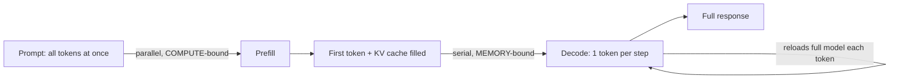
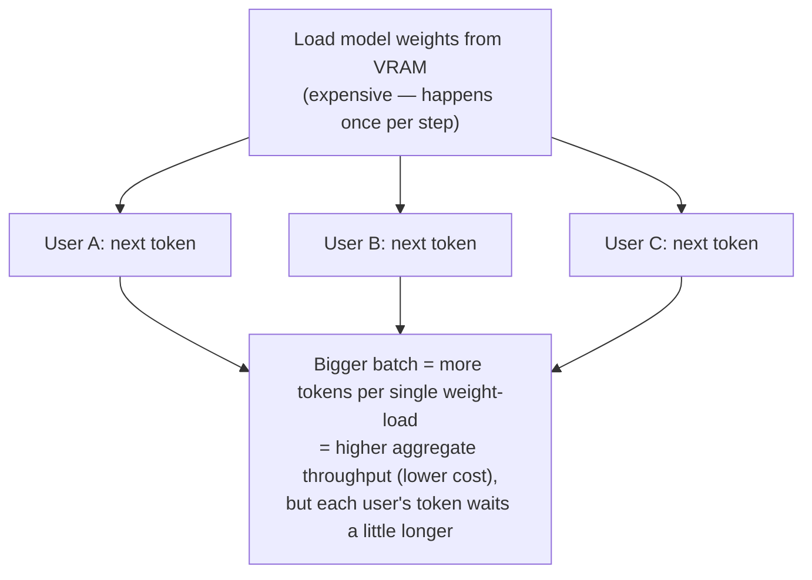

# Inference Fundamentals

Inference is the process of generating predictions from a trained model. Inference optimization has shifted from "simple speedups" to "architectural efficiency" to handle reasoning-heavy workloads on Hopper (H100) and Blackwell (B200) class hardware.

## Table of Contents

- [The Two Phases of Inference](#two-phases)
- [Bottlenecks: Compute-Bound vs. Memory-Bound](#bottlenecks)
- [Performance Metrics: TTFT and TPOT](#metrics)
- [Hardware-Enabled Optimizations (FP8)](#hardware-optimizations)
- [Interview Questions](#interview-questions)
- [References](#references)

---

## The Two Phases of Inference

LLM inference is not a single operation; it consists of two distinct computational phases.

### 1. The Prefill Phase (Prompt Processing)
The model processes the entire input prompt in a single pass.
- **Computation**: High-parallelism matrix multiplications.
- **Bottleneck**: **Compute-bound** (limited by GPU TFLOPS).
- **Time Complexity**: $O(N)$ where $N$ is input length (but parallelized).

### 2. The Decode Phase (Token Generation)
The model generates tokens one by one, where each token depends on the previous ones.
- **Computation**: Sequential processing, one row of the weight matrix at a time.
- **Bottleneck**: **Memory-bound** (limited by memory bandwidth).
- **Time Complexity**: $O(M)$ where $M$ is output length (sequential).

---

## Bottlenecks: Compute-Bound vs. Memory-Bound

Understanding where your system is bottlenecked is critical for choosing the right optimization.

| Phase | Bottleneck | Why? | Primary Optimization |
|-------|------------|------|----------------------|
| **Prefill** | Compute (FLOPs) | Parallel processing saturates the GPU's arithmetic units. | FlashAttention, FP8/FP16 precision. |
| **Decode** | Memory Bandwidth | Weights must be loaded from VRAM for *every single token*. | Quantization (4-bit), GQA, Batching. |

**The Memory Wall insight**
As models grow larger, memory bandwidth (HBM3/HBM3e) has not scaled as fast as compute (TFLOPS). This makes the Decode phase the primary target for production optimization.

#### In plain English

**The analogy — reading a question vs. writing the answer by hand.** Prefill is *reading the whole question at a glance*: your eyes take in the entire prompt at once, so it's fast and parallel. Decode is *writing the answer out by hand, one word at a time* — and before every single word you re-read your entire notebook of notes (the KV cache). The thinking isn't the slow part; the writing is.

**Why prefill is compute-bound.** In prefill the model runs one big matrix-matrix multiply over *all* prompt tokens together. Each weight it pulls from memory is immediately reused across every prompt token, so the GPU's arithmetic units stay busy — the bottleneck is *how fast it can do math* (~90–95% GPU utilization). ([Prefill vs Decode](https://towardsdatascience.com/prefill-is-compute-bound-decode-is-memory-bound-why-your-gpu-shouldnt-do-both/))

**Why decode is memory-bound.** In decode the model produces *one* token per step (a matrix-vector multiply). To make that single token it must stream the **entire model's weights** — plus the growing KV cache — out of VRAM, while doing only a tiny amount of math per byte moved. So the GPU mostly *waits on memory* (~20–40% utilization). A 200-token answer means 200 sequential passes, each re-loading the whole model. That is why long **outputs** are slow and costly, while long **prompts** are comparatively cheap.

**Worked feel for it:**

| | Prefill | Decode |
|---|---------|--------|
| Shape of work | Matrix × matrix (all tokens at once) | Matrix × vector (one token) |
| Weights reused across… | many tokens → efficient | just one token → wasteful |
| Limited by | GPU math (TFLOPS) | Memory bandwidth (HBM) |
| GPU utilization | ~90–95% | ~20–40% |
| Fix it with | FlashAttention, FP8/FP16 | 4-bit quant, GQA, batching, speculative decode |



**Why the "memory wall" points the finger at decode.** Every GPU generation, raw compute (TFLOPS) has grown much faster than memory bandwidth (HBM3/HBM3e). Since decode is the *bandwidth*-bound phase, it inherits the slower-growing resource — so it dominates production cost and is where optimization pays off. The levers all reduce *bytes moved per token*: 4-bit **quantization** (fewer bytes per weight), **GQA/MQA** (smaller KV cache), and **continuous batching** (one weight-load serves many users' tokens at once). At scale, teams even run prefill and decode on **separate GPU pools** (disaggregated serving) because one GPU can't do both efficiently. ([The memory wall](https://www.spheron.network/blog/ai-memory-wall-inference-latency-guide-2026/); [Databricks — inference performance](https://www.databricks.com/blog/llm-inference-performance-engineering-best-practices); video walkthrough: [Mark Moyou — Mastering LLM Inference Optimization](https://www.youtube.com/watch?v=9tvJ_GYJA-o))

See [KV Cache and Context Caching](02-kv-cache-and-context-caching.md) for the cache that prefill fills and decode reads.

---

## Performance Metrics

| Metric | Full Form | Goal | Importance |
|--------|-----------|------|------------|
| **TTFT** | Time To First Token | < 200ms | User-perceived responsiveness. |
| **TPOT** | Time Per Output Token | < 30ms | Reading speed and conversational flow. |
| **Throughput** | Tokens/Second (Agg) | Maximize | Determining cost per query. |
| **Latency** | End-to-End Time | < 2.0s | Total turn-around for the agent. |

#### In plain English

**The analogy — a restaurant kitchen.** TTFT is how fast the *first* dish reaches a table; TPOT is how quickly the following courses arrive; **throughput** is how many meals the whole kitchen serves *per hour*. Cooking more orders in parallel raises meals-per-hour — but pile on too many and every table waits longer for each course. That tension, total output vs. per-customer speed, is the throughput-vs-latency trade-off.

**What throughput measures.** Work completed per unit time — usually **tokens per second** (sometimes requests per second). It comes in two kinds, and mixing them up is a classic interview slip:
- **Per-request throughput** — tokens/sec a *single* user experiences (≈ `1 / TPOT`).
- **Aggregate (system) throughput** — tokens/sec across *all* concurrent users on the GPU. **This is the number that sets cost**, because you divide the GPU's hourly price by it:

```
cost per 1M tokens  ≈  GPU $/hour  ÷  aggregate tokens per hour
```

Double the aggregate throughput on the same GPU and you roughly halve cost per token — which is why "Maximize" is the goal in the table above.

**Why it fights with latency — and how batching mediates.** Putting more requests in one **batch** lets a single expensive weight-load from VRAM serve many users' tokens at once, so aggregate throughput rises — but each individual token now takes a little longer, so per-user latency (TPOT) rises too. **Continuous batching** (vLLM) manages this dynamically: it fills freed slots token-by-token so the GPU stays busy (high throughput) without forcing large static batches (high latency). ([Databricks — inference performance](https://www.databricks.com/blog/llm-inference-performance-engineering-best-practices))



**The nuance — goodput, not raw throughput.** You can inflate tokens/sec by batching so aggressively that everyone blows past the latency SLA. **Goodput** counts only the throughput that *still meets your SLOs* (e.g., tokens/sec delivered to requests that keep TTFT < 200 ms and TPOT < 30 ms). At scale you optimize **goodput**, not the vanity throughput number. ([DistServe, OSDI 2024](https://www.usenix.org/system/files/osdi24-zhong-yinmin.pdf))

---

## Hardware-Enabled Optimizations (FP8)

**FP8 (8-bit Floating Point)** is the native precision for inference on H100 and B200 GPUs.

- **Benefit**: 2x faster than FP16/BF16 with negligible (<0.1%) accuracy loss.
- **How it works**: Uses a smaller mantissa and larger exponent than Int8, allowing it to represent the dynamic range of LLM activations more accurately without complex calibration.

**Principal-level Nuance**: Serving frameworks now use **Dynamic FP8 Scaling**, which adjust the quantization scales per-layer to prevent outliers from degrading the entire model's logic.

---

## Interview Questions

### Q: Why is LLM generation slower than classification?

**Strong answer:**
Classification is a "Prefill-only" task; it processes the entire input and produces a single output in one parallel pass, making it compute-optimal. LLM generation, however, is **auto-regressive**. Each token depends on the previous one, forcing a sequential "Decode" loop. Because each step in this loop is memory-bound (loading Gigabytes of weights to produce Milligrams of data), the system spends most of its time waiting for memory transfers rather than doing math.

### Q: How do you optimize TTFT vs. TPOT?

**Strong answer:**
To optimize **TTFT**, you must optimize the Prefill phase: use FlashAttention-3, increase compute parallelism (Tensor Parallelism), or use Prefix Caching to skip the prefill entirely for common prompts. 
To optimize **TPOT**, you must optimize the Memory Bandwidth during Decode: use quantization (4-bit weights) to reduce the data moved from VRAM, use Grouped Query Attention (GQA) to reduce KV cache size, or use Speculative Decoding to generate multiple tokens per memory load.

---

## References
- Pope et al. "Efficiently Scaling Transformer Inference" (2022)
- NVIDIA. "Transformer Engine Documentation" (2024)
- vLLM Blog. "Understanding LLM Inference Latency" (2023)

---

---

## Glossary

| Term | Simple explanation | Purpose |
|---|---|---|
| **Inference** | Running a trained model on new inputs to get predictions or generated text | The production phase of AI — what actually serves users |
| **Prefill Phase** | The step where the model reads and processes the entire input prompt at once | Sets up the KV cache before token generation begins |
| **Decode Phase** | The step where the model generates output tokens one at a time, each depending on the last | The sequential loop that produces the model's response |
| **Compute-Bound** | A situation where the GPU's math units are the bottleneck, not memory speed | Describes the prefill phase; fix it by making math faster (FP8, FlashAttention) |
| **Memory-Bound** | A situation where the speed of reading data from memory is the bottleneck, not the math | Describes the decode phase; fix it by reducing data moved per token |
| **TFLOPS** | Trillions of floating-point math operations a GPU can do per second | Measures a GPU's raw arithmetic capability |
| **HBM3 / HBM3e** | High Bandwidth Memory, the fast but limited on-chip memory on modern GPUs | Determines how quickly weights and caches can be read during inference |
| **Memory Wall** | The widening gap between how fast GPUs can compute versus how fast they can read memory | Explains why the decode phase is the primary bottleneck in LLM production |
| **KV Cache** | The stored Key and Value tensors for all previously seen tokens, kept in VRAM | Avoids recomputing past tokens on every decode step; major VRAM consumer |
| **TTFT** | Time To First Token — how long until the user sees the first word of a response | Measures perceived responsiveness; target under ~200 ms |
| **TPOT** | Time Per Output Token — the delay between each successive token in a response | Determines how smooth and fast the response feels; target under ~30 ms |
| **Throughput** | Total tokens (or requests) generated per second across all users on a system | Sets the cost per query; doubling throughput roughly halves cost per token |
| **Goodput** | Throughput that still meets latency SLOs (e.g., TTFT < 200 ms and TPOT < 30 ms) | The real optimization target — high token counts that violate SLAs don't count |
| **Auto-regressive** | A generation style where each new token is conditioned on all previous ones, one at a time | The standard LLM decoding method; inherently sequential and memory-bound |
| **FlashAttention** | An optimized attention algorithm that reduces memory reads/writes during the prefill phase | Speeds up and reduces the memory footprint of the compute-heavy prefill step |
| **FP8** | 8-bit floating-point precision, native on H100 and B200 GPUs | Delivers 2x speed over FP16 with negligible accuracy loss for inference |
| **FP16 / BF16** | 16-bit floating-point formats commonly used for model weights and activations | Standard precision for inference; FP8 is faster but FP16 is more broadly supported |
| **Dynamic FP8 Scaling** | Per-layer adjustment of quantization scale factors to prevent accuracy loss from outliers | Lets FP8 be used safely across all layers of a large model |
| **Quantization** | Reducing numerical precision of weights (e.g., from FP16 to 4-bit) to cut memory usage | Shrinks model size and reduces bytes moved per token, improving decode speed |
| **GQA (Grouped Query Attention)** | An attention variant where multiple query heads share a single KV head, reducing cache size | Cuts KV cache VRAM by up to 8x with under 0.2% quality loss |
| **Speculative Decoding** | Using a small fast model to draft several tokens, then verifying them in one pass of the large model | Generates multiple tokens per weight-load, bypassing the memory-bound serial bottleneck |
| **Continuous Batching** | Allowing new requests to join and finished ones to leave a running batch at every token step | Keeps the GPU fully utilized and raises aggregate throughput by 4–10x over static batching |
| **Tensor Parallelism** | Splitting individual weight matrices across multiple GPUs so one layer runs simultaneously on all | Reduces per-layer latency; the standard approach for multi-GPU serving on one node |
| **Disaggregated Serving** | Running prefill and decode on separate GPU pools because each phase has different resource needs | Prevents decode-bound and compute-bound phases from competing for the same hardware |
| **H100 / B200 (Hopper / Blackwell)** | NVIDIA GPU generations that introduced FP8 hardware support and very high memory bandwidth | The reference hardware class for modern high-performance LLM inference |
| **Matrix-Vector Multiply** | A math operation where a 2D weight matrix is multiplied by a single 1D token vector | What happens in each decode step — inefficient because weights are loaded for just one token |
| **Matrix-Matrix Multiply** | A math operation that processes many tokens against a weight matrix simultaneously | What happens in the prefill phase — efficient because one weight-load serves all prompt tokens |

*Next: [KV Cache and Context Caching](02-kv-cache-and-context-caching.md)*
