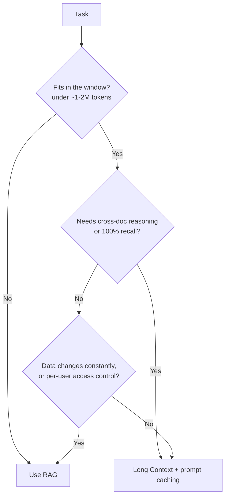

# Context Engineering

Context engineering is the science of filling the LLM's finite "working memory" with the most valuable tokens. With context windows now reaching 1M+ tokens (Claude Sonnet 4.6, Gemini 3.1 Pro, GPT-5.5) and models gaining Extended Thinking, the focus has shifted from "fitting data" to "ranking relevance" and "managing compute budget."

## Table of Contents

- [The Long Context Paradigm (1M+ Tokens)](#long-context)
- [Agentic Context Engineering](#agentic-context-engineering)
- [Extended Thinking & Budget Tokens](#extended-thinking)
- [Lost-in-the-Middle](#lost-in-the-middle)
- [Context Budgeting & Token Awareness](#budgeting)
- [Prompt Caching Economics](#prompt-caching)
- [Contextual Compression (RAD-L)](#compression)
- [Interview Questions](#interview-questions)
- [References](#references)

---

## The Long Context Paradigm (1M+ Tokens)

Models like Gemini 3.1 Pro (1M), Claude Sonnet 4.6 (1M), Claude Opus 4.7 (1M), and GPT-5.5 (1M) have massive context windows.

**Insight**: "Context is the new RAG."
For datasets under 100,000 documents, it is often more accurate and faster to put the entire dataset in the context window than to use an external vector database. This is called **"In-Context RAG."**

---

## Agentic Context Engineering

Prompt engineering writes one good instruction. **Context engineering** curates the full set of tokens the model sees on **every inference turn** of an agent loop: system prompt, tools, retrieved data, prior tool results, and running message history. The distinction matters because an agent accumulates context turn after turn, so the curation problem is continuous, not one-shot. This is the framework Anthropic, OpenAI, and Google now build their agent harnesses around.

### Context Rot: Why Context Is a Finite Resource

A 1M-token window does not mean you should fill it. Models suffer **context rot**: accuracy degrades as the token count grows, because attention scales with n-squared pairwise relationships and training data skews toward shorter sequences. Treat context as a budget with diminishing returns, not free space. The job is to keep the **smallest high-signal set of tokens** that still lets the model act correctly.

### The Five Core Techniques

| Technique | What it does | Use when |
|-----------|--------------|----------|
| **Compaction** | Summarize the message history and reinitialize the loop with the compressed summary plus the few most-recent artifacts | Long back-and-forth sessions approaching the window limit |
| **Just-in-time loading** | Keep lightweight identifiers (file paths, URLs, row IDs) in context and load the full content on demand via a tool | Large corpora or databases that cannot all fit, exploratory tasks |
| **Structured note-taking** | Agent writes progress notes to a file or memory store outside the window, then reads them back later | Long-horizon tasks spanning dozens of tool calls |
| **Sub-agent isolation** | Spawn a focused sub-agent with a clean window for a sub-task; it returns only a 1k-2k token summary | Parallel research, deep search, anything that would flood the main window with intermediate detail |
| **System prompt calibration** | Aim for the "Goldilocks zone": specific enough to be reliable, general enough to not be brittle; use clear XML or Markdown sections | Always, as the foundation under the other four |

### Compaction

When the history grows large, pass it back to the model to summarize, preserving the load-bearing details (architectural decisions, unresolved bugs, key constraints) and dropping redundant tool output. Claude Code uses this pattern: it continues with the compressed summary plus the most recently accessed files. **Tune for recall first** (keep everything that matters), then improve precision (cut redundancy).

### Just-in-Time Loading

Instead of pre-loading every document, the agent holds references and fetches content only when a step needs it. This mirrors how a human works from a file tree: you open the file you need, not the whole repo. It keeps the window small and lets the agent discover structure through exploration. The trade-off is latency, so a hybrid (pre-load the obvious, fetch the rest) is often best.

### Structured Note-Taking (Agentic Memory)

The agent persists notes outside the context window and pulls them back in when relevant. This is what lets an agent stay coherent across a task that is far longer than its window. See [Agent Memory and State](../07-agentic-systems/05-agent-memory-and-state.md) and [Memory Architectures](../08-memory-and-state/01-memory-architectures.md) for the storage substrates (filesystem, vector, graph).

### Sub-Agent Isolation

A coordinator delegates a focused sub-task to a sub-agent that works in its own clean window and returns a condensed summary. The detailed search or analysis context never pollutes the coordinator's window. This is the context-management reason multi-agent systems work, separate from any parallelism benefit. See [Multi-Agent Orchestration](../07-agentic-systems/04-multi-agent-orchestration.md).

---

## Extended Thinking & Budget Tokens

Several frontier models now offer **controllable internal reasoning** before generating a response:

### Claude (Sonnet 4.6, Opus 4.7): Extended Thinking

```python
response = client.messages.create(
    model="claude-3-7-sonnet-20250219",
    max_tokens=16000,
    thinking={
        "type": "enabled",
        "budget_tokens": 10000  # max internal reasoning tokens
    },
    messages=[{"role": "user", "content": "Refactor this codebase to be async..."}]
)

# Response has two blocks:
# 1. thinking block (visible for debug, not shown to user)
# 2. text block (the actual answer)
for block in response.content:
    if block.type == "thinking":
        print("[THINKING]", block.thinking)
    elif block.type == "text":
        print("[ANSWER]", block.text)
```

**Key parameters:**
- `budget_tokens`: 1,024 → 100,000. Higher = better accuracy, higher cost.
- Thinking tokens billed at standard rates. A 10K thinking budget = +$0.15 per request.
- Streaming works — thinking blocks stream before text.

### o3 (OpenAI) — Reasoning Effort

```python
response = client.chat.completions.create(
    model="o3",
    reasoning_effort="medium",  # "low" | "medium" | "high"
    messages=[{"role": "user", "content": "Prove P=NP or disprove it."}]
)
# Reasoning tokens are invisible — o3 never exposes its internal chain
```

**Effort levels vs cost (approx.):**
| Effort | Speed | Cost multiplier | Best for |
|--------|-------|-----------------|----------|
| low | Fast | 1x | Simple logic, quick lookups |
| medium | Medium | 3-5x | Coding, analysis |
| high | Slow | 8-20x | PhD-level problems, ARC-AGI |

### When to Enable Thinking / Reasoning

| Condition | Recommendation |
|-----------|----------------|
| Complex multi-step code refactoring | ✅ Enable (budget: 8K-20K) |
| Simple Q&A / extraction | ❌ Disable — adds cost & latency |
| STEM / math problems | ✅ Enable (o3-mini medium) |
| High-volume chatbot | ❌ Disable — use standard mode |
| Security-critical decision | ✅ Enable — extra reasoning catches edge cases |

**Production pattern**: Use a complexity classifier to gate Extended Thinking. If query complexity score < 0.5, skip thinking mode entirely (saves 60-80% on reasoning-heavy workloads).

```python
def smart_generate(query: str) -> str:
    complexity = classifier.predict(query)  # 0-1 score
    
    if complexity > 0.7:
        # Enable Extended Thinking for hard problems
        return claude_with_thinking(query, budget_tokens=8000)
    else:
        # Standard fast mode for simple tasks
        return claude_standard(query)
```

---

## Lost-in-the-Middle

In 2023, models lost accuracy for information in the middle of the prompt.
**Status**: Frontier models (Claude Sonnet 4.6, Claude Opus 4.7, Gemini 3.1 Pro, GPT-5.5) perform significantly better, but the **Attention Gradient** still exists.
- **Best Practice**: Place critical instructions and gold-standard examples at the **very beginning** and **very end** of your prompt. Middle = raw data/knowledge chunks.
- **Use chunk ordering**: Rerank retrieved documents so most relevant are first and last.

---

## Context Budgeting & Token Awareness

Every token costs money and increases TTFT (Time to First Token).

| Component | Budget (Tokens) | Why? |
|-----------|-----------------|------|
| **System Prompt** | 500 - 1,000 | Core logic and persona. |
| **History** | 2,000 - 5,000 | Conversational "State." |
| **Data/Search** | 10k - 1M | Depends on task depth. |
| **Output Reserve**| 1,000 - 4,000 | Must reserve space for reasoning. |

---

## Prompt Caching Economics

Almost all major providers (OpenAI, DeepSeek, Anthropic, Google) support **Prefix Caching**.

- **The Crossover**: If you reuse a 100k token context (e.g., a codebase) for more than 2 requests, the caching discount effectively makes it cheaper than RAG.
- **Cache Hits**: $0.05 / 1M tokens.
- **Cache Misses**: $5.00 / 1M tokens.

**The Architectural Choice**: Design your system to keep the "System Prompt + Base Knowledge" static to maintain a 100% cache hit rate.

---

## Contextual Compression (RAD-L)

For extremely long contexts (10M+), we use **Reasoning-Aware Deletion (RAD-L)**.
- **How**: A tiny auxiliary model (0.1B) scans the text and removes "filler" words, common linguistic patterns, and irrelevant sections *before* the prompt is sent to the giant frontier model.
- **Benefit**: Reduces prompt size by 20-50% with <1% drop in accuracy.

---

## Interview Questions

### Q: When would you choose Long Context over RAG?

**Strong answer:**
I choose Long Context when high-fidelity retrieval and cross-document reasoning are critical. RAG suffers from "Retrieval Gap"—if your vector search misses the relevant chunk, the model never sees it. Long Context (up to 2M tokens) provides 100% recall. Specifically, I'd use it for codebase analysis, legal document review, and multi-file financial auditing. I'd stick to RAG for dynamic web-scale data or billion-document datasets that exceed any context window.

**Deeper context — it's a trade-off across several axes, not a binary.** Recall is only one of them, and the honest answer names the others:

| Axis | Long Context wins | RAG wins |
|------|-------------------|----------|
| **Recall / fidelity** | 100% — the whole doc is in the window | Depends on retrieval quality (the Retrieval Gap) |
| **Cross-document reasoning** | Strong — sees everything at once | Weak — chunks arrive in isolation |
| **Freshness** | Must re-send the doc each time | Swap one vector-DB record, no re-prompt |
| **Scale** | Capped by the window (~1–2M tokens) | Billions of documents |
| **Cost / latency** | Prefills a huge prompt every call (unless cached) | Prefills only the retrieved chunks |
| **Access control** | Hard to filter per-user | Natural — filter at retrieval time |



In practice the strongest answer is often **hybrid**: use RAG to pre-filter a billion-document corpus down to the few thousand relevant pages, then load *those* into a long-context window for high-fidelity reasoning. And note the cost caveat — a 1M-token prompt is expensive to prefill on every call, so Long Context only pays off when paired with **prompt caching** (the next question).

### Q: How do you handle the high TTFT associated with million-token prompts?

**Strong answer:**
The primary solution is **Context Caching**. By caching the heavy document on the GPU cluster, the model doesn't have to "re-read" (prefill) the entire 1M tokens for every turn. The TTFT for a cached prompt is nearly the same as for a 1k token prompt. Additionally, for non-cached requests, I would use **Streaming Prefill**, where the model generates an initial summary or "Thought" while it is still processing the latter half of the massive context.

**Deeper context — why the TTFT is brutal, and why caching fixes it.** TTFT is dominated by the **prefill** phase, which is *compute-bound* and scales with input length: a 1M-token prompt forces the GPU to run attention over all 1M tokens before it can emit the first output token (see [Inference Fundamentals](../04-inference-optimization/01-inference-fundamentals.md) and [KV Cache and Context Caching](../04-inference-optimization/02-kv-cache-and-context-caching.md)). Context/prompt caching stores that prompt's **KV cache**, so a reused prefix **skips prefill entirely** — the second call pays roughly 0.1x for the cached tokens and its TTFT collapses toward that of a 1k-token prompt.

```
Cold 1M-token request:   [ prefill 1M tokens ....... ] -> first token   (huge TTFT)
Cached 1M-token prefix:  [ read KV cache ] -> first token                (tiny TTFT)
                          ^ prefill skipped; pay ~0.1x for cached tokens
```

The architectural rule (see this chapter's Prompt Caching Economics section): keep the heavy, shared prefix **static and first** so it stays a cache hit. One honest caveat to raise: "streaming prefill" (starting to answer while still ingesting the tail of the context) is a frontier technique, not yet a standard, universally-exposed knob — lead with caching, and offer streaming prefill for cold, uncacheable requests.

### Q: An agent works fine for short tasks but degrades on long-running ones. How do you fix it?

**Strong answer:**
This is **context rot**: the window fills with stale tool output and the model loses the thread. I would apply agentic context engineering. First, **compaction**: summarize the history at a threshold and continue from the summary plus the most-recent artifacts. Second, **just-in-time loading**: hold file paths and IDs instead of full content, and fetch on demand. Third, **structured note-taking**: have the agent write progress to a scratch file it can re-read, so working memory stays small. For sub-tasks that generate a lot of intermediate detail (deep search, multi-file analysis), I would use **sub-agent isolation** so that detail returns as a short summary instead of flooding the main window. The goal is the smallest high-signal token set per turn, not the largest.

**Deeper context — why rot happens, and how to pick the technique.** Two mechanisms drive it: attention cost grows roughly **n²** with token count, and training data skews toward *shorter* sequences — so a window that is technically 1M tokens becomes *less reliable* as you fill it, not merely slower. That is why the objective is the smallest high-signal token set per turn, not the largest. Match the lever to the failure mode: history getting long → **compaction**; corpus too big to fit → **just-in-time loading**; task spans dozens of tool calls → **structured note-taking**; a sub-task floods the window with intermediate detail → **sub-agent isolation** (see the [Five Core Techniques](#agentic-context-engineering) table above). They compose — a long-running coding agent typically runs all four at once.

---

## References
- Liu et al. "Lost in the Middle" (2023/2024 update)
- [Anthropic. "Effective context engineering for AI agents" (2025)](https://www.anthropic.com/engineering/effective-context-engineering-for-ai-agents)
- [Anthropic. "Effective harnesses for long-running agents" (2026)](https://www.anthropic.com/engineering/effective-harnesses-for-long-running-agents)
- Anthropic. "Extended Thinking: Technical Guide": https://docs.anthropic.com/
- OpenAI. "o3 and o3-mini System Card" (2025)

---

---

## Glossary

| Term | Simple explanation | Purpose |
|---|---|---|
| **Context Engineering** | The discipline of curating the exact set of tokens the model sees on every inference turn to maximize usefulness | Keeps agents coherent and cost-efficient across long-running, multi-turn tasks |
| **Context Window** | The maximum number of tokens an LLM can process in one call | Hard cap on how much information the model can attend to at once |
| **Context Rot** | The accuracy degradation that occurs as the context window fills with stale or redundant tokens | Motivates active curation rather than blindly accumulating conversation history |
| **Compaction** | Summarizing the message history into a compressed form and reinitializing the agent loop with that summary | Prevents context rot in long sessions by keeping the window small without losing key facts |
| **Just-in-Time Loading** | Holding lightweight references (file paths, URLs) in context and fetching full content only when needed | Keeps the window lean while allowing access to arbitrarily large corpora |
| **Structured Note-Taking (Agentic Memory)** | Having an agent write progress notes to an external file and read them back later | Lets agents stay coherent across tasks far longer than their context window |
| **Sub-Agent Isolation** | Spawning a focused sub-agent with a clean context window for a sub-task that returns only a short summary | Prevents intermediate detail from flooding the coordinator agent's window |
| **System Prompt Calibration** | Tuning the system prompt to be specific enough to be reliable but general enough not to be brittle | The foundation layer that all other context techniques build on |
| **In-Context RAG** | Placing an entire small dataset directly in the context window instead of using a vector database | Achieves 100% recall for datasets under ~100k documents without retrieval errors |
| **RAG (Retrieval-Augmented Generation)** | A technique that retrieves relevant documents at query time and injects them into the prompt | Scales to billions of documents that exceed any context window |
| **Extended Thinking** | A controllable internal reasoning mode in models like Claude Sonnet 4.6 / Opus 4.7 where the model reasons silently before answering | Improves accuracy on hard problems at the cost of additional compute and latency |
| **Budget Tokens** | A parameter that caps how many tokens a model may spend on internal reasoning | Lets you tune the accuracy–cost trade-off for each request type |
| **Reasoning Effort** | OpenAI o3's parameter (low / medium / high) controlling how much internal compute to spend on a query | Provides a simple knob for balancing speed and quality without exposing raw token budgets |
| **Thinking Tokens** | The tokens consumed by a model's internal reasoning chain before the visible answer | Billed at standard rates; important to account for in cost modeling |
| **Lost-in-the-Middle** | The tendency for models to pay less attention to information placed in the center of a very long prompt | Informs placement strategy: put critical instructions and key examples first and last |
| **Attention Gradient** | The uneven distribution of a model's attention across a long prompt, with stronger focus at the ends | Explains why context placement order matters even in frontier models |
| **TTFT (Time to First Token)** | The elapsed time from sending a request to receiving the first output token | Dominated by the prefill phase; the primary latency concern for long-context prompts |
| **Prefill Phase** | The stage where the model processes all input tokens before generating any output | Compute-bound and scales with input length; the main reason long prompts are slow |
| **KV Cache** | Stored key-value attention pairs for prompt tokens that allow repeated prefixes to be processed only once | The mechanism that makes prompt caching dramatically reduce TTFT on reused contexts |
| **Prompt Caching / Prefix Caching** | Storing the KV cache for a reused prompt prefix so subsequent requests skip the prefill step | Can cut per-request cost by 90–100x for heavy shared prefixes like large codebases |
| **Cache Hit / Cache Miss** | Whether a requested prompt prefix is already stored in the cache (hit) or must be computed fresh (miss) | The ratio of hits to misses determines actual cost savings from caching |
| **RAD-L (Reasoning-Aware Deletion)** | A compression technique using a tiny auxiliary model to remove filler text before sending a prompt to a large model | Reduces prompt size 20–50% with under 1% accuracy loss, lowering cost on very long contexts |
| **Retrieval Gap** | The failure mode where a vector search misses the relevant document chunk, so the model never sees it | The key reason to prefer long context over RAG when 100% recall is critical |
| **n-squared Attention** | The computational cost of self-attention growing with the square of the number of tokens | Why filling a 1M-token window is slower and less reliable than keeping context tight |
| **Complexity Classifier** | A lightweight model or heuristic that scores query difficulty to decide whether to enable extended thinking | Gates expensive reasoning modes so they only activate when the problem warrants it |
| **Hybrid (Long Context + RAG)** | Using RAG to filter a huge corpus down to thousands of relevant pages, then loading those into a long-context window | Combines the scale of RAG with the recall fidelity of long-context reasoning |

*Next: [Structured Generation](06-structured-generation.md)*
