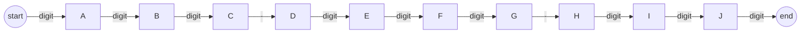

# Structured Generation

Structured Generation is the process of forcing an LLM to produce output in a machine-readable format (JSON, YAML, CSV) with 100% reliability. The discipline has moved from "prompt-based requests" to "engine-level constraints."

## Table of Contents

- [The JSON Mode Revolution](#json-mode)
- [Function Calling & Tool Use](#function-calling)
- [Constrained Decoding (CFG & Regex)](#constrained-decoding)
- [Multi-Stage Extraction Pattern](#multi-stage)
- [Validation & Formatting Errors](#validation)
- [Interview Questions](#interview-questions)
- [References](#references)

---

## The JSON Mode Revolution

Historically, getting JSON was a struggle of "only return JSON, no other text."
**Standard approach**: Use native `response_format: { type: "json_schema" }` (OpenAI/Gemini) or tool-output schemas (Anthropic).

- **Benefit**: 100% syntactical validity. The model literally cannot output a string that is not a valid JSON.
- **Behind the scenes**: The serving engine masks the vocabulary at each step, ensuring only valid JSON characters (e.g., `{`, `"`, `:`, `[`) can be picked next.

---

## Function Calling & Tool Use

Function calling is structured generation where the LLM "picks" a function and populates its arguments.

```json
// Example Tool Call
{
  "name": "get_stock_price",
  "arguments": { "symbol": "AAPL", "interval": "1d" }
}
```

**Nuance**: **Parallel Function Calling** is now standard. A model can decide to call 5 different tools simultaneously (e.g., check account balance, check credit score, check loan rates) and aggregate the results.

---

## Constrained Decoding (CFG & Regex)

For self-hosted models (Llama-cpp, vLLM via Outlines), we use **Context-Free Grammars (CFG)** or **Regex**.

```python
# Outlines Pattern
model = outlines.models.transformers("meta-llama/Llama-4-8B")
generator = outlines.generate.regex(model, r"(\d{3})-\d{3}-\d{4}")
# Result: The model can ONLY output telephone numbers.
```

### How it works — token masking at every step

Constrained decoding restricts *which tokens the model may sample* at each step, so invalid output becomes impossible rather than merely unlikely. The loop:

1. **Compile** the spec (a regex, a CFG, or a JSON Schema) into an automaton.
2. The automaton tracks **where you are** in the structure.
3. At each step it lists the **legal next tokens**; every illegal token's logit is set to **−∞**.
4. Softmax + sample **only among the legal tokens**, then **advance** the automaton.

```
Goal: emit the JSON   {"amount": 12.5}   one token at a time.
Progress so far:       {"amount": _         (the _ is the slot we fill now)

Right here the grammar knows a NUMBER must come next, so it ALLOWS only
these token types:   0-9    .    -      (anything else is illegal here)

  candidate     model's      is it legal          can the model
  next token    raw score    at this spot?        actually pick it?
  ----------    ---------    -----------------    ------------------
  "abc"           8.1        NO  (letters)        blocked  (score -> -inf)
  " the"          6.5        NO  (a word)         blocked  (score -> -inf)
  "1"             7.9        YES (a digit)        allowed
  "-"             2.3        YES (minus sign)     allowed

The twist: the model SCORED "abc" highest -- left alone it would have
emitted junk. But a blocked token has probability 0, so it is physically
impossible to choose. The grammar overrides the model's preference.

  sample among the survivors  ->  "1"  ->  {"amount": 1_   (grammar advances)
```

Because illegal tokens can't be sampled, the output is a **mathematical guarantee** of validity, not a hope — and it's often *faster* than free decoding (forced single-legal-token steps are skipped; Outlines precompiles the schema for O(1) valid-token lookup per step).

### Regex vs CFG — finite states vs a stack

The two differ in *what they can express*, and it maps to classic automata theory:

- **Regex compiles to a Finite State Machine (FSM).** Great for **flat** patterns — dates, phone numbers, enums, fixed shapes — but an FSM has no memory of depth, so it **cannot** track arbitrary nesting.
- **CFG compiles to a Pushdown Automaton (FSM + a stack).** The stack lets it **count nesting depth**, which is exactly what balanced braces/brackets in JSON, or nested code, require. This is why *full* JSON or code needs a **grammar**, not just a regex.



*Regex FSM for `\d{3}-\d{3}-\d{4}`: at each node, only the labeled token type may be emitted next — that IS the mask.*

```
Why JSON needs a CFG: the grammar must remember how deep the nesting is,
so it keeps a STACK of open braces (that stack is what makes it a
"pushdown" automaton).

   reading:  { "a": { "b": 1 } }

   token   action        stack (open braces)   depth
   -----   -----------   -------------------   -----
     {     push          [ {  ]                  1
     {     push          [ {  {  ]               2
     }     pop           [ {  ]                  1
     }     pop           [  ]                    0   <- balanced, OK to stop

A plain regex/FSM has no stack, so it cannot count depth -- it can't tell a
valid closing } from one too many. That is why nested formats (JSON, code)
need a grammar, not just a regex.
```

| | Regex | CFG (grammar) |
|---|-------|----------------|
| Compiles to | Finite State Machine | Pushdown automaton (FSM + stack) |
| Handles | flat: dates, phone, enums, fixed shapes | nested/recursive: full JSON, code, balanced brackets |
| Limitation | no unbounded nesting | (superset of regex) |
| API | `outlines.generate.regex` / vLLM `guided_regex` | Outlines CFG / vLLM `guided_grammar` / llama.cpp GBNF |

**Tools:** Outlines, vLLM (`guided_json` / `guided_regex` / `guided_grammar`), XGrammar, llama.cpp (GBNF grammars), Guidance, SGLang. Provider "strict structured output" modes use this technique under the hood.

**Two caveats (worth stating in an interview):** (1) constrained decoding needs access to the model's **logits**, so it works on self-hosted models or a provider's *strict* mode — with plain API tool-use you fall back to validate-and-retry. (2) It guarantees **format, not truth** — a schema-valid `{"amount": 999}` can still be wrong; semantic correctness needs grounding, verification, and evaluation.

---

## Multi-Stage Extraction Pattern

For complex data extraction (e.g., 50 fields from a medical record), don't do it in one pass.
- **Stage 1 (Text-to-Text)**: Extract a "messy" but complete set of facts in natural language.
- **Stage 2 (Text-to-JSON)**: Use a smaller, cheaper model to convert those natural language facts into a strict JSON schema.
- **Benefit**: Reduces "hallucination under pressure"—large models struggle when forced to reason AND follow strict syntax simultaneously.

---

## Validation & Formatting Errors

Even with "JSON mode," the **Logic** inside the JSON might be wrong (e.g., a field is missing or a date is in the wrong format).

**Recovery pattern**:
1. Validate output against **Pydantic/Zod**.
2. If it fails, send the **Traceback** back to the model:
   "Error: Field 'age' must be an integer, got 'twenty'. Fix and re-generate."
3. Most models fix the error on the first retry.

---

## Interview Questions

### Q: Why is "JSON Mode" more reliable than prompt-based JSON requests?

**Strong answer:**
Prompt-based requests rely on the model's *willingness* to follow instructions; "JSON Mode" (or Constrained Decoding) relies on the serving engine's *inability* to do anything else. By applying a "Logit Bias" or a "Grammar Mask" at the inference level, the engine restricts the choice of the next token to only those that would be valid according to the schema. This eliminates the "preamble" (e.g., "Sure, here is your JSON...") and ensures that you never get a malformed string due to high temperature or randomness.

### Q: What is the risk of asking an LLM for too many structured fields at once?

**Strong answer:**
There is a trade-off between **Schema Complexity** and **Information Integrity**. As the schema grows (e.g., 20+ hierarchical fields), the model's attention is consumed by maintaining the JSON structure (brackets, keys, quotes) rather than verifying the accuracy of the data. This often leads to "Omission Hallucinations" where the model skips fields or fills them with placeholder data. The mitigation is to use a "Chain-of-Density" extraction or split the extraction into multiple parallel sub-tasks.

---

## References
- OpenAI. "Structured Outputs Documentation" (August 2024 update)
- Outlines Project. "Context-Free Grammar Guided Generation" (2024)
- Willard et al. "Efficient Guided Generation for LLMs" (2023)

---

*Next: [Prompt Optimization (DSPy)](07-prompt-optimization-dspy.md)*
