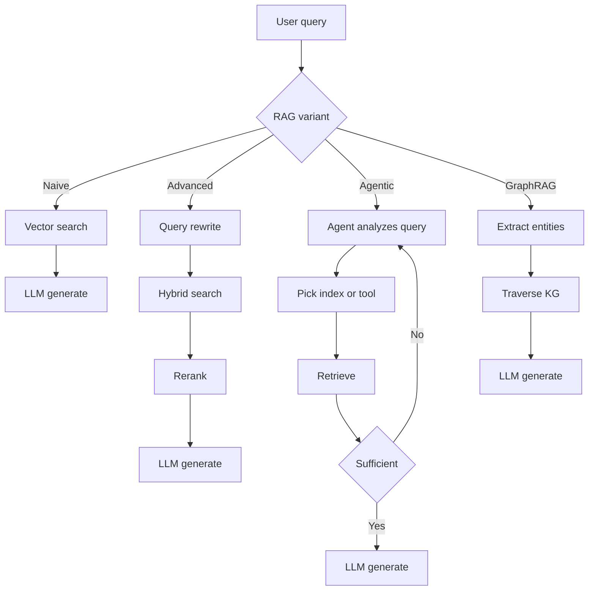
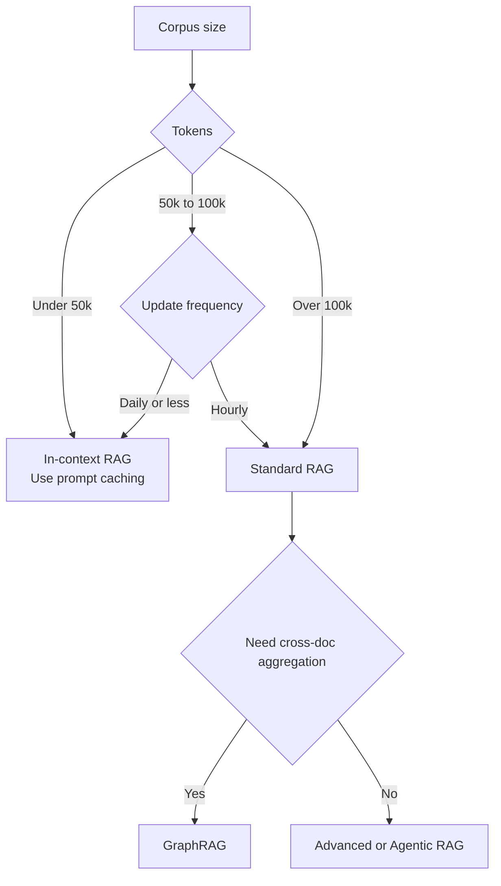

# RAG Fundamentals

How RAG evolved from naive vector search to agentic and graph-based retrieval. When to choose RAG vs. long context, and the three retrieval gaps that cause production failures.

Retrieval-Augmented Generation (RAG) is the architectural pattern of providing an LLM with external, verifiable context to ground its responses. It has evolved from "simple vector search" into a multi-stage reasoning pipeline: hybrid retrieval, reranking, contextual chunking, and agentic loops are now table stakes for production. Deeper material lives in [Chunking Strategies](02-chunking-strategies.md), [Vector Databases](04-vector-databases.md), [Reranking](06-reranking-strategies.md), [Contextual Retrieval](10-contextual-retrieval.md), [ColBERT Late Interaction](11-late-interaction-colbert.md), and the [GraphRAG reframe](07-graph-rag.md).

## Table of Contents

- [The Core Philosophy: Grounding vs. Training](#philosophy)
- [The RAG Taxonomy](#taxonomy)
- [RAG vs. 2M Context (The Hybrid Era)](#rag-vs-long-context)
- [The Retrieval Quality Gap](#quality-gap)
- [Interview Questions](#interview-questions)
- [References](#references)

---

## The Core Philosophy: Grounding vs. Training

| Aspect | Fine-Tuning | RAG |
|--------|-------------|-----|
| **Knowledge Type** | Internalized (Weights) | externalized (Context) |
| **Update Cycle** | High Cost (Retraining) | Zero Cost (Update DB) |
| **Attribution** | None (Black box) | Explicit (Citations) |
| **Privacy** | Hard to "Unlearn" | Easy to filter/delete |

**Rule of thumb**: Fine-tuning is for **Form** (style, tone, syntax); RAG is for **Fact** (knowledge, data, grounding).

---

## The RAG Taxonomy

Production RAG systems are categorized by their "Agentic Depth":

### 1. Naive RAG (Retrieve-then-Generate)
- **Flow**: User Query -> Vector Search -> Top-K -> LLM.
- **Status**: Deprecated for production due to "Retrieval Gap" and low precision.

### 2. Advanced RAG (Multi-Stage)
- **Flow**: Query Transformation -> Hybrid Search -> Reranking -> LLM.
- **Key Nuance**: Uses **RRF (Reciprocal Rank Fusion)** to combine keyword and semantic results.

### 3. Agentic RAG (Loop-based)
- **Flow**: Agent analyzes query -> Decides which tools/indices to search -> Evaluates results -> Re-retrieves if info is missing.
- **Techniques**: Self-RAG, Corrective RAG (CRAG).

### 4. GraphRAG (Structured context)
- **Flow**: Extract entities/relationships -> Build Knowledge Graph -> Traverse graph to find "connected knowledge."
- **Win**: Solves "Aggregative Questions" (e.g., "Summarize all legal risks across 50 documents").

### The through-line: each level buys accuracy with latency, cost, and complexity

These four are a **ladder, not a menu of equals**. Each rung exists to fix the failure of the one below it, and you pay for that fix in latency, tokens, and operational complexity. The senior move is to **match the depth to the query difficulty**, not to reach for the fanciest by default.

```
  capability / cost
       ^
 GraphRAG |  connect facts across many docs  (global / "aggregative" questions)
 Agentic  |  loop + self-correct: re-query, switch index, verify  (multi-hop, ambiguous)
 Advanced |  precision: hybrid search + rerank  (the production default)
 Naive    |  one-shot retrieve-then-generate    (demos, simple FAQ)
       +-------------------------------------------------> query difficulty
```

| Level | Fixes the problem of... | Best for | Cost / latency |
|-------|-------------------------|----------|----------------|
| **Naive** | (baseline) | simple FAQ, demos | lowest — 1 LLM call |
| **Advanced** | low precision; keyword-vs-semantic mismatch | most production RAG | + rerank step |
| **Agentic** | the Retrieval Gap — missing info, multi-hop | ambiguous / multi-step queries | high — several LLM calls in a loop |
| **GraphRAG** | chunk retrieval can't *connect* scattered facts | global / aggregative questions | highest — build + maintain a graph |

**The technique names, decoded:**
- **RRF (Reciprocal Rank Fusion)** — merges the keyword (BM25) and semantic (vector) result lists by each item's *rank position*, not its raw score, so you never have to force two incomparable score scales to agree. Robust and near parameter-free — the default fusion for hybrid search (see [Hybrid Search](05-hybrid-search.md)).
- **Self-RAG** — the model is trained to decide *whether* retrieval is even needed and to critique its own retrieved passages ("relevant? is my answer supported?"), retrieving again if not.
- **Corrective RAG (CRAG)** — grades the retrieved set; if it's weak, it *falls back* (e.g., to a web search) and rewrites the query instead of answering from bad context (both: see [Agentic RAG](08-agentic-rag.md)).
- **GraphRAG** — pre-extracts entities and relationships into a knowledge graph so a query can *traverse* connections ("which risks recur across all 50 contracts?") that flat top-k chunking would only ever see one fragment of at a time.

**Interview soundbite:** *"I default to Advanced RAG — hybrid search plus a reranker — and only climb to Agentic when queries are multi-hop or the first retrieval can miss, or to GraphRAG when the questions are global/aggregative. Each level trades latency and cost for recall on harder queries; you match depth to the query, not to the demo."*

The four variants by agentic depth:



---

## RAG vs. 2M Context (The "Hybrid Era")

With context windows like Gemini 1.5 Pro (2M+) and Claude Sonnet 4.6 (1M+), RAG is changing.

- **In-Context RAG (ICR)**: For datasets < 50k tokens, we skip the vector DB and put EVERYTHING in the prompt.
- **Prompt Caching**: Makes Long-Context RAG 90% cheaper by caching the "Background Knowledge" on the GPU.

**Architectural Decision**: 
- If your corpus is > 100k tokens and dynamic: Use **Standard RAG**.
- If your corpus is < 100k tokens: Use **In-Context RAG**.

Decision tree for picking between standard RAG and in-context RAG:



---

## The Retrieval Quality Gap

The "Retrieval Gap" is the #1 cause of RAG failure.
- **Gap 1: Semantic Mismatch**: Query says "fast cars," DB has "Porsche 911." Solved by **Embedding Rerankers**.
- **Gap 2: Missing Context**: Relevant info is in the DB, but the Retriever missed it. Solved by **Hybrid Search**.
- **Gap 3: Lost-in-the-Middle**: info is in the prompt, but LLM misses it. Solved by **Context Compression**.

### The deeper frame: three gaps = three *different stages* failing

A chunk has to survive **three consecutive stages** to actually help the answer, and each gap is a failure at one of them. That's why "RAG doesn't work" is never a single problem:

```
  question
     |
     v  [1] RETRIEVE  -- did we even fetch the right chunk?   <- Gap 2 (recall)
     v  [2] RANK      -- is it near the TOP of the results?   <- Gap 1 (precision)
     v  [3] GENERATE  -- does the LLM actually read it?       <- Gap 3 (attention)
     |
     v
   answer
```

| Gap | Stage that fails | Symptom | Fix | Why the fix works | Metric to watch |
|-----|------------------|---------|-----|-------------------|-----------------|
| **2 — Missing context** | Retrieve (recall) | the right chunk isn't in the top-k at all | **Hybrid search** (BM25 + vector) | keyword matching catches exact terms/codes the embedding missed | recall@k |
| **1 — Semantic mismatch** | Rank (precision) | it was retrieved, but buried below junk | **Reranker** (cross-encoder) | reads query + chunk *together* to score true relevance, not just vector proximity | nDCG / MRR |
| **3 — Lost-in-the-middle** | Generate (attention) | it's in the prompt, but the LLM ignores it | **Context compression / reordering** | shrink to high-signal tokens and put the key chunk at the start or end, where attention is strongest | faithfulness / answer quality |

See [Hybrid Search](05-hybrid-search.md), [Reranking Strategies](06-reranking-strategies.md), and [Context Engineering](../05-prompting-and-context/05-context-engineering.md) for each fix in depth.

**The senior insight — the gaps are ordered, so fix them in order.** A reranker can't rescue a chunk that retrieval never fetched (fix Gap 2 first), and compression can't help a chunk that was ranked so low it never made it into the prompt (Gap 1 before Gap 3). So *diagnose which stage is leaking* — measure **recall@k** first, then ranking metrics, then generation faithfulness — rather than bolting on a reranker and hoping.

---

## Interview Questions

### Q: Why would you still use RAG if frontier models ship 1M-2M token contexts?

**Strong answer:**
Three tiers of reasons:
1. **Cost and Latency**: Even with prompt caching, re-reading 2M tokens for every new user query is significantly more expensive and has higher TTFT (Time to First Token) than retrieving 5 relevant chunks (approx. 2k tokens). 
2. **Freshness**: RAG can access real-time APIs (Stock prices, News) which cannot be statically embedded in a context window.
3. **Scale**: Enterprise datasets (SharePoint, Terabyte logs) exceed even 2M tokens. RAG serves as the "Filter" to find the relevant 0.01% of data that *should* go into that high-value context window.

### Q: What is "Agentic RAG" and how does it differ from "Advanced RAG"?

**Strong answer:**
Advanced RAG is a **deterministic pipeline** (Linear: Rewrite -> Search -> Rerank). Agentic RAG is a **stochastic loop**. In Agentic RAG, the model is given tools to decide *how* to retrieve. For example, if the agent finds that the retrieved documents are irrelevant, it can decide to "Search Google" or "Query the SQL database" instead. It essentially adds a "Reasoning step" before and after retrieval to ensure the context is sufficient to answer the prompt.

---

## Key Takeaways

- Naive RAG (vector search + top-K + LLM) is deprecated for production; ship Advanced RAG (hybrid + RRF + rerank) as the new baseline.
- Long context windows do not kill RAG: cost, latency, freshness, and corpus scale all push you back to retrieval even at 2M context.
- Choose by corpus size: under 50k tokens go in-context with prompt caching; over 100k go standard RAG; aggregative questions go GraphRAG.
- Most RAG failures are retrieval failures, not generation failures; diagnose the three gaps (semantic, missing context, lost-in-the-middle) before tuning prompts.
- Agentic RAG vs. Advanced RAG is a stochastic-loop vs. deterministic-pipeline choice; only adopt agentic when query patterns are too varied for a fixed pipeline.

---

## References
- Gao et al. "Retrieval-Augmented Generation for LLMs: A Survey" (2024 update)
- Microsoft. "From RAG to GraphRAG" (2024)
- Google. "Long-context LLMs as Retrievers" (2025)
- [Anthropic. "Introducing Contextual Retrieval" (Sep 2024)](https://www.anthropic.com/news/contextual-retrieval)

---

*Next: [Chunking Strategies](02-chunking-strategies.md)*
