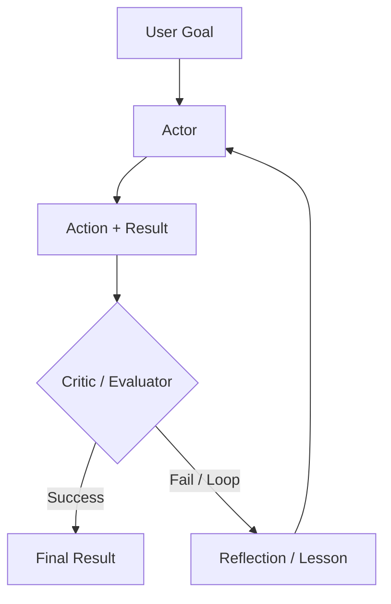

# Reasoning Loops: ReAct and Beyond

Reasoning Loops define the control flow of an agent. While **ReAct** was the 2023 baseline, current systems use more sophisticated patterns like **Plan-and-Solve**, **Self-Reflexion**, and **Inference-Time Scaling** running on top of reasoning-native models.

## Table of Contents

- [The Evolution of the Loop](#evolution)
- [ReAct: The Classic Pattern](#react)
- [Self-Reflexion Loops](#reflexion)
- [Plan-and-Solve (Soto)](#plan-and-solve)
- [Flow Engineering (The LangGraph Pattern)](#flow-engineering)
- [Interview Questions](#interview-questions)
- [References](#references)

---

## The Evolution of the Loop

| Era | Pattern | Core Philosophy |
|-----|---------|-----------------|
| **2023** | ReAct | Interleave thought and action. |
| **2024** | Reflexion | Evaluate errors and re-try. |
| **Today** | System 2 Loops | Use hidden CoT for robust multi-step logic. |

---

## ReAct: Reasoning + Acting

The fundamental loop for 90% of agents:
1. **Thought**: "I need to find X."
2. **Action**: `search_engine("X")`
3. **Observation**: "X is at Y."
4. **Repeat**.

**Critique**: ReAct is fragile. If the search returns "No results," a naive ReAct agent will often try the same search again. Modern loops inject **"Negative Constraints"** (e.g., "Don't try search results we've already seen").

---

## Self-Reflexion Loops

Reflexion adds a **"Critic"** step to the loop.

**Benefit**: By storing these "Reflections" in short-term memory, the agent builds a "Mental Map" of what doesn't work during the current session.

---

## Plan-and-Solve

Instead of deciding one step at a time (greedy approach), the agent creates a **Static Plan** first, then executes it.

1. **Planner**: "I will do A, then B, then C."
2. **Executor**: Carries out the steps.
3. **Re-planner**: If step B fails, trigger a full re-plan rather than a local fix.

**Why?**: Planning reduces "Stochastic Errors." By committing to a path, the model is less likely to get distracted by noisy tool results.

---

## Flow Engineering (LangGraph)

Modern agentic systems have moved from "Chat interfaces" to **"State Machines."**

- **Cyclic Graphs**: Instead of a linear sequence, we define a graph where the model can loop back to a "Cleaning" node or a "Validation" node multiple times.
- **Micro-Agents**: Each node in the graph is a specialized "Prompt" or "Tool."

**Key Nuance**: The "Agent" is no longer just the LLM; the agent is the **Graph Execution Engine**.

---

## Interview Questions

### Q: When would you use a "Reasoning Loop" (ReAct) vs. a "Plan-and-Solve" architecture?

**Strong answer:**
I choose **ReAct** for **Exploratory** tasks where the environment is unpredictable (e.g., browsing a new website where you don't know the URL structure yet). The agent needs to react to every observation. I choose **Plan-and-Solve** for **Predictable** but complex workflows (e.g., generating a financial report from 5 known APIs). Planning prevents the model from "meandering" and allows for better parallelization of steps that don't depend on each other.

### Q: What is "Inference-Time Scaling" and how does it relate to Agentic Loops?

**Strong answer:**
Inference-Time Scaling (often associated with OpenAI's o1) refers to spending more compute *during the response generation* rather than just during training. In an agentic context, this means the model doesn't just output the first valid-looking action. It uses a **Search Tree** (like Monte Carlo Tree Search) to simulate different action paths internally before committing to the one most likely to succeed. This reduces the number of "Real World" tool calls needed, saving external API costs and reducing failure rates.

---

## References
- Yao et al. "ReAct: Synergizing Reasoning and Acting" (2022/2025 update)
- Shinn et al. "Reflexion: Language Agents with Iterative Homeostatic Learning" (2024)
- Wang et al. "Plan-and-Solve Prompting" (2023)

---

---

## Glossary

| Term | Simple explanation | Purpose |
|---|---|---|
| **Reasoning Loop** | The repeating cycle of thinking, acting, and observing that drives an agent forward step by step | The fundamental control structure of any agent |
| **ReAct** | A loop pattern that interleaves Thought, Action, and Observation in sequence | The baseline agent architecture used in most production systems |
| **Thought** | The model's internal reasoning step before it decides what action to take | Allows the agent to plan before acting, reducing errors |
| **Action** | A concrete tool call or command the agent executes based on its thinking | Translates reasoning into real-world effect |
| **Observation** | The result returned from a tool or environment after an action | Feeds new information back into the loop for the next step |
| **Reflexion** | An extended loop pattern that adds a Critic step to evaluate results and store "lessons learned" | Enables agents to improve within a session by learning from failures |
| **Critic / Evaluator** | A model or logic step that judges whether an action's result was successful | Provides explicit feedback signal to guide self-correction |
| **Plan-and-Solve** | A strategy where the agent writes a full plan before executing any steps | Reduces mid-run drift and enables better parallelization |
| **Static Plan** | A plan created upfront and followed in order without mid-run changes | Suits well-defined workflows where steps are known in advance |
| **Greedy Approach** | Making decisions one step at a time based only on current information, without look-ahead | Simpler but more prone to getting stuck in bad paths |
| **Stochastic Errors** | Mistakes that arise from randomness or unpredictable tool results during execution | Reduced by planning ahead before execution begins |
| **Negative Constraints** | Explicit instructions added to a loop telling the agent what NOT to do (e.g., don't repeat a failed search) | Prevents common looping failures like retrying the same broken action |
| **Flow Engineering** | Modeling an agent's workflow as a state machine with nodes and conditional edges rather than a linear chain | Enables complex, conditional, and self-correcting agent behavior |
| **Cyclic Graph** | A workflow graph where the execution can loop back to earlier nodes rather than proceeding only forward | Allows agents to revisit steps for validation or error recovery |
| **State Machine** | A system where the agent moves between defined states based on events and transitions | Makes agent behavior explicit, debuggable, and visualizable |
| **LangGraph** | A Python framework for building agent workflows as typed stateful graphs | The dominant tool for implementing graph-based agentic systems |
| **Micro-Agent** | A small, specialized prompt or tool assigned to a single node in a workflow graph | Keeps each step focused and independently testable |
| **Inference-Time Scaling** | Spending more compute during the model's response generation to simulate multiple paths before committing | Reduces real-world tool calls by picking better actions upfront |
| **Search Tree** | A tree structure the model internally explores to simulate different action sequences before choosing one | Enables strategic look-ahead in high-stakes or complex decisions |
| **Monte Carlo Tree Search (MCTS)** | An algorithm that samples many possible paths through a decision tree and scores them to find the best one | Used in high-accuracy agentic loops to pick optimal actions |
| **System 2 Loop** | A reasoning loop powered by a model that does extended chain-of-thought internally before each action | More robust than ReAct for complex, multi-step tasks |
| **Context Window** | The maximum amount of text a model can hold in memory at once during a single inference call | Constrains how much history and context an agent can reason over |
| **Mental Map** | An agent's accumulated record of what has failed or succeeded in the current session, stored in short-term memory | Helps the agent avoid repeating mistakes within a run |

*Next: [Tool Use and the Model Context Protocol (MCP)](03-tool-use-and-mcp.md)*
