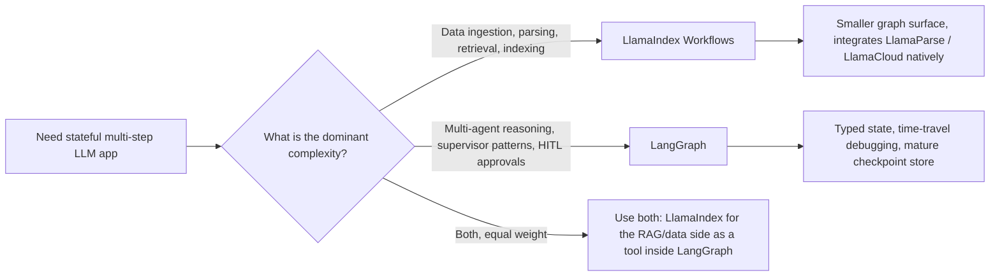

# LlamaIndex

While LangChain focuses on "Orchestration," **LlamaIndex** is the master of **Data-Centric AI**. It has evolved from a RAG library into a framework for **Workflows** and **Agentic Data Manipulation**.

## Table of Contents

- [The Data Framework Philosophy](#philosophy)
- [LlamaIndex Workflows](#workflows)
- [Advanced Indexing: Beyond Vector Search](#indexing)
- [LlamaCloud and Managed Ingestion](#llamacloud)
- [Agents as Tools](#agents-as-tools)
- [LlamaIndex Workflows: Event-Driven Application Framework](#llamaindex-workflows-event-driven-application-framework)
- [Interview Questions](#interview-questions)
- [References](#references)

---

## The Data Framework Philosophy

LlamaIndex is built on the belief that **the data is more important than the model**.
- **The Node**: Every chunk of data is a "Node" with rich metadata (relationships, summaries, and parent-child links).
- **The Retriever**: LlamaIndex provides the most diverse set of retrievers (Summary, Knowledge Graph, Tree, and Keyword).

---

## LlamaIndex Workflows

In late 2024, LlamaIndex introduced **Workflows**, its answer to LangGraph.
- **Event-Driven Architecture**: Nodes communicate by emitting `Events`.
- **Concurrency**: Workflows are natively async and handle large-scale parallel data processing better than linear chains.

```python
# Conceptual Workflow
class RAGWorkflow(Workflow):
    @step
    async def ingest(self, ev: StartEvent) -> RetrievalEvent:
        # Custom logic...
        return RetrievalEvent(results=nodes)
```

---

## Advanced Indexing

1. **Property Graphs**: Linking vector chunks to graph nodes for RAG.
2. **Context-Aware Splitters**: Grouping text by "Meaning" rather than "Token count" (using smaller LLMs to find optimal breakpoints).
3. **Dynamic Pathing**: The retriever decides *which* index to query based on the complexity of the question.

---

## LlamaCloud and Managed Ingestion

For enterprise scale, LlamaIndex focuses on **LlamaCloud**.
- **Managed Ingestion**: Handling PDF parsing, OCR, and Table extraction as a service.
- **Parsing as a Model**: Using Vision-LLMs (Gemini 3.1 Pro, Claude Opus 4.7, GPT-5.5) to "Understand" layouts instead of using rule-based parsers.

---

## Agents as Tools

LlamaIndex treats agents as **high-level retrievers**.
- You can "wrap" a complex LlamaIndex query engine as a tool and give it to a LangGraph agent.
- **Benefit**: The agent gets "Smart Data Access" without needing to know the technical details of the vector DB or Graph schema.

---

## LlamaIndex Workflows: Event-Driven Application Framework

The pitch in 2024 was "Workflows is our LangGraph." The pitch today is different: Workflows is a general-purpose event-driven framework for any AI application, with RAG as one possible use. Today `llama-index-core` ships Workflows as the primary application surface, while the index / retriever classes have moved into integration packages around it ([LlamaIndex workflows docs](https://developers.llamaindex.ai/python/framework/understanding/workflows/)). One naming subtlety worth pinning down: the **Workflows** package reached 1.0 in mid-2025 and is now on a 2.x line as a standalone package, while the core `llama-index` framework itself remains on the 0.x line (around 0.14.x in mid-2026). For how this kind of version churn breaks tutorials and how to survive it, see [Navigating Framework Churn](12-navigating-framework-churn.md).

### What Changed Architecturally

| Dimension | Pre-Workflows LlamaIndex | Workflows-First LlamaIndex |
|-----------|--------------------------|-----------------------------------|
| Primary abstraction | Query engine, chat engine | `Workflow` class with `@step` methods |
| Control flow | Linear; nested query engines | Steps consume / emit typed `Event` subclasses |
| State | Implicit in engine instances | Explicit `Context` with serializable state |
| Concurrency | Cooperative via async query engines | First-class: emit several events, fan out, join |
| Persistence | None | Context can be `pickle`d or stored as JSON for resume |
| Streaming | Per-engine | `ctx.write_event_to_stream()` from any step |
| Human-in-the-loop | Manual | `InputRequiredEvent` / `HumanResponseEvent` pattern |

### The Event-Driven Mental Model

```python
from llama_index.core.workflow import (
    Workflow, step, Event, StartEvent, StopEvent, Context
)

class RetrievedEvent(Event):
    nodes: list

class JudgedEvent(Event):
    nodes: list
    keep: bool

class GraphRAG(Workflow):
    @step
    async def plan(self, ctx: Context, ev: StartEvent) -> RetrievedEvent:
        await ctx.set("query", ev.query)
        nodes = await self.retriever.aretrieve(ev.query)
        return RetrievedEvent(nodes=nodes)

    @step
    async def judge(self, ctx: Context, ev: RetrievedEvent) -> JudgedEvent:
        keep = await self.relevance_judge(ev.nodes, await ctx.get("query"))
        return JudgedEvent(nodes=ev.nodes, keep=keep)

    @step
    async def answer(self, ctx: Context, ev: JudgedEvent) -> StopEvent:
        if not ev.keep:
            return StopEvent(result="No good evidence found.")
        return StopEvent(result=await self.llm.acomplete(...))
```

Two properties fall out of this design:

1. The engine dispatches purely on **event type**, so adding a new branch is adding a new `Event` subclass and a step that consumes it. No central router to edit.
2. **Concurrency is data-driven**: a step that emits three `RetrievedEvent`s automatically fans out three downstream `judge` invocations, and the joining step collects them with `ctx.collect_events`.

### Workflows vs LangGraph



| Dimension | LlamaIndex Workflows (1.x) | LangGraph (1.x) |
|-----------|----------------------------|-----------------|
| Control flow primitive | Event dispatch | Graph nodes and edges, plus a typed reducer state |
| State model | Free-form `Context` (dict-like) | Pydantic / TypedDict state with reducers |
| Resume / time travel | Pickleable context, basic resume | First-class checkpoints, branch from any node ([LangGraph persistence docs](https://docs.langchain.com/oss/python/langgraph/persistence)) |
| Native integrations | LlamaParse, LlamaCloud, all LlamaHub loaders | LangSmith eval, all LangChain integrations |
| Best-fit complexity | Data-shaped: parse, embed, retrieve, refine | Logic-shaped: plan, act, reflect, delegate |
| Multi-agent helpers | `AgentWorkflow`, function-calling agents ([LlamaIndex AgentWorkflow](https://developers.llamaindex.ai/python/framework/understanding/agent/multi_agent/)) | `create_supervisor`, `create_react_agent`, swarm patterns |
| Streaming UI | `ctx.write_event_to_stream` + AG-UI protocol | `astream_events` v2, AG-UI protocol |

When you should reach for LlamaIndex Workflows over LangGraph:

- The hard part is **data ingestion**, not reasoning. LlamaCloud, LlamaParse, and the property-graph stack are all native, not adapter-bridged ([LlamaCloud overview](https://www.llamaindex.ai/llamacloud)).
- You want **document-driven parallelism**: parse 1000 PDFs, fan out an embedding step per chunk, join into one index update.
- You are building inside the **TypeScript** ecosystem on `llama-index-ts` and want feature parity with the Python core.

When LangGraph wins:

- The hard part is the **agent control loop** itself: many agents, supervisor patterns, durable interrupts, replay.
- You need **time-travel debugging** out of the box. LlamaIndex resume is good for crash recovery but not for branching from an arbitrary historical state the way LangGraph checkpoints do.
- You are already on the LangSmith eval stack and want trace-level integration without bridging.

### Real-World Posture

Plenty of senior architectures run both: LlamaIndex Workflows for the data plane (ingestion, indexing, hybrid retrieval, reranking) wrapped as a tool, and LangGraph for the agent control plane on top. This is the pattern called out in the [AIMultiple framework comparison](https://research.aimultiple.com/agentic-ai-frameworks/) and in LlamaIndex's own [hybrid integration cookbook](https://developers.llamaindex.ai/python/framework/understanding/workflows/).

If you only pick one for a new greenfield app, the question reduces to: **is your team going to spend more time on data plumbing or on agent orchestration?** The answer drives the framework.

---

## Interview Questions

### Q: LangChain and LlamaIndex now both have "Graph/Workflow" features. How do you choose?

**Strong answer:**
I choose **LlamaIndex Workflows** for **Data-Intensive** tasks where the main complexity is ingestion, multimodal parsing, and complex retrieval. Its event-driven architecture is more performant for massive parallel data processing. I choose **LangGraph** for **Logic-Intensive** multi-agent systems where the complexity is in the "Reasoning" and "Human-in-the-loop" logic. In many senior architectures, we use **Both**: LlamaIndex for the RAG engine and LangGraph for the overall agentic supervisor.

### Q: What is the "Property Graph" in LlamaIndex and why is it superior to basic Vector RAG?

**Strong answer:**
A Property Graph combines the **Semantic flexibility** of vectors with the **Structural precision** of a database. In basic RAG, you might find a chunk about "Project Alpha," but you don't know who owns it. In a Property Graph, the vector chunk is a node linked to a `User` node and a `Timeline` node. This allows for **Global Reasoning** (e.g., "Find all documents written by Tom in the last month about Project Alpha"). Basic RAG would likely miss many related nodes because they don't contain the exact keyword "Alpha."

---

## References
- LlamaIndex. "The Workflows Framework: Event-Driven Agents" (2025)
- Jerry Liu. "Data-Centric AI in the LLM Era" (2024/2025)
- LlamaHub. "The Repository of 1000+ Data Loaders" (2025)

---

---

## Glossary

| Term | Simple explanation | Purpose |
|---|---|---|
| **LlamaIndex** | A Python framework focused on connecting LLMs to external data through advanced indexing and retrieval. | Provides the fastest path to production-quality RAG and data-centric AI workflows without building retrieval infrastructure from scratch. |
| **Data-Centric AI** | An approach where improving the quality and structure of data, rather than the model, is the primary lever for better AI output. | Ensures that when a model underperforms, the team looks first at the retrieval and indexing pipeline rather than just the model. |
| **Node** | LlamaIndex's fundamental data unit; a chunk of text enriched with metadata such as relationships, summaries, and parent references. | Carries context beyond raw text so retrievers can make smarter relevance decisions. |
| **Retriever** | A component that, given a query, searches an index and returns the most relevant nodes. | Bridges the gap between a user's question and the stored data, determining what context the LLM ultimately sees. |
| **Workflow** | LlamaIndex's event-driven application framework where steps emit and consume typed `Event` objects. | Replaces linear query-engine chains with a concurrent, composable architecture suited to complex data pipelines. |
| **Event** | A typed Python object emitted by one workflow step and consumed by another step in LlamaIndex Workflows. | Decouples producers and consumers of data within a workflow, enabling parallel fan-out without a central router. |
| **StartEvent / StopEvent** | Special built-in event types that mark the beginning and end of a LlamaIndex Workflow execution. | Define the entry and exit points of a workflow, giving the engine clear boundaries for each run. |
| **Context** | A serializable state container passed through all steps of a LlamaIndex Workflow. | Acts as the workflow's shared memory, accumulating information from each step without global variables. |
| **Property Graph** | An index that links vector chunks to typed graph nodes (such as people, projects, or timelines) with explicit relationships. | Enables global reasoning across a document collection, answering relational questions that pure vector search would miss. |
| **Vector RAG** | Retrieval-Augmented Generation where relevant documents are found using embedding similarity in a vector database. | Provides the baseline retrieval approach; fast and general but blind to structural relationships between entities. |
| **Context-Aware Splitter** | A chunking method that uses a small LLM to identify semantically coherent breakpoints rather than splitting on fixed token counts. | Produces chunks that preserve complete ideas, improving retrieval relevance compared to naïve fixed-size chunking. |
| **Dynamic Pathing** | A retrieval strategy where the system decides which index or retrieval method to use based on the complexity of the incoming query. | Routes simple keyword lookups to fast keyword indexes and complex questions to more expensive graph or hybrid retrievers. |
| **LlamaCloud** | LlamaIndex's managed cloud service for document ingestion, parsing, OCR, and embedding at enterprise scale. | Removes the infrastructure burden of building and maintaining a high-throughput document-processing pipeline. |
| **Vision-LLM** | A multimodal model capable of understanding both text and images, used here to parse document layouts. | Replaces brittle rule-based PDF parsers with a model that comprehends tables, diagrams, and complex layouts. |
| **OCR (Optical Character Recognition)** | Technology that converts images of text into machine-readable characters. | Enables indexing of scanned documents, photographs of whiteboards, and other non-digital text sources. |
| **AgentWorkflow** | A LlamaIndex abstraction for creating agents that use function-calling tools within the Workflow framework. | Provides a batteries-included multi-agent pattern without requiring teams to wire the tool-call loop from scratch. |
| **Fan-out** | A concurrency pattern where one event triggers multiple independent downstream steps to run in parallel. | Speeds up batch workloads (e.g., processing 1,000 PDFs) by parallelizing work across many simultaneous steps. |
| **ctx.collect_events** | A LlamaIndex Workflow method that gathers multiple events of the same type before proceeding. | Implements the "join" half of fan-out/fan-in, waiting until all parallel branches finish before merging results. |
| **LlamaParse** | LlamaIndex's document parser that uses multimodal models to extract structured content from complex PDFs and other formats. | Provides higher extraction accuracy than rule-based parsers for documents with tables, charts, and mixed layouts. |
| **AG-UI Protocol** | A streaming protocol for sending agent state updates to a frontend user interface in real time. | Allows users to watch an agent's progress live rather than waiting for a final answer. |
| **Human-in-the-Loop (HITL)** | A design pattern where the workflow pauses and waits for a human decision before continuing. | Adds a safety gate at high-stakes steps such as approvals, corrections, or ambiguous data. |
| **InputRequiredEvent / HumanResponseEvent** | LlamaIndex Workflow event types used to pause execution and resume it after receiving human input. | Implements the HITL pattern in a typed, structured way within the event-driven Workflow model. |

*Next: [DSPy: Programming Language Models](05-dspy.md)*
