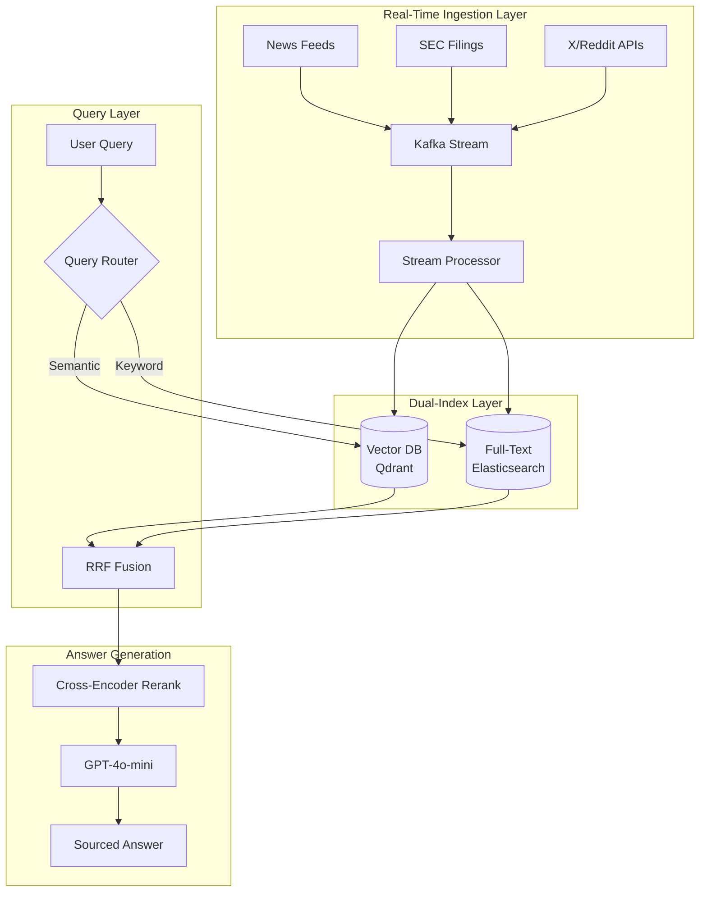

# Case Study: Real-Time AI Search Engine

## The Problem

A fintech startup needs to build a **real-time market intelligence platform** that lets analysts ask natural language questions about live market data, news, and company filings.

**Constraints given in the interview:**
- Data freshness: queries must reflect information from the last 5 minutes
- Scale: 10,000 concurrent users, 50,000 queries/hour
- Accuracy: financial data cannot be hallucinated
- Latency: p95 response time under 3 seconds

---

## The Interview Question

> "Design a system that lets users ask 'What is the sentiment around Tesla in the last hour?' and get an accurate, sourced answer in under 3 seconds."

---

## Solution Architecture



---

## Key Design Decisions

### 1. Why Kafka for Ingestion?

The interviewer wants to know you understand **streaming vs batch**.

**Answer:** Kafka provides exactly-once delivery and allows multiple consumers. We have one consumer writing to the vector DB and another to Elasticsearch. If the vector indexing falls behind, the full-text index still serves queries. This is the **dual-write pattern** for resilience.

### 2. Why Hybrid Search (Vector + Full-Text)?

**Answer:** Financial queries mix semantic ("sentiment around Tesla") with keyword ("TSLA 10-K filing"). Pure vector search would miss exact ticker matches. We use **Reciprocal Rank Fusion (RRF)** to combine results.

### 3. Why GPT-4o-mini Instead of GPT-4o?

**Answer:** For a 3-second p95 latency target at 50K queries/hour, we need fast generation. GPT-4o-mini gives us 100+ tokens/second vs 40 tokens/second for GPT-4o. The reranker handles accuracy; the LLM only synthesizes already-verified content.

---

## Handling the Freshness Requirement

The hardest part of this problem is ensuring the index reflects data from the last 5 minutes.

**Solution: TTL-Based Indexing**

```python
# Each document gets a timestamp field
doc = {
    "content": "Tesla announces new factory...",
    "timestamp": datetime.now(UTC),
    "source": "Reuters",
    "ttl_hours": 24  # Auto-delete after 24 hours
}

# Query filters to last N minutes
def search_recent(query: str, minutes: int = 60):
    cutoff = datetime.now(UTC) - timedelta(minutes=minutes)
    return vector_db.search(
        query=query,
        filter={"timestamp": {"$gte": cutoff}}
    )
```

---

## Cost Analysis

| Component | Monthly Cost (at 50K queries/hour) |
|-----------|-----------------------------------|
| Kafka (MSK) | $2,500 |
| Qdrant (managed) | $1,800 |
| Elasticsearch | $2,000 |
| GPT-4o-mini (generation) | $3,500 |
| Cross-encoder reranking | $800 |
| **Total** | **$10,600/month** |

---

## Interview Follow-Up Questions

**Q: How do you prevent hallucinated financial data?**

A: Three layers: (1) The LLM only summarizes retrieved content, never generates facts. (2) Every claim must cite a source document. (3) A post-generation validator checks that any number in the response exists verbatim in a source.

**Q: What if Kafka falls behind during a news spike?**

A: We implement backpressure with consumer lag monitoring. If lag exceeds 2 minutes, we shed load on the ingestion side using sampling. Real-time queries hit a "recent" index with only the last hour of data; batch jobs backfill the full index.

---

## Key Takeaways for Interviews

1. **Real-time AI search requires streaming infrastructure**, not batch ETL
2. **Hybrid search (semantic + keyword) outperforms pure vector** for structured domains
3. **Latency budgets drive model selection**: use fast models for synthesis, save expensive models for reasoning
4. **Freshness is a filter, not a feature**: implement at the index level, not the prompt level

---

---

## Glossary

| Term | Simple explanation | Purpose |
|---|---|---|
| **Real-Time Search** | A search system that indexes and serves new content within minutes of it appearing | Satisfies the 5-minute freshness requirement for live market intelligence queries |
| **Kafka** | A distributed message streaming platform that ingests high-volume event streams with durable, ordered delivery | Acts as the backbone of the ingestion layer; decouples data producers from consumers and handles news spikes |
| **Stream Processor** | A service that reads events from Kafka in real time and transforms them before writing to the indexes | Normalizes data from different sources (news, filings, social) into a common schema before indexing |
| **Dual-Write Pattern** | Writing each new document to two separate indexes simultaneously (vector DB and full-text search) | Provides resilience—if vector indexing falls behind, keyword search continues to serve queries |
| **Vector DB (Qdrant)** | A database that stores document embeddings and finds semantically similar documents by comparing their vectors | Serves semantic queries like "sentiment around Tesla" that keyword search cannot handle |
| **Elasticsearch** | A full-text search engine that indexes words and finds exact matches with ranking based on term frequency | Handles precise keyword queries like exact ticker symbols or legal filing numbers |
| **RRF (Reciprocal Rank Fusion)** | An algorithm that merges ranked result lists from multiple retrievers by rewarding consistent high ranks | Combines semantic and keyword results into one ranked list without needing score normalization |
| **Cross-Encoder Rerank** | A model that scores each candidate by reading the full query and document together | Improves result precision after retrieval by catching relevance mismatches from the fast first-pass rankers |
| **Hybrid Search** | Running semantic (vector) and keyword search in parallel and fusing their results | Outperforms either method alone for financial queries that mix conceptual meaning and exact terms |
| **TTL (Time-to-Live)** | A field on a document that tells the database to automatically delete it after a set duration | Manages index size by expiring old news without manual cleanup jobs |
| **Freshness Filter** | A query-time constraint that limits results to documents indexed after a certain timestamp | Enforces the 5-minute data freshness requirement at the index level rather than in the prompt |
| **Semantic Search** | Finding documents by meaning similarity rather than exact word overlap | Handles natural language questions like "What is the sentiment around Tesla?" |
| **GPT-4o-mini** | OpenAI's fast, lightweight model used here for the final answer synthesis step | Achieves 100+ tokens/second needed to meet the 3-second p95 latency target at high query volume |
| **MSK (Amazon Managed Streaming for Kafka)** | AWS's fully managed Kafka service | Removes the operational overhead of running Kafka clusters while providing the same streaming guarantees |
| **Consumer Lag** | How far behind a Kafka consumer is from the latest messages in the queue | Monitored as a freshness proxy; if lag exceeds 2 minutes the system sheds load to protect latency |
| **Backpressure** | A mechanism that slows or samples incoming data when a downstream system cannot keep up | Prevents the indexing pipeline from falling dangerously behind during high-volume news spikes |
| **Post-Generation Validator** | A check that scans the LLM's output to confirm every number or specific claim appears verbatim in a source | Prevents the model from synthesizing plausible-sounding but fabricated financial figures |
| **SEC Filings** | Official financial disclosure documents (10-K, 10-Q, 8-K) that public companies submit to regulators | A primary high-trust source for financial data; ingested in real time as the company files them |
| **p95 Latency** | The response time at the 95th percentile—only 5% of requests are slower than this | The contractual latency target (3 seconds) that drives model and architecture selection decisions |
| **Batch ETL** | A periodic process that extracts, transforms, and loads data in large chunks on a schedule | Insufficient for this use case because it cannot meet the 5-minute freshness requirement |

*Related chapters: [Hybrid Search](../06-retrieval-systems/05-hybrid-search.md), [Serving Infrastructure](../04-inference-optimization/06-serving-infrastructure.md)*
