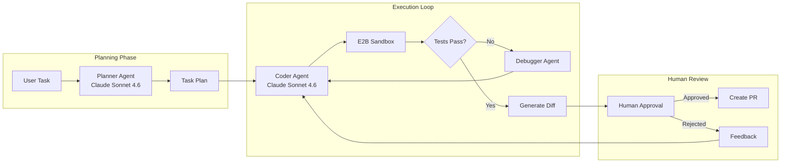
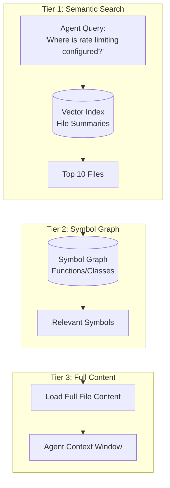

# Case Study: Autonomous Coding Agent

## The Problem

A developer tools company wants to build an **AI coding assistant** that can autonomously complete multi-file tasks: "Add authentication to this Express API" or "Refactor this module to use dependency injection."

**Constraints given in the interview:**
- Must work on codebases with 1,000+ files
- Cannot break existing functionality (tests must pass)
- Human must approve changes before commit
- Budget: under $0.50 per task completion

---

## The Interview Question

> "Design a coding agent that can take a task like 'Add rate limiting to all API endpoints' and produce a working, tested pull request."

---

## Solution Architecture



---

## Key Design Decisions

### 1. Why Separate Planner and Coder Agents?

**Answer:** The planning task requires **reasoning about the entire codebase** (which files to touch, what dependencies exist). The coding task requires **precise syntax generation**. By separating them, we can use extended thinking mode for planning and fast generation for coding. This also lets us checkpoint after planning for human review of the approach before execution.

### 2. Why E2B Sandbox Instead of Local Execution?

**Answer:** Security. The agent generates and runs code. Running it locally exposes the host system. E2B provides an isolated container that resets after each session. If the agent generates `rm -rf /`, it only destroys the sandbox.

### 3. Why Claude Sonnet 4.6 for Both?

**Answer:** Claude Opus 4.7 leads SWE-bench Pro at 64.3% and Claude Sonnet 4.6 delivers roughly 90% of that quality at ~40% of the price, which is the sweet spot for an agent that runs many turns per task. We enable "Extended Thinking" only on debugging loops, not on initial generation, to control costs.

---

## The Codebase Understanding Problem

The agent cannot fit 1,000 files into context. We solve this with **Tiered Retrieval**:



**Implementation:**
1. **Index file summaries** (generated by a smaller model during onboarding)
2. **Build a symbol graph** using tree-sitter for AST parsing
3. **Retrieve in stages**: summaries → symbols → full content

---

## The Self-Correction Loop

Agents fail. The key to reliability is **structured self-correction**:

```python
async def execute_with_retry(task: str, max_attempts: int = 3):
    for attempt in range(max_attempts):
        # Generate code
        code_changes = await coder_agent.generate(task)
        
        # Apply to sandbox
        sandbox.apply_changes(code_changes)
        
        # Run tests
        test_result = await sandbox.run_tests()
        
        if test_result.passed:
            return code_changes
        
        # Feed failure back to agent
        task = f"""
        Previous attempt failed. Error:
        {test_result.error}
        
        Original task: {task}
        
        Fix the issue.
        """
    
    raise MaxRetriesExceeded()
```

---

## Cost Breakdown

| Phase | Model | Tokens (avg) | Cost |
|-------|-------|--------------|------|
| Planning | Claude Sonnet 4.6 (Extended) | 8,000 in / 2,000 out | $0.06 |
| File Retrieval | Embeddings | 50,000 | $0.01 |
| Coding (per attempt) | Claude Sonnet 4.6 | 15,000 in / 3,000 out | $0.09 |
| Testing (3 runs avg) | - | - | $0.00 |
| **Total (1.5 attempts avg)** | | | **$0.21** |

Under budget at $0.21 per task.

---

## Interview Follow-Up Questions

**Q: How do you handle tasks that require changes across 20+ files?**

A: We break them into sub-tasks during planning. The planner outputs a DAG of changes with dependencies. The executor processes them in topological order, running tests incrementally. If step 5 breaks, we only re-run steps 5+ not the whole task.

**Q: What if the agent gets stuck in an infinite retry loop?**

A: Three safeguards: (1) Max attempt limit (3). (2) If the same test fails with the same error twice, escalate to human. (3) Total token budget per task ($0.50) triggers termination.

**Q: How do you prevent the agent from introducing security vulnerabilities?**

A: We run a static analysis tool (Semgrep) in the sandbox as part of the test suite. Security rule violations are treated as test failures and fed back to the agent for correction.

---

## Key Takeaways for Interviews

1. **Separate planning from execution** for checkpointing and cost control
2. **Sandbox all generated code** for security (E2B, Docker, etc.)
3. **Tiered retrieval solves large codebase scale**: summaries → symbols → content
4. **Self-correction loops need hard limits**: attempts, tokens, time

---

---

## Glossary

| Term | Simple explanation | Purpose |
|---|---|---|
| **Autonomous Coding Agent** | An AI system that can independently read a codebase, write code changes, run tests, and iterate—without per-step human guidance | The core product goal: take a high-level task and produce a working, tested pull request autonomously |
| **Planner Agent** | A specialized agent whose only job is to read the codebase and produce a structured task plan before any code is written | Separates high-level reasoning (what to change) from low-level syntax generation (how to write it), enabling checkpoint review |
| **Coder Agent** | The agent that receives the plan and generates the actual file edits | Focused purely on precise code generation rather than codebase understanding |
| **E2B Sandbox** | A cloud-hosted isolated container that resets after each session and safely runs agent-generated code | Prevents destructive agent actions (like `rm -rf /`) from affecting the host system |
| **Self-Correction Loop** | The cycle where the agent applies changes, runs tests, reads failure output, and tries again | Handles the reality that first-attempt code generation frequently fails; retry with error context fixes most issues |
| **Extended Thinking** | A reasoning mode where the model generates internal step-by-step reasoning before its final answer | Used selectively in the planning phase and on difficult debugging passes to improve accuracy without inflating cost on every step |
| **SWE-bench** | A benchmark that measures how often an AI agent can correctly resolve real GitHub issues on open-source repositories | The standard way to compare coding agent quality across models; Claude Opus 4.7 leads at 64.3% here |
| **Tiered Retrieval** | A three-level strategy: search file summaries first, then drill into symbol graphs, then load full file content | Solves the problem of fitting a 1,000-file codebase into a limited context window |
| **Symbol Graph** | A data structure mapping every function, class, and variable to the files and lines where they are defined and used | Lets the agent navigate large codebases by relationships rather than reading every file |
| **tree-sitter** | A fast, language-agnostic parser that builds an AST (abstract syntax tree) from source code | Used to construct the symbol graph without running the code; works for 40+ languages |
| **AST (Abstract Syntax Tree)** | A tree representation of source code structure where each node is a language construct (function, loop, etc.) | Enables precise symbol extraction and code navigation that string search cannot provide |
| **DAG (Directed Acyclic Graph)** | A graph of tasks with dependency edges and no cycles, showing which tasks must complete before others start | Used to order sub-tasks in the right sequence so a later change does not break an earlier one |
| **Topological Order** | Processing nodes in a DAG such that every dependency is completed before the node that depends on it | Ensures incremental test runs catch failures at the earliest point without re-running already-passing steps |
| **Token Budget** | A hard limit on total LLM tokens consumed per task | Acts as a cost and infinite-loop safeguard—terminates the agent if it exceeds $0.50 worth of tokens |
| **Max Attempt Limit** | A ceiling on the number of retry iterations the self-correction loop may execute | Prevents the agent from spending indefinitely on an unsolvable problem |
| **Semgrep** | An open-source static analysis tool that detects security vulnerabilities using code pattern rules | Integrated as a test-suite step so security violations are treated as test failures and fed back to the agent |
| **HITL (Human-in-the-Loop)** | A step where a human must review and approve before the agent's changes are committed | Ensures all autonomous code changes get human sign-off before merging, satisfying the safety constraint |
| **Diff** | A compact representation of exactly which lines were added, removed, or changed | The artifact shown to the human reviewer before they approve or reject the agent's work |
| **Pull Request (PR)** | A formal proposal to merge a set of code changes into a repository's main branch | The final deliverable of the autonomous agent; a real, reviewable artifact |
| **Embedding** | A numerical vector representation of a text chunk that captures its semantic meaning | Used to index file summaries so the agent can find relevant files by meaning rather than filename |
| **Onboarding (Codebase)** | The one-time process of generating file summaries and building the symbol graph when a new repo is first added | Runs once so that per-query retrieval is fast and cheap thereafter |

*Related chapters: [Tool Use and MCP](../07-agentic-systems/03-tool-use-and-mcp.md), [Error Handling](../07-agentic-systems/07-error-handling-and-recovery.md)*
