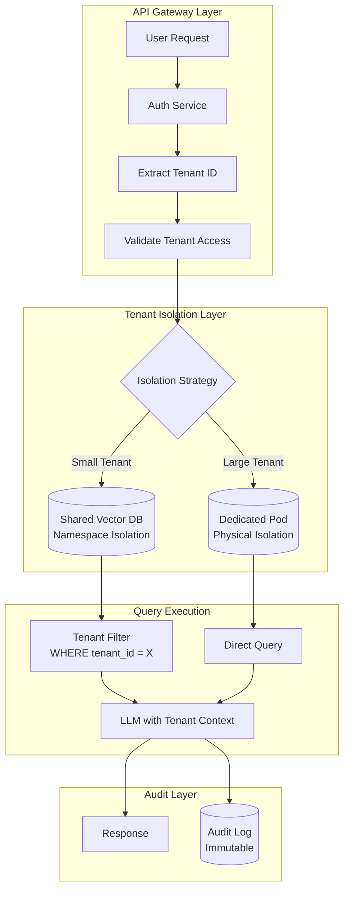
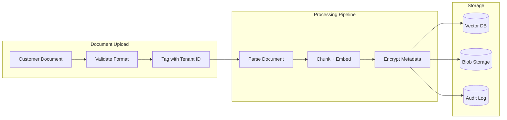

# Case Study: Multi-Tenant AI SaaS Platform

## The Problem

A B2B startup is building an **AI-powered document analysis platform** where each customer uploads their own contracts, and the AI answers questions about them. Customers include competitors who must never see each other's data.

**Constraints given in the interview:**
- 500 enterprise customers, each with 10,000-100,000 documents
- Absolute data isolation: Customer A's data cannot leak to Customer B
- Shared infrastructure for cost efficiency
- Compliance: SOC 2 Type II, GDPR
- Query latency under 2 seconds

---

## The Interview Question

> "Design a multi-tenant RAG system where Coca-Cola and Pepsi can both be customers, and there is zero risk of cross-tenant data leakage."

---

## Solution Architecture



---

## Key Design Decisions

### 1. Hybrid Isolation: Namespace vs Physical

**Answer:** Pure physical isolation (one database per tenant) is expensive. Pure namespace isolation (shared database with tenant_id filter) has leakage risk if a filter bug occurs. We use a **tiered approach**:

| Tier | Tenant Size | Isolation Method | Why |
|------|-------------|------------------|-----|
| Standard | <50K docs | Namespace in shared Qdrant | Cost efficient |
| Premium | 50K-500K docs | Dedicated Qdrant collection | Performance isolation |
| Enterprise | >500K docs | Dedicated Qdrant pod | Physical + regulatory |

### 2. Defense in Depth for Data Isolation

**Answer:** We never trust a single layer. Our isolation stack:

1. **API Gateway**: Validates tenant_id from JWT, rejects cross-tenant requests
2. **Database Layer**: Row-level security (RLS) enforces tenant_id filter at DB level
3. **Application Layer**: ORM wrapper automatically injects tenant filter
4. **LLM Layer**: System prompt explicitly states "You are answering for Tenant X only"
5. **Output Layer**: Post-generation filter scans for any document IDs not belonging to tenant

### 3. Why Not One Vector DB Per Tenant?

**Answer:** 500 tenants × $100/month per managed instance = $50K/month just for databases. By using namespace isolation for 80% of tenants, we reduce this to $8K/month. The remaining 20% on dedicated infrastructure pay a premium tier price.

---

## The Data Ingestion Pipeline



**Critical:** The tenant_id is attached at the **earliest possible point** (upload validation) and travels with the document through every stage. It is not derived or looked up later.

---

## Handling the Compliance Requirements

### SOC 2 Type II

| Control | Implementation |
|---------|----------------|
| Access logging | Every query logged with tenant_id, user_id, timestamp |
| Encryption at rest | AES-256 for blob storage, database-native for vector DB |
| Encryption in transit | TLS 1.3 everywhere |
| Access reviews | Automated quarterly reports from audit logs |

### GDPR Right to Deletion

```python
async def delete_tenant_data(tenant_id: str):
    # 1. Delete from vector DB
    await vector_db.delete(filter={"tenant_id": tenant_id})
    
    # 2. Delete from blob storage
    await blob_storage.delete_prefix(f"tenants/{tenant_id}/")
    
    # 3. Anonymize audit logs (cannot delete for compliance)
    await audit_log.anonymize(tenant_id=tenant_id)
    
    # 4. Generate deletion certificate
    return generate_deletion_certificate(tenant_id)
```

---

## Cost Analysis (500 Tenants)

| Component | Monthly Cost |
|-----------|--------------|
| Shared Vector DB (Qdrant Cloud) | $2,500 |
| Dedicated pods (20 enterprise tenants) | $4,000 |
| LLM costs (pooled, GPT-4o-mini) | $8,000 |
| Blob storage (S3) | $1,500 |
| Audit logging (CloudWatch) | $500 |
| **Total** | **$16,500/month** |
| **Per tenant average** | **$33/month** |

---

## Interview Follow-Up Questions

**Q: What if a bug in your ORM bypasses the tenant filter?**

A: Defense in depth. Even if the ORM fails, the database enforces RLS (Row-Level Security). The query `SELECT * FROM documents` internally becomes `SELECT * FROM documents WHERE tenant_id = current_tenant()`. This is enforced at the Postgres level, not the application level.

**Q: How do you handle a tenant who wants to export all their data?**

A: We provide a data portability API that streams all documents with their embeddings and metadata. The export is triggered by an admin, logged in the audit trail, and delivered to a customer-controlled S3 bucket (not our infrastructure).

**Q: What if the LLM hallucinates information from its training data that matches a competitor's confidential info?**

A: This is a real risk. We mitigate by: (1) Using only retrieval-grounded generation (the LLM cannot answer without retrieved docs). (2) Filtering outputs for any content that does not trace back to the tenant's uploaded documents. (3) Offering a "private model" tier where we fine-tune a tenant-specific model on their data only.

---

## Key Takeaways for Interviews

1. **Multi-tenancy is about layers**: never rely on a single isolation mechanism
2. **Tiered isolation balances cost and security**: not all tenants need dedicated infrastructure
3. **Tenant ID must be immutable and early**: tag at upload, not at query time
4. **Compliance is an architecture concern**: design for audit, deletion, and portability from day one

---

---

## Glossary

| Term | Simple explanation | Purpose |
|---|---|---|
| **Multi-Tenancy** | Serving multiple independent customers from a shared infrastructure where each customer's data is kept separate | Reduces infrastructure cost compared to fully dedicated deployments while maintaining isolation |
| **Tenant** | A single customer organization using the platform; their data must never be visible to other tenants | The fundamental unit of isolation; every piece of data must be tagged and restricted to its owning tenant |
| **Tenant ID** | A unique identifier assigned to each customer organization and attached to all their data | The primary key for all isolation logic; tagged at upload and enforced at every downstream layer |
| **Namespace Isolation** | Storing all tenants in the same database but using tenant_id filters to logically separate their data | Cost-efficient isolation for smaller tenants; vulnerable to filter bugs, so additional layers are required |
| **Physical Isolation** | Giving a tenant their own dedicated database pod or cluster that no other tenant shares | Eliminates cross-tenant leakage risk entirely; used here for enterprise tenants with >500K documents |
| **Defense in Depth** | Using multiple independent security controls so a failure in one layer does not expose data | The core isolation philosophy: API gateway + RLS + ORM wrapper + system prompt + output filter all enforce the same boundary |
| **RLS (Row-Level Security)** | A database feature that enforces tenant_id filtering directly at the query engine level | Ensures that even if application code has a bug and omits the filter, the database itself still restricts results |
| **JWT (JSON Web Token)** | A compact, signed token carried by the client that proves identity and contains claims like tenant_id | Used by the API gateway to authenticate requests and extract the tenant context without a database lookup |
| **ORM (Object-Relational Mapper)** | A code library that translates between application objects and database rows | Wrapped here to automatically inject tenant_id filters on every query so developers cannot accidentally omit them |
| **SOC 2 Type II** | A security compliance certification that verifies a company's controls have operated continuously over time | Required by enterprise buyers to trust the platform with their confidential contracts |
| **GDPR (General Data Protection Regulation)** | EU privacy law that gives individuals the right to have their data deleted | Drives the need for complete, certified tenant data deletion and audit log anonymization |
| **Right to Deletion** | A GDPR requirement to erase all personal data belonging to a user or organization on request | Implemented by deleting from vector DB and blob storage and anonymizing audit logs |
| **Deletion Certificate** | A document generated after tenant data deletion confirming what was deleted and when | Provides evidence of GDPR compliance to the tenant and regulators |
| **AES-256** | A symmetric encryption standard with a 256-bit key used to encrypt data at rest | Industry-standard encryption for blob storage; makes raw storage files unreadable without the key |
| **TLS 1.3** | The latest version of the Transport Layer Security protocol that encrypts data in transit | Ensures data is encrypted on every network hop between client, gateway, databases, and LLM APIs |
| **Blob Storage (S3)** | Object storage (Amazon S3) for large binary files like original contract PDFs | Stores the raw documents cheaply and durably; access is restricted by tenant prefix paths |
| **Qdrant Collection** | A named grouping within Qdrant that holds vectors for a specific dataset | Used as the unit of isolation for Premium tenants—each gets a dedicated collection with no namespace overlap |
| **Qdrant Pod** | A fully separate Qdrant server instance dedicated to a single tenant | Used for Enterprise tenants; provides both performance isolation and physical data separation |
| **Audit Log** | An immutable, timestamped record of every query, action, and access event | Required for SOC 2 compliance and useful for detecting unauthorized cross-tenant access attempts |
| **Data Portability** | The ability for a customer to export all their data in a standard, usable format | Required by GDPR and good practice; here implemented as a streaming export to the tenant's own S3 bucket |
| **Retrieval-Grounded Generation** | Constraining the LLM to only answer using retrieved documents rather than its training knowledge | Prevents the model from hallucinating competitor information it may have learned during pre-training |
| **Cross-Tenant Leakage** | A security failure where one tenant's data appears in another tenant's query results | The worst-case failure mode; prevented here by four independent enforcement layers |

*Related chapters: [LLM Security](../12-security-and-access/01-llm-security.md), [Access Control & Multi-Tenant Isolation](../12-security-and-access/02-access-control.md)*
