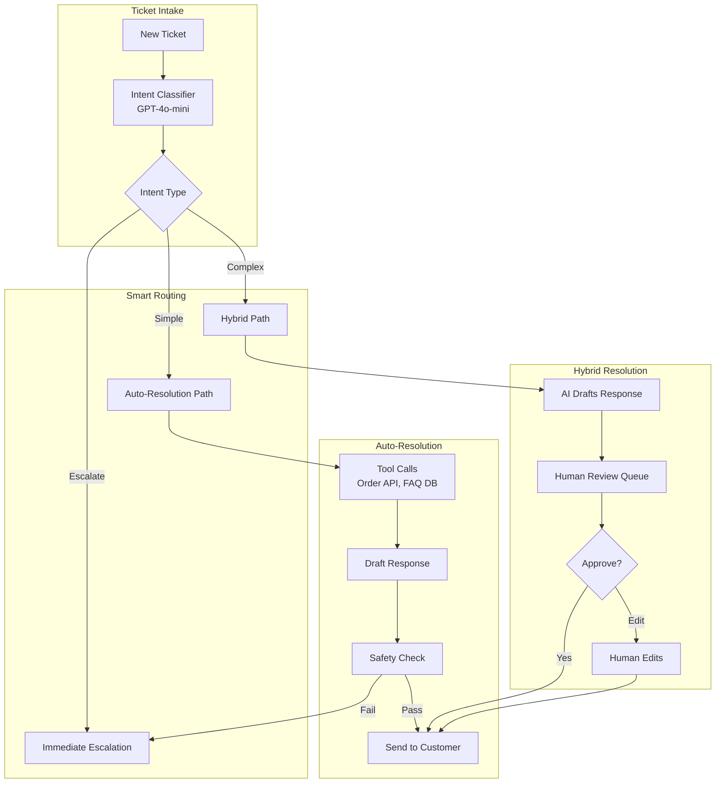
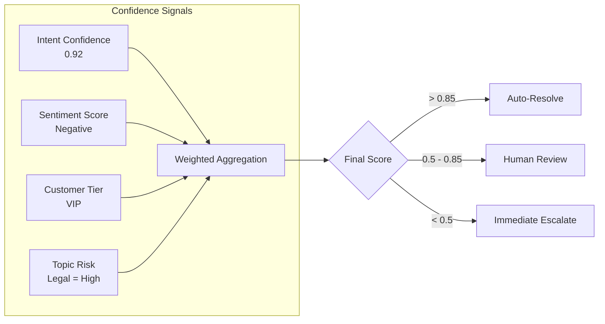
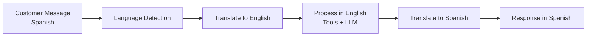

# Case Study: AI-Powered Customer Support

## The Problem

An e-commerce company handles **2 million support tickets per month**. They want an AI system that can automatically resolve 60% of tickets without human intervention, while seamlessly escalating complex issues.

**Constraints given in the interview:**
- 24/7 operation across 12 languages
- Must integrate with existing Zendesk and Salesforce
- Cannot make false promises (refunds, shipping dates)
- Human agents must be able to take over mid-conversation
- Cost target: $0.05 per resolved ticket

---

## The Interview Question

> "Design a customer support AI that handles 'Where is my order?' automatically but knows when to escalate 'I want to sue you for fraud' to a human."

---

## Solution Architecture



---

## Key Design Decisions

### 1. Three-Tier Routing (Auto / Hybrid / Escalate)

**Answer:** Not all tickets are equal. We classify into three paths:

| Path | Criteria | Example | Human Involvement |
|------|----------|---------|-------------------|
| **Auto** | High confidence, low risk | "Where is my order?" | None |
| **Hybrid** | Medium confidence or medium risk | "I want a refund" | Reviews AI draft |
| **Escalate** | Legal, threats, VIP, low confidence | "This is fraud" | Full human handling |

### 2. Tool-Based Resolution, Not Pure Generation

**Answer:** The AI does not "know" where the order is. It calls the Order API tool. This is critical for accuracy:

```python
@tool
def get_order_status(order_id: str) -> dict:
    """Retrieve real-time order status from OMS."""
    order = oms_client.get_order(order_id)
    return {
        "status": order.status,
        "shipped_date": order.shipped_at,
        "estimated_delivery": order.eta,
        "tracking_url": order.tracking_url
    }
```

The LLM orchestrates tools but never fabricates data.

### 3. Why Safety Check Before Send?

**Answer:** Even auto-resolved tickets go through a safety filter:

1. **Promise Detection**: Flags statements like "I guarantee" or "We will pay"
2. **Sentiment Mismatch**: Catches if AI sounds happy when customer is angry
3. **PII Leak**: Ensures no internal notes or other customer data appear
4. **Competitor Mention**: Flags if AI recommends a competitor

---

## The Escalation Intelligence

The hardest part is knowing **when** to escalate. We use a confidence score with multiple signals:



**Key insight:** A VIP customer asking a simple question still goes to Hybrid path because the cost of a mistake is higher.

---

## Multilingual Support

12 languages without 12 separate models:



**Why not native multilingual models?**

Cost. GPT-4o handles all 12 languages well. Using specialized models per language would require 12 deployments. Translation adds latency but keeps infrastructure simple.

---

## Human Takeover (Mid-Conversation)

When a human takes over, they need full context:

```python
def handoff_to_human(conversation_id: str, agent_id: str):
    conversation = get_conversation(conversation_id)
    
    # Generate summary for human agent
    summary = llm.generate(f"""
    Summarize this conversation for a human agent:
    - Customer issue
    - What AI already tried
    - Why escalation happened
    
    Conversation:
    {conversation.messages}
    """)
    
    # Create handoff package
    return {
        "summary": summary,
        "customer_sentiment": conversation.sentiment,
        "attempted_solutions": conversation.tool_calls,
        "full_transcript": conversation.messages,
        "customer_tier": conversation.customer.tier
    }
```

---

## Cost Analysis

| Component | Cost per Ticket |
|-----------|-----------------|
| Intent classification (GPT-4o-mini) | $0.002 |
| Tool calls (Order API, FAQ search) | $0.001 |
| Response generation (GPT-4o-mini) | $0.008 |
| Safety check | $0.003 |
| Translation (if needed, 30% of tickets) | $0.004 |
| **Average total** | **$0.018** |

At a 60% auto-resolution rate: **$0.03 per resolved ticket** (well under $0.05 target)

---

## Interview Follow-Up Questions

**Q: What if the AI keeps apologizing but never actually helps?**

A: We track "resolution effectiveness" not just "response sent." If a customer replies again within 24 hours on the same issue, that ticket is marked as "unresolved" and the AI pattern is flagged for review. We also run weekly analysis: "What phrases correlate with customer follow-ups?"

**Q: How do you handle a customer who insists on talking to a human?**

A: Explicit escalation phrases ("talk to a human", "speak to manager") trigger immediate handoff regardless of confidence score. We never argue with escalation requests.

**Q: What about customers who try to jailbreak the support AI?**

A: Input sanitization plus strict tool-only responses. The AI cannot be prompted to reveal system prompts because it does not generate free-form answers: it calls tools and summarizes their outputs. The system prompt is also extremely narrow: "You help with order issues for [Company]. You cannot discuss other topics."

---

## Key Takeaways for Interviews

1. **Tiered routing balances automation with risk**: not every ticket should be auto-resolved
2. **Tool-based grounding prevents hallucination**: the AI retrieves facts, it does not generate them
3. **Confidence is multi-dimensional**: intent clarity + sentiment + customer tier + topic risk
4. **Human handoff needs context**: summarize, do not just dump the transcript

---

---

## Glossary

| Term | Simple explanation | Purpose |
|---|---|---|
| **Intent Classifier** | A model that reads an incoming ticket and labels what the customer wants (track order, request refund, report fraud, etc.) | The entry point for all routing decisions; determines which automated path—if any—is safe to take |
| **Three-Tier Routing** | Splitting tickets into Auto (AI handles fully), Hybrid (AI drafts, human approves), and Escalate (full human handling) | Matches the automation level to the risk level of each ticket rather than treating all tickets the same |
| **Auto-Resolution Path** | The pipeline branch where the AI calls tools, drafts a response, passes a safety check, and sends it without human review | Handles simple high-confidence queries at near-zero marginal cost |
| **Hybrid Path** | The pipeline branch where the AI drafts a response but a human agent must review and optionally edit before it is sent | Balances automation speed with human oversight for medium-risk tickets like refund requests |
| **Tool Call** | An LLM action that invokes an external function or API (e.g., Order API, FAQ search) to retrieve real data | Prevents hallucination by ensuring the AI retrieves facts from systems of record rather than generating them |
| **OMS (Order Management System)** | The backend system that tracks real-time order status, shipping dates, and tracking links | The authoritative data source for "Where is my order?" queries; the AI calls it rather than guessing |
| **Safety Check** | An automated filter that scans the AI's draft response for promises, PII leaks, sentiment mismatches, and competitor mentions | The last gate before a response reaches the customer; catches outputs that could create legal or reputational risk |
| **Promise Detection** | A safety-check component that flags language like "I guarantee" or "We will refund" that make binding commitments | Prevents the AI from making unauthorized financial or service promises that the company cannot fulfill |
| **Sentiment Mismatch** | A safety flag triggered when the AI's tone is positive but the customer's message is angry or distressed | Catches tone-deaf responses that would worsen customer satisfaction even if factually correct |
| **PII Leak** | Accidentally including another customer's data or internal notes in an outbound message | A privacy violation that also erodes customer trust; checked for in every outbound response |
| **Confidence Score** | A weighted aggregate of intent certainty, customer sentiment, customer tier, and topic risk | The single number that determines which routing path a ticket takes |
| **Customer Tier** | A classification of a customer's account value or contract level (e.g., VIP, standard) | High-tier customers are routed to Hybrid or Escalate even for simple questions because errors cost more |
| **Topic Risk** | A severity label for the category of the customer's request (legal, fraud, standard inquiry) | Legal and fraud topics trigger immediate escalation regardless of confidence score |
| **Escalation** | Handing a conversation to a human agent to resolve | The safety valve that handles everything the AI should not attempt alone—threats, legal claims, VIP issues |
| **Handoff Package** | The structured summary (issue, prior attempts, sentiment, full transcript) generated when passing to a human | Lets the human agent understand the situation instantly without re-reading every message |
| **Multilingual Support** | The ability to receive messages in one language, process them in another, and reply in the original language | Enables 12-language support without deploying 12 separate specialized models |
| **Language Detection** | Automatically identifying which language a message is written in | Routes the message into the translate-in → process-in-English → translate-out pipeline |
| **Input Sanitization** | Removing or neutralizing malicious instructions embedded in customer messages | Prevents prompt injection attacks where customers try to override the AI's persona or access restricted functions |
| **Jailbreak** | An attempt by a user to bypass the AI's safety instructions through clever prompt phrasing | Mitigated here by restricting the AI to tool outputs only, so it cannot be prompted into free-form harmful responses |
| **Resolution Effectiveness** | A metric that marks a ticket as unresolved if the customer replies again within 24 hours on the same issue | Catches cases where the AI sent a response that technically "answered" but did not actually help the customer |
| **Zendesk / Salesforce** | CRM and ticketing platforms that manage customer communication and case records | The existing systems the AI must integrate with via APIs rather than replacing |
| **GPT-4o-mini** | OpenAI's fast, low-cost model used for intent classification, response generation, and safety checks | Keeps the blended cost per ticket at $0.018, well within the $0.05 target |

*Related chapters: [Human-in-the-Loop Patterns](../07-agentic-systems/08-human-in-the-loop-patterns.md), [Guardrails Implementation](../13-reliability-and-safety/01-guardrails.md)*
