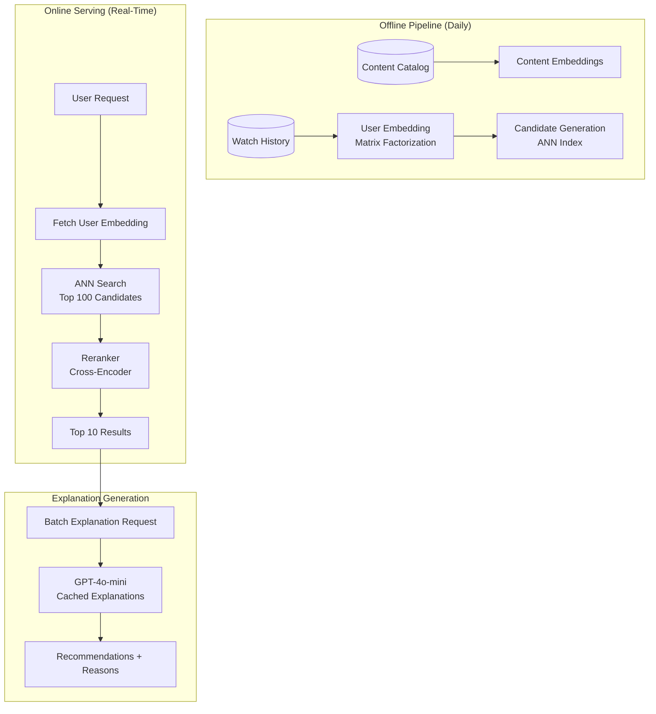
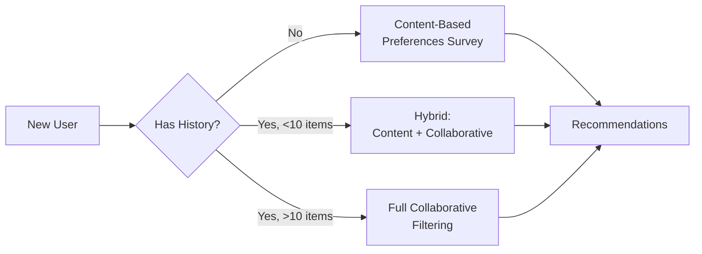

# Case Study: AI-Powered Recommendation Engine

## The Problem

A streaming platform with **50 million users** needs to build a recommendation system that combines collaborative filtering with LLM-generated explanations: "Because you enjoyed Inception, you might like Tenet for its mind-bending time mechanics."

**Constraints given in the interview:**
- Real-time recommendations (under 200ms p95)
- Must explain why each recommendation was made
- Cold-start handling for new users
- Privacy: cannot leak viewing history between users
- Daily active: 5M users, each viewing 10+ recommendation sets

---

## The Interview Question

> "Design a system that recommends movies AND explains the recommendation in natural language, at scale."

---

## Solution Architecture



---

## Key Design Decisions

### 1. Why Not Just Use LLM for Everything?

**Answer:** Scale economics. Calling an LLM for 50M users × 10 recommendation sets/day = 500M LLM calls daily. At $0.001 per call, that is $500K/day. Instead:

| Component | Role | Cost per User/Day |
|-----------|------|-------------------|
| Embedding lookup | Fetch precomputed vector | $0.00001 |
| ANN search | Find candidates | $0.0001 |
| Cross-encoder rerank | Score top 100 | $0.001 |
| LLM explanation | Natural language | $0.005 |
| **Total** | | **$0.006** |

The LLM is only used for the final explanation, not the ranking itself.

### 2. Explanation Caching

**Answer:** Most explanations can be cached. "Because you watched Inception" applies to thousands of users. We cache explanations at the (content_pair, reason_type) level:

```python
cache_key = f"{source_movie}:{target_movie}:{reason_type}"
# Example: "inception:tenet:time_mechanics"

explanation = cache.get(cache_key)
if not explanation:
    explanation = generate_explanation(source_movie, target_movie, reason_type)
    cache.set(cache_key, explanation, ttl=86400)
```

Cache hit rate: 85%+ after warmup.

### 3. Cold-Start Handling

**Answer:** New users have no history for collaborative filtering. We use a **Hybrid Approach**:



---

## The Personalized Explanation Challenge

The explanation must feel personal, not generic:

**Bad:** "Tenet is a popular thriller."
**Good:** "Because you enjoyed Inception's mind-bending plot, Tenet offers similar time-manipulation puzzles from the same director."

We achieve this by including user context in the prompt:

```python
prompt = f"""
Generate a 1-sentence explanation for why this user would enjoy {target_movie}.

User context:
- Recently watched: {recent_movies}
- Preferred genres: {genres}
- Dislikes: {dislikes}

Source movie that triggered this recommendation: {source_movie}
Reason category: {reason_type}

Explanation:
"""
```

---

## Latency Budget

| Stage | Target | Actual p95 |
|-------|--------|------------|
| User embedding lookup | 5ms | 3ms |
| ANN search (top 100) | 20ms | 15ms |
| Cross-encoder rerank | 50ms | 45ms |
| LLM explanation (cached) | 10ms | 8ms |
| LLM explanation (miss) | 500ms | 450ms |
| **Total (cache hit)** | **85ms** | **71ms** |
| **Total (cache miss)** | **575ms** | **513ms** |

To meet 200ms p95, we ensure 95%+ cache hit rate for explanations and generate explanations asynchronously for new content pairs.

---

## Interview Follow-Up Questions

**Q: How do you prevent the LLM from hallucinating facts about movies?**

A: The LLM receives a structured fact sheet for each movie (director, cast, themes, awards) as context. It can only use information from this sheet. We also have a post-generation validator that checks claims against our catalog metadata.

**Q: What if a user's taste changes rapidly?**

A: We use a **recency-weighted embedding update**. Recent watches are weighted 3x more than older ones. For real-time responsiveness, we maintain a "session embedding" that captures current-session behavior and blends it with the historical embedding.

**Q: How do you A/B test recommendation algorithms?**

A: We hash user_id to consistently assign users to experiment buckets. Each bucket can have different candidate generation, ranking, or explanation strategies. We track engagement metrics (click-through, watch time, skip rate) per bucket.

---

## Key Takeaways for Interviews

1. **LLMs for explanation, not ranking**: use traditional ML for scale, LLMs for personalization
2. **Cache aggressively**: explanations for content pairs are reusable across users
3. **Cold-start is a spectrum**: new users → content-based; some history → hybrid; full history → collaborative
4. **Latency budgets require cache hit rate targets**: design the cache around your latency SLA

---

---

## Glossary

| Term | Simple explanation | Purpose |
|---|---|---|
| **Collaborative Filtering** | A recommendation technique that finds users with similar taste and suggests what they liked | Core algorithm for recommending content at scale |
| **Matrix Factorization** | A math technique that decomposes a user-item rating matrix into compact vector representations | Converts raw watch history into numerical user and item embeddings |
| **Embedding** | A list of numbers that captures the meaning or characteristics of a user or piece of content | Enables fast similarity comparisons between users and items |
| **ANN (Approximate Nearest Neighbor)** | A search algorithm that quickly finds the most similar vectors without checking every single one | Retrieves candidate items in milliseconds from millions of options |
| **ANN Index** | A pre-built data structure that organizes embeddings for fast nearest-neighbor lookup | Makes real-time candidate retrieval possible at scale |
| **Cross-Encoder** | A model that jointly scores two items together (e.g., a user and a movie) for higher-accuracy ranking | Reranks the top candidates after ANN retrieval for better precision |
| **Reranker** | A model or algorithm that takes a list of candidates and re-orders them by predicted relevance | Improves final recommendation quality beyond what ANN alone provides |
| **Cold-Start Problem** | The challenge of making recommendations for new users who have no viewing history | Requires content-based or hybrid methods when collaborative filtering lacks data |
| **Content-Based Filtering** | Recommending items based on their attributes (genre, director, themes) rather than other users' behavior | Fallback strategy for new users with no collaborative-filtering data |
| **Hybrid Approach** | Combining multiple recommendation strategies (e.g., content-based + collaborative) | Smoothly handles the spectrum from new users to established users |
| **Semantic Cache** | A cache that stores results keyed on meaning or content pairs rather than exact query strings | Avoids redundant LLM calls for explanations that apply to many users |
| **Cache Hit Rate** | The percentage of requests that are served from cache without a new computation | Determines whether latency and cost targets can be met |
| **p95 Latency** | The response time that 95 percent of requests complete within | Standard target for defining acceptable user-facing performance |
| **Recency-Weighted Embedding** | An embedding update where recent watch events count more than old ones | Keeps recommendations responsive to shifts in user taste |
| **Session Embedding** | A temporary vector built from a user's behavior in the current browsing session | Captures short-term intent that the long-term historical profile may miss |
| **A/B Testing** | Running two or more algorithm variants simultaneously on different user groups to compare outcomes | Provides evidence-based decisions on which recommendation strategy works better |
| **Experiment Bucket** | A deterministically assigned user group used for A/B testing | Ensures each user sees a consistent experience within an experiment |
| **LLM (Large Language Model)** | A neural network trained on vast text data that can generate and understand natural language | Generates personalized, human-readable explanations for each recommendation |
| **Hallucination** | When an LLM generates plausible-sounding but factually incorrect information | Must be prevented by grounding the model with structured fact sheets |
| **Latency Budget** | The total time allowance broken down across each stage of a pipeline | Guides design decisions so the end-to-end response stays under the SLA |
| **TTL (Time-to-Live)** | The duration a cached item is kept before it expires and must be regenerated | Controls freshness vs. computation cost for cached explanations |
| **Offline Pipeline** | A batch process that runs periodically (e.g., daily) to precompute data used at serving time | Moves expensive computation off the critical real-time path |
| **Online Serving** | The real-time system that handles user requests and returns results within a latency target | Combines precomputed data with lightweight real-time signals |

*Related chapters: [Semantic Caching](../08-memory-and-state/05-semantic-caching.md), [Cost Optimization](../04-inference-optimization/07-cost-optimization-playbook.md)*
