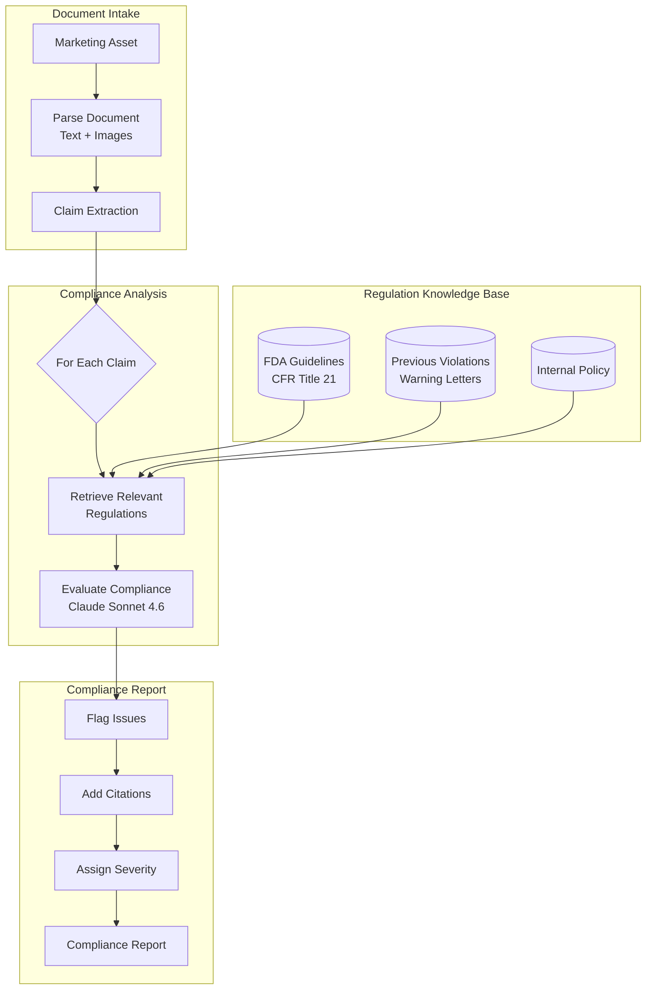
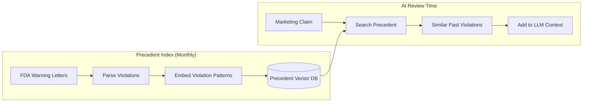
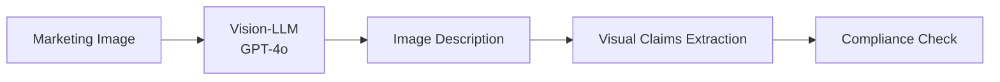

# Case Study: Regulatory Compliance Automation

## The Problem

A pharmaceutical company must ensure all marketing materials comply with **FDA regulations**. Currently, legal review takes 2 weeks per asset. They want AI to pre-screen materials and flag issues, reducing legal review to 2 days.

**Constraints given in the interview:**
- Must cite specific regulation sections, not just "this seems wrong"
- False negatives (missing violations) are unacceptable
- False positives (over-flagging) should be under 20%
- 500 marketing assets per month
- Audit trail required for regulatory inspection

---

## The Interview Question

> "Design a system that reviews pharmaceutical marketing materials and identifies specific regulatory violations with citations."

---

## Solution Architecture



---

## Key Design Decisions

### 1. Claim Extraction Before Compliance Check

**Answer:** Marketing materials are dense. Checking the entire document against regulations is inefficient. We first extract individual **claims**:

> **Why (the rationale):** Sending an entire 20-page marketing document to the LLM at once makes it hard to cite the precise sentence that violates a regulation, inflates token cost, and makes it easy to miss claims buried in captions or image alt-text. Extracting discrete claims first lets each one be checked against the most relevant regulation subset with a clear location reference.
> **When to use:** Claim-first decomposition is the right pattern whenever documents mix compliant and non-compliant content and each assertion needs its own regulatory citation. For short, uniform documents (e.g., single-sentence disclaimers), direct full-document checking is simpler.
> **Nuances & gotchas:** Claim extraction itself can hallucinate or miss implied claims (e.g., an image of a patient running implies mobility efficacy without any text). A separate visual claim extractor is required for non-text assets; relying only on text extraction will miss a significant class of FDA-triggering content.

```python
claims = extract_claims(document)
# Example output:
# [
#   {"text": "Reduces symptoms by 80%", "type": "efficacy", "location": "page 2, para 3"},
#   {"text": "No side effects reported", "type": "safety", "location": "page 3, header"},
#   {"text": "Recommended by doctors", "type": "endorsement", "location": "page 1, image"}
# ]
```

Each claim is then checked independently against relevant regulations.

### 2. Why RAG Over Fine-Tuning for Regulations?

**Answer:** Regulations change. FDA updates guidance documents monthly. Fine-tuning would require retraining after each update. RAG allows us to:

> **Why (the rationale):** Fine-tuning bakes regulation text into model weights, meaning every FDA guidance update requires a retraining cycle (days to weeks). RAG externalizes the regulation index so an update is a re-indexing job that completes in minutes and the audit trail can capture exactly which version of a regulation was active during each review.
> **When to use:** Prefer RAG over fine-tuning whenever the source corpus changes frequently (monthly or faster) or when exact provenance of the retrieved text is required for audit purposes. Fine-tuning is preferable only when the regulation corpus is stable and latency requirements are extremely tight.
> **Nuances & gotchas:** RAG precision on regulation retrieval is sensitive to chunking strategy; splitting at paragraph boundaries works poorly for CFR sections where the legally operative language often spans multiple subsections. Cross-reference resolution (a section cites another section) also requires special handling or the LLM may miss the full rule.
- Update the regulation index immediately when new guidance is released
- Track which version of regulations was used for each review (audit trail)
- Show the exact source passage to legal reviewers

### 3. Conservative Flagging Strategy

**Answer:** False negatives (missed violations) are catastrophic; false positives (extra review) just cost time. We use a **threshold hierarchy**:

> **Why (the rationale):** In regulated pharmaceutical marketing, a missed violation can result in an FDA warning letter, product recall, or consent decree — costs that dwarf the cost of additional legal review hours. Asymmetric stakes justify optimizing for recall (catch everything) and accepting a 20% false-positive rate as the engineering budget.
> **When to use:** Bias toward recall (conservative flagging) whenever the cost of a false negative vastly exceeds the cost of a false positive — common in compliance, security, and medical triage contexts. Bias toward precision (fewer flags) when false-positive cost is high — e.g., in customer-facing recommendation systems where over-blocking ruins UX.
> **Nuances & gotchas:** The four-tier threshold hierarchy can give legal reviewers false confidence in the <50% "log only" tier; a claim logged as likely compliant can still be a violation. The system must never communicate "compliant" to downstream teams; only "no flag raised at this threshold" to preserve appropriate human oversight.

| Confidence | Action |
|------------|--------|
| >90% violation | Flag as HIGH severity |
| 70-90% potential | Flag as MEDIUM, cite concern |
| 50-70% unclear | Flag as LOW, note ambiguity |
| <50% likely compliant | No flag, but log for audit |

We never output "compliant" without logging the reasoning.

---

## The Precedent Database

Regulations are often ambiguous. Previous FDA warning letters clarify how rules are enforced:



**Why this matters:** A claim like "clinically proven" might seem fine based on regulations alone. But if we find 5 warning letters where FDA cited companies for using "clinically proven" without specific trial data, that is a red flag.

---

## The Audit Trail Requirement

Every decision must be traceable:

```python
compliance_decision = {
    "claim_id": "claim_003",
    "claim_text": "No side effects reported",
    "decision": "VIOLATION",
    "severity": "HIGH",
    "regulation_cited": "21 CFR 202.1(e)(5)",
    "regulation_text": "Advertisements shall not contain claims that...",
    "precedent_cited": "Warning Letter 2023-FDA-04521",
    "reasoning": "Claim implies absolute safety, which contradicts...",
    "model_used": "claude-3-7-sonnet-20251022",
    "timestamp": "2025-12-21T10:30:00Z",
    "reviewer_id": null,  # Filled when human reviews
    "final_decision": null  # Filled after legal review
}
```

---

## Handling Images and Video

Pharmaceutical marketing includes visual claims (happy patients, before/after images):



**Example:** An image showing a patient running implies efficacy. If the drug is for arthritis, we check if clinical trials support "improved mobility" claims.

---

## Cost Analysis

| Stage | Cost per Asset |
|-------|----------------|
| Document parsing | $0.05 |
| Claim extraction | $0.15 |
| Regulation retrieval | $0.02 |
| Compliance evaluation (per claim, avg 12 claims) | $1.80 |
| Image analysis (avg 5 images) | $0.75 |
| Report generation | $0.10 |
| **Total** | **$2.87** |

For 500 assets/month: **$1,435/month** (vs. $50K+/month for equivalent legal hours)

---

## Interview Follow-Up Questions

**Q: How do you handle regulations that require human judgment?**

A: We do not replace humans; we triage. The system flags issues with confidence scores. Low-confidence flags go to senior counsel. High-confidence clear items skip detailed review. This reduces the 2-week review to 2 days by focusing human attention on edge cases.

**Q: What if FDA updates a regulation mid-month?**

A: We have a "Regulation Watch" service that monitors FDA RSS feeds and Federal Register updates. When a relevant update is detected, we re-index and flag any recent reviews that might be affected by the change.

**Q: How do you explain the AI's reasoning to regulators during an audit?**

A: Every decision includes the full reasoning chain: the claim extracted, the regulation retrieved, the precedent cited, and the model's evaluation. We can show regulators exactly why a decision was made, with version numbers for all components.

---

## Key Takeaways for Interviews

1. **Claim extraction first**: break complex documents into reviewable units
2. **Precedent databases beat pure regulation text**: how rules are enforced matters
3. **Conservative thresholds for high-stakes domains**: optimize for recall, not precision
4. **Audit trails are architecture**: design for explainability from day one

---

---

## Glossary

| Term | Simple explanation | Purpose |
|---|---|---|
| **FDA (Food and Drug Administration)** | The US government agency that regulates pharmaceutical products and their marketing | Sets the regulations this system must verify compliance against |
| **CFR (Code of Federal Regulations)** | The official compilation of US federal regulations, including FDA rules for drug advertising (Title 21) | Provides the specific legal citations used in compliance reports |
| **RAG (Retrieval-Augmented Generation)** | A technique where an LLM is given retrieved documents as context instead of relying solely on its training | Lets the system always reference the latest regulation text without retraining |
| **Fine-Tuning** | Retraining a model on domain-specific data to bake in specialized knowledge | Alternative to RAG; rejected here because regulations change too frequently |
| **Claim Extraction** | Parsing a document to identify individual factual or promotional assertions | Breaks complex marketing materials into discrete, checkable units |
| **Efficacy Claim** | A statement about how well a drug works (e.g., "reduces symptoms by 80%") | High-risk claim type that must be backed by clinical trial data |
| **Safety Claim** | A statement about a drug's side-effect profile (e.g., "no side effects") | Frequently flagged by FDA because absolute safety claims are rarely supportable |
| **False Negative** | A real violation that the system fails to detect | Catastrophic outcome in compliance; the system is tuned to minimize these |
| **False Positive** | A legitimate item incorrectly flagged as a violation | Adds reviewer workload; the system targets keeping these under 20% |
| **Precision** | The fraction of flagged items that are genuine violations | Measures how trustworthy the system's flags are |
| **Recall** | The fraction of actual violations that the system catches | Priority metric for compliance; missing a violation is worse than over-flagging |
| **Vector Database** | A database that stores and searches embeddings by similarity | Stores regulation passages and precedent violations for fast retrieval |
| **Precedent Database** | A collection of past FDA warning letters showing how rules have been enforced | Adds real-world enforcement context that raw regulation text lacks |
| **Warning Letter** | An official FDA notice sent to a company for a specific regulatory violation | Evidence of how ambiguous regulations are interpreted in practice |
| **Audit Trail** | A chronological log of every decision, including what data and model version was used | Required for regulatory inspection and legal accountability |
| **Confidence Score** | A numerical estimate of how certain the model is about a compliance decision | Drives the severity tier assigned to each flagged claim |
| **Threshold Hierarchy** | A tiered set of confidence cutoffs that determine action (flag HIGH, MEDIUM, LOW, or log only) | Balances sensitivity and reviewer workload in a principled way |
| **Severity Level** | A label (HIGH / MEDIUM / LOW) assigned to a flagged issue based on confidence | Helps legal reviewers prioritize which flags need immediate attention |
| **Vision-LLM** | A large language model capable of understanding image content as well as text | Extracts implicit claims from marketing images (e.g., before/after photos) |
| **Regulation Watch** | A monitoring service that detects when FDA updates or releases new guidance documents | Keeps the knowledge base current without manual intervention |
| **Federal Register** | The US government's official daily journal where new rules and proposed changes are published | Source monitored to detect regulatory updates in near real time |
| **Claim Type** | A category label (efficacy, safety, endorsement) assigned to each extracted claim | Routes each claim to the most relevant regulation sections |

*Related chapters: [RAG Fundamentals](../06-retrieval-systems/01-rag-fundamentals.md), [Guardrails Implementation](../13-reliability-and-safety/01-guardrails.md)*
