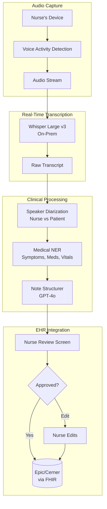
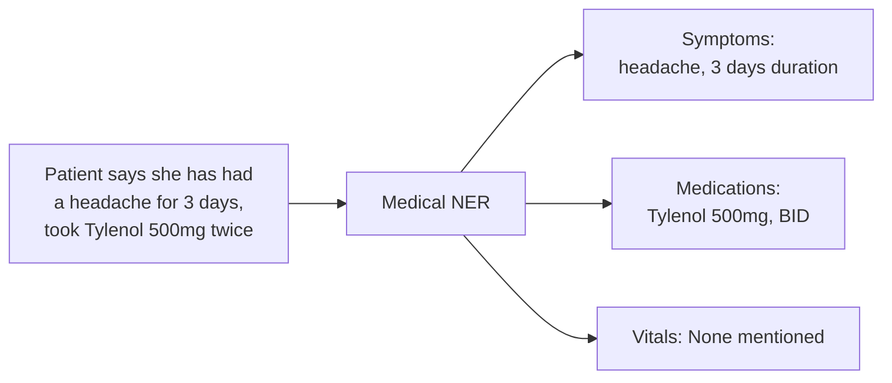

# Case Study: Voice AI Assistant for Healthcare

## The Problem

A hospital network wants a **voice-based AI assistant** that helps nurses document patient encounters. The nurse speaks naturally; the AI produces structured clinical notes in real-time.

**Constraints given in the interview:**
- HIPAA compliance (PHI handling)
- Works in noisy hospital environments
- Real-time transcription (under 500ms latency)
- Must use medical terminology correctly
- Integration with existing EHR (Epic/Cerner)

---

## The Interview Question

> "Design a voice assistant that a nurse can speak to during a patient visit, and it generates a structured clinical note in the EHR."

---

## Solution Architecture



---

## Key Design Decisions

### 1. On-Premise ASR for HIPAA

**Answer:** PHI cannot leave the hospital network without encryption and BAA. We deploy Whisper Large v3 on local GPU servers rather than using cloud APIs:

| Option | Latency | HIPAA | Cost |
|--------|---------|-------|------|
| Cloud ASR (OpenAI) | 200ms | Requires BAA, data leaves network | $0.006/min |
| On-prem Whisper | 150ms | Full control, no data egress | $0.002/min (amortized GPU) |

On-prem wins on both latency and compliance.

### 2. Speaker Diarization: Who Said What

**Answer:** The note must distinguish "Patient reports headache" from "Nurse observes patient grimacing." We use:

```python
# Pyannote for speaker diarization
diarization = pipeline("audio.wav")
# Output: [(0.0, 1.5, "SPEAKER_0"), (1.5, 4.2, "SPEAKER_1"), ...]

# Map speakers based on voice profile
roles = identify_roles(diarization, known_nurse_voiceprint)
# Output: {"SPEAKER_0": "nurse", "SPEAKER_1": "patient"}
```

The nurse's device captures their voiceprint at setup for role identification.

### 3. Medical NER for Structured Extraction

**Answer:** We need structured data, not just prose. Medical NER extracts:



We use a fine-tuned BioBERT model for NER, not the LLM, because NER needs to be fast and deterministic.

---

## Handling Noisy Environments

Hospitals are loud. We use multiple strategies:

1. **Directional microphones** on nurse devices focus on nearby speech
2. **Noise-robust ASR models** (Whisper was trained on noisy data)
3. **Confidence thresholds**: if ASR confidence is <0.7, we flag for nurse review rather than guessing
4. **Keyword spotting**: medical terms have custom pronunciation models

---

## The Structured Note Format

The LLM produces SOAP-format notes:

```python
note_prompt = f"""
Generate a clinical SOAP note from this encounter transcript.

Transcript:
{transcript_with_speakers}

Extracted entities:
- Symptoms: {symptoms}
- Medications: {medications}
- Vitals: {vitals}

Output format:
S (Subjective): Patient's reported symptoms
O (Objective): Nurse's observations and measurements
A (Assessment): Clinical impression
P (Plan): Next steps, orders
"""
```

---

## EHR Integration (FHIR)

The output must be machine-readable for the EHR:

```json
{
  "resourceType": "DocumentReference",
  "status": "current",
  "type": {
    "coding": [{"system": "http://loinc.org", "code": "34117-2", "display": "History and physical note"}]
  },
  "subject": {"reference": "Patient/12345"},
  "author": [{"reference": "Practitioner/nurse789"}],
  "content": [{
    "attachment": {
      "contentType": "text/plain",
      "data": "base64-encoded-soap-note"
    }
  }],
  "context": {
    "encounter": {"reference": "Encounter/visit456"}
  }
}
```

---

## Latency Budget

| Stage | Target | Actual |
|-------|--------|--------|
| Audio capture to VAD | 50ms | 30ms |
| ASR transcription | 200ms | 150ms |
| Diarization | 100ms | 80ms |
| NER extraction | 50ms | 40ms |
| LLM structuring | 500ms | 450ms |
| **Total (end-to-end)** | **900ms** | **750ms** |

For real-time feel, we stream partial transcripts while NER and LLM run on completed sentences.

---

## Interview Follow-Up Questions

**Q: How do you handle medical abbreviations and jargon?**

A: We maintain a custom vocabulary list that maps abbreviations (PRN, BID, SOB) to full terms. This is injected into both the ASR model (for better recognition) and the LLM prompt (for correct expansion in notes).

**Q: What if the nurse makes a correction mid-sentence?**

A: We detect correction patterns ("actually, I mean...", "no wait, it's...") and use only the corrected version. The LLM is instructed to prefer later statements when conflicts exist.

**Q: How do you ensure the AI does not miss critical information?**

A: We have a "completeness check" that verifies the note includes all extracted entities. If NER found "chest pain" but the SOAP note does not mention it, we flag for nurse review. We also run a "safety critical" detector that escalates mentions of suicidal ideation, abuse, or other mandatory reporting triggers.

---

## Key Takeaways for Interviews

1. **On-prem for healthcare**: HIPAA often requires local processing
2. **Diarization is essential**: who said what matters clinically
3. **Hybrid extraction**: fast NER for structure, LLM for prose generation
4. **Always have human review**: especially for clinical documentation

---

---

## Glossary

| Term | Simple explanation | Purpose |
|---|---|---|
| **HIPAA (Health Insurance Portability and Accountability Act)** | US law requiring strict privacy and security protections for patient health information | Drives the on-premise deployment decision to keep data inside the hospital network |
| **PHI (Protected Health Information)** | Any patient data that can identify an individual, such as name, diagnosis, or visit date | Must never leave the hospital network unencrypted; governs the entire architecture |
| **BAA (Business Associate Agreement)** | A contract between a healthcare provider and a vendor ensuring HIPAA-compliant data handling | Required before any cloud vendor can process PHI |
| **EHR (Electronic Health Record)** | A digital system that stores a patient's medical history, notes, orders, and test results | The destination where the AI-generated clinical notes must be stored |
| **Epic / Cerner** | Two dominant EHR software platforms used by hospitals | The specific systems this voice assistant must integrate with |
| **VAD (Voice Activity Detection)** | Software that detects when someone is speaking versus when there is silence or noise | Reduces wasted ASR processing by only transcribing real speech |
| **ASR (Automatic Speech Recognition)** | Software that converts spoken audio into written text | The first processing step that turns a nurse's spoken words into a transcript |
| **Whisper Large v3** | An open-source ASR model developed by OpenAI, notable for accuracy in noisy environments | Chosen for on-premise deployment because it handles hospital background noise well |
| **Speaker Diarization** | The process of identifying and labeling which speaker said each segment of audio | Essential for distinguishing nurse observations from patient-reported symptoms |
| **Pyannote** | An open-source Python library for speaker diarization | Tool used to segment the audio by speaker before role identification |
| **Voiceprint** | A mathematical representation of a person's unique vocal characteristics | Used to map audio segments to the "nurse" or "patient" role |
| **NER (Named Entity Recognition)** | A model that identifies and classifies specific terms (like drug names or symptoms) in text | Extracts structured medical data from free-form speech before the LLM runs |
| **BioBERT** | A BERT-based language model fine-tuned on biomedical text | Chosen for medical NER because it understands clinical terminology accurately |
| **SOAP Note** | A structured clinical documentation format: Subjective, Objective, Assessment, Plan | Standard note format used by clinicians; the output format of the AI assistant |
| **FHIR (Fast Healthcare Interoperability Resources)** | A standard for representing and exchanging electronic health information | Allows the AI-generated note to be imported into Epic/Cerner as a proper record |
| **Confidence Threshold** | A minimum quality score below which the ASR output is flagged for nurse review rather than accepted | Prevents low-quality transcriptions from silently entering the clinical record |
| **Keyword Spotting** | Detecting specific important words (like medical terms) in an audio stream with high accuracy | Improves ASR accuracy for medical terminology that standard models may misrecognize |
| **On-Premise Deployment** | Running software on servers physically located within the hospital rather than in the cloud | Required by HIPAA to ensure PHI never leaves the controlled network |
| **PRN / BID** | Latin abbreviations for medication schedules: "as needed" and "twice daily" | Common clinical shorthand that must be correctly expanded in notes |
| **Custom Vocabulary** | A list of domain-specific terms added to an ASR or LLM model to improve recognition | Ensures medical abbreviations and drug names are transcribed and rendered correctly |
| **Completeness Check** | A validation step confirming every entity extracted by NER appears in the final SOAP note | Catches cases where the LLM inadvertently omits a clinically important detail |
| **Mandatory Reporting Trigger** | A safety-critical detector that flags legal obligations such as abuse or suicidal ideation | Ensures the AI does not silently process legally required interventions |
| **Latency Budget** | The total allowable response time broken into per-stage targets | Drives every technical choice to meet the 500ms real-time transcription goal |

*Related chapters: [Model Taxonomy](../02-model-landscape/01-model-taxonomy.md), [Reliability Patterns](../13-reliability-and-safety/03-reliability-patterns.md)*
