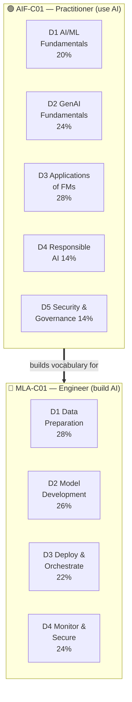

# Exam Overview, Full Coverage Map & Study Plan

This page is your **control tower**. It maps every official exam objective to where it's taught, gives you a week-by-week plan, and lists exam-day tactics. If you can check off every row in the coverage maps below, you have covered 100% of what the blueprints list.

> The blueprints themselves say they are "*not a comprehensive list of the content on the exam*" — so this course teaches each objective **plus the surrounding context** AWS expects you to reason about.

Sources: [AIF-C01 exam guide (v1.4)](https://docs.aws.amazon.com/aws-certification/latest/examguides/ai-practitioner-01.html) · [MLA-C01 exam guide (v1.0)](https://docs.aws.amazon.com/aws-certification/latest/examguides/machine-learning-engineer-associate-01.html)

---

## Table of contents
- [The two exams at a glance](#at-a-glance)
- [Question types you'll face](#question-types)
- [How scoring actually works](#scoring)
- [AIF-C01 full coverage map](#aif-map)
- [MLA-C01 full coverage map](#mla-map)
- [4-week study plans](#study-plans)
- [Exam-day tactics](#exam-day)
- [The "if you see X, think Y" reflex table](#reflexes)

---

## The two exams at a glance 

| Fact | AIF-C01 | MLA-C01 |
|---|---|---|
| Passing score | 700 / 1000 | 720 / 1000 |
| Scored questions | 50 (+15 unscored) | 50 (+15 unscored) |
| Duration | 90 minutes | 130 minutes |
| Cost | $100 | $150 |
| Validity | 3 years | 3 years |
| Delivery | Pearson VUE test center or online proctored | Same |

---

## Question types you'll face 

Both exams use these formats (know them so none surprise you):

| Type | What it is | Strategy |
|---|---|---|
| **Multiple choice** | 1 correct of 4 | Eliminate 2 obvious distractors first |
| **Multiple response** | 2+ correct of 5+ | Must get *all* right — no partial credit |
| **Ordering** | Put 3–5 steps in order | Anchor the first and last step, fill middle |
| **Matching** | Match 3–7 pairs | Do the ones you're sure of, deduce the rest |
| **Case study** | 1 scenario, several questions | Each scored separately; re-read scenario per question |

> There is **no penalty for guessing** — never leave a question blank.

---

## How scoring actually works 

- **Scaled score 100–1000**, not a raw percentage. AIF passes at **700**, MLA at **720**.
- **Compensatory model**: you do *not* need to pass each domain — only the overall exam. A weak domain can be offset by strong ones.
- **15 unscored questions** are mixed in unmarked — they don't count, so don't panic if some seem off-topic or unusually hard.

---

## AIF-C01 full coverage map 

Every task statement from the official guide, mapped to its lesson. ✅ = fully covered.

### Domain 1 — Fundamentals of AI and ML (20%) → [lesson](aif-c01/01-fundamentals-of-ai-and-ml.md)
| Task | Official objective | Covered |
|---|---|---|
| 1.1 | Explain basic AI concepts & terminologies (AI/ML/DL, NN, CV, NLP, model, algorithm, training/inference, bias, fairness, fit, LLM; inference types; data types; supervised/unsupervised/reinforcement) | ✅ |
| 1.2 | Identify practical AI use cases; when *not* to use ML; pick ML technique (regression/classification/clustering); AWS managed AI services | ✅ |
| 1.3 | Describe the ML development lifecycle (pipeline stages, model sources, production methods, AWS services per stage, MLOps, model + business metrics) | ✅ |

### Domain 2 — Fundamentals of Generative AI (24%) → [lesson](aif-c01/02-fundamentals-of-generative-ai.md)
| Task | Official objective | Covered |
|---|---|---|
| 2.1 | Basic GenAI concepts (tokens, chunking, embeddings, vectors, prompt engineering, transformer LLMs, FMs, multi-modal, diffusion); use cases; FM lifecycle | ✅ |
| 2.2 | Capabilities & limitations (advantages; hallucination/interpretability/nondeterminism; model selection factors; business value & metrics) | ✅ |
| 2.3 | AWS infra for GenAI (SageMaker JumpStart, Bedrock, PartyRock, Amazon Q; advantages; infra benefits; cost tradeoffs incl. token pricing & provisioned throughput) | ✅ |

### Domain 3 — Applications of Foundation Models (28%) → [lesson](aif-c01/03-applications-of-foundation-models.md)
| Task | Official objective | Covered |
|---|---|---|
| 3.1 | Design considerations (model selection criteria; inference params like temperature; **RAG** + vector DBs: OpenSearch, Aurora, Neptune, DocumentDB, RDS PostgreSQL; customization cost tradeoffs; **agents**) | ✅ |
| 3.2 | Prompt engineering (context/instruction/negative prompts/latent space; CoT, zero/one/few-shot, templates; best practices; risks: poisoning, hijacking, jailbreaking) | ✅ |
| 3.3 | Training & fine-tuning (pre-training, fine-tuning, continuous pre-training; instruction tuning, transfer learning; data prep, RLHF) | ✅ |
| 3.4 | Evaluate FM performance (human eval, benchmarks; ROUGE, BLEU, BERTScore; business alignment) | ✅ |

### Domain 4 — Guidelines for Responsible AI (14%) → [lesson](aif-c01/04-responsible-ai.md)
| Task | Official objective | Covered |
|---|---|---|
| 4.1 | Responsible AI features (bias, fairness, inclusivity, robustness, safety, veracity); Guardrails for Bedrock; sustainability; legal risks; dataset characteristics; bias/variance effects; SageMaker Clarify, Model Monitor, Amazon A2I | ✅ |
| 4.2 | Transparent & explainable models (transparent vs not; SageMaker Model Cards; safety-vs-transparency tradeoffs; human-centered design) | ✅ |

### Domain 5 — Security, Compliance & Governance (14%) → [lesson](aif-c01/05-security-compliance-governance.md)
| Task | Official objective | Covered |
|---|---|---|
| 5.1 | Secure AI systems (IAM, encryption, Macie, PrivateLink, shared responsibility; source citation & data lineage; secure data engineering; prompt injection, encryption at rest/in transit) | ✅ |
| 5.2 | Governance & compliance (ISO, SOC, algorithm accountability; Config, Inspector, Audit Manager, Artifact, CloudTrail, Trusted Advisor; data governance; Generative AI Security Scoping Matrix) | ✅ |

---

## MLA-C01 full coverage map 

### Domain 1 — Data Preparation for ML (28%) → [lesson](mla-c01/01-data-preparation.md)
| Task | Official objective | Covered |
|---|---|---|
| 1.1 | Ingest & store data (formats: Parquet/JSON/CSV/ORC/Avro/RecordIO; S3, EFS, FSx for NetApp ONTAP; streaming: Kinesis, Flink, Kafka; storage tradeoffs; extract via S3/EBS/RDS/DynamoDB; Data Wrangler & Feature Store ingest; merge via Glue/Spark) | ✅ |
| 1.2 | Transform data & feature engineering (cleaning, outliers, imputation, dedup; scaling/binning/log/normalization; one-hot/binary/label encoding/tokenization; Data Wrangler, Glue, DataBrew; streaming transforms Lambda/Spark; Ground Truth, Mechanical Turk) | ✅ |
| 1.3 | Ensure data integrity & prep for modeling (pre-training bias metrics CI/DPL; fix imbalance: synthetic data/resampling; encryption, classification, anonymization, masking; PII/PHI/residency; Glue Data Quality; SageMaker Clarify; shuffling/augmentation; load into EFS/FSx) | ✅ |

### Domain 2 — ML Model Development (26%) → [lesson](mla-c01/02-ml-model-development.md)
| Task | Official objective | Covered |
|---|---|---|
| 2.1 | Choose a modeling approach (ML algorithm capabilities; AWS AI services; interpretability; SageMaker built-in algorithms; JumpStart & Bedrock built-ins/templates; cost-based selection) | ✅ |
| 2.2 | Train & refine models (epoch/steps/batch size; early stopping, distributed training; model size factors; regularization: dropout/weight decay/L1/L2; hyperparameter tuning: random/Bayesian; SageMaker AMT; ensembling/stacking/boosting; pruning/compression; Model Registry) | ✅ |
| 2.3 | Analyze model performance (confusion matrix, F1, precision, recall, RMSE, ROC/AUC; baselines; over/underfitting; SageMaker Clarify; shadow vs production variant; Model Debugger; convergence) | ✅ |

### Domain 3 — Deployment & Orchestration of ML Workflows (22%) → [lesson](mla-c01/03-deployment-and-orchestration.md)
| Task | Official objective | Covered |
|---|---|---|
| 3.1 | Select deployment infra (versioning/rollback; real-time vs batch; CPU/GPU provisioning; endpoint types: serverless/real-time/async/batch; containers; SageMaker Neo; orchestrators: Airflow/Pipelines; multi-model/multi-container; targets: endpoints/K8s/ECS/EKS/Lambda) | ✅ |
| 3.2 | Create & script infra (on-demand vs provisioned; scaling policies; IaC: CloudFormation/CDK; containers ECR/ECS/EKS/BYOC; SageMaker endpoint auto-scaling; VPC; SageMaker SDK) | ✅ |
| 3.3 | CI/CD pipelines (CodePipeline/CodeBuild/CodeDeploy; Git; blue-green/canary/linear; EventBridge + Pipelines; automated tests; retraining mechanisms; Gitflow/GitHub Flow) | ✅ |

### Domain 4 — Monitoring, Maintenance & Security (24%) → [lesson](mla-c01/04-monitoring-maintenance-and-security.md)
| Task | Official objective | Covered |
|---|---|---|
| 4.1 | Monitor model inference (drift; data quality & performance monitoring; ML lens; SageMaker Model Monitor; anomaly detection; Clarify for data drift; A/B testing) | ✅ |
| 4.2 | Monitor & optimize infra & costs (perf metrics; X-Ray, CloudWatch Lambda/Logs Insights; CloudTrail; instance types; Cost Explorer/Budgets/Trusted Advisor; tagging; Inference Recommender & Compute Optimizer; Spot/On-Demand/Reserved/Savings Plans) | ✅ |
| 4.3 | Secure AWS resources (IAM roles/policies, bucket policies, SageMaker Role Manager; SageMaker security features; network access control; CI/CD security; least privilege; VPC/subnet/security groups isolation) | ✅ |

---

## 4-week study plans 

### 🟢 AIF-C01 — 2 to 3 weeks (foundational)
| Week | Focus | Deliverable |
|---|---|---|
| 1 | D1 + D2 lessons + linked service deep-dives; flashcards daily | D1/D2 practice Qs ≥ 80% |
| 2 | D3 (biggest, 28%) + D4 + D5; RAG, prompt engineering, Bedrock/SageMaker | D3/D4/D5 practice Qs ≥ 80% |
| 3 (optional) | Full review via cheatsheets; re-take all practice Qs; last-24-hrs sheet | Consistent ≥ 85% |

### 🔵 MLA-C01 — 4 to 6 weeks (associate)
| Week | Focus | Deliverable |
|---|---|---|
| 1 | D1 Data Prep + data/analytics service deep-dives | D1 practice Qs ≥ 75% |
| 2 | D2 Model Development + SageMaker training/tuning deep-dives | D2 practice Qs ≥ 75% |
| 3 | D3 Deployment & Orchestration + endpoints/CI-CD deep-dives | D3 practice Qs ≥ 75% |
| 4 | D4 Monitoring & Security + cost/monitoring deep-dives | D4 practice Qs ≥ 75% |
| 5–6 | Full mixed review, hands-on SageMaker Studio, re-take practice, last-24-hrs | Consistent ≥ 80% |

> **Golden rule for a first-attempt pass:** don't just recognize a service name — be able to say *what it does*, *when you'd pick it over the alternative*, and *what it costs you* (latency, money, ops). That's exactly how the scenario questions are written.

---

## Exam-day tactics 

1. **Flag-and-move.** If a question takes >90 seconds, flag it, guess, move on. Come back with fresh eyes.
2. **Read the last sentence first** on long scenarios — it tells you what's actually being asked, so you read the scenario with purpose.
3. **Watch for the "most cost-effective" / "least operational overhead" / "fastest to market" qualifier** — it changes which correct-looking answer is *the* answer. Managed/serverless usually wins "least overhead"; Spot/serverless usually wins "cost".
4. **Eliminate out-of-scope services.** If an option names a service that has nothing to do with AI/ML/data (e.g., a random IoT or media service), it's usually a distractor.
5. **"AWS-native managed service over build-it-yourself"** is the default AWS-preferred answer unless the question stresses control/customization.
6. **Never leave blanks** — no guessing penalty.

---

## The "if you see X, think Y" reflex table 

Build these reflexes — they resolve a large share of scenario questions instantly.

| If the question mentions… | Think… |
|---|---|
| Managed access to FMs (Anthropic, Meta, Amazon Titan) via one API | **Amazon Bedrock** |
| Build/train/deploy your *own* ML models, full lifecycle | **Amazon SageMaker** |
| Add safety filters / block topics / redact PII on a GenAI app | **Guardrails for Amazon Bedrock** |
| Grounding an LLM on *your* private documents without retraining | **RAG** (Bedrock Knowledge Bases + a vector store) |
| Store embeddings / vector search | **OpenSearch**, Aurora/RDS pgvector, Neptune, DocumentDB |
| Detect bias & explain model predictions | **SageMaker Clarify** |
| Detect drift / monitor a live model's data quality | **SageMaker Model Monitor** |
| Human review of low-confidence predictions | **Amazon A2I** |
| Extract text/data from scanned documents & forms | **Amazon Textract** |
| Find entities/sentiment/PII in text | **Amazon Comprehend** |
| Image/video analysis, moderation, faces | **Amazon Rekognition** |
| Speech-to-text | **Amazon Transcribe** · Text-to-speech → **Amazon Polly** |
| Language translation | **Amazon Translate** · Chatbot → **Amazon Lex** |
| Enterprise semantic search | **Amazon Kendra** · Business GenAI assistant → **Amazon Q** |
| Recommendations | **Amazon Personalize** · Online fraud → **Amazon Fraud Detector** |
| Discover a document model's provenance/intended use | **SageMaker Model Cards** |
| Discover & protect PII/sensitive data in S3 | **Amazon Macie** |
| Private connectivity to AWS services (no internet) | **AWS PrivateLink / VPC endpoints** |
| Audit API calls / who did what | **AWS CloudTrail** · Compliance reports → **AWS Artifact** |

Each of these is explained in depth in the [service deep-dives](README.md#-shared-aws-service-deep-dives-linked-from-both-tracks).
