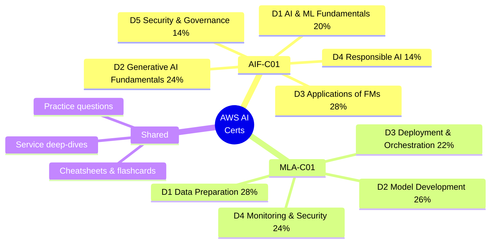
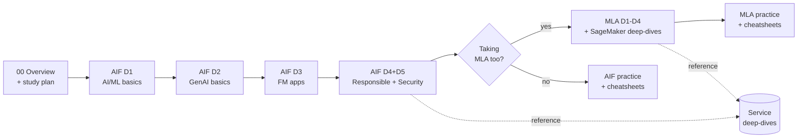

# AWS AI Certification — From Scratch, Explained Intuitively

A complete, visual, from-first-principles course for passing **two AWS certifications on the first attempt**:

| | 🟢 **AI Practitioner** | 🔵 **ML Engineer – Associate** |
|---|---|---|
| **Exam code** | AIF-C01 | MLA-C01 |
| **Level** | Foundational | Associate |
| **Who it's for** | Anyone who *uses* AI on AWS (PM, analyst, dev, leader) | Engineers who *build & operate* ML on AWS |
| **Coding required?** | No | Yes (conceptual — you read/reason about code) |
| **Questions** | 65 (50 scored + 15 unscored) | 65 (50 scored + 15 unscored) |
| **Time** | 90 min | 130 min |
| **Passing score** | **700** / 1000 | **720** / 1000 |
| **Cost** | $100 USD | $150 USD |
| **Prereqs** | None | ~1 yr SageMaker + ML experience recommended |

> **Which should you take?** If you're new to AWS AI, start with **AIF-C01** — it builds the vocabulary and mental models. **MLA-C01** goes deeper into building, deploying, and operating ML on SageMaker. This course teaches both; the AIF-C01 track is the on-ramp to the MLA-C01 track, and they **share** the service deep-dives.

Sources: [AIF-C01 exam guide](https://docs.aws.amazon.com/aws-certification/latest/examguides/ai-practitioner-01.html) · [MLA-C01 exam guide](https://docs.aws.amazon.com/aws-certification/latest/examguides/machine-learning-engineer-associate-01.html) · [AIF-C01 official page](https://aws.amazon.com/certification/certified-ai-practitioner/) · [MLA-C01 official page](https://aws.amazon.com/certification/certified-machine-learning-engineer-associate/)

---

## How this course is designed to make you pass

Every concept page follows the same intuition-first template:

1. **🧠 Mental model first** — a plain-English analogy so the idea *clicks* before any jargon.
2. **📊 Visual** — a Mermaid diagram (renders live on GitHub), ASCII sketch, or comparison table.
3. **⚙️ The AWS specifics** — the exact services, features, and terms the exam tests.
4. **🎯 On the exam** — how AWS *phrases* this, the traps and distractors, and the "if you see X, pick Y" reflexes.
5. **🔗 Sources** — official AWS docs linked for every claim, so you can verify and go deeper.

---

## 📚 Course map

### Start here
- **[00 — Exam Overview & Study Plan](00-exam-overview-and-study-plan.md)** — full blueprint coverage map, 4-week plan, exam-day tactics.

### 🟢 AIF-C01 — AI Practitioner track (by official domain)
| # | Domain | Weight | File |
|---|---|---|---|
| 1 | Fundamentals of AI and ML | 20% | [aif-c01/01-fundamentals-of-ai-and-ml.md](aif-c01/01-fundamentals-of-ai-and-ml.md) |
| 2 | Fundamentals of Generative AI | 24% | [aif-c01/02-fundamentals-of-generative-ai.md](aif-c01/02-fundamentals-of-generative-ai.md) |
| 3 | Applications of Foundation Models | 28% | [aif-c01/03-applications-of-foundation-models.md](aif-c01/03-applications-of-foundation-models.md) |
| 4 | Guidelines for Responsible AI | 14% | [aif-c01/04-responsible-ai.md](aif-c01/04-responsible-ai.md) |
| 5 | Security, Compliance & Governance | 14% | [aif-c01/05-security-compliance-governance.md](aif-c01/05-security-compliance-governance.md) |
| — | Practice questions + explanations | — | [aif-c01/99-practice-questions.md](aif-c01/99-practice-questions.md) |

### 🔵 MLA-C01 — ML Engineer Associate track (by official domain)
| # | Domain | Weight | File |
|---|---|---|---|
| 1 | Data Preparation for ML | 28% | [mla-c01/01-data-preparation.md](mla-c01/01-data-preparation.md) |
| 2 | ML Model Development | 26% | [mla-c01/02-ml-model-development.md](mla-c01/02-ml-model-development.md) |
| 3 | Deployment & Orchestration of ML Workflows | 22% | [mla-c01/03-deployment-and-orchestration.md](mla-c01/03-deployment-and-orchestration.md) |
| 4 | Monitoring, Maintenance & Security | 24% | [mla-c01/04-monitoring-maintenance-and-security.md](mla-c01/04-monitoring-maintenance-and-security.md) |
| — | Practice questions + explanations | — | [mla-c01/99-practice-questions.md](mla-c01/99-practice-questions.md) |

### 🧩 Shared AWS service deep-dives (linked from both tracks)
[Amazon Bedrock](services/bedrock.md) · [Amazon SageMaker](services/sagemaker.md) · [SageMaker built-in features](services/sagemaker-features.md) · [Amazon Q](services/amazon-q.md) · [Comprehend](services/comprehend.md) · [Rekognition](services/rekognition.md) · [Textract](services/textract.md) · [Transcribe](services/transcribe.md) · [Polly](services/polly.md) · [Translate](services/translate.md) · [Lex](services/lex.md) · [Kendra](services/kendra.md) · [Personalize & Fraud Detector](services/personalize-and-fraud-detector.md) · [Data & analytics services](services/data-and-analytics.md) · [Security & governance services](services/security-and-governance.md)

### 🃏 Cheatsheets & rapid review
- [Service cheatsheet — "what & when to use"](cheatsheets/service-cheatsheet.md)
- [Flashcards — rapid Q→A recall](cheatsheets/flashcards.md)
- [Last-24-hours review sheet](cheatsheets/last-24-hours-review.md)

---

## 🗓️ Suggested study order

> **Tip:** Read a domain page → skim the services it links → do that domain's practice questions → review the flashcards for it. Repeat. The night before, read only the [last-24-hours sheet](cheatsheets/last-24-hours-review.md).

---

*Part of [ai-system-design-guide](../README.md). Content is grounded in the official AWS exam guides and AWS documentation, with sources cited on every page. AWS updates services frequently — always confirm against [AWS docs](https://docs.aws.amazon.com/) before exam day.*
