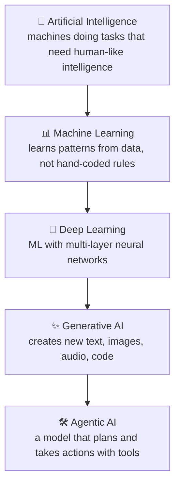
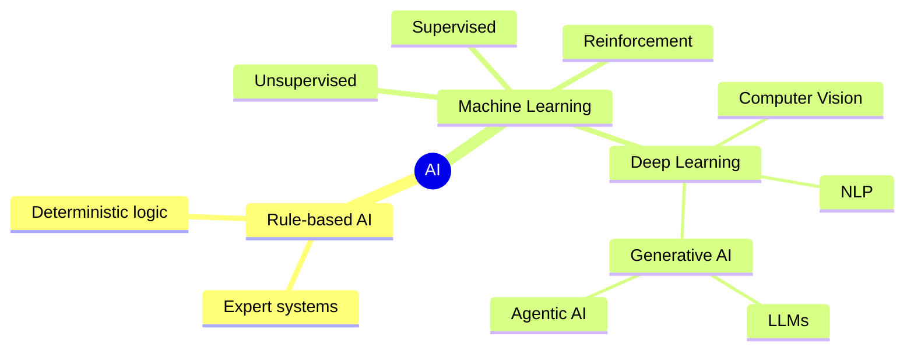
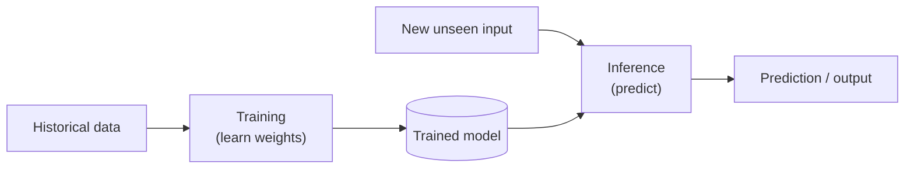
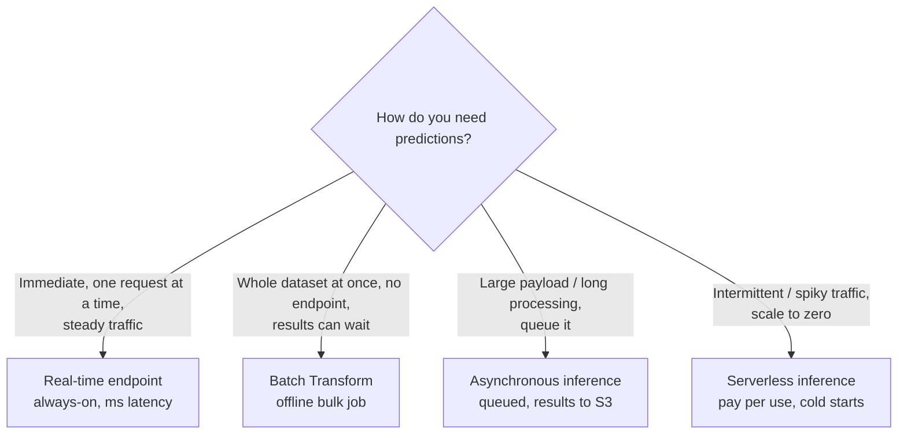
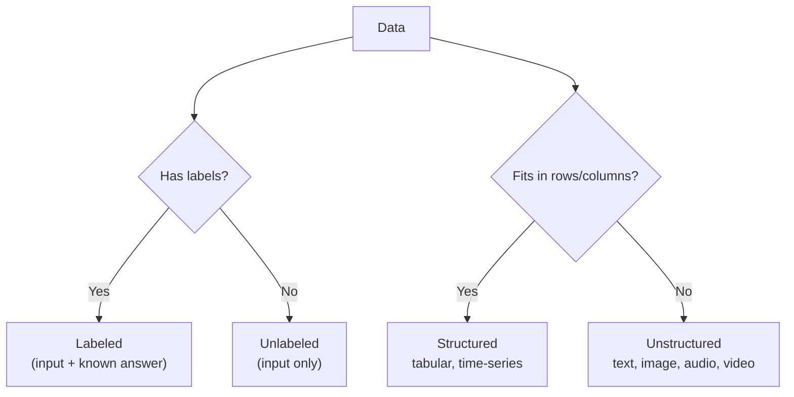
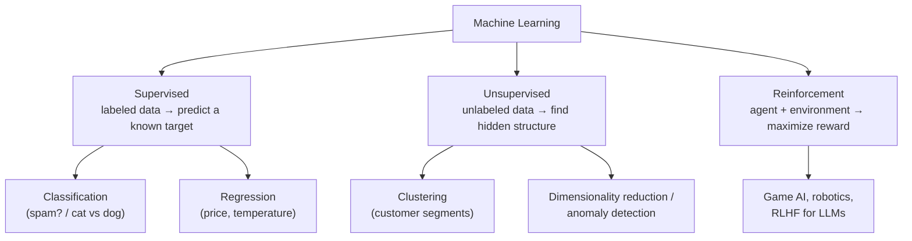
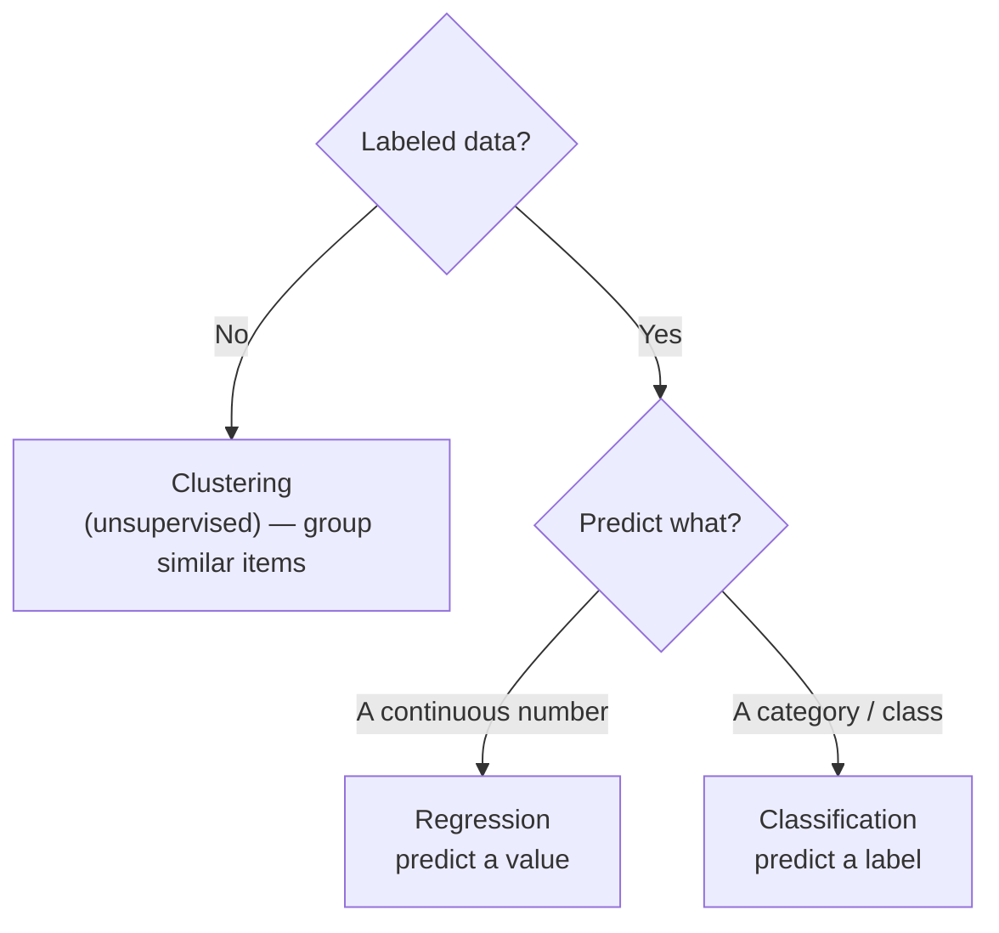
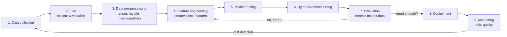
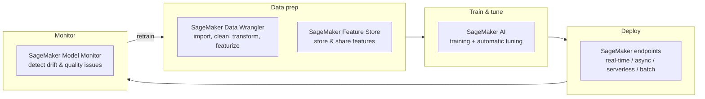
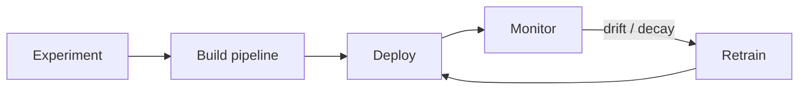

# Domain 1: Fundamentals of AI and ML

This is the foundation lesson for the **AWS Certified AI Practitioner (AIF-C01)** exam. Domain 1 is **20% of the scored exam** — roughly 10 of the 50 scored questions — and every later domain (Generative AI, Foundation Models, Responsible AI, Security) reuses the vocabulary you build here. Master this and the rest of the exam gets dramatically easier.

> Scope note: AWS refreshed this exam guide (the current version now folds **generative AI**, **agentic AI**, **foundation models**, and the **asynchronous / serverless** inference types into Domain 1, and renamed the ML platform to **Amazon SageMaker AI**). This lesson teaches the current task statements verbatim, plus the surrounding context AWS expects you to reason about. Source: [AIF-C01 Domain 1 exam guide](https://docs.aws.amazon.com/aws-certification/latest/ai-practitioner-01/ai-practitioner-01-domain1.html).

---

## Table of Contents
- [The big picture: how everything nests](#big-picture)
- [1.1 Core AI vocabulary](#vocab)
- [1.1 AI vs ML vs Deep Learning vs GenAI vs Agentic AI](#nesting)
- [1.1 Training vs inferencing](#train-infer)
- [1.1 Types of inferencing: batch, real-time, async, serverless](#inference-types)
- [1.1 Types of data in AI models](#data-types)
- [1.1 Supervised, unsupervised, reinforcement learning](#learning-types)
- [1.1 Bias, fairness, and fit](#bias-fit)
- [1.2 Where AI/ML adds value — and where it does NOT](#value)
- [1.2 Pick the technique: regression vs classification vs clustering](#technique)
- [1.2 Real-world applications](#applications)
- [1.2 Traditional ML vs Foundation Models](#ml-vs-fm)
- [1.2 AWS managed AI/ML services](#aws-services)
- [1.3 The ML development lifecycle (pipeline)](#lifecycle)
- [1.3 Sources of models & methods to use them in production](#sources)
- [1.3 AWS services mapped to each pipeline stage](#stage-map)
- [1.3 MLOps fundamentals](#mlops)
- [1.3 Model metrics vs business metrics](#metrics)
- [Exam traps & quick-fire review](#traps)
- [References](#references)

---

## The big picture: how everything nests <a name="big-picture"></a>

🧠 **Mental model:** Think of AI as a set of **Russian nesting dolls**. The biggest doll is **Artificial Intelligence** (any machine doing "smart" things). Inside it is **Machine Learning** (machines that learn patterns from data instead of being hand-coded). Inside that is **Deep Learning** (ML using many-layered neural networks). And a specific, huge use of deep learning gives us **Generative AI** and the **Large Language Models** that power it. **Agentic AI** wraps a GenAI model with tools and a goal so it can *take actions*, not just answer.



**Plain English:** Every ML system is AI, but not every AI system is ML (a hand-coded rules engine is AI but not ML). Every deep-learning system is ML, and generative AI is a *kind* of deep learning.

---

## 1.1 Core AI vocabulary <a name="vocab"></a>

These are the exact terms the exam names. Learn the **one-line definition** and a **concrete example** for each.

| Term | Plain-English definition | Example |
|---|---|---|
| **Artificial Intelligence (AI)** | Any technique that lets machines mimic human intelligence (reasoning, perceiving, deciding). | A chess engine; a spam filter. |
| **Machine Learning (ML)** | A subset of AI where the system *learns patterns from data* rather than following explicitly coded rules. | Predicting house prices from past sales. |
| **Deep Learning (DL)** | ML using **neural networks with many layers**; excels at images, audio, and language. | Face recognition, speech-to-text. |
| **Neural network** | A model of interconnected "neurons" in layers; each connection has a learned **weight**. Loosely inspired by the brain. | The engine inside DL models. |
| **Computer vision (CV)** | AI that interprets **images and video** (detect, classify, locate objects). | Detecting a defect on a factory line. |
| **Natural Language Processing (NLP)** | AI that understands and generates **human language** (text or speech). | Sentiment analysis, translation. |
| **Model** | The **trained artifact** — the learned parameters (weights) that map inputs to outputs. | The `.tar.gz` file you deploy to an endpoint. |
| **Algorithm** | The **procedure/recipe** used to learn the model from data (e.g., XGBoost, linear regression, gradient descent). | The training method, not the result. |
| **Training** | The process of **learning** the model's parameters from data. | Feeding 1M labeled images to fit weights. |
| **Inferencing** | Using the **trained model to make predictions** on new data. | Sending a new photo to get a label. |
| **Bias** | Systematic error; unfair skew toward/against groups, or (statistically) an oversimplified model. | A résumé screener favoring one gender. |
| **Fairness** | The goal that a model treats individuals/groups **equitably**. | Equal approval rates across demographics. |
| **Fit** | How well the model matches the data pattern — **underfit**, **good fit**, or **overfit**. | See [bias & fit](#bias-fit). |
| **Large Language Model (LLM)** | A very large deep-learning model trained on massive text to predict the next token; powers chat/generation. | Claude, Titan, Llama. |
| **Generative AI (GenAI)** | AI that **creates new content** (text, image, audio, code) rather than just classifying. | Writing a marketing email. |
| **Agentic AI** | A GenAI model given **tools + a goal** so it can plan multi-step tasks and **take actions**. | An agent that books travel by calling APIs. |

> **Model vs Algorithm** is a classic distractor. **Algorithm = recipe** (how you learn). **Model = cake** (what you get after training). If a question says "which *algorithm*," it wants a *method* (XGBoost, k-means); "which *model*" wants the trained/deployable thing.

---

## 1.1 AI vs ML vs Deep Learning vs GenAI vs Agentic AI <a name="nesting"></a>

🧠 **Mental model:** Same nesting dolls, now with the *distinguishing question* for each layer.

| Layer | The question it answers | How it differs from the layer outside it |
|---|---|---|
| **AI** | "Can a machine act intelligently?" | The umbrella — includes hand-coded rules, no data needed. |
| **ML** | "Can it *learn* from data?" | Learns patterns instead of hard-coded rules. |
| **Deep Learning** | "Can it learn *complex* patterns (images, speech, language)?" | Uses many-layer neural nets; needs lots of data + compute. |
| **Generative AI** | "Can it *create new* content?" | Generates output vs classifying/predicting a value. |
| **Agentic AI** | "Can it *act* toward a goal?" | Adds planning, memory, and tool use on top of GenAI. |



🎯 **On the exam — "if you see X, pick Y":**
- "Creates a summary / image / draft email" → **Generative AI**.
- "Predicts a number or category from tabular data" → **traditional ML** (not GenAI).
- "Plans multiple steps and calls tools/APIs autonomously" → **Agentic AI**.
- "Rules never change, no data learning" → that's **AI but not ML**.

---

## 1.1 Training vs inferencing <a name="train-infer"></a>

🧠 **Mental model:** **Training is studying for the exam** (slow, expensive, done once in a while, needs lots of examples). **Inference is taking the exam** (fast, done constantly, one question at a time).



| | Training | Inference |
|---|---|---|
| **What happens** | Model *learns* parameters from data | Model *applies* learned parameters to new input |
| **Frequency** | Occasional (initial + retraining) | Continuous, in production |
| **Compute cost** | High (often GPUs, hours–days) | Lower per call, but adds up at scale |
| **Optimized for** | Throughput on big datasets | Latency and/or cost per prediction |

---

## 1.1 Types of inferencing: batch, real-time, async, serverless <a name="inference-types"></a>

🧠 **Mental model:** How do you want to *receive* your predictions?
- **Real-time** = a phone call — answer *now*, one at a time, always online.
- **Batch** = a nightly mail run — collect everything, process in bulk, get results later.
- **Asynchronous** = a dry cleaner ticket — drop off a big/slow job, get a claim ticket, pick up results when ready.
- **Serverless** = a vending machine — nothing running until someone shows up; scales to zero.



| Type | Best for | Payload / time limits | Cost model | Watch-outs |
|---|---|---|---|---|
| **Real-time** | Fraud checks, chatbots, recommendations needing instant response | Small payloads, ms–sec latency | Pay for instance **while it runs (always-on)** | Costs money even when idle |
| **Batch Transform** | Scoring a whole dataset, no persistent endpoint | Very large datasets (GBs), can run for hours/days | Pay only for the **job duration** | Not for real-time needs |
| **Asynchronous** | Large payloads / long inference (video, big docs) | Payloads up to **1 GB**, processing up to **1 hour**; request & response via **S3** | Pay for instance; **can scale to zero** when idle | Client must poll or use **SNS** notifications |
| **Serverless** | Intermittent/unpredictable traffic, dev/test | Payload up to **4 MB**, up to **60 s** processing | Pay **per use**, no idle charge | **Cold starts** add latency |

🎯 **On the exam — reflexes:**
- "Score millions of records overnight, no endpoint needed" → **Batch Transform**.
- "Immediate response, steady traffic" → **Real-time endpoint**.
- "Large payload (e.g., long video/doc) or long processing time, needs a queue" → **Asynchronous inference**.
- "Spiky/intermittent traffic, want to pay nothing when idle, can tolerate cold start" → **Serverless inference**.

Source: [Inference options in Amazon SageMaker AI](https://docs.aws.amazon.com/sagemaker/latest/dg/deploy-model-options.html).

---

## 1.1 Types of data in AI models <a name="data-types"></a>

🧠 **Mental model:** Data comes in two big buckets — **does it have answers attached (labeled)?** and **does it fit neatly in a table (structured)?**



| Data category | What it means | Example | Typical use |
|---|---|---|---|
| **Labeled** | Each record includes the correct answer/target | Emails tagged spam/not-spam | **Supervised** learning |
| **Unlabeled** | Inputs only, no target given | Raw customer transactions | **Unsupervised** learning |
| **Structured** | Organized in rows/columns (a table/DB) | Sales table, sensor readings | Regression, classification |
| **Unstructured** | No fixed schema | Documents, photos, call recordings | Deep learning, NLP, CV |
| **Tabular** | Structured rows & columns | A CSV of customers | XGBoost, linear models |
| **Time-series** | Values indexed by time | Daily stock price, hourly demand | **Forecasting** |
| **Image** | Pixel data | Product photos, X-rays | Computer vision |
| **Text** | Natural language strings | Reviews, tickets | NLP / LLMs |

> **Structured ≠ labeled.** A tidy sales table is *structured* but may be *unlabeled*. A folder of images can be *unstructured* yet *labeled*. Keep the two axes separate — the exam loves to blur them.

---

## 1.1 Supervised, unsupervised, reinforcement learning <a name="learning-types"></a>

🧠 **Mental model:**
- **Supervised** = studying with an **answer key** (labeled data).
- **Unsupervised** = handed a pile of stuff with **no answers** and asked to find groupings/structure.
- **Reinforcement** = training a **dog with treats** — learn by trial, reward, and penalty.



| Type | Data needed | Goal | Classic examples | AWS example |
|---|---|---|---|---|
| **Supervised** | **Labeled** | Predict a known output | Spam detection, price prediction | Most SageMaker built-in algorithms (XGBoost, Linear Learner) |
| **Unsupervised** | **Unlabeled** | Discover structure/groups | Customer segmentation, anomaly detection | k-means, Random Cut Forest |
| **Reinforcement (RL)** | Reward signal from an environment | Learn a policy that maximizes reward | Robotics, game-playing, **RLHF** for tuning LLMs | RL training in SageMaker |

🎯 **On the exam — reflexes:**
- "We have historical data **with answers/labels**" → **Supervised**.
- "We have data but **no labels**, find natural groups" → **Unsupervised (clustering)**.
- "An agent **learns by trial-and-error with rewards**" → **Reinforcement learning**.
- "Human feedback used to align an LLM" → **RLHF** (a reinforcement-learning technique).

---

## 1.1 Bias, fairness, and fit <a name="bias-fit"></a>

🧠 **Mental model of fit:** Think of drawing a line through scattered dots.
- **Underfitting** = the line is too simple; it misses the pattern (**high bias**). Bad on training *and* new data.
- **Overfitting** = the line wiggles through every dot, memorizing noise (**high variance**). Great on training data, bad on new data.
- **Good fit** = captures the trend, ignores the noise; generalizes well.

```
Underfit (high bias)      Good fit                 Overfit (high variance)
   •   •                    •   •                     •   •
 ───────────              ___/‾‾‾\___               /\  /\  /\
   •   •                    •   •                   •  \/  \/ •
too simple               captures trend            memorized noise
```

| Term | Meaning | Symptom |
|---|---|---|
| **Bias (statistical)** | Error from an **overly simple** model / wrong assumptions | Underfitting |
| **Variance** | Error from a model **too sensitive** to training data | Overfitting |
| **Bias (fairness)** | Unfair, systematic skew against a group | Unequal outcomes across demographics |
| **Fairness** | Model treats groups/individuals equitably | A goal, measured with fairness metrics |

> Two meanings of **"bias"**: (1) *statistical* bias → underfitting; (2) *fairness/ethical* bias → unequal treatment. Read the context. Fairness/ethical bias is detected on AWS with **SageMaker Clarify** (covered in Domain 4).

---

## 1.2 Where AI/ML adds value — and where it does NOT <a name="value"></a>

🧠 **Mental model:** Reach for ML when the rules are **fuzzy, changing, or hidden in data** and a *good-enough probabilistic guess* is valuable. Avoid ML when you need a **guaranteed, exact, explainable answer** that a simple rule already gives.

**AI/ML provides value when it:**
- **Assists human decision-making** (flags likely-fraud transactions for a reviewer).
- **Scales** a solution beyond what humans can handle (moderating millions of posts).
- **Automates** repetitive perception/judgment tasks (routing support tickets).
- Finds patterns in **large, complex, unstructured** data humans can't eyeball.

**AI/ML is NOT appropriate when:**

| Situation | Why ML is wrong | Better approach |
|---|---|---|
| You need an **exact, deterministic** answer | ML gives *probabilistic* predictions, not guarantees | Hand-coded rules / straightforward math |
| A **simple rule** already solves it | ML adds cost + complexity for no gain | `if amount > limit then decline` |
| **Cost-benefit** is negative | Data labeling, training, ops cost exceed the value | Don't build it |
| **No / poor-quality data** exists | ML needs representative data to learn | Collect data first, or use rules |
| Decisions must be **100% explainable by law** and ML can't provide it | Complex models can be opaque | Simpler interpretable model or rules |

🎯 **On the exam:** The phrase **"a specific/deterministic outcome is needed instead of a prediction"** is AWS's signal that **ML is *not* appropriate** — pick the rules-based / deterministic answer. Also watch for **"cost-benefit analysis"** — sometimes the right answer is *don't use ML*.

---

## 1.2 Pick the technique: regression vs classification vs clustering <a name="technique"></a>

🧠 **Mental model:** Ask two questions — *Do I have labels?* and *Is the answer a number, a category, or a grouping?*



| Technique | Learning type | Output | Question it answers | Example |
|---|---|---|---|---|
| **Regression** | Supervised | **Continuous number** | "How much / how many?" | Predict house price, tomorrow's temperature |
| **Classification** | Supervised | **Discrete category** | "Which class? / Is it X?" | Spam vs not-spam; cat vs dog; churn yes/no |
| **Clustering** | Unsupervised | **Groups** | "What natural segments exist?" | Group customers into personas |

🎯 **On the exam — reflexes:**
- Output is a **number on a scale** → **Regression**.
- Output is a **label/yes-no/category** → **Classification**.
- **No labels**, "find segments/groups" → **Clustering**.
- Distractor watch: "predict a *number* of sales" (regression) vs "predict *whether* a sale happens" (classification).

---

## 1.2 Real-world applications <a name="applications"></a>

| Application | What it does | AWS managed service(s) |
|---|---|---|
| **Computer vision** | Detect/classify objects, faces, moderation in images/video | Amazon Rekognition |
| **NLP / text analytics** | Sentiment, entities, key phrases, PII, language | Amazon Comprehend |
| **Speech recognition (STT)** | Convert speech → text | Amazon Transcribe |
| **Text-to-speech (TTS)** | Convert text → lifelike audio | Amazon Polly |
| **Translation** | Translate text between languages | Amazon Translate |
| **Conversational AI / chatbots** | Voice & text bots (ASR + NLU) | Amazon Lex |
| **Recommendation systems** | Personalized suggestions | Amazon Personalize |
| **Fraud detection** | Flag likely-fraudulent activity | Amazon Fraud Detector |
| **Forecasting** | Predict future values from time-series | SageMaker / Amazon Forecast-style forecasting |
| **Document extraction** | Pull text/data from scanned docs & forms | Amazon Textract |
| **Enterprise search / knowledge bases** | Semantic search over company data | Amazon Kendra; Amazon Q |
| **Agentic AI** | Autonomous multi-step task execution with tools | Amazon Bedrock Agents |

---

## 1.2 Traditional ML vs Foundation Models <a name="ml-vs-fm"></a>

🧠 **Mental model:** A **traditional ML model** is a **custom tool** you forge for one job (predict *this* churn from *this* table). A **foundation model (FM)** is a **giant pre-trained brain** already good at many language/vision tasks that you adapt with a prompt or a little fine-tuning.

| Dimension | Traditional ML model | Foundation Model (FM) |
|---|---|---|
| **Trained on** | Your specific, often small dataset | Massive broad data, pre-trained |
| **Task scope** | One narrow task | Many tasks (general-purpose) |
| **Data need** | Curated labeled data per task | Little/no task data (prompt or fine-tune) |
| **Explainability** | Often higher (simple models) | Often lower (large, opaque) |
| **Best when** | Tight regulatory/explainability needs, structured/tabular data, strict operational constraints | Language/generation tasks, fast time-to-value, broad capability |

🎯 **On the exam:** When a scenario stresses **regulatory concerns, explainability, or operational constraints** on **structured/tabular** data → lean **traditional ML**. When it needs **generating content or general language understanding quickly** → lean **foundation model / GenAI**.

---

## 1.2 AWS managed AI/ML services <a name="aws-services"></a>

Know **one line of what** and **one line of when** for each. These are the "pre-trained, no-ML-expertise-needed" services the exam names.

| Service | What it does (one line) | When to pick it |
|---|---|---|
| **Amazon SageMaker AI** | Fully managed platform to **build, train, tune, deploy** your own ML models across the whole lifecycle | You need to create/host **custom** models. See [SageMaker deep-dive](../services/sagemaker.md) |
| **Amazon Transcribe** | **Speech-to-text** (batch or streaming audio) | Turn call recordings/audio into text |
| **Amazon Translate** | **Neural machine translation** across many languages (real-time or batch) | Localize/translate text |
| **Amazon Comprehend** | **NLP**: sentiment, entities, key phrases, language, PII detection in text | Extract insight from text documents |
| **Amazon Lex** | Build **chatbots / voice assistants** (same tech as Alexa: ASR + NLU) | Conversational IVR/chatbot |
| **Amazon Polly** | **Text-to-speech** — lifelike audio | Give an app a voice |

**Plain English:** SageMaker AI is the **do-it-yourself workshop**; Transcribe/Translate/Comprehend/Lex/Polly are **pre-built appliances** — call an API, no model training required.

> Deep-dives: [Transcribe](../services/transcribe.md) · [Translate](../services/translate.md) · [Comprehend](../services/comprehend.md) · [Lex](../services/lex.md) · [Polly](../services/polly.md).

🎯 **On the exam — reflexes:** speech→text = **Transcribe**; text→speech = **Polly**; text insight/sentiment/PII = **Comprehend**; language translation = **Translate**; chatbot = **Lex**; build your own model = **SageMaker AI**.

Sources: [Choosing an AWS ML service](https://docs.aws.amazon.com/decision-guides/latest/machine-learning-on-aws-how-to-choose/guide.html), [SageMaker AI features](https://docs.aws.amazon.com/sagemaker/latest/dg/whatis-features.html).

---

## 1.3 The ML development lifecycle (pipeline) <a name="lifecycle"></a>

🧠 **Mental model:** Building an ML model is like **cooking a meal**: gather ingredients (data collection), inspect & taste them (EDA), wash and chop (pre-processing), combine into a recipe (feature engineering), cook (training), adjust seasoning (hyperparameter tuning), taste-test (evaluation), serve (deployment), and keep checking the kitchen so nothing spoils (monitoring). It's a **loop**, not a straight line.



| Stage | What happens | Why it matters |
|---|---|---|
| **Data collection** | Gather raw data from sources | No data, no ML |
| **EDA (exploratory data analysis)** | Explore, visualize, understand distributions | Spot problems before modeling |
| **Data pre-processing** | Clean, handle missing values, outliers, dedupe | Garbage in → garbage out |
| **Feature engineering** | Create/transform/select input features | Often the biggest driver of accuracy |
| **Model training** | Fit the algorithm to training data | Produces the model |
| **Hyperparameter tuning** | Optimize settings (learning rate, depth, etc.) | Squeezes out performance |
| **Evaluation** | Score on held-out test data | Confirms it generalizes |
| **Deployment** | Serve the model for inference | Delivers business value |
| **Monitoring** | Track drift & quality in production | Catches decay → triggers retraining |

---

## 1.3 Sources of models & methods to use them in production <a name="sources"></a>

🧠 **Mental model of model sources:** **Buy vs Build.** Grab an **open-source / pre-trained** model (fast, cheap, general) or **train a custom** model on your own data (slower, costlier, tailored).

| Model source | Pros | Cons | AWS entry point |
|---|---|---|---|
| **Open-source / pre-trained** | Fast, cheap, no big dataset | Less tailored to your niche | Amazon Bedrock (FMs), SageMaker JumpStart |
| **Custom-trained** | Fits your exact problem/data | Needs data, time, ML skill, cost | SageMaker AI training |

🧠 **Mental model of production methods:** **Managed API** = order takeout (someone else runs the kitchen; you just call an endpoint). **Self-hosted API** = run your own restaurant (full control, full ops burden).

| Method | You manage | Best when |
|---|---|---|
| **Managed API service** | Nothing but your calls | Least operational overhead; e.g., Amazon Bedrock, Comprehend |
| **Self-hosted API** | Servers, scaling, patching, the endpoint | You need maximum control/customization |

🎯 **On the exam:** "**least operational overhead**" → **managed API** (Bedrock / AI services). "Need full control over the model/runtime" → **self-hosted**.

---

## 1.3 AWS services mapped to each pipeline stage <a name="stage-map"></a>



| Pipeline stage | AWS service/feature | What it does |
|---|---|---|
| Pre-processing + feature engineering | **SageMaker Data Wrangler** | Import, clean, transform, and featurize tabular/image/text data with 300+ built-in transforms; reduces data-prep time dramatically |
| Feature management | **SageMaker Feature Store** | Central repository to **store, share, and serve** features — **offline** store for training, **online** store for real-time inference |
| Training + tuning | **SageMaker AI** | Managed training jobs and **Automatic Model Tuning** (hyperparameter optimization) |
| Deployment | **SageMaker endpoints** | Real-time, asynchronous, serverless, or batch inference |
| Monitoring | **SageMaker Model Monitor** | Continuously monitors deployed models and **detects drift / data-quality issues**, alerting you |

> **Note (current-state fact):** AWS has announced it will **close new-customer access to SageMaker Model Monitor effective 2026-07-30**; existing customers keep access. For the exam, still associate **"detect model/data drift in production" → Model Monitor** (and **SageMaker Clarify** for bias/data-drift). Source: [Model Monitor docs](https://docs.aws.amazon.com/sagemaker/latest/dg/model-monitor.html).

Sources: [Data Wrangler](https://docs.aws.amazon.com/sagemaker/latest/dg/data-wrangler.html), [Feature Store](https://docs.aws.amazon.com/sagemaker/latest/dg/feature-store.html), [Model Monitor](https://docs.aws.amazon.com/sagemaker/latest/dg/model-monitor.html).

> The updated exam guide also names **Amazon Bedrock**, **Amazon Q**, **Amazon Quick**, and **Kiro** as pipeline-relevant services. Bedrock = managed access to foundation models; Amazon Q = generative-AI assistant; these are covered in [Domain 2](02-fundamentals-of-generative-ai.md) and [Domain 3](03-applications-of-foundation-models.md).

---

## 1.3 MLOps fundamentals <a name="mlops"></a>

🧠 **Mental model:** **MLOps is DevOps for models.** Just as DevOps makes shipping software repeatable and reliable, MLOps makes **building, deploying, and maintaining models** repeatable, scalable, and monitored — because a model silently *decays* as the world changes.

| MLOps concept | Plain English |
|---|---|
| **Experimentation** | Track many runs/versions so results are reproducible and comparable |
| **Repeatable processes** | Automate the pipeline so anyone can rebuild the same result |
| **Scalable systems** | Handle growing data and traffic without re-architecting |
| **Managing technical debt** | Keep pipelines, data, and code clean so the system stays maintainable |
| **Production readiness** | Testing, versioning, rollback, security before go-live |
| **Model monitoring** | Watch live performance and data **drift** |
| **Model re-training** | Refresh the model when accuracy decays or data shifts |



🎯 **On the exam:** "model accuracy **degraded over time**" → **data/concept drift** → **monitor + retrain**. "make the workflow **repeatable & automated**" → **MLOps / pipelines**.

---

## 1.3 Model metrics vs business metrics <a name="metrics"></a>

🧠 **Mental model:** **Model metrics** ask *"Is the model technically good?"* **Business metrics** ask *"Is it worth it to the company?"* You need both — a 99%-accurate model that costs more than it earns is a failure.

### Model performance metrics

| Metric | What it measures | Use when |
|---|---|---|
| **Accuracy** | % of predictions correct overall | Balanced classes |
| **Precision** | Of predicted-positive, how many were truly positive | False positives are costly (e.g., flagging good emails as spam) |
| **Recall** | Of actual-positive, how many did we catch | False negatives are costly (e.g., missing fraud/disease) |
| **F1 score** | Harmonic mean of precision & recall | Imbalanced classes; balance both |
| **AUC / ROC-AUC** | Ability to separate classes across thresholds | Ranking/classifier quality |
| **RMSE** | Average size of prediction error | **Regression** problems |

> **Accuracy is misleading on imbalanced data.** If 99% of transactions are legit, a model that predicts "legit" every time is 99% accurate but catches **zero** fraud. That's why fraud/disease problems favor **recall / F1 / AUC**.

### Business metrics

| Metric | What it tells the business |
|---|---|
| **Cost per user / per inference** | Operating cost to serve predictions |
| **Development cost** | Investment to build the model |
| **Customer feedback / satisfaction** | Real-world usefulness & trust |
| **Return on investment (ROI)** | Value delivered vs total cost — the ultimate scorecard |

🎯 **On the exam:** "false alarms are expensive" → optimize **precision**. "missing a positive is dangerous (fraud, cancer)" → optimize **recall**. "imbalanced classes, one number" → **F1**. "regression error" → **RMSE**. "is the project worth building?" → **ROI / business metrics**.

---

## Exam traps & quick-fire review <a name="traps"></a>

| Trap / phrasing | Correct reflex |
|---|---|
| "algorithm" vs "model" | Algorithm = recipe/method; model = trained result |
| "a specific/deterministic outcome is needed" | **Don't use ML** — use rules |
| "predict a number" vs "predict a category" | Regression vs Classification |
| "no labels, find groups/segments" | **Clustering** (unsupervised) |
| "learns by reward/trial-and-error" | **Reinforcement learning** |
| "score a whole dataset overnight, no endpoint" | **Batch Transform** |
| "large payload / long processing, queue it" | **Asynchronous inference** |
| "spiky traffic, pay nothing when idle" | **Serverless inference** |
| "immediate response, steady traffic" | **Real-time endpoint** |
| "false positives costly" / "false negatives costly" | Precision / Recall |
| "imbalanced classes, single metric" | **F1** |
| "detect model drift in production" | **SageMaker Model Monitor** (bias/data-drift → **Clarify**) |
| "prepare & transform data with 300+ transforms" | **SageMaker Data Wrangler** |
| "store & reuse features online + offline" | **SageMaker Feature Store** |
| "least operational overhead to use a model" | **Managed API** (Bedrock / AI services) |
| speech→text / text→speech | **Transcribe** / **Polly** |
| sentiment/entities/PII in text | **Comprehend** |
| translate languages / build a chatbot | **Translate** / **Lex** |
| "creates new content" | **Generative AI** |
| "plans steps and uses tools autonomously" | **Agentic AI** |
| "regulatory / explainability / structured data" | Lean **traditional ML** over FM |

**60-second recall drill:**
1. AI ⊃ ML ⊃ Deep Learning ⊃ Generative AI ⊃ Agentic AI.
2. Supervised = labeled; Unsupervised = unlabeled/clustering; RL = reward.
3. Regression = number, Classification = category, Clustering = groups.
4. Inference types: Real-time (now), Batch (bulk offline), Async (big payload/queue→S3), Serverless (spiky/scale-to-zero).
5. Pipeline: collect → EDA → pre-process → feature-engineer → train → tune → evaluate → deploy → monitor → (retrain).
6. Metrics: accuracy/precision/recall/F1/AUC (models) + cost-per-user/ROI (business).

---

## References <a name="references"></a>

- AWS Certified AI Practitioner (AIF-C01) — Domain 1 exam guide: https://docs.aws.amazon.com/aws-certification/latest/ai-practitioner-01/ai-practitioner-01-domain1.html
- AIF-C01 exam guide (overview): https://docs.aws.amazon.com/aws-certification/latest/ai-practitioner-01/ai-practitioner-01.html
- Inference options in Amazon SageMaker AI: https://docs.aws.amazon.com/sagemaker/latest/dg/deploy-model-options.html
- SageMaker Data Wrangler: https://docs.aws.amazon.com/sagemaker/latest/dg/data-wrangler.html
- SageMaker Feature Store: https://docs.aws.amazon.com/sagemaker/latest/dg/feature-store.html
- SageMaker Model Monitor: https://docs.aws.amazon.com/sagemaker/latest/dg/model-monitor.html
- Amazon SageMaker AI features: https://docs.aws.amazon.com/sagemaker/latest/dg/whatis-features.html
- Choosing an AWS machine learning service: https://docs.aws.amazon.com/decision-guides/latest/machine-learning-on-aws-how-to-choose/guide.html
