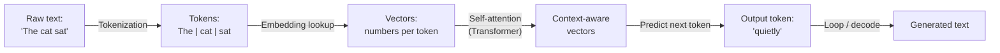
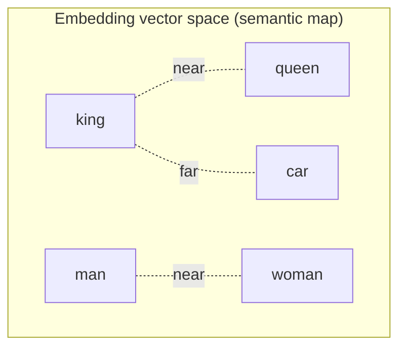
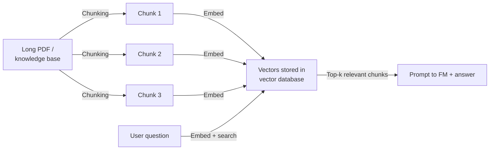
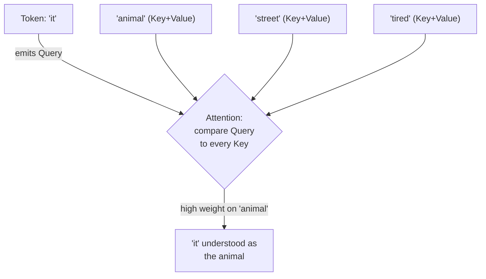
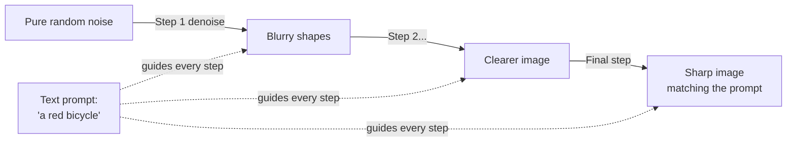
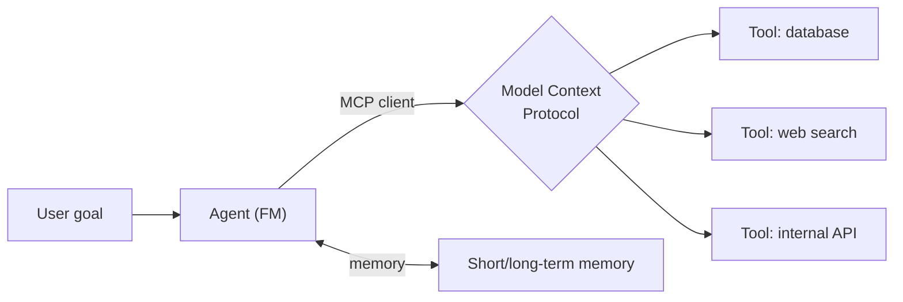
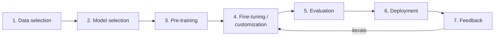
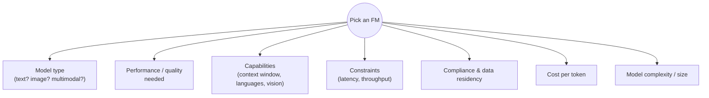
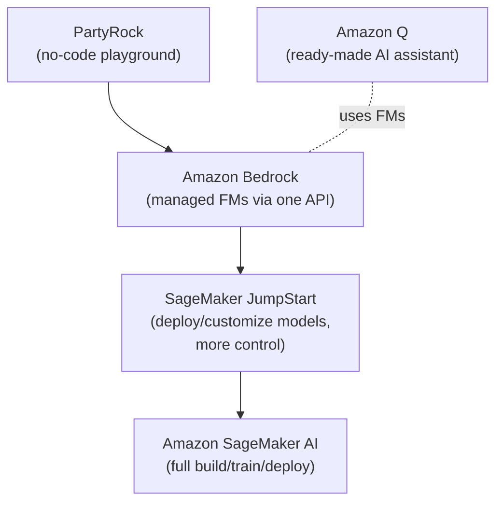
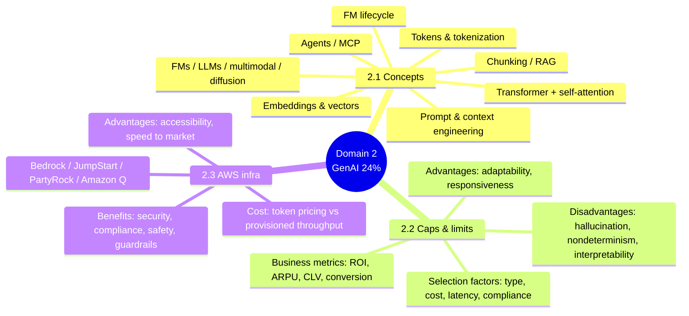

# Domain 2: Fundamentals of Generative AI

> **This is the single biggest domain on AIF-C01 — 24% of scored content**, more than any other. Master the vocabulary here (tokens, embeddings, transformers, diffusion, FM lifecycle) and the AWS "which service when" reflexes, and roughly 1 in 4 exam questions become easy points. This page teaches every Domain 2 task statement intuitively first, then gives you the exact AWS terms and the traps.

Sources: [AIF-C01 exam guide — Domain 2](https://docs.aws.amazon.com/aws-certification/latest/ai-practitioner-01/ai-practitioner-01-domain2.html) · [AIF-C01 exam guide (home)](https://docs.aws.amazon.com/aws-certification/latest/ai-practitioner-01/ai-practitioner-01.html)

---

## Table of Contents
- [How the official objectives map to this page](#objectives-map)
- [🧠 Task 2.1 — Foundational GenAI concepts](#concepts)
  - [Tokens & tokenization](#tokens)
  - [Embeddings & vectors](#embeddings)
  - [Chunking](#chunking)
  - [Transformers & self-attention](#transformers)
  - [Foundation models, LLMs, multi-modal & diffusion models](#fm-types)
  - [Prompt engineering & context engineering](#prompt-context)
  - [Agentic AI, MCP & multi-agent patterns](#agentic)
- [GenAI use cases](#use-cases)
- [The foundation model lifecycle](#fm-lifecycle)
- [🧠 Task 2.2 — Capabilities & limitations for business](#caps-limits)
  - [Advantages](#advantages)
  - [Disadvantages](#disadvantages)
  - [Factors for selecting a model](#selection-factors)
  - [Business value & metrics](#business-metrics)
- [⚙️ Task 2.3 — AWS infrastructure & technologies for GenAI](#aws-infra)
  - [Bedrock, SageMaker JumpStart, PartyRock, Amazon Q & the agent stack](#aws-services)
  - [Advantages of AWS GenAI services](#aws-advantages)
  - [Benefits of AWS infrastructure (security, compliance, safety)](#aws-benefits)
  - [Cost tradeoffs: token pricing & provisioned throughput](#cost-tradeoffs)
- [Exam traps & quick-fire review](#exam-traps)
- [References](#references)

---

## How the official objectives map to this page 

The official AIF-C01 guide breaks Domain 2 into three task statements. Here is the **verbatim** objective list mapped to where it's taught:

| Task | Official objective (from the exam guide) | Section |
|---|---|---|
| **2.1** | Define foundational GenAI concepts (tokens, chunking, embeddings, vectors, prompt engineering, transformer-based LLMs, FMs, multi-modal models, diffusion models) | [Concepts](#concepts) |
| **2.1** | Identify potential use cases (image/video/audio generation; summarization; AI assistants; translation; code generation; customer service agents; search; recommendation engines) | [Use cases](#use-cases) |
| **2.1** | Describe the FM lifecycle (data selection, model selection, pre-training, fine-tuning, evaluation, deployment, feedback) | [FM lifecycle](#fm-lifecycle) |
| **2.1** | Describe the token-based pricing model and its effect on cost and performance for inference | [Cost tradeoffs](#cost-tradeoffs) |
| **2.1** | Describe the role of **context engineering** in FM applications | [Prompt & context](#prompt-context) |
| **2.1** | Define foundational **agentic AI** concepts (multi-agent patterns, **Model Context Protocol [MCP]**, memory, tool usage, workflow orchestration) | [Agentic AI](#agentic) |
| **2.2** | Advantages of GenAI (adaptability, responsiveness, conversational capabilities, content generation) | [Advantages](#advantages) |
| **2.2** | Disadvantages (hallucinations, interpretability, inaccuracy, nondeterminism) | [Disadvantages](#disadvantages) |
| **2.2** | Factors to select a model (model types, performance, capabilities, constraints, compliance, cost, latency, complexity) | [Selection factors](#selection-factors) |
| **2.2** | Business value & metrics (cross-domain performance, ROI, efficiency, conversion rate, ARPU, accuracy, CLV) | [Business metrics](#business-metrics) |
| **2.3** | AWS services to develop GenAI apps (Bedrock, SageMaker AI, JumpStart, Amazon Q/Quick, Kiro, Strands Agents, Bedrock AgentCore) | [AWS services](#aws-services) |
| **2.3** | Advantages of AWS GenAI services (accessibility, lower barrier, efficiency, cost, speed to market, meeting objectives) | [AWS advantages](#aws-advantages) |
| **2.3** | Benefits of AWS infrastructure (security, compliance, responsibility, safety) | [AWS benefits](#aws-benefits) |
| **2.3** | Cost tradeoffs (responsiveness, availability, redundancy, performance, regional coverage, token pricing, provisioned throughput, custom models) | [Cost tradeoffs](#cost-tradeoffs) |

> **Note on freshness:** The AIF-C01 guide was updated to add **context engineering**, **agentic AI / MCP**, and the newer agent-building services (**Amazon Q / Quick, Kiro, Strands Agents, Bedrock AgentCore**). This page covers both the classic Domain 2 material and these additions so you're not surprised on exam day. Source: [Domain 2 exam guide](https://docs.aws.amazon.com/aws-certification/latest/ai-practitioner-01/ai-practitioner-01-domain2.html).

---

## 🧠 Task 2.1 — Foundational GenAI concepts 

**Plain English:** A **generative AI** model doesn't just classify or predict a number — it *generates new content* (text, images, audio, code). The workhorse is the **foundation model (FM)**: one very large model, pre-trained on enormous data, that you then *adapt* to many tasks. Everything in this section is the plumbing that lets an FM read your words, "understand" them as numbers, and write a coherent reply.

Here's the whole pipeline in one picture — memorize this flow, several questions ride on it:

### Tokens & tokenization 

**Plain English:** A model can't read letters or words directly. It first chops text into **tokens** — small chunks that are often whole words, but frequently *sub-words* or characters. A rough rule of thumb: **~1 token ≈ 0.75 English words**, or **~4 characters**.

| Term | Meaning | Example |
|---|---|---|
| **Token** | The smallest unit the model processes | `reading` → `read` + `ing` |
| **Tokenization** | Splitting text into tokens | `"unbelievable"` → `un`, `believ`, `able` |
| **Context window** | Max tokens (input + output) a model can handle at once | e.g. 8K, 200K, 1M tokens depending on model |
| **Input tokens** | Tokens in your prompt (you pay for these) | The question you send |
| **Output tokens** | Tokens the model generates (usually pricier) | The answer it returns |

> **Why tokens matter for the exam:** **Pricing is per token**, and separately for input vs output. Longer prompts and longer answers = more tokens = higher cost and higher latency. See [Cost tradeoffs](#cost-tradeoffs). Source: [Amazon Bedrock pricing](https://aws.amazon.com/bedrock/pricing/).

### Embeddings & vectors 

**Plain English:** An **embedding** turns a token (or a whole sentence/document) into a list of numbers — a **vector** — that captures *meaning*. Words with similar meaning land close together in this numeric space; unrelated words land far apart. "King − Man + Woman ≈ Queen" is the classic intuition.

| Term | Meaning |
|---|---|
| **Embedding** | A numeric vector representing meaning of text/image/audio |
| **Vector** | The list of numbers itself (e.g. 256, 512, 1024, or 1536 dimensions) |
| **Dimensions** | How many numbers in the vector — more = richer, but bigger/costlier |
| **Vector database** | A store optimized to find "nearest" (most similar) vectors fast |
| **Semantic search** | Retrieval by *meaning* (vector similarity) instead of keyword match |

- **On AWS**, the go-to embedding models are **Amazon Titan Text Embeddings** (V2 outputs **256, 512, or 1024** dimensions; V1 outputs **1536**) and **Amazon Titan Multimodal Embeddings**. These are used heavily in **RAG** and search. Source: [Amazon Titan Text Embeddings models](https://docs.aws.amazon.com/bedrock/latest/userguide/titan-embedding-models.html).
- Vector stores commonly paired with AWS GenAI: **Amazon OpenSearch Service**, **Amazon Aurora PostgreSQL / pgvector**, **Amazon Neptune Analytics**, and **Amazon Kendra** for managed retrieval.

> **Exam reflex:** "Convert text into numbers that capture meaning for similarity search" → **embeddings / a vector**. "Find documents by meaning, not keywords" → **semantic search over a vector store**.

### Chunking 

**Plain English:** Big documents don't fit in one embedding (or one context window). **Chunking** splits a long document into smaller passages *before* embedding, so each chunk becomes its own vector. When a user asks a question, you retrieve only the most relevant chunks. This is a core step in **Retrieval-Augmented Generation (RAG)**.

- **Trade-off:** chunks too **large** → dilute relevance and waste tokens; too **small** → lose context. Overlap between chunks preserves continuity.
- **On AWS**, **Amazon Bedrock Knowledge Bases** handles chunking, embedding, storage, and retrieval for you (fixed-size, semantic, hierarchical chunking options).

### Transformers & self-attention 

**Plain English:** The **transformer** is the neural-network architecture behind virtually every modern LLM (the "T" in GPT = Transformer). Its superpower is **self-attention**: when processing each token, the model *looks at every other token* and decides which ones matter for meaning. That's how it resolves "it" → the right noun, or picks the right meaning of "bank" (river vs money) from surrounding words.

**The intuition of self-attention (Query / Key / Value):**

Think of each token as attending a meeting:
- **Query (Q):** "Here's what *I'm* looking for."
- **Key (K):** "Here's what *I* can offer."
- **Value (V):** "Here's the actual info I carry."

Each token's Query is compared against every token's Key. High match = high **attention weight** = that token's Value strongly influences the result. Do this for all tokens, in parallel, across multiple **attention heads** (each head learns a different kind of relationship), stack many layers, and you get deep contextual understanding.

**Why transformers beat older RNNs (exam-relevant):**

| Property | RNN / LSTM (older) | Transformer |
|---|---|---|
| Processing | Sequential, one token at a time | **Parallel** — all tokens at once |
| Long-range context | Weak (forgets distant words) | **Strong** (attends to any position) |
| Training speed | Slow | **Fast on GPUs** — enabled today's huge FMs |
| Basis of | Legacy NLP | **All modern LLMs / FMs** |

> **Exam reflex:** "Which architecture underlies modern LLMs?" → **Transformer**. "Mechanism that weighs the importance of other words when encoding a word?" → **(self-)attention**. Source (intuition): [Transformer architecture & self-attention — Codecademy](https://www.codecademy.com/article/transformer-architecture-self-attention-mechanism).

### Foundation models, LLMs, multi-modal & diffusion models 

**Plain English:** A **foundation model (FM)** is a large, general-purpose model pre-trained on massive data that can be adapted to *many* downstream tasks. Not all FMs are text; not all are transformers.

| Model type | What it is | Modality | Example on AWS |
|---|---|---|---|
| **Foundation model (FM)** | Large pre-trained, general-purpose model you adapt | Any | Amazon Titan, Claude, Llama, Mistral (via Bedrock) |
| **Large language model (LLM)** | An FM specialized in text/language (transformer-based) | Text in → text out | Anthropic Claude, Meta Llama, Amazon Nova |
| **Multi-modal model** | Handles *more than one* modality (e.g. text + image) | Mixed in/out | Amazon Nova, Titan Multimodal Embeddings, Claude (vision) |
| **Diffusion model** | Generates images by starting from noise and *removing* it step by step, guided by a prompt | Text → image/video | Stable Diffusion, Amazon Nova Canvas (image), Nova Reel (video) |

**How a diffusion model works (intuition):**

**Plain English (diffusion):** Training teaches the model to *add* noise to real images and then *reverse* it. At generation time it starts from static and gradually "denoises" toward an image that matches your text prompt. This is why image generators are diffusion models, whereas chatbots are transformer LLMs.

> **Exam trap:** Don't assume "foundation model = LLM = transformer." **Diffusion models are FMs but are NOT LLMs and are used for images/video, not text chat.** If you see "generate an image from text," think **diffusion model** (e.g. Stable Diffusion / Nova Canvas), not an LLM.

### Prompt engineering & context engineering 

**Plain English:** **Prompt engineering** = crafting the *instructions* you send so the model does what you want. **Context engineering** (newer objective) = the broader discipline of assembling *everything the model sees* at inference time — instructions **plus** retrieved documents, tool outputs, memory, and examples — so the model has the right information to answer well.

| Technique | What it does |
|---|---|
| **Zero-shot** | Ask directly, no examples |
| **Few-shot** | Include a few worked examples to steer format/behavior |
| **Chain-of-thought** | Ask the model to reason step by step |
| **System prompt** | Set persona, rules, and constraints up front |
| **Context engineering** | Curate the *whole* context: RAG chunks + tools + memory + prompt, within the token budget |

> **Exam reflex:** "Improve answers *without* retraining the model, just by changing what you send it" → **prompt engineering / context engineering** (cheapest lever). Deep dive lives in Domain 3 — see `03-applications-of-foundation-models.md`.

### Agentic AI, MCP & multi-agent patterns 

**Plain English:** An **AI agent** is an FM that can *act*, not just chat — it can call **tools/APIs**, remember state (**memory**), and take multiple steps to reach a goal (**workflow orchestration**). **Agentic AI** is building systems out of one or more such agents.

| Concept | Plain English |
|---|---|
| **Tool use** | The agent calls an external function/API (search, calculator, database) |
| **Memory** | The agent retains context across turns/sessions (short- and long-term) |
| **Workflow orchestration** | Breaking a goal into steps and coordinating them |
| **Multi-agent system** | Several specialized agents collaborate (e.g. planner + researcher + writer) |
| **Model Context Protocol (MCP)** | An **open standard** (originated by Anthropic) that gives agents a *universal way* to connect to external tools, data, and services |

**MCP in one line:** it's the "USB-C for AI tools" — one standard protocol so any MCP-compatible agent can plug into any MCP-compatible data source or tool.

- **On AWS**, agents are built with **Amazon Bedrock Agents / Bedrock AgentCore**, **Strands Agents** (an open-source agent SDK), and orchestrated experiences via **Amazon Q**. Source: [Harness MCP servers with Amazon Bedrock Agents](https://aws.amazon.com/blogs/machine-learning/harness-the-power-of-mcp-servers-with-amazon-bedrock-agents/) · [MCP on AWS](https://aws.amazon.com/blogs/machine-learning/unlocking-the-power-of-model-context-protocol-mcp-on-aws/).

> **Exam reflex:** "Standard protocol for connecting an agent to external tools/data" → **MCP**. "FM that plans, calls tools, and keeps state to complete a task" → **agent / agentic AI**.

---

## GenAI use cases 

**Plain English:** The exam wants you to recognize *what problems GenAI is good for*. Match the scenario to the capability.

| Use case | What GenAI does | Typical AWS pairing |
|---|---|---|
| **Image / video / audio generation** | Create media from a prompt | Bedrock (Stable Diffusion, Nova Canvas/Reel) |
| **Summarization** | Condense long text | Any LLM via Bedrock |
| **Chatbots / AI assistants** | Conversational Q&A | Bedrock, Amazon Q |
| **Translation** | Language → language | LLMs; Amazon Translate for classic MT |
| **Code generation** | Write/fix/explain code | **Amazon Q Developer**, **Kiro** |
| **Customer-service agents** | Automate support with tools + knowledge | Bedrock Agents, Amazon Q, Amazon Connect |
| **Search** | Semantic / conversational search | Embeddings + vector store, Amazon Kendra |
| **Recommendation engines** | Personalized suggestions | FMs + Amazon Personalize |

> **Exam trap:** GenAI is *not* the answer to everything. For a **numeric prediction from tabular data** (forecast sales, detect fraud from features) the right tool is **classic ML** (regression/classification), not a generative FM — that reasoning is tested in Domain 1.

---

## The foundation model lifecycle 

**Plain English:** An FM isn't "trained once and done." It moves through a lifecycle: pick data → pick a model → pre-train (huge, expensive, usually done by the model provider) → fine-tune/adapt → evaluate → deploy → gather feedback → improve. Know the **order**; ordering-type questions love this.

| Stage | What happens | Who usually does it |
|---|---|---|
| **Data selection** | Choose large, high-quality, diverse training data | Model provider |
| **Model selection** | Pick architecture/size for the goal | Provider (or you, choosing which FM to adopt) |
| **Pre-training** | Learn general language/vision from raw data — **very costly, GPU-heavy** | Provider (e.g. Anthropic, Meta, Amazon) |
| **Fine-tuning / customization** | Adapt the FM to your task/domain data | **You** (Bedrock custom models, SageMaker) |
| **Evaluation** | Measure quality, accuracy, bias, safety | You (Bedrock model evaluation) |
| **Deployment** | Serve for inference | You (Bedrock, SageMaker endpoints) |
| **Feedback** | Collect real usage, human feedback (**RLHF**), errors → refine | You |

> **Exam reflex:** As a **practitioner**, you rarely **pre-train** (too costly). You **select** an existing FM and **fine-tune / customize** it or use **RAG / prompt engineering**. "Cheapest way to adapt behavior" → prompt engineering; "adapt to private data at query time" → **RAG**; "bake domain knowledge/style into the weights" → **fine-tuning**.

---

## 🧠 Task 2.2 — Capabilities & limitations for business 

### Advantages 

**Plain English:** Why businesses reach for GenAI.

| Advantage | Meaning |
|---|---|
| **Adaptability** | One FM handles many tasks (write, summarize, translate, code) |
| **Responsiveness** | Fast, on-demand generation and interaction |
| **Conversational capabilities** | Natural-language interface — no special skills needed to use it |
| **Ability to generate content** | Creates *new* text/images/code, not just classifications |
| **Simplicity** | Lowers effort to build capable apps (few lines / no code) |

### Disadvantages 

**Plain English:** The failure modes AWS wants you to name.

| Disadvantage | Plain English | Mitigation (know these!) |
|---|---|---|
| **Hallucinations** | Confidently states false info | **RAG**, grounding, citations, human review |
| **Interpretability** | Hard to explain *why* it answered as it did (black box) | Explainability tooling, guardrails, logging |
| **Inaccuracy** | Output may be wrong or outdated | RAG with fresh data, evaluation, guardrails |
| **Nondeterminism** | Same prompt can give different answers each time | Lower **temperature**, set **top-p / top-k**, fixed seeds |

> **Exam reflex:** "Model invents plausible but false facts" → **hallucination**; fix with **RAG / grounding**. "Different output each run" → **nondeterminism**; reduce by lowering **temperature**. "Can't explain the decision" → **interpretability / lack of explainability**.

### Factors for selecting a model 

**Plain English:** Choosing an FM is a trade-off, not "biggest is best."

| Factor | Question to ask |
|---|---|
| **Model type** | Do I need text, image, audio, or multi-modal? |
| **Performance requirements** | How accurate / high-quality must outputs be? |
| **Capabilities** | Context window size, languages, reasoning, vision? |
| **Constraints** | Latency and throughput limits? |
| **Compliance** | Data residency, regulatory, privacy needs? |
| **Cost** | Per-token price; a smaller model may be "good enough" and far cheaper |
| **Latency / complexity** | Bigger models are smarter but slower and pricier |

> **Exam reflex:** "Need low latency and low cost, task is simple" → pick a **smaller/cheaper FM**. "Need strict data residency / regulated industry" → **compliance** drives the choice (region, private models, no data used for training).

### Business value & metrics 

**Plain English:** GenAI value is proven with *business* metrics, not just model accuracy.

| Metric | Meaning |
|---|---|
| **Cross-domain performance** | How well one model performs across varied tasks/domains |
| **ROI (return on investment)** | Value gained vs cost of building/running |
| **Efficiency** | Time/effort/cost saved (e.g. faster resolution) |
| **Conversion rate** | % of users who take the desired action |
| **Average revenue per user (ARPU)** | Revenue ÷ number of users |
| **Accuracy** | Correctness of outputs |
| **Customer lifetime value (CLV / CLTV)** | Total revenue expected from a customer over time |

> **Exam trap:** Distinguish **model/technical metrics** (accuracy, BLEU, ROUGE, perplexity) from **business metrics** (ROI, conversion rate, ARPU, CLV, efficiency). A question asking for **business value** wants the *business* metric.

---

## ⚙️ Task 2.3 — AWS infrastructure & technologies for GenAI 

### Bedrock, SageMaker JumpStart, PartyRock, Amazon Q & the agent stack 

**Plain English:** AWS gives you a ladder — from *no-code playground* up to *full model control*. Pick the lowest rung that meets your need.

| Service | What it is | Reach for it when… | Deep dive |
|---|---|---|---|
| **Amazon Bedrock** | Fully managed, **serverless** access to many FMs (Amazon, Anthropic, Meta, Mistral, Cohere, Stability AI, and more) through **one API**; includes Knowledge Bases (RAG), Agents, Guardrails, model evaluation, fine-tuning | You want to build a GenAI app fast **without managing infrastructure** | [`../services/bedrock.md`](../services/bedrock.md) |
| **PartyRock (Amazon Bedrock Playground)** | **No-code** web playground to build/share small GenAI apps; free daily usage, no AWS account/credit card needed to start | Learning, prototyping, demos before writing code | [`../services/bedrock.md`](../services/bedrock.md) |
| **SageMaker JumpStart** | An **ML hub** inside SageMaker: browse, **one-click deploy**, and **fine-tune** open and proprietary **foundation models** and built-in algorithms | You need **more control** — self-hosted endpoints, deeper customization, or specific open models | [`../services/sagemaker.md`](../services/sagemaker.md) |
| **Amazon SageMaker AI** | Full ML platform to build, train, tune, and deploy models end to end | You're doing serious custom ML / MLOps | [`../services/sagemaker.md`](../services/sagemaker.md) |
| **Amazon Q** | A ready-made **generative AI assistant**. **Q Business** = answers from your enterprise data/docs; **Q Developer** = AI coding help in the IDE and across AWS | You want a turnkey assistant, not to build one | [`../services/amazon-q.md`](../services/amazon-q.md) |
| **Bedrock Agents / AgentCore, Strands Agents, Kiro** | Tools to build **agents** (tool use, memory, orchestration) and agentic dev workflows | You need agents that *act*, call tools, and run multi-step tasks | [`../services/bedrock.md`](../services/bedrock.md) |

**Key distinctions the exam loves:**

| If you see… | Pick… |
|---|---|
| "No infrastructure to manage, choose from many FMs via one API" | **Amazon Bedrock** |
| "No-code / free playground to experiment with GenAI" | **PartyRock** |
| "One-click deploy or fine-tune open-source/proprietary FMs, self-hosted endpoint, more control" | **SageMaker JumpStart** |
| "Enterprise assistant that answers from *our own documents*" | **Amazon Q Business** |
| "AI pair-programmer in the IDE" | **Amazon Q Developer** |
| "Build a custom model from scratch / full MLOps" | **Amazon SageMaker AI** |

Sources: [SageMaker JumpStart foundation models](https://docs.aws.amazon.com/sagemaker/latest/dg/jumpstart-foundation-models.html) · [SageMaker JumpStart product page](https://aws.amazon.com/sagemaker/ai/jumpstart/) · [Bedrock or SageMaker decision guide](https://docs.aws.amazon.com/decision-guides/latest/bedrock-or-sagemaker/bedrock-or-sagemaker.html) · [Amazon Bedrock pricing/overview](https://aws.amazon.com/bedrock/pricing/).

### Advantages of AWS GenAI services 

| Advantage | Plain English |
|---|---|
| **Accessibility** | Powerful FMs reachable via a simple API / console |
| **Lower barrier to entry** | No need to train models or run GPUs yourself |
| **Efficiency** | Managed services remove undifferentiated heavy lifting |
| **Cost-effectiveness** | Pay-as-you-go; no upfront model-training spend |
| **Speed to market** | Ship GenAI features in days, not months |
| **Ability to meet business objectives** | Focus effort on the app, not the infrastructure |

### Benefits of AWS infrastructure (security, compliance, safety) 

**Plain English:** Beyond convenience, AWS supplies the *guardrails* enterprises need.

| Benefit | How AWS delivers it |
|---|---|
| **Security** | Data encrypted in transit/at rest; **IAM** access control; private networking (**VPC / PrivateLink**); **your data is not used to train the base FMs** |
| **Compliance** | Broad certifications and regional controls; data residency choices |
| **Responsibility** | **Bedrock Guardrails** to filter harmful content and block sensitive topics/PII; the **AWS shared responsibility model** |
| **Safety** | Content filters, denied topics, contextual grounding checks, watermarking on generated images (Nova/Titan) |

> **Exam reflex:** "Block toxic content / PII / off-topic answers from a GenAI app" → **Amazon Bedrock Guardrails**. "Who secures what?" → **shared responsibility model** (AWS secures the cloud; you secure what you put in it). Detail in Domain 5 — `05-security-compliance-and-governance.md`.

### Cost tradeoffs: token pricing & provisioned throughput 

**Plain English:** GenAI cost is driven mostly by **tokens** and by **how you buy capacity**. You balance cost against **responsiveness, availability, redundancy, performance, and regional coverage**.

**1) Token-based (On-Demand) pricing — pay per token, nothing reserved.**

- You pay separately for **input tokens** and **output tokens**; **output is usually more expensive**.
- Price varies by **model**, **modality**, and **region**.
- No commitment — ideal for **spiky, low, or unpredictable** traffic.

**Worked example (illustrative rates — always check the live pricing page):**

> Suppose a model costs **\$3.00 per 1M input tokens** and **\$15.00 per 1M output tokens**. A chatbot request with a **1,500-token prompt** and a **500-token answer** costs:
> - Input: 1,500 / 1,000,000 × \$3.00 = **\$0.0045**
> - Output: 500 / 1,000,000 × \$15.00 = **\$0.0075**
> - **Total ≈ \$0.012 per request.** At 1,000,000 requests/month ≈ **\$12,000/month**.
>
> Takeaways the exam tests: shorter prompts/answers cut cost and **latency**; **output tokens dominate** when answers are long; a **smaller/cheaper model** can slash cost if quality is still acceptable.

**2) Provisioned Throughput — reserve capacity for a fixed hourly price.**

- You buy **Model Units (MUs)**; each MU guarantees a **fixed number of input/output tokens per minute** for a specific model.
- Billed **hourly**, whether or not you use the capacity.
- Commitment terms: **No commitment** (delete anytime), **1 month**, or **6 months** — **longer commitment = bigger discount**.
- **Required** to serve a **custom (fine-tuned) model**.
- Best for **steady, high-volume, predictable** workloads that need **guaranteed throughput / consistent latency**.

Sources: [Amazon Bedrock pricing](https://aws.amazon.com/bedrock/pricing/) · [Provisioned Throughput (Bedrock docs)](https://docs.aws.amazon.com/bedrock/latest/userguide/prov-throughput.html).

| | **On-Demand (token-based)** | **Provisioned Throughput** |
|---|---|---|
| Billing | Per input/output token | Per **Model Unit**, **hourly** |
| Commitment | None | None / 1 month / 6 months (longer = cheaper) |
| Best for | Spiky, low, unpredictable traffic; prototyping | Steady, high-volume, predictable; guaranteed capacity |
| Latency/throughput | Shared, can vary | Reserved, consistent |
| Custom models | — | **Required for custom/fine-tuned models** |
| Batch option | **Batch inference ~50% cheaper** for large offline jobs | — |

**Other cost/architecture tradeoffs to recognize:**

| Lever | Trade-off |
|---|---|
| **Responsiveness (latency)** | Faster responses may need bigger instances / provisioned throughput → higher cost |
| **Availability & redundancy** | Multi-AZ / multi-region raises resilience **and** cost |
| **Performance** | Larger models = better quality but slower + pricier |
| **Regional coverage** | Not every model is in every Region; prices differ by Region |
| **Custom models** | Fine-tuning + hosting custom models adds cost (and needs provisioned throughput) |

> **Exam reflex:** "Unpredictable / low volume, prototype" → **On-Demand token pricing**. "High steady volume, need guaranteed throughput & consistent latency (or serving a custom model)" → **Provisioned Throughput**. "Huge one-off offline job, cost-sensitive, latency doesn't matter" → **Batch inference (~50% off)**.

---

## Exam traps & quick-fire review 

| # | Trap / Question shape | Correct reflex |
|---|---|---|
| 1 | "Underlying architecture of modern LLMs?" | **Transformer** (self-attention) |
| 2 | "Turn text into numbers that capture meaning for similarity search" | **Embeddings / vectors** |
| 3 | "Generate an image from a text prompt" | **Diffusion model** (Stable Diffusion / Nova Canvas) — **not** an LLM |
| 4 | "Model states false facts confidently" | **Hallucination** → mitigate with **RAG / grounding** |
| 5 | "Same prompt, different answers each time" | **Nondeterminism** → lower **temperature** |
| 6 | "Can't explain why the model answered that way" | **Interpretability / explainability** limitation |
| 7 | "No-code, free playground to try GenAI" | **PartyRock** |
| 8 | "Many FMs via one API, no infra to manage" | **Amazon Bedrock** |
| 9 | "One-click deploy / fine-tune open FMs with more control" | **SageMaker JumpStart** |
| 10 | "Enterprise assistant answering from our own docs" | **Amazon Q Business** |
| 11 | "AI coding assistant in the IDE" | **Amazon Q Developer** |
| 12 | "Order the FM lifecycle" | data → model selection → pre-train → fine-tune → evaluate → deploy → feedback |
| 13 | "Business value metric (not technical)" | **ROI / conversion rate / ARPU / CLV / efficiency** |
| 14 | "Spiky/unpredictable traffic, pay only for use" | **On-Demand token pricing** |
| 15 | "Steady high volume, guaranteed throughput, or serving a custom model" | **Provisioned Throughput** (1- or 6-month = cheaper) |
| 16 | "Block toxic content / PII in a GenAI app" | **Amazon Bedrock Guardrails** |
| 17 | "Standard way to connect an agent to external tools/data" | **Model Context Protocol (MCP)** |
| 18 | "Cheapest way to change model behavior without retraining" | **Prompt / context engineering** |
| 19 | "Split a long document before embedding for RAG" | **Chunking** |
| 20 | "FM that plans, calls tools, keeps memory to finish a task" | **Agent / agentic AI** (Bedrock Agents / AgentCore) |

**One-screen summary:**

---

## References 

All sources are official AWS documentation unless noted (noted items are used only for *intuition*, not for AWS facts):

- [AIF-C01 Exam Guide — home](https://docs.aws.amazon.com/aws-certification/latest/ai-practitioner-01/ai-practitioner-01.html)
- [AIF-C01 Exam Guide — Domain 2 task statements (verbatim)](https://docs.aws.amazon.com/aws-certification/latest/ai-practitioner-01/ai-practitioner-01-domain2.html)
- [Amazon Bedrock — Pricing (token-based, batch, provisioned throughput)](https://aws.amazon.com/bedrock/pricing/)
- [Amazon Bedrock — Provisioned Throughput & Model Units](https://docs.aws.amazon.com/bedrock/latest/userguide/prov-throughput.html)
- [Amazon Titan Text Embeddings models (dimensions: 256/512/1024, V1 = 1536)](https://docs.aws.amazon.com/bedrock/latest/userguide/titan-embedding-models.html)
- [Amazon Titan Multimodal Embeddings G1](https://docs.aws.amazon.com/bedrock/latest/userguide/titan-multiemb-models.html)
- [Amazon SageMaker JumpStart — Foundation Models](https://docs.aws.amazon.com/sagemaker/latest/dg/jumpstart-foundation-models.html)
- [Amazon SageMaker JumpStart — product page (one-click deploy)](https://aws.amazon.com/sagemaker/ai/jumpstart/)
- [Decision guide: Amazon Bedrock or Amazon SageMaker AI?](https://docs.aws.amazon.com/decision-guides/latest/bedrock-or-sagemaker/bedrock-or-sagemaker.html)
- [Unlocking the power of Model Context Protocol (MCP) on AWS](https://aws.amazon.com/blogs/machine-learning/unlocking-the-power-of-model-context-protocol-mcp-on-aws/)
- [Harness MCP servers with Amazon Bedrock Agents](https://aws.amazon.com/blogs/machine-learning/harness-the-power-of-mcp-servers-with-amazon-bedrock-agents/)
- [Model Context Protocol — official spec (Anthropic-originated open standard)](https://modelcontextprotocol.io/docs/getting-started/intro)
- Intuition only (not AWS facts): [Transformer architecture & self-attention — Codecademy](https://www.codecademy.com/article/transformer-architecture-self-attention-mechanism)

> **Internal deep-dives:** [Bedrock](../services/bedrock.md) · [Amazon Q](../services/amazon-q.md) · [SageMaker](../services/sagemaker.md) · Back to [Exam Overview & Study Plan](../00-exam-overview-and-study-plan.md)
