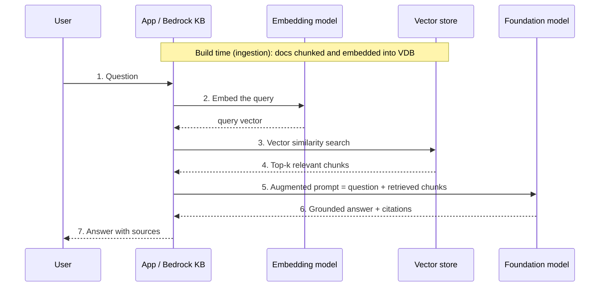
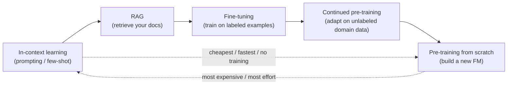
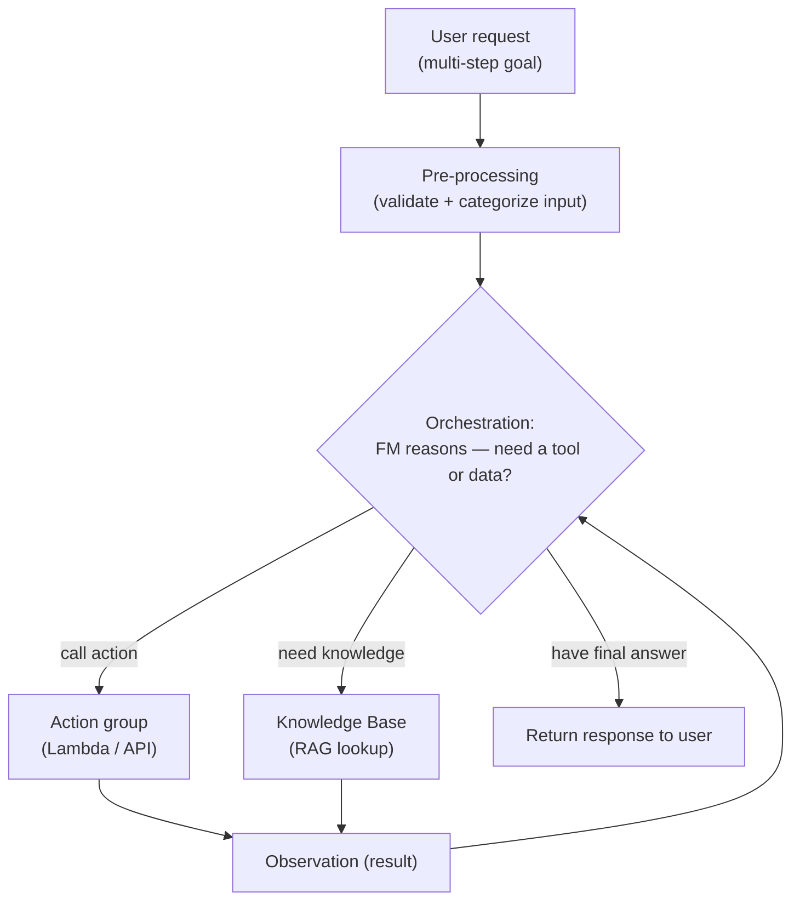
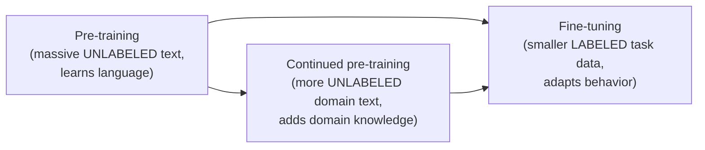
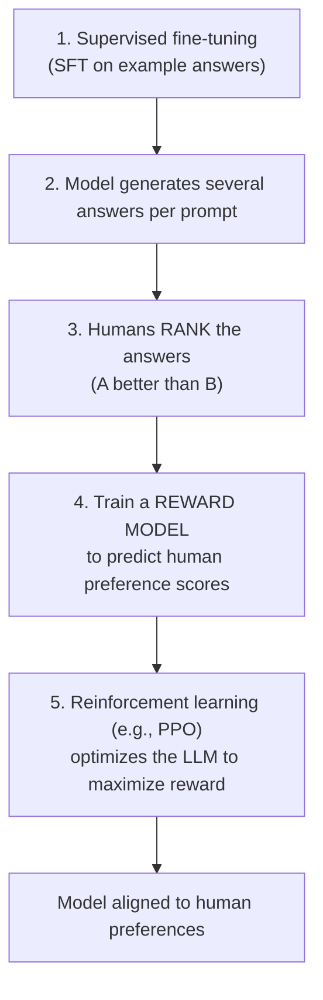

# Domain 3: Applications of Foundation Models

This is the **largest domain of the AIF-C01 exam at 28%** — roughly 1 in 4 scored questions. It covers how you actually *build* with foundation models (FMs): choosing a model, tuning inference, grounding answers with **Retrieval Augmented Generation (RAG)**, orchestrating **agents**, engineering prompts, fine-tuning, and evaluating results. Master this chapter and you have covered more of the exam than any other single domain.

> Source of truth for objectives: [AIF-C01 exam guide (v1.4)](https://docs.aws.amazon.com/aws-certification/latest/examguides/ai-practitioner-01.html). Every AWS fact below is cited inline and in [References](#references).

---

## Table of Contents
- [3.1 Design considerations for FM applications](#design)
  - [Selecting a pre-trained model](#model-selection)
  - [Inference parameters: temperature, top-p, top-k, length](#inference-params)
  - [Retrieval Augmented Generation (RAG)](#rag)
  - [Vector databases on AWS](#vector-dbs)
  - [Customization cost tradeoffs: pre-train vs fine-tune vs RAG vs in-context](#customization-tradeoffs)
  - [Agents for multi-step tasks](#agents)
- [3.2 Prompt engineering](#prompt-eng)
  - [Core constructs](#prompt-constructs)
  - [Techniques: zero/one/few-shot, chain-of-thought, templates](#prompt-techniques)
  - [Best practices](#prompt-best-practices)
  - [Risks: poisoning, hijacking, jailbreaking](#prompt-risks)
- [3.3 Training & fine-tuning FMs](#training)
  - [The training spectrum](#training-spectrum)
  - [Fine-tuning methods](#ft-methods)
  - [Preparing data + RLHF](#data-rlhf)
- [3.4 Evaluating FM performance](#eval)
  - [Human evaluation & benchmarks](#human-benchmarks)
  - [ROUGE, BLEU, BERTScore](#eval-metrics)
  - [Meeting business objectives](#business-objectives)
- [Exam traps & quick-fire review](#exam-traps)
- [References](#references)

---

## 3.1 Design considerations for FM applications <a name="design"></a>

### Selecting a pre-trained model <a name="model-selection"></a>

🧠 **Mental model:** Choosing an FM is like hiring. You don't hire the most expensive genius PhD to answer the phones. You match the *job* (task, budget, speed, languages) to the *right candidate*. Amazon Bedrock is your recruiting agency — it gives you a roster of models from Anthropic, Meta, Mistral, Amazon (Titan/Nova), Cohere, AI21, Stability AI, and more, all behind one API. ([Bedrock supported models](https://docs.aws.amazon.com/bedrock/latest/userguide/models-supported.html))

**Plain English:** Pick the smallest, cheapest model that reliably does the job. Bigger is not automatically better.

The exam gives you scenarios and asks which selection criterion matters most. Learn this table cold:

| Criterion | What it means | When it drives the choice |
|---|---|---|
| **Cost** | Price per input/output token (or provisioned throughput $/hour) | Budget-sensitive, high-volume workloads |
| **Modality** | Text, image, audio, video, embeddings — single- vs **multi-modal** | Need to read images/generate images → pick a multi-modal/diffusion model |
| **Latency** | Time-to-first-token / total response time | Real-time chat, voice, interactive apps → smaller/faster model |
| **Multi-lingual** | How many languages it handles well | Global support, translation → model trained on many languages |
| **Model size** | Parameter count (e.g., 8B vs 70B) | Larger = more capable but slower + pricier |
| **Model complexity / capability** | Reasoning depth, tool use, context handling | Complex reasoning → larger model; simple classification → small model |
| **Customization** | Can it be fine-tuned / continued pre-trained? | You have proprietary data to adapt to → check it supports customization |
| **Input/output length (context window)** | Max tokens in + out it can handle | Long documents/RAG → large context window |

🎯 **On the exam — "if you see X pick Y":**
- "Summarize thousands of long legal PDFs" → prioritize **large context window (input length)** + cost.
- "Sub-second chatbot responses" → prioritize **low latency** → smaller model.
- "Support customers in 20 languages" → **multi-lingual** capability.
- "Generate product images from text" → **modality** (multi-modal/diffusion, e.g., Stability/Titan Image/Nova Canvas).
- "We must adapt it to our internal jargon with our data" → model must support **customization** (fine-tuning).

---

### Inference parameters: temperature, top-p, top-k, length <a name="inference-params"></a>

🧠 **Mental model:** An LLM predicts the next token as a **probability distribution** over the vocabulary. Inference parameters are the *dials* that decide how adventurous the model is when it picks from that distribution — without retraining anything. ([Bedrock inference parameters](https://docs.aws.amazon.com/bedrock/latest/userguide/inference-parameters.html))

**Temperature** reshapes the probability curve. Low temperature *steepens* it (the top choice dominates → deterministic, focused). High temperature *flattens* it (lower-probability tokens get a real chance → random, creative). ([AWS docs](https://docs.aws.amazon.com/bedrock/latest/userguide/inference-parameters.html))

```
Low temperature (≈0.1)          High temperature (≈1.0)
"the cat sat on the ___"        "the cat sat on the ___"

mat   ███████████████ 0.85      mat   ██████ 0.35
rug   ██ 0.08                    rug   ████ 0.22
sofa  █ 0.04                     sofa  ███ 0.18
moon  · 0.01                     moon  ██ 0.13
      (almost always "mat")            (could pick "moon")
   → deterministic, safe             → creative, varied
```

**Plain English:** Turn temperature *down* for facts, code, math, extraction (you want the same right answer every time). Turn it *up* for brainstorming, marketing copy, story ideas (you want variety).

| Parameter | Controls | Lower value → | Higher value → | Docs |
|---|---|---|---|---|
| **Temperature** | Randomness / shape of the distribution | More deterministic, repeatable | More creative, diverse | [link](https://docs.aws.amazon.com/bedrock/latest/userguide/inference-parameters.html) |
| **Top-K** | How many of the *most-likely* tokens are eligible (a fixed count) | Smaller candidate pool → safer | Larger pool → more variety | [link](https://docs.aws.amazon.com/bedrock/latest/userguide/inference-parameters.html) |
| **Top-P (nucleus)** | Smallest set of tokens whose cumulative probability ≥ P | Fewer, likelier tokens | More tokens considered | [link](https://docs.aws.amazon.com/bedrock/latest/userguide/inference-parameters.html) |
| **Max tokens** (output length) | Hard cap on tokens generated before stopping | Shorter, cheaper answers | Longer answers, higher cost | [link](https://docs.aws.amazon.com/bedrock/latest/userguide/inference-parameters.html) |

🎯 **On the exam — traps:**
- **Temperature does NOT change what the model knows** — only how it samples. It cannot add fresh facts (that's RAG/fine-tuning).
- AWS explicitly advises adjusting **either temperature OR top-p, not both at once**. ([docs](https://docs.aws.amazon.com/bedrock/latest/userguide/inference-parameters.html))
- **Top-K = a count** of candidates; **Top-P = a cumulative probability threshold**. Don't swap the definitions.
- "Responses vary each run and we need consistency" → **lower the temperature** (and/or top-p).
- "Answers get cut off mid-sentence" → **increase max tokens** (max output length), not temperature.
- Default ranges are **model-specific** — Bedrock does not have one universal range. ([docs](https://docs.aws.amazon.com/bedrock/latest/userguide/model-parameters.html))

---

### Retrieval Augmented Generation (RAG) <a name="rag"></a>

🧠 **Mental model:** A closed-book exam vs an open-book exam. A raw LLM answers from memory (its frozen training data) — it can be stale and it hallucinates. **RAG turns it into an open-book exam:** before answering, the system looks up relevant passages from *your* documents and hands them to the model as context. The model answers grounded in the retrieved text, with citations. ([Bedrock Knowledge Bases](https://aws.amazon.com/bedrock/knowledge-bases/))

**Plain English:** RAG = "let the model read your company's documents at question time." It fixes stale knowledge and hallucination **without retraining the model**.

**Amazon Bedrock Knowledge Bases** is AWS's fully managed RAG service. It ingests unstructured data from sources (Amazon S3, SharePoint, Confluence, Salesforce, web crawler), automatically **chunks** it, generates **embeddings** (e.g., Amazon Titan Embeddings), stores vectors in a vector store, retrieves the top matching chunks at query time, augments the prompt, and returns an answer **with source citations**. ([how KBs work](https://docs.aws.amazon.com/bedrock/latest/userguide/kb-how-it-works.html))



**Business applications:** enterprise Q&A over policy/HR docs, customer-support assistants over product manuals, internal knowledge search, chatbots that must cite sources, keeping answers current without retraining.

🎯 **On the exam — "if you see X pick Y":**
- "Model gives outdated / made-up answers; we need it grounded in our current internal docs **without retraining**" → **RAG (Bedrock Knowledge Bases)**.
- "Answers must **cite the source document**" → RAG (fine-tuning does not give citations).
- "Data changes daily/hourly" → RAG (freshest option — just re-ingest).

---

### Vector databases on AWS <a name="vector-dbs"></a>

🧠 **Mental model:** A vector database is a search engine for *meaning*, not keywords. Text becomes an **embedding** (a point in high-dimensional space); semantically similar text lands nearby. Retrieval = "find the nearest neighbors" to the query point.

**Plain English:** Regular databases match exact words. Vector databases match *ideas* — "car trouble" can retrieve a doc about "vehicle won't start."

The exam guide lists these AWS services that can **store embeddings for RAG**:

| Service | What it is | Pick it when… | Docs |
|---|---|---|---|
| **Amazon OpenSearch Service / Serverless** | Search + vector engine; supports hybrid (vector + keyword) search | Default choice for scalable vector search & Bedrock KBs; want hybrid search | [KB setup](https://docs.aws.amazon.com/bedrock/latest/userguide/knowledge-base-setup.html) |
| **Amazon Aurora (PostgreSQL + pgvector)** | Managed relational DB with the `pgvector` extension | You already run Aurora/Postgres and want vectors beside relational data; natively supported by Bedrock KBs | [KB setup](https://docs.aws.amazon.com/bedrock/latest/userguide/knowledge-base-setup.html) |
| **Amazon RDS for PostgreSQL (pgvector)** | Managed PostgreSQL with `pgvector` | Existing RDS Postgres estate; want vectors in a familiar relational engine | [pgvector on RDS](https://docs.aws.amazon.com/AmazonRDS/latest/UserGuide/CHAP_PostgreSQL.html) |
| **Amazon Neptune (Analytics)** | Graph database with vector search | Data is highly connected (graphs) / you want **GraphRAG** relationships | [Neptune Analytics](https://docs.aws.amazon.com/neptune-analytics/latest/userguide/what-is-neptune-analytics.html) |
| **Amazon DocumentDB (MongoDB-compatible)** | Document (JSON) DB with vector search | Document/JSON workloads, MongoDB compatibility | [DocumentDB vector search](https://docs.aws.amazon.com/documentdb/latest/developerguide/vector-search.html) |

> ⚠️ **Accuracy note for the exam vs reality:** The AIF-C01 exam guide lists OpenSearch, Aurora, Neptune, DocumentDB, **and RDS for PostgreSQL** as vector-store options — memorize all five for the exam. In the *actual Bedrock Knowledge Bases* native integrations, the supported vector stores are **OpenSearch Serverless / Managed Cluster, Aurora PostgreSQL, Neptune Analytics, Pinecone, Redis Enterprise Cloud, MongoDB Atlas, and Amazon S3 Vectors** — standard RDS PostgreSQL is not a native KB integration even though it can host pgvector for a custom RAG pipeline. ([supported vector stores](https://aws.amazon.com/blogs/machine-learning/dive-deep-into-vector-data-stores-using-amazon-bedrock-knowledge-bases/), [KB setup](https://docs.aws.amazon.com/bedrock/latest/userguide/knowledge-base-setup.html))

🎯 **On the exam:**
- "Which AWS services can store embeddings for RAG?" → recognize **OpenSearch, Aurora (pgvector), Neptune, DocumentDB, RDS PostgreSQL** as valid answers.
- "Highly connected / relationship data + vectors" → **Neptune**.
- "MongoDB-compatible document store + vectors" → **DocumentDB**.
- "Fully managed default for Bedrock KBs, hybrid keyword+vector" → **OpenSearch Serverless**.

---

### Customization cost tradeoffs: pre-train vs fine-tune vs RAG vs in-context <a name="customization-tradeoffs"></a>

🧠 **Mental model:** Four ways to make an FM "know your stuff," from cheapest/lightest to most expensive/heaviest:
- **In-context learning** = telling it in the prompt ("here are 3 examples, now do the 4th").
- **RAG** = handing it the reference book at question time.
- **Fine-tuning** = sending it to a short training course on your task.
- **Pre-training** = raising it from a newborn (build your own FM from scratch).

**Plain English:** Reach for the lightest tool first. Try prompting → RAG → fine-tuning → (almost never) pre-training. Cost and effort climb steeply at each step.



| Approach | What it changes | Cost | Effort | Data freshness | Best for |
|---|---|---|---|---|---|
| **In-context learning** (zero/few-shot) | Nothing — only the prompt | 💲 Lowest (just tokens) | Lowest — no training | Instant (put facts in prompt) | Quick tasks, formatting, examples-in-prompt |
| **RAG** | Nothing in the model; adds a retrieval step | 💲💲 Low–medium (storage + retrieval) | Medium — build pipeline / use Bedrock KB | ✅ **Freshest** — re-ingest anytime | Grounded, current, cited enterprise answers |
| **Fine-tuning** | Model **weights** (labeled task data) | 💲💲💲 High (training + hosting custom model) | High — curate labeled data, train, host | ❌ Frozen at training time | Consistent style/format, domain task behavior |
| **Continued pre-training** | Model **weights** (unlabeled domain data) | 💲💲💲💲 Very high | High — large unlabeled corpus | ❌ Frozen | Deep domain vocabulary/knowledge |
| **Pre-training from scratch** | Builds a whole new model | 💲💲💲💲💲 Extreme (millions $) | Extreme — massive data + compute | ❌ Frozen | Almost never for practitioners |

🎯 **On the exam — the classic decision:**
- **RAG vs fine-tuning** is the #1 tested tradeoff:
  - Need **fresh / frequently changing** facts + **citations** + no training budget → **RAG**.
  - Need the model to consistently **behave/format/speak** a certain way (tone, structured output, a specialized task) → **fine-tuning**.
- "Cheapest way to improve responses" / "no training, just better prompts" → **in-context learning / prompt engineering**.
- "We must teach it a whole new domain language on unlabeled corpora" → **continued pre-training**.
- Building an FM **from scratch** is rarely the right answer on this exam — too costly.

---

### Agents for multi-step tasks <a name="agents"></a>

🧠 **Mental model:** A plain LLM is a brain in a jar — it can *think* but can't *do*. An **agent** gives the brain hands and tools: it can call APIs, run AWS Lambda functions, query a knowledge base, and chain multiple steps to complete a real task ("book the flight, then email the itinerary"). ([Bedrock Agents](https://docs.aws.amazon.com/bedrock/latest/userguide/agents.html))

**Amazon Bedrock Agents** orchestrate multi-step tasks. You give the agent **instructions** (what it's for), attach **action groups** (APIs/Lambda functions it may call, defined by an OpenAPI/JSON schema), and optionally connect **Knowledge Bases** (for RAG). At runtime the agent reasons step-by-step, decides which action or lookup to perform, observes the result, and loops until it produces a final answer. ([how agents work](https://docs.aws.amazon.com/bedrock/latest/userguide/agents-how.html))



The loop = **Reason → Act (tool/KB) → Observe → repeat** until done. AWS also supports **multi-agent collaboration**, where a supervisor agent coordinates specialist sub-agents. ([multi-agent](https://docs.aws.amazon.com/bedrock/latest/userguide/agents-multi-agent-collaboration.html))

🎯 **On the exam — "if you see X pick Y":**
- "The FM must **take actions / call APIs / complete a multi-step workflow**" → **Bedrock Agents**.
- "Agent can perform actions" → those are defined in **action groups** (backed by Lambda + an OpenAPI/JSON schema).
- "Agent needs to look up company docs mid-task" → attach a **Knowledge Base** (RAG) to the agent.
- Agents ≠ RAG. RAG *retrieves and answers*; Agents *reason and act* (and can use RAG as one tool).

---

## 3.2 Prompt engineering <a name="prompt-eng"></a>

### Core constructs <a name="prompt-constructs"></a>

🧠 **Mental model:** A prompt is a *job brief* to a very literal contractor. The clearer the brief, the better the work — no retraining required.

| Construct | Meaning | Example |
|---|---|---|
| **Instruction** | The task you want performed | "Summarize the email in one sentence." |
| **Context** | Background info the model should use | "The customer is angry about a late refund." |
| **Negative prompt** | What to *avoid* / exclude | "Do not mention pricing. Do not use jargon." |
| **Input/query** | The actual data to act on | The email text itself |
| **Latent space** | The model's internal high-dimensional "knowledge map" of learned patterns/concepts | A good prompt *navigates* this space toward the right region |

**Plain English:** "Latent space" = the compressed internal representation of everything the model learned. Prompting is steering through that space toward the answer you want; you can only reach what's already *in* the space.

---

### Techniques: zero/one/few-shot, chain-of-thought, templates <a name="prompt-techniques"></a>

| Technique | What you give the model | Use when |
|---|---|---|
| **Zero-shot** | Just the instruction, **no examples** | Task is simple/common; model already knows it |
| **Single-shot (one-shot)** | **One** example, then the task | Model needs to see the format once |
| **Few-shot** | **Several** examples, then the task | Task is nuanced; examples teach the pattern |
| **Chain-of-thought (CoT)** | Ask it to **reason step by step** before answering | Multi-step reasoning, math, logic |
| **Prompt template** | A reusable, parameterized prompt with slots | Standardizing prompts across an app |

**Zero-shot vs few-shot (before/after):**

```
ZERO-SHOT
Prompt:  Classify sentiment: "The delivery was late and cold."
Output:  Negative

FEW-SHOT (teach the exact labels/format with examples)
Prompt:  "Great value!" -> Positive
         "Never arrived." -> Negative
         "It was okay." -> Neutral
         "The delivery was late and cold." ->
Output:  Negative
```

**Chain-of-thought (before/after):**

```
WITHOUT CoT
Prompt:  A shop had 12 apples, sold 5, bought 8 more. How many now?
Output:  15   (may be wrong, no shown reasoning)

WITH CoT
Prompt:  ... Let's think step by step.
Output:  Start 12. Sold 5 -> 7. Bought 8 -> 15. Answer: 15
```

**Prompt template (before/after):**

```
AD-HOC (inconsistent)
"tell me about {topic}"

TEMPLATE (reusable, controlled)
System: You are a concise technical writer.
Task:   Explain {topic} to a {audience} in {N} bullet points.
Rules:  Avoid jargon. Do not exceed {N} bullets.
```

🎯 **On the exam:**
- Count the examples: **0 = zero-shot, 1 = single/one-shot, 2+ = few-shot**.
- "Improve reasoning on multi-step math/logic" → **chain-of-thought**.
- "Reuse the same structured prompt across many inputs" → **prompt template**.

---

### Best practices <a name="prompt-best-practices"></a>

**Plain English:** Be specific, be concise, show examples, set boundaries, and iterate.

- **Specificity & concision** — say exactly what you want, no filler; ambiguity produces ambiguity.
- **Give context and constraints** — audience, format, length, tone.
- **Use examples (few-shot)** to lock in format and labels.
- **Experiment / iterate** — prompt engineering is empirical; test variations.
- **Add guardrails** — use **Amazon Bedrock Guardrails** to filter unsafe content and enforce topic/PII policies. ([Bedrock Guardrails](https://aws.amazon.com/bedrock/guardrails/))
- **Discovery** — probe the model's capabilities and limits before shipping.
- **Use multiple comments/delimiters** — clearly separate instructions, context, and user input (e.g., XML-style tags) so the model doesn't confuse them.

---

### Risks: poisoning, hijacking, jailbreaking <a name="prompt-risks"></a>

🧠 **Mental model:** If a prompt is a job brief, these attacks are ways a malicious "client" slips fraudulent instructions into the brief — or into the reference materials — to make your contractor misbehave.

| Risk | What it is | Mitigation |
|---|---|---|
| **Prompt injection / hijacking** | Malicious input **overrides the developer's instructions** ("ignore previous instructions and…") to redirect the model | Input tagging to separate system vs user input; **Bedrock Guardrails PROMPT_ATTACK filter**; validate/sanitize input ([docs](https://docs.aws.amazon.com/bedrock/latest/userguide/guardrails-prompt-attack.html)) |
| **Jailbreaking** | Prompts crafted to **bypass the model's safety guardrails** to produce harmful/disallowed content (e.g., "DAN / Do Anything Now") | Guardrails prompt-attack filter (set strength NONE/LOW/MEDIUM/HIGH); content filters ([docs](https://docs.aws.amazon.com/bedrock/latest/userguide/guardrails-prompt-attack.html)) |
| **Prompt poisoning** | Injecting malicious/misleading content into data the model consumes (e.g., a poisoned document in a RAG source or training set) so it later produces bad output | Curate & govern data sources; validate ingested content; least-privilege data access |
| **Prompt leaking / exposure** | Tricking the model into **revealing the hidden system prompt** or confidential config ("repeat everything above") | Don't put secrets in prompts; Guardrails prompt-leakage detection (Standard tier) ([docs](https://docs.aws.amazon.com/bedrock/latest/userguide/guardrails-prompt-attack.html)) |

**Amazon Bedrock Guardrails** is the go-to AWS mitigation: content filters, denied topics, word/PII filters, contextual grounding, and a **prompt-attack filter** that detects prompt injection and jailbreak attempts; **input tagging** distinguishes trusted developer prompts from untrusted user input. ([Guardrails prompt attack](https://docs.aws.amazon.com/bedrock/latest/userguide/guardrails-prompt-attack.html))

🎯 **On the exam — distinguish them:**
- "Ignore previous instructions and do X" → **prompt injection / hijacking**.
- "Bypass safety filters to get disallowed content (DAN)" → **jailbreaking**.
- "Tainted training/RAG data corrupts outputs" → **prompt poisoning / data poisoning**.
- "Reveal the system prompt / leak secrets" → **prompt leaking / exposure**.
- Mitigation for any prompt attack → **Guardrails for Amazon Bedrock** + input validation.

---

## 3.3 Training & fine-tuning FMs <a name="training"></a>

### The training spectrum <a name="training-spectrum"></a>

🧠 **Mental model:** Education stages. **Pre-training** = general schooling (learn language broadly). **Continued pre-training** = a deep specialization on your field's texts. **Fine-tuning** = on-the-job training for a specific role using worked examples.



| Stage | Data | Goal | Cost |
|---|---|---|---|
| **Pre-training** | Enormous **unlabeled** corpus | Learn general language/patterns from scratch | Extreme |
| **Continued pre-training** | Additional **unlabeled** domain corpus | Deepen domain vocabulary/knowledge | Very high |
| **Fine-tuning** | Smaller **labeled** examples (prompt→completion) | Adapt behavior to a specific task/style | High (but far less than pre-training) |

In Amazon Bedrock, model customization jobs are typed as **`FINE_TUNING`** (labeled data) or **`CONTINUED_PRE_TRAINING`** (unlabeled data). ([custom models](https://docs.aws.amazon.com/bedrock/latest/userguide/custom-models.html), [CreateModelCustomizationJob](https://docs.aws.amazon.com/bedrock/latest/APIReference/API_CreateModelCustomizationJob.html))

---

### Fine-tuning methods <a name="ft-methods"></a>

| Method | What it does |
|---|---|
| **Instruction tuning** | Fine-tune on **(instruction → desired response)** pairs so the model follows instructions well |
| **Domain adaptation** | Adapt a general model to a specialized field (legal, medical, finance) via domain data |
| **Transfer learning** | Reuse a pre-trained model's learned knowledge and adapt it to a new but related task — you don't start from scratch |
| **Continued pre-training** | Keep pre-training on unlabeled domain data to inject domain knowledge (see above) |

**Plain English:** Transfer learning is *why* fine-tuning works — the model already knows language; you're transferring that foundation to your narrower task instead of relearning everything.

---

### Preparing data + RLHF <a name="data-rlhf"></a>

**Data preparation is often the make-or-break step.** For Bedrock fine-tuning you supply data in the required format (e.g., JSONL prompt/completion) in Amazon S3. ([prepare data](https://docs.aws.amazon.com/bedrock/latest/userguide/model-customization-prepare.html))

| Data concern | Why it matters |
|---|---|
| **Curation** | Clean, relevant, high-quality examples → better model; garbage in, garbage out |
| **Governance** | Track lineage, permissions, compliance, PII handling for the training data |
| **Size** | Enough examples to learn the pattern (fine-tuning needs far less than pre-training) |
| **Labeling** | Accurate labels/target outputs (fine-tuning is supervised) |
| **Representativeness** | Data must reflect real production inputs and diversity, or the model is biased/skewed |

**RLHF — Reinforcement Learning from Human Feedback**

🧠 **Mental model:** Teaching by preference, not by answer key. Humans can't write the "correct" answer for every open-ended prompt, but they *can* say "response A is better than B." RLHF turns those human preferences into a reward signal that steers the model toward helpful, harmless, human-aligned outputs. ([RLHF explainer](https://www.ibm.com/think/topics/rlhf))



**Plain English:** (1) show good examples, (2) let the model produce options, (3) humans rank them, (4) a *reward model* learns what humans prefer, (5) the LLM is optimized to score high on that reward. This is how models become "helpful and aligned." ([CMU RLHF tutorial](https://blog.ml.cmu.edu/2025/06/01/rlhf-101-a-technical-tutorial-on-reinforcement-learning-from-human-feedback/))

🎯 **On the exam:**
- "Unlabeled data to add domain knowledge" → **continued pre-training**. "Labeled examples to adapt a task/style" → **fine-tuning**.
- "Align model to human values/preferences using human rankings + a reward model" → **RLHF**.
- Human-feedback labeling at scale on AWS → **Amazon SageMaker Ground Truth** / **Amazon Augmented AI (A2I)**.
- Poor/biased results after fine-tuning → data was not **representative** or not **curated**.

---

## 3.4 Evaluating FM performance <a name="eval"></a>

### Human evaluation & benchmarks <a name="human-benchmarks"></a>

🧠 **Mental model:** Two ways to grade a model — hire graders (**human evaluation**) or use a standardized test with an answer key (**benchmark datasets** + automatic metrics). **Amazon Bedrock Evaluations** supports both: automatic metric scoring and human-worker review. ([Bedrock Evaluations](https://aws.amazon.com/bedrock/evaluations/))

| Approach | What it is | Strengths | Weaknesses |
|---|---|---|---|
| **Human evaluation** | People rate outputs for quality, helpfulness, safety | Captures nuance, tone, correctness humans care about | Slow, costly, subjective, hard to scale |
| **Benchmark datasets + automatic metrics** | Score outputs against reference answers with algorithms (ROUGE/BLEU/BERTScore) or standardized benchmarks (e.g., MMLU) | Fast, cheap, repeatable, scalable | Miss nuance; a high score ≠ truly good answer |

---

### ROUGE, BLEU, BERTScore <a name="eval-metrics"></a>

**Plain English:** These measure how close the model's text is to a human reference answer — just in different ways.

| Metric | Full name | Measures | Best for | How to remember |
|---|---|---|---|---|
| **ROUGE** | Recall-Oriented Understudy for Gisting Evaluation | Overlap of n-grams between output and reference (**recall-leaning**) | **Summarization** | **R**OUGE → **R**ecall → summa**R**ization |
| **BLEU** | Bilingual Evaluation Understudy | N-gram **precision** with a brevity penalty | **Translation** | **B**LEU → **B**ilingual → translation |
| **BERTScore** | (uses BERT embeddings) | **Semantic similarity** via contextual embeddings + cosine similarity, not exact word overlap | Meaning-level similarity/paraphrase where wording differs | **BERT** → embeddings → **meaning** |

ROUGE and BLEU count **surface word overlap**; BERTScore compares **meaning**, so it can credit a correct paraphrase that uses different words. Amazon Bedrock model evaluation supports these algorithmic metrics. ([Bedrock evaluation report](https://docs.aws.amazon.com/bedrock/latest/userguide/model-evaluation-report-programmatic.html))

🎯 **On the exam — "if you see X pick Y":**
- **Summarization task** → **ROUGE**.
- **Translation task** → **BLEU**.
- "Same meaning, different words / semantic match" → **BERTScore**.
- "Nuance, tone, safety, subjective quality" → **human evaluation**.

---

### Meeting business objectives <a name="business-objectives"></a>

🧠 **Mental model:** A high ROUGE score doesn't pay the bills. The real test is whether the FM moves a **business** metric. Technical metrics are proxies; business KPIs are the verdict.

| Business dimension | Example metrics |
|---|---|
| **Productivity** | Time saved per task, tickets resolved per hour, cost per interaction |
| **User engagement** | Adoption, session length, return rate, satisfaction (CSAT/NPS) |
| **Task engineering / task success** | Task completion rate, accuracy on the real workflow, deflection rate, error/escalation reduction |

**Plain English:** Always tie model choice and evaluation back to the outcome: is it faster, cheaper, more used, and does it complete the job? Pick the model/approach that best meets the **business objective**, not just the highest lab score.

🎯 **On the exam:**
- "How do we know the FM meets business goals?" → measure **business KPIs** (productivity, engagement, task success), not only ROUGE/BLEU.
- Watch for distractors that offer only a technical metric when the question asks about **business value**.

---

## Exam traps & quick-fire review <a name="exam-traps"></a>

| If the question says… | Pick / remember… |
|---|---|
| Grounded, current, **cited** answers without retraining | **RAG (Bedrock Knowledge Bases)** |
| Model must **take actions / multi-step workflow / call APIs** | **Bedrock Agents** (action groups = Lambda + OpenAPI schema) |
| Consistent **style/format/behavior** on a task | **Fine-tuning** |
| Add **domain knowledge from unlabeled data** | **Continued pre-training** |
| Cheapest improvement, no training | **Prompt engineering / in-context learning** |
| Responses too random / need consistency | **Lower temperature** (adjust temp OR top-p, not both) |
| Answers cut off | **Increase max tokens** (output length) |
| **Top-K vs Top-P** | Top-K = a **count** of candidates; Top-P = **cumulative probability** threshold |
| 0 / 1 / 2+ examples in prompt | **Zero-shot / one-shot / few-shot** |
| Improve multi-step reasoning | **Chain-of-thought** |
| "Ignore previous instructions" | **Prompt injection / hijacking** → Guardrails |
| "DAN / bypass safety" | **Jailbreaking** → Guardrails |
| Tainted training/RAG data | **Prompt/data poisoning** |
| Reveal the system prompt | **Prompt leaking / exposure** |
| Any prompt-attack mitigation | **Guardrails for Amazon Bedrock** (PROMPT_ATTACK filter, input tagging) |
| Align to human preferences via rankings + reward model | **RLHF** |
| Score **summarization** | **ROUGE** |
| Score **translation** | **BLEU** |
| **Semantic** similarity, different wording | **BERTScore** |
| Nuance/subjective quality | **Human evaluation** |
| Store embeddings on AWS | OpenSearch, **Aurora (pgvector)**, RDS PostgreSQL, **Neptune** (graph), **DocumentDB** (Mongo-compat) |
| Graph/connected data + vectors | **Neptune** |
| Does the FM meet the goal? | **Business KPIs** (productivity, engagement, task success) — not just lab metrics |

**Highest-yield facts to over-learn (28% domain):**
1. **RAG vs fine-tuning** decision (freshness+citations → RAG; behavior/format → fine-tuning).
2. **Temperature** intuition (low = deterministic, high = creative) and **top-K (count) vs top-P (probability)**.
3. **Agents** = reason→act loop with **action groups**; RAG can be a tool inside an agent.
4. **Customization cost ladder**: in-context < RAG < fine-tuning < continued pre-training < pre-training.
5. **Metric-to-task map**: ROUGE→summarization, BLEU→translation, BERTScore→semantic.
6. **Prompt-attack taxonomy** + **Guardrails** as the AWS mitigation.
7. **RLHF** three steps: SFT → reward model from human rankings → RL optimization.

---

## References <a name="references"></a>

**Model selection & inference parameters**
- Amazon Bedrock — Influence response generation with inference parameters (temperature, top-p, top-k, max tokens): https://docs.aws.amazon.com/bedrock/latest/userguide/inference-parameters.html
- Amazon Bedrock — Inference request parameters and response fields for FMs: https://docs.aws.amazon.com/bedrock/latest/userguide/model-parameters.html
- Amazon Bedrock — Supported foundation models: https://docs.aws.amazon.com/bedrock/latest/userguide/models-supported.html

**RAG & vector stores**
- Amazon Bedrock Knowledge Bases (product page): https://aws.amazon.com/bedrock/knowledge-bases/
- How Amazon Bedrock knowledge bases work: https://docs.aws.amazon.com/bedrock/latest/userguide/kb-how-it-works.html
- Prerequisites / vector store setup for a knowledge base: https://docs.aws.amazon.com/bedrock/latest/userguide/knowledge-base-setup.html
- Dive deep into vector data stores for Bedrock Knowledge Bases (AWS blog): https://aws.amazon.com/blogs/machine-learning/dive-deep-into-vector-data-stores-using-amazon-bedrock-knowledge-bases/
- Amazon Neptune Analytics (graph + vectors): https://docs.aws.amazon.com/neptune-analytics/latest/userguide/what-is-neptune-analytics.html
- Amazon DocumentDB vector search: https://docs.aws.amazon.com/documentdb/latest/developerguide/vector-search.html
- Amazon RDS for PostgreSQL (pgvector): https://docs.aws.amazon.com/AmazonRDS/latest/UserGuide/CHAP_PostgreSQL.html

**Agents**
- Automate tasks using Amazon Bedrock Agents: https://docs.aws.amazon.com/bedrock/latest/userguide/agents.html
- How Amazon Bedrock Agents works: https://docs.aws.amazon.com/bedrock/latest/userguide/agents-how.html
- Action groups: https://docs.aws.amazon.com/bedrock/latest/userguide/agents-action-create.html
- Multi-agent collaboration: https://docs.aws.amazon.com/bedrock/latest/userguide/agents-multi-agent-collaboration.html

**Prompt engineering & guardrails**
- Detect prompt attacks with Amazon Bedrock Guardrails: https://docs.aws.amazon.com/bedrock/latest/userguide/guardrails-prompt-attack.html
- Prompt injection security: https://docs.aws.amazon.com/bedrock/latest/userguide/prompt-injection.html
- Guardrails for Amazon Bedrock (product page): https://aws.amazon.com/bedrock/guardrails/

**Training & fine-tuning**
- Customize your model (fine-tuning & continued pre-training): https://docs.aws.amazon.com/bedrock/latest/userguide/custom-models.html
- Prepare data for fine-tuning: https://docs.aws.amazon.com/bedrock/latest/userguide/model-customization-prepare.html
- CreateModelCustomizationJob API (FINE_TUNING vs CONTINUED_PRE_TRAINING): https://docs.aws.amazon.com/bedrock/latest/APIReference/API_CreateModelCustomizationJob.html
- RLHF explainer (IBM): https://www.ibm.com/think/topics/rlhf
- RLHF technical tutorial (CMU ML blog): https://blog.ml.cmu.edu/2025/06/01/rlhf-101-a-technical-tutorial-on-reinforcement-learning-from-human-feedback/

**Evaluation**
- Amazon Bedrock Evaluations (product page): https://aws.amazon.com/bedrock/evaluations/
- Review metrics for an automated model evaluation job: https://docs.aws.amazon.com/bedrock/latest/userguide/model-evaluation-report-programmatic.html

**Exam guide**
- AWS Certified AI Practitioner (AIF-C01) exam guide: https://docs.aws.amazon.com/aws-certification/latest/examguides/ai-practitioner-01.html
