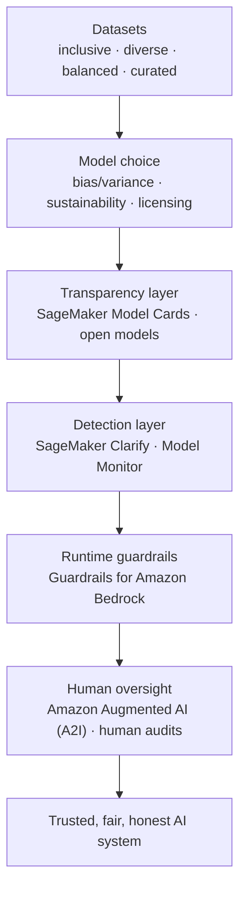
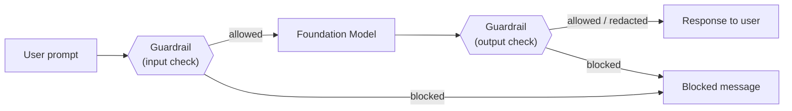
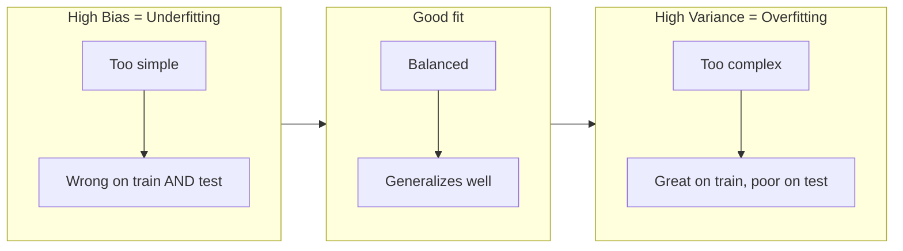
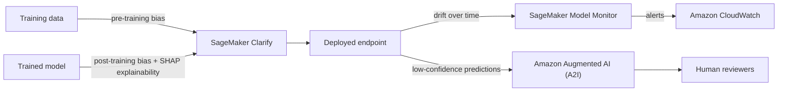
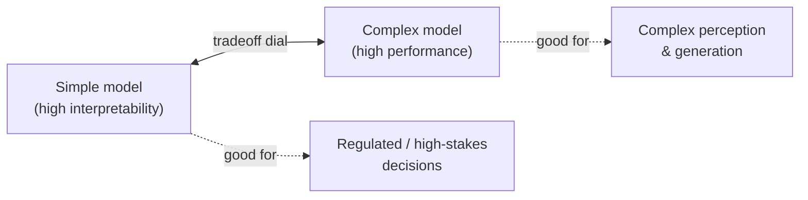

# Domain 4: Guidelines for Responsible AI

Responsible AI is **14% of AIF-C01** — roughly 7 of 50 scored questions. This domain is less about wiring services together and more about *judgment*: recognizing bias, choosing transparent models, applying Guardrails, and knowing which AWS tool (Clarify, Model Monitor, A2I, Model Cards) answers a given governance need. Master the vocabulary here and the exam's scenario questions become nearly reflexive.

> **Plain English:** Domains 1–3 taught you how to *build* with AI. Domain 4 teaches you how to build it *safely, fairly, and honestly* — and which AWS button to press to prove you did.

---

## Table of Contents
- [The mental model: a "trust stack"](#trust-stack)
- [4.1a — The six (really ten) features of responsible AI](#ra-features)
- [4.1b — Guardrails for Amazon Bedrock](#guardrails)
- [4.1c — Choosing a model responsibly: sustainability & environment](#sustainability)
- [4.1d — Legal risks of generative AI](#legal-risks)
- [4.1e — Characteristics of good datasets](#datasets)
- [4.1f — Bias vs variance and their effects](#bias-variance)
- [4.1g — Tools to detect & monitor bias: Clarify, Model Monitor, A2I](#detect-tools)
- [4.2a — Transparent & explainable models (black-box vs glass-box)](#transparent)
- [4.2b — Tools for transparency: Model Cards, open models, licensing](#transparency-tools)
- [4.2c — The safety ↔ transparency tradeoff](#tradeoff)
- [4.2d — Human-centered design for explainable AI](#hcd)
- [Exam traps & quick-fire review](#traps)
- [References](#references)

---

## The mental model: a "trust stack" 

🧠 **Mental model:** Think of responsible AI as a **trust stack** — layers you assemble so a stakeholder can trust the system. Each AWS service plugs into a specific layer.

| Layer | Question it answers | Primary AWS tool |
|---|---|---|
| Data | Is my data fair & representative? | SageMaker Clarify (pre-training bias) |
| Model | Is the model itself sustainable & appropriate? | Model selection criteria |
| Transparency | Can I document what this model does? | **SageMaker Model Cards** |
| Detection | Is the model biased / drifting / unexplainable? | **SageMaker Clarify + Model Monitor** |
| Runtime safety | Is a live prompt/response harmful? | **Guardrails for Amazon Bedrock** |
| Human oversight | Should a human review this decision? | **Amazon Augmented AI (A2I)** |

---

## 4.1a — The six (really ten) features of responsible AI 

The exam guide names these responsible-AI **features**: bias, fairness, inclusivity, robustness, safety, and veracity. AWS's own framework (the [Well-Architected Responsible AI Lens](https://docs.aws.amazon.com/wellarchitected/latest/generative-ai-lens/responsible-ai.html)) formalizes **ten core dimensions** — learn both; the ten dimensions frame the exam's answer choices.

🧠 **Mental model:** Imagine hiring an employee. You'd want them to treat everyone fairly (fairness), not carry prejudices (low bias), tell the truth (veracity), stay calm under pressure and trick questions (robustness), avoid causing harm (safety), and explain their reasoning (explainability). Responsible AI asks the same of a model.

### The exam's named features

| Feature | Plain-English definition | The failure it prevents |
|---|---|---|
| **Bias** | Systematic, unfair skew in data or predictions that favors/harms a group. | A résumé screener rejecting one gender disproportionately. |
| **Fairness** | The model's outcomes are equitable across demographic groups. | Loan approval rates differing by race for equal-risk applicants. |
| **Inclusivity** | The system works for, and represents, a broad range of people & needs. | A voice assistant failing on non-native accents. |
| **Robustness** | Correct, stable outputs even with noisy, unexpected, or adversarial input. | Jailbreak prompts breaking the model's safety. |
| **Safety** | Reducing harmful output and misuse. | The model generating instructions for self-harm. |
| **Veracity** | Outputs are truthful and factually correct (opposite of hallucination). | A chatbot confidently inventing a refund policy. |

### AWS's ten Responsible AI dimensions (superset)

Per [AWS's core-dimensions guidance](https://aws.amazon.com/blogs/machine-learning/considerations-for-addressing-the-core-dimensions-of-responsible-ai-for-amazon-bedrock-applications/):

| Dimension | Meaning |
|---|---|
| **Fairness** | Consider impacts on different stakeholder groups. |
| **Explainability** | Understand and evaluate system outputs. |
| **Privacy & Security** | Appropriately obtain, use, and protect data and models. |
| **Safety** | Reduce harmful output and misuse. |
| **Controllability** | Have mechanisms to monitor and steer AI behavior. |
| **Veracity & Robustness** | Correct outputs, even with unexpected/adversarial inputs. |
| **Governance** | Best practices across the AI supply chain (providers + deployers). |
| **Transparency** | Enable stakeholders to make informed choices about engaging the system. |

🎯 **On the exam:** If a question lists a set of "responsible AI principles/dimensions" and asks which is *not* one, the fake option is usually something like "profitability," "latency," or "scalability." **Veracity = truthfulness/no-hallucination.** **Robustness = holds up to adversarial/unexpected input.** Don't confuse the two.

---

## 4.1b — Guardrails for Amazon Bedrock 

🧠 **Mental model:** Guardrails are a **bouncer standing at both doors** of your LLM — checking every prompt on the way *in* and every response on the way *out*, blocking or redacting anything against the house rules. Crucially, it works across models (any Bedrock FM, and even non-Bedrock/custom models via the `ApplyGuardrail` API).

**Guardrails for Amazon Bedrock** is a managed safeguard you configure once and apply to inputs and outputs. Per the [Bedrock Guardrails docs](https://docs.aws.amazon.com/bedrock/latest/userguide/guardrails.html), it offers these policy types:

| Guardrail policy | What it does | Example |
|---|---|---|
| **Content filters** | Detects & filters harmful text/image across categories: **Hate, Insults, Sexual, Violence, Misconduct, and Prompt Attack** (jailbreaks/prompt injection). Configurable strength. | Block hateful or violent generations. |
| **Denied topics** | You define undesirable topics in natural language; Guardrails blocks prompts/responses touching them. | A banking bot refusing to give investment advice. |
| **Word filters** | Block specific custom words/phrases (exact match) plus a managed profanity list. | Block profanity or competitor names. |
| **Sensitive information filters (PII)** | Detect and **block or redact** PII (names, SSNs, emails) and custom regex patterns. | A call-center transcript app masking customer PII. |
| **Contextual grounding checks** | Detects **hallucinations** — flags responses not grounded in the provided source or irrelevant to the query. Ideal for **RAG**. | Block a RAG answer that contradicts the retrieved passages. |
| **Automated Reasoning checks** | Uses formal/logical verification to mathematically validate factual accuracy against defined policies. | Verify a policy answer is logically sound. |

**2025 updates ([What's New, Jun 2025](https://aws.amazon.com/about-aws/whats-new/2025/06/amazon-bedrock-guardrails-tiers-content-filters-denied-topics/)):** a new **Standard tier** adds better contextual understanding (catches typo-obfuscation) and support for **up to 60 languages**; Guardrails also extended coverage to **code** (comments, variable/function names, string literals).

🎯 **On the exam — "if you see X, pick Y":**
- "Block the model from discussing a competitor / off-limits subject" → **Denied topics** (or **word filters** for exact names).
- "Redact customer SSNs and phone numbers from responses" → **Sensitive information filters (PII)**.
- "Prevent RAG hallucinations / ensure the answer matches retrieved docs" → **Contextual grounding checks**.
- "Detect prompt injection / jailbreak attempts" → **Content filters → Prompt Attack** category.
- "Apply the same safety policy across multiple/third-party models" → **Guardrails + `ApplyGuardrail` API**.
- Guardrails is the **runtime** control. It does **not** detect training-data bias — that's **SageMaker Clarify**.

---

## 4.1c — Choosing a model responsibly: sustainability & environment 

🧠 **Mental model:** A giant frontier model is a gas-guzzling truck; a small fine-tuned model is a bicycle. If a bicycle gets you there, riding the truck wastes energy (and money and carbon). Responsible model selection means **picking the smallest model that meets the requirement.**

**Environmental / sustainability considerations** map directly to the [AWS Well-Architected Sustainability Pillar](https://docs.aws.amazon.com/wellarchitected/latest/sustainability-pillar/sustainability-pillar.html):

| Responsible practice | Why it's more sustainable |
|---|---|
| Prefer a **smaller / distilled** model when it meets the need | Less compute, energy, and carbon per inference. |
| **Fine-tune** an existing FM instead of pre-training from scratch | Pre-training is enormously energy-intensive. |
| Use **managed, right-sized** inference (serverless, auto-scaling) | Avoids idle over-provisioned GPUs. |
| Choose efficient hardware (**AWS Inferentia / Trainium**) | Purpose-built, higher performance-per-watt. |
| Reuse / share models (SageMaker JumpStart, Bedrock FMs) | Avoids duplicate training runs. |

🎯 **On the exam:** "Which is a *responsible/sustainable* practice when selecting a model?" → answers about **using a smaller model, fine-tuning rather than training from scratch, and right-sizing compute**. Not "always use the largest model for best accuracy."

---

## 4.1d — Legal risks of generative AI 

🧠 **Mental model:** A generative model is a very talented ghostwriter who read the entire internet — including copyrighted books — and sometimes makes things up. That combination creates legal exposure.

| Legal / business risk | What goes wrong | Mitigation on AWS |
|---|---|---|
| **Intellectual-property infringement** | Output reproduces copyrighted/trademarked content; training data was used without rights. | Use models with **IP indemnification** (AWS offers uncapped IP indemnity for eligible Amazon Titan and select models); check **licensing** of open models. |
| **Biased model outputs** | Discriminatory decisions → legal/regulatory liability. | **SageMaker Clarify** bias detection; **human audits**. |
| **Hallucinations** | Confident but false statements → misinformation, bad advice. | **Contextual grounding checks**, RAG with citations, human review. |
| **Loss of customer trust** | One harmful/false output erodes brand credibility. | Guardrails, transparency (Model Cards), disclosure. |
| **End-user risk / harm** | Users act on unsafe or wrong output. | Safety guardrails, disclaimers, **human-in-the-loop (A2I)**. |
| **Data privacy / leakage** | Model exposes PII from prompts or training data. | **PII filters**, encryption, data governance (Domain 5). |

🎯 **On the exam:** Know that **hallucination is a veracity/legal risk**, and that **IP infringement** and **loss of customer trust** are explicitly listed generative-AI risks. If asked how to reduce IP risk, look for **indemnification / licensing** answers; for hallucination risk, look for **grounding / RAG / human review**.

---

## 4.1e — Characteristics of good datasets 

🧠 **Mental model:** A dataset is a **mirror** the model learns from. A cracked or partial mirror (missing groups, skewed samples) produces a distorted reflection — biased predictions. Fix the mirror before blaming the model.

| Characteristic | Meaning | If missing → |
|---|---|---|
| **Inclusivity** | Represents all relevant user groups & edge cases. | Model fails for under-represented users. |
| **Diversity** | Wide variety of examples, contexts, sources. | Brittle model that overfits a narrow slice. |
| **Balanced datasets** | Comparable representation across classes/groups. | Majority class dominates; minority predictions poor. |
| **Curated data sources** | Vetted, clean, high-quality, rights-cleared data. | Garbage-in / legal & label-quality problems. |

**Data-quality checks that support fairness:** analyzing **label quality**, **subgroup analysis** (measure accuracy per demographic slice), and **human audits** of samples.

🎯 **On the exam:** "The model performs worse for one demographic group — what's the likely root cause?" → an **imbalanced / non-inclusive training dataset** (data bias), fixed by **rebalancing, adding diverse data**, and checking with **Clarify**. Balanced ≠ larger; it means *representative across groups*.

---

## 4.1f — Bias vs variance and their effects 

🧠 **Mental model:** Picture darts on a board. **High bias** = all darts clustered far from the bullseye (consistently wrong — the model is *too simple*, **underfitting**). **High variance** = darts scattered everywhere (fits the training noise — the model is *too complex*, **overfitting**).

| Concept | Cause | Symptom | Fix |
|---|---|---|---|
| **High bias (underfitting)** | Model too simple / too little training | Poor on **both** training & test data | More complexity, more features, train longer |
| **High variance (overfitting)** | Model too complex / memorizes training noise | Great on training, **poor on new data** | More data, regularization, dropout, simplify |

**Two meanings of "bias" — don't mix them up:**
- **Statistical bias** (bias–variance tradeoff): about **accuracy / fit**.
- **Societal/fairness bias**: systematic unfairness toward **demographic groups** (the responsible-AI sense).

**Effects to know:** bias/variance cause **inaccuracy**; societal bias causes **disparate effects on demographic groups** (unfair outcomes). Underfitting and overfitting are the two ways a model can be inaccurate.

🎯 **On the exam:**
- "Great on training data, bad on real data" → **overfitting / high variance** → get more data or regularize.
- "Bad on both" → **underfitting / high bias**.
- "Unfair outcomes across groups" → **fairness bias** → **SageMaker Clarify**, not regularization.

---

## 4.1g — Tools to detect & monitor bias: Clarify, Model Monitor, A2I 

These three are the **most-tested trio** in Domain 4. Learn exactly what each does and does *not* do.

### Amazon SageMaker Clarify — *bias detection + explainability*

Per the [Clarify docs](https://docs.aws.amazon.com/sagemaker/latest/dg/clarify-configure-processing-jobs.html), Clarify:
- Detects **pre-training bias** (in the data) and **post-training bias** (in model predictions) using bias metrics.
- Provides **explainability** via **SHAP (SHapley Additive exPlanations)** — the per-feature contribution to each prediction.
- Generates **fairness & explainability reports**.

**Plain English:** Clarify answers *"Is my data/model biased, and why did the model decide this?"*

### Amazon SageMaker Model Monitor — *continuous drift monitoring in production*

Per the [Model Monitor docs](https://docs.aws.amazon.com/sagemaker/latest/dg/model-monitor.html), it monitors a **live endpoint** along **four dimensions**, alerting via **Amazon CloudWatch**:

| Monitor type | Watches for |
|---|---|
| **Data quality** | Input data drifting from the training baseline. |
| **Model quality** | Accuracy/RMSE etc. degrading vs baseline. |
| **Bias drift** | Bias emerging in predictions over time (uses Clarify). |
| **Feature attribution drift** | SHAP feature importances shifting over time (uses Clarify). |

**Plain English:** Clarify is the *one-time X-ray*; Model Monitor is the *continuous heart-rate monitor* on the deployed model.

### Amazon Augmented AI (A2I) — *human-in-the-loop review*

Per [A2I](https://aws.amazon.com/augmented-ai/), it builds **human review workflows** for ML predictions: when a prediction is **low-confidence** (below a threshold) or randomly sampled, it's routed to human reviewers (private workforce, vendors, or Amazon Mechanical Turk), and their verdict feeds back for improvement.

**Plain English:** A2I answers *"When the model isn't sure, get a human to decide."*

### The decision table (memorize this)

| If the scenario is… | Pick |
|---|---|
| Detect **bias in data or model**, or **explain** a prediction (SHAP) | **SageMaker Clarify** |
| **Continuously monitor** a deployed endpoint for **drift** (data/quality/bias/attribution) | **SageMaker Model Monitor** (→ CloudWatch alerts) |
| Route **low-confidence** predictions to **human reviewers** | **Amazon Augmented AI (A2I)** |
| Document the model's intended use, metrics, risk rating | **SageMaker Model Cards** |
| Block harmful/PII/off-topic prompts & responses at runtime | **Guardrails for Amazon Bedrock** |

🎯 **On the exam:** The classic trap swaps Clarify ↔ Model Monitor. **Clarify = detect/explain (analysis).** **Model Monitor = ongoing drift + CloudWatch alerts (operations).** A2I is *always* the human-in-the-loop answer.

---

## 4.2a — Transparent & explainable models (black-box vs glass-box) 

🧠 **Mental model:** A **glass-box** model is a clear watch — you can see every gear turning (why it decided). A **black-box** model is a sealed watch — it tells the time accurately but you can't see how. Transparency = "here's the documentation of what's inside"; explainability = "here's *why* it produced this specific output."

| Term | Question it answers | Example |
|---|---|---|
| **Transparency** | *What* is this model — its data, training, intended use, limitations? | A published **model card**. |
| **Explainability / interpretability** | *Why* did it make this particular prediction? | **SHAP** values from Clarify. |

| | **Glass-box (transparent/interpretable)** | **Black-box (opaque)** |
|---|---|---|
| Examples | Linear/logistic regression, decision trees | Deep neural nets, large LLMs |
| Explanation | Read the model directly | Needs post-hoc tools (SHAP, feature importance) |
| Typical accuracy on complex tasks | Lower | Higher |
| Best for | Regulated decisions (credit, healthcare) | Complex perception/generation tasks |

🎯 **On the exam:** "A regulator requires you to explain *why* each loan was denied" → favor an **interpretable/glass-box model** *or* add **SHAP explanations via Clarify**. "Highest accuracy on image recognition" → a black-box deep model (accept lower explainability).

---

## 4.2b — Tools for transparency: Model Cards, open models, licensing 

### Amazon SageMaker Model Cards

Per the [Model Cards docs](https://docs.aws.amazon.com/sagemaker/latest/dg/model-cards.html), a **model card** documents a model in one place for governance:

| Model card captures | Detail |
|---|---|
| **Intended use** | Scenarios where the model is (and is **not**) appropriate. |
| **Risk rating** | **Unknown, Low, Medium, or High** — governs production approval. |
| Training details & metrics | How it was trained; performance. |
| Evaluation results & observations | Test results, caveats. |
| Considerations & recommendations | Ethical/operational call-outs. |

**Plain English:** A model card is the **nutrition label / owner's manual** for a model — the primary AWS *transparency* artifact. (Contrast: **Clarify report** = bias/explainability analysis; **Model card** = documentation & governance record.)

### Open-source models, data & licensing

| Transparency lever | Why it matters |
|---|---|
| **Open-source models** | Weights/architecture inspectable → higher transparency & auditability. |
| **Open training data** | Provenance is verifiable; bias/IP risk assessable. |
| **Licensing** | The license dictates commercial use, redistribution, and modification — check **before** deploying (open-weight ≠ unrestricted). |

🎯 **On the exam:** "Which AWS feature documents a model's intended use and risk rating for governance?" → **SageMaker Model Cards**. "Team wants full visibility into architecture & training data" → **open-source model** (and verify its **license**).

---

## 4.2c — The safety ↔ transparency (interpretability vs performance) tradeoff 

🧠 **Mental model:** There's a **dial** between *how well it performs* and *how easily you can explain it*. Turning toward maximum accuracy (huge black-box models) usually turns *away* from interpretability — and vice versa. Responsible AI is choosing the right dial position for the **stakes** of the use case.

| Situation | Lean toward |
|---|---|
| High-stakes/regulated (credit, medical, hiring) | **Interpretability & transparency** (glass-box or heavy explainability) |
| Complex task where accuracy dominates | **Performance** (black-box) + **post-hoc explainability (SHAP)** to recover some transparency |

**Safety vs transparency nuance:** full transparency (publishing weights/prompts) can *aid attackers* (jailbreak crafting) — so there's a balance between being open and not handing adversaries a blueprint. Measuring interpretability (are explanations faithful & useful?) is itself part of the tradeoff.

🎯 **On the exam:** If a question pits **accuracy against explainability**, the "responsible" answer for a **high-stakes/regulated** scenario prioritizes **explainability/transparency**, even at some accuracy cost — often achieved by adding **Clarify/SHAP** rather than abandoning the model.

---

## 4.2d — Human-centered design for explainable AI 

🧠 **Mental model:** Human-centered design (HCD) means designing the AI **around the people who use and are affected by it** — not around the algorithm. Explanations must be understandable to a *human*, and humans must stay *in control*.

Principles of **human-centered design for explainable AI**:

| Principle | Meaning |
|---|---|
| **Design for amplified decision-making** | AI assists humans; humans make the final high-stakes call. |
| **Unbiased & inclusive design** | Build for diverse users; test across groups; involve affected stakeholders. |
| **Explanations fit the audience** | A loan officer, a customer, and an auditor need different levels of explanation. |
| **Human-in-the-loop / oversight** | Keep a mechanism (e.g., **A2I**) for humans to review, override, and give feedback. |
| **Provide reproducible & consistent explanations** | Same input → same, trustworthy explanation. |
| **Consider cognitive load & trust calibration** | Don't over- or under-trust the AI; surface confidence and uncertainty. |

🎯 **On the exam:** HCD answers emphasize **keeping humans in control, tailoring explanations to the audience, inclusive design, and human-in-the-loop review (A2I)** — never "fully automate to remove humans." If a scenario needs humans to validate or override AI decisions, the design principle is **human-centered / human-in-the-loop**, and the service is **A2I**.

---

## Exam traps & quick-fire review 

| If you see… | Pick / remember… |
|---|---|
| Block harmful, PII, off-topic, or hallucinated content **at runtime** | **Guardrails for Amazon Bedrock** |
| Block a **competitor's name** or specific profanity | Guardrails → **word filters** (denied topics for subjects) |
| Prevent **RAG hallucinations** grounded in sources | Guardrails → **contextual grounding checks** |
| Detect **prompt injection / jailbreak** | Guardrails → **content filters → Prompt Attack** |
| Detect **bias in data or model** / **explain a prediction (SHAP)** | **SageMaker Clarify** |
| **Continuously monitor** a live endpoint for **drift** | **SageMaker Model Monitor** → CloudWatch alerts |
| Route **low-confidence** predictions to **humans** | **Amazon Augmented AI (A2I)** |
| Document **intended use + risk rating** for governance | **SageMaker Model Cards** |
| "Great on training, poor on new data" | **Overfitting / high variance** |
| "Poor on both training and test" | **Underfitting / high bias** |
| "Worse accuracy for one demographic group" | **Data bias** → rebalance + **Clarify** |
| Reduce **IP infringement** risk | **Indemnification + licensing** checks |
| Reduce **hallucination** risk | Grounding checks + RAG + human review |
| **Sustainable** model choice | Smaller model, **fine-tune** vs train-from-scratch, right-size compute |
| **Veracity** | Truthfulness / no hallucination |
| **Robustness** | Holds up to unexpected/adversarial input |
| Need to **explain a black-box** model's decisions | **SHAP via Clarify** (or choose a glass-box model) |
| Keep **humans in control** of AI decisions | **Human-centered design / human-in-the-loop (A2I)** |

**Three killer confusions to nail:**
1. **Clarify vs Model Monitor** — Clarify *analyzes/explains* (one-time X-ray); Model Monitor *watches production drift* (continuous heart-rate monitor).
2. **Model Cards vs Clarify report** — Model Cards = *documentation/governance*; Clarify report = *bias/explainability analysis*.
3. **Guardrails vs Clarify** — Guardrails = *runtime content safety*; Clarify = *training/model bias & explainability*. Different layers entirely.

---

## References 

- Detect and filter harmful content — Amazon Bedrock Guardrails: https://docs.aws.amazon.com/bedrock/latest/userguide/guardrails.html
- Bedrock Guardrails components (denied topics, filters, PII, grounding): https://docs.aws.amazon.com/bedrock/latest/userguide/guardrails-components.html
- Guardrails tiers for content filters & denied topics (2025): https://aws.amazon.com/about-aws/whats-new/2025/06/amazon-bedrock-guardrails-tiers-content-filters-denied-topics/
- Amazon SageMaker Clarify (bias detection & explainability): https://aws.amazon.com/sagemaker/ai/clarify/
- Clarify processing jobs / SHAP: https://docs.aws.amazon.com/sagemaker/latest/dg/clarify-configure-processing-jobs.html
- Amazon SageMaker Model Monitor (four monitor types): https://docs.aws.amazon.com/sagemaker/latest/dg/model-monitor.html
- Bias drift monitoring: https://docs.aws.amazon.com/sagemaker/latest/dg/clarify-model-monitor-bias-drift.html
- Feature attribution drift monitoring: https://docs.aws.amazon.com/sagemaker/latest/dg/clarify-model-monitor-feature-attribution-drift.html
- Amazon Augmented AI (A2I): https://aws.amazon.com/augmented-ai/
- Human-in-the-loop with Clarify + A2I: https://aws.amazon.com/blogs/machine-learning/human-in-the-loop-review-of-model-explanations-with-amazon-sagemaker-clarify-and-amazon-a2i/
- Amazon SageMaker Model Cards: https://docs.aws.amazon.com/sagemaker/latest/dg/model-cards.html
- Core dimensions of responsible AI for Bedrock: https://aws.amazon.com/blogs/machine-learning/considerations-for-addressing-the-core-dimensions-of-responsible-ai-for-amazon-bedrock-applications/
- Well-Architected Generative AI Lens — Responsible AI: https://docs.aws.amazon.com/wellarchitected/latest/generative-ai-lens/responsible-ai.html
- Well-Architected Sustainability Pillar: https://docs.aws.amazon.com/wellarchitected/latest/sustainability-pillar/sustainability-pillar.html
- AIF-C01 exam guide: https://docs.aws.amazon.com/aws-certification/latest/examguides/ai-practitioner-01.html

---

## Glossary

| Term | Simple explanation | Purpose |
|---|---|---|
| **Responsible AI** | A set of principles and practices ensuring AI systems are fair, safe, honest, and transparent | The overarching theme of Domain 4 — builds stakeholder trust in AI |
| **Bias (fairness)** | Systematic unfair skew in data or predictions that disadvantages a group | A core responsible AI concern; detected with SageMaker Clarify |
| **Fairness** | The goal that a model treats all individuals and demographic groups equitably | Measured with fairness metrics; reported in Clarify bias reports |
| **Inclusivity** | Ensuring the AI system works for a broad and diverse range of users | Prevents the model from failing specific user populations |
| **Robustness** | The model produces correct and stable outputs even with noisy or adversarial input | Guards against jailbreaks and unexpected inputs breaking the system |
| **Safety** | Reducing harmful output and misuse of AI systems | Implemented at runtime with Guardrails for Amazon Bedrock |
| **Veracity** | Outputs are truthful and factually correct; the opposite of hallucination | A key responsible AI dimension tested on the exam |
| **Explainability** | The ability to understand and communicate why a model produced a specific output | Required in regulated industries; provided by SHAP via SageMaker Clarify |
| **Transparency** | Documenting what a model is, how it was trained, and its intended use | Enables informed decisions by stakeholders; primary tool is Model Cards |
| **Controllability** | Having mechanisms to monitor and steer AI behavior | Implemented via Guardrails, Model Monitor, and human-in-the-loop review |
| **Governance** | Best practices across the AI supply chain — providers, builders, and deployers | Ensures accountability and consistent oversight of AI systems |
| **Hallucination** | When an AI model confidently states false or invented information | A veracity/safety risk; mitigated with RAG, grounding checks, and human review |
| **Guardrails for Amazon Bedrock** | Bedrock feature that filters harmful content, blocks topics, and redacts PII at runtime | The primary AWS runtime control for responsible AI enforcement |
| **Content filters** | Guardrails policy that detects and blocks harmful text or images across categories | Covers hate speech, insults, sexual content, violence, and prompt attacks |
| **Denied topics** | Guardrails policy that blocks prompts and responses that touch user-defined subjects | Prevents the model from discussing off-limits topics in a given application |
| **Word filters** | Guardrails policy that blocks specific words and phrases using exact matching | Used to block profanity, competitor names, or prohibited terminology |
| **Sensitive information filters (PII)** | Guardrails policy that detects and blocks or redacts personally identifiable information | Protects customer data in call-center, healthcare, and finance applications |
| **Contextual grounding checks** | Guardrails policy that flags responses not supported by the retrieved source documents | Prevents RAG-based hallucinations by checking answer vs source alignment |
| **Automated Reasoning checks** | Guardrails policy using formal logic to mathematically verify factual accuracy | Provides rigorous policy compliance verification for high-stakes answers |
| **Prompt Attack filter** | Guardrails content filter category covering prompt injection and jailbreak attempts | The primary Bedrock defense against adversarial prompt manipulation |
| **ApplyGuardrail API** | Bedrock API that applies a guardrail policy to any model, including non-Bedrock models | Allows consistent safety policies across heterogeneous model environments |
| **Guardrails Standard tier** | An upgraded Guardrails tier with better contextual understanding and 60-language support | Catches obfuscated attacks that the basic tier might miss |
| **SageMaker Clarify** | SageMaker service that detects bias in data and model predictions and explains predictions via SHAP | The primary AWS tool for bias detection and model explainability |
| **Pre-training bias** | Bias that exists in the training data before the model is trained | Detected by Clarify; fixed by rebalancing or augmenting the dataset |
| **Post-training bias** | Bias introduced or amplified in the model's predictions after training | Detected by Clarify bias reports on model outputs |
| **SHAP (SHapley Additive exPlanations)** | A method that assigns each input feature a contribution score for a specific prediction | Provides per-prediction explanations; output of Clarify's explainability feature |
| **SageMaker Model Monitor** | SageMaker service that continuously monitors deployed endpoints for drift and quality issues | Raises CloudWatch alerts when data quality, model quality, bias, or feature attribution shifts |
| **Data quality monitor** | Model Monitor sub-type that checks if input data is drifting from the training baseline | Catches distribution shift before it significantly degrades model performance |
| **Model quality monitor** | Model Monitor sub-type that tracks accuracy or RMSE against a baseline | Detects model performance decay in production |
| **Bias drift monitor** | Model Monitor sub-type that detects emerging bias in live predictions over time | Uses Clarify to track fairness metrics continuously in production |
| **Feature attribution drift monitor** | Model Monitor sub-type that detects shifts in SHAP feature importances over time | Signals that the model is relying on different signals than it was validated on |
| **Amazon CloudWatch** | AWS monitoring service for metrics, logs, and alarms | Used by Model Monitor to send alerts when drift thresholds are breached |
| **Amazon Augmented AI (A2I)** | AWS service for routing low-confidence model predictions to human reviewers | The human-in-the-loop answer on the exam; keeps humans in control |
| **Human-in-the-loop** | A design pattern where humans review or override AI decisions when needed | Core responsible AI principle; implemented with A2I |
| **Amazon Mechanical Turk** | Crowdsourcing marketplace for human tasks | One of the reviewer workforces available via A2I |
| **SageMaker Model Cards** | Documents capturing a model's intended use, risk rating, training details, metrics, and caveats | The primary AWS governance and transparency artifact for ML models |
| **Risk rating** | A Model Card field with values Unknown, Low, Medium, or High | Governs production approval; a high risk rating requires more scrutiny |
| **Sustainability (AI)** | Choosing model sizes and compute that minimize energy use and carbon footprint | A responsible model selection criterion on the exam |
| **AWS Inferentia** | AWS custom chip designed for cost-efficient and energy-efficient ML inference | A sustainable compute choice for high-volume inference workloads |
| **AWS Trainium** | AWS custom chip designed for cost-efficient and energy-efficient ML training | A sustainable compute choice for large-scale model training |
| **IP infringement** | Generating output that reproduces copyrighted or trademarked content without rights | A legal risk of generative AI; mitigated by IP indemnification from AWS |
| **IP indemnification** | AWS's legal coverage for copyright claims on output from eligible Titan and select models | Available for Amazon Titan models and select Bedrock-hosted models |
| **Balanced dataset** | A training dataset with comparable representation across all classes and demographic groups | Prevents the majority class from dominating predictions |
| **Inclusive dataset** | A dataset that represents all relevant user groups and edge cases | Prevents the model from performing poorly for underrepresented populations |
| **Subgroup analysis** | Measuring model accuracy separately for each demographic or data slice | Reveals where the model is less accurate for specific groups |
| **Data curation** | Vetting, cleaning, and rights-clearing data before using it for training | Ensures quality and avoids label errors and legal issues |
| **High bias (statistical)** | A model that is too simple and misses the true pattern | Results in underfitting — poor performance on both training and test data |
| **High variance (statistical)** | A model that is too complex and memorizes training noise | Results in overfitting — great on training data, poor on new data |
| **Underfitting** | Poor performance on both training and new data due to excessive simplicity | Fixed with more model complexity, more features, or longer training |
| **Overfitting** | Great training performance but poor generalization to new data | Fixed with more data, regularization, dropout, or a simpler model |
| **Regularization** | Techniques like L1, L2, and dropout that penalize model complexity during training | Reduces overfitting by preventing the model from memorizing noise |
| **Dropout** | A regularization technique that randomly disables neurons during training | Prevents co-adaptation and reduces overfitting in neural networks |
| **Glass-box model** | A transparent, interpretable model where the decision logic can be read directly | Examples include linear regression and decision trees; preferred in regulated decisions |
| **Black-box model** | An opaque model where the internal decision process is not directly readable | Examples include deep neural nets and large LLMs; higher accuracy but lower explainability |
| **Post-hoc explainability** | Techniques like SHAP that explain a black-box model's decisions after the fact | Partially recovers transparency for complex models without retraining |
| **Human-centered design (HCD)** | Designing AI systems around the needs and experiences of the people who use them | Core principle for explainable AI; emphasizes human oversight and tailored explanations |
| **Cognitive load** | The mental effort required to understand an AI explanation | HCD principle: explanations should be calibrated to the audience's expertise |
| **Trust calibration** | Helping users develop appropriate confidence in AI — neither over-trusting nor under-trusting | A key HCD goal to prevent automation bias or unwarranted skepticism |
| **Well-Architected Responsible AI Lens** | AWS framework formalizing ten core responsible AI dimensions | Extends the exam's six features with additional dimensions like governance and controllability |
| **AWS Sustainability Pillar** | AWS Well-Architected Pillar covering environmental impact of cloud workloads | Guides sustainable model selection and compute choices |
| **Model bias** | Systematic error in a model's predictions that consistently disadvantages a group | Distinguished from statistical bias; a fairness and regulatory concern |
| **Fairness metrics** | Quantitative measures of equal treatment across groups (e.g., equal accuracy rates) | Output of SageMaker Clarify bias analysis |
| **Open-source model** | A model whose weights and/or architecture are publicly available for inspection | Provides higher transparency and auditability than closed proprietary models |
| **Model licensing** | The legal terms governing how a model's weights can be used, redistributed, or modified | Must be checked before deploying open-weight models commercially |
| **Data lineage** | The end-to-end trail of where data came from and how it was transformed | Supports auditability and reproducibility of model training |
