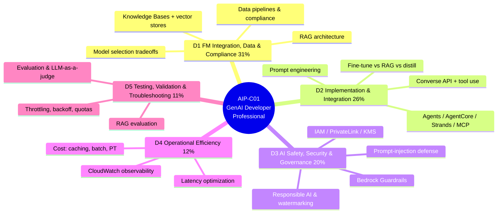
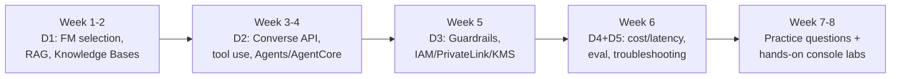

# AIP-C01 — Exam Overview & Study Plan (Generative AI Developer – Professional)

The **AWS Certified Generative AI Developer – Professional (AIP-C01)** is AWS's first *professional-level, developer-focused* generative-AI certification. Registration opened in **March 2026** after a public beta. Where the [AI Practitioner (AIF-C01)](../aif-c01/01-fundamentals-of-ai-and-ml.md) tests whether you *understand* GenAI concepts, AIP-C01 tests whether you can **build, secure, optimize, and operate production GenAI applications on AWS** — Bedrock, agents, RAG, guardrails, and the surrounding plumbing.

> **Plain English:** AIF-C01 = "I know *what* generative AI is and which AWS service does what." AIP-C01 = "I can *ship* a grounded, guardrailed, cost-controlled, agentic Bedrock app — and debug it when it throttles or hallucinates." It is a **builder's** exam: scenario-heavy, architecture-heavy, and code-aware.

Sources: [AIP-C01 official exam guide](https://docs.aws.amazon.com/aws-certification/latest/examguides/ai-professional-01.html) · [AWS expands AI certification portfolio (AWS blog)](https://aws.amazon.com/blogs/training-and-certification/big-news-aws-expands-ai-certification-portfolio-and-updates-security-certification/) · [AIP-C01 certification docs](https://docs.aws.amazon.com/aws-certification/latest/ai-professional-01/ai-professional-01.html)

---

## Exam at a glance

| Item | Value |
|---|---|
| **Exam code** | AIP-C01 |
| **Level** | Professional |
| **Focus** | *Building* production generative-AI applications on AWS (developer/AI-engineer) |
| **Questions** | 65 scored + 10 unscored = **75 total** |
| **Question types** | Multiple choice (1 of 4) and multiple response (choose 2+) |
| **Time** | **170 minutes** |
| **Passing score** | **750 / 1000** (scaled; ≈ 75%) |
| **Scoring model** | Compensatory — no per-domain minimum; only the overall scaled score matters |
| **Cost** | **$300 USD** |
| **Validity** | 3 years |
| **Languages** | English, Japanese, Korean, Simplified Chinese |
| **Prerequisites** | None required; **AWS ML Engineer – Associate (MLA-C01)** recommended as prep |
| **Recommended experience** | ~2+ years software development + ~1+ year hands-on generative-AI development on AWS |

> **The 750 pass mark matters.** This is a higher bar than AIF-C01 (700) or MLA-C01 (720). At ~75%, you cannot coast on one strong domain — but the compensatory model still means a weak spot in a small domain (D4/D5) can be offset by strength in the big ones (D1/D2).

---

## Where AIP-C01 sits among the AWS AI certs

| | 🟢 AIF-C01 | 🔵 MLA-C01 | 🟣 **AIP-C01** |
|---|---|---|---|
| **Level** | Foundational | Associate | **Professional** |
| **You…** | *use* AI on AWS | *build & operate* ML on SageMaker | ***build GenAI apps* on Bedrock** |
| **Coding** | No | Conceptual | **Yes — Bedrock APIs, agents, tools** |
| **Center of gravity** | Vocabulary & service map | SageMaker MLOps | **Bedrock: RAG, agents, guardrails, cost, eval** |
| **Pass** | 700 | 720 | **750** |
| **Time** | 90 min | 130 min | **170 min** |
| **Cost** | $100 | $150 | **$300** |

> **Recommended path:** AIF-C01 (vocabulary) → MLA-C01 (build/operate ML) → **AIP-C01** (build GenAI apps). AIP-C01 assumes you already know the AI/GenAI fundamentals from AIF-C01 and the MLOps/deployment thinking from MLA-C01, and goes deep on the **Bedrock developer surface**.

---

## The five domains

| # | Domain | Weight | Study page |
|---|---|---|---|
| 1 | Foundation Model Integration, Data Management, and Compliance | **31%** | [01 — FM Integration, Data & Compliance](01-foundation-model-integration-data-and-compliance.md) |
| 2 | Implementation and Integration | **26%** | [02 — Implementation & Integration](02-implementation-and-integration.md) |
| 3 | AI Safety, Security, and Governance | **20%** | [03 — AI Safety, Security & Governance](03-ai-safety-security-and-governance.md) |
| 4 | Operational Efficiency and Optimization for GenAI Applications | **12%** | [04 — Operational Efficiency & Optimization](04-operational-efficiency-and-optimization.md) |
| 5 | Testing, Validation, and Troubleshooting | **11%** | [05 — Testing, Validation & Troubleshooting](05-testing-validation-and-troubleshooting.md) |
| — | Practice questions + explanations | — | [99 — Practice questions](99-practice-questions.md) |

**Domains 1 + 2 are 57% of the exam** — foundation-model integration, RAG, Knowledge Bases, the Converse API, tool use, and agents. Spend the majority of your time there.

---

## In-scope AWS services (the AIP-C01 surface)

| Category | Services & features the exam expects |
|---|---|
| **Foundation models & runtime** | Amazon Bedrock model catalog, `InvokeModel`, unified **`Converse` / `ConverseStream`** API, tool use / function calling, streaming, inference parameters |
| **Managed RAG & retrieval** | **Bedrock Knowledge Bases**; vector stores — **OpenSearch Serverless** (default), **Aurora PostgreSQL/pgvector**, **Neptune Analytics** (GraphRAG), **Amazon MemoryDB**, **S3 Vectors**, Pinecone; **Amazon Kendra**; NL2SQL over Amazon Redshift |
| **Agents & orchestration** | **Bedrock Agents**, **Bedrock AgentCore** (runtime, memory, gateway, identity, browser, code interpreter), **Strands Agents** SDK, **Model Context Protocol (MCP)**, **AWS Lambda** (tools), **AWS Step Functions** (workflows) |
| **Customization** | Fine-tuning, continued pre-training, **model distillation**, **Custom Model Import**, **SageMaker JumpStart** |
| **Safety & security** | **Bedrock Guardrails** (content filters, denied topics, PII, contextual grounding, **Automated Reasoning checks**), `ApplyGuardrail` API, **IAM**, **VPC endpoints / PrivateLink**, **AWS KMS**, **Amazon Macie**, **Amazon Comprehend** |
| **Efficiency & ops** | **Prompt caching**, **Intelligent Prompt Routing**, **batch inference**, **Provisioned Throughput**, **Amazon CloudWatch**, model-invocation logging, cost allocation tags + AWS Budgets |
| **Evaluation** | **Bedrock model evaluation** (automatic / human / **LLM-as-a-judge**), **RAG evaluation** (faithfulness, context/answer relevance), **Amazon A2I**, SageMaker Ground Truth |
| **Data & supporting** | Amazon S3, AWS Textract, Amazon Lex, API Gateway, SQS/SNS, DynamoDB |

> These are covered in depth on the five domain pages and in the shared [service deep-dives](../services/bedrock.md). The single most-tested service by far is **Amazon Bedrock** and its sub-features.

---

## Suggested study plan (6–8 weeks)

| Week | Focus | Deliverable to yourself |
|---|---|---|
| 1–2 | **Domain 1 (31%)** — model selection tradeoffs, RAG design, Knowledge Bases + vector stores, ingestion pipelines | Build a Knowledge Base over sample docs; try OpenSearch Serverless vs S3 Vectors |
| 3–4 | **Domain 2 (26%)** — Converse API, tool use, prompt engineering, Agents/AgentCore/Strands/MCP, fine-tune vs RAG vs distill | Call `Converse` with a tool; stand up a simple Bedrock Agent with a Lambda action group |
| 5 | **Domain 3 (20%)** — Guardrails (all policy types + Automated Reasoning), IAM, PrivateLink, KMS, responsible AI | Attach a Guardrail with PII redaction + contextual grounding to a Knowledge Base |
| 6 | **Domain 4 (12%) + Domain 5 (11%)** — prompt caching, batch, Provisioned Throughput, CloudWatch; evaluation, LLM-as-a-judge, throttling/backoff | Run a Bedrock model evaluation; add exponential backoff + a DLQ |
| 7–8 | **Practice + hands-on** — the [practice bank](99-practice-questions.md), review every "🎯 On the exam" callout, ≥ 30% of time in the AWS console | Consistently score ≥ 80% on the practice bank before booking |

> **Hands-on is non-negotiable at the professional level.** Scenario questions describe a real architecture and ask for the *best* option; you recognize the answer far faster if you've actually clicked through Bedrock, Knowledge Bases, Guardrails, and Agents in the console.

---

## Exam-day tactics

- **Read the qualifier.** "*MOST cost-effective*", "*LEAST operational overhead*", "*fastest to implement*", "*with the least code*" is usually what separates the right answer from a technically-workable-but-wrong distractor.
- **Managed beats hand-rolled** unless the question rewards control/customization. Managed RAG → Knowledge Bases; managed agent runtime with memory/identity → AgentCore; managed guardrails → Bedrock Guardrails.
- **Match the service to the exact job:** GraphRAG/multi-hop → **Neptune Analytics**; cheapest large-scale vectors → **S3 Vectors**; block harmful/PII/off-topic output → **Guardrails**; verify a RAG answer is grounded → **contextual grounding check**; prove an answer obeys a policy → **Automated Reasoning checks**; unified multi-model API + tool use → **Converse**; shrink a big model's cost while keeping quality → **distillation**; repeated large context each call → **prompt caching**; large non-real-time job → **batch inference**; 429/`ThrottlingException` → **exponential backoff + jitter** (and request a quota increase).
- **Manage the clock:** 170 minutes / 75 questions ≈ **2.25 min/question**. Flag long scenario questions and return to them; don't sink 8 minutes into one item.
- **Never leave a blank** — there's no penalty for guessing, and unscored questions look identical to scored ones.

---

## Glossary

| Term | Simple explanation | Purpose |
|---|---|---|
| **AIP-C01** | Exam code for AWS Certified Generative AI Developer – Professional | The certification this track prepares you for |
| **Compensatory scoring** | Overall scaled score decides pass/fail; no per-domain minimum | A weak small domain can be offset by strong big ones |
| **Foundation model (FM)** | Large pre-trained model adaptable to many tasks | The core building block of every GenAI app |
| **Amazon Bedrock** | Managed service for calling and building on foundation models | The most-tested service on the exam |
| **Converse API** | Bedrock's unified multi-model chat API with tool use | Consistent code across models; function calling |
| **RAG** | Retrieval-Augmented Generation — fetch docs at query time | Ground answers in fresh/private data |
| **Knowledge Bases** | Bedrock's fully managed RAG pipeline | Managed retrieval without running a vector DB |
| **Vector store** | Database that indexes embeddings for similarity search | The retrieval backbone of RAG |
| **Bedrock Agents / AgentCore** | Managed agents that plan and call tools; AgentCore adds runtime/memory/identity | Multi-step, tool-using GenAI workflows |
| **Guardrails** | Configurable safety filters on model input/output | Block harmful/off-topic/PII content; ground RAG answers |
| **Automated Reasoning checks** | Policy-based mathematical verification of outputs | Prove an answer complies with defined rules |
| **Prompt caching** | Reuse of repeated prompt context across calls | Cut cost and latency for large shared context |
| **Batch inference** | Asynchronous bulk inference at a discount (~50%) | Cheap processing for non-real-time workloads |
| **Provisioned Throughput** | Reserved model capacity for predictable performance/price | Steady high-volume workloads |
| **LLM-as-a-judge** | Using an evaluator model to score outputs | Human-like evaluation at a fraction of the cost |
| **MCP** | Model Context Protocol — open standard for tools/context | Interoperable tool integration for agents |
| **Distillation** | Training a smaller model to mimic a larger one | Cut cost/latency while retaining quality |
| **ThrottlingException** | Bedrock error when you exceed request quotas | Signals need for backoff + a quota increase |

---

## References

- [AWS Certified Generative AI Developer – Professional (AIP-C01) — official exam guide](https://docs.aws.amazon.com/aws-certification/latest/examguides/ai-professional-01.html)
- [AIP-C01 certification documentation](https://docs.aws.amazon.com/aws-certification/latest/ai-professional-01/ai-professional-01.html)
- [AWS expands AI certification portfolio (AWS Training blog)](https://aws.amazon.com/blogs/training-and-certification/big-news-aws-expands-ai-certification-portfolio-and-updates-security-certification/)
- [Amazon Bedrock documentation](https://docs.aws.amazon.com/bedrock/latest/userguide/what-is-bedrock.html)
- [Amazon Bedrock Knowledge Bases](https://aws.amazon.com/bedrock/knowledge-bases/)
- [Amazon Bedrock Agents & AgentCore](https://aws.amazon.com/bedrock/agentcore/)
- [Amazon Bedrock Guardrails](https://aws.amazon.com/bedrock/guardrails/)

---

*Part of the [AWS AI Certification course](../README.md) · AIP-C01 track.*
