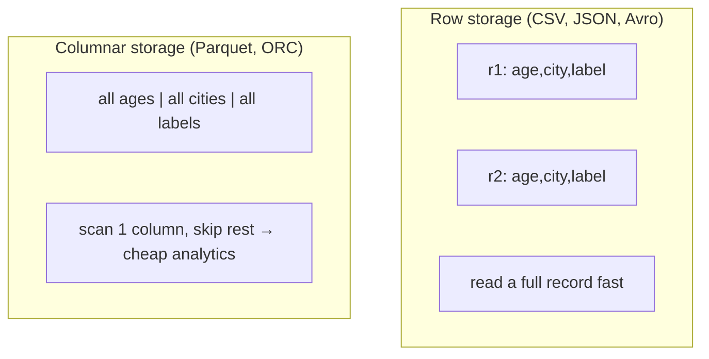
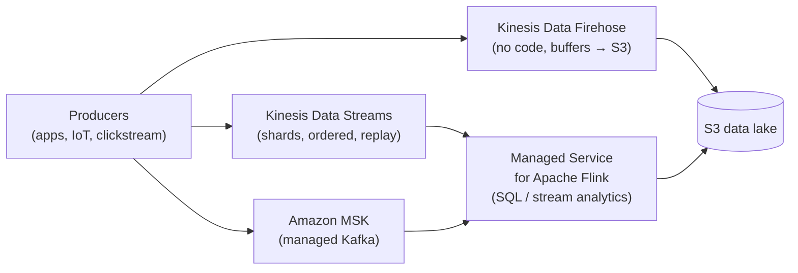
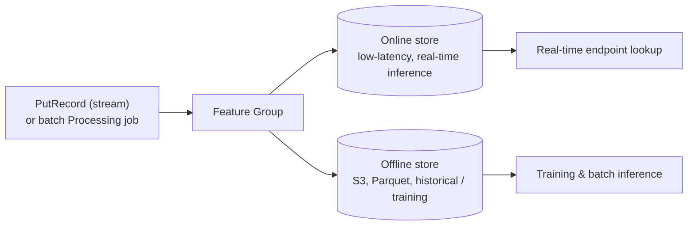

# Domain 1: Data Preparation for Machine Learning

This is **Domain 1 of the AWS Certified Machine Learning Engineer – Associate (MLA-C01)** exam and it carries **28% of the scored questions — the single largest domain**. It tests whether you can *ingest and store* raw data, *transform and engineer features* from it, and *guarantee its integrity* (bias, PII, quality) before a model ever sees it. Master this chapter and you have locked down more than a quarter of the exam plus the vocabulary the rest of the exam assumes you already know.

> **Plain English:** A model is only as good as the data you feed it. Domain 1 is "kitchen prep" for ML — sourcing the ingredients (ingest), washing and chopping them (transform), and making sure nothing is spoiled or unfair (integrity) *before* you cook (train).

---

## Table of Contents
- [The data-prep pipeline at a glance](#pipeline)
- [1.1a Data formats: row vs columnar](#formats)
- [1.1b AWS data sources & storage options](#sources)
- [1.1c Streaming ingestion](#streaming)
- [1.1d Extracting from storage & performance knobs](#extract)
- [1.1e Ingesting into Data Wrangler & Feature Store](#ingest-sm)
- [1.1f Merging data from multiple sources](#merge)
- [1.2a Cleaning & transformation](#cleaning)
- [1.2b Feature engineering](#feature-eng)
- [1.2c Encoding categorical & text data](#encoding)
- [1.2d Transformation tools](#tools)
- [1.2e Data labeling: Ground Truth & Mechanical Turk](#labeling)
- [1.2f SageMaker Feature Store deep-dive](#feature-store)
- [1.3a Pre-training bias metrics (CI, DPL)](#bias-metrics)
- [1.3b Fixing class imbalance](#imbalance)
- [1.3c Encryption, classification, anonymization, PII/PHI](#security)
- [1.3d Validating data quality](#quality)
- [1.3e Bias sources & SageMaker Clarify](#clarify)
- [1.3f Reducing prediction bias: split, shuffle, augment](#split)
- [1.3g Loading data into the training resource](#input-modes)
- [Exam traps & quick-fire review](#traps)
- [References](#references)

---

## The data-prep pipeline at a glance 

🧠 **Mental model:** Think of Domain 1 as three gates every dataset must pass through. **Gate 1 (1.1)** = get the data *in* and *stored* in the right shape. **Gate 2 (1.2)** = *reshape* it into features a model can learn from. **Gate 3 (1.3)** = *certify* it's fair, legal, and clean before training.

```mermaid
flowchart LR
    subgraph SRC["Sources"]
        S3[("Amazon S3")]
        RDS[("Amazon RDS")]
        DDB[("DynamoDB")]
        STR["Kinesis / MSK<br/>(streaming)"]
    end
    subgraph G1["Gate 1 — Ingest & Store (1.1)"]
        FMT["Pick format<br/>Parquet/CSV/JSON/ORC/Avro/RecordIO"]
        STORE[("S3 / EFS / FSx")]
    end
    subgraph G2["Gate 2 — Transform & Feature-engineer (1.2)"]
        CLEAN["Clean: outliers,<br/>impute, dedup"]
        FE["Scale, bin, encode,<br/>log-transform"]
        FS[("Feature Store")]
    end
    subgraph G3["Gate 3 — Integrity (1.3)"]
        BIAS["Bias check<br/>(Clarify: CI, DPL)"]
        PII["PII/PHI, encrypt,<br/>mask, quality"]
        SPLIT["Split / shuffle /<br/>augment"]
    end
    SRC --> G1 --> G2 --> G3 --> TRAIN["Training job"]
```

| Task | Weight-driver | Key AWS services you MUST know |
|---|---|---|
| **1.1** Ingest & store | Formats, sources, streaming | S3, EFS, FSx for NetApp ONTAP, Kinesis, MSK, Glue, RDS, DynamoDB |
| **1.2** Transform & feature-engineer | Cleaning, encoding, labeling | Data Wrangler, Glue, Glue DataBrew, Lambda, Ground Truth, Feature Store |
| **1.3** Ensure integrity | Bias, PII, quality | SageMaker Clarify, Glue Data Quality, Glue DataBrew, Macie, KMS |

---

## 1.1a Data formats: row vs columnar 

🧠 **Mental model:** A **row format** is a spreadsheet read one *record at a time* (great when you need whole rows — transactional writes, streaming). A **columnar format** stores each *column together* (great when analytics scans a few columns over billions of rows — you skip the columns you don't need and compress each column tightly because similar values sit side by side).

⚙️ **Exam-critical format table:**

| Format | Row/Columnar | Validated schema? | Best for | Exam signal |
|---|---|---|---|---|
| **CSV** | Row | No (plain text) | Small/simple tabular, human-readable | Default but no schema, no compression, no nesting |
| **JSON / JSON Lines** | Row | Semi (self-describing) | Nested/semi-structured, APIs, DeepAR input | Flexible but bulky |
| **Apache Avro** | Row | **Yes** (schema embedded) | Streaming, Kafka, schema evolution, write-heavy | "row-based + schema evolution" → **Avro** |
| **Apache Parquet** | **Columnar** | **Yes** | Analytics, Athena/Spark/Glue, ML feature stores | "columnar + query few columns + cheap S3 scan" → **Parquet** |
| **Apache ORC** | **Columnar** | **Yes** | Hive/analytics, high compression | Columnar alternative to Parquet (Hive ecosystem) |
| **RecordIO (protobuf)** | Row (binary) | Yes | **SageMaker built-in algorithms**, Pipe mode | "most efficient input for built-in algos" → **RecordIO-protobuf** |

**Validated vs non-validated:** *Validated* formats (Parquet, ORC, Avro, RecordIO-protobuf) carry a schema/typing so bad records are caught on read; *non-validated* (CSV, raw JSON) are just text and errors surface later.

⚙️ **RecordIO-protobuf** (`application/x-recordio-protobuf`) is the format many **SageMaker built-in algorithms** (Linear Learner, Factorization Machines, K-Means, PCA, NTM) prefer because it is compact binary and streams efficiently in **Pipe mode**, shrinking download time before training. ([SageMaker common data formats](https://docs.aws.amazon.com/sagemaker/latest/dg/sagemaker-algo-common-data-formats.html))

🎯 **On the exam — "if you see X pick Y":**
- "Query a *few columns* over a huge dataset in S3 cost-effectively (Athena)" → **Parquet** (or ORC).
- "Schema evolution + streaming/Kafka + row-oriented" → **Avro**.
- "Most efficient input format for a SageMaker *built-in* algorithm / Pipe mode" → **RecordIO-protobuf**.
- "Convert CSV to a columnar format to cut Athena/Glue cost" → convert to **Parquet** (use Glue or DataBrew).

---

## 1.1b AWS data sources & storage options 

🧠 **Mental model:** Match the *shape* of your data to the *shape* of the store. Object blobs → **S3**. A shared POSIX folder many instances mount → **EFS**. A blazing-fast scratch disk for one big training run → **FSx for Lustre**. Enterprise NAS with snapshots/dedup that also speaks S3 → **FSx for NetApp ONTAP**.

⚙️ **Storage decision table (memorize the "pick when"):**

| Service | Type | Throughput / latency | Pick when… | Exam trap |
|---|---|---|---|---|
| **Amazon S3** | Object store | High throughput, higher latency per object | Default ML data lake; cheap, 11-nines durability, tiers | Not a file system; use Fast File/Pipe mode to stream to training |
| **Amazon EFS** | Elastic NFS file system | Shared, moderate | **Multiple** instances/notebooks share the *same* files; no copy needed | Higher $/GB than S3; regional |
| **Amazon FSx for Lustre** | High-perf parallel FS | **Sub-ms, 100s GB/s** | Large-scale distributed training needing fastest reads; can link to an S3 bucket | Costly; best for heavy repeated epochs |
| **Amazon FSx for NetApp ONTAP** | Managed NetApp NAS | Multi-protocol (NFS, SMB, **iSCSI**, S3) | Enterprise ONTAP features (snapshots, dedup, cloning) + **S3-API access** for SageMaker/Bedrock/Athena | Named explicitly in blueprint — know it does dedup/snapshots and speaks S3 |
| **Amazon EBS** | Block volume (single instance) | Configurable IOPS | Attached disk for one EC2/notebook instance | Not shared across instances |

⚙️ **FSx for NetApp ONTAP** is called out by name in the exam guide: it is a fully managed NetApp ONTAP file system that supports NFS, SMB, and iSCSI, offers snapshots/dedup/compression, and lets **S3-API-based apps (SageMaker training, Bedrock, Athena)** read the data directly. ([FSx for NetApp ONTAP](https://aws.amazon.com/fsx/netapp-ontap/), [access datasets](https://docs.aws.amazon.com/sagemaker/latest/dg/model-access-training-data.html))

🎯 **On the exam:**
- "Fastest possible I/O for large distributed training" → **FSx for Lustre**.
- "Many teams/notebooks share the *same* dataset with POSIX semantics" → **EFS**.
- "Enterprise NAS features (snapshots/dedup) + also readable via S3 API" → **FSx for NetApp ONTAP**.
- "Cheapest durable landing zone / data lake" → **S3**.

---

## 1.1c Streaming ingestion 

🧠 **Mental model:** Batch is a delivery truck (data arrives in bulk on a schedule). Streaming is a conveyor belt (records arrive continuously and you act within seconds). AWS gives you three belts: **Kinesis** (AWS-native), **Apache Flink / Managed Service for Apache Flink** (real-time processing on the belt), and **Amazon MSK** (managed Apache Kafka).

⚙️ **Streaming service table:**

| Service | What it is | Pick when… |
|---|---|---|
| **Kinesis Data Streams** | Sharded, ordered, replayable stream (retention up to 365 days) | Custom consumers, sub-second, need ordering/replay, multiple readers |
| **Kinesis Data Firehose** | Zero-admin **delivery** stream | "Just land streaming data in **S3 / Redshift / OpenSearch** with buffering & optional format conversion (to Parquet)"; near-real-time (buffer interval), no code |
| **Managed Service for Apache Flink** | Managed **Apache Flink** for stream processing | Real-time aggregations/windowing/transforms in-flight (SQL or Java/Python) |
| **Amazon MSK** | Managed **Apache Kafka** | Already on Kafka, need Kafka ecosystem/partitions, portability |

🎯 **On the exam — "if you see X pick Y":**
- "Deliver streaming data to S3/Redshift/OpenSearch with **no code / no admin**, optional Parquet conversion" → **Kinesis Data Firehose**.
- "Need ordering, replay, custom consumers, sub-second" → **Kinesis Data Streams**.
- "Team already uses **Kafka**" → **Amazon MSK**.
- "Real-time windowed aggregation/transform on the stream" → **Managed Service for Apache Flink**.
- "Real-time transform of each record before landing" (lightweight) → **AWS Lambda** on the stream (see 1.2d).

---

## 1.1d Extracting from storage & performance knobs 

⚙️ **Where data lives and how you pull it:**

| Source | Extract with | Speed knob you must know |
|---|---|---|
| **S3** | SDK, Glue, Athena, Fast File/Pipe mode | **S3 Transfer Acceleration** (CloudFront edge for long-distance uploads); multipart upload; S3 Select |
| **Amazon EBS** | Mount to instance | **Provisioned IOPS (io1/io2)** for guaranteed high IOPS; gp3 for baseline |
| **Amazon EFS** | Mount (NFS) | Elastic/Provisioned throughput mode |
| **Amazon RDS** | JDBC, Glue connection, DMS | Read replicas to offload extraction |
| **Amazon DynamoDB** | Scan/Query, **DynamoDB export to S3**, Glue connector | Export-to-S3 (no read-capacity impact) for bulk ML extraction |

⚙️ **Two named performance features the exam loves:**
- **S3 Transfer Acceleration** — speeds up *uploads/downloads over long geographic distances* by routing through the nearest CloudFront edge location. Pick it when data must cross regions/continents fast.
- **EBS Provisioned IOPS (io1/io2)** — guarantees a set IOPS level for I/O-intensive workloads on a single instance's block volume.

🎯 **On the exam:**
- "Users worldwide uploading large files to one S3 bucket, slow" → **S3 Transfer Acceleration**.
- "Need consistent high disk IOPS on a training/notebook instance" → **EBS Provisioned IOPS**.
- "Bulk-export a DynamoDB table for ML without hurting production traffic" → **DynamoDB export to S3**.

---

## 1.1e Ingesting into Data Wrangler & Feature Store 

⚙️ **SageMaker Data Wrangler** is the visual data-prep tool inside SageMaker Studio. It **imports from S3, Athena, Amazon Redshift, Snowflake, and other sources**, applies 300+ built-in transforms, and can **export the flow** to a Processing job, a Feature Store ingestion job, a SageMaker Pipeline, or Python code. ([Data Wrangler](https://aws.amazon.com/sagemaker/ai/data-wrangler/), [Transform Data](https://docs.aws.amazon.com/sagemaker/latest/dg/data-wrangler-transform.html))

⚙️ **SageMaker Feature Store** ingests two ways (details in [1.2f](#feature-store)):
- **Streaming ingest** — synchronous `PutRecord` API for real-time single/small-batch writes.
- **Batch ingest** — a SageMaker Processing job (often exported from Data Wrangler) writes features in bulk. ([Data sources and ingestion](https://docs.aws.amazon.com/sagemaker/latest/dg/feature-store-ingest-data.html))

🎯 **On the exam:** "Author features visually, then push them to Feature Store" → **Data Wrangler → Feature Store ingestion job**.

---

## 1.1f Merging data from multiple sources 

🧠 **Mental model:** Real ML data is scattered across a database, a data lake, and an API. You need to *join and unify* it. Three tools, escalating in power:

| Approach | Use when |
|---|---|
| **Programming (pandas / boto3)** | Small data, ad-hoc, in a notebook |
| **AWS Glue** (serverless Spark ETL + Data Catalog) | Serverless, catalog-driven joins across S3/RDS/JDBC at scale; crawlers infer schema |
| **Apache Spark** (on Glue or EMR) | Very large distributed joins/aggregations; full control |

⚙️ **AWS Glue** = serverless ETL. **Crawlers** infer schemas into the **Glue Data Catalog**; **Glue jobs** (Spark) do the joins/transforms; visual authoring via **Glue Studio**. It is the default AWS answer for "merge/ETL multiple sources at scale without managing servers."

🎯 **On the exam:**
- "Merge data from S3 + RDS + a JDBC source, serverless, at scale" → **AWS Glue**.
- "Massive distributed join, need full Spark control / already on EMR" → **Apache Spark on EMR**.
- "Combine a couple of small CSVs in a notebook" → **pandas**.

---

## 1.2a Cleaning & transformation 

🧠 **Mental model:** Cleaning is quality control on the assembly line — pull out the defective parts (outliers), fill the gaps (impute), and remove duplicates so you don't count the same thing twice.

⚙️ **Core cleaning operations:**

| Problem | Technique | Notes |
|---|---|---|
| **Missing values** | **Imputation** — mean/median/mode, constant, KNN, or drop | Median is robust to outliers; drop only if few rows/columns affected |
| **Outliers** | Detect via **IQR, z-score/standard deviation, robust z-score**; then cap (winsorize), transform, or remove | Data Wrangler has a "Handle outliers" transform |
| **Duplicates** | **Deduplication** — drop exact/near-duplicate rows | Prevents leakage and skewed weighting |
| **Inconsistent formats** | Standardize types, parse dates, fix casing | DataBrew/Data Wrangler transforms |
| **Combining** | Join/concatenate/merge sources | See [1.1f](#merge) |

🎯 **On the exam:** "Numeric column has extreme values distorting the model" → detect with **z-score/IQR** and treat (cap/transform); "many missing values in a feature" → **impute** (median for skewed data), don't blindly drop.

---

## 1.2b Feature engineering 

🧠 **Mental model:** Feature engineering is translating raw numbers into a language the model understands well — putting everything on a comparable scale, and reshaping skewed or lumpy signals into cleaner ones.

⚙️ **Numeric transforms:**

| Technique | What it does | When to use |
|---|---|---|
| **Normalization (min-max)** | Rescale to **[0,1]** | Bounded range needed; distance-based algos (KNN, NN) |
| **Standardization (z-score)** | Mean 0, std 1 | Many linear models, PCA; robust to differing units |
| **Log transformation** | `log(x)` compresses large values | Right-skewed data (income, counts) → more normal |
| **Binning / bucketing** | Continuous → discrete buckets | Reduce noise, capture non-linear thresholds (age groups) |
| **Feature splitting** | Break one field into parts | `2026-07-17` → year/month/day; address → city/zip |
| **Scaling** | Umbrella for min-max/standard | Required when features have very different magnitudes |

> **Plain English — normalize vs standardize:** *Normalize* squeezes values into a fixed box [0,1]. *Standardize* re-centers around 0 with unit spread. Distance/NN models like normalization; linear models/PCA like standardization.

🎯 **On the exam:** "Feature is heavily right-skewed" → **log transform**. "Features on wildly different scales hurt a distance-based/gradient model" → **scale/standardize**. "Turn continuous age into groups" → **binning**.

---

## 1.2c Encoding categorical & text data 

🧠 **Mental model:** Models eat numbers, not words. Encoding turns categories into numbers *without inventing a fake ordering*.

⚙️ **Encoding table:**

| Encoding | How | Use when | Trap |
|---|---|---|---|
| **One-hot** | One binary column per category | **Nominal** (no order), low cardinality | High cardinality → column explosion (use sparse or hashing) |
| **Label encoding** | Each category → integer | **Ordinal** (has order: low/med/high) or tree models | Implies false order if applied to nominal data |
| **Binary encoding** | Category → integer → binary digits across columns | Medium/high cardinality (fewer columns than one-hot) | Middle ground between label and one-hot |
| **Tokenization** | Split **text** into tokens/subwords → IDs | NLP / LLM inputs | Precedes embeddings |

🎯 **On the exam — "if you see X pick Y":**
- "Categorical with **no inherent order**, few values" → **one-hot**.
- "Ordinal categories (S/M/L) or feeding a tree model" → **label encoding**.
- "High-cardinality category, one-hot too wide" → **binary** (or hashing).
- "Prepare raw text for an NLP model" → **tokenization**.

---

## 1.2d Transformation tools 

⚙️ **Which tool for which job — the exam's favorite disambiguation:**

| Tool | What it is | Pick when… |
|---|---|---|
| **SageMaker Data Wrangler** | Visual, 300+ transforms, in Studio, ML-aware (data-quality/leakage insights, export to Feature Store/Pipelines) | End-to-end **ML** feature prep with code export; data scientists |
| **AWS Glue** | Serverless **Spark** ETL + Data Catalog | Code/Spark ETL, cataloging, scheduled pipelines at scale |
| **AWS Glue DataBrew** | **No-code** visual data prep, 250+ pre-built transforms, profiling | Analysts who want point-and-click cleaning/profiling, **no code** |
| **AWS Lambda** | Serverless functions | **Lightweight per-record streaming transforms** (e.g., on Firehose/Kinesis) |
| **Apache Spark (EMR/Glue)** | Distributed compute | Very large custom transforms |

> **Plain English — Data Wrangler vs Glue vs DataBrew:** Data Wrangler is *ML-focused* prep with code export. Glue is *code/Spark ETL* for engineers. DataBrew is *no-code* point-and-click for analysts. All three overlap on cleaning; the exam distinguishes by "no-code" (DataBrew), "ML feature prep with export" (Data Wrangler), or "serverless Spark ETL/catalog" (Glue).

⚙️ **Streaming transforms:** For per-record transforms *in the stream*, use **AWS Lambda** (attach to Kinesis/Firehose) or **Apache Spark / Managed Service for Apache Flink** for stateful/windowed processing.

🎯 **On the exam:**
- "No-code visual cleaning + profiling for analysts" → **Glue DataBrew**.
- "Visual ML feature prep, export to Feature Store/Pipeline" → **Data Wrangler**.
- "Serverless Spark ETL across sources with a catalog" → **AWS Glue**.
- "Transform each streaming record cheaply" → **Lambda**.

---

## 1.2e Data labeling: Ground Truth & Mechanical Turk 

🧠 **Mental model:** Supervised learning needs labels. **SageMaker Ground Truth** is the labeling factory; the *workforce* doing the labeling can be your own team, a vendor, or the anonymous crowd (**Mechanical Turk**). Ground Truth's **automated (active) labeling** lets a model label the easy examples so humans only handle the hard ones — cutting cost up to ~70%.

⚙️ **Workforce options:**

| Workforce | Who | Use when |
|---|---|---|
| **Private** | Your own employees | Confidential/PII/PHI data |
| **Vendor** | AWS Marketplace vendor | Specialized/scaled labeling |
| **Amazon Mechanical Turk** | Public crowd (most workers) | Large volume, **non-sensitive** data |

🎯 **On the exam — critical trap:** When you use **Mechanical Turk**, the input data must be **free of PII** — you set the `FreeOfPersonallyIdentifiableInformation` flag or the labeling job fails. So for **sensitive/PII data, use a private workforce**, never Mechanical Turk. ([Mechanical Turk workforce](https://docs.aws.amazon.com/sagemaker/latest/dg/sms-workforce-management-public.html), [Ground Truth](https://docs.aws.amazon.com/sagemaker/latest/dg/sms.html))

- "Need to label a huge public image set cheaply" → **Ground Truth + Mechanical Turk**.
- "Data contains PII/PHI and needs labeling" → **Ground Truth + private workforce** (not Mechanical Turk).
- "Cut labeling cost — model labels easy items" → **Ground Truth automated data labeling**.

---

## 1.2f SageMaker Feature Store deep-dive 

🧠 **Mental model:** Feature Store is a shared pantry of ready-to-use features so every team stops re-cooking the same ingredients — and so the features used in *training* exactly match those used in *serving* (no training/serving skew).

⚙️ **Exam facts you must retain:**

| Concept | Detail |
|---|---|
| **Online store** | Low-latency, real-time single-record lookups for inference |
| **Offline store** | Sits in **your S3**, stored as **Parquet**; historical data for training/batch |
| **Both enabled** | They sync to prevent training/serving discrepancies |
| **Offline table formats** | Supports **AWS Glue** (default) and **Apache Iceberg** table formats |
| **Ingestion — streaming** | Synchronous **`PutRecord`** API |
| **Ingestion — batch** | Processing job (e.g., exported from Data Wrangler); data buffered and written to S3 **within ~15 minutes** |
| **Feature group** | The schema/table definition; needs a record identifier + event-time feature |

Source: [Feature Store](https://docs.aws.amazon.com/sagemaker/latest/dg/feature-store.html), [offline store format](https://docs.aws.amazon.com/sagemaker/latest/dg/feature-store-offline.html), [ingestion](https://docs.aws.amazon.com/sagemaker/latest/dg/feature-store-ingest-data.html).

🎯 **On the exam:**
- "Reuse features across teams + keep training and serving consistent" → **SageMaker Feature Store**.
- "Real-time inference feature lookup" → **online store**; "historical features for training" → **offline store** (Parquet in S3).

---

## 1.3a Pre-training bias metrics: CI and DPL 

🧠 **Mental model:** Before training, **SageMaker Clarify** measures whether the *raw data* is already unfair to a group (a **facet**, e.g., a demographic). These metrics are **model-agnostic** — they only look at the data and labels, not any model output.

⚙️ **The two blueprint-named metrics:**

| Metric | Question it answers | Formula (intuition) | Range |
|---|---|---|---|
| **Class Imbalance (CI)** | Is one facet **under-represented** in the data (fewer samples)? | `(n_a − n_d) / (n_a + n_d)` — normalized difference in group sizes | **[−1, 1]**; 0 = balanced; +1 = only facet *a* present |
| **Difference in Proportions of Labels (DPL)** | Do groups get **positive labels at different rates**? | `q_a − q_d` (positive-label proportion of *a* minus that of *d*) | **[−1, 1]**; 0 = equal positive-label rates |

- **CI** = *representation* imbalance (how many of each group). **DPL** = *outcome* imbalance (how favorably each group is labeled).
- Clarify computes these in a **Processing job**; you select metrics via `methods=["CI","DPL"]` (or `"all"`). ([Class Imbalance](https://docs.aws.amazon.com/sagemaker/latest/dg/clarify-bias-metric-class-imbalance.html), [Pre-training bias metrics](https://docs.aws.amazon.com/sagemaker/latest/dg/clarify-measure-data-bias.html))

🎯 **On the exam:**
- "One demographic has far **fewer rows**" → **Class Imbalance (CI)**.
- "One group is **labeled positive** far more often than another" → **DPL**.
- "Measure bias **before** training, model-agnostic" → **SageMaker Clarify pre-training metrics**.

---

## 1.3b Fixing class imbalance 

🧠 **Mental model:** If 99% of rows are "not fraud," a model can score 99% accuracy by never predicting fraud. You must rebalance so the minority class gets heard.

⚙️ **Strategies:**

| Strategy | How | Note |
|---|---|---|
| **Oversampling minority** | Duplicate/synthesize minority rows (e.g., **SMOTE**) | Risk of overfitting on duplicates |
| **Undersampling majority** | Drop majority rows | Throws away data |
| **Synthetic data generation** | Generate realistic new minority samples (SMOTE, GANs) | Blueprint-named; boosts rare-class signal |
| **Class weights** | Penalize minority errors more in the loss | No data change needed |
| **Better metric** | Use **F1 / recall / AUC**, not raw accuracy | Accuracy misleads on imbalance |

🎯 **On the exam:** "Severe class imbalance, model ignores the rare class" → **resample (over/under) or generate synthetic data (SMOTE)** and evaluate with **F1/AUC**, not accuracy.

---

## 1.3c Encryption, classification, anonymization, PII/PHI 

🧠 **Mental model:** Sensitive data has legal handcuffs. You must know how to *find* it, *lock* it, and *scrub* it — and which compliance regime applies.

⚙️ **Techniques & services:**

| Need | Technique / Service |
|---|---|
| **Encrypt at rest** | **AWS KMS** (S3 SSE-KMS, EBS, EFS, FSx, SageMaker volumes) |
| **Encrypt in transit** | TLS / HTTPS |
| **Discover & classify PII in S3** | **Amazon Macie** (ML-based sensitive-data discovery) |
| **Anonymization** | Irreversibly remove identifiers (no re-identification) |
| **Masking / redaction** | Hide/replace values (e.g., `****`); Glue DataBrew has masking/redaction transforms; Comprehend detects PII in text |
| **Data classification** | Tag data by sensitivity level to drive controls |

⚙️ **Compliance regimes the exam names:**

| Term | Meaning |
|---|---|
| **PII** | Personally Identifiable Information (name, SSN, email) |
| **PHI** | Protected Health Information — **HIPAA** regulated |
| **Data residency** | Data must stay in a specific **Region/country** → choose Region, block cross-Region copy |

🎯 **On the exam:**
- "Automatically **discover/classify PII** sitting in S3" → **Amazon Macie**.
- "Health data" → **PHI / HIPAA** controls (encrypt, private workforce for labeling).
- "Data must not leave a country" → **data residency** → pick the Region and restrict replication.
- "Mask/redact sensitive columns before sharing" → **Glue DataBrew** (or Comprehend for text PII).

---

## 1.3d Validating data quality 

🧠 **Mental model:** Before training, run a health inspection. Two AWS services do this: **Glue DataBrew** (visual profiling + no-code rules) and **AWS Glue Data Quality** (rule-based checks in your pipeline using **DQDL**).

⚙️ **Tools:**

| Tool | What it validates | Style |
|---|---|---|
| **AWS Glue DataBrew** | Profiling: missing values, cardinality, distributions, duplicates; data-quality rules | **No-code** visual |
| **AWS Glue Data Quality** | Rule-based checks (completeness, uniqueness, freshness) via **DQDL** rulesets on Catalog tables/Glue jobs | In-pipeline, automated |
| **SageMaker Data Wrangler** | **Data Quality and Insights report**: missing values, duplicate rows, outliers, class imbalance, **target/data leakage** | ML-aware, in Studio |

🎯 **On the exam:**
- "Automated quality rules inside a Glue ETL pipeline" → **AWS Glue Data Quality (DQDL)**.
- "No-code visual profiling of a dataset" → **Glue DataBrew**.
- "Detect **data leakage** / class imbalance during ML prep" → **Data Wrangler Data Quality and Insights report**.

---

## 1.3e Bias sources & SageMaker Clarify 

🧠 **Mental model:** Bias sneaks in at the *source*. Know the two named types and that **SageMaker Clarify** is the AWS tool that detects bias (pre- and post-training) and explains predictions (SHAP).

| Bias source | What it is | Example |
|---|---|---|
| **Selection bias** | Sample doesn't represent the population | Survey only online users → misses offline population |
| **Measurement bias** | Data collected/labeled inconsistently or with faulty instruments | One sensor miscalibrated; inconsistent labelers |

⚙️ **SageMaker Clarify** roles across the lifecycle:
- **Pre-training bias** (data): CI, DPL, and more (this domain).
- **Post-training bias** (model predictions): measured in Domain 2/4.
- **Explainability**: feature-attribution via **SHAP**.

🎯 **On the exam:** "Detect and quantify bias / explain predictions" → **SageMaker Clarify**. "Sample skewed toward one group" → **selection bias**; "labels/measurements inconsistent" → **measurement bias**.

---

## 1.3f Reducing prediction bias: split, shuffle, augment 

🧠 **Mental model:** Even clean data can mislead if you split it carelessly. Shuffle so order doesn't leak, split so the model is tested on unseen data, and augment to add variety the model would otherwise never see.

| Technique | Purpose | Watch-out |
|---|---|---|
| **Train/validation/test split** | Honest evaluation on unseen data | Common: 70/15/15 or 80/10/10; keep test untouched |
| **Shuffling** | Break ordering artifacts before splitting | Time-series: do **not** random-shuffle — split chronologically |
| **Stratified split** | Preserve class proportions in each split | Essential for imbalanced classes |
| **Data augmentation** | Synthetically expand data (flip/rotate images, paraphrase text) | Adds robustness; helps minority class |

🎯 **On the exam:**
- "Model memorized order / leaked patterns" → **shuffle before splitting** (but chronological split for time series).
- "Imbalanced classes in the split" → **stratified split**.
- "Small image dataset, model overfits" → **data augmentation**.

---

## 1.3g Loading data into the training resource 

🧠 **Mental model:** How training *reads* the data changes speed and cost. You either **copy it all first** (File mode), **stream on demand** (Pipe / Fast File), or **mount a shared file system** (EFS / FSx).

⚙️ **SageMaker training input modes ([choosing input mode](https://docs.aws.amazon.com/sagemaker/latest/dg/model-access-training-data-best-practices.html)):**

| Input mode | Source | Behavior | Pick when… |
|---|---|---|---|
| **File mode** (default) | S3 → local disk | **Downloads the whole dataset** before training starts | Dataset fits on disk; simplest |
| **Fast File mode** | S3 | Exposes S3 as a **POSIX file system**, streams objects **on demand**, starts fast | Large S3 data, want File-like access without full download |
| **Pipe mode** | S3 | Streams data as a **Unix pipe** (often RecordIO) | Very large datasets, sequential streaming, minimize disk |
| **EFS** | EFS | **Mounts** the file system (no copy) | Data already in EFS, shared across jobs |
| **FSx for Lustre** | FSx | **Mounts** high-performance FS (can link to S3) | Fastest repeated reads for large distributed training |

🎯 **On the exam — "if you see X pick Y":**
- "Huge S3 dataset, want training to **start quickly** without downloading everything, POSIX access" → **Fast File mode**.
- "Stream a massive dataset with minimal local disk" → **Pipe mode**.
- "Data already sits in a shared file system used by many jobs" → **EFS**.
- "Need the **fastest** I/O for large-scale distributed training" → **FSx for Lustre**.
- "Small dataset, keep it simple" → **File mode**.

---

## Exam traps & quick-fire review 

| If you see… | Pick / Answer |
|---|---|
| Query a few columns over huge S3 data cheaply (Athena) | **Parquet / ORC** (columnar) |
| Schema evolution + streaming/Kafka, row-based | **Avro** |
| Most efficient input for SageMaker **built-in** algorithms / Pipe mode | **RecordIO-protobuf** |
| Deliver streaming data to S3/Redshift/OpenSearch, **no code** | **Kinesis Data Firehose** |
| Ordering, replay, custom consumers, sub-second | **Kinesis Data Streams** |
| Team already on **Kafka** | **Amazon MSK** |
| Real-time windowed stream processing | **Managed Service for Apache Flink** |
| Fastest I/O for large distributed training | **FSx for Lustre** |
| Many notebooks share the **same** files (POSIX) | **Amazon EFS** |
| Enterprise NAS (snapshots/dedup) **+ S3-API** access | **FSx for NetApp ONTAP** |
| Speed up cross-region S3 **uploads** | **S3 Transfer Acceleration** |
| Guaranteed high disk IOPS on one instance | **EBS Provisioned IOPS** |
| Bulk-export DynamoDB without hurting prod | **DynamoDB export to S3** |
| Serverless Spark ETL / merge sources + catalog | **AWS Glue** |
| **No-code** visual data prep / profiling | **AWS Glue DataBrew** |
| Visual ML feature prep → export to Feature Store/Pipeline | **SageMaker Data Wrangler** |
| Lightweight per-record streaming transform | **AWS Lambda** |
| Label a huge **non-sensitive** dataset cheaply | **Ground Truth + Mechanical Turk** |
| Label **PII/PHI** data | **Ground Truth + private workforce** (never Mechanical Turk) |
| Cut labeling cost, model labels easy items | **Ground Truth automated data labeling** |
| Reuse features + training/serving consistency | **SageMaker Feature Store** (online + offline/Parquet) |
| Group under-represented (fewer rows) | **Class Imbalance (CI)** |
| Group labeled positive at different rates | **DPL** |
| Fix severe class imbalance | **Resample / synthetic data (SMOTE)**; evaluate with **F1/AUC** |
| Discover/classify PII in S3 | **Amazon Macie** |
| Health data / HIPAA | **PHI** controls (encrypt, private labeling) |
| Data must stay in-country | **Data residency** → choose Region, restrict replication |
| Automated quality rules in a Glue pipeline | **AWS Glue Data Quality (DQDL)** |
| Detect data leakage during ML prep | **Data Wrangler Data Quality & Insights report** |
| Detect bias / explain predictions | **SageMaker Clarify** |
| Right-skewed numeric feature | **Log transform** |
| Nominal categorical, low cardinality | **One-hot encoding** |
| Ordinal categorical / tree model | **Label encoding** |
| Start training fast on huge S3 data, POSIX | **Fast File mode** |

**Five reflexes to carry into the exam:**
1. **Columnar (Parquet/ORC) = analytics/scan-few-columns; Row (Avro/CSV/JSON) = write/stream whole records; RecordIO = built-in algos.**
2. **Firehose = no-code land-to-S3; Data Streams = replay/order; MSK = Kafka; Flink = process the stream.**
3. **Mechanical Turk ⇒ NO PII.** Sensitive data ⇒ private workforce.
4. **CI = representation imbalance; DPL = label-rate imbalance.** Both are **pre-training, model-agnostic, from Clarify.**
5. **Fast File/Pipe = stream from S3; EFS/FSx = mount a file system; File = copy-then-train.**

---

---

## Glossary

| Term | Simple explanation | Purpose |
|---|---|---|
| MLA-C01 | The AWS Certified Machine Learning Engineer – Associate exam code | Identifies the certification exam this chapter prepares you for |
| Domain 1 | The first scored section of MLA-C01, covering data preparation (28% of the exam) | Anchors all data-prep topics under a single exam weight |
| Data pipeline | A series of steps that move and transform data from source to a model-ready form | Structures the ingestion → transformation → integrity workflow |
| Ingest | The act of pulling raw data from a source and loading it into a storage system | First gate before any transformation or training |
| Feature engineering | Reshaping raw data columns into numeric signals a model can learn from effectively | Directly improves model accuracy without changing the algorithm |
| Integrity (data) | Ensuring data is fair, free of illegal identifiers, and high quality before training | Prevents biased or legally problematic models |
| CSV | Comma-Separated Values; plain text table, one row per line, no schema | Simple row-based format, human-readable but no type enforcement |
| JSON / JSON Lines | JavaScript Object Notation; semi-structured, supports nesting | Flexible row-based format used by APIs and streaming events |
| Apache Avro | Binary row-based format with an embedded schema supporting schema evolution | Best for Kafka/streaming pipelines where schema changes over time |
| Apache Parquet | Columnar binary format with schema and efficient compression | Default format for analytics and ML feature stores queried by Athena/Glue |
| Apache ORC | Optimized Row Columnar; columnar format common in Hive ecosystems | Columnar alternative to Parquet, especially for Hive-based workloads |
| RecordIO-protobuf | Binary row-based format preferred by SageMaker built-in algorithms | Enables efficient Pipe mode streaming, shrinking pre-training download time |
| Columnar storage | Stores each column's values together rather than each row together | Allows analytic queries to skip irrelevant columns, reducing cost |
| Row storage | Stores each complete record together | Efficient for reading or writing one full record at a time |
| Schema | A formal definition of a dataset's columns, types, and constraints | Lets systems catch bad records at read time instead of silently corrupting training |
| Schema evolution | Ability to add or change fields in a data format without breaking existing consumers | Essential for long-lived streaming pipelines |
| Amazon S3 | AWS object store with 11-nines durability and tiered pricing | Default data lake for raw data, features, and model artifacts |
| Amazon EFS | Elastic File System; managed NFS that multiple instances can mount simultaneously | Lets many training jobs or notebooks share the same files without copying |
| Amazon FSx for Lustre | High-performance parallel file system with sub-millisecond latency | Fastest I/O option for large-scale distributed training jobs |
| Amazon FSx for NetApp ONTAP | Managed NetApp NAS supporting NFS, SMB, iSCSI, and S3 API | Enterprise features (snapshots, dedup) combined with S3-API access for SageMaker |
| Amazon EBS | Elastic Block Store; block volume attached to a single EC2 or notebook instance | Provides configurable IOPS for single-instance workloads |
| Kinesis Data Streams | Sharded, ordered, replayable streaming service with up to 365-day retention | Real-time ingest for sub-second, ordered, multi-consumer pipelines |
| Kinesis Data Firehose | Zero-code delivery stream that buffers and lands data in S3, Redshift, or OpenSearch | Easiest way to continuously load streaming data into a data lake |
| Managed Service for Apache Flink | AWS-managed Apache Flink for real-time windowed stream processing | Runs SQL or code-based transformations on live data streams |
| Amazon MSK | Managed Streaming for Apache Kafka; fully managed Kafka service | Used when teams need Kafka's ecosystem or require cross-cloud portability |
| Shard | A unit of throughput in Kinesis Data Streams; each shard handles ordered records | Determines throughput capacity and ordering guarantees |
| S3 Transfer Acceleration | Speeds up S3 uploads/downloads over long distances via CloudFront edge nodes | Reduces latency when producers and the S3 bucket are far apart geographically |
| EBS Provisioned IOPS | A guaranteed IOPS level on an EBS block volume (io1/io2) | Ensures consistent high-speed disk access for I/O-intensive single-instance jobs |
| DynamoDB export to S3 | Bulk export of a DynamoDB table directly to S3 without consuming read capacity | Lets ML teams extract training data without impacting production database performance |
| SageMaker Data Wrangler | Visual, ML-aware data preparation tool inside SageMaker Studio | End-to-end feature prep with 300+ transforms, quality insights, and export to Pipelines/Feature Store |
| SageMaker Feature Store | Managed repository for reusable, versioned ML features with online and offline stores | Eliminates training/serving skew by storing features consistently for both real-time inference and model training |
| Online store (Feature Store) | Low-latency, single-record lookup layer of Feature Store | Serves features to real-time inference endpoints with millisecond latency |
| Offline store (Feature Store) | Historical feature data stored as Parquet in S3 | Used for model training and batch inference; supports Glue and Iceberg table formats |
| PutRecord | The Feature Store streaming API call that writes a single record synchronously | Enables real-time feature ingestion for online serving |
| Feature group | The schema and table definition in Feature Store, requiring a record identifier and event-time column | Organizes features into a logical, queryable unit |
| AWS Glue | Serverless Spark ETL service with a Data Catalog for schema management | Merges, transforms, and catalogs data from multiple sources without managing servers |
| Glue Crawler | Glue component that scans data sources and infers schemas into the Data Catalog | Automates schema discovery, avoiding hand-written table definitions |
| Glue Data Catalog | Central metadata repository for tables, schemas, and partitions across AWS | Makes data discoverable by Athena, SageMaker, and other services |
| Glue Studio | Visual authoring interface for creating and monitoring Glue ETL jobs | Allows low-code pipeline authoring for non-expert users |
| AWS Glue DataBrew | No-code visual data preparation service with 250+ pre-built transforms | Lets analysts clean, profile, and transform data without writing code |
| DQDL | Data Quality Definition Language; rule syntax for AWS Glue Data Quality checks | Specifies completeness, uniqueness, freshness, and other rules for automated quality gates |
| AWS Glue Data Quality | Rule-based in-pipeline data quality checking service | Automatically validates datasets against defined rules and blocks bad data from flowing downstream |
| Apache Spark | Distributed computing framework for large-scale data processing | Handles very large joins, aggregations, and transforms across many nodes |
| Amazon EMR | Elastic MapReduce; managed Hadoop/Spark cluster service | Runs full-scale Spark or Hadoop workloads with complete control over the cluster |
| pandas | Python data manipulation library for in-memory tabular data | Suitable for small, ad-hoc data merging or exploration in notebooks |
| Imputation | Filling in missing values using statistical estimates (mean, median, mode, KNN) | Preserves rows that would otherwise be dropped, maintaining dataset size |
| Outlier | A data point that falls far outside the normal distribution of its column | Can distort model training if not detected and treated |
| IQR | Interquartile Range; the spread between the 25th and 75th percentile | Used to detect outliers as points beyond 1.5×IQR from the quartiles |
| Z-score | Number of standard deviations a value is from the mean | Detects outliers as values with absolute z-score above a threshold (e.g., 3) |
| Deduplication | Removing duplicate rows from a dataset | Prevents over-weighting repeated examples and data leakage |
| Normalization | Rescaling feature values to [0, 1] | Required for distance-based and neural-network algorithms sensitive to scale |
| Standardization | Transforming a feature to have mean 0 and standard deviation 1 | Preferred by linear models and PCA where units differ across features |
| Log transformation | Applying log(x) to compress a right-skewed column toward a normal distribution | Reduces the influence of very large values on model training |
| Binning / bucketing | Converting a continuous numeric feature into discrete categorical buckets | Captures non-linear thresholds and reduces noise from minor variations |
| Feature splitting | Breaking one compound field into multiple separate fields | Extracts more signal from structured strings such as dates or addresses |
| One-hot encoding | Creating one binary column per category value | Represents nominal categories as numbers without implying false ordering |
| Label encoding | Mapping each category to an integer | Suitable for ordinal categories or tree-based models |
| Binary encoding | Converting a category to its integer representation then to binary digits | More space-efficient than one-hot for medium-to-high cardinality features |
| Tokenization | Splitting text into tokens or subwords and mapping them to integer IDs | Required preprocessing step for feeding text to NLP and LLM models |
| Cardinality | The number of unique values in a categorical column | High cardinality makes one-hot encoding impractical; drives choice of alternative encoding |
| SageMaker Ground Truth | AWS managed data labeling service with workforce options and automated labeling | Generates labeled training data at scale, reducing cost via machine-assisted labeling |
| Mechanical Turk | Amazon's public crowd-sourced workforce for annotation tasks | Provides large-scale labeling for non-sensitive public data |
| Private workforce | A labeling workforce made up of your own employees or a vendor | Required for PII/PHI or confidential data that must not be shared publicly |
| Automated data labeling | Ground Truth feature where a model labels easy examples so humans handle only hard ones | Reduces labeling cost by up to ~70% by minimizing human review |
| PII | Personally Identifiable Information; data that can identify an individual (name, SSN, email) | Triggers legal obligations to protect, anonymize, or mask before sharing or labeling |
| PHI | Protected Health Information; health data regulated under HIPAA | Requires stricter controls including encryption, private labeling workforce, and access restriction |
| HIPAA | U.S. Health Insurance Portability and Accountability Act | Compliance regime governing how health data must be stored, processed, and accessed |
| Amazon Macie | ML-powered service that discovers and classifies sensitive data in S3 | Automatically detects PII and other sensitive content to trigger protective controls |
| AWS KMS | Key Management Service; creates and manages encryption keys | Used to encrypt S3 buckets, EBS volumes, SageMaker model artifacts, and notebooks at rest |
| SSE-KMS | Server-Side Encryption using AWS KMS-managed keys | Protects S3 objects at rest with customer-controlled encryption keys |
| Anonymization | Irreversibly removing or transforming identifiers so re-identification is impossible | Meets legal requirements for sharing datasets without exposing personal details |
| Data residency | Requirement that data must remain within a specific geographic region or country | Drives selection of AWS Region and disables cross-region replication |
| SageMaker Clarify | AWS tool that computes pre-training bias metrics, post-training bias metrics, and SHAP explainability | Detects unfairness and explains model decisions throughout the ML lifecycle |
| Class Imbalance (CI) | Pre-training bias metric measuring under-representation of a demographic group by sample count | Signals when one group has too few training examples for the model to learn from fairly |
| DPL | Difference in Proportions of Labels; measures whether groups receive positive labels at different rates | Reveals outcome bias in the training data before any model is trained |
| Facet | A sensitive attribute or demographic group used in bias analysis (e.g., gender, age) | Defines which subgroup comparisons are made when computing bias metrics |
| Selection bias | Bias that occurs when the training sample does not represent the true population | Causes the model to underperform on groups that were under-sampled during data collection |
| Measurement bias | Bias from inconsistent data collection instruments or labeling practices | Introduces systematic errors that skew model learning |
| SMOTE | Synthetic Minority Over-sampling Technique; generates new synthetic minority-class examples | Addresses class imbalance without simply duplicating existing rows |
| Oversampling | Duplicating or generating minority-class rows to balance class distribution | Gives the model more minority-class signal at the cost of potential overfitting |
| Undersampling | Removing majority-class rows to balance class distribution | Simpler than oversampling but discards potentially useful data |
| F1 score | Harmonic mean of precision and recall | Preferred metric when class imbalance makes raw accuracy misleading |
| AUC | Area Under the ROC Curve; measures a classifier's ability across all thresholds | Robust to class imbalance; used to compare classifiers independent of threshold |
| Train/validation/test split | Partitioning data into sets for training, tuning, and final unbiased evaluation | Ensures the model is tested on data it has never seen during training or hyperparameter tuning |
| Stratified split | Split that preserves each class's proportion in every partition | Essential for imbalanced datasets to prevent a split from having no minority-class examples |
| Shuffling | Randomly reordering rows before splitting | Removes any ordering artifacts that could leak patterns into the model |
| Data augmentation | Synthetically expanding a dataset (e.g., flipping images, paraphrasing text) | Improves robustness and helps models generalize from small or imbalanced datasets |
| File mode | SageMaker training input mode that downloads the full dataset to local disk before starting | Simplest input mode; suitable when the dataset fits on the training instance's disk |
| Fast File mode | SageMaker training input mode that exposes S3 as a POSIX file system and streams objects on demand | Allows training to start immediately without downloading the full dataset |
| Pipe mode | SageMaker training input mode that streams data as a Unix pipe (typically RecordIO) | Minimizes local disk usage for very large sequential datasets |
| Apache Iceberg | Open table format supporting time-travel and schema evolution | Supported as an offline Feature Store table format alongside the default AWS Glue format |
| Glue DataBrew masking | Glue DataBrew transform that replaces sensitive values with redacted placeholders | Enables sharing datasets without exposing PII or other sensitive column values |
| Amazon Comprehend | AWS NLP service that detects entities, sentiment, key phrases, and PII in text | Can identify PII inside unstructured text fields before data is shared or labeled |

---

## References 

- SageMaker – Choosing an input mode and storage unit: https://docs.aws.amazon.com/sagemaker/latest/dg/model-access-training-data-best-practices.html
- SageMaker – Setting up training jobs to access datasets (S3/EFS/FSx): https://docs.aws.amazon.com/sagemaker/latest/dg/model-access-training-data.html
- SageMaker – Common data formats for built-in algorithms (RecordIO-protobuf): https://docs.aws.amazon.com/sagemaker/latest/dg/sagemaker-algo-common-data-formats.html
- SageMaker Data Wrangler (product): https://aws.amazon.com/sagemaker/ai/data-wrangler/
- SageMaker Data Wrangler – Transform Data: https://docs.aws.amazon.com/sagemaker/latest/dg/data-wrangler-transform.html
- SageMaker Feature Store: https://docs.aws.amazon.com/sagemaker/latest/dg/feature-store.html
- Feature Store – Data sources and ingestion: https://docs.aws.amazon.com/sagemaker/latest/dg/feature-store-ingest-data.html
- Feature Store – Offline store data format (Parquet, Glue/Iceberg): https://docs.aws.amazon.com/sagemaker/latest/dg/feature-store-offline.html
- SageMaker Clarify – Pre-training bias metrics: https://docs.aws.amazon.com/sagemaker/latest/dg/clarify-measure-data-bias.html
- SageMaker Clarify – Class Imbalance (CI): https://docs.aws.amazon.com/sagemaker/latest/dg/clarify-bias-metric-class-imbalance.html
- SageMaker Clarify – Run processing jobs for bias & explainability: https://docs.aws.amazon.com/sagemaker/latest/dg/clarify-processing-job-run.html
- SageMaker Ground Truth – Data labeling: https://docs.aws.amazon.com/sagemaker/latest/dg/sms.html
- SageMaker Ground Truth – Mechanical Turk workforce (PII requirement): https://docs.aws.amazon.com/sagemaker/latest/dg/sms-workforce-management-public.html
- SageMaker Ground Truth – Enhanced/automated data labeling: https://docs.aws.amazon.com/sagemaker/latest/dg/sms-data-labeling.html
- Amazon FSx for NetApp ONTAP: https://aws.amazon.com/fsx/netapp-ontap/
- AWS Blog – Choose the best data source for your SageMaker training job: https://aws.amazon.com/blogs/machine-learning/choose-the-best-data-source-for-your-amazon-sagemaker-training-job/
- MLA-C01 exam guide: https://docs.aws.amazon.com/aws-certification/latest/examguides/machine-learning-engineer-associate-01.html
