# Domain 2: ML Model Development

This domain is **26% of the MLA-C01** exam — the second-largest slice — and it is where you prove you can *choose*, *train*, *refine*, and *judge* models on AWS. It is a hands-on associate exam, so expect scenarios that hand you a business problem, a dataset shape, and a constraint (cost, latency, interpretability, ops overhead) and ask you to pick the right algorithm, the right training trick, or the right metric. This chapter teaches each idea from first principles first, then nails the exact SageMaker service, feature, and parameter you will be tested on.

The three task statements this maps to:

- **Task 2.1** — Choose a modeling approach
- **Task 2.2** — Train and refine models
- **Task 2.3** — Analyze model performance

> Source: [MLA-C01 exam guide (v1.0)](https://docs.aws.amazon.com/aws-certification/latest/examguides/machine-learning-engineer-associate-01.html)

---

## Table of contents
- [The model-development mental map](#map)
- [Task 2.1 — Choosing a modeling approach](#choose)
  - [AWS AI services vs SageMaker vs Bedrock: the first fork](#fork)
  - [The pre-built AI services (Rekognition, Transcribe, Translate, Comprehend, …)](#ai-services)
  - [Amazon Bedrock & SageMaker JumpStart: foundation models](#bedrock-jumpstart)
  - [SageMaker built-in algorithms — the master table](#builtin)
  - [Interpretability as a selection criterion](#interpretability)
  - [Feasibility, complexity & cost-based selection](#feasibility)
- [Task 2.2 — Training and refining models](#train)
  - [Epoch, step, batch size: the training vocabulary](#vocab)
  - [Reducing training time: early stopping & distributed training](#reduce-time)
  - [Overfitting, underfitting & catastrophic forgetting](#fit)
  - [Regularization: dropout, weight decay, L1, L2](#reg)
  - [Hyperparameters & SageMaker Automatic Model Tuning (AMT)](#amt)
  - [Ensembling: bagging, boosting, stacking](#ensemble)
  - [Bringing your own model & script mode](#byo)
  - [Fine-tuning foundation models](#finetune)
  - [Reducing model size](#size)
  - [Model versioning with SageMaker Model Registry](#registry)
- [Task 2.3 — Analyzing model performance](#analyze)
  - [The confusion matrix and everything derived from it](#confusion)
  - [Precision vs recall vs F1: when to prefer which](#pr-f1)
  - [ROC, AUC and threshold selection](#roc)
  - [Regression metrics: RMSE, MAE, R²](#regression-metrics)
  - [Baselines, convergence & debugging with SageMaker Debugger](#debug)
  - [Bias & explainability with SageMaker Clarify](#clarify)
  - [Reproducibility, experiments & shadow vs production variants](#repro)
- [Exam traps & quick-fire review](#traps)
- [References](#refs)

---

## The model-development mental map 

**Plain English:** Before you touch any algorithm, you make one big decision: *do I build the model, buy the model, or borrow the model?* Everything in Domain 2 hangs off that fork.

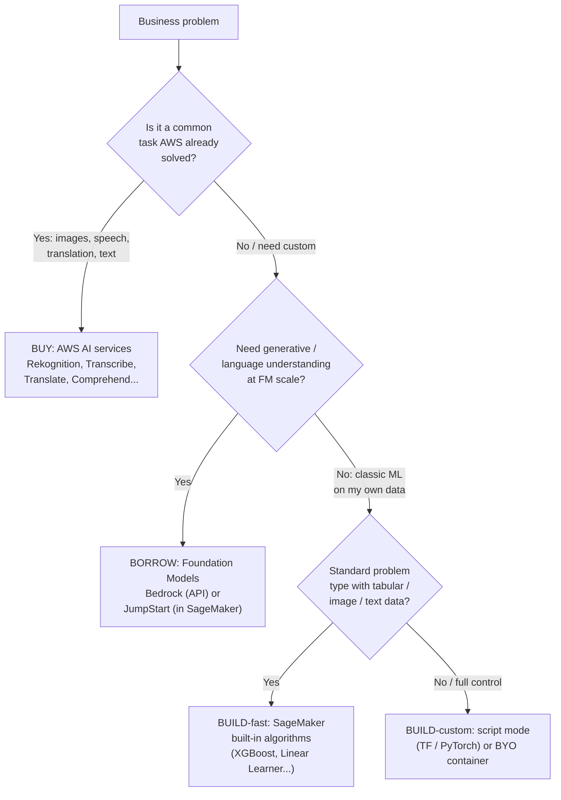

| Approach | You supply | AWS supplies | Best when |
|---|---|---|---|
| **AI services** | Data (via API call) | Fully trained model + infra | Task is common (vision, speech, NLP) and you want zero ML work |
| **Foundation models** (Bedrock / JumpStart) | Prompts, optional fine-tune data | Pre-trained FM + serving | Generative AI, summarization, chat, embeddings |
| **Built-in algorithms** | Training data + hyperparameters | Optimized algorithm containers | Standard supervised/unsupervised ML on your data |
| **Script mode** | Training script (TF/PyTorch/sklearn) | Managed training infra + framework container | You have model code but want SageMaker to run it |
| **BYO container** | Docker image with everything | Just the compute + orchestration | Non-standard framework / full control |

---

## Task 2.1 — Choosing a modeling approach 

### AWS AI services vs SageMaker vs Bedrock: the first fork 

**Plain English:** AI services are *vending machines* — call an API, get an answer, no training. SageMaker is a *fully-equipped kitchen* — you cook the model yourself. Bedrock is a *catered buffet of pre-cooked foundation models* you can serve as-is or lightly re-season (fine-tune).

The exam constantly tests this reflex with the qualifier **"least operational overhead"** or **"fastest to market."** If a managed AI service can do the job, it beats building a SageMaker model.

### The pre-built AI services 

These require **no model training**. Memorize what each one does — matching questions love them.

| Service | Modality | What it does | Classic exam trigger |
|---|---|---|---|
| **Amazon Rekognition** | Image / video | Object & scene detection, faces, text-in-image, content moderation, celebrity, PPE | "detect objects/faces/inappropriate content in images or video" |
| **Amazon Transcribe** | Audio → text | Speech-to-text, speaker diarization, custom vocabulary, PII redaction, medical (Transcribe Medical) | "convert call-center audio to text / subtitles" |
| **Amazon Translate** | Text → text | Neural machine translation between languages | "translate content across languages" |
| **Amazon Polly** | Text → audio | Text-to-speech with lifelike voices | "read text aloud / voice response" |
| **Amazon Comprehend** | Text | Entities, key phrases, sentiment, language, topic modeling, **PII detection**; Comprehend Medical for clinical text | "find sentiment / entities / PII in documents" |
| **Amazon Textract** | Document image | Extract text, forms, tables from scanned docs | "read scanned forms/invoices" (OCR+structure) |
| **Amazon Lex** | Text / voice | Conversational bots (same tech as Alexa) | "build a chatbot / IVR" |
| **Amazon Kendra** | Documents | ML-powered enterprise semantic search | "natural-language search over company docs" |
| **Amazon Personalize** | Interaction data | Real-time recommendations | "product/content recommendations" |
| **Amazon Forecast** | Time series | Managed time-series forecasting (retiring — but still testable) | "demand/inventory forecasting, no ML team" |
| **Amazon Fraud Detector** | Transaction data | Online fraud detection | "detect fraudulent online transactions" |

> 🎯 **On the exam:** If you see *"a company with no ML expertise wants to \<common task\> quickly,"* the answer is almost always an **AI service**, not a SageMaker training job. Only reach for SageMaker when the task is **custom** or the AI services can't do it.

Source: [AWS AI services overview](https://aws.amazon.com/machine-learning/ai-services/) · [Rekognition](https://docs.aws.amazon.com/rekognition/latest/dg/what-is.html) · [Transcribe](https://docs.aws.amazon.com/transcribe/latest/dg/what-is.html) · [Translate](https://docs.aws.amazon.com/translate/latest/dg/what-is.html) · [Comprehend](https://docs.aws.amazon.com/comprehend/latest/dg/what-is.html)

### Amazon Bedrock & SageMaker JumpStart: foundation models 

**Plain English:** Both give you access to large pre-trained foundation models. **Bedrock** is a *serverless API* — no infrastructure, pay per token, models from Anthropic (Claude), Meta (Llama), Amazon (Titan/Nova), Cohere, AI21, Mistral, Stability. **JumpStart** lives *inside SageMaker Studio* — it deploys open FMs and built-in solution templates to endpoints you manage, and lets you fine-tune with a few clicks.

| | Amazon Bedrock | SageMaker JumpStart |
|---|---|---|
| Access model | Serverless API (per-token or provisioned throughput) | Deploy to a SageMaker endpoint you own |
| Infra to manage | None | You pick/own the instance |
| Best for | Generative apps with least ops; RAG via Knowledge Bases; Guardrails | Open-source FMs, fine-tuning control, solution templates, VPC-only needs |
| Customization | Fine-tuning, continued pre-training, RAG | Fine-tuning, full script control |

> 🎯 **If you see X pick Y:** "Fully managed access to multiple FMs via one API, least overhead" → **Bedrock**. "Deploy/fine-tune an open-source model inside SageMaker" → **JumpStart**. "Add safety filters / block topics / redact PII on a GenAI app" → **Guardrails for Amazon Bedrock**.

Source: [Amazon Bedrock](https://docs.aws.amazon.com/bedrock/latest/userguide/what-is-bedrock.html) · [SageMaker JumpStart](https://docs.aws.amazon.com/sagemaker/latest/dg/studio-jumpstart.html)

### SageMaker built-in algorithms — the master table 

**Plain English:** These are AWS-optimized, ready-to-train algorithm containers. You bring data + hyperparameters; you don't write model code. Learn each one's *problem type* and *one-line "use when."* AWS groups them by **supervised, unsupervised, text, image**.

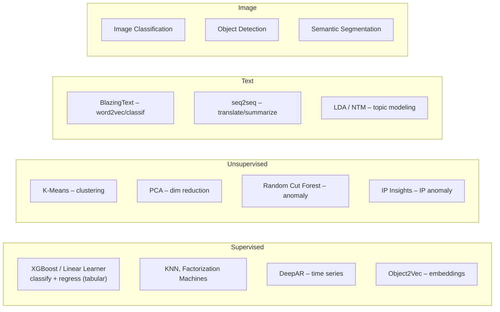

| Algorithm | Category | Problem type | Use it when… |
|---|---|---|---|
| **XGBoost** | Supervised | Classification & regression (tabular) | The go-to for **structured/tabular** data; gradient-boosted trees; strong, fast, interpretable-ish. Default answer for most tabular ML questions. |
| **Linear Learner** | Supervised | Classification & regression (tabular) | Linear relationships, huge sparse data, want a fast linear baseline; trains many models in parallel and picks the best. |
| **K-Nearest Neighbors (k-NN)** | Supervised | Classification & regression | Non-parametric; predict from the *k* closest labeled points. Good for similarity-based prediction. |
| **Factorization Machines** | Supervised | Classification & regression | **High-dimensional sparse** data — recommendation / click-prediction with sparse feature interactions. |
| **DeepAR** | Supervised | **Time-series forecasting** | Forecasting *many related* time series (RNN-based); learns across series. "Forecast sales across thousands of products." |
| **Object2Vec** | Supervised | Embeddings | Learn low-dimensional embeddings of high-dim objects (e.g., find similar tickets/documents). |
| **K-Means** | Unsupervised | Clustering | Group unlabeled data into *k* clusters (customer segmentation). |
| **PCA** | Unsupervised | Dimensionality reduction | Reduce number of features while keeping variance; preprocessing before another model. |
| **Random Cut Forest (RCF)** | Unsupervised | **Anomaly detection** | Detect outliers/anomalies in data streams (fraud, IoT sensor spikes). |
| **IP Insights** | Unsupervised | IP anomaly detection | Learn patterns of IPv4 ↔ entity (user/account); flag suspicious logins. |
| **LDA** (Latent Dirichlet Allocation) | Unsupervised | Topic modeling | Discover topics in a document corpus (classic statistical method). |
| **NTM** (Neural Topic Model) | Unsupervised | Topic modeling | Same goal as LDA but neural-network based. |
| **BlazingText** | Text | Text classification & word2vec embeddings | Fast Word2Vec / supervised text classification at scale. |
| **Sequence-to-Sequence (seq2seq)** | Text | Translation, summarization, speech-to-text | Input sequence → output sequence tasks. |
| **Image Classification** | Image | Label a whole image | "Is this image a cat/dog/adult content?" (single label or multi-label). |
| **Object Detection** | Image | Locate + label objects (bounding boxes) | "Find and box every person/car in the image." |
| **Semantic Segmentation** | Image | Pixel-level classification | "Tag every pixel" — self-driving, medical imaging. |
| *AutoGluon-Tabular, CatBoost, LightGBM, TabTransformer* | Supervised (tabular) | Classification & regression | Newer tabular options; AutoGluon **ensembles + stacks** automatically. |

> 🎯 **Highest-yield reflexes:**
> - **Tabular classify/regress** → **XGBoost** (default) or Linear Learner.
> - **Forecast time series** → **DeepAR** (or Amazon Forecast if "no ML team").
> - **Anomaly/outlier detection** → **Random Cut Forest** (streams) / **IP Insights** (IPs).
> - **Topic modeling** → **LDA** or **NTM**.
> - **Clustering unlabeled data** → **K-Means**.
> - **Dimensionality reduction** → **PCA**.
> - **Object detection vs image classification vs segmentation** = *box it* vs *label the whole image* vs *label every pixel*.
> - **Sparse recommendation features** → **Factorization Machines**.

Source: [Built-in algorithms and pretrained models in Amazon SageMaker](https://docs.aws.amazon.com/sagemaker/latest/dg/algos.html)

### Interpretability as a selection criterion 

**Plain English:** Interpretability = *how easily a human can understand why the model decided what it did.* Regulated domains (credit, healthcare, hiring) often *require* it, which can override "most accurate."

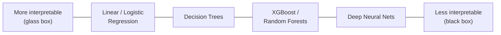

| Interpretability need | Pick |
|---|---|
| Must explain every decision (regulator, loan denial) | **Linear/Logistic Regression, single Decision Tree** |
| Want accuracy but *some* explanation | **XGBoost** + **SageMaker Clarify (SHAP)** for feature attributions |
| Accuracy dominates, explanation secondary | Deep neural nets / FMs, add **Clarify** post-hoc |

> 🎯 **On the exam:** "The model's decisions must be **explainable / auditable** to regulators" → favor an inherently interpretable model **and/or** use **SageMaker Clarify** to produce **SHAP** feature-importance explanations. Don't pick a giant black-box NN when the question stresses interpretability.

### Feasibility, complexity & cost-based selection 

**Plain English:** Match the *complexity of the tool* to the *complexity of the problem and data*. Don't fine-tune a foundation model when XGBoost on tabular data would do — that's wasted cost and latency.

| Signal in the question | Lean toward |
|---|---|
| Small tabular dataset, standard prediction | **Built-in algorithm** (XGBoost) — cheapest, fastest |
| No labeled data, need structure | **Unsupervised** (K-Means, PCA, RCF) |
| Common perceptual task (vision/speech/NLP) | **AI service** |
| Generative / language reasoning | **Bedrock / JumpStart FM** |
| Non-standard research architecture | **Script mode / BYO container** |
| "Most cost-effective" | Prefer built-ins & smaller instances over FM fine-tuning; use **Spot** for training |

---

## Task 2.2 — Training and refining models 

### Epoch, step, batch size: the training vocabulary 

**Plain English:** Imagine studying a stack of flashcards.
- **Batch size** = how many cards you look at before updating what you've learned.
- **Step (iteration)** = one such update (one batch processed → one weight update).
- **Epoch** = one full pass through the *entire* deck of cards.

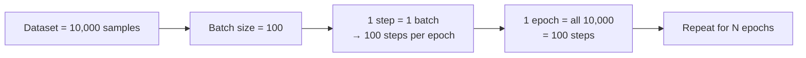

| Term | Definition | Relationship |
|---|---|---|
| **Batch size** | Samples processed before one weight update | steps/epoch = dataset ÷ batch size |
| **Step / iteration** | One batch → one gradient update | — |
| **Epoch** | One full pass over the whole dataset | Total steps = epochs × (steps per epoch) |

**Effects to remember:**
- **Larger batch** → faster, smoother, more GPU memory, can generalize slightly worse.
- **Smaller batch** → noisier updates (can escape local minima), less memory, slower per-epoch throughput.
- **More epochs** → better fit up to a point, then **overfitting**. This is exactly what **early stopping** guards against.

### Reducing training time: early stopping & distributed training 

**Plain English:** Two levers cut training time — *stop sooner when you've learned enough* (early stopping), and *split the work across more machines* (distributed training).

**Early stopping** halts training when the validation metric stops improving, saving time and money and preventing overfitting.

**Distributed training** — two fundamentally different strategies:

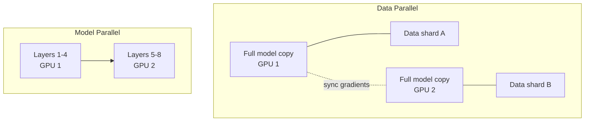

| Strategy | Split what? | Use when | SageMaker feature |
|---|---|---|---|
| **Data parallel** | Split the **data** across GPUs, each holds a **full model copy**, gradients synced | Dataset is huge but **model fits in one GPU** | **SageMaker Distributed Data Parallelism (SMDDP)** library |
| **Model parallel** | Split the **model** (layers/tensors) across GPUs | **Model too big** to fit in a single GPU (large LLMs) | **SageMaker Model Parallelism (SMP) library v2** (tensor parallelism, sharded data parallelism, activation checkpointing/offloading) |

> 🎯 **If you see X pick Y:** "Training data too large / training too slow, model fits in memory" → **data parallel**. "Model itself is too large to fit on one GPU" → **model parallel**. Both are exposed through the SageMaker **distributed training libraries** in AWS Deep Learning Containers (PyTorch/Hugging Face). Other time-savers: **Spot instances** (up to ~90% cheaper, use **checkpointing** to survive interruptions), **Pipe/FastFile** input mode to stream data, and **warm pools** to skip instance spin-up.

Source: [Distributed training in SageMaker](https://docs.aws.amazon.com/sagemaker/latest/dg/distributed-training.html) · [SMDDP library](https://docs.aws.amazon.com/sagemaker/latest/dg/data-parallel-intro.html) · [Model parallelism intro](https://docs.aws.amazon.com/sagemaker/latest/dg/model-parallel-intro.html) · [AMT early stopping](https://aws.amazon.com/blogs/machine-learning/amazon-sagemaker-automatic-model-tuning-now-supports-early-stopping-of-training-jobs/)

### Overfitting, underfitting & catastrophic forgetting 

**Plain English:**
- **Underfitting** = model too simple — bad on training AND test data (didn't learn enough). Like memorizing nothing.
- **Overfitting** = model memorized the training data including its noise — great on training, bad on new data. Like memorizing answers instead of understanding.
- **Catastrophic forgetting** = when fine-tuning, the model *forgets* previously learned knowledge while learning the new task.

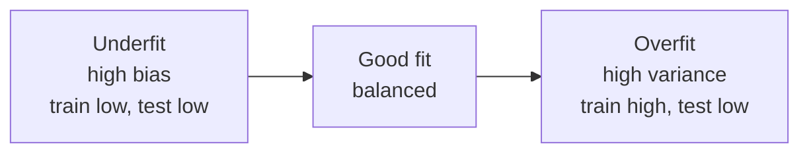

| Problem | Symptom | Fixes |
|---|---|---|
| **Underfitting** | Poor train *and* test accuracy | More complex model, more features, more epochs, less regularization |
| **Overfitting** | Great train, poor test (big gap) | **Regularization**, **dropout**, more data / data augmentation, **feature selection**, early stopping, simpler model |
| **Catastrophic forgetting** | Fine-tuned model loses prior abilities | Lower learning rate, mix in original data, **RAG** instead of fine-tune, parameter-efficient fine-tuning (LoRA), regularization |

### Regularization: dropout, weight decay, L1, L2 

**Plain English:** Regularization = *deliberately handicapping the model so it can't memorize noise.* It trades a bit of training accuracy for better generalization.

| Technique | Intuition | Effect |
|---|---|---|
| **L1 (Lasso)** | Adds penalty proportional to the **absolute** value of weights | Drives some weights to **exactly zero** → automatic **feature selection**, sparse model |
| **L2 (Ridge / weight decay)** | Adds penalty proportional to the **square** of weights | Shrinks all weights toward (but not to) zero → smoother, smaller-magnitude weights. In neural nets this is called **weight decay** |
| **Dropout** | Randomly "turns off" a fraction of neurons each training step | Forces redundancy → network can't rely on any single neuron → less overfitting (NN-specific) |
| **Elastic Net** | Blend of L1 + L2 | Sparse *and* stable |

> 🎯 **On the exam:** "Want automatic **feature selection** / drop irrelevant features / sparse model" → **L1**. "Shrink weights smoothly to reduce overfitting" → **L2 / weight decay**. "Neural network overfitting, want to randomly disable neurons" → **dropout**. Weight decay ≈ L2 regularization.

### Hyperparameters & SageMaker Automatic Model Tuning (AMT) 

**Plain English:** **Parameters** are learned *by* training (weights). **Hyperparameters** are knobs you set *before* training (learning rate, tree depth, number of layers). **AMT** automatically runs many training jobs with different hyperparameter values and finds the best combination against an objective metric.

**Common hyperparameters & their effect:**

| Hyperparameter | Model | More of it means… |
|---|---|---|
| **Number of trees / rounds** | XGBoost, Random Forest | More capacity; too many → overfitting/slow |
| **Max tree depth** | Trees | Deeper trees capture more interactions but overfit |
| **Number of layers / units** | Neural nets | More capacity; too many → overfit + slow + larger model |
| **Learning rate** | All gradient methods | Too high → diverges/oscillates; too low → slow, may not converge |
| **k** | K-Means, k-NN | Number of clusters / neighbors |
| **Batch size, epochs** | NN | See training vocabulary above |

**AMT search strategies** (know these cold):

| Strategy | How it works | Best for |
|---|---|---|
| **Grid search** | Try **every** combination in a discrete grid | Small, discrete search spaces; exhaustive but expensive |
| **Random search** | Sample combinations **randomly** | Large spaces; parallelizes well; surprisingly strong baseline |
| **Bayesian optimization** | Uses results of **prior jobs** to pick smarter next combinations | Sample-efficient; fewer jobs to a good answer (AMT default) |
| **Hyperband** | Dynamically allocates resources; **early-stops** weak configs, gives more epochs to strong ones | Iterative algorithms (NNs over epochs, GBDTs over rounds) — **up to 3× faster** than random/Bayesian |

> 🎯 **If you see X pick Y:** "Explore hyperparameters **efficiently, learning from previous runs**" → **Bayesian**. "Speed up tuning of a **deep neural net / iterative** training up to 3×, auto-stop bad trials" → **Hyperband**. "Exhaustively try **all** combinations of a small set" → **Grid**. "Simple, highly parallel, no assumptions" → **Random**. Enable **early stopping** in AMT to terminate unpromising training jobs (saves cost up to ~28%).

Source: [Hyperparameter tuning strategies in SageMaker AMT](https://docs.aws.amazon.com/sagemaker/latest/dg/automatic-model-tuning-how-it-works.html) · [Hyperband announcement](https://aws.amazon.com/about-aws/whats-new/2022/09/amazon-sagemaker-automatic-model-tuning-provides-faster-hyperparameter-tuning-hyperband-search-strategy/) · [AMT best practices](https://docs.aws.amazon.com/sagemaker/latest/dg/automatic-model-tuning-considerations.html)

### Ensembling: bagging, boosting, stacking 

**Plain English:** *Ask many models and combine their answers.* A crowd of weak-ish models often beats one model.

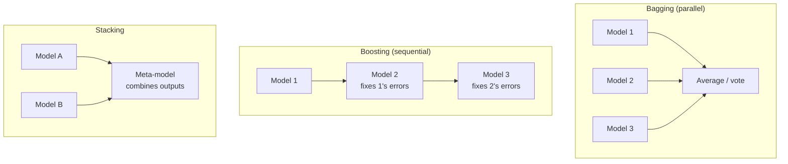

| Method | How | Reduces | Example |
|---|---|---|---|
| **Bagging** | Train models in **parallel** on random data subsets, then average/vote | **Variance** (overfitting) | Random Forest |
| **Boosting** | Train models **sequentially**, each correcting the previous one's errors | **Bias** (underfitting) | **XGBoost**, LightGBM, CatBoost |
| **Stacking** | Feed several models' predictions into a **meta-model** | Both | **AutoGluon-Tabular** stacks in layers |

> 🎯 **On the exam:** **XGBoost = boosting**. "Combine many diverse models automatically to maximize accuracy" → **AutoGluon** (ensembling + stacking). Boosting reduces bias; bagging reduces variance.

### Bringing your own model & script mode 

**Plain English:** You don't have to use a built-in algorithm. SageMaker offers a ladder from "least effort" to "most control."

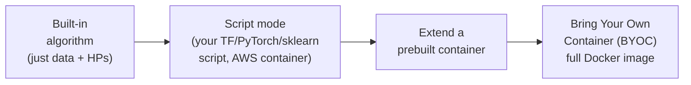

| Option | You provide | Use when |
|---|---|---|
| **Built-in algorithm** | Data + hyperparameters | Standard problem type |
| **Script mode** | A training script; SageMaker injects it into a **managed framework container** (TensorFlow, PyTorch, MXNet, scikit-learn, Hugging Face, XGBoost) | You have model code in a supported framework |
| **Extend prebuilt container** | Dockerfile `FROM` an AWS container + extra deps | Need extra libraries |
| **BYO container (BYOC)** | Your own Docker image pushed to **ECR** | Unsupported framework / total control |

> 🎯 **On the exam:** "I already have **TensorFlow/PyTorch code** and want SageMaker managed training" → **script mode**. "My framework isn't supported / I need a custom runtime" → **BYO container in ECR**. You can also **import an externally trained model** by packaging its artifacts and a compatible container to create a SageMaker Model for deployment.

Source: [SageMaker script mode / bring your own model](https://docs.aws.amazon.com/sagemaker/latest/dg/frameworks.html)

### Fine-tuning foundation models 

**Plain English:** Instead of training from scratch, take a pre-trained FM and *adjust* it to your task/domain. Cheaper and needs far less data than from-scratch training.

| Approach | What it changes | Cost | When |
|---|---|---|---|
| **Prompt engineering** | Nothing (just the input) | Cheapest | First thing to try |
| **RAG** | Nothing; retrieves your docs at inference | Low; no training | Keep answers grounded on private/fresh data |
| **Fine-tuning** | Model weights, on labeled examples | Medium–high | Consistent task-specific behavior/format |
| **Continued pre-training** | Model weights, on large unlabeled domain corpus | High | Teach a whole new domain/vocabulary |

**Where:** Fine-tune via **Amazon Bedrock** (managed, per-model) or **SageMaker JumpStart** (fine-tune open FMs with your data on your endpoint). Watch for **catastrophic forgetting** — mitigate with low learning rates and parameter-efficient methods (e.g., LoRA).

> 🎯 **If you see X pick Y:** "Ground FM on private docs, no retraining, keep data fresh" → **RAG**. "Need the model to consistently produce a specific style/format from examples" → **fine-tuning**. "Adapt to an entirely new domain/jargon with lots of unlabeled text" → **continued pre-training**.

### Reducing model size 

**Plain English:** Smaller models are cheaper, faster, and fit on edge devices — at a small accuracy cost.

| Technique | Idea |
|---|---|
| **Quantization** (data types) | Use lower-precision numbers (FP32 → FP16/INT8) → less memory & faster inference |
| **Pruning** | Remove weights/neurons that contribute little |
| **Knowledge distillation** | Train a small "student" model to mimic a big "teacher" |
| **Feature selection** | Fewer input features → simpler model (L1 helps here) |
| **Compression** | Compact model artifacts |

**Factors that influence model size:** number of parameters (layers/units, tree count/depth), input feature count, embedding dimensions, and numeric precision.

> 🎯 **On the exam:** "Deploy to a **resource-constrained / edge device**, reduce size and latency" → **quantization + pruning** (and see **SageMaker Neo** for compiling/optimizing models to target hardware — covered in Domain 3).

### Model versioning with SageMaker Model Registry 

**Plain English:** A *catalog* of your trained models for repeatability, audits, and controlled promotion to production.

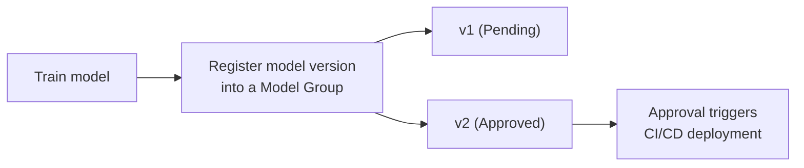

Key facts:
- Models are organized into **Model (Package) Groups**; each registered model is a **model version** — a numeric value **starting at 1**, incremented each time.
- Each version has an **approval status**: **PendingManualApproval → Approved / Rejected**.
- Setting a version to **Approved** can **trigger CI/CD deployment** (e.g., via EventBridge → Pipelines). Update via `update_model_package` or the console.
- Stores metadata, metrics, and lineage → supports **repeatability and audits**.

> 🎯 **On the exam:** "Manage **model versions**, track approvals, and gate production deployment for audits" → **SageMaker Model Registry**. Approval status change is the classic CI/CD trigger.

Source: [SageMaker Model Registry](https://docs.aws.amazon.com/sagemaker/latest/dg/model-registry.html) · [Model groups & versions](https://docs.aws.amazon.com/sagemaker/latest/dg/model-registry-models.html) · [Approval status](https://docs.aws.amazon.com/sagemaker/latest/dg/model-registry-approve.html)

---

## Task 2.3 — Analyzing model performance 

### The confusion matrix and everything derived from it 

**Plain English:** For classification, the **confusion matrix** counts the four ways a prediction can land. Every classification metric is just arithmetic on these four boxes.

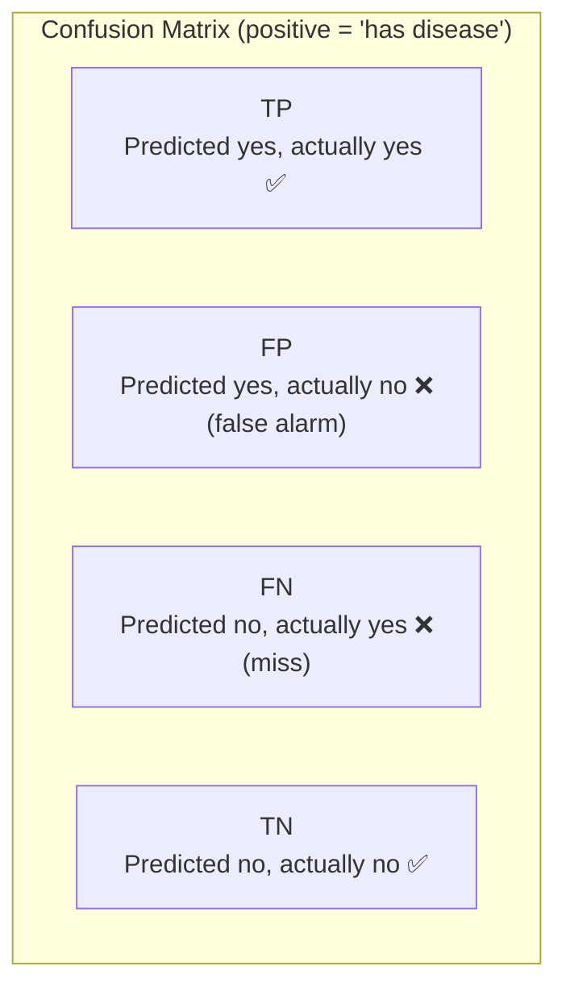

|  | **Actual Positive** | **Actual Negative** |
|---|---|---|
| **Predicted Positive** | True Positive (TP) | False Positive (FP) |
| **Predicted Negative** | False Negative (FN) | True Negative (TN) |

**Worked example** — a disease test on 100 patients: TP=40, FP=10, FN=5, TN=45.

| Metric | Formula | This example | Reads as |
|---|---|---|---|
| **Accuracy** | (TP+TN)/all | (40+45)/100 = **0.85** | Overall % correct |
| **Precision** | TP/(TP+FP) | 40/50 = **0.80** | Of predicted-positive, how many were right |
| **Recall (Sensitivity/TPR)** | TP/(TP+FN) | 40/45 = **0.89** | Of actual positives, how many we caught |
| **Specificity (TNR)** | TN/(TN+FP) | 45/55 = **0.82** | Of actual negatives, how many we cleared |
| **F1 score** | 2·(P·R)/(P+R) | 2·(0.8·0.89)/(0.8+0.89) = **0.84** | Harmonic mean of P & R |

> 🎯 **Accuracy trap:** With **imbalanced data** (99% negatives), a model that predicts "negative" always scores **99% accuracy** but is useless. When classes are imbalanced, **accuracy lies** — use **precision, recall, F1, or AUC** instead. This is one of the most tested ideas in the domain.

A **heat map** is just a colored confusion matrix (or feature-correlation matrix) for visual inspection.

### Precision vs recall vs F1: when to prefer which 

**Plain English:** Precision and recall pull in opposite directions. Which one you optimize depends on **which mistake hurts more.**

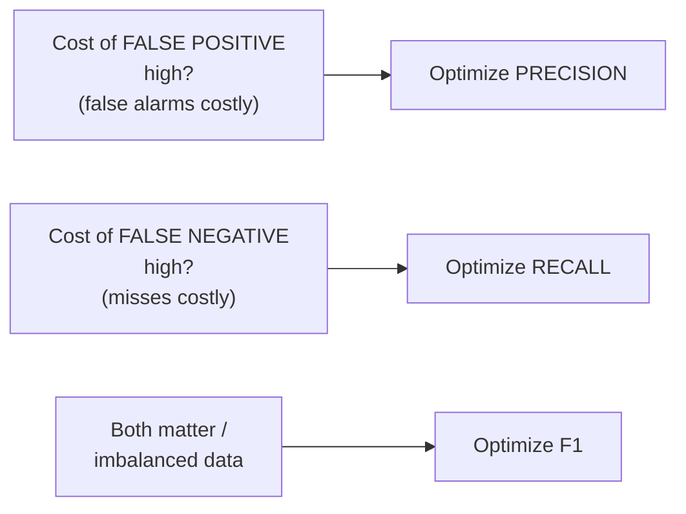

| Scenario | Which error is worse | Optimize |
|---|---|---|
| **Spam filter** | Flagging a real email as spam (FP) loses important mail | **Precision** |
| **Cancer / fraud detection** | Missing a real case (FN) is catastrophic | **Recall** |
| **Imbalanced classes, need balance** | Both matter | **F1** |

> 🎯 **If you see X pick Y:** "**Can't afford to miss** positives (disease, fraud, security threat)" → maximize **recall**. "**False alarms are expensive / user-facing**" → maximize **precision**. "Imbalanced dataset, want a single balanced number" → **F1**.

### ROC, AUC and threshold selection 

**Plain English:** A classifier outputs a *probability*; you choose a **threshold** to turn it into yes/no. The **ROC curve** plots **True Positive Rate (recall)** vs **False Positive Rate** across *all* thresholds. **AUC** (area under that curve) summarizes it in one number: **1.0 = perfect, 0.5 = random guessing.**

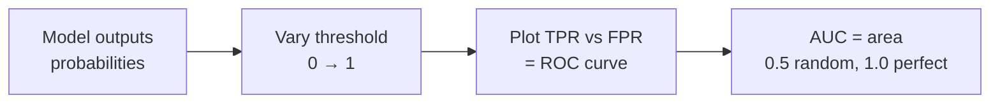

| AUC | Interpretation |
|---|---|
| 0.5 | No better than a coin flip |
| 0.7–0.8 | Acceptable |
| 0.8–0.9 | Good |
| > 0.9 | Excellent |

> 🎯 **On the exam:** AUC is **threshold-independent** and robust to class imbalance → great for **comparing models**. "Single metric to compare classifiers regardless of threshold" → **AUC/ROC**. Precision-Recall (PR) curves are preferred over ROC when the positive class is **very rare**.

### Regression metrics: RMSE, MAE, R² 

**Plain English:** For predicting a number (price, temperature), you measure *how far off* you are.

| Metric | Formula idea | Behavior |
|---|---|---|
| **RMSE** (Root Mean Squared Error) | √(mean of squared errors) | Same units as target; **penalizes large errors heavily** (squares them) — use when big misses are especially bad |
| **MAE** (Mean Absolute Error) | mean of absolute errors | Same units; treats all errors linearly; **more robust to outliers** than RMSE |
| **R²** (coefficient of determination) | 1 − (model error / baseline error) | 1.0 = perfect, 0 = no better than predicting the mean |

> 🎯 **If you see X pick Y:** "**Regression** problem, big errors are costly" → **RMSE**. "Regression with **outliers**, want robustness" → **MAE**. "How much variance the model explains" → **R²**. Lower RMSE/MAE = better.

### Baselines, convergence & debugging with SageMaker Debugger 

**Plain English:** A **baseline** is a dumb reference (predict the average, or a simple model) that your real model must beat — otherwise the ML wasn't worth it. **Convergence** = the loss steadily settles to a minimum. If it doesn't, something's wrong.

**Convergence problems you must recognize:**

| Symptom | Likely cause | Fix |
|---|---|---|
| Loss **not decreasing** | Learning rate too low, bad features, underfitting | Raise LR, add capacity/features |
| Loss **oscillating / exploding** | Learning rate too high, **exploding gradients** | Lower LR, gradient clipping |
| Gradients → 0, no learning | **Vanishing gradients** (deep nets) | Better init, ReLU, batch norm, residual connections |
| Train ↓ but validation ↑ | **Overfitting** | Regularization, early stopping |

**Amazon SageMaker Debugger** captures tensors (gradients, weights, losses, activations) during training and evaluates **built-in rules** in real time — e.g., `vanishing_gradient`, `exploding_tensor`, `loss_not_decreasing`, `overfit`, `overtraining`, `poor_weight_initialization`. It can trigger CloudWatch alarms / stop the job automatically. Max **20** built-in rule containers per training job.

> 🎯 **On the exam:** "Automatically **detect training problems** (vanishing gradients, overfitting, loss not decreasing) and debug **convergence**" → **SageMaker Debugger**. Don't confuse with Model Monitor (that's *production* drift, Domain 4).

Source: [SageMaker Debugger built-in rules](https://docs.aws.amazon.com/sagemaker/latest/dg/debugger-built-in-rules.html) · [SageMaker Debugger](https://docs.aws.amazon.com/sagemaker/latest/dg/train-debugger.html)

### Bias & explainability with SageMaker Clarify 

**Plain English:** **SageMaker Clarify** answers two questions: *"Is my model unfair to a group?"* (bias) and *"Why did the model make this prediction?"* (explainability). It runs as a **processing job**.

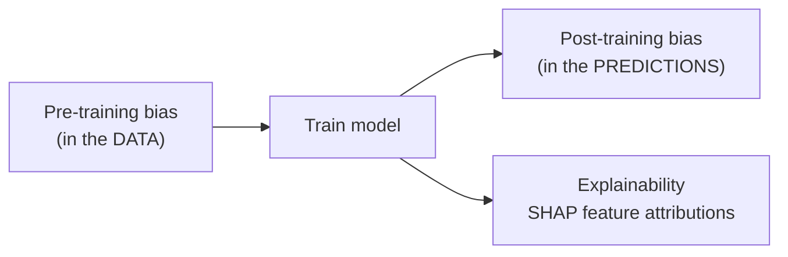

| Clarify capability | What it measures | Example metrics |
|---|---|---|
| **Pre-training bias** | Imbalance in the **training data** before modeling | **Class Imbalance (CI)**, **Difference in Positive Proportions in Labels (DPL)** |
| **Post-training bias** | Bias in the **model's predictions** | **DPPL** (Difference in Positive Proportions in Predicted Labels), **Disparate Impact (DI)**, **Accuracy Difference (AD)**, **Recall Difference**, **Fliptest (FT)** |
| **Explainability** | Which features drove predictions | **SHAP** (Shapley) values — global & per-prediction feature importance; partial dependence plots |

> 🎯 **On the exam:** "Detect **bias** in data or model / measure **fairness** across groups" → **SageMaker Clarify** (pre- and post-training bias metrics). "**Explain** which features drove a prediction / interpretability" → **Clarify + SHAP**. Clarify results integrate into **Model Monitor** (bias/feature-attribution drift in production) and **Model Cards**.

Source: [SageMaker Clarify bias & explainability](https://docs.aws.amazon.com/sagemaker/latest/dg/clarify-configure-processing-jobs.html) · [Clarify processing jobs](https://docs.aws.amazon.com/sagemaker/latest/dg/clarify-processing-job-run.html)

### Reproducibility, experiments & shadow vs production variants 

**Plain English:** To trust and audit results, you must be able to *reproduce* an experiment, *compare* candidate models, and *safely test* a new model against the live one before switching traffic.

| Need | AWS answer |
|---|---|
| Track/compare training runs, params, metrics | **SageMaker Experiments** (part of MLflow / Studio) |
| Reproducible, versioned pipeline | **SageMaker Pipelines** + **Model Registry** + fixed random seeds/data versions |
| Compare a candidate model on real traffic **without affecting users** | **Shadow testing** — the **shadow variant** receives a copy of production traffic; its responses are **logged, not returned** to users |
| Split live traffic between models | **Production variants** (A/B testing) with weighted traffic on a single endpoint |

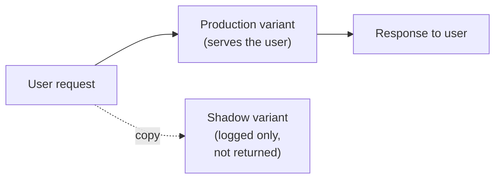

> 🎯 **If you see X pick Y:** "Test a new model on **real traffic without risking users**" → **shadow testing / shadow variant**. "Gradually shift a **percentage of live traffic** between two models to compare" → **production variants (A/B)**. "Compare and reproduce training experiments" → **SageMaker Experiments + Pipelines**.

**Tradeoffs to reason about (a recurring exam theme):** better performance usually costs more **training time**, bigger **instances**, and **money**. When a question asks for "best model," check whether the qualifier is *most accurate*, *fastest*, *cheapest*, or *lowest latency* — that qualifier picks the answer.

Source: [Shadow tests in SageMaker](https://docs.aws.amazon.com/sagemaker/latest/dg/model-shadow-deployment.html) · [Production variants](https://docs.aws.amazon.com/sagemaker/latest/dg/model-ab-testing.html)

---

## Exam traps & quick-fire review 

| # | Trap / Question shape | Answer reflex |
|---|---|---|
| 1 | "No ML expertise, common vision/speech/NLP task, fast" | **AI service** (Rekognition/Transcribe/Translate/Comprehend), not SageMaker |
| 2 | "Managed access to multiple FMs via one API, least ops" | **Amazon Bedrock** |
| 3 | "Deploy/fine-tune an open-source FM inside SageMaker" | **JumpStart** |
| 4 | "Tabular classification/regression" | **XGBoost** (default) or Linear Learner |
| 5 | "Time-series forecasting, many related series" | **DeepAR** (or Amazon Forecast if no ML team) |
| 6 | "Anomaly/outlier detection" | **Random Cut Forest**; IPs → **IP Insights** |
| 7 | "Cluster unlabeled data" | **K-Means** |
| 8 | "Reduce number of features / dimensionality" | **PCA** (or **L1** for feature selection) |
| 9 | "Topic modeling on documents" | **LDA** or **NTM** |
| 10 | "Detect objects with boxes vs label whole image vs per-pixel" | Object Detection vs Image Classification vs Semantic Segmentation |
| 11 | "Imbalanced data — which metric?" | NOT accuracy → **F1 / precision / recall / AUC** |
| 12 | "Can't miss positives (disease/fraud)" | Optimize **recall** |
| 13 | "False alarms costly" | Optimize **precision** |
| 14 | "Compare classifiers regardless of threshold" | **AUC / ROC** |
| 15 | "Regression, big errors costly" | **RMSE**; outliers → **MAE** |
| 16 | "Automatic feature selection / sparse model" | **L1** regularization |
| 17 | "Smoothly shrink weights / NN weight decay" | **L2** |
| 18 | "Randomly disable neurons to fight overfitting" | **Dropout** |
| 19 | "Efficient HPO learning from past runs" | **Bayesian** (AMT) |
| 20 | "3× faster HPO for deep nets, auto-stop bad trials" | **Hyperband** |
| 21 | "Data too big, model fits one GPU" | **Data parallel** (SMDDP) |
| 22 | "Model too big for one GPU" | **Model parallel** (SMP v2) |
| 23 | "Detect vanishing gradients / convergence issues in training" | **SageMaker Debugger** |
| 24 | "Detect bias / explain predictions (SHAP)" | **SageMaker Clarify** |
| 25 | "Version models, gate production via approval, audits" | **Model Registry** |
| 26 | "Test new model on live traffic without user impact" | **Shadow variant / shadow testing** |
| 27 | "Split live traffic between two models" | **Production variants (A/B)** |
| 28 | "I have TF/PyTorch code, want managed training" | **Script mode** |
| 29 | "Unsupported framework / full control" | **BYO container (ECR)** |
| 30 | "Ground FM on private docs, no retraining" | **RAG**; consistent format from examples → **fine-tuning** |
| 31 | "XGBoost is which ensemble method?" | **Boosting** (reduces bias); bagging reduces variance |
| 32 | "Deploy to edge, reduce size/latency" | **Quantization + pruning** (+ Neo) |
| 33 | "Decisions must be explainable to regulators" | Interpretable model (linear/tree) + **Clarify SHAP** |

**One-line mental models to keep:**
- Buy (AI services) → Borrow (Bedrock/JumpStart FMs) → Build-fast (built-ins) → Build-custom (script/BYOC).
- Epoch = full pass; step = one batch update; batch size = samples per update.
- Precision = "when I say yes, am I right?"; Recall = "did I catch them all?"; F1 = balance.
- Accuracy lies on imbalanced data.
- L1 = sparse/feature-select; L2 = shrink; dropout = disable neurons.
- Bayesian = smart; Hyperband = fast for iterative; Grid = exhaustive; Random = simple.
- Debugger = training convergence; Clarify = bias/explain; Model Monitor = production drift.

---

## References 

All URLs verified against current AWS documentation.

- MLA-C01 exam guide (v1.0): https://docs.aws.amazon.com/aws-certification/latest/examguides/machine-learning-engineer-associate-01.html
- SageMaker built-in algorithms & pretrained models: https://docs.aws.amazon.com/sagemaker/latest/dg/algos.html
- Choose an algorithm (types of algorithms): https://docs.aws.amazon.com/sagemaker/latest/dg/algorithms-choose.html
- Amazon Bedrock — what is it: https://docs.aws.amazon.com/bedrock/latest/userguide/what-is-bedrock.html
- SageMaker JumpStart: https://docs.aws.amazon.com/sagemaker/latest/dg/studio-jumpstart.html
- AWS AI services: https://aws.amazon.com/machine-learning/ai-services/
- Amazon Rekognition: https://docs.aws.amazon.com/rekognition/latest/dg/what-is.html
- Amazon Transcribe: https://docs.aws.amazon.com/transcribe/latest/dg/what-is.html
- Amazon Translate: https://docs.aws.amazon.com/translate/latest/dg/what-is.html
- Amazon Comprehend: https://docs.aws.amazon.com/comprehend/latest/dg/what-is.html
- Distributed training in SageMaker: https://docs.aws.amazon.com/sagemaker/latest/dg/distributed-training.html
- SageMaker distributed data parallelism (SMDDP): https://docs.aws.amazon.com/sagemaker/latest/dg/data-parallel-intro.html
- SageMaker model parallelism intro: https://docs.aws.amazon.com/sagemaker/latest/dg/model-parallel-intro.html
- SageMaker model parallelism v2: https://docs.aws.amazon.com/sagemaker/latest/dg/model-parallel-v2.html
- Hyperparameter tuning strategies (AMT): https://docs.aws.amazon.com/sagemaker/latest/dg/automatic-model-tuning-how-it-works.html
- AMT best practices: https://docs.aws.amazon.com/sagemaker/latest/dg/automatic-model-tuning-considerations.html
- AMT early stopping: https://aws.amazon.com/blogs/machine-learning/amazon-sagemaker-automatic-model-tuning-now-supports-early-stopping-of-training-jobs/
- AMT Hyperband announcement: https://aws.amazon.com/about-aws/whats-new/2022/09/amazon-sagemaker-automatic-model-tuning-provides-faster-hyperparameter-tuning-hyperband-search-strategy/
- SageMaker frameworks / script mode: https://docs.aws.amazon.com/sagemaker/latest/dg/frameworks.html
- SageMaker Model Registry: https://docs.aws.amazon.com/sagemaker/latest/dg/model-registry.html
- Model groups, versions & approval: https://docs.aws.amazon.com/sagemaker/latest/dg/model-registry-models.html
- Update model approval status: https://docs.aws.amazon.com/sagemaker/latest/dg/model-registry-approve.html
- SageMaker Debugger: https://docs.aws.amazon.com/sagemaker/latest/dg/train-debugger.html
- SageMaker Debugger built-in rules: https://docs.aws.amazon.com/sagemaker/latest/dg/debugger-built-in-rules.html
- SageMaker Clarify — bias & explainability: https://docs.aws.amazon.com/sagemaker/latest/dg/clarify-configure-processing-jobs.html
- Clarify processing jobs: https://docs.aws.amazon.com/sagemaker/latest/dg/clarify-processing-job-run.html
- Shadow deployment (shadow variant): https://docs.aws.amazon.com/sagemaker/latest/dg/model-shadow-deployment.html
- Production variants / A/B testing: https://docs.aws.amazon.com/sagemaker/latest/dg/model-ab-testing.html
