# Domain 2: ML Model Development

This domain is **26% of the MLA-C01** exam — the second-largest slice — and it is where you prove you can *choose*, *train*, *refine*, and *judge* models on AWS. It is a hands-on associate exam, so expect scenarios that hand you a business problem, a dataset shape, and a constraint (cost, latency, interpretability, ops overhead) and ask you to pick the right algorithm, the right training trick, or the right metric. This chapter teaches each idea from first principles first, then nails the exact SageMaker service, feature, and parameter you will be tested on.

The three task statements this maps to:

- **Task 2.1** — Choose a modeling approach
- **Task 2.2** — Train and refine models
- **Task 2.3** — Analyze model performance

> Source: [MLA-C01 exam guide (v1.0)](https://docs.aws.amazon.com/aws-certification/latest/examguides/machine-learning-engineer-associate-01.html)

---

## Table of contents
- [The model-development mental map](#map)
- [Task 2.1 — Choosing a modeling approach](#choose)
  - [AWS AI services vs SageMaker vs Bedrock: the first fork](#fork)
  - [The pre-built AI services (Rekognition, Transcribe, Translate, Comprehend, …)](#ai-services)
  - [Amazon Bedrock & SageMaker JumpStart: foundation models](#bedrock-jumpstart)
  - [SageMaker built-in algorithms — the master table](#builtin)
  - [Interpretability as a selection criterion](#interpretability)
  - [Feasibility, complexity & cost-based selection](#feasibility)
- [Task 2.2 — Training and refining models](#train)
  - [Epoch, step, batch size: the training vocabulary](#vocab)
  - [Reducing training time: early stopping & distributed training](#reduce-time)
  - [Overfitting, underfitting & catastrophic forgetting](#fit)
  - [Regularization: dropout, weight decay, L1, L2](#reg)
  - [Hyperparameters & SageMaker Automatic Model Tuning (AMT)](#amt)
  - [Ensembling: bagging, boosting, stacking](#ensemble)
  - [Bringing your own model & script mode](#byo)
  - [Fine-tuning foundation models](#finetune)
  - [Reducing model size](#size)
  - [Model versioning with SageMaker Model Registry](#registry)
- [Task 2.3 — Analyzing model performance](#analyze)
  - [The confusion matrix and everything derived from it](#confusion)
  - [Precision vs recall vs F1: when to prefer which](#pr-f1)
  - [ROC, AUC and threshold selection](#roc)
  - [Regression metrics: RMSE, MAE, R²](#regression-metrics)
  - [Baselines, convergence & debugging with SageMaker Debugger](#debug)
  - [Bias & explainability with SageMaker Clarify](#clarify)
  - [Reproducibility, experiments & shadow vs production variants](#repro)
- [Exam traps & quick-fire review](#traps)
- [References](#refs)

---

## The model-development mental map 

**Plain English:** Before you touch any algorithm, you make one big decision: *do I build the model, buy the model, or borrow the model?* Everything in Domain 2 hangs off that fork.

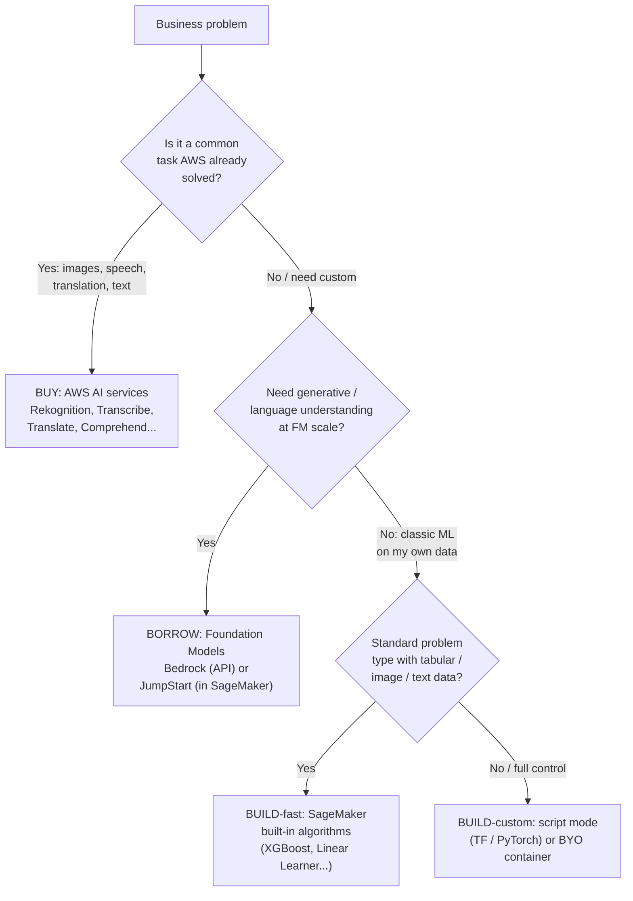
```mermaid
flowchart TD
    Start["Business problem"] --> Q1{"Is it a common\ntask AWS already\nsolved?"}
    Q1 -->|"Yes: images, speech,\ntranslation, text"| AI["BUY: AWS AI services\nRekognition, Transcribe,\nTranslate, Comprehend..."]
    Q1 -->|"No / need custom"| Q2{"Need generative /\nlanguage understanding\nat FM scale?"}
    Q2 -->|"Yes"| FM["BORROW: Foundation Models\nBedrock (API) or\nJumpStart (in SageMaker)"]
    Q2 -->|"No: classic ML\non my own data"| Q3{"Standard problem\ntype with tabular /\nimage / text data?"}
    Q3 -->|"Yes"| BI["BUILD-fast: SageMaker\nbuilt-in algorithms\n(XGBoost, Linear Learner...)"]
    Q3 -->|"No / full control"| Custom["BUILD-custom: script mode\n(TF / PyTorch) or BYO container"]
```

| Approach | You supply | AWS supplies | Best when |
|---|---|---|---|
| **AI services** | Data (via API call) | Fully trained model + infra | Task is common (vision, speech, NLP) and you want zero ML work |
| **Foundation models** (Bedrock / JumpStart) | Prompts, optional fine-tune data | Pre-trained FM + serving | Generative AI, summarization, chat, embeddings |
| **Built-in algorithms** | Training data + hyperparameters | Optimized algorithm containers | Standard supervised/unsupervised ML on your data |
| **Script mode** | Training script (TF/PyTorch/sklearn) | Managed training infra + framework container | You have model code but want SageMaker to run it |
| **BYO container** | Docker image with everything | Just the compute + orchestration | Non-standard framework / full control |

---

## Task 2.1 — Choosing a modeling approach 

### AWS AI services vs SageMaker vs Bedrock: the first fork 

**Plain English:** AI services are *vending machines* — call an API, get an answer, no training. SageMaker is a *fully-equipped kitchen* — you cook the model yourself. Bedrock is a *catered buffet of pre-cooked foundation models* you can serve as-is or lightly re-season (fine-tune).

> **Why (the rationale):** The biggest cost and time savings come from NOT building what AWS already built. AI services and Bedrock eliminate model training entirely; the exam tests whether you recognize when the problem is standard enough to use them.
> **When to use:** AI services for common perception/NLP tasks (vision, speech, translation, extraction) where your data looks like the general internet; Bedrock/JumpStart for generative AI, summarization, chat, and embeddings at FM scale; SageMaker built-in algorithms or script mode only when the task is genuinely custom or the AI services can't meet accuracy/compliance requirements.
> **Nuances & gotchas:** AI services are NOT customizable beyond minor configuration (custom vocabularies for Transcribe, custom labels for Rekognition) — they cannot be fine-tuned on your domain data the way Bedrock models can. Bedrock charges per input/output token and does not expose model weights; JumpStart deploys the model to an endpoint you own and pay for per instance-hour.

The exam constantly tests this reflex with the qualifier **"least operational overhead"** or **"fastest to market."** If a managed AI service can do the job, it beats building a SageMaker model.

### The pre-built AI services 

These require **no model training**. Memorize what each one does — matching questions love them.

> **Why (the rationale):** These services collapse weeks of model development into a single API call. They are the right answer any time the question says "no ML expertise," "fastest to market," or "least operational overhead" for a standard task.
> **When to use:** Match the modality to the service: image/video → Rekognition; audio → Transcribe or Polly; text translation → Translate; text analytics/PII → Comprehend; scanned documents → Textract; chatbot → Lex; enterprise search → Kendra; recommendations → Personalize; time-series demand forecasting → Forecast; fraud → Fraud Detector.
> **Nuances & gotchas:** Amazon Forecast is listed as "retiring" by AWS; know it for the exam but prefer Bedrock or SageMaker DeepAR for new builds. Comprehend Medical and Transcribe Medical are separate specialized variants — not the same as the general Comprehend/Transcribe. Rekognition Video is asynchronous (StartLabelDetection + poll) while Rekognition Image is synchronous. Kendra is NOT a general-purpose search engine — it indexes structured document repositories, not arbitrary internet content.

| Service | Modality | What it does | Classic exam trigger |
|---|---|---|---|
| **Amazon Rekognition** | Image / video | Object & scene detection, faces, text-in-image, content moderation, celebrity, PPE | "detect objects/faces/inappropriate content in images or video" |
| **Amazon Transcribe** | Audio → text | Speech-to-text, speaker diarization, custom vocabulary, PII redaction, medical (Transcribe Medical) | "convert call-center audio to text / subtitles" |
| **Amazon Translate** | Text → text | Neural machine translation between languages | "translate content across languages" |
| **Amazon Polly** | Text → audio | Text-to-speech with lifelike voices | "read text aloud / voice response" |
| **Amazon Comprehend** | Text | Entities, key phrases, sentiment, language, topic modeling, **PII detection**; Comprehend Medical for clinical text | "find sentiment / entities / PII in documents" |
| **Amazon Textract** | Document image | Extract text, forms, tables from scanned docs | "read scanned forms/invoices" (OCR+structure) |
| **Amazon Lex** | Text / voice | Conversational bots (same tech as Alexa) | "build a chatbot / IVR" |
| **Amazon Kendra** | Documents | ML-powered enterprise semantic search | "natural-language search over company docs" |
| **Amazon Personalize** | Interaction data | Real-time recommendations | "product/content recommendations" |
| **Amazon Forecast** | Time series | Managed time-series forecasting (retiring — but still testable) | "demand/inventory forecasting, no ML team" |
| **Amazon Fraud Detector** | Transaction data | Online fraud detection | "detect fraudulent online transactions" |

> 🎯 **On the exam:** If you see *"a company with no ML expertise wants to \<common task\> quickly,"* the answer is almost always an **AI service**, not a SageMaker training job. Only reach for SageMaker when the task is **custom** or the AI services can't do it.

Source: [AWS AI services overview](https://aws.amazon.com/machine-learning/ai-services/) · [Rekognition](https://docs.aws.amazon.com/rekognition/latest/dg/what-is.html) · [Transcribe](https://docs.aws.amazon.com/transcribe/latest/dg/what-is.html) · [Translate](https://docs.aws.amazon.com/translate/latest/dg/what-is.html) · [Comprehend](https://docs.aws.amazon.com/comprehend/latest/dg/what-is.html)

### Amazon Bedrock & SageMaker JumpStart: foundation models 

**Plain English:** Both give you access to large pre-trained foundation models. **Bedrock** is a *serverless API* — no infrastructure, pay per token, models from Anthropic (Claude), Meta (Llama), Amazon (Titan/Nova), Cohere, AI21, Mistral, Stability. **JumpStart** lives *inside SageMaker Studio* — it deploys open FMs and built-in solution templates to endpoints you manage, and lets you fine-tune with a few clicks.

> **Why (the rationale):** Bedrock eliminates all infrastructure management for generative AI — no model download, no GPU provisioning, no container maintenance. JumpStart trades that simplicity for control: you own the endpoint, can run in your VPC, and can fine-tune the model weights directly.
> **When to use:** Bedrock when you want the least operational overhead, need to switch between FM providers, or want built-in features like Knowledge Bases (RAG), Guardrails, or Agents; JumpStart when you need to fine-tune an open-source FM (Llama, Falcon, etc.) inside SageMaker with full weight access, or when data must stay within your VPC.
> **Nuances & gotchas:** Bedrock models are NOT accessible via VPC by default (use Bedrock's VPC endpoint); JumpStart endpoints run in your VPC. Bedrock fine-tuning is only available for select models; JumpStart supports fine-tuning a broader set of open models. Bedrock "provisioned throughput" (a committed token/min purchase) is required for lower latency at scale — on-demand Bedrock can throttle during high-traffic periods. Guardrails for Bedrock apply at the API layer and can block topics, redact PII, or filter harmful content — they do NOT modify the underlying model.

| | Amazon Bedrock | SageMaker JumpStart |
|---|---|---|
| Access model | Serverless API (per-token or provisioned throughput) | Deploy to a SageMaker endpoint you own |
| Infra to manage | None | You pick/own the instance |
| Best for | Generative apps with least ops; RAG via Knowledge Bases; Guardrails | Open-source FMs, fine-tuning control, solution templates, VPC-only needs |
| Customization | Fine-tuning, continued pre-training, RAG | Fine-tuning, full script control |

> 🎯 **If you see X pick Y:** "Fully managed access to multiple FMs via one API, least overhead" → **Bedrock**. "Deploy/fine-tune an open-source model inside SageMaker" → **JumpStart**. "Add safety filters / block topics / redact PII on a GenAI app" → **Guardrails for Amazon Bedrock**.

Source: [Amazon Bedrock](https://docs.aws.amazon.com/bedrock/latest/userguide/what-is-bedrock.html) · [SageMaker JumpStart](https://docs.aws.amazon.com/sagemaker/latest/dg/studio-jumpstart.html)

### SageMaker built-in algorithms — the master table 

**Plain English:** These are AWS-optimized, ready-to-train algorithm containers. You bring data + hyperparameters; you don't write model code. Learn each one's *problem type* and *one-line "use when."* AWS groups them by **supervised, unsupervised, text, image**.

> **Why (the rationale):** Built-in algorithms are pre-optimized for SageMaker (multi-GPU, distributed, Pipe-mode compatible) and need no model code — you only supply data and tune hyperparameters. This is the fastest path to a custom trained model short of using an AI service.
> **When to use:** Match algorithm to problem type — tabular classification/regression → XGBoost; time-series → DeepAR; anomaly detection → RCF; clustering → K-Means; dimensionality reduction → PCA; topic modeling → LDA/NTM; vision → Image Classification/Object Detection/Semantic Segmentation.
> **Nuances & gotchas:** XGBoost in SageMaker has two versions — the original "classic" (limited to one machine) and the current framework version (supports distributed training); specify the framework version explicitly. DeepAR requires ALL time series to be provided at training time — you cannot add new series at inference time without retraining. Random Cut Forest is designed for streaming anomaly detection and works best with unsupervised, unlabeled data; it does NOT require the anomaly labels for training. BlazingText supports two modes: Word2Vec (unsupervised embeddings) and text classification (supervised) — specify the mode or you get Word2Vec by default.

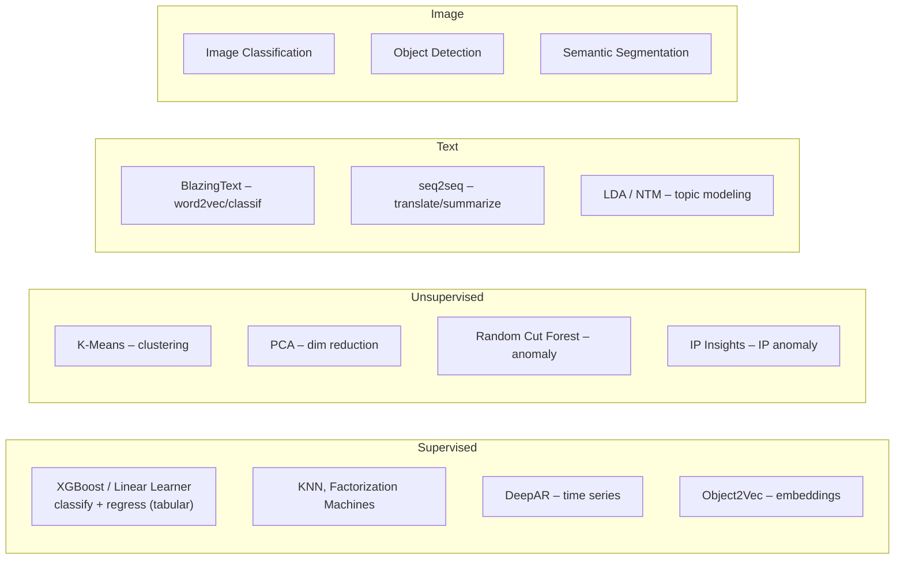
```mermaid
flowchart LR
    subgraph SUP["Supervised"]
        A["XGBoost / Linear Learner\nclassify + regress (tabular)"]
        B["KNN, Factorization Machines"]
        C["DeepAR – time series"]
        D["Object2Vec – embeddings"]
    end
    subgraph UNS["Unsupervised"]
        E["K-Means – clustering"]
        F["PCA – dim reduction"]
        G["Random Cut Forest – anomaly"]
        H["IP Insights – IP anomaly"]
    end
    subgraph TXT["Text"]
        I["BlazingText – word2vec/classif"]
        J["seq2seq – translate/summarize"]
        K["LDA / NTM – topic modeling"]
    end
    subgraph IMG["Image"]
        L["Image Classification"]
        M["Object Detection"]
        N["Semantic Segmentation"]
    end
```

| Algorithm | Category | Problem type | Use it when… |
|---|---|---|---|
| **XGBoost** | Supervised | Classification & regression (tabular) | The go-to for **structured/tabular** data; gradient-boosted trees; strong, fast, interpretable-ish. Default answer for most tabular ML questions. |
| **Linear Learner** | Supervised | Classification & regression (tabular) | Linear relationships, huge sparse data, want a fast linear baseline; trains many models in parallel and picks the best. |
| **K-Nearest Neighbors (k-NN)** | Supervised | Classification & regression | Non-parametric; predict from the *k* closest labeled points. Good for similarity-based prediction. |
| **Factorization Machines** | Supervised | Classification & regression | **High-dimensional sparse** data — recommendation / click-prediction with sparse feature interactions. |
| **DeepAR** | Supervised | **Time-series forecasting** | Forecasting *many related* time series (RNN-based); learns across series. "Forecast sales across thousands of products." |
| **Object2Vec** | Supervised | Embeddings | Learn low-dimensional embeddings of high-dim objects (e.g., find similar tickets/documents). |
| **K-Means** | Unsupervised | Clustering | Group unlabeled data into *k* clusters (customer segmentation). |
| **PCA** | Unsupervised | Dimensionality reduction | Reduce number of features while keeping variance; preprocessing before another model. |
| **Random Cut Forest (RCF)** | Unsupervised | **Anomaly detection** | Detect outliers/anomalies in data streams (fraud, IoT sensor spikes). |
| **IP Insights** | Unsupervised | IP anomaly detection | Learn patterns of IPv4 ↔ entity (user/account); flag suspicious logins. |
| **LDA** (Latent Dirichlet Allocation) | Unsupervised | Topic modeling | Discover topics in a document corpus (classic statistical method). |
| **NTM** (Neural Topic Model) | Unsupervised | Topic modeling | Same goal as LDA but neural-network based. |
| **BlazingText** | Text | Text classification & word2vec embeddings | Fast Word2Vec / supervised text classification at scale. |
| **Sequence-to-Sequence (seq2seq)** | Text | Translation, summarization, speech-to-text | Input sequence → output sequence tasks. |
| **Image Classification** | Image | Label a whole image | "Is this image a cat/dog/adult content?" (single label or multi-label). |
| **Object Detection** | Image | Locate + label objects (bounding boxes) | "Find and box every person/car in the image." |
| **Semantic Segmentation** | Image | Pixel-level classification | "Tag every pixel" — self-driving, medical imaging. |
| *AutoGluon-Tabular, CatBoost, LightGBM, TabTransformer* | Supervised (tabular) | Classification & regression | Newer tabular options; AutoGluon **ensembles + stacks** automatically. |

> 🎯 **Highest-yield reflexes:**
> - **Tabular classify/regress** → **XGBoost** (default) or Linear Learner.
> - **Forecast time series** → **DeepAR** (or Amazon Forecast if "no ML team").
> - **Anomaly/outlier detection** → **Random Cut Forest** (streams) / **IP Insights** (IPs).
> - **Topic modeling** → **LDA** or **NTM**.
> - **Clustering unlabeled data** → **K-Means**.
> - **Dimensionality reduction** → **PCA**.
> - **Object detection vs image classification vs segmentation** = *box it* vs *label the whole image* vs *label every pixel*.
> - **Sparse recommendation features** → **Factorization Machines**.

Source: [Built-in algorithms and pretrained models in Amazon SageMaker](https://docs.aws.amazon.com/sagemaker/latest/dg/algos.html)

### Interpretability as a selection criterion 

**Plain English:** Interpretability = *how easily a human can understand why the model decided what it did.* Regulated domains (credit, healthcare, hiring) often *require* it, which can override "most accurate."

> **Why (the rationale):** In regulated industries a model that cannot explain its decisions may be legally unusable regardless of its accuracy. Interpretability must be a first-class selection criterion, not an afterthought.
> **When to use:** Require an inherently interpretable model (linear regression, logistic regression, shallow decision tree) when regulators or policy require a human-readable explanation for every decision; use XGBoost + Clarify SHAP when you need better accuracy but can satisfy auditors with post-hoc feature-importance explanations; use deep neural nets only when accuracy clearly dominates and explanation is secondary.
> **Nuances & gotchas:** SHAP explains what a specific model learned from a specific dataset — it does NOT prove the model is fair or correct. A highly accurate but uninterpretable model can still be deployed if explainability is provided post-hoc (SHAP); the exam often offers "use Clarify" as the answer to interpretability questions even when XGBoost is the model. Inherently interpretable models are usually less accurate on complex non-linear tasks — this is a genuine tradeoff, not a free lunch.

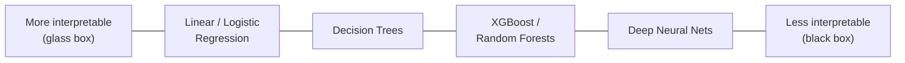
```mermaid
flowchart LR
    HI["More interpretable\n(glass box)"] --- L["Linear / Logistic\nRegression"] --- T["Decision Trees"] --- X["XGBoost /\nRandom Forests"] --- NN["Deep Neural Nets"] --- LO["Less interpretable\n(black box)"]
```

| Interpretability need | Pick |
|---|---|
| Must explain every decision (regulator, loan denial) | **Linear/Logistic Regression, single Decision Tree** |
| Want accuracy but *some* explanation | **XGBoost** + **SageMaker Clarify (SHAP)** for feature attributions |
| Accuracy dominates, explanation secondary | Deep neural nets / FMs, add **Clarify** post-hoc |

> 🎯 **On the exam:** "The model's decisions must be **explainable / auditable** to regulators" → favor an inherently interpretable model **and/or** use **SageMaker Clarify** to produce **SHAP** feature-importance explanations. Don't pick a giant black-box NN when the question stresses interpretability.

### Feasibility, complexity & cost-based selection 

**Plain English:** Match the *complexity of the tool* to the *complexity of the problem and data*. Don't fine-tune a foundation model when XGBoost on tabular data would do — that's wasted cost and latency.

> **Why (the rationale):** Over-engineering (using a 70B FM for binary tabular classification) wastes money and introduces latency; under-engineering (using a simple linear model for a complex NLP task) produces inadequate accuracy. Feasibility analysis maps cost/data constraints to the right tier.
> **When to use:** Start at the simplest effective tier — AI service first, then built-in algorithm, then script mode, then FM fine-tuning. Move up the ladder only when the simpler tier demonstrably cannot meet accuracy or feature requirements.
> **Nuances & gotchas:** "Most cost-effective" on the exam almost always points away from FMs and toward built-in algorithms or AI services. "No labeled data" immediately eliminates supervised approaches — look for unsupervised (K-Means, PCA, RCF) or zero-shot FM approaches. The "custom non-standard framework" signal (e.g., Julia, custom C++ inference) is the indicator for BYO container.

| Signal in the question | Lean toward |
|---|---|
| Small tabular dataset, standard prediction | **Built-in algorithm** (XGBoost) — cheapest, fastest |
| No labeled data, need structure | **Unsupervised** (K-Means, PCA, RCF) |
| Common perceptual task (vision/speech/NLP) | **AI service** |
| Generative / language reasoning | **Bedrock / JumpStart FM** |
| Non-standard research architecture | **Script mode / BYO container** |
| "Most cost-effective" | Prefer built-ins & smaller instances over FM fine-tuning; use **Spot** for training |

---

## Task 2.2 — Training and refining models 

### Epoch, step, batch size: the training vocabulary 

**Plain English:** Imagine studying a stack of flashcards.

> **Why (the rationale):** Batch size and epoch count directly control the quality/cost/time tradeoff in training. Too few epochs = underfitting; too many = overfitting + wasted compute. Too large a batch = less regularizing noise (may generalize worse) + more GPU memory needed.
> **When to use:** Tune batch size first for your GPU memory budget (larger batches use more memory but are computationally efficient); use early stopping to automatically find the right number of epochs instead of guessing; reduce batch size if training loss is too smooth and the model doesn't generalize.
> **Nuances & gotchas:** "Number of training steps" and "number of epochs" are NOT interchangeable — steps = epochs × (dataset_size / batch_size). Increasing batch size does NOT proportionally increase training speed without adjusting the learning rate (use linear scaling rule: scale LR proportionally to batch size). Very large batches (> ~8192) can hurt generalization — this is an empirically documented phenomenon, not just theory.
- **Batch size** = how many cards you look at before updating what you've learned.
- **Step (iteration)** = one such update (one batch processed → one weight update).
- **Epoch** = one full pass through the *entire* deck of cards.

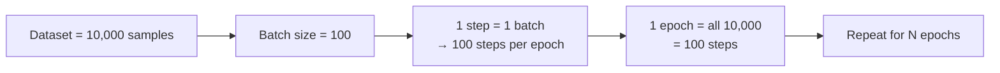
```mermaid
flowchart LR
    D["Dataset = 10,000 samples"] --> B["Batch size = 100"]
    B --> S["1 step = 1 batch\n→ 100 steps per epoch"]
    S --> E["1 epoch = all 10,000\n= 100 steps"]
    E --> R["Repeat for N epochs"]
```

| Term | Definition | Relationship |
|---|---|---|
| **Batch size** | Samples processed before one weight update | steps/epoch = dataset ÷ batch size |
| **Step / iteration** | One batch → one gradient update | — |
| **Epoch** | One full pass over the whole dataset | Total steps = epochs × (steps per epoch) |

**Effects to remember:**
- **Larger batch** → faster, smoother, more GPU memory, can generalize slightly worse.
- **Smaller batch** → noisier updates (can escape local minima), less memory, slower per-epoch throughput.
- **More epochs** → better fit up to a point, then **overfitting**. This is exactly what **early stopping** guards against.

### Reducing training time: early stopping & distributed training 

**Plain English:** Two levers cut training time — *stop sooner when you've learned enough* (early stopping), and *split the work across more machines* (distributed training).

> **Why (the rationale):** Training time (and cost) scales linearly with epochs and compute hours. Early stopping eliminates wasted epochs; distributed training (data parallel or model parallel) cuts wall-clock time by parallelizing the work — without it, a large LLM fine-tune could take weeks on a single GPU.
> **When to use:** Early stopping always — set a patience parameter and a delta threshold so trivial improvements don't keep training running. Data parallel (SMDDP) when the dataset is too large to process quickly on one GPU but the model fits; model parallel (SMP v2) when the model itself is too large to fit in one GPU's memory (typically >7B parameters on standard GPU instances).
> **Nuances & gotchas:** AMT (Automatic Model Tuning) has its own early stopping that terminates underperforming HPO trials — this is distinct from early stopping within a single training run. Managed Spot Training + early stopping requires checkpointing to S3; if you enable spot without checkpointing, an interruption restarts from scratch. SMDDP and SMP are separate libraries — using both simultaneously (hybrid parallelism) is possible but requires careful configuration.

**Early stopping** halts training when the validation metric stops improving, saving time and money and preventing overfitting.

**Distributed training** — two fundamentally different strategies:

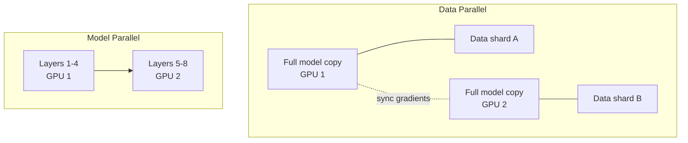
```mermaid
flowchart TB
    subgraph DP["Data Parallel"]
        M1["Full model copy\nGPU 1"] --- Shard1["Data shard A"]
        M2["Full model copy\nGPU 2"] --- Shard2["Data shard B"]
        M1 -.sync gradients.- M2
    end
    subgraph MP["Model Parallel"]
        L1["Layers 1-4\nGPU 1"] --> L2["Layers 5-8\nGPU 2"]
    end
```

| Strategy | Split what? | Use when | SageMaker feature |
|---|---|---|---|
| **Data parallel** | Split the **data** across GPUs, each holds a **full model copy**, gradients synced | Dataset is huge but **model fits in one GPU** | **SageMaker Distributed Data Parallelism (SMDDP)** library |
| **Model parallel** | Split the **model** (layers/tensors) across GPUs | **Model too big** to fit in a single GPU (large LLMs) | **SageMaker Model Parallelism (SMP) library v2** (tensor parallelism, sharded data parallelism, activation checkpointing/offloading) |

> 🎯 **If you see X pick Y:** "Training data too large / training too slow, model fits in memory" → **data parallel**. "Model itself is too large to fit on one GPU" → **model parallel**. Both are exposed through the SageMaker **distributed training libraries** in AWS Deep Learning Containers (PyTorch/Hugging Face). Other time-savers: **Spot instances** (up to ~90% cheaper, use **checkpointing** to survive interruptions), **Pipe/FastFile** input mode to stream data, and **warm pools** to skip instance spin-up.

Source: [Distributed training in SageMaker](https://docs.aws.amazon.com/sagemaker/latest/dg/distributed-training.html) · [SMDDP library](https://docs.aws.amazon.com/sagemaker/latest/dg/data-parallel-intro.html) · [Model parallelism intro](https://docs.aws.amazon.com/sagemaker/latest/dg/model-parallel-intro.html) · [AMT early stopping](https://aws.amazon.com/blogs/machine-learning/amazon-sagemaker-automatic-model-tuning-now-supports-early-stopping-of-training-jobs/)

### Overfitting, underfitting & catastrophic forgetting 

> **Why (the rationale):** Overfitting and underfitting are the two failure modes of model training — both produce models that don't generalize to real-world data. Catastrophic forgetting is the specific failure mode of fine-tuning: the model unlearns its general capabilities while learning the new task.
> **When to use:** Diagnose underfitting when both training AND validation metrics are poor; diagnose overfitting when training metric is strong but validation metric is significantly worse. Suspect catastrophic forgetting when a fine-tuned model loses capability on tasks it previously did well.
> **Nuances & gotchas:** The standard fix for overfitting is regularization, more data, or a simpler model — NOT simply stopping training earlier (early stopping is a proxy, not a cure). For catastrophic forgetting: RAG sidesteps fine-tuning entirely; LoRA (parameter-efficient fine-tuning) reduces forgetting by only training a small subset of weights. A model can simultaneously underfit on rare classes while overfitting on majority classes in an imbalanced dataset.

**Plain English:**
- **Underfitting** = model too simple — bad on training AND test data (didn't learn enough). Like memorizing nothing.
- **Overfitting** = model memorized the training data including its noise — great on training, bad on new data. Like memorizing answers instead of understanding.
- **Catastrophic forgetting** = when fine-tuning, the model *forgets* previously learned knowledge while learning the new task.

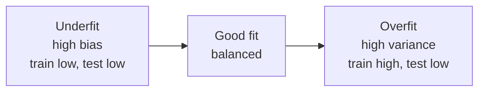
```mermaid
flowchart LR
    U["Underfit\nhigh bias\ntrain low, test low"] --> G["Good fit\nbalanced"] --> O["Overfit\nhigh variance\ntrain high, test low"]
```

| Problem | Symptom | Fixes |
|---|---|---|
| **Underfitting** | Poor train *and* test accuracy | More complex model, more features, more epochs, less regularization |
| **Overfitting** | Great train, poor test (big gap) | **Regularization**, **dropout**, more data / data augmentation, **feature selection**, early stopping, simpler model |
| **Catastrophic forgetting** | Fine-tuned model loses prior abilities | Lower learning rate, mix in original data, **RAG** instead of fine-tune, parameter-efficient fine-tuning (LoRA), regularization |

### Regularization: dropout, weight decay, L1, L2 

**Plain English:** Regularization = *deliberately handicapping the model so it can't memorize noise.* It trades a bit of training accuracy for better generalization.

> **Why (the rationale):** Regularization is the primary tool for fighting overfitting without acquiring more data. L1 has the added benefit of automatic feature selection; dropout is unique to neural nets. Each technique targets a different mechanism of overfitting.
> **When to use:** L1 when you have many features and suspect most are irrelevant (sparse model needed); L2/weight decay as the default regularizer for most neural networks and linear models; dropout (typically p=0.2–0.5) in fully connected and LSTM layers of neural networks; Elastic Net when you want both sparsity and stable weight shrinkage.
> **Nuances & gotchas:** L1 is NOT differentiable at zero, so gradient-based optimizers use a subgradient approximation — this can cause instability at high L1 weights. Dropout is applied only during training, NOT during inference — if it's accidentally applied at inference time, predictions become stochastic and inconsistent. Weight decay in Adam optimizer is NOT the same as L2 regularization mathematically (see AdamW for correct decoupled weight decay). Too much regularization causes underfitting.

| Technique | Intuition | Effect |
|---|---|---|
| **L1 (Lasso)** | Adds penalty proportional to the **absolute** value of weights | Drives some weights to **exactly zero** → automatic **feature selection**, sparse model |
| **L2 (Ridge / weight decay)** | Adds penalty proportional to the **square** of weights | Shrinks all weights toward (but not to) zero → smoother, smaller-magnitude weights. In neural nets this is called **weight decay** |
| **Dropout** | Randomly "turns off" a fraction of neurons each training step | Forces redundancy → network can't rely on any single neuron → less overfitting (NN-specific) |
| **Elastic Net** | Blend of L1 + L2 | Sparse *and* stable |

> 🎯 **On the exam:** "Want automatic **feature selection** / drop irrelevant features / sparse model" → **L1**. "Shrink weights smoothly to reduce overfitting" → **L2 / weight decay**. "Neural network overfitting, want to randomly disable neurons" → **dropout**. Weight decay ≈ L2 regularization.

### Hyperparameters & SageMaker Automatic Model Tuning (AMT) 

**Plain English:** **Parameters** are learned *by* training (weights). **Hyperparameters** are knobs you set *before* training (learning rate, tree depth, number of layers). **AMT** automatically runs many training jobs with different hyperparameter values and finds the best combination against an objective metric.

> **Why (the rationale):** Manual hyperparameter tuning is expensive, slow, and biased by human intuition. AMT automates this search, finding better configurations in fewer jobs than a grid search by learning from prior results (Bayesian) or early-stopping weak runs (Hyperband).
> **When to use:** AMT Bayesian when you have a moderate budget and want the most sample-efficient search; Hyperband when tuning iterative algorithms (neural nets, XGBoost) where you want to cut off bad runs early and allocate resources to promising ones; Grid when the search space is small and discrete; Random as a strong baseline when runs must be fully parallelized.
> **Nuances & gotchas:** AMT's maximum concurrent jobs defaults to 1 for Bayesian (sequential by design) — you can set `max_parallel_jobs` higher but it reduces the efficiency of Bayesian's learning-from-prior mechanism. Hyperband requires that the training algorithm reports a metric per epoch/round (not just at the end) — not all frameworks do this automatically. Each AMT training job is charged separately; a large Bayesian search can still be expensive. AMT objective metric names must exactly match what your training script logs to CloudWatch/stdout.

**Common hyperparameters & their effect:**

| Hyperparameter | Model | More of it means… |
|---|---|---|
| **Number of trees / rounds** | XGBoost, Random Forest | More capacity; too many → overfitting/slow |
| **Max tree depth** | Trees | Deeper trees capture more interactions but overfit |
| **Number of layers / units** | Neural nets | More capacity; too many → overfit + slow + larger model |
| **Learning rate** | All gradient methods | Too high → diverges/oscillates; too low → slow, may not converge |
| **k** | K-Means, k-NN | Number of clusters / neighbors |
| **Batch size, epochs** | NN | See training vocabulary above |

**AMT search strategies** (know these cold):

| Strategy | How it works | Best for |
|---|---|---|
| **Grid search** | Try **every** combination in a discrete grid | Small, discrete search spaces; exhaustive but expensive |
| **Random search** | Sample combinations **randomly** | Large spaces; parallelizes well; surprisingly strong baseline |
| **Bayesian optimization** | Uses results of **prior jobs** to pick smarter next combinations | Sample-efficient; fewer jobs to a good answer (AMT default) |
| **Hyperband** | Dynamically allocates resources; **early-stops** weak configs, gives more epochs to strong ones | Iterative algorithms (NNs over epochs, GBDTs over rounds) — **up to 3× faster** than random/Bayesian |

> 🎯 **If you see X pick Y:** "Explore hyperparameters **efficiently, learning from previous runs**" → **Bayesian**. "Speed up tuning of a **deep neural net / iterative** training up to 3×, auto-stop bad trials" → **Hyperband**. "Exhaustively try **all** combinations of a small set" → **Grid**. "Simple, highly parallel, no assumptions" → **Random**. Enable **early stopping** in AMT to terminate unpromising training jobs (saves cost up to ~28%).

Source: [Hyperparameter tuning strategies in SageMaker AMT](https://docs.aws.amazon.com/sagemaker/latest/dg/automatic-model-tuning-how-it-works.html) · [Hyperband announcement](https://aws.amazon.com/about-aws/whats-new/2022/09/amazon-sagemaker-automatic-model-tuning-provides-faster-hyperparameter-tuning-hyperband-search-strategy/) · [AMT best practices](https://docs.aws.amazon.com/sagemaker/latest/dg/automatic-model-tuning-considerations.html)

### Ensembling: bagging, boosting, stacking 

**Plain English:** *Ask many models and combine their answers.* A crowd of weak-ish models often beats one model.

> **Why (the rationale):** A single model makes systematic errors (high bias) or random errors (high variance). Ensembles reduce these errors by combining diverse models — bagging reduces variance, boosting reduces bias, stacking can reduce both.
> **When to use:** Bagging (Random Forest) when you have an overfitting single decision tree and want to reduce variance; boosting (XGBoost) when the individual model is too simple and you need to reduce bias through sequential correction; stacking (AutoGluon) when you want maximum accuracy and will pay the extra inference latency of running multiple models.
> **Nuances & gotchas:** Boosting trains models sequentially — it is inherently slower to train than bagging (parallel). XGBoost is a boosting algorithm; Random Forest is a bagging algorithm — these are frequently confused on the exam. Stacking requires a separate meta-model training step after the base models; AutoGluon does this automatically. Ensembles have higher inference cost and latency than a single model — a factor ignored in exam questions that ask only about accuracy.

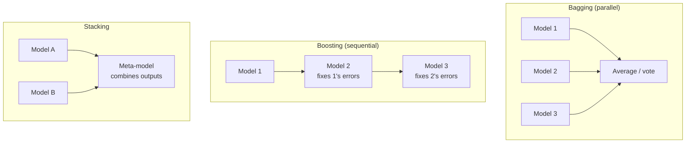
```mermaid
flowchart TB
    subgraph BAG["Bagging (parallel)"]
        b1["Model 1"] --> vote["Average / vote"]
        b2["Model 2"] --> vote
        b3["Model 3"] --> vote
    end
    subgraph BOOST["Boosting (sequential)"]
        s1["Model 1"] --> s2["Model 2\nfixes 1's errors"] --> s3["Model 3\nfixes 2's errors"]
    end
    subgraph STACK["Stacking"]
        m1["Model A"] --> meta["Meta-model\ncombines outputs"]
        m2["Model B"] --> meta
    end
```

| Method | How | Reduces | Example |
|---|---|---|---|
| **Bagging** | Train models in **parallel** on random data subsets, then average/vote | **Variance** (overfitting) | Random Forest |
| **Boosting** | Train models **sequentially**, each correcting the previous one's errors | **Bias** (underfitting) | **XGBoost**, LightGBM, CatBoost |
| **Stacking** | Feed several models' predictions into a **meta-model** | Both | **AutoGluon-Tabular** stacks in layers |

> 🎯 **On the exam:** **XGBoost = boosting**. "Combine many diverse models automatically to maximize accuracy" → **AutoGluon** (ensembling + stacking). Boosting reduces bias; bagging reduces variance.

### Bringing your own model & script mode 

**Plain English:** You don't have to use a built-in algorithm. SageMaker offers a ladder from "least effort" to "most control."

> **Why (the rationale):** Script mode gives you the flexibility of custom model code without the overhead of maintaining a full Docker image. BYO Container is the escape hatch when the framework or runtime isn't supported at all.
> **When to use:** Script mode when your model code is in a standard framework (TensorFlow, PyTorch, scikit-learn, Hugging Face, MXNet) and you just need to plug in your training script; extend a prebuilt container when you need one or two extra pip packages; BYO Container when you use an unsupported framework, need a custom OS configuration, or have proprietary inference code.
> **Nuances & gotchas:** Script mode requires your script to read data from `/opt/ml/input/data/` and write model artifacts to `/opt/ml/model/` — wrong paths cause silent failures. BYO containers must implement the SageMaker serving contract: serve `/ping` (HTTP 200) and `/invocations` on port 8080. An externally trained model (trained outside SageMaker) can be imported by packaging artifacts as `model.tar.gz` in S3 and pointing a SageMaker `Model` object at it — no retraining needed.

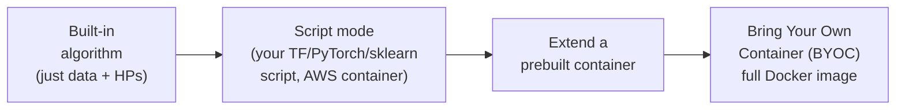
```mermaid
flowchart LR
    A["Built-in\nalgorithm\n(just data + HPs)"] --> B["Script mode\n(your TF/PyTorch/sklearn\nscript, AWS container)"] --> C["Extend a\nprebuilt container"] --> D["Bring Your Own\nContainer (BYOC)\nfull Docker image"]
```

| Option | You provide | Use when |
|---|---|---|
| **Built-in algorithm** | Data + hyperparameters | Standard problem type |
| **Script mode** | A training script; SageMaker injects it into a **managed framework container** (TensorFlow, PyTorch, MXNet, scikit-learn, Hugging Face, XGBoost) | You have model code in a supported framework |
| **Extend prebuilt container** | Dockerfile `FROM` an AWS container + extra deps | Need extra libraries |
| **BYO container (BYOC)** | Your own Docker image pushed to **ECR** | Unsupported framework / total control |

> 🎯 **On the exam:** "I already have **TensorFlow/PyTorch code** and want SageMaker managed training" → **script mode**. "My framework isn't supported / I need a custom runtime" → **BYO container in ECR**. You can also **import an externally trained model** by packaging its artifacts and a compatible container to create a SageMaker Model for deployment.

Source: [SageMaker script mode / bring your own model](https://docs.aws.amazon.com/sagemaker/latest/dg/frameworks.html)

### Fine-tuning foundation models 

**Plain English:** Instead of training from scratch, take a pre-trained FM and *adjust* it to your task/domain. Cheaper and needs far less data than from-scratch training.

> **Why (the rationale):** Foundation models already encode rich world knowledge from pre-training. Fine-tuning adapts that knowledge to a specific domain/task with a fraction of the data and compute required to train from scratch.
> **When to use:** Try prompt engineering first (zero cost); then RAG if the model needs access to private/fresh data (no weight change, just retrieval); fine-tuning when you need consistent output format, tone, or domain-specific vocabulary the base model lacks; continued pre-training when the domain is so specialized that even the vocabulary is absent from the base model (e.g., proprietary chemistry notation).
> **Nuances & gotchas:** Fine-tuning does NOT make the model "know" new facts reliably — it adjusts style, format, and emphasis, but factual knowledge is better handled by RAG. Catastrophic forgetting is a real risk; mitigate with low learning rates (~1e-5 to 1e-4) and parameter-efficient methods (LoRA, QLoRA). Bedrock fine-tuning is only available for specific model versions and requires your data in S3 as JSONL. Fine-tuned model weights may incorporate your proprietary data — consider data security and model licensing implications.

| Approach | What it changes | Cost | When |
|---|---|---|---|
| **Prompt engineering** | Nothing (just the input) | Cheapest | First thing to try |
| **RAG** | Nothing; retrieves your docs at inference | Low; no training | Keep answers grounded on private/fresh data |
| **Fine-tuning** | Model weights, on labeled examples | Medium–high | Consistent task-specific behavior/format |
| **Continued pre-training** | Model weights, on large unlabeled domain corpus | High | Teach a whole new domain/vocabulary |

**Where:** Fine-tune via **Amazon Bedrock** (managed, per-model) or **SageMaker JumpStart** (fine-tune open FMs with your data on your endpoint). Watch for **catastrophic forgetting** — mitigate with low learning rates and parameter-efficient methods (e.g., LoRA).

> 🎯 **If you see X pick Y:** "Ground FM on private docs, no retraining, keep data fresh" → **RAG**. "Need the model to consistently produce a specific style/format from examples" → **fine-tuning**. "Adapt to an entirely new domain/jargon with lots of unlabeled text" → **continued pre-training**.

### Reducing model size 

**Plain English:** Smaller models are cheaper, faster, and fit on edge devices — at a small accuracy cost.

> **Why (the rationale):** Large models have high memory footprints, slow inference, and cannot run on edge hardware. Size reduction techniques trade a small accuracy delta for dramatic improvements in inference cost and latency.
> **When to use:** Quantization first (lowest effort, biggest size reduction — often 2–4× with minimal accuracy loss); pruning when you have time to iteratively retrain; knowledge distillation when you need a production-grade small model that mimics a large one; compile with SageMaker Neo when deploying to edge or optimizing for a specific cloud instance type.
> **Nuances & gotchas:** INT8 quantization of LLMs can cause noticeable quality degradation on reasoning tasks — test before deploying. SageMaker Neo compilation is hardware-specific; a Neo-compiled model for ARM Cortex-A will NOT run on Nvidia Jetson without recompilation. Pruning unstructured (random weights) is hard to accelerate on standard hardware; structured pruning (whole channels/heads) is more hardware-friendly. Knowledge distillation requires the teacher model to be available during student training — you cannot distill a black-box API model.

| Technique | Idea |
|---|---|
| **Quantization** (data types) | Use lower-precision numbers (FP32 → FP16/INT8) → less memory & faster inference |
| **Pruning** | Remove weights/neurons that contribute little |
| **Knowledge distillation** | Train a small "student" model to mimic a big "teacher" |
| **Feature selection** | Fewer input features → simpler model (L1 helps here) |
| **Compression** | Compact model artifacts |

**Factors that influence model size:** number of parameters (layers/units, tree count/depth), input feature count, embedding dimensions, and numeric precision.

> 🎯 **On the exam:** "Deploy to a **resource-constrained / edge device**, reduce size and latency" → **quantization + pruning** (and see **SageMaker Neo** for compiling/optimizing models to target hardware — covered in Domain 3).

### Model versioning with SageMaker Model Registry 

**Plain English:** A *catalog* of your trained models for repeatability, audits, and controlled promotion to production.

> **Why (the rationale):** Without a registry, teams lose track of which model artifact is in production, cannot easily roll back, and have no audit trail for regulated deployments. Model Registry creates a governed single source of truth for all model versions.
> **When to use:** Register every model after training as part of a SageMaker Pipeline or CI/CD workflow; use approval status gates to prevent unapproved models from reaching production; use model groups to track the history of a single logical model (e.g., "fraud-detector") across retraining cycles.
> **Nuances & gotchas:** Model Registry versions are immutable once created — you cannot replace a version's artifact; you must create a new version. Setting approval status to "Approved" does NOT automatically deploy the model — it fires an EventBridge event that a pipeline or Lambda must handle. Model Registry stores metadata and artifact URIs but does NOT host or serve the model — deployment still requires creating a SageMaker endpoint separately. Version numbers start at 1 and are auto-incremented.

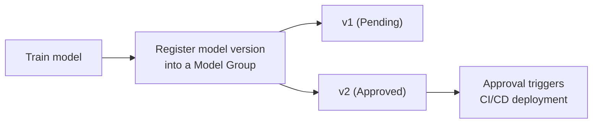
```mermaid
flowchart LR
    T["Train model"] --> R["Register model version\ninto a Model Group"]
    R --> V1["v1 (Pending)"]
    R --> V2["v2 (Approved)"]
    V2 --> CICD["Approval triggers\nCI/CD deployment"]
```

Key facts:
- Models are organized into **Model (Package) Groups**; each registered model is a **model version** — a numeric value **starting at 1**, incremented each time.
- Each version has an **approval status**: **PendingManualApproval → Approved / Rejected**.
- Setting a version to **Approved** can **trigger CI/CD deployment** (e.g., via EventBridge → Pipelines). Update via `update_model_package` or the console.
- Stores metadata, metrics, and lineage → supports **repeatability and audits**.

> 🎯 **On the exam:** "Manage **model versions**, track approvals, and gate production deployment for audits" → **SageMaker Model Registry**. Approval status change is the classic CI/CD trigger.

Source: [SageMaker Model Registry](https://docs.aws.amazon.com/sagemaker/latest/dg/model-registry.html) · [Model groups & versions](https://docs.aws.amazon.com/sagemaker/latest/dg/model-registry-models.html) · [Approval status](https://docs.aws.amazon.com/sagemaker/latest/dg/model-registry-approve.html)

---

## Task 2.3 — Analyzing model performance 

### The confusion matrix and everything derived from it 

**Plain English:** For classification, the **confusion matrix** counts the four ways a prediction can land. Every classification metric is just arithmetic on these four boxes.

> **Why (the rationale):** Accuracy is a misleading single number — it hides the distribution of errors. The confusion matrix exposes WHICH kinds of errors the model makes, which is what matters for business decisions (e.g., false negatives in cancer detection have very different costs from false positives).
> **When to use:** Always inspect the full confusion matrix when evaluating a classifier, especially on imbalanced datasets where accuracy is deceptive. Use derived metrics (precision, recall, F1) to summarize specific error-cost priorities.
> **Nuances & gotchas:** For multi-class problems the confusion matrix is N×N and macro/micro averaging of precision/recall becomes important — "macro" treats all classes equally, "micro" weight-averages by class frequency. Accuracy on a 99:1 imbalanced dataset can be 99% while the model never predicts the positive class — this is the classic "accuracy paradox" that almost every exam scenario involving imbalance is testing. Heat maps are a visualization of the confusion matrix (or a correlation matrix) — not a separate concept.

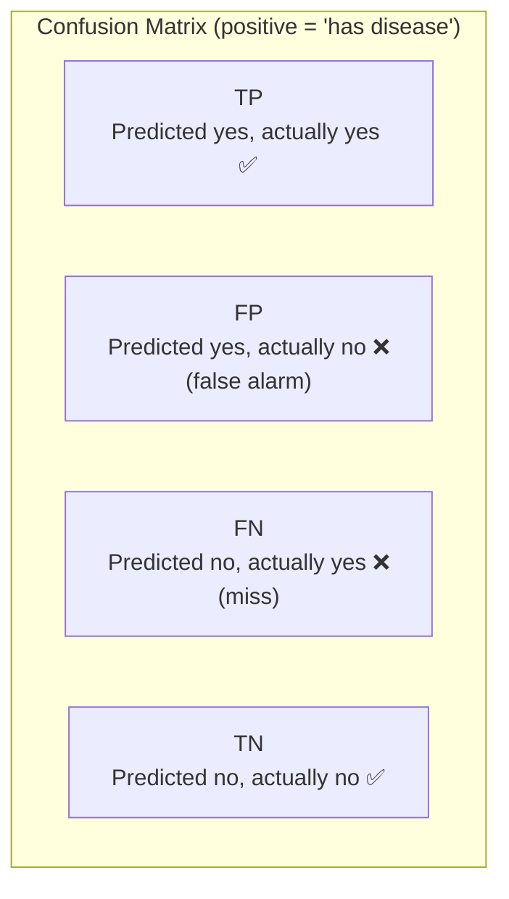
```mermaid
flowchart TB
    subgraph CM["Confusion Matrix (positive = 'has disease')"]
        TP["TP\nPredicted yes, actually yes ✅"]
        FP["FP\nPredicted yes, actually no ❌\n(false alarm)"]
        FN["FN\nPredicted no, actually yes ❌\n(miss)"]
        TN["TN\nPredicted no, actually no ✅"]
    end
```

|  | **Actual Positive** | **Actual Negative** |
|---|---|---|
| **Predicted Positive** | True Positive (TP) | False Positive (FP) |
| **Predicted Negative** | False Negative (FN) | True Negative (TN) |

**Worked example** — a disease test on 100 patients: TP=40, FP=10, FN=5, TN=45.

| Metric | Formula | This example | Reads as |
|---|---|---|---|
| **Accuracy** | (TP+TN)/all | (40+45)/100 = **0.85** | Overall % correct |
| **Precision** | TP/(TP+FP) | 40/50 = **0.80** | Of predicted-positive, how many were right |
| **Recall (Sensitivity/TPR)** | TP/(TP+FN) | 40/45 = **0.89** | Of actual positives, how many we caught |
| **Specificity (TNR)** | TN/(TN+FP) | 45/55 = **0.82** | Of actual negatives, how many we cleared |
| **F1 score** | 2·(P·R)/(P+R) | 2·(0.8·0.89)/(0.8+0.89) = **0.84** | Harmonic mean of P & R |

> 🎯 **Accuracy trap:** With **imbalanced data** (99% negatives), a model that predicts "negative" always scores **99% accuracy** but is useless. When classes are imbalanced, **accuracy lies** — use **precision, recall, F1, or AUC** instead. This is one of the most tested ideas in the domain.

A **heat map** is just a colored confusion matrix (or feature-correlation matrix) for visual inspection.

### Precision vs recall vs F1: when to prefer which 

**Plain English:** Precision and recall pull in opposite directions. Which one you optimize depends on **which mistake hurts more.**

> **Why (the rationale):** Optimizing for the wrong metric can make a model worse for its business purpose — a spam filter with high recall but low precision will delete legitimate emails. The choice of metric must match the asymmetric cost of the two error types.
> **When to use:** Maximize precision when false positives are costly (spam filter, drug flagging causing unnecessary procedures); maximize recall when false negatives are costly (disease detection, security threat detection, fraud — missing a real event is catastrophic); use F1 as a balanced single metric when classes are imbalanced and both error types matter somewhat equally.
> **Nuances & gotchas:** Precision and recall are inversely related through the decision threshold — lowering the threshold raises recall and lowers precision. The PR curve (Precision-Recall curve) is preferred over the ROC curve when the positive class is very rare (< 1%) because ROC can look deceptively good in that scenario. F1 is the harmonic mean, not the arithmetic mean — it punishes extreme values (a model that is perfect on recall but zero on precision gets F1 = 0, not F1 = 0.5).

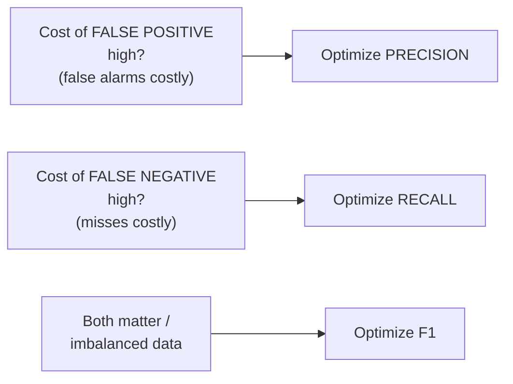
```mermaid
flowchart LR
    FP["Cost of FALSE POSITIVE\nhigh?\n(false alarms costly)"] --> PREC["Optimize PRECISION"]
    FN["Cost of FALSE NEGATIVE\nhigh?\n(misses costly)"] --> REC["Optimize RECALL"]
    BOTH["Both matter /\nimbalanced data"] --> F1["Optimize F1"]
```

| Scenario | Which error is worse | Optimize |
|---|---|---|
| **Spam filter** | Flagging a real email as spam (FP) loses important mail | **Precision** |
| **Cancer / fraud detection** | Missing a real case (FN) is catastrophic | **Recall** |
| **Imbalanced classes, need balance** | Both matter | **F1** |

> 🎯 **If you see X pick Y:** "**Can't afford to miss** positives (disease, fraud, security threat)" → maximize **recall**. "**False alarms are expensive / user-facing**" → maximize **precision**. "Imbalanced dataset, want a single balanced number" → **F1**.

### ROC, AUC and threshold selection 

> **Why (the rationale):** AUC provides a threshold-independent summary of a classifier's discriminative ability, making it the most useful single metric for comparing two models regardless of the operating point chosen in production.
> **When to use:** AUC/ROC to compare and rank classifiers during model selection; PR curves (Precision-Recall) when the positive class is very rare and ROC's TNR axis would mask poor performance; choose a specific threshold after model selection based on the business cost of FP vs FN.
> **Nuances & gotchas:** AUC = 0.5 means the model is no better than random — a common signal that the features are not predictive. AUC is insensitive to class imbalance (a known weakness); on extremely imbalanced data a model with AUC = 0.9 can still have terrible recall for the minority class at standard thresholds. "Changing the threshold" does NOT change the AUC — it only moves your operating point along the existing ROC curve.

**Plain English:** A classifier outputs a *probability*; you choose a **threshold** to turn it into yes/no. The **ROC curve** plots **True Positive Rate (recall)** vs **False Positive Rate** across *all* thresholds. **AUC** (area under that curve) summarizes it in one number: **1.0 = perfect, 0.5 = random guessing.**

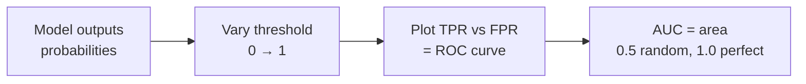
```mermaid
flowchart LR
    A["Model outputs\nprobabilities"] --> B["Vary threshold\n0 → 1"] --> C["Plot TPR vs FPR\n= ROC curve"] --> D["AUC = area\n0.5 random, 1.0 perfect"]
```

| AUC | Interpretation |
|---|---|
| 0.5 | No better than a coin flip |
| 0.7–0.8 | Acceptable |
| 0.8–0.9 | Good |
| > 0.9 | Excellent |

> 🎯 **On the exam:** AUC is **threshold-independent** and robust to class imbalance → great for **comparing models**. "Single metric to compare classifiers regardless of threshold" → **AUC/ROC**. Precision-Recall (PR) curves are preferred over ROC when the positive class is **very rare**.

### Regression metrics: RMSE, MAE, R² 

**Plain English:** For predicting a number (price, temperature), you measure *how far off* you are.

> **Why (the rationale):** RMSE and MAE measure average prediction error in the same units as the target (interpretable); R² measures the fraction of target variance the model explains (scale-independent). Choosing the wrong metric can mis-rank candidate models if their error distributions differ.
> **When to use:** RMSE when large individual errors are disproportionately harmful (e.g., predicting load on a power grid — a large miss causes cascading failure); MAE when you want error in interpretable units and outliers should not dominate the metric; R² when you want to communicate "how much better than a naive mean-predictor" the model is.
> **Nuances & gotchas:** RMSE is always ≥ MAE — if RMSE >> MAE, the model has a few very large errors (outlier sensitivity). R² can be negative if the model is worse than predicting the mean — not a typo; this indicates a badly misconfigured model. Neither RMSE nor MAE indicate direction of error (over vs under-prediction); check residual plots separately.

| Metric | Formula idea | Behavior |
|---|---|---|
| **RMSE** (Root Mean Squared Error) | √(mean of squared errors) | Same units as target; **penalizes large errors heavily** (squares them) — use when big misses are especially bad |
| **MAE** (Mean Absolute Error) | mean of absolute errors | Same units; treats all errors linearly; **more robust to outliers** than RMSE |
| **R²** (coefficient of determination) | 1 − (model error / baseline error) | 1.0 = perfect, 0 = no better than predicting the mean |

> 🎯 **If you see X pick Y:** "**Regression** problem, big errors are costly" → **RMSE**. "Regression with **outliers**, want robustness" → **MAE**. "How much variance the model explains" → **R²**. Lower RMSE/MAE = better.

### Baselines, convergence & debugging with SageMaker Debugger 

**Plain English:** A **baseline** is a dumb reference (predict the average, or a simple model) that your real model must beat — otherwise the ML wasn't worth it. **Convergence** = the loss steadily settles to a minimum. If it doesn't, something's wrong.

> **Why (the rationale):** SageMaker Debugger eliminates the need to manually instrument training code with tensor-logging hooks. It automatically captures model internals and fires alarms in real time — stopping a diverging job before it wastes hours of GPU time.
> **When to use:** Enable Debugger on any deep-learning training job where you suspect convergence issues or overfitting; use built-in rules (vanishing_gradient, loss_not_decreasing, overfit) to get automatic diagnosis; use ProfilerReport for performance profiling (GPU utilization, data loading bottlenecks).
> **Nuances & gotchas:** Debugger adds a small overhead (~5–10%) to training time due to tensor capture. The maximum number of built-in rule containers per training job is 20. Debugger is distinct from SageMaker Model Monitor — Debugger monitors the **training process** (convergence, gradients), Model Monitor monitors the **deployed model in production** (drift, accuracy). If a Debugger rule fires, the job is stopped only if you configure `DebuggerHookConfig` with `actions=[StopTraining()]` — rules alone do not stop jobs by default.

**Convergence problems you must recognize:**

| Symptom | Likely cause | Fix |
|---|---|---|
| Loss **not decreasing** | Learning rate too low, bad features, underfitting | Raise LR, add capacity/features |
| Loss **oscillating / exploding** | Learning rate too high, **exploding gradients** | Lower LR, gradient clipping |
| Gradients → 0, no learning | **Vanishing gradients** (deep nets) | Better init, ReLU, batch norm, residual connections |
| Train ↓ but validation ↑ | **Overfitting** | Regularization, early stopping |

**Amazon SageMaker Debugger** captures tensors (gradients, weights, losses, activations) during training and evaluates **built-in rules** in real time — e.g., `vanishing_gradient`, `exploding_tensor`, `loss_not_decreasing`, `overfit`, `overtraining`, `poor_weight_initialization`. It can trigger CloudWatch alarms / stop the job automatically. Max **20** built-in rule containers per training job.

> 🎯 **On the exam:** "Automatically **detect training problems** (vanishing gradients, overfitting, loss not decreasing) and debug **convergence**" → **SageMaker Debugger**. Don't confuse with Model Monitor (that's *production* drift, Domain 4).

Source: [SageMaker Debugger built-in rules](https://docs.aws.amazon.com/sagemaker/latest/dg/debugger-built-in-rules.html) · [SageMaker Debugger](https://docs.aws.amazon.com/sagemaker/latest/dg/train-debugger.html)

### Bias & explainability with SageMaker Clarify 

**Plain English:** **SageMaker Clarify** answers two questions: *"Is my model unfair to a group?"* (bias) and *"Why did the model make this prediction?"* (explainability). It runs as a **processing job**.

> **Why (the rationale):** Clarify provides auditable, quantified evidence of model fairness and feature attribution — not just a qualitative "seems okay." This is required for regulated deployment (financial credit decisions, healthcare, HR) and for ongoing monitoring in production.
> **When to use:** Run Clarify pre-training bias analysis before model training; run post-training bias and SHAP explainability immediately after training on the held-out test set; wire Clarify into Model Monitor to track bias drift and feature-attribution drift in production.
> **Nuances & gotchas:** Clarify requires a baseline dataset (training data) and a separate dataset to analyze (validation/test or live traffic sample). SHAP is computationally expensive — for large datasets use the `num_samples` parameter to sample a subset; results are approximate. Clarify does NOT support all model types natively — for custom models, you provide a SageMaker endpoint URI and Clarify calls it for predictions. "Feature attribution" from SHAP is a local explanation (per-prediction) that can be aggregated globally but is not the same as a global feature importance score from XGBoost's built-in `feature_importances_`.

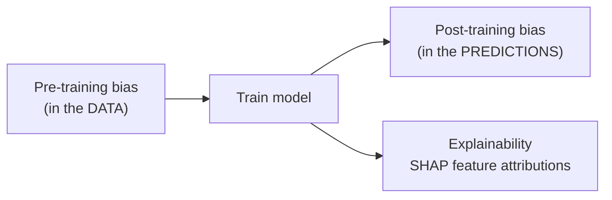
```mermaid
flowchart LR
    Pre["Pre-training bias\n(in the DATA)"] --> Model["Train model"]
    Model --> Post["Post-training bias\n(in the PREDICTIONS)"]
    Model --> Explain["Explainability\nSHAP feature attributions"]
```

| Clarify capability | What it measures | Example metrics |
|---|---|---|
| **Pre-training bias** | Imbalance in the **training data** before modeling | **Class Imbalance (CI)**, **Difference in Positive Proportions in Labels (DPL)** |
| **Post-training bias** | Bias in the **model's predictions** | **DPPL** (Difference in Positive Proportions in Predicted Labels), **Disparate Impact (DI)**, **Accuracy Difference (AD)**, **Recall Difference**, **Fliptest (FT)** |
| **Explainability** | Which features drove predictions | **SHAP** (Shapley) values — global & per-prediction feature importance; partial dependence plots |

> 🎯 **On the exam:** "Detect **bias** in data or model / measure **fairness** across groups" → **SageMaker Clarify** (pre- and post-training bias metrics). "**Explain** which features drove a prediction / interpretability" → **Clarify + SHAP**. Clarify results integrate into **Model Monitor** (bias/feature-attribution drift in production) and **Model Cards**.

Source: [SageMaker Clarify bias & explainability](https://docs.aws.amazon.com/sagemaker/latest/dg/clarify-configure-processing-jobs.html) · [Clarify processing jobs](https://docs.aws.amazon.com/sagemaker/latest/dg/clarify-processing-job-run.html)

### Reproducibility, experiments & shadow vs production variants 

**Plain English:** To trust and audit results, you must be able to *reproduce* an experiment, *compare* candidate models, and *safely test* a new model against the live one before switching traffic.

> **Why (the rationale):** ML experiments are inherently hard to reproduce — small code, data, or random-seed differences produce different results. SageMaker Experiments, Pipelines, and Model Registry together create a reproducible, auditable, version-controlled ML lifecycle.
> **When to use:** SageMaker Experiments to automatically track params/metrics/artifacts for every training run; shadow variants to validate a new model/container/instance on real traffic with zero user risk; production variants to A/B test two live models and compare business KPIs before full cutover.
> **Nuances & gotchas:** Shadow variants receive a COPY of production traffic — they DO double the inference compute cost (both production and shadow are processing requests). A shadow variant's responses are NOT returned to the user — only the production variant's response is. Production variant A/B testing DOES expose users to the new model — some users will receive the new model's (potentially worse) predictions. Setting random seeds alone is not sufficient for full reproducibility — you must also pin the data version, framework version, and container image digest.

| Need | AWS answer |
|---|---|
| Track/compare training runs, params, metrics | **SageMaker Experiments** (part of MLflow / Studio) |
| Reproducible, versioned pipeline | **SageMaker Pipelines** + **Model Registry** + fixed random seeds/data versions |
| Compare a candidate model on real traffic **without affecting users** | **Shadow testing** — the **shadow variant** receives a copy of production traffic; its responses are **logged, not returned** to users |
| Split live traffic between models | **Production variants** (A/B testing) with weighted traffic on a single endpoint |

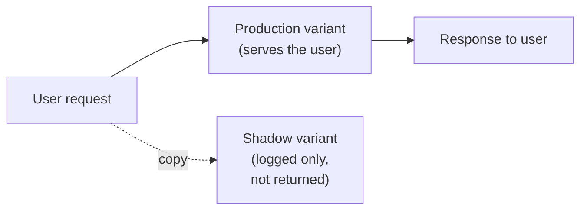
```mermaid
flowchart LR
    U["User request"] --> P["Production variant\n(serves the user)"]
    U -.copy.-> S["Shadow variant\n(logged only,\nnot returned)"]
    P --> Resp["Response to user"]
```

> 🎯 **If you see X pick Y:** "Test a new model on **real traffic without risking users**" → **shadow testing / shadow variant**. "Gradually shift a **percentage of live traffic** between two models to compare" → **production variants (A/B)**. "Compare and reproduce training experiments" → **SageMaker Experiments + Pipelines**.

**Tradeoffs to reason about (a recurring exam theme):** better performance usually costs more **training time**, bigger **instances**, and **money**. When a question asks for "best model," check whether the qualifier is *most accurate*, *fastest*, *cheapest*, or *lowest latency* — that qualifier picks the answer.

Source: [Shadow tests in SageMaker](https://docs.aws.amazon.com/sagemaker/latest/dg/model-shadow-deployment.html) · [Production variants](https://docs.aws.amazon.com/sagemaker/latest/dg/model-ab-testing.html)

---

## Exam traps & quick-fire review 

| # | Trap / Question shape | Answer reflex |
|---|---|---|
| 1 | "No ML expertise, common vision/speech/NLP task, fast" | **AI service** (Rekognition/Transcribe/Translate/Comprehend), not SageMaker |
| 2 | "Managed access to multiple FMs via one API, least ops" | **Amazon Bedrock** |
| 3 | "Deploy/fine-tune an open-source FM inside SageMaker" | **JumpStart** |
| 4 | "Tabular classification/regression" | **XGBoost** (default) or Linear Learner |
| 5 | "Time-series forecasting, many related series" | **DeepAR** (or Amazon Forecast if no ML team) |
| 6 | "Anomaly/outlier detection" | **Random Cut Forest**; IPs → **IP Insights** |
| 7 | "Cluster unlabeled data" | **K-Means** |
| 8 | "Reduce number of features / dimensionality" | **PCA** (or **L1** for feature selection) |
| 9 | "Topic modeling on documents" | **LDA** or **NTM** |
| 10 | "Detect objects with boxes vs label whole image vs per-pixel" | Object Detection vs Image Classification vs Semantic Segmentation |
| 11 | "Imbalanced data — which metric?" | NOT accuracy → **F1 / precision / recall / AUC** |
| 12 | "Can't miss positives (disease/fraud)" | Optimize **recall** |
| 13 | "False alarms costly" | Optimize **precision** |
| 14 | "Compare classifiers regardless of threshold" | **AUC / ROC** |
| 15 | "Regression, big errors costly" | **RMSE**; outliers → **MAE** |
| 16 | "Automatic feature selection / sparse model" | **L1** regularization |
| 17 | "Smoothly shrink weights / NN weight decay" | **L2** |
| 18 | "Randomly disable neurons to fight overfitting" | **Dropout** |
| 19 | "Efficient HPO learning from past runs" | **Bayesian** (AMT) |
| 20 | "3× faster HPO for deep nets, auto-stop bad trials" | **Hyperband** |
| 21 | "Data too big, model fits one GPU" | **Data parallel** (SMDDP) |
| 22 | "Model too big for one GPU" | **Model parallel** (SMP v2) |
| 23 | "Detect vanishing gradients / convergence issues in training" | **SageMaker Debugger** |
| 24 | "Detect bias / explain predictions (SHAP)" | **SageMaker Clarify** |
| 25 | "Version models, gate production via approval, audits" | **Model Registry** |
| 26 | "Test new model on live traffic without user impact" | **Shadow variant / shadow testing** |
| 27 | "Split live traffic between two models" | **Production variants (A/B)** |
| 28 | "I have TF/PyTorch code, want managed training" | **Script mode** |
| 29 | "Unsupported framework / full control" | **BYO container (ECR)** |
| 30 | "Ground FM on private docs, no retraining" | **RAG**; consistent format from examples → **fine-tuning** |
| 31 | "XGBoost is which ensemble method?" | **Boosting** (reduces bias); bagging reduces variance |
| 32 | "Deploy to edge, reduce size/latency" | **Quantization + pruning** (+ Neo) |
| 33 | "Decisions must be explainable to regulators" | Interpretable model (linear/tree) + **Clarify SHAP** |

**One-line mental models to keep:**
- Buy (AI services) → Borrow (Bedrock/JumpStart FMs) → Build-fast (built-ins) → Build-custom (script/BYOC).
- Epoch = full pass; step = one batch update; batch size = samples per update.
- Precision = "when I say yes, am I right?"; Recall = "did I catch them all?"; F1 = balance.
- Accuracy lies on imbalanced data.
- L1 = sparse/feature-select; L2 = shrink; dropout = disable neurons.
- Bayesian = smart; Hyperband = fast for iterative; Grid = exhaustive; Random = simple.
- Debugger = training convergence; Clarify = bias/explain; Model Monitor = production drift.

---

---

## Glossary

| Term | Simple explanation | Purpose |
|---|---|---|
| MLA-C01 | The AWS Certified Machine Learning Engineer – Associate exam code | Identifies the certification this chapter prepares you for |
| Domain 2 | The second scored section of MLA-C01, covering ML model development (26% of the exam) | Covers algorithm selection, training, and performance analysis |
| Task 2.1 | Exam task statement for choosing a modeling approach | Tests ability to select the right algorithm, service, or FM tier |
| Task 2.2 | Exam task statement for training and refining models | Tests hyperparameter tuning, distributed training, regularization, and versioning |
| Task 2.3 | Exam task statement for analyzing model performance | Tests evaluation metrics, debugging, bias, and experiment management |
| AI services | Fully trained AWS ML APIs requiring no model-building (Rekognition, Transcribe, etc.) | Fastest path to common ML tasks for teams with no ML expertise |
| Foundation model (FM) | A very large pre-trained model trained on broad data that can be adapted to many tasks | Enables generative AI, summarization, chat, and embeddings without training from scratch |
| Amazon Bedrock | Serverless API giving access to multiple foundation models from Anthropic, Meta, Amazon, and others | Provides FM capabilities with no infrastructure to manage |
| SageMaker JumpStart | SageMaker feature for deploying and fine-tuning open-source foundation models inside SageMaker | Gives more control over the model instance and fine-tuning compared to Bedrock |
| Guardrails for Amazon Bedrock | Bedrock feature that adds content filtering, topic blocking, and PII redaction to FM applications | Enforces safety and compliance policies on generative AI outputs |
| Amazon Rekognition | AWS AI service for object, scene, face, and text detection in images and video | Enables vision tasks without any model training |
| Amazon Transcribe | AWS AI service for converting audio speech to text | Used for call-center transcription, subtitles, and voice interfaces |
| Amazon Translate | AWS AI service for neural machine translation between languages | Used to translate content across language pairs at scale |
| Amazon Polly | AWS AI service that converts text to lifelike speech | Used for voice responses, accessibility, and audio content |
| Amazon Comprehend | AWS AI service for entity extraction, sentiment analysis, key-phrase detection, and PII detection in text | Used for document analytics and text classification without custom model training |
| Amazon Textract | AWS AI service that extracts text, forms, and tables from scanned documents | Used for document digitization beyond simple OCR |
| Amazon Lex | AWS AI service for building conversational chatbots | Provides the same technology underlying Alexa for custom bot interfaces |
| Amazon Kendra | AWS ML-powered enterprise semantic search service | Enables natural-language questions over large internal document repositories |
| Amazon Personalize | AWS AI service for real-time product and content recommendations | Produces personalized recommendations from user interaction history |
| Amazon Forecast | AWS managed time-series forecasting service | Enables demand and inventory forecasting without an ML team |
| Amazon Fraud Detector | AWS AI service for detecting online transaction fraud | Provides fraud detection using historical transaction data |
| Script mode | SageMaker training option where you supply a TensorFlow/PyTorch/sklearn script run inside an AWS-managed container | Allows custom model code without building a full Docker image |
| BYO container (BYOC) | Bring Your Own Container; a fully custom Docker image pushed to ECR for use in SageMaker | Supports unsupported frameworks or specialized runtimes |
| ECR | Amazon Elastic Container Registry; private Docker image store | Stores and versions custom container images used by SageMaker, ECS, and EKS |
| Deep Learning Containers (DLC) | AWS-maintained Docker images for TensorFlow, PyTorch, MXNet, and other frameworks | Pre-built base images for script mode or extending with custom dependencies |
| XGBoost | Gradient-boosted tree algorithm; the default choice for tabular classification and regression | Fast, accurate, and interpretable-ish for structured data |
| Linear Learner | SageMaker built-in algorithm for linear classification and regression | Trains many linear models in parallel and selects the best; suited for large sparse data |
| K-Nearest Neighbors (k-NN) | Non-parametric algorithm that predicts from the k most similar labeled training points | Used for similarity-based predictions where local patterns matter |
| Factorization Machines | Built-in algorithm for classification and regression on high-dimensional sparse data | Best for recommendation and click-prediction tasks with sparse feature interactions |
| DeepAR | SageMaker built-in RNN-based algorithm for forecasting many related time series simultaneously | Outperforms classical methods when many series share patterns |
| Object2Vec | SageMaker built-in algorithm for learning low-dimensional embeddings of arbitrary objects | Used to find similar documents, tickets, or products |
| K-Means | Unsupervised clustering algorithm that groups data into k clusters | Used for customer segmentation or discovering structure in unlabeled data |
| PCA | Principal Component Analysis; reduces the number of features while retaining maximum variance | Preprocessing step to speed up training and reduce noise |
| Random Cut Forest (RCF) | SageMaker built-in anomaly detection algorithm for data streams | Detects outliers in real-time sensor, fraud, or log data |
| IP Insights | SageMaker built-in algorithm for detecting anomalous IPv4 address–entity pairings | Flags suspicious account logins from unexpected IP addresses |
| LDA | Latent Dirichlet Allocation; statistical topic model for discovering themes in text corpora | Classifies documents by inferred topics without labeled data |
| NTM | Neural Topic Model; neural-network-based topic modeling built into SageMaker | Discovers document topics with deeper representations than LDA |
| BlazingText | SageMaker built-in algorithm for fast Word2Vec embeddings and text classification | Scales word-vector training and text classification to very large corpora |
| Sequence-to-Sequence (seq2seq) | SageMaker built-in algorithm for input-sequence to output-sequence tasks | Used for machine translation, summarization, and speech-to-text |
| Image Classification | SageMaker built-in algorithm that assigns a label to an entire image | Used for content moderation, product categorization, or medical image labeling |
| Object Detection | SageMaker built-in algorithm that locates and labels objects with bounding boxes in images | Used for vehicle detection, retail shelf analysis, and surveillance |
| Semantic Segmentation | SageMaker built-in algorithm that assigns a class label to every pixel in an image | Used for self-driving perception, medical imaging, and satellite analysis |
| AutoGluon-Tabular | SageMaker built-in ensemble algorithm that automatically stacks multiple models for tabular data | Achieves strong accuracy with minimal hyperparameter tuning |
| Interpretability | How easily a human can understand why a model produced a specific prediction | Required in regulated domains (credit, healthcare, hiring) to explain decisions |
| SHAP | SHapley Additive exPlanations; assigns each feature a contribution score to a prediction | Used by SageMaker Clarify to explain individual predictions and rank global feature importance |
| Epoch | One full pass through the entire training dataset | Defines how many times the model sees all training examples |
| Batch size | Number of training samples processed before the model updates its weights | Controls the trade-off between training speed, memory use, and gradient noise |
| Step / iteration | One weight update computed from one batch of data | The atomic unit of training; steps per epoch equals dataset size divided by batch size |
| Early stopping | Halting training when the validation metric stops improving | Saves compute cost and prevents overfitting by avoiding unnecessary extra epochs |
| Data parallel training | Distributed training strategy that splits the dataset across GPUs while each holds a full model copy | Speeds up training when the dataset is huge but the model fits in a single GPU |
| Model parallel training | Distributed training strategy that splits model layers or tensors across multiple GPUs | Required when the model is too large to fit in a single GPU |
| SMDDP | SageMaker Distributed Data Parallelism library; manages gradient synchronization across GPUs | Implements efficient all-reduce communication for data-parallel training on SageMaker |
| SMP library v2 | SageMaker Model Parallelism library version 2; supports tensor parallelism, sharded data parallelism, and activation checkpointing | Enables training of very large LLMs across multiple GPUs |
| Spot instances | AWS EC2 spare-capacity instances priced up to ~90% below On-Demand | Used for interruption-tolerant training jobs to reduce cost |
| Managed Spot Training | SageMaker feature that uses Spot instances and handles interruptions via checkpointing | Reduces training cost without requiring manual interruption handling |
| Checkpointing | Saving model state to persistent storage at regular intervals during training | Allows training to resume from the last checkpoint after a Spot interruption |
| Warm pools | SageMaker feature that keeps training infrastructure running between jobs | Eliminates instance startup time for repeated short training runs |
| Underfitting | Model is too simple, performing poorly on both training and test data | Signals the model needs more capacity, features, or training time |
| Overfitting | Model memorizes training data noise, performing well on training but poorly on new data | Signals the need for regularization, more data, or a simpler model |
| Catastrophic forgetting | A fine-tuned model loses knowledge of its prior training while learning a new task | Mitigated by lower learning rates, mixing original data, or parameter-efficient methods like LoRA |
| L1 regularization (Lasso) | Adds a penalty proportional to the absolute value of weights, driving some to exactly zero | Performs automatic feature selection, producing sparse models |
| L2 regularization (Ridge / weight decay) | Adds a penalty proportional to the square of weights, shrinking them toward zero | Reduces overfitting smoothly without forcing features to zero |
| Dropout | Randomly disables a fraction of neurons during each training step | Forces neural networks to learn redundant representations, reducing overfitting |
| Elastic Net | Combination of L1 and L2 regularization | Produces sparse models with stable weight magnitudes |
| Hyperparameter | A model configuration knob set before training (learning rate, tree depth, batch size) | Controls the learning process itself rather than being learned from data |
| Learning rate | How large a step the optimizer takes in the direction of the gradient each update | Too high causes divergence; too low causes slow or stalled training |
| SageMaker Automatic Model Tuning (AMT) | Service that runs many training jobs with different hyperparameter values to find the best combination | Automates the otherwise manual and costly search for optimal hyperparameters |
| Grid search | HPO strategy that tries every combination in a discrete grid | Exhaustive and thorough but impractical for large or continuous search spaces |
| Random search | HPO strategy that samples hyperparameter combinations randomly | Parallelizes easily and often finds good results with fewer jobs than grid search |
| Bayesian optimization | HPO strategy that uses prior job results to intelligently choose the next combination | Sample-efficient; requires fewer jobs to reach a good result than random or grid |
| Hyperband | HPO strategy that early-stops weak configurations and allocates more resources to strong ones | Up to 3× faster than Bayesian for iterative algorithms like neural networks |
| Bagging | Ensemble technique that trains models in parallel on random data subsets and averages their predictions | Reduces variance (overfitting); Random Forest is the canonical example |
| Boosting | Ensemble technique that trains models sequentially, each correcting the previous one's errors | Reduces bias (underfitting); XGBoost, LightGBM, and CatBoost are boosting algorithms |
| Stacking | Ensemble technique that feeds multiple models' predictions into a meta-model | Combines strengths of diverse models; AutoGluon uses deep stacking automatically |
| RAG | Retrieval-Augmented Generation; retrieves relevant documents at inference and feeds them to the FM | Keeps FM answers grounded in private or up-to-date information without retraining |
| Fine-tuning | Updating a pre-trained model's weights on task-specific labeled examples | Produces consistent task-specific behavior with less data than training from scratch |
| Continued pre-training | Updating a pre-trained model's weights on a large unlabeled domain corpus | Teaches the model a new domain's vocabulary and knowledge |
| LoRA | Low-Rank Adaptation; a parameter-efficient fine-tuning method that adds small trainable matrices | Fine-tunes large models cheaply while reducing catastrophic forgetting |
| Quantization | Reducing the numeric precision of model weights (e.g., FP32 → FP16 or INT8) | Decreases model memory footprint and speeds up inference |
| Pruning | Removing weights or neurons that contribute little to model output | Reduces model size and inference latency |
| Knowledge distillation | Training a small student model to mimic a large teacher model's outputs | Produces a compact model with accuracy closer to the larger model |
| SageMaker Neo | Service that compiles and optimizes models for specific hardware targets | Reduces model size and increases inference speed on edge or cloud hardware |
| SageMaker Model Registry | Catalog for versioning trained models with approval statuses and metadata | Enables controlled, auditable promotion of models through staging to production |
| Model (Package) Group | A named collection of model versions in the Model Registry | Organizes all versions of a single logical model for comparison and governance |
| Approval status | A Model Registry field (PendingManualApproval, Approved, Rejected) on each model version | Gates deployment; an Approved status can trigger a CI/CD pipeline via EventBridge |
| Confusion matrix | A table counting TP, FP, FN, and TN predictions for a classification model | The foundation from which all classification metrics are derived |
| True Positive (TP) | Prediction is positive and the actual label is positive | Correct positive prediction; contributes to precision and recall |
| False Positive (FP) | Prediction is positive but the actual label is negative | A false alarm; the cost of FPs drives precision optimization |
| False Negative (FN) | Prediction is negative but the actual label is positive | A miss; the cost of FNs drives recall optimization |
| True Negative (TN) | Prediction is negative and the actual label is negative | Correct negative prediction; contributes to specificity |
| Accuracy | Fraction of all predictions that are correct | Misleading on imbalanced datasets; a model predicting the majority class can score high |
| Precision | Fraction of positive predictions that are actually positive | Optimized when false alarms are costly |
| Recall (Sensitivity / TPR) | Fraction of actual positives that the model correctly identifies | Optimized when missing a positive (disease, fraud) is costly |
| Specificity (TNR) | Fraction of actual negatives that the model correctly clears | Measures how well the model avoids false alarms for the negative class |
| F1 score | Harmonic mean of precision and recall | Balanced metric for imbalanced datasets where both false alarms and misses matter |
| ROC curve | Plot of True Positive Rate vs False Positive Rate across all classification thresholds | Visualizes the trade-off between sensitivity and specificity for a classifier |
| AUC | Area Under the ROC Curve; ranges from 0.5 (random) to 1.0 (perfect) | Single number for comparing classifiers independent of threshold choice |
| Precision-Recall (PR) curve | Plot of precision vs recall across all thresholds | Preferred over ROC when the positive class is very rare |
| RMSE | Root Mean Squared Error; square root of the average squared prediction error | Penalizes large errors heavily; used for regression when big misses are costly |
| MAE | Mean Absolute Error; average of absolute differences between predictions and true values | More robust to outliers than RMSE; treats all errors equally |
| R² | Coefficient of determination; fraction of target variance explained by the model | 1.0 = perfect fit; 0 = no better than predicting the mean |
| Baseline (ML) | A simple reference model (e.g., predict the mean) that the real model must beat | Confirms that the ML investment adds value over a trivial heuristic |
| Convergence | The state where training loss stabilizes at a minimum and further training makes little difference | Indicates the model has learned as much as the optimizer can find |
| Vanishing gradients | Gradients become extremely small in deep networks, preventing early layers from learning | Mitigated by better initialization, ReLU activations, batch normalization, or residual connections |
| Exploding gradients | Gradients grow uncontrollably, destabilizing training | Mitigated by lowering the learning rate or applying gradient clipping |
| SageMaker Debugger | SageMaker feature that captures tensors during training and evaluates built-in rules in real time | Automatically detects convergence issues (vanishing gradients, overfitting, loss not decreasing) |
| SageMaker Experiments | MLflow-integrated tool for tracking, comparing, and reproducing training runs | Logs parameters, metrics, and artifacts for each run to enable systematic comparison |
| SageMaker Pipelines | ML-native, serverless DAG pipeline orchestration integrated with SageMaker | Automates end-to-end ML workflows from data processing through model registration |
| Shadow testing | Routing a copy of live production traffic to a new model variant whose responses are logged but not returned to users | Validates a new model or container on real traffic with zero user impact |
| Production variants | Named model instances behind one SageMaker endpoint, each receiving a configurable fraction of traffic | Enables A/B testing and gradual traffic migration between model versions |
| A/B testing | Splitting live traffic between two model variants to compare business and quality metrics | Determines which model performs better on real users before full rollout |
| SageMaker Clarify | AWS tool that computes pre-training bias, post-training bias, and SHAP feature-attribution explanations | Detects unfairness and explains predictions throughout the ML lifecycle |
| Post-training bias metrics | Clarify metrics computed on model predictions (DPPL, DI, AD, Recall Difference, Fliptest) | Measure whether the model's outputs are unfair to specific demographic groups |
| DPPL | Difference in Positive Proportions in Predicted Labels; a post-training bias metric | Measures whether predicted positive rates differ between groups |
| Disparate Impact (DI) | Post-training bias metric comparing positive prediction rates between groups as a ratio | Legal concept applied to model outputs to check for discriminatory decisions |
| Heat map | A color-coded matrix visualization of values (e.g., a confusion matrix or correlation matrix) | Makes patterns in multi-dimensional tables visually obvious |
| Partial dependence plot | A visualization showing the marginal effect of one or two features on model predictions | Used alongside SHAP to understand feature-level model behavior globally |
| Model Cards | SageMaker documentation artifact that records a model's intended use, performance, and limitations | Supports transparency, governance, and regulatory compliance for deployed models |

---

## References 

All URLs verified against current AWS documentation.

- MLA-C01 exam guide (v1.0): https://docs.aws.amazon.com/aws-certification/latest/examguides/machine-learning-engineer-associate-01.html
- SageMaker built-in algorithms & pretrained models: https://docs.aws.amazon.com/sagemaker/latest/dg/algos.html
- Choose an algorithm (types of algorithms): https://docs.aws.amazon.com/sagemaker/latest/dg/algorithms-choose.html
- Amazon Bedrock — what is it: https://docs.aws.amazon.com/bedrock/latest/userguide/what-is-bedrock.html
- SageMaker JumpStart: https://docs.aws.amazon.com/sagemaker/latest/dg/studio-jumpstart.html
- AWS AI services: https://aws.amazon.com/machine-learning/ai-services/
- Amazon Rekognition: https://docs.aws.amazon.com/rekognition/latest/dg/what-is.html
- Amazon Transcribe: https://docs.aws.amazon.com/transcribe/latest/dg/what-is.html
- Amazon Translate: https://docs.aws.amazon.com/translate/latest/dg/what-is.html
- Amazon Comprehend: https://docs.aws.amazon.com/comprehend/latest/dg/what-is.html
- Distributed training in SageMaker: https://docs.aws.amazon.com/sagemaker/latest/dg/distributed-training.html
- SageMaker distributed data parallelism (SMDDP): https://docs.aws.amazon.com/sagemaker/latest/dg/data-parallel-intro.html
- SageMaker model parallelism intro: https://docs.aws.amazon.com/sagemaker/latest/dg/model-parallel-intro.html
- SageMaker model parallelism v2: https://docs.aws.amazon.com/sagemaker/latest/dg/model-parallel-v2.html
- Hyperparameter tuning strategies (AMT): https://docs.aws.amazon.com/sagemaker/latest/dg/automatic-model-tuning-how-it-works.html
- AMT best practices: https://docs.aws.amazon.com/sagemaker/latest/dg/automatic-model-tuning-considerations.html
- AMT early stopping: https://aws.amazon.com/blogs/machine-learning/amazon-sagemaker-automatic-model-tuning-now-supports-early-stopping-of-training-jobs/
- AMT Hyperband announcement: https://aws.amazon.com/about-aws/whats-new/2022/09/amazon-sagemaker-automatic-model-tuning-provides-faster-hyperparameter-tuning-hyperband-search-strategy/
- SageMaker frameworks / script mode: https://docs.aws.amazon.com/sagemaker/latest/dg/frameworks.html
- SageMaker Model Registry: https://docs.aws.amazon.com/sagemaker/latest/dg/model-registry.html
- Model groups, versions & approval: https://docs.aws.amazon.com/sagemaker/latest/dg/model-registry-models.html
- Update model approval status: https://docs.aws.amazon.com/sagemaker/latest/dg/model-registry-approve.html
- SageMaker Debugger: https://docs.aws.amazon.com/sagemaker/latest/dg/train-debugger.html
- SageMaker Debugger built-in rules: https://docs.aws.amazon.com/sagemaker/latest/dg/debugger-built-in-rules.html
- SageMaker Clarify — bias & explainability: https://docs.aws.amazon.com/sagemaker/latest/dg/clarify-configure-processing-jobs.html
- Clarify processing jobs: https://docs.aws.amazon.com/sagemaker/latest/dg/clarify-processing-job-run.html
- Shadow deployment (shadow variant): https://docs.aws.amazon.com/sagemaker/latest/dg/model-shadow-deployment.html
- Production variants / A/B testing: https://docs.aws.amazon.com/sagemaker/latest/dg/model-ab-testing.html
