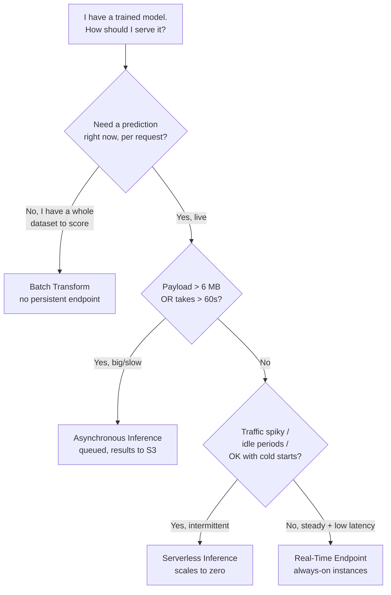
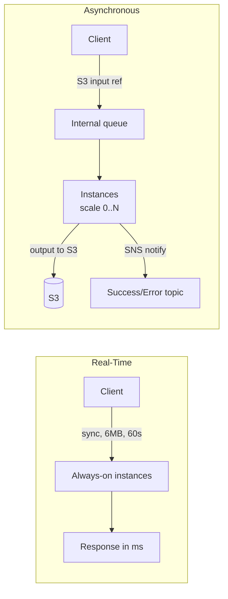
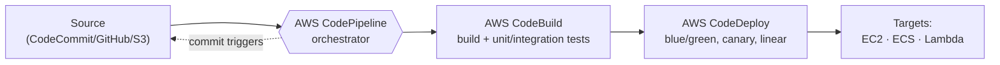
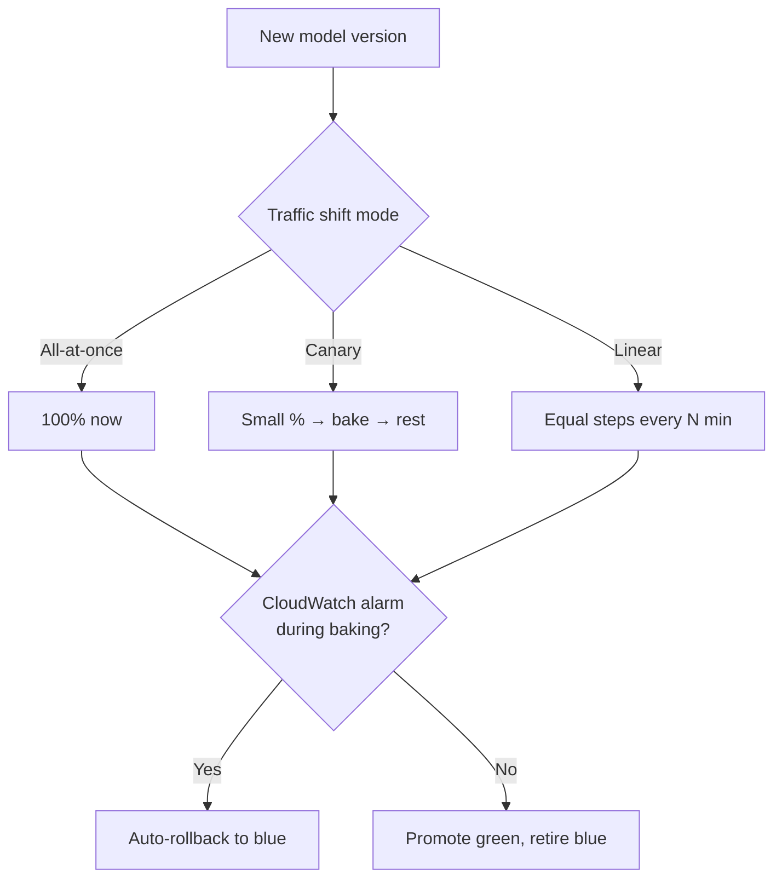
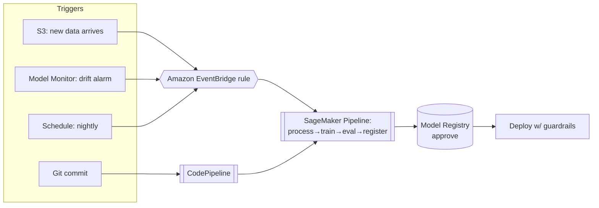

# Domain 3: Deployment and Orchestration of ML Workflows

This domain is **22% of the MLA-C01 exam** — the second-largest slice, and the most "architect-y" of the four. It tests whether you can take a trained model and **serve it in production**: picking the right SageMaker endpoint type, sizing compute, scripting infrastructure as code, and wiring up CI/CD so models retrain and redeploy automatically. The single most heavily tested concept is the **endpoint-type decision** (real-time vs serverless vs asynchronous vs batch transform) — master the comparison table below and you have already banked a chunk of the domain.

> Sources: [MLA-C01 exam guide (v1.0)](https://docs.aws.amazon.com/aws-certification/latest/examguides/machine-learning-engineer-associate-01.html) · [SageMaker inference options](https://docs.aws.amazon.com/sagemaker/latest/dg/deploy-model-options.html)

---

## Table of Contents
- [The 30-second mental model](#mental-model)
- [3.1 Real-time vs batch serving](#realtime-vs-batch)
- [3.1 SageMaker endpoint types — the critical comparison](#endpoint-types)
- [3.1 Choosing compute: CPU vs GPU, instance families](#compute)
- [3.1 Containers: built-in, framework, BYOC](#containers)
- [3.1 Multi-model vs multi-container vs inference components](#mme-vs-mce)
- [3.1 Edge deployment with SageMaker Neo](#neo)
- [3.1 Deployment targets beyond SageMaker: ECS, EKS, Lambda](#targets)
- [3.1 Choosing an orchestrator: SageMaker Pipelines vs MWAA](#orchestrator)
- [3.2 On-demand vs provisioned; auto-scaling policies](#autoscaling)
- [3.2 Infrastructure as Code: CloudFormation vs CDK](#iac)
- [3.2 Containers & registries: ECR, ECS, EKS, BYOC](#ecr)
- [3.2 VPC, Spot, and the SageMaker SDK](#vpc-spot)
- [3.3 CI/CD building blocks: CodePipeline, CodeBuild, CodeDeploy](#cicd-blocks)
- [3.3 Git workflows: Gitflow vs GitHub Flow](#git-workflows)
- [3.3 Deployment strategies & rollback: blue/green, canary, linear](#deploy-strategies)
- [3.3 Event-driven orchestration & automated retraining](#retraining)
- [Exam traps & quick-fire review](#exam-traps)
- [References](#references)

---

## The 30-second mental model <a name="mental-model"></a>

🧠 **Plain English:** Think of deploying a model like opening a food service. Do people want food **instantly, one plate at a time** (real-time endpoint — a fast-food counter always staffed)? Only **occasionally, willing to wait a beat** (serverless — a food truck that parks only when customers show up)? Do they hand you a **huge catering order that takes an hour** (asynchronous — you take the order, cook in back, text them when it's ready)? Or do they want **10,000 boxed lunches processed overnight** (batch transform — rent a kitchen, cook everything, tear it down)?



Everything in this domain hangs off that flowchart. The rest is *how* to provision, script, secure, and automate each choice.

---

## 3.1 Real-time vs batch serving <a name="realtime-vs-batch"></a>

🧠 **Mental model:** Real-time = a waiter taking one order at a time and returning a plate in milliseconds. Batch = a factory line running once to process a mountain of inputs, then shutting off.

| Dimension | **Real-time / online serving** | **Batch / offline serving** |
|---|---|---|
| Trigger | Per-request API call | Scheduled or on-demand job over a dataset |
| Latency need | Milliseconds | Minutes to hours — doesn't matter |
| Infra lifetime | Always on (or scaling) | Spun up, runs, torn down |
| Cost model | Pay for uptime | Pay only for the job duration |
| Typical use | Fraud check at checkout, chatbot, recommendations | Nightly scoring of all customers, churn labels, embeddings backfill |
| SageMaker fit | Real-time endpoint / serverless / async | **Batch Transform** |

🎯 **On the exam — "if you see X, pick Y":**
- "Score millions of records **once a night**, no live users, write results to S3" → **Batch Transform**. Do *not* stand up a persistent endpoint.
- "Sub-100 ms response for a live web app" → **Real-time endpoint**.
- "Occasional traffic, want to **avoid paying for idle** instances" → **Serverless Inference**.

---

## 3.1 SageMaker endpoint types — the critical comparison <a name="endpoint-types"></a>

🧠 **Plain English:** SageMaker gives you four ways to run inference. They differ mainly on **payload size, timeout, traffic pattern, and cost when idle**. This table is the single most tested thing in Domain 3 — memorize it.

⚙️ **The comparison table (exam gold):**

| Attribute | **Real-Time Endpoint** | **Serverless Inference** | **Asynchronous Inference** | **Batch Transform** |
|---|---|---|---|---|
| **Best for** | Steady traffic, low latency | Spiky/intermittent traffic, idle gaps | Large payloads, long processing, near-real-time | Score a whole dataset, no persistent endpoint |
| **Max payload** | **6 MB** | **4 MB** | **1 GB** | **100 MB per mini-batch** (large files split) |
| **Max processing time (timeout)** | **60 s** | **60 s** | **1 hour** (`InvocationTimeoutSeconds` ≤ 3600) | Effectively unbounded (job runs to completion) |
| **Latency** | Milliseconds | Milliseconds **+ cold start** when scaling from 0 | Seconds–minutes (queued) | N/A (throughput job) |
| **Scales to zero?** | ❌ No (min 1 instance) | ✅ **Yes** — pay $0 when idle | ✅ Yes — can auto-scale to 0 instances when queue empty | N/A (no endpoint) |
| **Persistent endpoint?** | ✅ Yes | ✅ Yes | ✅ Yes | ❌ No — transient job |
| **Input/output location** | Request/response body | Request/response body | **Amazon S3** (input & output), notify via SNS | Amazon S3 in, S3 out |
| **GPU support** | ✅ Yes | ❌ **No** (CPU only) | ✅ Yes | ✅ Yes |
| **Cost model** | Pay per instance-hour (always on) | Pay per **request + duration** (ms), $0 idle | Pay per instance-hour, but scales to 0 | Pay only for job duration |
| **Cold starts** | No | ✅ Yes (mitigate with Provisioned Concurrency) | Yes on scale-from-zero | N/A |

> Sources: [Inference options](https://docs.aws.amazon.com/sagemaker/latest/dg/deploy-model-options.html) · [Serverless endpoints](https://docs.aws.amazon.com/sagemaker/latest/dg/serverless-endpoints.html) · [Asynchronous inference](https://docs.aws.amazon.com/sagemaker/latest/dg/async-inference.html) · [Batch transform](https://docs.aws.amazon.com/sagemaker/latest/dg/batch-transform.html)



**Serverless deep facts (commonly tested):**
- Memory sizes: **1024, 2048, 3072, 4096, 5120, or 6144 MB** (1–6 GB). More memory → more vCPU auto-assigned. ([docs](https://docs.aws.amazon.com/sagemaker/latest/dg/serverless-endpoints.html))
- Max concurrency **per endpoint = 200**; account-level shared concurrency is **1000** (large regions) or **500** (others); up to **50 serverless endpoints** per region.
- **No GPU, no Multi-Model Endpoints, no VPC, no Model Monitor, no data capture, no inference pipelines.**
- Use **Provisioned Concurrency** to keep it warm and kill cold starts (adds cost; scales via Application Auto Scaling).
- You **cannot** convert a real-time endpoint → serverless (you get a `ValidationError`); serverless → real-time is one-way.

🎯 **"If you see X, pick Y" for endpoint types:**
- "Payload is a **1 GB video/genomics file**, inference takes minutes" → **Asynchronous** (only one that allows >6 MB & >60 s in a live endpoint).
- "Requests **come in bursts with long idle gaps**, want to pay nothing when idle, milliseconds latency OK with occasional cold start" → **Serverless**.
- "Need a **GPU** and it's **spiky/idle** traffic" → serverless can't do GPU → use **Asynchronous** (scales to 0 *and* supports GPU) or a real-time endpoint with auto-scaling.
- "One-off scoring of an S3 dataset, results back to S3, no live endpoint" → **Batch Transform**.

---

## 3.1 Choosing compute: CPU vs GPU, instance families <a name="compute"></a>

🧠 **Plain English:** CPUs are versatile generalists; GPUs are massively parallel number-crunchers. Deep-learning models with big matrix math (LLMs, vision) fly on GPUs; classic ML (XGBoost, sklearn, small models) usually runs cheaper on CPU.

| Choose... | When | SageMaker instance families |
|---|---|---|
| **CPU** | Classic ML, small models, low/moderate QPS, cost-sensitive | `ml.c5`/`ml.c6i`/`ml.c7i` (compute), `ml.m5`/`ml.m6i`/`ml.m7i` (general) |
| **GPU** | Deep learning inference/training, large models, high throughput | `ml.g5`/`ml.g6` (cost-effective inference), `ml.p4d`/`ml.p5` (large training) |
| **AWS Inferentia** | Cost-optimized high-throughput DL **inference** | `ml.inf2` (Inferentia2) |
| **AWS Trainium** | Cost-optimized DL **training** | `ml.trn1` |
| **Memory-optimized** | Large in-memory feature sets | `ml.r5`/`ml.r6i`/`ml.r7i` |

**Other levers the exam expects you to reason about:** processor family (Intel vs AMD vs Graviton/ARM), **networking bandwidth** (needed for distributed training / high-throughput serving — pick instances with higher Gbps or **Elastic Fabric Adapter** for multi-GPU training), and instance count for horizontal scale.

🎯 **Trap:** GPU is *not* automatically better. For a small XGBoost model at low QPS, a GPU wastes money — pick CPU. If asked to **minimize inference cost** for a high-throughput deep-learning model, look for **Inferentia (`ml.inf2`)**.

---

## 3.1 Containers: built-in, framework, BYOC <a name="containers"></a>

🧠 **Analogy:** SageMaker containers are like meal kits. **Built-in algorithms** = fully pre-made. **Framework containers** = a kit where you add your recipe (script). **BYOC** = you build the whole kitchen yourself.

| Option | What it is | Use when |
|---|---|---|
| **Built-in algorithm containers** | AWS-provided images for XGBoost, Linear Learner, etc. | You use a SageMaker built-in algorithm |
| **Prebuilt framework containers** (script mode) | AWS "Deep Learning Containers" for TensorFlow, PyTorch, MXNet, Scikit-learn, HuggingFace — you supply an entry-point script | Standard framework, custom code, no custom OS deps |
| **Extend a prebuilt container** | Start from a DLC, add libraries via `Dockerfile` | Need a few extra packages |
| **Bring Your Own Container (BYOC)** | Fully custom Docker image following the SageMaker inference contract | Exotic framework, custom runtime, unusual dependencies |

⚙️ **The SageMaker inference contract for BYOC:** your container must serve `/ping` (health check → HTTP 200) and `/invocations` (predictions) on port **8080**. Push the image to **Amazon ECR**; SageMaker pulls from there.

🎯 **If you see X, pick Y:** "TensorFlow model, just need to add one pip package" → **extend a prebuilt DLC** (not full BYOC). "Custom C++ inference runtime not supported by any AWS image" → **BYOC**.

---

## 3.1 Multi-model vs multi-container vs inference components <a name="mme-vs-mce"></a>

🧠 **Plain English:** These are three ways to pack **more than one model onto one endpoint** to save money. They differ in whether the models share a framework and how they're invoked.

| Feature | **Multi-Model Endpoint (MME)** | **Multi-Container Endpoint (MCE)** | **Inference Components** |
|---|---|---|---|
| Idea | Many models, **one shared container**, loaded on demand from S3 | Up to **15 different containers** on one endpoint | Pack multiple models onto an endpoint with **explicit CPU/GPU/memory per model** |
| Frameworks | **Same** framework for all models | **Different** frameworks/containers allowed | Any; fine-grained resource control |
| How invoked | Specify `TargetModel` on invoke | Serial pipeline **or** direct invocation of a specific container | Per-component; independently scalable (even to 0) |
| Best for | Thousands of similar models (e.g., per-customer models) | A few heterogeneous models on one box | Modern generative-AI hosting, right-sizing per model |
| Cost win | Huge — dynamic load/cache, high utilization | Moderate — consolidate a handful | Best per-model efficiency |

> Sources: [Multi-model endpoints](https://docs.aws.amazon.com/sagemaker/latest/dg/multi-model-endpoints.html) · [Multi-container endpoints](https://docs.aws.amazon.com/sagemaker/latest/dg/multi-container-endpoints.html)

🎯 **If you see X, pick Y:**
- "Host **thousands** of same-framework models cost-effectively, load on demand" → **Multi-Model Endpoint**.
- "Deploy **a few models in different frameworks** on one endpoint" → **Multi-Container Endpoint** (up to 15).
- "Need to **scale each model independently** and allocate exact GPU per model" → **Inference Components**.
- Trap: MME requires **one shared serving container / same framework** — if frameworks differ, MME is wrong.

---

## 3.1 Edge deployment with SageMaker Neo <a name="neo"></a>

🧠 **Analogy:** Neo is a **model compiler/translator**. You hand it a trained model and a target device; it recompiles the model to run **faster and smaller** on that specific hardware — like translating a book into the local dialect so it reads faster.

⚙️ **Facts:**
- **SageMaker Neo** compiles/optimizes **TensorFlow, PyTorch, MXNet, ONNX, and XGBoost** models for target hardware: **ARM, Intel, and Nvidia** processors, plus cloud instances including **AWS Inferentia**.
- Edge targets: AWS IoT Greengrass devices based on **ARM Cortex-A, Intel Atom, Nvidia Jetson**.
- Can quantize to **INT8 or FP16** for smaller/faster edge models.
- Deploy compiled models to edge devices via **AWS IoT Greengrass**. (Note: *SageMaker Edge Manager was discontinued April 26, 2024* — Neo compilation itself remains.)

> Source: [SageMaker Neo](https://docs.aws.amazon.com/sagemaker/latest/dg/neo.html) · [Neo edge deployment](https://docs.aws.amazon.com/sagemaker/latest/dg/neo-deployment-edge.html)

🎯 **If you see X, pick Y:** "Deploy a vision model to **Jetson/ARM edge cameras**, optimize for the hardware" → **SageMaker Neo + IoT Greengrass**.

---

## 3.1 Deployment targets beyond SageMaker: ECS, EKS, Lambda <a name="targets"></a>

🧠 **Plain English:** SageMaker endpoints are the managed default, but you can also serve models on general-purpose AWS compute if you need more control or already run those platforms.

| Target | What it is | Choose when |
|---|---|---|
| **SageMaker endpoints** | Fully managed model hosting | Default; least ops overhead; want auto-scaling, guardrails, monitoring built-in |
| **AWS Lambda** | Serverless functions | Very small/lightweight models, event-driven, deploy image ≤ 10 GB, 15-min max, no GPU |
| **Amazon ECS** | Managed container orchestration (with Fargate = serverless containers) | Custom container serving, already on ECS, want AWS-native orchestration |
| **Amazon EKS** | Managed **Kubernetes** | Team standardized on Kubernetes, multi-cloud/portable, complex microservices |
| **EC2** | Raw VMs | Maximum control, custom setups |

🎯 **Trap:** **Lambda has no GPU** and a **15-minute** timeout; only for small CPU models. "Team runs everything on **Kubernetes**, wants portability" → **EKS**. "Want the least ops burden for model hosting" → **SageMaker endpoint**.

---

## 3.1 Choosing an orchestrator: SageMaker Pipelines vs MWAA <a name="orchestrator"></a>

🧠 **Plain English:** An orchestrator strings together the steps of an ML workflow (process → train → evaluate → register → deploy) as a **DAG** (directed acyclic graph). SageMaker Pipelines is the **ML-native** choice; MWAA (managed Airflow) is the **general-purpose, Python-flexible** choice.

| Dimension | **SageMaker Pipelines** | **Amazon MWAA (Managed Airflow)** |
|---|---|---|
| Purpose | Purpose-built **ML** pipeline orchestration | General workflow orchestration (any tasks) |
| Native SageMaker integration | ✅ Deep (steps for Processing, Training, Tuning, Model, Transform, Register) | Via SageMaker operators / PythonOperator |
| Serverless? | ✅ Yes, no infra to manage | ❌ No — you provision Airflow environment (managed but not serverless) |
| Definition | Python SDK → DAG | Python DAGs (Airflow) |
| Model lineage / registry | ✅ Built-in (Model Registry, lineage tracking) | Manual |
| Best when | End-to-end ML on SageMaker, want MLOps templates via **SageMaker Projects** | Complex multi-system pipelines, existing Airflow skills, non-ML tasks mixed in |

> Sources: [SageMaker Pipelines](https://docs.aws.amazon.com/sagemaker/latest/dg/pipelines.html) · [Amazon MWAA](https://docs.aws.amazon.com/mwaa/latest/userguide/what-is-mwaa.html)

🎯 **If you see X, pick Y:** "Orchestrate an **ML workflow entirely on SageMaker**, minimal ops" → **SageMaker Pipelines**. "Team already uses **Apache Airflow** / needs to orchestrate ML + non-AWS + ETL systems together" → **MWAA**. (Note: **AWS Step Functions** is another valid AWS orchestrator with a SageMaker SDK — appears occasionally as a distractor/answer for serverless state-machine orchestration.)

---

## 3.2 On-demand vs provisioned; auto-scaling policies <a name="autoscaling"></a>

🧠 **Analogy:** Auto-scaling is a thermostat for your endpoint's instance count. Set a target (e.g., "keep each instance at 70 requests/min") and it adds/removes instances to hold that target.

⚙️ **SageMaker endpoint auto-scaling** uses **Application Auto Scaling**. Policy types:

| Policy | Behavior | Use when |
|---|---|---|
| **Target tracking** | Hold a metric at a target value (like a thermostat) | Most common; steady behavior around a metric |
| **Step scaling** | Add/remove N instances per alarm threshold band | Need custom, non-linear reactions |
| **Scheduled scaling** | Scale by **time/date** (e.g., 8am spike) | Predictable daily/weekly patterns |

**Auto-scaling metrics you can target (memorize these):**

| Metric | Meaning | Notes |
|---|---|---|
| **`SageMakerVariantInvocationsPerInstance`** | Avg invocations/min per instance | **AWS-recommended default** target-tracking metric |
| **`ModelLatency`** | Inference latency (µs) | Scale on responsiveness |
| **CPU / GPU utilization** (`CPUUtilization`, `GPUUtilization`) | Resource pressure | Use with step/custom scaling |
| **`SageMakerInferenceComponentConcurrentRequestsPerCopyHighResolution`** | Per-copy concurrency | For **inference components** (gen-AI) |

> Source: [Define a scaling policy](https://docs.aws.amazon.com/sagemaker/latest/dg/endpoint-auto-scaling-add-code-define.html)

**On-demand vs provisioned resources:**
- **On-demand** = pay as you go, scale with demand (real-time auto-scaling, serverless).
- **Provisioned** = reserve capacity for predictable performance (**Provisioned Concurrency** on serverless keeps it warm; provisioned instances give steady baseline).

🎯 **If you see X, pick Y:**
- "Scale the endpoint but the recommended default metric" → **`SageMakerVariantInvocationsPerInstance`** with **target tracking**.
- "Traffic spikes every day at 9am, known pattern" → **scheduled scaling**.
- "Kill cold starts on a serverless endpoint" → **Provisioned Concurrency**.

---

## 3.2 Infrastructure as Code: CloudFormation vs CDK <a name="iac"></a>

🧠 **Plain English:** IaC means defining your cloud resources in files instead of clicking the console — repeatable, version-controlled, reviewable. **CloudFormation** = declarative templates (YAML/JSON). **CDK** = write infra in a real programming language (Python/TypeScript) that *compiles down to* CloudFormation.

| | **AWS CloudFormation** | **AWS CDK** |
|---|---|---|
| Language | Declarative YAML/JSON templates | Imperative code (Python, TS, Java, Go, C#) |
| Abstraction | Low-level, explicit | High-level **constructs**, loops, conditionals in code |
| Under the hood | Native service | **Synthesizes to CloudFormation** |
| Best when | Simple/static stacks, ops teams prefer templates, tight control | Developers, complex/repetitive infra, reuse via code |
| State | Managed **stacks**, drift detection, rollback on failure | Same (via CFN) |

> Sources: [CloudFormation](https://docs.aws.amazon.com/AWSCloudFormation/latest/UserGuide/Welcome.html) · [AWS CDK](https://docs.aws.amazon.com/cdk/v2/guide/home.html)

🎯 **Trap:** CDK is **not** a separate deploy engine — it generates CloudFormation. If a question wants "define infra in **Python with loops/logic**" → **CDK**. "Simple declarative template, no code" → **CloudFormation**.

---

## 3.2 Containers & registries: ECR, ECS, EKS, BYOC <a name="ecr"></a>

🧠 **Analogy:** **ECR** is the warehouse where your Docker images (containers) are stored. ECS/EKS/SageMaker are the venues that pull images from that warehouse and run them.

| Service | Role |
|---|---|
| **Amazon ECR** (Elastic Container Registry) | Private Docker image registry — **store & version container images**; SageMaker/ECS/EKS pull from here |
| **Amazon ECS** | AWS-native container orchestration (Fargate = serverless data plane) |
| **Amazon EKS** | Managed Kubernetes |
| **BYOC with SageMaker** | Build a custom image → push to ECR → reference it in SageMaker training/inference |

⚙️ **BYOC flow:** `docker build` → `docker tag` → `aws ecr get-login-password ... | docker login` → `docker push` to ECR → reference the ECR image URI in your SageMaker `Estimator`/`Model`.

🎯 **Trap:** Images live in **ECR**, not S3. "Where do I store a custom SageMaker container image?" → **Amazon ECR**.

---

## 3.2 VPC, Spot, and the SageMaker SDK <a name="vpc-spot"></a>

**VPC for endpoints:** For network isolation and private access to data (no public internet), configure the endpoint/training job inside a **VPC** with subnets + security groups, and use **VPC interface endpoints (AWS PrivateLink)** so traffic to SageMaker stays on the AWS network. (Reminder: **serverless inference does NOT support VPC.**)

**Spot Instances:** For **training** (and Processing) jobs, enable **Managed Spot Training** (`use_spot_instances=True`, set `max_wait`) to save up to ~90% — SageMaker handles interruptions via checkpointing. Spot is for interruption-tolerant **training**, *not* for latency-sensitive real-time endpoints.

**Deploying with the SageMaker Python SDK:**
```python
from sagemaker.model import Model
model = Model(image_uri=ecr_uri, model_data=s3_artifact, role=role)
predictor = model.deploy(
    initial_instance_count=1,
    instance_type="ml.m5.xlarge",   # or serverless_inference_config=... for serverless
)
```
`model.deploy()` creates the **Model → EndpointConfig → Endpoint** trio behind the scenes.

**Lambda "behind" an endpoint pattern:** A common cost/orchestration pattern — API Gateway → **Lambda** → SageMaker endpoint `InvokeEndpoint`. Lambda handles auth, pre/post-processing, and can route to different endpoints, without hosting the model itself.

🎯 **If you see X, pick Y:** "No internet, keep inference traffic private" → **endpoint in a VPC + PrivateLink**. "Cut training cost, tolerant to interruption" → **Managed Spot Training**.

---

## 3.3 CI/CD building blocks: CodePipeline, CodeBuild, CodeDeploy <a name="cicd-blocks"></a>

🧠 **Plain English:** These three AWS "Code" services are an assembly line. **CodePipeline** is the conveyor belt (orchestrates stages). **CodeBuild** is the workstation that compiles/tests/builds artifacts. **CodeDeploy** is the robot that rolls the built artifact out to targets.



| Service | Job | Key facts |
|---|---|---|
| **CodePipeline** | Orchestrates the release pipeline into **stages** (source → build → test → deploy) | Triggered on commit (via CodeStar/EventBridge); each stage has actions; integrates with SageMaker |
| **CodeBuild** | Fully managed build service | Runs commands from a **`buildspec.yml`**; used to run **unit/integration tests**, build Docker images, package models |
| **CodeDeploy** | Automates deployment to compute | Deployment configs for **EC2/on-prem, Lambda, ECS**; supports blue/green + canary/linear/all-at-once traffic shifting |

> Sources: [CodePipeline](https://docs.aws.amazon.com/codepipeline/latest/userguide/welcome.html) · [CodeBuild](https://docs.aws.amazon.com/codebuild/latest/userguide/welcome.html) · [CodeDeploy deployment configs](https://docs.aws.amazon.com/codedeploy/latest/userguide/deployment-configurations.html)

**CI/CD principles in ML (MLOps):** version everything (code **and** data **and** models), automate build/test/deploy, run **automated tests** (unit → integration → end-to-end), and gate deployments on quality checks. **Model Registry** versions models; **SageMaker Projects** provisions a ready-made CodePipeline + repo template for MLOps.

🎯 **Trap:** Know the division of labor — **CodeBuild builds/tests**, **CodeDeploy deploys**, **CodePipeline orchestrates**. A question about "run integration tests in the pipeline" → a **CodeBuild** stage. "Shift traffic gradually to a new Lambda version" → **CodeDeploy** (canary/linear).

---

## 3.3 Git workflows: Gitflow vs GitHub Flow <a name="git-workflows"></a>

🧠 **Plain English:** Both are conventions for how branches map to releases. **Gitflow** is heavyweight (many long-lived branches, scheduled releases). **GitHub Flow** is lightweight (one `main` + short feature branches, continuous deploy).

| | **Gitflow** | **GitHub Flow** |
|---|---|---|
| Branches | `main`, `develop`, `feature/*`, `release/*`, `hotfix/*` | `main` + short-lived `feature/*` |
| Release cadence | Scheduled, versioned releases | Continuous — merge to `main` deploys |
| Complexity | Higher | Lower |
| Best for | Versioned software, multiple environments | Fast-moving web apps, CD |

🎯 **Trap:** "Simple, continuous-deployment, one main branch" → **GitHub Flow**. "Multiple parallel releases with hotfix + release branches" → **Gitflow**. A **commit triggering a pipeline** is enabled via source-stage integration + **EventBridge** rule.

---

## 3.3 Deployment strategies & rollback: blue/green, canary, linear <a name="deploy-strategies"></a>

🧠 **Analogy:** You're replacing the engine on a plane mid-flight. **Blue/green** = build a whole second plane (green), test it, then swap passengers over — instant rollback by switching back. **Canary** = move a few passengers first, watch, then move the rest. **Linear** = move passengers in equal groups every few minutes. **Rolling** = replace engines one at a time.

**SageMaker "deployment guardrails"** update production endpoints safely with **auto-rollback** if CloudWatch alarms trip during a **baking period**. Two families: **blue/green** and **rolling**.

| Strategy | How traffic shifts | Rollback | Trade-off |
|---|---|---|---|
| **All-at-once** | 100% to new fleet immediately | Fast (flip back to blue) | Cheapest, highest blast radius |
| **Canary** | Small % first (test step), then the rest in **2 steps** | Auto-rollback if alarm trips in baking period | Catches bad deploys early; low risk |
| **Linear** | Equal increments over N steps with wait between | Auto-rollback | Most granular control; slowest |
| **Blue/green** | Stand up full green fleet, shift (all-at-once/canary/linear), keep blue during bake | Instant — traffic returns to blue | Doubles capacity temporarily → cost |
| **Rolling** | Update instances in batches of a set size | Roll back updated batches | No double capacity, but mixed-version window |

> Sources: [Deployment guardrails](https://docs.aws.amazon.com/sagemaker/latest/dg/deployment-guardrails.html) · [Blue/green](https://docs.aws.amazon.com/sagemaker/latest/dg/deployment-guardrails-blue-green.html) · [Canary](https://docs.aws.amazon.com/sagemaker/latest/dg/deployment-guardrails-blue-green-canary.html) · [Linear](https://docs.aws.amazon.com/sagemaker/latest/dg/deployment-guardrails-blue-green-linear.html)



**Versioning & rollback best practices:** register every model version in the **SageMaker Model Registry** with an approval status; keep the previous **EndpointConfig** so you can revert; use **production variants** to A/B test two models on one endpoint by weight. **CodeDeploy** offers the same canary/linear/all-at-once concepts for **Lambda and ECS** targets.

🎯 **If you see X, pick Y:**
- "Deploy new model, **instantly roll back** if error rate spikes, willing to double capacity" → **blue/green** with auto-rollback.
- "Expose new model to **a small % of users first**, then everyone" → **canary**.
- "Shift traffic **gradually in equal steps** for max control" → **linear**.
- "A/B test two models by traffic weight on **one endpoint**" → **production variants**.

---

## 3.3 Event-driven orchestration & automated retraining <a name="retraining"></a>

🧠 **Plain English:** You want models to retrain and redeploy *automatically* — on a schedule, on new data arriving, or when the model drifts. **Amazon EventBridge** is the nervous system: it reacts to events (S3 upload, drift alarm, schedule, code commit) and triggers pipelines.



⚙️ **Common exam patterns:**
- **Schedule/on-demand retraining:** EventBridge rule (cron) → trigger a **SageMaker Pipeline**.
- **Drift-triggered retraining:** **SageMaker Model Monitor** detects drift → CloudWatch alarm → **EventBridge** → Lambda/Pipeline → retrain.
- **Data-arrival trigger:** S3 `PutObject` event → EventBridge → Pipeline.
- **Commit-triggered CI/CD:** Git push → CodePipeline source stage → CodeBuild (test) → deploy.
- **Automated tests** at each stage: unit tests (code), integration tests (endpoint responds), end-to-end (full pipeline) — run in **CodeBuild**.

> Sources: [EventBridge](https://docs.aws.amazon.com/eventbridge/latest/userguide/eb-what-is.html) · [Automate retraining on drift](https://aws.amazon.com/blogs/machine-learning/automate-model-retraining-with-amazon-sagemaker-pipelines-when-drift-is-detected/)

🎯 **If you see X, pick Y:** "Retrain automatically **when drift is detected**" → **Model Monitor → EventBridge → SageMaker Pipeline**. "Kick off training **when new data lands in S3**" → **S3 event → EventBridge → Pipeline**. "Redeploy **on every commit**" → **CodePipeline** with source trigger.

---

## Exam traps & quick-fire review <a name="exam-traps"></a>

| If the question says… | Pick / remember |
|---|---|
| Payload **> 6 MB** or inference **> 60 s** on a live endpoint | **Asynchronous inference** (1 GB, 1 hr) — not real-time |
| **Spiky/intermittent** traffic, pay **$0 when idle**, cold starts OK | **Serverless inference** (scales to 0) |
| Need **GPU** but traffic is spiky/idle | **Asynchronous** (serverless has **no GPU**) |
| Score a whole **S3 dataset once**, no live endpoint | **Batch transform** |
| Steady traffic, **millisecond** latency | **Real-time endpoint** |
| Serverless memory options | **1–6 GB** in 1 GB steps; max concurrency **200**/endpoint |
| Host **thousands of same-framework** models cheaply | **Multi-model endpoint** (`TargetModel`) |
| A **few different-framework** models on one endpoint | **Multi-container endpoint** (up to 15) |
| Optimize a model for **ARM/Jetson/Intel edge** | **SageMaker Neo** (+ IoT Greengrass) |
| Cost-optimized DL **inference** hardware | **AWS Inferentia (`ml.inf2`)**; training → **Trainium** |
| ML-native, serverless pipeline orchestration | **SageMaker Pipelines**; general Airflow → **MWAA** |
| Recommended endpoint **auto-scaling metric** | **`SageMakerVariantInvocationsPerInstance`**, target tracking |
| Scale on a **known daily pattern** | **Scheduled scaling** |
| Infra as **Python code with loops** | **AWS CDK** (compiles to CloudFormation) |
| Declarative **YAML/JSON** infra template | **CloudFormation** |
| Store a **custom container image** | **Amazon ECR** (not S3) |
| Run **tests in the pipeline** | **CodeBuild** stage |
| **Shift traffic gradually** to new version | **CodeDeploy** / deployment guardrails (canary/linear) |
| **Instant rollback**, willing to double capacity | **Blue/green** with auto-rollback |
| Retrain **on drift** | **Model Monitor → EventBridge → SageMaker Pipeline** |
| **No penalty for guessing** | Never leave a question blank |
| Kill serverless **cold starts** | **Provisioned Concurrency** |
| Cut **training** cost, interruption-tolerant | **Managed Spot Training** |
| Keep inference traffic **private / no internet** | Endpoint in **VPC + PrivateLink** (not serverless) |

**Three highest-value memorizations:** (1) the four-endpoint comparison table (payload/timeout/GPU/scale-to-zero), (2) auto-scaling metric names, (3) blue/green vs canary vs linear behavior + auto-rollback baking period.

---

## References <a name="references"></a>

- [MLA-C01 exam guide (v1.0)](https://docs.aws.amazon.com/aws-certification/latest/examguides/machine-learning-engineer-associate-01.html)
- [Inference options in Amazon SageMaker](https://docs.aws.amazon.com/sagemaker/latest/dg/deploy-model-options.html)
- [Real-time inference](https://docs.aws.amazon.com/sagemaker/latest/dg/realtime-endpoints.html)
- [Serverless Inference](https://docs.aws.amazon.com/sagemaker/latest/dg/serverless-endpoints.html)
- [Asynchronous Inference](https://docs.aws.amazon.com/sagemaker/latest/dg/async-inference.html)
- [Batch Transform](https://docs.aws.amazon.com/sagemaker/latest/dg/batch-transform.html)
- [Multi-model endpoints](https://docs.aws.amazon.com/sagemaker/latest/dg/multi-model-endpoints.html)
- [Multi-container endpoints](https://docs.aws.amazon.com/sagemaker/latest/dg/multi-container-endpoints.html)
- [SageMaker Neo](https://docs.aws.amazon.com/sagemaker/latest/dg/neo.html) · [Neo edge deployment](https://docs.aws.amazon.com/sagemaker/latest/dg/neo-deployment-edge.html)
- [Endpoint auto scaling — define a policy](https://docs.aws.amazon.com/sagemaker/latest/dg/endpoint-auto-scaling-add-code-define.html)
- [Deployment guardrails](https://docs.aws.amazon.com/sagemaker/latest/dg/deployment-guardrails.html) · [Canary](https://docs.aws.amazon.com/sagemaker/latest/dg/deployment-guardrails-blue-green-canary.html) · [Linear](https://docs.aws.amazon.com/sagemaker/latest/dg/deployment-guardrails-blue-green-linear.html)
- [SageMaker Pipelines](https://docs.aws.amazon.com/sagemaker/latest/dg/pipelines.html) · [Amazon MWAA](https://docs.aws.amazon.com/mwaa/latest/userguide/what-is-mwaa.html)
- [AWS CloudFormation](https://docs.aws.amazon.com/AWSCloudFormation/latest/UserGuide/Welcome.html) · [AWS CDK](https://docs.aws.amazon.com/cdk/v2/guide/home.html)
- [Amazon ECR](https://docs.aws.amazon.com/AmazonECR/latest/userguide/what-is-ecr.html) · [Amazon ECS](https://docs.aws.amazon.com/AmazonECS/latest/developerguide/Welcome.html) · [Amazon EKS](https://docs.aws.amazon.com/eks/latest/userguide/what-is-eks.html)
- [AWS CodePipeline](https://docs.aws.amazon.com/codepipeline/latest/userguide/welcome.html) · [AWS CodeBuild](https://docs.aws.amazon.com/codebuild/latest/userguide/welcome.html) · [CodeDeploy deployment configs](https://docs.aws.amazon.com/codedeploy/latest/userguide/deployment-configurations.html)
- [Amazon EventBridge](https://docs.aws.amazon.com/eventbridge/latest/userguide/eb-what-is.html)
- [Managed Spot Training](https://docs.aws.amazon.com/sagemaker/latest/dg/model-managed-spot-training.html)
