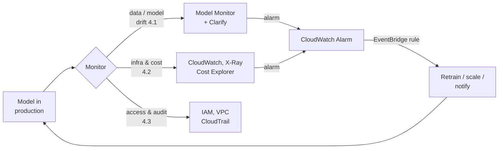
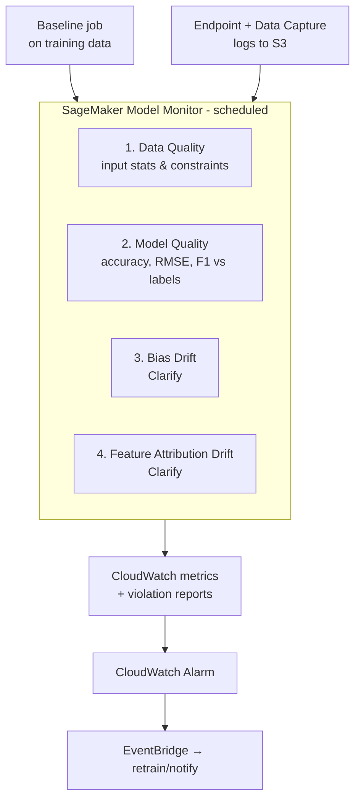
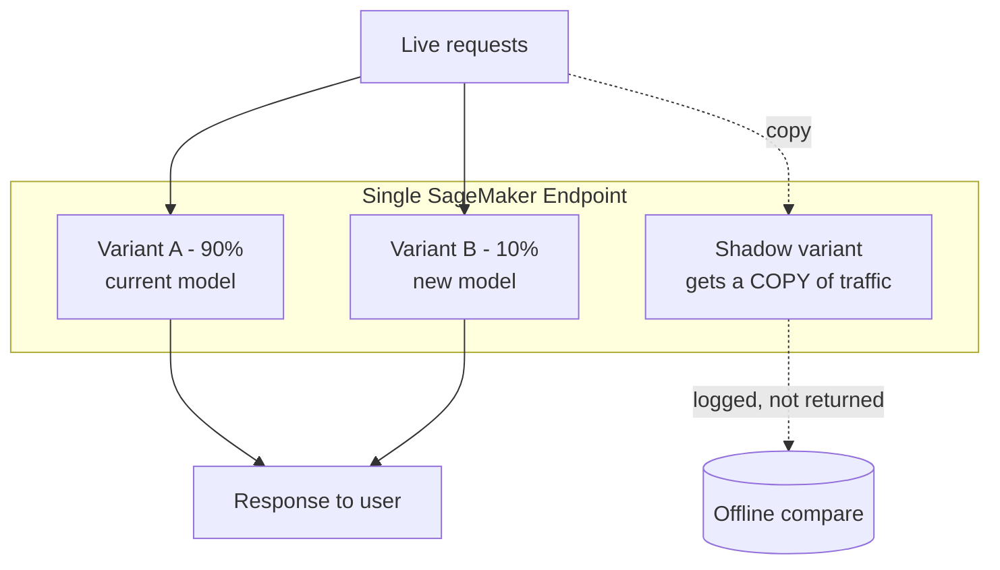
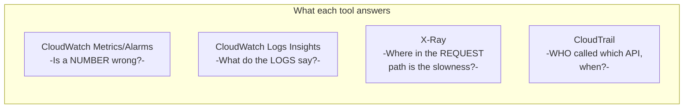
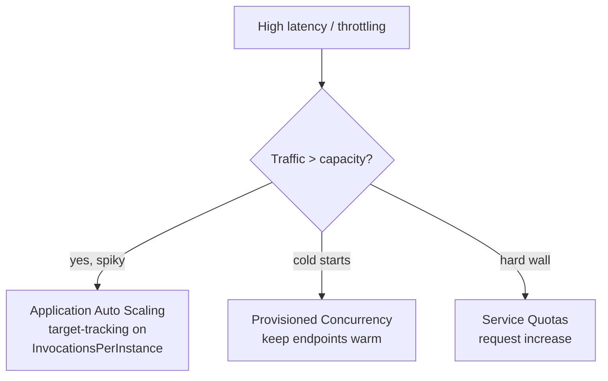
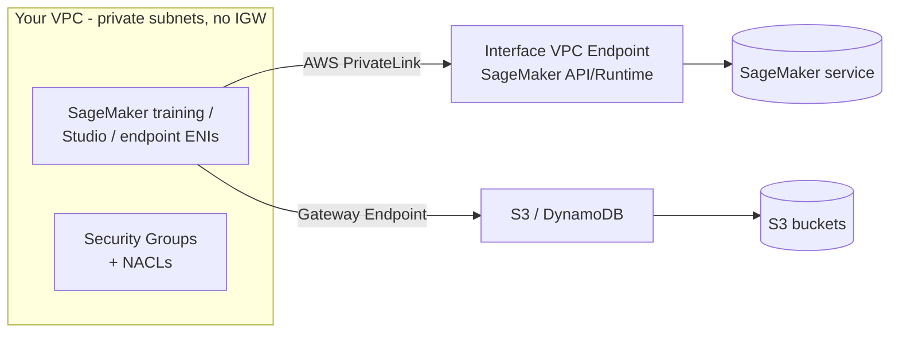

# Domain 4: ML Solution Monitoring, Maintenance, and Security

This is the **largest single domain on the MLA-C01 exam at 24%** — roughly one in every four scored questions. It covers three things you do *after* a model ships: watch it for drift and errors (4.1), watch the infrastructure and the bill (4.2), and lock the whole thing down with IAM, VPCs, and audit logging (4.3). Passing this domain is mostly about knowing **which AWS service does which job** and recognizing AWS's exact phrasing for "the model is silently getting worse."

> Sources are cited inline as `([text](url))` and collected in [References](#references). Everything below was verified against current AWS documentation.

---

## Table of Contents
- [The big picture: the day-2 operations loop](#big-picture)
- [4.1 — Monitor model inference](#41-monitor-inference)
  - [Data drift vs concept drift](#drift)
  - [SageMaker Model Monitor: the four monitor types](#model-monitor)
  - [SageMaker Clarify: bias & feature-attribution drift](#clarify)
  - [A/B testing, production variants & shadow tests](#ab-testing)
  - [The Well-Architected ML Lens (monitoring view)](#ml-lens)
- [4.2 — Monitor & optimize infrastructure and cost](#42-infra-cost)
  - [The five infrastructure metrics](#infra-metrics)
  - [Observability: CloudWatch, Logs Insights, X-Ray, CloudTrail](#observability)
  - [Instance types: general / compute / memory / inference-optimized](#instance-types)
  - [Rightsizing: Inference Recommender & Compute Optimizer](#rightsizing)
  - [Scaling & capacity troubleshooting](#scaling)
  - [Cost tools, tagging & purchasing options](#cost)
- [4.3 — Secure AWS resources](#43-security)
  - [IAM: roles, policies, least privilege & Role Manager](#iam)
  - [Network isolation: VPCs, endpoints, PrivateLink](#network)
  - [Auditing, compliance & CI/CD security](#audit)
- [Exam traps & quick-fire review](#exam-traps)
- [References](#references)

---

## The big picture: the day-2 operations loop <a name="big-picture"></a>

🧠 **Mental model.** Training a model is like *hiring an employee*. Domain 4 is everything you do **after** they start: performance reviews (Model Monitor), timesheets and expense reports (CloudWatch + Cost Explorer), and a badge that only opens the doors they need (IAM + VPC). A great hire who is never reviewed slowly drifts off-task; a model with no monitoring does exactly the same thing, silently.



**Plain English:** monitor three surfaces (model, infra, security), turn anything abnormal into a **CloudWatch alarm**, and let **EventBridge** fan that alarm out into an automated action (retrain, scale, page someone). Memorize that chain — the exam tests it constantly.

---

## 4.1 — Monitor model inference <a name="41-monitor-inference"></a>

### Data drift vs concept drift <a name="drift"></a>

🧠 **Mental model.** Imagine a model that predicts house prices.
- **Data drift (covariate / feature drift):** the *inputs* change. Your training data was suburban homes; now you're getting downtown condos. The relationship "bigger house → higher price" still holds, but the **distribution of X** shifted.
- **Concept drift:** the *rule itself* changes. A pandemic hits and suddenly "home office space" becomes far more valuable. The inputs may look the same, but **P(Y|X)** — the mapping from features to the label — has changed.

```
DATA DRIFT (inputs shift)          CONCEPT DRIFT (the rule shifts)
 P(X) changes, P(Y|X) same          P(Y|X) changes

  train ▓▓▓                          label
        ░░░  live                     ▲   train:  y = f(x)
  ──────┼──────► feature             │  ●●●●
   distribution moved right          │ ●     live: y = g(x)
                                     │●  ○○○○  (same x, new y)
                                     └──────────► feature
```

| | **Data drift** | **Concept drift** |
|---|---|---|
| What changes | Input feature distribution `P(X)` | Target relationship `P(Y│X)` |
| Example | New user demographic hits the app | Fraud tactics evolve; old signals stop meaning "fraud" |
| Detect with | **Data Quality** monitor (statistics vs baseline) | **Model Quality** monitor (accuracy vs ground-truth labels) |
| Need labels? | No — compare input stats only | **Yes** — you need true labels to see accuracy fall |

**Plain English:** data drift = "the questions changed." Concept drift = "the correct *answers* changed." You can catch data drift without knowing the truth; catching concept drift requires **ground-truth labels** so you can measure real accuracy. ([Model Monitor overview](https://docs.aws.amazon.com/sagemaker/latest/dg/model-monitor.html))

🎯 **On the exam.** "Input feature distribution shifted but you have no labels yet" → **data-quality monitoring / data drift**. "Model accuracy is dropping over time" or "the meaning of the target has changed" → **concept drift → model-quality monitoring** (which requires a ground-truth merge job).

---

### SageMaker Model Monitor: the four monitor types <a name="model-monitor"></a>

🧠 **Mental model.** Model Monitor is an **automated auditor** that runs on a schedule. First you take a photo of "normal" (a **baseline** computed from training/validation data). Then, on a cadence, it compares live captured traffic against that baseline and writes a **violations report** plus CloudWatch metrics. To capture live traffic you enable **Data Capture** on the endpoint, which logs inputs/outputs to S3.

Model Monitor supports **exactly four monitor types** ([Model Monitor docs](https://docs.aws.amazon.com/sagemaker/latest/dg/model-monitor.html)):



| # | Monitor type | Watches for | Needs ground-truth labels? | Backed by |
|---|---|---|---|---|
| 1 | **Data Quality** | Drift in input **data statistics/schema** vs baseline (missing values, type changes, distribution shift) | No | Deequ / built-in |
| 2 | **Model Quality** | Drift in **performance metrics** (accuracy, precision, recall, RMSE, AUC) vs a baseline | **Yes** — merges predictions with labels | Built-in |
| 3 | **Bias Drift** | Bias metrics in live predictions drifting from baseline | Yes (for label-based bias) | **SageMaker Clarify** |
| 4 | **Feature Attribution Drift** | Change in **feature importance ranking** (explanations) live vs training | No (uses SHAP) | **SageMaker Clarify** |

Key facts to memorize:
- **Data Capture** must be enabled on the endpoint to feed types 1, 3, 4; **Model Quality** additionally needs a **ground-truth ingestion + merge** step. ([Data quality](https://docs.aws.amazon.com/sagemaker/latest/dg/model-monitor-data-quality.html))
- Results are **exportable reports/graphs in SageMaker Studio** and **metrics in CloudWatch**; you set **CloudWatch alarms** on threshold breaches. ([Bias drift](https://docs.aws.amazon.com/sagemaker/latest/dg/clarify-model-monitor-bias-drift.html))
- Monitors run **on a schedule** (e.g., hourly) as processing jobs — not truly real-time. ([Model Monitor: real-time insights paper](https://arxiv.org/pdf/2111.13657))

🎯 **On the exam.**
- "Detect that inputs no longer match training stats, no labels available" → **Data Quality monitor**.
- "Track live accuracy / RMSE over time" → **Model Quality monitor** (remember it needs labels).
- "The reasons behind predictions changed / feature importance shifted" → **Feature Attribution Drift** (Clarify).
- "Predictions becoming unfair to a group over time" → **Bias Drift** (Clarify).

---

### SageMaker Clarify: bias & feature-attribution drift <a name="clarify"></a>

🧠 **Mental model.** If Model Monitor is the auditor, **Clarify is the auditor's fairness-and-explainability specialist**. During development Clarify computes **pre-training bias, post-training bias, and SHAP feature-attribution explanations**. In production, those same computations are wired into Model Monitor as the **bias-drift** and **feature-attribution-drift** monitors — so you keep watching fairness and explanation stability, not just raw accuracy.

- **Bias drift:** bias can be introduced/worsened when live data diverges from training data. Clarify continuously profiles predictions, and you configure **CloudWatch alerts** when bias crosses a threshold. It uses the **Normal Bootstrap Interval** method to give a confidence interval around the true live-bias value. ([Bias drift](https://docs.aws.amazon.com/sagemaker/latest/dg/clarify-model-monitor-bias-drift.html))
- **Feature-attribution drift:** detected by comparing how the **ranking of individual features** changed from training data to live data (via SHAP). A shift in the input distribution produces a corresponding shift in attributions. ([Feature attribution drift](https://docs.aws.amazon.com/sagemaker/latest/dg/clarify-model-monitor-feature-attribution-drift.html))

**Plain English:** Clarify answers two questions in production — *"Is the model becoming unfair?"* (bias drift) and *"Are the model's reasons changing?"* (feature-attribution drift). Both are packaged as Model Monitor types, so the exam may list "Clarify" and "Model Monitor" as separate answers even though they're the same pipeline.

🎯 **Trap:** Clarify is a **detection/explainability** tool, not a mitigation tool. It **does not fix bias** — it surfaces it. If a question asks to *reduce* bias, the answer is data/model changes, not "run Clarify."

---

### A/B testing, production variants & shadow tests <a name="ab-testing"></a>

🧠 **Mental model.** You have a challenger model. Three ways to try it on real traffic behind **one endpoint**:



| Approach | How traffic splits | User sees the new model's answer? | Use it to… |
|---|---|---|---|
| **Production variants (A/B)** | Weighted split across variants on one endpoint; or invoke a specific variant with `TargetVariant` | **Yes** — a share of real users are served the new model | Compare business/quality metrics of two live models |
| **Shadow variant / shadow test** | A **copy** of each request is sent to the shadow; only the production variant's response is returned | **No** — shadow responses are discarded or logged | Validate latency/error-rate of a new model, container, or instance with **zero user impact** |

Facts:
- **Production variants** let you set traffic weights and gradually shift weight to the winner, then retire the old variant. ([A/B testing with production variants](https://docs.aws.amazon.com/sagemaker/latest/dg/model-ab-testing.html))
- **Shadow testing** routes a copy of live requests to the shadow variant *within the same endpoint*; only the production variant's response reaches the caller. You compare offline. ([Shadow variants](https://docs.aws.amazon.com/sagemaker/latest/dg/model-shadow-deployment.html))
- SageMaker emits per-variant **`Invocations`, `ModelLatency`, `OverheadLatency`** etc. to CloudWatch so you can compare variants. ([Shadow tests announcement](https://aws.amazon.com/blogs/aws/new-for-amazon-sagemaker-perform-shadow-tests-to-compare-inference-performance-between-ml-model-variants/))

🎯 **If you see X pick Y.**
- "Compare a new model on **real users** and pick the winner" → **A/B test with production variants**.
- "Validate a new model/container/instance with **no impact on end users**" → **shadow variant / shadow test**.
- "Roll traffic gradually from old to new to limit blast radius" → shift **variant weights** (a canary), or use **blue/green with canary** deployment guardrails.

---

### The Well-Architected ML Lens (monitoring view) <a name="ml-lens"></a>

🧠 **Mental model.** The **ML Lens** applies the six Well-Architected pillars across the **six phases of the ML lifecycle** (business goal → problem framing → data processing → model development → deployment → **monitoring**). For Domain 4, the monitoring-relevant **design principles** are the ones the exam echoes ([ML Lens design principles](https://docs.aws.amazon.com/wellarchitected/latest/machine-learning-lens/design-principles.html)):

| Design principle | What it means for monitoring |
|---|---|
| **Enable continuous improvement** | Continuously monitor, analyze, and learn → **retrain** on refined data as it drifts |
| **Enable resiliency** | Fault tolerance + recoverability via version control, traceability, explainability |
| **Provide protection** | Security controls on data, algorithms, compute, **endpoints** |
| **Enable automation** | Pipelining, scripting, **CI/CD/CT** (continuous training) |
| **Enable reproducibility** | Version control across infra, data, models, code |
| **Optimize resources** | Trade-off analysis across compute/cost |

**Plain English:** the Lens's core monitoring message is *models decay because data evolves, so continuous monitoring + automated retraining is a design requirement, not a nice-to-have.* ([ML Lens updated 2025](https://aws.amazon.com/blogs/architecture/announcing-the-updated-aws-well-architected-machine-learning-lens))

🎯 **Trap:** the Lens is **prescriptive guidance**, not a service you deploy. Answers that say "enable the ML Lens on your account" are wrong.

---

## 4.2 — Monitor & optimize infrastructure and cost <a name="42-infra-cost"></a>

### The five infrastructure metrics <a name="infra-metrics"></a>

🧠 **Mental model.** Judge an endpoint like a restaurant kitchen:

| Metric | Plain-English question | Where you see it |
|---|---|---|
| **Utilization** | How busy are the cooks (CPU/GPU/memory)? | CloudWatch `CPUUtilization`, `GPUUtilization`, `MemoryUtilization` |
| **Throughput** | How many plates per minute? | `Invocations`, `InvocationsPerInstance` |
| **Availability** | Is the kitchen open? | `Invocation5XXErrors`, uptime, health checks |
| **Scalability** | Can it handle a rush? | Auto scaling behavior, latency under load |
| **Fault tolerance** | If a cook quits, does service continue? | Multi-AZ, multiple instances/variants |

**Plain English:** high utilization + rising **`ModelLatency`** + growing 5XX errors = you're under-provisioned. Very low utilization = you're overpaying (rightsizing candidate). ([SageMaker CloudWatch metrics](https://docs.aws.amazon.com/sagemaker/latest/dg/monitoring-cloudwatch.html))

---

### Observability: CloudWatch, Logs Insights, X-Ray, CloudTrail <a name="observability"></a>

🧠 **Mental model.** Four tools, four jobs — do not mix them up:



| Tool | Purpose | Classic exam cue |
|---|---|---|
| **CloudWatch (metrics + alarms + dashboards)** | Time-series metrics, threshold alarms, dashboards | "Alert when latency > X" / "graph invocations" |
| **CloudWatch Logs Insights** | SQL-like **queries over log groups** to filter/aggregate/visualize | "Query across logs to find error patterns" |
| **CloudWatch Lambda Insights** | Function-level **system metrics** (CPU time, memory, network) + invocations/duration/errors | "Deep performance of a **Lambda** in the inference path" |
| **AWS X-Ray** | **Distributed tracing** — follow one request across services, see segment timing | "Find *where* latency is added across API GW → Lambda → SageMaker" |
| **AWS CloudTrail** | **Governance/audit** — records API calls (who/what/when) | "Audit who invoked the endpoint / trigger retraining on an API event" |

Facts:
- The recommended split is **CloudWatch for detection + log detail, X-Ray for request-path causality and segment timing** — they complement, not replace, each other. ([Observability with CloudWatch & X-Ray](https://aws.amazon.com/blogs/mt/observability-using-native-amazon-cloudwatch-and-aws-x-ray-for-serverless-modern-applications/))
- **CloudTrail** logs management/data-plane API events; those events can **trigger EventBridge rules → retraining pipelines**. A **trail** delivers events to S3 for long-term audit. ([Automate retraining when drift detected](https://aws.amazon.com/blogs/machine-learning/automate-model-retraining-with-amazon-sagemaker-pipelines-when-drift-is-detected/))

🎯 **If you see X pick Y.** "Trace a request across microservices to find the slow hop" → **X-Ray**. "Run ad-hoc queries over log data" → **Logs Insights**. "Who called `InvokeEndpoint` and when" → **CloudTrail**. "Alarm on a metric" → **CloudWatch alarm**.

---

### Instance types: general / compute / memory / inference-optimized <a name="instance-types"></a>

🧠 **Mental model.** Pick the machine to match the bottleneck:

| Family | Optimized for | EC2 examples | ML use |
|---|---|---|---|
| **General purpose** | Balanced CPU:memory | `m5`, `m6i`, `ml.m5` | Notebooks, light preprocessing, small models |
| **Compute optimized** | High CPU per $ | `c5`, `c6i`, `ml.c5` | CPU inference, feature engineering |
| **Memory optimized** | Large RAM | `r5`, `r6i`, `ml.r5`, `x2` | Big datasets in memory, large tabular models |
| **Accelerated / GPU** | GPUs for training & heavy inference | `p4`, `p5`, `g5` | Deep learning training, LLM inference |
| **Inference optimized (Inferentia)** | AWS **Inf2** chips, lowest-cost DL inference | `ml.inf2`, `inf2` | High-throughput/low-latency GenAI inference |
| **Training optimized (Trainium)** | AWS **Trn1/Trn2** chips, cheap DL training | `trn1`, `trn2` | Large-scale model **training** |

Key numbers (for intuition, not memorization):
- **Inf2** (Inferentia2): up to 12 chips, up to 4x throughput and up to 10x lower latency vs Inf1; built for LLM/vision-transformer **inference** at lowest cost. ([EC2 Inf2](https://aws.amazon.com/ec2/instance-types/inf2/))
- **Trn1** (Trainium): up to 16 chips, up to 50% cost-to-train savings for deep-learning **training**. ([EC2 Trn1](https://aws.amazon.com/ec2/instance-types/trn1/))
- Both use the **AWS Neuron SDK** to compile PyTorch/TensorFlow models. ([Inferentia](https://aws.amazon.com/ai/machine-learning/inferentia/))

🎯 **Mnemonic:** **Inf**erentia = **Inf**erence, **Tr**ainium = **Tr**aining. "Cheapest GenAI inference on AWS silicon" → **Inf2**. "Cheapest large-model training on AWS silicon" → **Trn1/Trn2**.

---

### Rightsizing: Inference Recommender & Compute Optimizer <a name="rightsizing"></a>

🧠 **Mental model.** Two "which instance should I use?" advisors — one ML-specific, one account-wide:

| Tool | Scope | How it works | Answer cue |
|---|---|---|---|
| **SageMaker Inference Recommender** | A specific **SageMaker model/endpoint** | **Automated load tests** across instance types → recommends the config with best perf at lowest cost (instance type, count, concurrency, memory) | "Which SageMaker instance/config for *this* model?" |
| **AWS Compute Optimizer** | Account-wide resources | **ML-based analysis** of historical utilization → rightsizing recs (EC2, ASG, EBS, Lambda, **SageMaker**, etc.) | "Analyze existing resource utilization and recommend rightsizing" |

Facts:
- Inference Recommender automates **load testing and tuning** across SageMaker ML instances to hit best performance at lowest cost, and now offers **optimized GenAI inference recommendations**. ([Inference Recommender](https://docs.aws.amazon.com/sagemaker/latest/dg/inference-recommender.html))
- Compute Optimizer uses ML on utilization data; for GPU rightsizing you must **enable NVIDIA GPU utilization via the CloudWatch agent**. ([Compute Optimizer](https://aws.amazon.com/compute-optimizer/))

🎯 **Trap:** Inference Recommender **runs synthetic load tests** (proactive, pre-deployment). Compute Optimizer **reads past utilization** (reactive, post-deployment). If the scenario has **no traffic history yet**, that's **Inference Recommender**.

---

### Scaling & capacity troubleshooting <a name="scaling"></a>

🧠 **Mental model.** Latency spiking under load usually means one of three levers is wrong: **auto scaling policy, provisioned capacity, or a service quota.**



- **Real-time endpoints** scale with **Application Auto Scaling** using **target-tracking** (e.g., `SageMakerVariantInvocationsPerInstance`), step, or **scheduled** scaling. ([App Auto Scaling for SageMaker](https://docs.aws.amazon.com/autoscaling/application/userguide/services-that-can-integrate-sagemaker.html))
- **Serverless Inference** removes instance management; add **Provisioned Concurrency** to eliminate cold starts — it must be **≤ Max Concurrency** (max **200** per serverless endpoint). You can auto-scale provisioned concurrency too. ([Serverless provisioned concurrency](https://aws.amazon.com/blogs/machine-learning/announcing-provisioned-concurrency-for-amazon-sagemaker-serverless-inference/), [autoscale](https://docs.aws.amazon.com/sagemaker/latest/dg/serverless-endpoints-autoscale.html))
- Hitting a hard ceiling on instances/endpoints → raise the limit via **Service Quotas**. ([Serverless endpoints](https://docs.aws.amazon.com/sagemaker/latest/dg/serverless-endpoints.html))

🎯 **If you see X pick Y.** "Traffic is spiky and unpredictable, want zero idle cost" → **Serverless Inference**. "Serverless but cold-start latency hurts" → **Provisioned Concurrency**. "Steady real-time traffic that grows" → **real-time endpoint + Application Auto Scaling (target tracking)**. "Can't launch more of an instance type" → **Service Quotas increase**.

---

### Cost tools, tagging & purchasing options <a name="cost"></a>

🧠 **Mental model.** Four money tools, each a different lens on the bill:

| Tool | Job | Cue |
|---|---|---|
| **AWS Cost Explorer** | Visualize & forecast spend, filter by tag/service | "Analyze/forecast historical cost" |
| **AWS Budgets** | Set thresholds → alerts/actions when exceeded | "Alert when spend > $X" |
| **AWS Billing & Cost Management** | The console home for invoices, Cost Allocation Tags | "Where invoices/tags live" |
| **AWS Trusted Advisor** | Best-practice checks incl. **idle/underutilized** resources | "Recommendations to cut cost / find idle resources" |

**Cost allocation via tagging:** apply consistent **resource tags** (e.g., `Project`, `Team`, `Environment`), activate them as **Cost Allocation Tags** in Billing, then slice spend by tag in Cost Explorer. Tags also power **QuickSight** and CloudWatch dashboards for FinOps reporting.

**Purchasing options — the comparison table the exam loves:**

| Option | Discount vs On-Demand | Commitment | Best for | Interruptible? |
|---|---|---|---|---|
| **On-Demand** | 0% (baseline) | None | Spiky/unpredictable, dev/test | No |
| **Spot Instances** | up to ~90% | None (spare capacity) | **Fault-tolerant training**, batch, checkpointed jobs | **Yes — can be reclaimed** |
| **Reserved Instances (RIs)** | up to ~72% | 1 or 3 yr, specific instance/region | Steady-state EC2 workloads | No |
| **SageMaker Savings Plans** | up to **64%** | 1 or 3 yr **$ /hr commitment**, flexible across instance families | **SageMaker** compute (training, real-time inference, processing, notebooks, Data Wrangler, batch transform) | No |

Facts:
- **SageMaker Savings Plans** commit to a consistent **$/hour** and flexibly apply across eligible SageMaker usage (Studio/on-demand notebooks, Processing, Data Wrangler, Training, Real-Time Inference, Batch Transform); overage bills at On-Demand rates — up to **64% savings**. ([ML Savings Plans](https://aws.amazon.com/savingsplans/ml-pricing/))
- **Spot** = spare capacity, up to ~90% off, **can be interrupted** — use only for interruption-tolerant work like checkpointed **training**, never a production real-time endpoint. **SageMaker Managed Spot Training** handles interruptions with checkpoints.

🎯 **If you see X pick Y.**
- "Cheapest way to run **training** that can tolerate interruption" → **Spot / Managed Spot Training**.
- "Commit to save on **SageMaker** compute but stay flexible across instance types" → **SageMaker Savings Plans**.
- "Find **idle/underutilized** resources to cut cost" → **Trusted Advisor** (or Compute Optimizer for rightsizing).
- "Alert when monthly spend passes a threshold" → **AWS Budgets**.
- "See which team/project drives spend" → **Cost Allocation Tags + Cost Explorer**.

---

## 4.3 — Secure AWS resources <a name="43-security"></a>

### IAM: roles, policies, least privilege & Role Manager <a name="iam"></a>

🧠 **Mental model.** IAM is the **badge system** for AWS. Core pieces:

| Concept | What it is | ML example |
|---|---|---|
| **IAM user/group** | A human identity / a bundle of humans | Data-science team group |
| **IAM role** | An identity **assumed** by a service/app, with temporary creds | The **SageMaker execution role** the notebook/training job assumes |
| **Identity-based policy** | Permissions attached to a user/group/role | "Allow `s3:GetObject` on this bucket" |
| **Resource-based policy** | Permissions attached to the resource | **S3 bucket policy** on the model-artifact bucket |

**Least privilege** = grant only the exact actions/resources needed. Scope policies by action, resource ARN, and **conditions** (e.g., `aws:SourceVpce`, tags).

**SageMaker Role Manager** builds **persona-based IAM roles** through a console wizard — it ships **predefined personas** (e.g., data scientist, MLOps engineer) mapped to common **ML activities**, generating least-privilege policies. Activating **VPC** or **KMS** customization further **scopes the policies down**. ([Role Manager](https://docs.aws.amazon.com/sagemaker/latest/dg/role-manager.html))

**Plain English:** instead of hand-writing a giant IAM policy for "a data scientist," Role Manager gives you a vetted least-privilege starting point per persona. It's the fast path to compliant, minimal permissions.

🎯 **Trap:** the **SageMaker execution role** (assumed by jobs/endpoints) is different from the **user's role** (the human). Over-broad execution roles are a classic security-question distractor — the right answer scopes it to the specific S3 prefixes, ECR repos, and KMS keys needed.

---

### Network isolation: VPCs, endpoints, PrivateLink <a name="network"></a>

🧠 **Mental model.** By default SageMaker talks over the AWS network with internet access. To isolate ML resources, put them in **your VPC**, remove internet routes, and reach AWS services through **private endpoints** — so traffic never touches the public internet.



| Control | What it does |
|---|---|
| **VPC + private subnets** | Isolated network; disable direct internet with **Network Isolation** on jobs |
| **Interface VPC endpoint (PrivateLink)** | Private ENI to **SageMaker API / Runtime / Notebook** — no IGW/NAT/VPN needed |
| **Gateway VPC endpoint** | Private route to **S3 / DynamoDB** |
| **Security groups** | Stateful allow-rules controlling who reaches the endpoint ENIs |
| **VPC endpoint policy** | IAM resource policy limiting which APIs can be called through the endpoint |
| **NACLs / Network Firewall** | Subnet-level and deep-packet controls |

Facts:
- The **SageMaker API and Runtime** support **interface VPC endpoints powered by AWS PrivateLink**; each endpoint is an **ENI with private IPs** in your subnets, connecting without an internet gateway/NAT/VPN. ([Connect within your VPC](https://docs.aws.amazon.com/sagemaker/latest/dg/interface-vpc-endpoint.html))
- **Security groups on the endpoint** control who can reach it; **endpoint policies** govern which APIs are allowed. ([Give endpoints VPC access](https://docs.aws.amazon.com/sagemaker/latest/dg/host-vpc.html))
- For fully isolated training, use a VPC with **no internet route** so the container can't call out. ([Secure networking workshop](https://sagemaker-workshop.com/security_for_sysops/team_resources/secure_networking.html))

🎯 **If you see X pick Y.** "Keep SageMaker traffic off the public internet" → **interface VPC endpoints (PrivateLink)**. "Private S3 access from a VPC" → **gateway VPC endpoint**. "Training container must have no internet access" → **VPC with network isolation, no IGW/NAT**. "Restrict which principals reach the endpoint" → **security groups + endpoint policy**.

---

### Auditing, compliance & CI/CD security <a name="audit"></a>

🧠 **Mental model.** Security isn't one-time — you must **prove** it continuously. The audit stack:

| Need | Service |
|---|---|
| **Who did what, when** (API audit) | **AWS CloudTrail** (create a **trail** → S3) |
| **Encryption at rest** | **AWS KMS** (S3, EBS, model artifacts, notebooks) |
| **Encryption in transit** | TLS everywhere; inter-node training encryption |
| **Find sensitive data (PII)** | **Amazon Macie** on S3 |
| **Config compliance drift** | **AWS Config** rules |
| **Vulnerability scanning** | **Amazon Inspector** (e.g., container images) |
| **Centralized findings** | **AWS Security Hub** |
| **Governance docs** | **Model Cards**, Model Registry, lineage |

**CI/CD pipeline security best practices** for ML:
- Give the pipeline (CodePipeline/CodeBuild/SageMaker Pipelines) its **own least-privilege role**; don't reuse a human's credentials.
- **No hardcoded secrets** — use **Secrets Manager** / **SSM Parameter Store**; scan images with **Inspector/ECR scanning**.
- **Sign and version** model artifacts; require approval gates in the **Model Registry** before production deploy.
- **Encrypt** artifacts (KMS) and log every deployment via **CloudTrail**.

**Plain English:** least privilege applies to *machines* too. The CI/CD pipeline's role should only be able to touch the specific buckets, repos, and endpoints it manages — nothing more. ([Role Manager blog](https://aws.amazon.com/blogs/machine-learning/define-customized-permissions-in-minutes-with-amazon-sagemaker-role-manager/))

🎯 **Trap:** **CloudTrail = *audit/API history*** (who called what). **CloudWatch = *operational metrics/logs*** (how it's performing). If the question says "**audit**," "**compliance**," or "**who invoked**," pick **CloudTrail**; if it says "**metric**," "**alarm**," or "**performance**," pick **CloudWatch**.

---

## Exam traps & quick-fire review <a name="exam-traps"></a>

| If the question says… | Pick… |
|---|---|
| Inputs shifted, **no labels** available | **Data Quality monitor** (data drift) |
| Live **accuracy/RMSE falling** over time | **Model Quality monitor** (needs ground-truth labels) |
| Predictions becoming **unfair** over time | **Bias Drift** (Clarify) |
| **Feature importance / reasons** changed | **Feature Attribution Drift** (Clarify) |
| Compare new model on **real users**, pick winner | **A/B test with production variants** |
| Validate new model with **zero user impact** | **Shadow variant / shadow test** |
| Automate **retraining when drift detected** | Model Monitor → CloudWatch alarm → **EventBridge** → SageMaker Pipelines |
| Trace latency **across services** | **AWS X-Ray** |
| Query across **log data** | **CloudWatch Logs Insights** |
| **Who called an API / audit** | **AWS CloudTrail** |
| Cheapest **inference** on AWS silicon | **Inf2 (Inferentia2)** |
| Cheapest **training** on AWS silicon | **Trn1/Trn2 (Trainium)** |
| Best instance/config for **a specific model** (load-tested) | **SageMaker Inference Recommender** |
| Rightsize from **existing utilization history** | **AWS Compute Optimizer** |
| Spiky traffic, **zero idle cost** | **Serverless Inference** |
| Serverless **cold starts** hurting latency | **Provisioned Concurrency** |
| Steady growing real-time traffic | **Application Auto Scaling (target tracking)** |
| Cheapest **interruptible training** | **Spot / Managed Spot Training** |
| Flexible SageMaker compute commitment | **SageMaker Savings Plans** (up to 64%) |
| Find **idle/underused** resources | **Trusted Advisor** |
| Alert when **spend > threshold** | **AWS Budgets** |
| Track cost **by team/project** | **Cost Allocation Tags + Cost Explorer** |
| Least-privilege IAM per **ML persona** | **SageMaker Role Manager** |
| Keep SageMaker traffic **off the internet** | **Interface VPC endpoints (PrivateLink)** |
| Private **S3** access from a VPC | **Gateway VPC endpoint** |
| Restrict **who reaches an endpoint** | **Security groups + endpoint policy** |

**Ten things to over-learn:** (1) the **four** Model Monitor types and which need **labels**; (2) data drift vs concept drift; (3) Clarify = **bias + feature-attribution** drift (detect, not fix); (4) production variants (users see it) vs shadow (they don't); (5) CloudWatch vs Logs Insights vs X-Ray vs CloudTrail; (6) Inferentia=inference / Trainium=training; (7) Inference Recommender (load test) vs Compute Optimizer (history); (8) Serverless + Provisioned Concurrency + Auto Scaling + Service Quotas capacity levers; (9) purchasing options table (Spot ≤90% interruptible / RIs ≤72% / Savings Plans ≤64% flexible); (10) VPC/PrivateLink + least-privilege roles + CloudTrail auditing.

---

---

## Glossary

| Term | Simple explanation | Purpose |
|---|---|---|
| MLA-C01 | The AWS Certified Machine Learning Engineer – Associate exam code | Identifies the certification this chapter prepares you for |
| Domain 4 | The fourth scored section of MLA-C01, covering monitoring, maintenance, and security (24% of the exam) | Tests day-2 operations: watching the model, infra, cost, and access controls |
| Data drift | A shift in the statistical distribution of input features between training time and production | Detected without ground-truth labels; signals the model may be receiving unfamiliar inputs |
| Concept drift | A change in the relationship between input features and the target label over time | Requires ground-truth labels to detect; signals the model's learned rules are becoming stale |
| Covariate drift | Another name for data drift; the input distribution P(X) changes | Detected by comparing live input statistics against a training baseline |
| P(X) | Probability distribution of input features | What changes during data drift |
| P(Y|X) | Conditional probability of the target given the inputs; the model's learned mapping | What changes during concept drift |
| Ground-truth labels | The true correct answers for predictions the model has already made | Required for Model Quality monitoring and concept drift detection |
| SageMaker Model Monitor | Scheduled monitoring service that compares live endpoint traffic against a computed baseline | Detects data quality, model quality, bias, and feature-attribution drift in production |
| Baseline (Model Monitor) | A statistical profile of "normal" computed from training or validation data | The reference point against which live data is compared to detect drift |
| Data Capture | SageMaker endpoint feature that logs inference request inputs and outputs to S3 | Must be enabled to supply Model Monitor with live traffic samples |
| Data Quality monitor | Model Monitor type that checks whether live input statistics match the training baseline | Works without labels; detects feature distribution shifts and schema violations |
| Model Quality monitor | Model Monitor type that tracks live accuracy, RMSE, F1, or AUC against a baseline | Requires merging predictions with ground-truth labels to compute real performance |
| Bias Drift monitor | Model Monitor type (powered by Clarify) that checks whether prediction bias is growing over time | Monitors fairness metrics in production to catch new discriminatory patterns |
| Feature Attribution Drift monitor | Model Monitor type (powered by Clarify) that checks whether SHAP feature importance rankings have shifted | Detects when the model is relying on different features than it did during training |
| Deequ | Open-source library used internally by Model Monitor's Data Quality checks | Powers the statistical constraint validation for data quality violations |
| Violations report | Output file written by Model Monitor to S3 after each scheduled run | Lists which constraints were breached and by how much |
| CloudWatch alarm | A threshold-based alert on a CloudWatch metric | Triggers notifications or automated actions (via EventBridge) when a metric crosses a limit |
| EventBridge | AWS event bus that routes events from AWS services to targets such as Lambda or SageMaker Pipelines | Used to trigger automated retraining when a Model Monitor alarm fires |
| SageMaker Clarify | AWS tool computing pre-training bias, post-training bias, and SHAP feature-attribution explanations | Detects unfairness and explains model decisions; powers two of the four Model Monitor types |
| SHAP | SHapley Additive exPlanations; assigns each feature a contribution score to a specific prediction | Used by Clarify to explain individual predictions and track feature importance over time |
| Normal Bootstrap Interval | Statistical method Clarify uses to estimate a confidence interval around a live bias metric | Provides a range rather than a point estimate to account for sampling variation |
| Production variants | Named model versions behind a single SageMaker endpoint, each receiving a configurable traffic share | Enables A/B testing; both variants' metrics are streamed to CloudWatch for comparison |
| A/B testing | Splitting live traffic between two model variants to compare real user outcomes | Determines which model wins in production before committing full traffic |
| Shadow variant / shadow test | A second model variant that receives a copy of every live request but whose responses are discarded | Validates a new model on real traffic with zero impact on users |
| TargetVariant | Query parameter used when invoking a SageMaker endpoint to send a request to a specific named variant | Allows deterministic routing to a chosen variant during testing |
| ML Lens | AWS Well-Architected Machine Learning Lens; prescriptive guidance applying the six WA pillars to the ML lifecycle | Provides design principles for building reliable, cost-efficient, secure ML systems |
| Well-Architected pillars | The six principles (Operational Excellence, Security, Reliability, Performance, Cost, Sustainability) used to evaluate cloud architecture | Framework for evaluating and improving AWS workloads |
| Continuous Training (CT) | Automatically retraining a model when data drift or model quality degradation is detected | Keeps model accuracy current without manual intervention |
| CloudWatch Metrics | Time-series numerical measurements emitted by AWS services and custom code | Primary data source for SageMaker endpoint health, throughput, and latency monitoring |
| CloudWatch Logs Insights | SQL-like query engine for searching and aggregating CloudWatch log groups | Used to find error patterns, trace exceptions, and analyze inference logs |
| CloudWatch Lambda Insights | Extension providing function-level CPU, memory, and duration metrics for AWS Lambda | Enables deep performance analysis of Lambda functions in an ML serving pipeline |
| AWS X-Ray | Distributed request tracing service that maps latency across all services in a request path | Used to identify which hop in an API Gateway → Lambda → SageMaker chain is slow |
| Segment (X-Ray) | A timing record for one service's processing of a traced request | The unit of X-Ray tracing; combined into a trace for the full request path |
| AWS CloudTrail | Service that records every AWS API call with the caller identity, time, and parameters | Used for compliance auditing, detecting unauthorized access, and triggering pipeline automation |
| Trail (CloudTrail) | A CloudTrail configuration that delivers API event records to an S3 bucket for long-term retention | Required for regulatory audit log retention |
| CPUUtilization | CloudWatch metric showing percentage of CPU in use on an endpoint instance | Used to detect under- or over-provisioned instances |
| GPUUtilization | CloudWatch metric showing percentage of GPU in use on an endpoint instance | Indicates whether a GPU instance is being efficiently utilized |
| MemoryUtilization | CloudWatch metric showing percentage of RAM in use on an endpoint instance | Signals memory pressure that could cause latency spikes |
| ModelLatency | CloudWatch metric showing the time (in microseconds) the model container takes per prediction | Key indicator of inference performance; a rise triggers scale-out |
| Invocations | CloudWatch metric counting the total number of prediction requests to an endpoint | Measures throughput; used in target-tracking auto-scaling |
| Invocation5XXErrors | CloudWatch metric counting server-side errors from the endpoint | High values indicate model or infrastructure issues requiring immediate attention |
| Throughput | Requests processed per unit time by an endpoint | Measures the endpoint's output capacity under load |
| Availability | The fraction of time a system is operational and serving requests correctly | Measured via uptime and 5XX error rates; targeted with multi-AZ deployments |
| Scalability | The ability to handle increasing load by adding resources | Achieved through Application Auto Scaling policies on SageMaker endpoints |
| Fault tolerance | The ability to continue operating despite individual component failures | Implemented via multiple instances, multiple Availability Zones, and variant redundancy |
| SageMaker Inference Recommender | SageMaker tool that runs automated load tests across instance types to find the best cost-performance configuration | Used proactively before deployment when no utilization history exists |
| AWS Compute Optimizer | Account-wide ML-powered rightsizing service that analyzes historical utilization data | Recommends instance changes for EC2, Lambda, EBS, and SageMaker based on past usage |
| Rightsizing | Matching the instance type and size to actual workload requirements | Reduces cost on over-provisioned resources and prevents performance issues on under-provisioned ones |
| Application Auto Scaling | AWS service that adjusts the instance count of SageMaker endpoints and other resources based on policies | Keeps endpoint capacity aligned with live traffic without manual intervention |
| Target-tracking policy | Auto-scaling policy that keeps a metric at a defined target value like a thermostat | Recommended default for SageMaker endpoint scaling using InvocationsPerInstance |
| SageMakerVariantInvocationsPerInstance | CloudWatch metric measuring average invocations per minute per endpoint instance | The AWS-recommended metric for SageMaker endpoint target-tracking auto-scaling |
| SageMakerInferenceComponentConcurrentRequestsPerCopyHighResolution | High-resolution CloudWatch metric for per-copy concurrency on inference components | Used for scaling generative AI inference component deployments |
| Provisioned Concurrency | Pre-initialized capacity on a serverless endpoint kept permanently warm | Eliminates cold-start latency for latency-sensitive serverless inference use cases |
| Service Quotas | Hard AWS limits on the count of resources (instances, endpoints) in a region | Must be raised through the Service Quotas console when auto-scaling hits a ceiling |
| AWS Cost Explorer | Console and API for visualizing, filtering, and forecasting AWS spend over time | Used to identify which services, accounts, or time periods drive ML costs |
| AWS Budgets | Service for setting spend or usage thresholds and receiving alerts or taking automated actions when crossed | Prevents unexpected overspending by alerting teams before the bill arrives |
| Cost Allocation Tags | User-defined key-value metadata on AWS resources that can be activated for cost breakdown | Enables per-project, per-team, or per-environment cost attribution in Cost Explorer |
| AWS Trusted Advisor | Service that runs best-practice checks across AWS accounts and flags idle or underutilized resources | Identifies cost-saving opportunities like idle endpoints or oversized instances |
| On-Demand pricing | Pay-as-you-go pricing with no upfront commitment or long-term contract | Baseline price; maximum flexibility at highest per-hour cost |
| Spot Instances | AWS spare-capacity EC2 instances priced up to ~90% below On-Demand | Used for fault-tolerant, checkpointed training jobs; can be interrupted with two-minute notice |
| Reserved Instances (RIs) | Pre-purchased EC2 capacity for 1 or 3 years at up to ~72% savings | Best for steady-state EC2 workloads with predictable instance type and region |
| SageMaker Savings Plans | Flexible commitment to a $/hour spend on SageMaker compute for 1 or 3 years at up to 64% savings | Applies discounts across training, inference, processing, and notebooks without locking to one instance type |
| Managed Spot Training | SageMaker feature that runs training jobs on Spot instances with automatic checkpoint-based restart | Reduces training cost without requiring custom interruption handling logic |
| Checkpointing | Saving model training state to S3 at regular intervals | Allows a Spot-interrupted training job to resume from the last checkpoint |
| IAM | Identity and Access Management; AWS service for controlling who can access what | The foundation of every AWS security model |
| IAM role | An AWS identity that a service or application assumes, receiving temporary credentials | Used by SageMaker training jobs and endpoints to access S3, ECR, and KMS |
| IAM user | A permanent AWS identity for a human, with long-term credentials | Typically replaced by roles for service access to avoid credential exposure |
| IAM group | A collection of IAM users sharing a common set of policies | Simplifies permission management for teams |
| Identity-based policy | An IAM policy attached to a user, group, or role that grants allowed actions | Controls what a principal can do and on which resources |
| Resource-based policy | An IAM policy attached to an AWS resource (e.g., an S3 bucket policy) | Controls who can access a resource, independent of the caller's identity policies |
| Least privilege | Security principle of granting only the minimum permissions needed for a task | Reduces blast radius if credentials are compromised |
| SageMaker execution role | The IAM role that SageMaker training jobs, processing jobs, and endpoints assume at runtime | Must be scoped to the specific S3 prefixes, ECR repos, and KMS keys the job needs |
| SageMaker Role Manager | Console wizard that generates least-privilege IAM roles based on predefined ML personas | Provides a fast, compliant starting point instead of hand-writing IAM policies |
| ML persona (Role Manager) | A named role template (e.g., data scientist, MLOps engineer) in Role Manager | Maps common ML activities to the minimum required IAM permissions |
| Condition (IAM) | An optional element in a policy that restricts when the policy takes effect (e.g., source VPC, tags) | Tightens policies so permissions apply only in the intended context |
| VPC | Virtual Private Cloud; an isolated network within AWS with customer-defined IP ranges and routing | Used to keep ML workloads and data off the public internet |
| Private subnet | A VPC subnet with no internet gateway route | Hosts SageMaker workloads that must have no direct internet access |
| Internet Gateway (IGW) | VPC component that provides routes to and from the public internet | Absent from fully isolated VPC configurations for ML workloads |
| NAT Gateway | VPC component that allows instances in private subnets to initiate outbound internet connections | Removed from fully isolated ML environments to prevent data exfiltration |
| Network isolation | SageMaker training/processing option that disables all inbound and outbound network calls from the container | Ensures the training container cannot reach the internet or other AWS services |
| Interface VPC endpoint | A PrivateLink-powered ENI in your VPC for private access to a specific AWS service | Used to reach the SageMaker API and Runtime without traversing the public internet |
| Gateway VPC endpoint | A free VPC route-table entry for private access to S3 or DynamoDB | Used to access training data in S3 from a VPC without an internet or NAT gateway |
| AWS PrivateLink | Technology powering interface VPC endpoints; keeps traffic on the AWS backbone | Prevents API calls to SageMaker from leaving the AWS network |
| ENI | Elastic Network Interface; a virtual network card attached to an EC2 instance or VPC endpoint | The mechanism through which interface VPC endpoints appear in your subnet |
| Security group | Stateful firewall rules controlling allowed inbound and outbound traffic on ENIs | Restricts which sources can reach SageMaker endpoint ENIs |
| VPC endpoint policy | An IAM resource policy attached to a VPC endpoint limiting allowed API calls | Adds an extra layer of control beyond security groups for endpoint access |
| NACL | Network Access Control List; stateless subnet-level firewall rules | Provides an additional perimeter control around subnets hosting ML resources |
| AWS Network Firewall | Managed deep-packet-inspection firewall for VPCs | Used for advanced traffic filtering (domain allowlists, intrusion detection) in ML VPCs |
| AWS KMS | Key Management Service; creates and manages encryption keys | Used to encrypt S3 objects, EBS volumes, SageMaker model artifacts, and notebook volumes at rest |
| Encryption at rest | Protecting stored data by encrypting it with a key | Required for compliance; AWS KMS provides the keys for SageMaker resources |
| Encryption in transit | Protecting data moving between systems using TLS | Prevents eavesdropping on data flowing between SageMaker components and S3 |
| Amazon Macie | ML-powered service that discovers and classifies sensitive data in S3 | Flags PII, PHI, and other sensitive content so appropriate controls can be applied |
| AWS Config | Service that records AWS resource configuration history and evaluates compliance rules | Detects and alerts when resources drift from approved security configurations |
| Amazon Inspector | Automated vulnerability scanning service for EC2 instances and container images | Identifies known CVEs in custom SageMaker container images stored in ECR |
| AWS Security Hub | Centralized dashboard aggregating security findings from multiple AWS security services | Provides a single pane of glass for security posture across Macie, Inspector, Config, and others |
| Model Cards | SageMaker documentation artifact recording a model's purpose, performance, and limitations | Supports transparency, governance, and regulatory compliance for deployed models |
| Secrets Manager | AWS service for storing and rotating database passwords and API keys | Used in CI/CD pipelines instead of hardcoding credentials in buildspec files |
| SSM Parameter Store | AWS service for storing configuration values and secrets | Lightweight alternative to Secrets Manager for pipeline configuration and non-rotating secrets |
| ECR image scanning | ECR feature that scans container images for known OS and library vulnerabilities | Prevents deploying containers with high-severity CVEs into production ML endpoints |
| Artifact signing | Cryptographically signing model artifacts and container images to verify provenance | Ensures only approved, untampered models are promoted to production |
| Model lineage | SageMaker tracking of the data, code, and pipeline run that produced each model version | Enables reproducibility and audit trails required for regulated ML use cases |
| Compliance | Meeting regulatory or organizational requirements for data handling and system controls | Demonstrated through CloudTrail audit logs, encryption, least-privilege IAM, and Model Cards |
| PII | Personally Identifiable Information; data that can identify a specific individual | Requires protection via encryption, masking, or anonymization under privacy laws |
| PHI | Protected Health Information; health data regulated under HIPAA | Requires strict access controls, encryption, and audit logging |
| Data residency | Requirement that data must remain within a specific geographic region | Enforced by choosing the correct AWS Region and disabling cross-region replication |
| AWS Neuron SDK | Software development kit for compiling and running models on Inferentia and Trainium chips | Required to deploy PyTorch or TensorFlow models to Inf2 or Trn1 instances |
| QuickSight | AWS business intelligence service for dashboards and visualizations | Used to build FinOps dashboards from Cost Allocation Tag data exported from Cost Explorer |

---

## References <a name="references"></a>

**Model monitoring & drift (4.1)**
- SageMaker Model Monitor — data & model quality: https://docs.aws.amazon.com/sagemaker/latest/dg/model-monitor.html
- Data quality monitor: https://docs.aws.amazon.com/sagemaker/latest/dg/model-monitor-data-quality.html
- Clarify bias drift: https://docs.aws.amazon.com/sagemaker/latest/dg/clarify-model-monitor-bias-drift.html
- Clarify feature-attribution drift: https://docs.aws.amazon.com/sagemaker/latest/dg/clarify-model-monitor-feature-attribution-drift.html
- Testing with production variants (A/B): https://docs.aws.amazon.com/sagemaker/latest/dg/model-ab-testing.html
- Testing with shadow variants: https://docs.aws.amazon.com/sagemaker/latest/dg/model-shadow-deployment.html
- Shadow tests announcement: https://aws.amazon.com/blogs/aws/new-for-amazon-sagemaker-perform-shadow-tests-to-compare-inference-performance-between-ml-model-variants/
- Well-Architected ML Lens — design principles: https://docs.aws.amazon.com/wellarchitected/latest/machine-learning-lens/design-principles.html
- Updated ML Lens (2025): https://aws.amazon.com/blogs/architecture/announcing-the-updated-aws-well-architected-machine-learning-lens
- Automate retraining on drift with Pipelines + EventBridge: https://aws.amazon.com/blogs/machine-learning/automate-model-retraining-with-amazon-sagemaker-pipelines-when-drift-is-detected/

**Infrastructure & cost (4.2)**
- SageMaker CloudWatch metrics: https://docs.aws.amazon.com/sagemaker/latest/dg/monitoring-cloudwatch.html
- CloudWatch + X-Ray observability: https://aws.amazon.com/blogs/mt/observability-using-native-amazon-cloudwatch-and-aws-x-ray-for-serverless-modern-applications/
- EC2 Inf2 (Inferentia2): https://aws.amazon.com/ec2/instance-types/inf2/
- EC2 Trn1 (Trainium): https://aws.amazon.com/ec2/instance-types/trn1/
- AWS Inferentia: https://aws.amazon.com/ai/machine-learning/inferentia/
- SageMaker Inference Recommender: https://docs.aws.amazon.com/sagemaker/latest/dg/inference-recommender.html
- AWS Compute Optimizer: https://aws.amazon.com/compute-optimizer/
- Application Auto Scaling for SageMaker: https://docs.aws.amazon.com/autoscaling/application/userguide/services-that-can-integrate-sagemaker.html
- Serverless Inference: https://docs.aws.amazon.com/sagemaker/latest/dg/serverless-endpoints.html
- Provisioned Concurrency for Serverless Inference: https://aws.amazon.com/blogs/machine-learning/announcing-provisioned-concurrency-for-amazon-sagemaker-serverless-inference/
- SageMaker Savings Plans: https://aws.amazon.com/savingsplans/ml-pricing/

**Security (4.3)**
- SageMaker Role Manager: https://docs.aws.amazon.com/sagemaker/latest/dg/role-manager.html
- Role Manager blog: https://aws.amazon.com/blogs/machine-learning/define-customized-permissions-in-minutes-with-amazon-sagemaker-role-manager/
- Connect to SageMaker within your VPC (PrivateLink): https://docs.aws.amazon.com/sagemaker/latest/dg/interface-vpc-endpoint.html
- Give hosted endpoints VPC access: https://docs.aws.amazon.com/sagemaker/latest/dg/host-vpc.html
- Secure networking (SageMaker workshop): https://sagemaker-workshop.com/security_for_sysops/team_resources/secure_networking.html

**Exam guide**
- MLA-C01 exam guide: https://docs.aws.amazon.com/aws-certification/latest/examguides/machine-learning-engineer-associate-01.html
