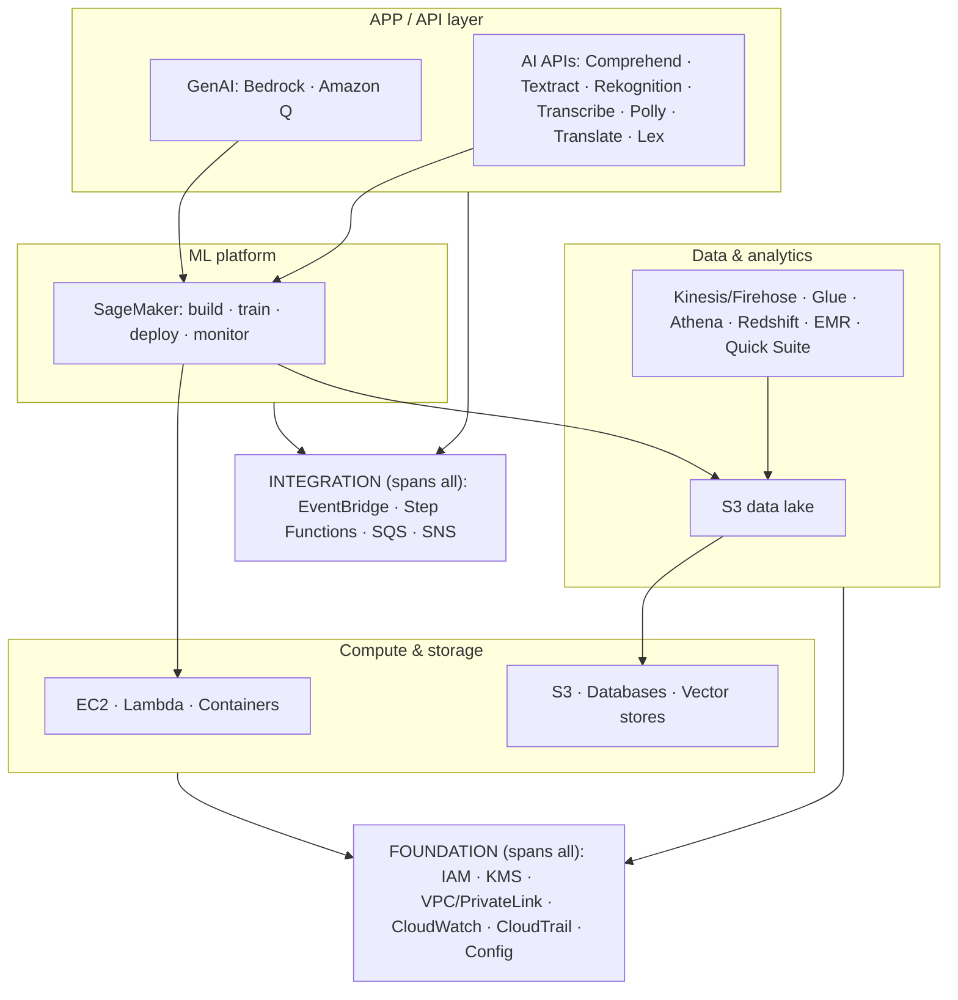
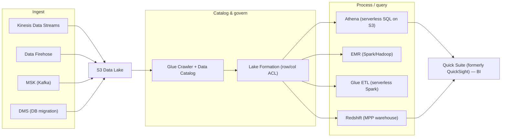
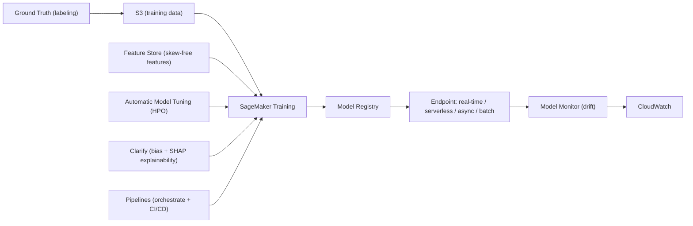
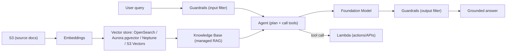

# AWS Service Map — How the Services Group & Interconnect

A single-page **mental model** for the whole AWS surface you need for the AI/ML certs (AIF‑C01, MLA‑C01, AIP‑C01) and SAA‑C03. Instead of memorizing services as a flat list, hold **two axes** in your head and the exam scenarios stop being about individual services and start being about *which service owns which stage of a flow*.

> **The one reflex:** *Almost every AWS pipeline is "**data lands in S3 → a service reads it → results go back to S3 → the next service picks up**," with **IAM** authorizing each hop, **KMS** encrypting it, and **CloudTrail** logging it. Find the stage the question is describing, and the service falls out.*

---

## 🧠 Mental model — the two axes

- **Vertical (layers):** `foundation → compute/storage → data → ML → AI/GenAI → app`. Each layer **consumes the one below it**. Nothing in an upper layer runs without identity (IAM), encryption (KMS), a network (VPC), and observability (CloudWatch/CloudTrail) from the foundation.
- **Horizontal (lifecycle):** `ingest → store → process → train → deploy → serve → monitor`. Data flows **left to right**, and each stage is a *different* service handing off to the next — usually **through S3**.

> **Why this works:** AWS services are deliberately **single‑responsibility and composable**. They connect through shared substrates — **S3** for data, **IAM** for access, **EventBridge/Lambda** for events — so you can swap one service for another at a given stage without rebuilding the rest. That composability *is* the interconnection.

---

## Layer 1 — Foundation (cross‑cutting; *everything* depends on these)

These are not "features" — they are the **substrate**. Every other service authenticates through IAM, encrypts through KMS, runs inside a VPC, and is observed by CloudWatch/CloudTrail.

| Group | Services | Why it's the base |
|---|---|---|
| **Identity & access** | IAM, IAM Identity Center, STS, Organizations | Every API call is an authorization check. **Why:** roles issue *temporary* STS credentials → a leaked credential expires on its own, shrinking blast radius. |
| **Encryption & secrets** | KMS, Secrets Manager, ACM (certs) | Keys for data‑at‑rest + credential rotation for all layers above. **Why envelope encryption:** bulk data is encrypted locally with a data key; only the small wrapped key travels to KMS → fast + one place to revoke. |
| **Network isolation** | VPC, subnets, security groups, **PrivateLink / VPC endpoints**, Route 53 | The private "room" compute/data live in. **Why endpoints:** keep Bedrock/SageMaker/S3 traffic on the AWS backbone, never the public internet. |
| **Observability & audit** | CloudWatch (metrics/logs/alarms), **CloudTrail** (API audit), Config (resource state), X‑Ray | The eyes. **Why CloudTrail ≠ CloudWatch:** CloudTrail = *who did what, when* (audit); CloudWatch = *how is it performing* (ops). Config = *was it ever non‑compliant* (state over time). |
| **Threat & compliance** | Macie (S3 PII discovery), GuardDuty (threat detection), Inspector (CVE scanning), Artifact (AWS's compliance reports), Trusted Advisor | Detect sensitive data / threats / vulnerabilities and prove compliance. **Why Macie is S3‑only:** it's built on S3 metadata + access APIs. |

---

## Layer 2 — Compute & Storage (the raw resources)

| Group | Services | Interconnect |
|---|---|---|
| **Compute** | EC2, **Lambda**, ECS / EKS / Fargate, Batch | Where code runs. Lambda is the event glue; EC2/containers host long‑running work. SageMaker training/endpoints run on EC2 under the hood. |
| **Object / file storage** | **S3** (center of gravity), EBS, EFS, FSx | **Why S3 is the hub:** data lakes, model artifacts, training data, and logs all live here — it's the shared handoff point between nearly every service. |
| **Databases** | RDS / Aurora (relational), DynamoDB (key‑value), ElastiCache (cache), OpenSearch (search), Neptune (graph), DocumentDB | App state — *and* several double as **vector stores** for RAG (Aurora pgvector, OpenSearch, Neptune Analytics, DynamoDB via S3 Vectors). |

---

## Layer 3 — Data & Analytics (the pipeline that feeds ML)

A sub‑pipeline on its own: **ingest → store → catalog/govern → process/query → serve.**

**Why they interconnect this way:** Kinesis/Firehose land data in **S3**; a **Glue crawler** infers schema into the **Data Catalog** so **Athena / Redshift Spectrum / EMR** can all query the *same files in place* — no copies. **Lake Formation** applies one permission model across every engine. That shared S3 + Catalog backbone is *why* you can swap query engines freely.

> **Two exam‑critical contrasts.** **Kinesis Data Streams vs Firehose:** Streams keeps ordered, **replayable** records (consumers can fail and re‑read from a checkpoint; retention up to 365 days, multiple consumers). Firehose is fire‑and‑forget **delivery** to S3/Redshift/OpenSearch (buffered, no replay). **Athena vs Redshift:** Athena is serverless SQL billed **per TB scanned** — columnar **Parquet** cuts a 50‑column scan to the ~4% of columns you touch, turning a $5 query into cents. Redshift is a provisioned **columnar MPP warehouse** for repeated, heavy analytics.

---

## Layer 4 — ML Platform: SageMaker (build → train → deploy → monitor)

One service spanning the whole ML lifecycle. It **pulls from** the data layer and **runs on** the compute layer.

**Why:** training reads from **S3 / Feature Store**, runs on **EC2 (Spot)** under the hood, writes artifacts back to **S3**, registers in **Model Registry**, deploys to an **endpoint**, and **Model Monitor** pipes drift metrics to **CloudWatch**. It's the data → compute → observability layers stitched into one workflow.

> **Why four endpoint types?** Latency, payload size, and traffic pattern are *orthogonal*, so there's no single "best": **real‑time** (steady low‑latency, ≤25 MB), **serverless** (spiky/idle, ≤4 MB, scale‑to‑zero), **async** (large payloads ≤1 GB / long jobs, scale‑to‑zero), **batch transform** (offline scoring of a whole dataset). **Why Feature Store:** it's the single write path for both the online (serving) and offline (training) stores, which kills **training‑serving skew** — the silent bug where training and inference compute a feature differently.
>
> ⚠️ **Availability note:** **SageMaker Model Monitor** is closed to new customers (effective 2026) — for new work, drift detection is moving to newer tooling; existing customers keep access.

---

## Layer 5 — AI Services (pre‑trained APIs — no ML expertise needed)

"AI as an API call." Send data, get predictions. Grouped by **modality** — and they **chain** because each converts one modality.

| Modality | Services | Typical chain |
|---|---|---|
| **Vision** | Rekognition (images/video), Textract (documents) | **Textract** (PDF → structured text) → **Comprehend** (analyze) |
| **Speech** | Transcribe (speech→text), Polly (text→speech) | **Transcribe → Comprehend → Translate → Polly** (a full call‑center loop) |
| **Language / text** | Comprehend (entities/sentiment/PII), Translate (NMT) | The "text brain" after extraction |
| **Conversational** | Lex (intents + slots, ASR+NLU; powers Alexa) | Lex → **Lambda** fulfillment |
| **Recommendation / search** | Personalize (recs), Kendra (enterprise search) | Personalize for recs; Kendra → **Bedrock Knowledge Bases** for new RAG |

**Why they chain:** each service does *one* modality conversion, so real pipelines **compose** them, glued by **Lambda** and staged through **S3**. Example: an inbound call becomes **Transcribe** (audio→text) → **Comprehend** (sentiment + PII redaction) → **Translate** (localize) → **Polly** (text→speech reply).

> ⚠️ **Availability notes (verified):** **Kendra** is in maintenance mode / closed to new customers (AWS points new RAG to **Bedrock Knowledge Bases**); **Rekognition Streaming Video + Bulk Image Analysis**, parts of **Comprehend** (topic modeling, event detection, prompt‑safety), and **Amazon Fraud Detector** are also closed to new customers. Existing customers keep access. Know the *concepts* — they're still testable — but note the status.

---

## Layer 6 — Generative AI (Bedrock + Amazon Q)

The newest layer. It **reaches down** into storage (S3), databases (as vector stores), and the security foundation.

**Why:** Bedrock's **Knowledge Base** embeds **S3** documents into a **vector store** (an existing database service doing double duty), **Agents** call **Lambda** as tools, **Guardrails** filters input *and* output, and the whole thing authenticates via **IAM** and stays private via **PrivateLink**. **Why a vector store at all:** RAG needs *semantic* nearest‑neighbor search over embeddings — a keyword DB can't do "find text that *means* this." **Amazon Q** is this same stack pre‑packaged as SaaS: **Q Business** (enterprise search over your connectors, permission‑aware via IAM Identity Center) and **Q Developer** (coding assistant). **AgentCore** hosts agents built with *any* framework.

---

## Layer 7 — Integration glue (how events flow between everything)

The "nervous system" that connects layers **asynchronously** so producers and consumers don't block each other.

| Service | Role | Canonical use |
|---|---|---|
| **EventBridge** | Event bus (routing on event patterns) | "New object in S3 → start a SageMaker/Glue job" |
| **Step Functions** | Visual state‑machine orchestration | Chain the AI services above into one auditable workflow with retries |
| **SQS / SNS** | Queue (point‑to‑point) / pub‑sub (fan‑out) | Decouple + buffer; SNS notifies when async video/transcription jobs finish |
| **API Gateway** | The front door | Expose any of it as a REST/HTTP API with auth + throttling |

> **Why async glue matters:** it makes pipelines **resilient and elastic** — if a downstream stage is slow or down, work waits in a queue instead of failing, and each stage scales independently.

---

## 🎯 "When the exam describes X → reach for Y"

| The scenario says… | Stage | Reach for |
|---|---|---|
| "ingest streaming clickstream, must be **replayable**, multiple consumers" | ingest | **Kinesis Data Streams** |
| "just deliver streaming data to S3/Redshift, minimal ops" | ingest | **Data Firehose** |
| "central place to store raw + processed data cheaply" | store | **S3** (data lake) |
| "run SQL over S3 files, pay per query, no cluster" | query | **Athena** |
| "repeated heavy BI over structured data, joins, dashboards" | query/serve | **Redshift** (+ **Quick Suite**) |
| "discover schema / build a data catalog / serverless ETL" | catalog | **Glue** (crawler + Data Catalog + ETL) |
| "row/column‑level access control across the lake" | govern | **Lake Formation** |
| "train a custom model on my own data" | train | **SageMaker** (Training + AMT) |
| "detect model **drift** in production" | monitor | **Model Monitor** → CloudWatch |
| "extract text/tables/forms from scanned PDFs" | AI | **Textract** |
| "sentiment / entities / **PII** in text" | AI | **Comprehend** |
| "speech → text" / "text → speech" | AI | **Transcribe** / **Polly** |
| "translate content" | AI | **Translate** |
| "chatbot / voice bot with intents" | AI | **Lex** |
| "answer questions over my **internal documents**" (new build) | GenAI | **Bedrock Knowledge Bases** (RAG) |
| "call foundation models via one API + safety controls" | GenAI | **Bedrock** (+ Guardrails) |
| "ready‑made enterprise AI assistant over my apps" | GenAI | **Amazon Q Business** |
| "who called which API, when?" | audit | **CloudTrail** |
| "is this resource compliant / how did config change?" | govern | **AWS Config** |
| "find PII sitting in my S3 buckets" | security | **Macie** |
| "keep service traffic off the public internet" | network | **PrivateLink / VPC endpoints** |
| "rotate database credentials automatically" | security | **Secrets Manager** |

---

## Five canonical end‑to‑end architectures (services in motion)

1. **Batch ML pipeline:** S3 (raw) → **Glue** ETL → **SageMaker** Training → **Model Registry** → **Batch Transform** → S3 (scored) → **Quick Suite**. *Orchestrated by* **SageMaker Pipelines / Step Functions**.
2. **Real‑time inference API:** client → **API Gateway** → **Lambda** → **SageMaker** real‑time endpoint → response; **Model Monitor** → **CloudWatch** watches drift.
3. **RAG chatbot:** docs in **S3** → **Bedrock Knowledge Base** (embeddings → **OpenSearch** vector store) → **Bedrock** model + **Guardrails** → answer; front‑ended by **Lex** or a web app via **API Gateway**.
4. **Contact‑center analytics:** call audio → **Transcribe** → **Comprehend** (sentiment + **PII** redaction) → **Translate** → insights in **S3** → **Quick Suite**; **Bedrock** summarizes transcripts.
5. **Streaming analytics:** producers → **Kinesis Data Streams** → **Managed Service for Apache Flink** (real‑time) *and* **Firehose** → **S3** → **Athena** (ad‑hoc) — with **IAM/KMS** on every hop.

---

## 📚 Glossary

| Term | Plain‑English meaning | Why it matters |
|---|---|---|
| **Data lake** | A central store (S3) holding raw + processed data in open formats | The shared handoff point between ingest, analytics, and ML |
| **Data Catalog** | Metadata (schemas, table defs) that makes S3 files queryable | Lets Athena/Redshift/EMR query the *same* data without copies |
| **Training‑serving skew** | A feature computed differently in training vs inference | The silent bug Feature Store exists to prevent |
| **Vector store** | A database that indexes embeddings for semantic nearest‑neighbor search | The retrieval half of RAG; often an existing DB (OpenSearch/Aurora) |
| **RAG** | Retrieval‑Augmented Generation — ground an LLM in your retrieved docs | Reduces hallucination; how Bedrock Knowledge Bases work |
| **Envelope encryption** | Encrypt data with a data key, then encrypt (wrap) that key with a KMS key | Fast bulk encryption + one place (KMS) to control/revoke access |
| **MPP** | Massively Parallel Processing — split a query across many nodes | Why Redshift is fast for large analytical joins/aggregations |
| **Serverless** | No servers to manage; scales to zero; pay per use | Why Athena/Lambda/Firehose fit spiky or infrequent workloads |
| **Managed vs pre‑trained** | SageMaker = you build models; AI services = call a ready model | Picks the layer: custom problem → SageMaker; common task → AI API |

## References

- AWS Architecture Center (reference architectures): https://aws.amazon.com/architecture/
- AWS Well‑Architected Framework: https://aws.amazon.com/architecture/well-architected/
- AWS Well‑Architected Machine Learning Lens: https://docs.aws.amazon.com/wellarchitected/latest/machine-learning-lens/machine-learning-lens.html
- Generative AI Lens (Well‑Architected): https://docs.aws.amazon.com/wellarchitected/latest/generative-ai-lens/generative-ai-lens.html
- Amazon S3 (data‑lake hub): https://docs.aws.amazon.com/AmazonS3/latest/userguide/Welcome.html
- AWS Glue & Lake Formation: https://docs.aws.amazon.com/lake-formation/latest/dg/what-is-lake-formation.html
- Amazon SageMaker AI Developer Guide: https://docs.aws.amazon.com/sagemaker/latest/dg/whatis.html
- Amazon Bedrock (Knowledge Bases, Agents, Guardrails): https://docs.aws.amazon.com/bedrock/latest/userguide/what-is-bedrock.html
- Kinesis vs Firehose (streaming): https://docs.aws.amazon.com/streams/latest/dev/introduction.html
- Amazon Athena (serverless SQL on S3): https://docs.aws.amazon.com/athena/latest/ug/what-is.html

---

*See the individual service deep‑dives in this folder for the "why / when / nuances" on each box in these diagrams. This page is the map; those pages are the territory.*
