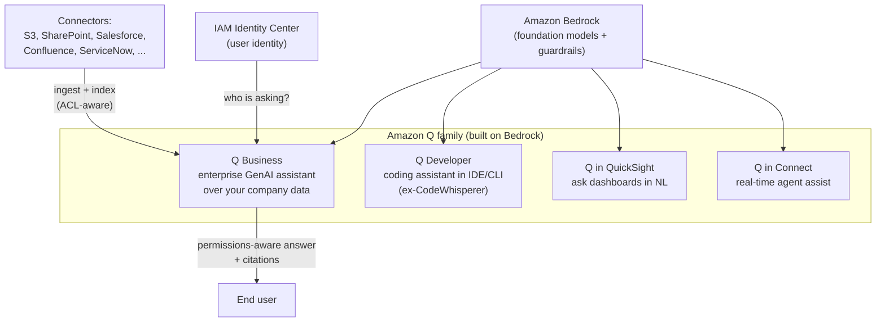

# Amazon Q

**Amazon Q** is AWS's family of managed generative-AI assistants — one specialized for *your enterprise data and workflows* (Q Business), one for *building and operating software* (Q Developer), plus embedded assistants inside other AWS services (Q in QuickSight, Q in Connect). All of it is built on **Amazon Bedrock**. ([Amazon Q](https://aws.amazon.com/q/), [Q Developer — powered by Bedrock](https://docs.aws.amazon.com/amazonq/latest/qdeveloper-ug/what-is.html))

> ⚠️ **Product-status note (verify at exam time):** AWS has announced that **Amazon Q Business will no longer be open to new customers starting July 31, 2026**, and points customers to **Amazon Quick** for similar capabilities. Existing Q Business applications continue to work. The AIF-C01/MLA-C01 exam content still refers to "Amazon Q" as the ready-made GenAI assistant, so the concepts below remain exam-relevant. ([Q Business availability change](https://docs.aws.amazon.com/amazonq/latest/qbusiness-ug/qbusiness-availability-change.html))

---

## 🧠 Mental model

Think of **Amazon Bedrock** as the *engine and raw parts* — foundation models behind an API that you assemble into an application yourself.

**Amazon Q** is the *finished car you just drive*:

- **Q Business** = a **new employee who has already read every document in your company** (SharePoint, S3, Salesforce, Confluence, wikis) — and, crucially, *only tells each person what that person is allowed to see*. It's a pre-built RAG chatbot so you don't wire up the retriever, chunking, and LLM yourself.
- **Q Developer** = a **senior AWS engineer sitting in your IDE and terminal**, answering "how do I…", writing code, scanning for vulnerabilities, and doing framework upgrades. (This is the service formerly known as **Amazon CodeWhisperer**.)
- **Q in QuickSight / Q in Connect** = the *same assistant riding shotgun inside another product* — one for BI dashboards, one for the contact-center agent's screen.

Rule of thumb: **Bedrock = you build the assistant. Amazon Q = AWS already built it for a specific job.**

---

## What it does

### Amazon Q Business — enterprise GenAI assistant
A fully managed, generative-AI assistant that answers questions, summarizes, generates content, and completes tasks **based on your enterprise data**, returning **permissions-aware responses with citations**. ([What is Q Business](https://docs.aws.amazon.com/amazonq/latest/qbusiness-ug/what-is.html))

- **Pre-built RAG out of the box** — connects to your data, ingests and indexes it, retrieves relevant passages, and generates grounded answers. You don't build the retriever/chunking pipeline yourself. ([How it works](https://docs.aws.amazon.com/amazonq/latest/qbusiness-ug/how-it-works.html))
- **Many pre-built connectors** — S3, Microsoft SharePoint, Salesforce, ServiceNow, Confluence, Google Drive, and more. Can also use **Amazon Kendra as its retriever**. ([Supported connectors](https://docs.aws.amazon.com/amazonq/latest/qbusiness-ug/supported-connectors.html))
- **Access-control-aware answers** — responses are limited to content the *asking user* is permitted to see. User identity comes from **AWS IAM Identity Center** (or IAM), and document ACLs from the source systems are honored. ([Data & application security](https://docs.aws.amazon.com/amazonq/latest/qbusiness-ug/what-is.html))
- **Plugins & actions** — connect to third-party apps to *do things* (e.g., open a Jira ticket, submit time-off), not just answer. ([Plugins](https://docs.aws.amazon.com/amazonq/latest/qbusiness-ug/plugins.html))
- **Admin controls / guardrails & hallucination mitigation** — restrict topics, choose whether answers use *only* enterprise data or also model knowledge, and auto-correct inconsistent responses. ([Guardrails](https://docs.aws.amazon.com/amazonq/latest/qbusiness-ug/guardrails-global-controls.html))
- **Delivery** — branded web experience, embeddable widget, and integrations for Slack / Microsoft Teams / Microsoft 365.

### Amazon Q Developer — coding & AWS-operations assistant
A generative-AI assistant to **understand, build, extend, and operate** software and AWS applications; the **successor to Amazon CodeWhisperer**. ([What is Q Developer](https://docs.aws.amazon.com/amazonq/latest/qdeveloper-ug/what-is.html))

- **Inline code completions & net-new code generation** in the IDE (VS Code, JetBrains, Visual Studio, Eclipse).
- **Chat about your code**, AWS architecture, best practices, and documentation — with references.
- **Agentic workflows** — feature development, code transformation/upgrades (e.g., Java version upgrades), debugging, and optimization.
- **Security scanning** — detect and help remediate vulnerabilities.
- **Everywhere you work** — IDEs, the AWS Management Console, CLI, and chat apps (Slack/Teams). Free tier uses an **AWS Builder ID** (no AWS account required); **Pro** subscription adds higher limits and admin controls. ([Q Developer pricing](https://aws.amazon.com/q/developer/pricing))

### Amazon Q in QuickSight
Ask **natural-language questions of your BI data and dashboards** and get generated narratives, executive summaries, and new visuals. ([Q in QuickSight](https://aws.amazon.com/quicksight/q/))

### Amazon Q in Connect
**Real-time assistant for contact-center agents** — recommends responses, actions, and knowledge-article links based on the live customer conversation. (Evolution of Amazon Connect Wisdom.) ([Q in Connect](https://docs.aws.amazon.com/connect/latest/adminguide/amazon-q-connect.html))

---

## When to use it (and vs alternatives)

| You want to… | Pick | Why (and not the others) |
|---|---|---|
| Ship an internal "chat with our company docs" assistant **fast**, respecting who-can-see-what | **Q Business** | Managed end-to-end RAG + connectors + ACL-aware answers. No pipeline to build. |
| Fully control the RAG pipeline, prompts, model choice, and custom UX | **Amazon Bedrock** (Knowledge Bases / Agents) | Q Business is opinionated and packaged; Bedrock is the build-it-yourself toolkit. |
| Just **search** enterprise content and get passages/answers (possibly to feed your own LLM) | **Amazon Kendra** | Kendra is the retriever/search engine; Q Business is a full assistant that *can use* Kendra. |
| Help developers write, fix, upgrade, and secure code in the IDE/CLI | **Q Developer** | Purpose-built for the software lifecycle; ex-CodeWhisperer. |
| Let business users ask questions of dashboards | **Q in QuickSight** | Embedded in BI; understands your datasets. |
| Assist live contact-center agents | **Q in Connect** | Embedded in the agent workspace with real-time recommendations. |

**Q vs raw Bedrock (the classic exam contrast):** Bedrock = *undifferentiated building blocks* (models + APIs) that you assemble; Amazon Q = a *ready-made application* for a specific job, built on Bedrock. If the scenario says "we don't want to build/manage a RAG pipeline, just connect our data and let staff ask questions" → **Q Business**. If it says "we need custom orchestration / our own app / model flexibility" → **Bedrock**.

**Q Business vs Kendra:** Kendra *finds and returns* the relevant content (a search/retrieval service). Q Business *converses and generates* grounded answers and can perform actions — and can plug Kendra in as its retriever.

---

## Pricing model

Verify current numbers in the AWS pricing pages; the **billing dimensions** are what the exam expects you to reason about.

**Amazon Q Business** — billed on two dimensions: ([Subscription & index pricing](https://docs.aws.amazon.com/amazonq/latest/qbusiness-ug/tiers.html), [Q Business pricing](https://aws.amazon.com/q/business/pricing))
- **User subscriptions** — a per-user, per-month charge by subscription tier.
- **Index capacity** — charged for the capacity used to store/serve your ingested enterprise data. Connector syncs may add ingestion-related charges.

**Amazon Q Developer** — a **Free tier** (sign in with AWS Builder ID) plus a **Pro** per-user monthly subscription that raises limits and adds administrative controls. ([Q Developer pricing](https://aws.amazon.com/q/developer/pricing))

**Q in QuickSight / Q in Connect** — priced within their host services (QuickSight capacity/reader pricing; Amazon Connect usage). ([QuickSight pricing](https://aws.amazon.com/quicksight/pricing/), [Connect pricing](https://aws.amazon.com/connect/pricing/))

Because Q is built on Bedrock, **you don't pay Bedrock per-token separately** for Q — the model usage is bundled into Q's pricing.

---

## 🎯 On the exam

**Reflexes — "if you see X, pick Y":**
- "Managed GenAI assistant over **our own enterprise data**, minimal setup" → **Amazon Q Business**.
- "**Permissions-aware** / respects document ACLs / users only see what they're allowed to" → **Q Business** with **IAM Identity Center**.
- "**AI coding assistant** / IDE completions / **CodeWhisperer**" → **Amazon Q Developer** (CodeWhisperer's successor — memorize this rename).
- "Ask **dashboards / BI data** in natural language" → **Q in QuickSight**.
- "**Contact-center / agent assist** in real time" → **Q in Connect**.
- "We want to **build our own** GenAI app / custom RAG / choose the model" → **Amazon Bedrock**, not Q.
- "We only need enterprise **search / retrieval**" → **Amazon Kendra** (which Q Business can use as a retriever).

**Traps:**
- **Q ≠ Bedrock.** Q is an application *built on* Bedrock. Don't pick Bedrock when the scenario wants a ready-made assistant with connectors and zero pipeline work.
- **Q Business ≠ Kendra.** Kendra returns search results/passages; Q Business generates conversational, cited answers and can take actions.
- **CodeWhisperer is gone by name** — it *became* Q Developer. Old material may still say CodeWhisperer.
- **Access control is a feature, not an afterthought** — the differentiator questions often hinge on "answers must respect existing permissions" → that's Q Business + Identity Center + source ACLs.
- **Grounding/citations** — Q Business confines answers to your data and cites sources, reducing hallucination; you can allow model knowledge too, but that's a deliberate setting.

---

---

## Glossary

| Term | Simple explanation | Purpose |
|---|---|---|
| Amazon Q | AWS's family of managed generative AI assistants built on Amazon Bedrock for specific jobs | Delivers ready-made AI capabilities so you don't have to build and maintain your own assistant |
| Amazon Q Business | A fully managed enterprise chat assistant that answers questions from your company's own documents and data | Provides a no-pipeline RAG chatbot that respects who can see what across your organization |
| Amazon Q Developer | An AI coding assistant embedded in IDEs and the AWS CLI that writes, explains, fixes, and secures code | The successor to CodeWhisperer; helps developers ship faster with AI-powered coding support |
| Amazon Q in QuickSight | An AI assistant inside the QuickSight BI service that lets you ask data questions in plain English | Generates visuals, narratives, and executive summaries from your BI data without SQL knowledge |
| Amazon Q in Connect | A real-time AI assistant for contact-center agents that recommends answers based on the live customer conversation | Speeds up agent resolution time and improves customer experience in the call center |
| Amazon Bedrock | The underlying AWS service that provides the foundation models powering all Amazon Q products | Amazon Q is an application layer built on top of Bedrock's model APIs |
| RAG (Retrieval-Augmented Generation) | A technique where the AI retrieves relevant documents before generating an answer, grounding the response in real data | Makes Q Business answers factually accurate and traceable to source documents |
| Pre-built RAG | A ready-made retrieval and generation pipeline that Q Business sets up for you automatically | Eliminates the need to manually build a chunking, embedding, retrieval, and generation pipeline |
| Connector | A pre-built integration that ingests and indexes content from a specific source like S3, SharePoint, or Salesforce | Lets Q Business read your enterprise data without custom ETL code |
| ACL (Access Control List) | Permissions attached to documents in source systems that control who can read them | Q Business honors these so users only receive answers from documents they are authorized to see |
| IAM Identity Center | AWS's central identity management service for federated user authentication | Tells Q Business who the asking user is so it can enforce document-level permissions |
| Permissions-aware responses | Q Business answers that are filtered to only include information the requesting user is allowed to see | Prevents employees from learning confidential information via AI that they couldn't access directly |
| Citations | References to the specific source documents that an AI answer is based on | Let users verify AI-generated answers and builds trust in the system's accuracy |
| Plugins | Q Business integrations that let it take actions in third-party apps like creating Jira tickets | Extends Q Business from a read-only assistant to one that can perform tasks across your tools |
| Guardrails | Admin controls in Q Business that restrict topics and calibrate how much the model relies on enterprise vs. general knowledge | Prevents the assistant from answering off-topic questions or hallucinating unsupported facts |
| Amazon Kendra | An AWS managed enterprise search service that indexes content and returns relevant passages | A pure retrieval engine that Q Business can use as its back-end search layer |
| CodeWhisperer | The former name of Amazon Q Developer | Renamed to Q Developer in 2024; any exam question mentioning CodeWhisperer refers to Q Developer |
| Inline code completion | An IDE feature that suggests the next line or block of code as you type | Speeds up development by predicting what you intend to write based on context |
| Security scanning | Q Developer analysis of your code for common vulnerabilities and suggested fixes | Helps teams find and remediate security issues earlier in the development process |
| Agentic workflow | An AI-driven multi-step process where the model takes a sequence of actions to accomplish a goal | Q Developer uses these for complex tasks like upgrading frameworks or refactoring entire features |
| AWS Builder ID | A free personal account for AWS that is not tied to an AWS subscription | Lets developers use Q Developer's free tier without needing a corporate AWS account |
| SPICE | QuickSight's in-memory data engine that caches data for fast dashboard queries | Enables QuickSight to serve interactive dashboards to many users at high speed |
| Natural language Q&A | Asking questions in plain English and getting answers, rather than writing SQL or building charts | Makes data exploration accessible to non-technical business users |
| User subscription | The per-user monthly fee that Q Business charges for access | The primary billing dimension for Q Business; usage is bundled rather than billed per API token |
| Index capacity | The storage and compute Q Business uses to hold and search your ingested enterprise data | The second billing dimension for Q Business; scales with the amount of content you index |
| Per-token pricing | Billing based on the number of input and output words processed by the model | How Bedrock charges for raw model usage; Q pricing bundles this rather than exposing it directly |

## References

- Amazon Q — product overview: https://aws.amazon.com/q/
- What is Amazon Q Business: https://docs.aws.amazon.com/amazonq/latest/qbusiness-ug/what-is.html
- Q Business — how it works (RAG): https://docs.aws.amazon.com/amazonq/latest/qbusiness-ug/how-it-works.html
- Q Business — supported connectors: https://docs.aws.amazon.com/amazonq/latest/qbusiness-ug/supported-connectors.html
- Q Business — guardrails & controls: https://docs.aws.amazon.com/amazonq/latest/qbusiness-ug/guardrails-global-controls.html
- Q Business — plugins: https://docs.aws.amazon.com/amazonq/latest/qbusiness-ug/plugins.html
- Q Business — availability change (July 2026): https://docs.aws.amazon.com/amazonq/latest/qbusiness-ug/qbusiness-availability-change.html
- What is Amazon Q Developer: https://docs.aws.amazon.com/amazonq/latest/qdeveloper-ug/what-is.html
- Q Developer pricing (Free / Pro): https://aws.amazon.com/q/developer/pricing
- Amazon Q in QuickSight: https://aws.amazon.com/quicksight/q/
- Amazon Q in Connect: https://docs.aws.amazon.com/connect/latest/adminguide/amazon-q-connect.html
- Amazon Bedrock (what Q is built on): https://docs.aws.amazon.com/bedrock/latest/userguide/what-is-service.html
