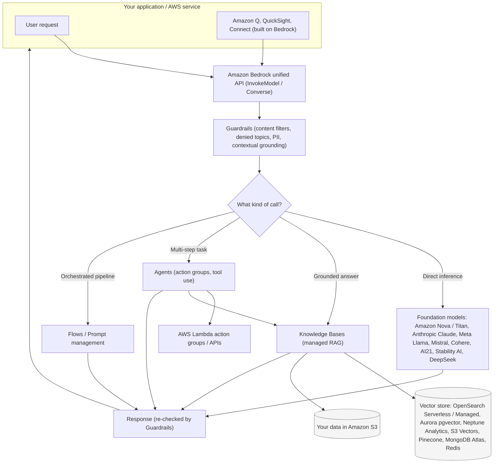

# Amazon Bedrock

Amazon Bedrock is a fully managed, serverless service that gives you a single API to access high-performing foundation models (FMs) from Amazon and leading AI companies, plus the building blocks (RAG, agents, guardrails, customization, evaluation) to build generative AI applications without managing any infrastructure.

## 🧠 Mental model

Think of Bedrock as a **universal API socket for foundation models** — like a USB-C port for GenAI.

Instead of signing separate contracts, learning separate SDKs, and provisioning separate GPU clusters for Anthropic, Meta, Mistral, Cohere, and Amazon's own models, you plug into **one AWS API** and swap the model behind it by changing a single `modelId` string. AWS handles the servers, scaling, patching, and security; you never see a GPU.

And because it lives inside AWS, that same socket also plugs into the rest of your stack: your data stays in your account, traffic can stay on the AWS private network (PrivateLink/VPC), and IAM controls who can call what. **Your prompts and data are never used to train the base models**, and are not shared with the model providers.

Bedrock is also the **engine underneath other AWS GenAI products** — Amazon Q Business, Amazon Q Developer, and generative AI features in services like QuickSight and Connect all call foundation models through Bedrock under the hood.

## Architecture / flow

## What it does

Key capabilities:

- **Single unified API for many models.** One consistent API surface — including the `Converse` API for a standardized message format and the `InvokeModel` API — lets you call and swap models from multiple providers without rewriting integration code.
- **Broad foundation model catalog** (see below) spanning text, chat, embeddings, image, and video generation.
- **Amazon Bedrock Knowledge Bases** — fully managed Retrieval Augmented Generation (RAG): point it at your data in S3, it handles chunking, embedding, storing vectors, retrieval, and citation-backed responses.
- **Amazon Bedrock Agents** — break a user goal into steps, call your APIs/Lambda functions via **action groups**, query Knowledge Bases, and reason across multiple turns to complete tasks (tool use / function calling, managed for you).
- **Amazon Bedrock Guardrails** — configurable safety and responsible-AI controls applied independently of the model.
- **Model customization** — fine-tuning (labeled data) and continued pre-training (unlabeled data) to adapt models to your domain; the base model stays private and a private copy is customized for you.
- **Model evaluation** — automatic and human-based evaluation, plus **LLM-as-a-judge**, to compare models on your own data before you commit.
- **Bedrock Flows** — a visual, drag-and-drop way to chain prompts, models, Knowledge Bases, Agents, and Lambda into an orchestrated generative-AI workflow. **Prompt Management** stores, versions, and tests reusable prompts.
- **Serverless & fully managed** — no infrastructure to provision, automatic scaling, pay for what you use.
- **Enterprise controls** — IAM, VPC/PrivateLink for private connectivity, CloudWatch/CloudTrail integration, encryption with KMS, and data isolation.

### Foundation models available (current catalog)

Bedrock offers a large and growing catalog (100+ models across 15+ providers). Core families you should know for the exam:

| Provider | Representative models | Typical use |
|---|---|---|
| **Amazon** | **Nova** (Micro, Lite, Pro, Premier — text/multimodal; Canvas for images, Reel for video) and the older **Titan** family (text, embeddings, image) | AWS-native, cost-effective, multimodal, embeddings |
| **Anthropic** | **Claude** (Opus, Sonnet, Haiku tiers) | Strong reasoning, long context, agentic/tool use |
| **Meta** | **Llama** (Llama 3.x, Llama 4 Scout/Maverick) | Open-weight, customizable, multimodal |
| **Mistral AI** | **Mistral** Large / Small, and others | Efficient European models |
| **Cohere** | **Command** (text) and **Embed** (embeddings), Rerank | Enterprise text + retrieval/embeddings |
| **AI21 Labs** | **Jamba / Jurassic** | Long-context text generation |
| **Stability AI** | **Stable Diffusion / Stable Image** | Image generation |
| **DeepSeek** and others | DeepSeek-R1 etc. | Reasoning models (catalog expands frequently) |

> The exam does **not** require memorizing every model or version. Know the **providers**, that **Amazon Nova/Titan are AWS's own FMs**, and that the catalog is chosen via a single `modelId`. Also note the **Amazon Bedrock Marketplace**, which extends the catalog with 100+ specialized/emerging models you can deploy to managed endpoints.

### Vector stores for Knowledge Bases

Knowledge Bases can create/manage vectors for you, or connect to an existing store. Supported options include: **Amazon OpenSearch Serverless** (default managed option), **Amazon OpenSearch Managed Cluster**, **Amazon Aurora PostgreSQL (pgvector)**, **Amazon Neptune Analytics** (GraphRAG), **Amazon S3 Vectors**, **Pinecone**, **MongoDB Atlas**, and **Redis Enterprise Cloud**.

## When to use it (and when not to)

| Dimension | **Amazon Bedrock** | **SageMaker JumpStart / SageMaker AI** | **Amazon Q** | **Self-hosting (EC2/EKS + your own models)** |
|---|---|---|---|---|
| What it is | Serverless API to managed FMs + GenAI building blocks | ML platform to deploy/train/host models (incl. open FMs) on endpoints you control | Ready-to-use GenAI assistant (Q Business for enterprise data, Q Developer for coding) | You run the models yourself on raw compute |
| Infra to manage | **None** (serverless) | You choose/manage instances & endpoints | None (fully managed app) | **All of it** (GPUs, scaling, patching) |
| Best when | You want to build a custom GenAI app fast, mix models, add RAG/agents/guardrails | You need deep control, custom training, MLOps, or to host a model not in Bedrock | You want an out-of-the-box assistant, not to build one | You need full control, an unsupported model, or on-prem/edge |
| Customization | Fine-tune / continued pre-training (managed) | Full training, fine-tuning, custom containers | Minimal (configure data sources/plugins) | Unlimited |
| Pricing shape | Per-token / per-image / per-second, or provisioned throughput | Per instance-hour (endpoints) + training | Per-user subscription | Per compute-hour you provision |
| Pick it if you see... | "serverless", "unified API to multiple FMs", "managed RAG/agents/guardrails" | "custom training", "host my own model", "MLOps", "full control of endpoint" | "ready-made assistant over my business data / IDE coding helper" | "must run a specific model / on-prem / air-gapped" |

Rule of thumb: **Build a GenAI app → Bedrock. Do heavy custom ML / own the endpoint → SageMaker. Just want a finished assistant → Amazon Q. Need total control → self-host.**

## Pricing model

Bedrock is consumption-based. Don't memorize dollar figures (they change and vary by model/region) — know the **pricing dimensions** and when each applies:

- **On-Demand** — pay-as-you-go with no commitment. Billed per **input token** and **output token** (text/chat), per **image** (image models), or per **second** (video). Most flexible; ideal for spiky or exploratory workloads.
- **Batch inference** — submit large jobs asynchronously; results land in S3. Roughly **~50% cheaper** than on-demand. Use for non-latency-sensitive bulk processing (embeddings, classification, offline generation).
- **Prompt caching** — cache repeated prompt prefixes (e.g., long system prompts/context) to cut cost and latency dramatically on repeated inputs.
- **Provisioned Throughput** — reserve dedicated model capacity in **model units**, billed **hourly** with **1-month or 6-month commitments** (discounted vs on-demand for steady, high-volume traffic, and gives guaranteed throughput). **Required to run custom (fine-tuned or imported) models**, since they can't live in the shared on-demand pool.
- **Model customization** — you pay for **training** (fine-tuning / continued pre-training compute), plus **storage** of the custom model, plus **inference** (which needs Provisioned Throughput).
- **Add-on features** — Knowledge Bases (you also pay for the underlying vector store, e.g., OpenSearch), Guardrails, and model evaluation have their own usage-based charges layered on top of model inference.

Intuition: **On-demand = pay per sip. Batch = bulk discount for patient jobs. Provisioned = rent a dedicated tap for steady heavy flow (and mandatory for custom models). Customization = pay to build + park + serve your own tuned model.**

## 🎯 On the exam

Reflexes — **if you see X, pick Bedrock (or the noted feature)**:

- **"Access multiple foundation models through a single/unified API" / "serverless GenAI" / "no infrastructure to manage"** → **Amazon Bedrock**.
- **"Add my company's documents so the model answers from them, with citations" / "managed RAG"** → **Bedrock Knowledge Bases** (not custom-built RAG).
- **"Model should call APIs / take multi-step actions / use tools to complete a task"** → **Bedrock Agents** (action groups).
- **"Block harmful content / deny certain topics / redact PII / reduce hallucinations in RAG"** → **Bedrock Guardrails**. Content filters cover Hate, Insults, Sexual, Violence, Misconduct, and **Prompt Attack**; plus **denied topics**, **word filters**, **sensitive information (PII) filters**, **contextual grounding** (hallucination check for RAG), and **Automated Reasoning checks** (math-based factual verification). Guardrails work **across models** and can be reused.
- **"Adapt a model to my domain with labeled data"** → **fine-tuning**; **"with large unlabeled domain corpus"** → **continued pre-training**. Both keep your data private and produce a private custom model.
- **"Choose the best model for my use case / compare models on my data"** → **Bedrock model evaluation** (automatic, human, or **LLM-as-a-judge**).
- **"Visually chain prompts, models, KBs, and Lambda into a workflow"** → **Bedrock Flows**; **"store/version/test reusable prompts"** → **Prompt Management**.
- **"Guaranteed throughput / steady high volume / run a custom model"** → **Provisioned Throughput**. **"Cheap bulk, latency-tolerant"** → **Batch**. **"Flexible pay-per-use"** → **On-Demand**.
- **"Keep data private / not used to train the base model"** → true of Bedrock by default; add **VPC endpoints / AWS PrivateLink** for private network connectivity so traffic doesn't traverse the public internet.
- **Amazon's own models** on Bedrock = **Amazon Nova** (newer, multimodal, incl. Canvas/Reel) and **Amazon Titan** (embeddings, text, image).
- **Amazon Q is built on Bedrock.** If the question is "ready-made assistant over my enterprise data or in my IDE," pick **Amazon Q**, not Bedrock.
- **PartyRock** = a fun, no-code **playground app** (built on Bedrock) for experimenting with generative AI and building shareable apps without writing code or needing an AWS account for the app itself. Know it as the learning/experimentation surface.
- **Bedrock vs SageMaker**: Bedrock = serverless FM API + GenAI building blocks; SageMaker = full ML platform where you train/host and control endpoints. "Full control / custom training / host unsupported model" → SageMaker (JumpStart to quickly deploy open FMs).
- Bedrock is **regional** and supports **IAM**, **KMS encryption**, **CloudWatch/CloudTrail**, and **cross-region inference** for higher availability/throughput.

## References

- Amazon Bedrock — product page: https://aws.amazon.com/bedrock/
- Supported foundation models in Amazon Bedrock: https://docs.aws.amazon.com/bedrock/latest/userguide/models-supported.html
- Models at a glance (model catalog): https://docs.aws.amazon.com/bedrock/latest/userguide/model-cards.html
- Amazon Bedrock Knowledge Bases: https://docs.aws.amazon.com/bedrock/latest/userguide/knowledge-base.html
- Vector store prerequisites for Knowledge Bases: https://docs.aws.amazon.com/bedrock/latest/userguide/knowledge-base-setup.html
- Amazon Bedrock Agents: https://docs.aws.amazon.com/bedrock/latest/userguide/agents.html
- Amazon Bedrock Guardrails: https://docs.aws.amazon.com/bedrock/latest/userguide/guardrails.html
- Guardrails components (content filters, denied topics, PII, contextual grounding): https://docs.aws.amazon.com/bedrock/latest/userguide/guardrails-components.html
- Model customization: https://docs.aws.amazon.com/bedrock/latest/userguide/custom-models.html
- Model evaluation: https://docs.aws.amazon.com/bedrock/latest/userguide/evaluation.html
- Bedrock Flows / Prompt management: https://docs.aws.amazon.com/bedrock/latest/userguide/flows.html
- Provisioned Throughput: https://docs.aws.amazon.com/bedrock/latest/userguide/prov-throughput.html
- Amazon Bedrock pricing: https://aws.amazon.com/bedrock/pricing/
- Data protection in Amazon Bedrock: https://docs.aws.amazon.com/bedrock/latest/userguide/data-protection.html
- Use AWS PrivateLink with Amazon Bedrock: https://docs.aws.amazon.com/bedrock/latest/userguide/usingVPC.html
- PartyRock: https://partyrock.aws/
- Amazon Q: https://aws.amazon.com/q/
