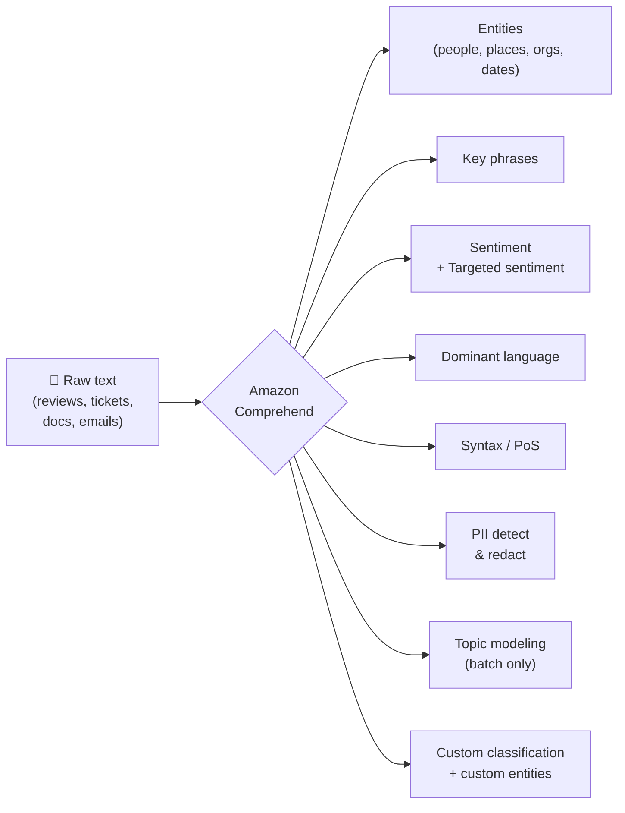

# Amazon Comprehend

**Amazon Comprehend** is a fully managed natural-language-processing (NLP) service that uses machine learning to find insights and relationships in **unstructured text** — entities, key phrases, sentiment, language, syntax, PII, and custom labels — without you training or hosting any models.

---

## 🧠 Mental model

Think of Comprehend as a **highlighter pen that reads for you**. You hand it a wall of raw text (support tickets, reviews, contracts, emails) and it automatically highlights *who/what is mentioned* (entities), *what it's about* (key phrases / topics), *how the writer feels* (sentiment), *what language it is*, and *where the sensitive personal data hides* (PII) — then hands the highlights back as clean JSON you can act on.

You don't teach it grammar or feelings. AWS already trained the models; you just call an API. When the built-in categories aren't enough, you give it a few thousand labeled examples and it trains a **custom** highlighter for *your* domain (e.g., "which of these are insurance claim numbers?").

**Input → output at a glance:**

| You send | Comprehend returns |
|---|---|
| "The staff at AnyCompany in Seattle were amazing!" | Entities: `AnyCompany`(ORG), `Seattle`(LOCATION); Sentiment: `POSITIVE`; Language: `en` |
| A review: "The tacos were great but the wait was terrible." | **Targeted** sentiment: `tacos`→POSITIVE, `wait`→NEGATIVE |
| "Call me at 555-0100, SSN 123-45-6789" | PII entities `PHONE`, `SSN` with offsets → redacted copy: "Call me at \*\*\*, SSN \*\*\*" |
| 10,000 support emails | Custom classification label per email (e.g., `billing` / `bug` / `feature-request`) |

---

## What it does

**Built-in (pre-trained) APIs — no training required:**

- **Entity recognition** — detects named entities: `PERSON`, `LOCATION`, `ORGANIZATION`, `COMMERCIAL_ITEM`, `EVENT`, `DATE`, `QUANTITY`, `TITLE`, `OTHER`.
- **Key phrase extraction** — pulls out the main noun phrases ("what the text is about").
- **Sentiment analysis** — one dominant sentiment per document: `POSITIVE`, `NEGATIVE`, `NEUTRAL`, or `MIXED`, each with a confidence score.
- **Targeted sentiment** — sentiment *per entity* within the text (e.g., positive about "tacos", negative about "service"), including co-reference groups. English only.
- **Language detection** — identifies the dominant language (100+ languages) and confidence; great as a pre-step before Translate.
- **Syntax analysis** — part-of-speech tagging (noun, verb, adjective…) for each token.
- **PII detection & redaction** — `ContainsPiiEntities` (does this doc contain PII?), `DetectPiiEntities` (where + what type), and redaction jobs that produce a masked copy. Covers names, SSNs, credit cards, addresses, bank/routing numbers, emails, etc.
- **Toxicity detection & prompt-safety classification** — flag harmful content and unsafe LLM prompts (used in responsible-AI / GenAI guardrail scenarios).

**Batch-only (asynchronous) analysis:**

- **Topic modeling** — unsupervised; groups a corpus of documents into topics by common word groups (based on LDA). **No labeling needed**, runs only as an async job over S3.

**Custom (you supply labeled data, Comprehend trains + hosts the model):**

- **Custom classification** — train on your own labels/document types (e.g., route tickets, tag documents). Multi-class or multi-label.
- **Custom entity recognition (CER)** — teach it to find domain-specific entities the built-in model doesn't know (policy numbers, part IDs, gene names).
- Comprehend can **auto-extract text from PDF, image, and Word inputs** before running custom classification / CER (built-in OCR-style handling).

**Comprehend Medical** — a *separate*, HIPAA-eligible service for **clinical text**:

- `DetectEntitiesV2` — medical conditions, medications, dosages, anatomy, tests, treatments, procedures.
- `DetectPHI` — protected health information (a medical-specific PII).
- **Ontology linking** — `InferICD10CM` (diagnoses), `InferRxNorm` (medications/RxCUI), `InferSNOMEDCT` (medical concepts) map extracted terms to standard medical codes.
- Real-time and async batch modes.

**Delivery modes:** most APIs offer **real-time (synchronous, single doc)** and **batch/async (over S3)**. Topic modeling is async-only.

---

## When to use it (and vs alternatives)

| Scenario | Use | Why |
|---|---|---|
| Extract entities / sentiment / PII / key phrases from text | **Amazon Comprehend** | Purpose-built, pre-trained, single API call, cheap |
| Classify or tag docs with *your own* labels | **Comprehend custom classification** | Train with labeled examples; managed hosting |
| Find domain-specific entities (part #s, claim IDs) | **Comprehend custom entity recognition** | Managed training for entities not in the built-in set |
| PHI / medical entities / ICD-10 / RxNorm codes | **Comprehend Medical** | HIPAA-eligible, medical ontologies |
| Group an unlabeled corpus into themes | **Comprehend topic modeling** | Unsupervised, no labels needed |
| You need full control over the model / novel NLP task | **SageMaker (build your own)** | Custom architecture, but you train, tune, host, MLOps |
| Free-form generation, summarization, Q&A, translation, reasoning over text | **Amazon Bedrock (LLM)** | Generative; Comprehend is *analysis/extraction*, not generation |
| Extract text from scanned docs/forms first | **Amazon Textract** → then Comprehend | Textract = OCR/document layout; Comprehend = NLP on the text |

**Comprehend vs building your own NLP:** Comprehend is managed and pay-per-use with no ML expertise required. Build-your-own (SageMaker) only wins when you need a task Comprehend can't do, or full model control — at the cost of labeling, training, tuning, and hosting.

**Comprehend vs Bedrock/LLM:** Comprehend is *deterministic, structured extraction/classification* returning JSON with confidence scores and character offsets — ideal for pipelines, redaction, and analytics at low cost. An LLM (Bedrock) can also extract entities/sentiment via a prompt and is more flexible, but is pricier, less structured, and can hallucinate. On the exam, **extract structured NLP signals from text → Comprehend**, not an LLM.

---

## Pricing model

Pay-per-use, no minimums. The pricing **unit for built-in NLP APIs is 100 characters**, with a **3-unit (300-character) minimum charge per request**. Representative US pricing:

| Dimension | Unit | Price (approx.) |
|---|---|---|
| Entity recognition, Sentiment, Language detection, Syntax, **Targeted sentiment** | per unit (100 chars) | ~$0.0001 |
| **Contains PII** | per unit | ~$0.000002 (much cheaper — just a yes/no) |
| **Detect PII / redaction** | per unit | ~$0.0001 |
| Toxicity / prompt-safety | per unit (tiered) | ~$0.0001, dropping with volume |
| Event detection | per unit | ~$0.003 |
| **Custom — training** | per hour | ~$3/hour |
| **Custom — model management** | per model/month | ~$0.50 |
| **Custom — async inference** | per unit | ~$0.0005 |
| **Custom — real-time endpoint** | per second per Inference Unit (1 IU = 100 chars/s) | ~$0.0005, **60-second minimum**, billed while endpoint is up |
| Topic modeling | first 100 MB flat, then per MB | ~$0.004/MB above 100 MB |

**Free tier:** ~50K units/month (5M characters) across eligible built-in APIs for 12 months. **Custom Comprehend is excluded** from the free tier.

> 💡 Exam-relevant cost trap: a **custom real-time endpoint bills continuously** (per Inference Unit-second) while it exists — delete/scale it down when idle. For sporadic bulk work, use **async batch** instead of a live endpoint. Comprehend Medical is billed separately (per 100-char unit). *Always confirm current numbers on the pricing page.*

---

## 🎯 On the exam

**Reflexes — "if you see X, pick Comprehend":**

- "Extract **entities / key phrases / sentiment / PII** from text" → **Comprehend**.
- "Detect the **language** of incoming text before translating" → **Comprehend** (language detection) → then **Translate**.
- "**Redact** SSNs / credit cards / personal data from documents" → **Comprehend PII detection & redaction**.
- "Sentiment **for each product/feature** mentioned in a review" → **Comprehend targeted sentiment** (not plain sentiment).
- "Route/tag documents using **our own categories**" → **Comprehend custom classification**.
- "Find **our domain-specific** entities (policy #, part ID)" → **Comprehend custom entity recognition**.
- "Group **unlabeled** documents into themes / topics" → **Comprehend topic modeling** (unsupervised, batch-only).
- "Extract **medical conditions, medications, PHI, ICD-10 / RxNorm** codes" → **Comprehend Medical** (HIPAA-eligible).

**Traps & distractors:**

- **Comprehend vs Textract:** Textract does **OCR** (get text/tables/forms *out of* scanned docs); Comprehend does **NLP** *on* text. Scanned PDF → Textract first, then Comprehend. (For custom classification/CER, Comprehend can now auto-extract text from PDF/image/Word itself.)
- **Sentiment vs Targeted sentiment:** plain sentiment = one label for the *whole* document; targeted = per-entity. "Which dish did customers like/dislike?" ⇒ *targeted*.
- **Topic modeling ≠ classification.** Topic modeling is **unsupervised** (no labels, discovers themes). Custom classification is **supervised** (your labels). Async-only is a giveaway for topic modeling.
- **Comprehend Medical is a separate service** — pick it (not plain Comprehend) whenever PHI / clinical text / medical ontologies appear. It's HIPAA-eligible.
- **Don't reach for an LLM/Bedrock** when the ask is structured extraction/classification/redaction at scale — Comprehend is cheaper, structured, and returns offsets + confidence.
- **Real-time vs batch:** single doc / low latency → sync API; large volumes in S3 → async batch job.
- **Custom endpoints cost money while running** — a cost-optimization answer is "delete the endpoint / use batch."

---

## References

- Amazon Comprehend — product page: https://aws.amazon.com/comprehend/
- Amazon Comprehend Developer Guide: https://docs.aws.amazon.com/comprehend/latest/dg/what-is.html
- Targeted sentiment: https://docs.aws.amazon.com/comprehend/latest/dg/how-targeted-sentiment.html
- PII detection & redaction: https://docs.aws.amazon.com/comprehend/latest/dg/pii.html
- Custom classification: https://docs.aws.amazon.com/comprehend/latest/dg/how-document-classification.html
- Custom entity recognition: https://docs.aws.amazon.com/comprehend/latest/dg/custom-entity-recognition.html
- Topic modeling: https://docs.aws.amazon.com/comprehend/latest/dg/topic-modeling.html
- Amazon Comprehend Medical — product page: https://aws.amazon.com/comprehend/medical/
- Comprehend Medical Developer Guide (how it works): https://docs.aws.amazon.com/comprehend-medical/latest/dev/comprehendmedical-howitworks.html
- Amazon Comprehend pricing: https://aws.amazon.com/comprehend/pricing/
