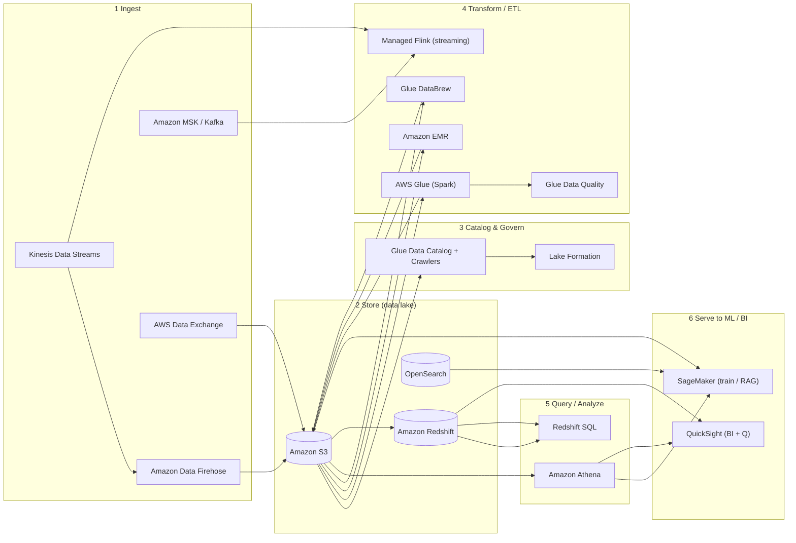
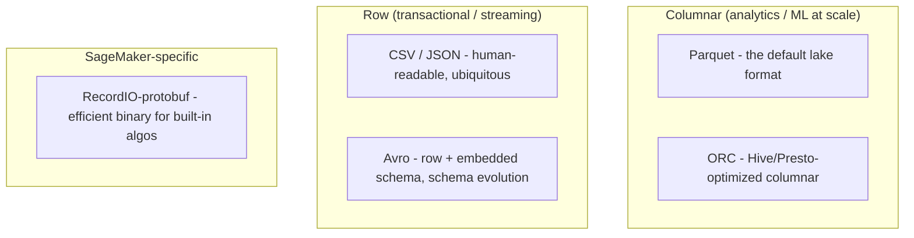

# AWS Data & Analytics Services for ML

> **Scope:** This is the "get data ready for ML" reference for the AWS AI certifications — primarily **MLA-C01 Domain 1 (Data Preparation, 28% of the exam)** and the data-foundations parts of **AIF-C01**. Before a model can learn anything, raw data has to be *ingested*, *stored*, *cataloged*, *transformed*, *queried*, and *served*. This page is one deep-dive per service, plus decision tables so you can pick the right tool under exam time pressure.

> **Plain English:** ML is 80% plumbing. This page is the plumbing catalog — which pipe (service) carries data from where it lands to where the model can drink it. The exam loves "streaming ingest → which service?" and "transform this data → Glue or EMR or DataBrew?" questions. If you can answer those cold, you've banked a big chunk of Domain 1.

---

## Table of Contents

- [Where each service sits in the pipeline](#pipeline)
- [Amazon S3](#s3)
- [AWS Glue](#glue)
- [AWS Glue DataBrew](#databrew)
- [AWS Glue Data Quality](#glue-dq)
- [AWS Lake Formation](#lake-formation)
- [Amazon Athena](#athena)
- [Amazon EMR](#emr)
- [Amazon Kinesis Data Streams](#kinesis)
- [Amazon Data Firehose](#firehose)
- [Amazon Managed Service for Apache Flink](#flink)
- [Apache Kafka / Amazon MSK](#msk)
- [Amazon Redshift (+ Redshift ML)](#redshift)
- [Amazon OpenSearch Service](#opensearch)
- [Amazon QuickSight (+ Amazon Q / QuickSight Q)](#quicksight)
- [AWS Data Exchange](#data-exchange)
- [Data formats for ML: Parquet / ORC / CSV / JSON / Avro / RecordIO](#formats)
- [Decision cheat table](#cheat)
- [Streaming showdown: Kinesis vs Firehose vs MSK vs Flink](#streaming-showdown)
- [Transform showdown: Glue vs EMR vs DataBrew](#transform-showdown)
- [Exam traps & quick-fire review](#traps)
- [References](#references)

---

## Where each service sits in the pipeline 

🧠 **Mental model:** Data flows left-to-right through six stages — **ingest → store → catalog → transform → query → serve**. Every service on this page slots into one (sometimes two) of those stages. When you see a scenario question, first ask "which *stage* is this?" and the candidate services shrink to two or three.

| Stage | Question it answers | Primary services |
|---|---|---|
| **1 Ingest** | How does data arrive? | Kinesis, Firehose, MSK, Data Exchange, DMS |
| **2 Store** | Where does it live cheaply/durably? | **S3** (lake), Redshift (warehouse), OpenSearch (search/vector) |
| **3 Catalog** | What *is* this data, and who can see it? | Glue Data Catalog + crawlers, Lake Formation |
| **4 Transform** | How do we clean/reshape it? | Glue, EMR, DataBrew, Flink, Glue Data Quality |
| **5 Query** | How do we ask questions of it? | Athena, Redshift Spectrum |
| **6 Serve** | How does ML / a human consume it? | SageMaker, QuickSight |

---

## Amazon S3 

🧠 **Mental model:** S3 is the **foundation of every AWS data lake** — an infinitely scalable, 11-nines-durable object store that is the *default* landing zone and training-data source for ML. Almost every other service on this page reads from or writes to S3. If a question involves "store raw/curated data for ML" and doesn't specifically need a database, the answer is S3.

**What it does:** Stores objects (files) in buckets. Serverless, pay-per-GB, no capacity to provision. Integrates natively with SageMaker (training input via File / FastFile / Pipe mode), Athena, Glue, EMR, Redshift Spectrum, and Lake Formation. Supports versioning, lifecycle policies, encryption (SSE-S3, SSE-KMS, SSE-C), and event notifications.

**Storage classes that matter for ML** (verified against [S3 storage classes](https://aws.amazon.com/s3/storage-classes/)):

| Class | Use for ML |
|---|---|
| **S3 Standard** | Active / frequently accessed training + curated datasets. Default. |
| **S3 Intelligent-Tiering** | **Unknown or changing access patterns** — auto-moves objects across tiers, no retrieval fees. The safe "I don't know how often I'll read this" default. |
| **S3 Express One Zone** | **High-performance, single-AZ, single-digit-ms latency** — purpose-built for latency-sensitive workloads like **ML training** and analytics; up to 10x faster access than Standard. Trade-off: one AZ (lower durability guarantee). |
| **S3 Standard-IA / One Zone-IA** | Infrequently accessed data (older datasets you might re-train on). |
| **Glacier Instant / Flexible / Deep Archive** | Long-term archival of raw data you must retain but rarely touch. |

**When to use vs alternatives:** Use **S3** as the lake; use **Redshift** when you need a SQL data warehouse with joins/BI at scale; use **FSx for Lustre / Amazon EFS** when a training job needs a POSIX file system with very high throughput (FSx for Lustre is commonly linked to S3 for large-scale distributed training).

🎯 **On the exam:** "Data lake foundation" = S3. **Express One Zone** = fastest access for ML training / latency-sensitive. **Intelligent-Tiering** = unknown/changing access patterns with no retrieval fees. Pair S3 with a Glue crawler + Athena to get "serverless SQL over your lake."

---

## AWS Glue 

🧠 **Mental model:** Glue is the **serverless Spark ETL + metadata brain** of the AWS data stack. Two things live under the "Glue" name: (1) **Glue ETL jobs** — serverless Apache Spark (or Python shell) that transforms data with no cluster to manage; and (2) the **Glue Data Catalog** — a central schema registry that Athena, EMR, Redshift Spectrum, and Lake Formation all read from.

**What it does:**
- **Data Catalog** — a persistent metadata store (databases → tables → columns/partitions). It is the AWS-wide "single source of truth" for what your data looks like. Acts as a Hive-compatible metastore.
- **Crawlers** — automatically scan S3 (and JDBC sources), infer schema and partitions, and populate the Data Catalog. Run on schedule or on demand.
- **ETL jobs** — serverless Spark jobs authored visually (Glue Studio), in code (PySpark/Scala), or interactively (notebooks). Supports **batch and streaming** ETL (Spark Structured Streaming).
- **Glue DataBrew** and **Glue Data Quality** are sub-features (own sections below).

**When to use vs alternatives:**
- **Glue vs EMR:** Choose **Glue** for serverless, event-driven, moderate Spark ETL where you don't want to manage a cluster. Choose **EMR** when you need full control of the cluster, custom Hadoop/Spark/Presto/Hive/HBase ecosystem components, specific instance types/huge RAM, long-running jobs, or the cheapest cost at large sustained scale (see [EMR vs Glue](https://www.missioncloud.com/blog/amazon-emr-serverless-vs-aws-glue)).
- **Glue vs DataBrew:** Glue = code/Spark ETL for engineers. DataBrew = no-code visual prep for analysts.
- **Glue vs Lambda:** Lambda for small, short (<15 min) event-driven transforms; Glue for large Spark-scale ETL.

🎯 **On the exam:** "Serverless ETL, no cluster to manage" and "central Data Catalog / crawler to infer schema" = **Glue**. Glue Data Catalog is the metastore that makes S3 queryable by Athena/Redshift Spectrum/EMR. If the question stresses *managing a cluster*, *big data ecosystem*, or *cost at massive scale*, pivot to EMR.

---

## AWS Glue DataBrew 

🧠 **Mental model:** DataBrew is **no-code, point-and-click data preparation for analysts** — think "Excel-power-user cleans a dataset" with **250+ built-in transformations** and no Spark code. You build a **recipe** (ordered list of transforms) visually and run it as a job.

**What it does:** Profiles data (quality stats, distributions, correlations), then lets you clean/normalize/transform via a visual interface: handle missing values, filter outliers, split/merge columns, format, one-hot encode, join/union datasets. Outputs to S3. Can flag PII and apply masking. Recipes are reusable and versioned.

**When to use vs alternatives:**
- **DataBrew vs Glue ETL:** DataBrew when the user is an analyst/data scientist who wants **no code** and interactive profiling. Glue ETL when you need programmatic Spark pipelines, custom logic, or orchestration.
- **DataBrew vs SageMaker Data Wrangler:** Both are visual prep. **Data Wrangler** lives inside SageMaker Studio and is tuned for **ML feature engineering** (built-in transforms + quick model export into a training pipeline). **DataBrew** is a standalone analytics prep tool. On MLA-C01, Data Wrangler is the more "ML-native" answer; DataBrew is the more "general analytics" answer.

🎯 **On the exam:** "**Visual / no-code** data prep, 250+ transformations, profiling, done by analysts" = **DataBrew**. If it's inside SageMaker Studio and framed as ML feature prep, it's **Data Wrangler**.

---

## AWS Glue Data Quality 

🧠 **Mental model:** A built-in **data quality gate** that measures whether your data meets rules *before* it feeds a model. You either auto-**recommend rules** (Glue analyzes columns and suggests them) or hand-write them in **DQDL (Data Quality Definition Language)**, then evaluate — pass/fail, with scores.

**What it does:** Evaluates rulesets against Data Catalog tables or against data mid-flight in Glue ETL jobs. Common rule types: `IsComplete` (no nulls), `Uniqueness`, `ColumnValues` (in a range/set), `RowCount`, `Completeness`, freshness. It can use **ML-based anomaly detection** to catch hard-to-spot drift, and DQDL supports **dynamic rules** (thresholds relative to recent runs). Results can stop a pipeline or route bad records aside.

**When to use vs alternatives:** Use Glue Data Quality to **certify integrity** (MLA-C01 task 1.3) inside a Glue pipeline. It overlaps conceptually with DataBrew's profiling (which is interactive/exploratory) — Data Quality is the *automated, rule-enforced* version for production pipelines. For ML *bias/fairness* checks specifically, that's **SageMaker Clarify**, not Glue Data Quality.

🎯 **On the exam:** "Define **rules** (DQDL) to validate data quality in the pipeline / get rule **recommendations** automatically" = **Glue Data Quality**. Don't confuse with Clarify (bias/explainability) or Macie (PII discovery).

---

## AWS Lake Formation 

🧠 **Mental model:** Lake Formation is the **governance and fine-grained permissions layer** on top of your S3 data lake + Glue Data Catalog. Instead of hand-crafting bucket policies and IAM, you grant **database / table / column / row / cell-level** access with a simple grant/revoke model (RDBMS-style), enforced consistently across Athena, Redshift Spectrum, EMR, Glue, and QuickSight.

**What it does:**
- Centralizes lake permissions and augments (does not replace) IAM.
- **Fine-grained access control:** table, column, row, and cell-level (cell = column + row filtering).
- **LF-Tag-based access control (LF-TBAC):** attach tags to Catalog resources and grant on tags — scales permissions without listing every table.
- Simplifies setup of a governed lake (register S3 locations, blueprints for ingest), and enables **cross-account / federated data sharing**.

**When to use vs alternatives:** Use Lake Formation when the scenario needs **column/row/cell-level security or centralized governance** across multiple analytics services — plain S3 bucket policies and IAM only get you object-level control. If you just need a schema catalog with no fine-grained security, plain Glue Data Catalog suffices.

🎯 **On the exam:** "**Fine-grained (column/row/cell) access control** on a data lake" or "centrally govern who can query which columns across Athena/Redshift/EMR" = **Lake Formation**. Keyword **LF-TBAC** = tag-based permissions at scale.

---

## Amazon Athena 

🧠 **Mental model:** Athena is **serverless SQL directly on S3** — no cluster, no loading. It's a managed **Trino/Presto** engine that reads files in S3 using schemas from the Glue Data Catalog. You pay **~$5 per TB of data scanned**, which makes format and partitioning choices *cost* decisions.

**What it does:** Run ANSI SQL over CSV, JSON, ORC, Avro, and Parquet in S3. Supports partitions, CTAS (create-table-as-select to write curated Parquet), federated queries (via connectors to RDS/DynamoDB/etc.), and Apache Iceberg tables. Great for ad-hoc exploration, log analytics, and building/curating ML training datasets without ETL infrastructure.

**Cost/performance levers (heavily tested):** Convert to **columnar Parquet/ORC** + **compress** + **partition** the data → scans drop 85–99% and cost drops proportionally, because you pay per byte scanned. **Partition projection** avoids per-query Glue partition lookups for large predictable layouts.

**When to use vs alternatives:**
- **Athena vs Redshift:** Athena = serverless, ad-hoc, pay-per-query, data stays in S3, no infra. Redshift = provisioned/serverless warehouse for frequent complex joins, dashboards, and high-concurrency BI where you want data loaded and indexed.
- **Athena vs EMR:** Athena for SQL you want *now* with zero ops; EMR when you need full Spark/programmatic processing or non-SQL workloads.

🎯 **On the exam:** "**Serverless SQL on S3**, no infrastructure, pay per query/scan" = **Athena**. Cost-optimization answer is almost always "convert to Parquet, compress, and partition." Pairs with Glue crawler (schema) and Lake Formation (security).

---

## Amazon EMR 

🧠 **Mental model:** EMR is **managed big-data clusters** — Apache **Spark, Hadoop, Hive, Presto, HBase, Flink** and more — for large-scale or specialized processing where you want cluster control. It's the "heavy machinery" answer: more power and flexibility than Glue, but you manage more.

**What it does:** Spins up clusters (or **EMR Serverless** / **EMR on EKS**) running the open-source big-data ecosystem. Handles petabyte-scale ETL, distributed ML preprocessing, feature engineering on huge datasets, and interactive analytics (EMR Studio/notebooks). Can use Spot instances for cost, any EC2 instance type (huge RAM up to multiple TiB), and reads/writes S3 (EMRFS).

**When to use vs alternatives:**
- **EMR vs Glue:** EMR when you need **specific ecosystem components** (HBase, Presto, Hive, TensorFlow libs), **custom cluster tuning / instance types**, long-running jobs, or the **lowest cost at sustained large scale**. Glue when you want **serverless** and don't want to run a cluster. (See [EMR vs Glue](https://www.trianz.com/insights/aws-glue-vs-emr).)
- **EMR Serverless** narrows the gap — auto-scaling Spark/Hive without managing a cluster — but EMR still wins on ecosystem breadth and control.

🎯 **On the exam:** "Managed **Spark/Hadoop** cluster," "existing Hadoop/Spark jobs to migrate," "petabyte-scale, custom instance types, big-data ecosystem" = **EMR**. If the same transform could be serverless and simple, exam prefers **Glue**.

---

## Amazon Kinesis Data Streams 

🧠 **Mental model:** Kinesis Data Streams (KDS) is a **durable, replayable real-time buffer** — a highway of **shards** that many consumers can read from independently, in order, with sub-second latency. It stores the stream so you can *replay* and fan out to multiple apps. You build/manage the consumers.

**What it does:** Ingests high-volume streaming records (clickstream, IoT, logs, telemetry). Retention **24 hours by default, up to 365 days**. Records up to **10 MiB** (increased from 1 MiB in Oct 2025). Ordering per shard; multiple independent consumers via Enhanced Fan-Out. Capacity via **provisioned shards** or **on-demand** mode. Consumers: Lambda, KCL apps, Managed Flink, Firehose.

**When to use vs alternatives:** Use KDS when you need **custom real-time processing, replay, ordering, or multiple independent consumers** of the same stream. If all you need is "dump the stream into S3/Redshift/OpenSearch with no code," use **Firehose** instead (often KDS → Firehose).

🎯 **On the exam:** "Real-time, **sub-second**, **replay/retention**, **multiple consumers**, you write the processing logic" = **Kinesis Data Streams**. Contrast constantly with Firehose (see [KDS vs Firehose](https://aws.amazon.com/firehose/faqs/)).

---

## Amazon Data Firehose 

> Formerly **Kinesis Data Firehose** — AWS renamed it to **Amazon Data Firehose**.

🧠 **Mental model:** Firehose is a **zero-admin delivery pipe**: point streaming data at it and it **buffers → optionally transforms → loads** into a destination. No shards, no consumers to code, no capacity to manage. It's the "just get my stream into S3/Redshift/OpenSearch/Splunk" service.

**What it does:** Near-real-time delivery to **S3, Redshift, OpenSearch, and third parties (Splunk, Datadog, etc.)**. Auto-scales. **No storage/replay** of its own. Can invoke a **Lambda for inline transformation** and convert JSON → **Parquet/ORC** on the fly (great for building an Athena-ready lake). Buffering: min **60s** (down to ~**5s** with zero-buffering / near-real-time), max 900s. Max record **1 MiB**.

**When to use vs alternatives:**
- **Firehose vs KDS:** Firehose = **fully managed load-and-forget to a destination**, no consumer code, no replay, ~60s+ latency. KDS = **durable buffer with replay + custom/multiple consumers**, sub-second. Common combo: **KDS (buffer + fan-out) → Firehose (deliver to S3)**.
- Firehose can't do arbitrary stream processing — for real-time analytics/aggregations use **Managed Flink**.

🎯 **On the exam:** "Load streaming data into **S3/Redshift/OpenSearch** with **no code / no admin**, optionally convert to Parquet" = **Amazon Data Firehose**. Keyword **"delivery"** = Firehose; **"replay / multiple consumers / sub-second custom processing"** = KDS.

---

## Amazon Managed Service for Apache Flink 

> Formerly **Amazon Kinesis Data Analytics** (renamed Aug 2023). Same APIs/endpoints, new name.

🧠 **Mental model:** This is **real-time stream *processing***, not just moving data. Fully managed, serverless **Apache Flink** for stateful computations over streams — windowed aggregations, joins, filtering, anomaly detection, enrichment — in Java, Python, Scala, or SQL.

**What it does:** Reads from **Kinesis Data Streams, MSK/Kafka, DynamoDB Streams**, etc.; runs continuous Flink applications with low latency and high throughput; writes to S3, OpenSearch, Redshift, Kinesis, and more. **Flink Studio** offers interactive SQL/notebook development. Handles the compute scaling and state management for you.

**When to use vs alternatives:** Use Flink when you must **compute on the stream in real time** (e.g., 5-minute rolling averages, sessionization, real-time feature computation for ML, streaming ETL). Firehose only *delivers* (with optional simple Lambda transforms); Flink does **complex, stateful, windowed** processing. If you just need delivery, use Firehose; if you need custom consumers with your own code and infra, KDS + your app.

🎯 **On the exam:** "**Real-time analytics / aggregations / windowing on streaming data**, managed **Apache Flink**" = **Managed Service for Apache Flink**. Remember the old name **Kinesis Data Analytics** still appears in older questions.

---

## Apache Kafka / Amazon MSK 

🧠 **Mental model:** MSK = **fully managed Apache Kafka**. Pick it when the org already runs Kafka or needs the **Kafka ecosystem** (Kafka Connect, MirrorMaker, Schema Registry, exactly-once semantics) — everything speaks the open Kafka protocol, avoiding lock-in.

**What it does:** Managed Kafka brokers (**MSK Provisioned** or **MSK Serverless**), plus **MSK Connect** for connectors. Virtually unlimited retention (driven by provisioned storage), high sustained throughput, exactly-once semantics, and the full open-source tooling ecosystem. Integrates with Managed Flink, Lambda, and more.

**When to use vs alternatives** (see [MSK vs Kinesis](https://medium.com/slalom-build/a-guide-to-choosing-the-right-streaming-solution-for-you-on-aws-57089f03e034)):
- **MSK when:** you already run Kafka (migration/hybrid), need the **Kafka ecosystem / exactly-once / Kafka Connect**, very high sustained throughput, or retention beyond 365 days.
- **Kinesis (KDS) when:** you want **simplest ops, deepest AWS-native integration, low latency**, moderate throughput, and no Kafka expertise required.

🎯 **On the exam:** "Already using **Kafka**," "need **Kafka Connect / MirrorMaker / Schema Registry / exactly-once**," or "avoid re-architecting existing Kafka apps" = **Amazon MSK**. Default AWS-native streaming with least ops = **Kinesis**.

---

## Amazon Redshift (+ Redshift ML) 

🧠 **Mental model:** Redshift is AWS's **petabyte-scale, columnar, MPP data warehouse** — the place for fast SQL over structured data, complex joins, and BI dashboards at high concurrency. **Redshift ML** lets analysts train and run ML models with plain **SQL** (`CREATE MODEL`), delegating training to SageMaker Autopilot behind the scenes.

**What it does:**
- Warehouse: columnar storage, MPP query engine, **Redshift Serverless** or provisioned. **Redshift Spectrum** queries S3 data directly (extends the warehouse over the lake). Loads via COPY, streaming ingestion from Kinesis/MSK, and zero-ETL from Aurora.
- **Redshift ML:** `CREATE MODEL ... FROM (SELECT ...)` exports data to S3, **SageMaker Autopilot** preprocesses + trains + tunes the best model (XGBoost, Linear Learner, MLP, K-Means, etc.), and the model is used **in-database for inference** via SQL — no separate endpoint to manage. Can also import existing SageMaker models or invoke a remote SageMaker endpoint. (See [Redshift ML CREATE MODEL](https://docs.aws.amazon.com/redshift/latest/dg/r_CREATE_MODEL.html).)

**When to use vs alternatives:** Redshift when you need a **loaded, high-performance warehouse** for frequent complex analytics/BI and high concurrency. **Athena** when you want **serverless, ad-hoc SQL** over S3 with no cluster and pay-per-scan. Use **Redshift ML** to let SQL-first analysts do ML without leaving the warehouse.

🎯 **On the exam:** "Data **warehouse**, complex SQL joins, BI at scale, high concurrency" = **Redshift**. "Analysts train/predict with **SQL** (`CREATE MODEL`), Autopilot does the work" = **Redshift ML**. "Query S3 from Redshift" = **Redshift Spectrum**.

---

## Amazon OpenSearch Service 

🧠 **Mental model:** OpenSearch is managed **search + log analytics**, and — critically for GenAI — a **vector database** for storing embeddings and powering **RAG**. Its **k-NN / ANN** vector engine finds the most semantically similar documents in milliseconds, which is the "retrieval" in Retrieval-Augmented Generation.

**What it does:**
- Classic: full-text search, log/observability analytics (the ELK-style stack), dashboards.
- **Vector database:** stores embeddings in a `knn_vector` field, builds ANN indexes (**HNSW, IVF**) via engines **FAISS, Lucene, NMSLIB**; distance metrics = cosine, Euclidean, dot product; up to 16,000 dimensions; billions of vectors at ms latency. Available as **OpenSearch Serverless** (vector search collections) or managed clusters. It's a supported **vector store for Amazon Bedrock Knowledge Bases**. (See [vector DB for OpenSearch](https://aws.amazon.com/opensearch-service/serverless-vector-database/).)

**When to use vs alternatives:** Use OpenSearch when you need **semantic/vector search, RAG retrieval, hybrid (keyword + vector) search, recommendations, or log analytics**. Other AWS vector-store options for RAG include **Aurora/RDS PostgreSQL with pgvector**, **Amazon Kendra** (managed enterprise search with built-in retrieval), and **Neptune Analytics**. OpenSearch is the go-to general-purpose scalable vector engine.

🎯 **On the exam:** "**Vector store / embeddings / k-NN / RAG retrieval**" or "search & log analytics" = **Amazon OpenSearch Service**. For AIF-C01 GenAI questions, OpenSearch (or Bedrock Knowledge Bases backed by it) is the standard RAG knowledge base.

---

## Amazon QuickSight (+ Amazon Q / QuickSight Q) 

🧠 **Mental model:** QuickSight is AWS's **serverless BI / dashboard** service (with an in-memory engine called **SPICE**). **Amazon Q in QuickSight** (which absorbed the older **QuickSight Q**) adds **generative BI**: ask questions in **natural language**, auto-build visuals, and get executive summaries — no dashboard-building skills needed.

**What it does:** Connects to Redshift, RDS/Aurora, Athena, S3, and third-party/SaaS sources; builds interactive dashboards; embeds analytics into apps; ML Insights (anomaly detection, forecasting). **Amazon Q / QuickSight Q**: natural-language Q&A over your data, generative visual/calculation authoring, and auto-generated narrative summaries.

**When to use vs alternatives:** Use QuickSight to **serve data to humans** (the last mile of the pipeline) — BI dashboards and NL Q&A. It's the "6 Serve" counterpart to SageMaker (which serves data to *models*). Not an ETL or storage tool.

🎯 **On the exam:** "**BI dashboards** / visualize results for business users" = **QuickSight**. "Ask questions of your data in **natural language** / generative BI" = **Amazon Q in QuickSight (QuickSight Q)**.

---

## AWS Data Exchange 

🧠 **Mental model:** A **marketplace for third-party data** — subscribe to external datasets (financial, demographic, weather, healthcare, etc.) and have them delivered into your account (often to **S3**) to enrich your ML features without building custom ingestion for each provider.

**What it does:** Find, subscribe to, and receive third-party data sets (files, APIs, or Redshift/Lake Formation-shared tables). Handles entitlement, delivery, and updates. Lets you augment first-party data with external signals for richer training features.

**When to use vs alternatives:** Use Data Exchange when the scenario says "**acquire / license external / third-party data**" to combine with your own. If the data is your own, you'd ingest via Kinesis/Firehose/DMS/S3 instead.

🎯 **On the exam:** "Obtain **third-party / external** datasets to enrich features" = **AWS Data Exchange**.

---

## Data formats for ML: Parquet / ORC / CSV / JSON / Avro / RecordIO 

🧠 **Mental model:** **Columnar** formats (read a few columns over billions of rows → cheap analytics/ML) vs **row** formats (read/write whole records → transactional/streaming). Format choice drives **query cost, scan size, and training throughput**.

| Format | Type | Use it for ML when… |
|---|---|---|
| **Parquet** | Columnar | **Default** for the data lake / Athena / training-data curation. Great compression, column pruning → cheapest scans. Convert raw data to Parquet early. |
| **ORC** | Columnar | Similar to Parquet; common in Hive/Presto/EMR ecosystems. |
| **CSV** | Row | Simple, universal input for many SageMaker built-in algorithms; poor compression, no schema. Fine for small/medium datasets. |
| **JSON / JSON Lines** | Row | Nested/semi-structured data, streaming payloads, API responses. |
| **Avro** | Row | Streaming with **schema evolution** (Kafka/MSK land here); row-oriented with embedded schema. |
| **RecordIO-protobuf** | Binary (row) | **SageMaker built-in algorithms' preferred, most efficient** format; pairs with **Pipe mode** for streaming data to training without downloading first. |

🎯 **On the exam:** "Reduce Athena scan cost / analytics at scale" → **Parquet/ORC (columnar)**. "Most efficient format for **SageMaker built-in algorithms**, especially with Pipe mode" → **RecordIO-protobuf**. "Streaming with schema evolution" → **Avro**. "Simple universal input" → **CSV**.

---

## Decision cheat table 

| If you need to… | Reach for… | Not… |
|---|---|---|
| Store the data lake / ML training data | **Amazon S3** | Redshift (that's a warehouse) |
| Fastest S3 access for ML training (single-AZ) | **S3 Express One Zone** | Standard |
| Unknown/changing access pattern, no retrieval fees | **S3 Intelligent-Tiering** | Standard-IA |
| Streaming ingest, replay + multiple consumers, sub-second | **Kinesis Data Streams** | Firehose |
| Streaming **delivery** to S3/Redshift/OpenSearch, no code | **Amazon Data Firehose** | Kinesis Data Streams |
| Real-time **stateful processing / windowed analytics** on a stream | **Managed Service for Apache Flink** | Firehose |
| Already run **Kafka** / need Kafka ecosystem / exactly-once | **Amazon MSK** | Kinesis |
| Serverless **SQL on S3**, pay-per-scan, ad-hoc | **Amazon Athena** | Redshift / EMR |
| **Data warehouse**, complex joins, high-concurrency BI | **Amazon Redshift** | Athena |
| Train/predict from the warehouse with **SQL** | **Redshift ML** | manual SageMaker pipeline |
| **Big-data** Spark/Hadoop/Hive/Presto, cluster control, huge scale | **Amazon EMR** | Glue |
| **Serverless Spark ETL** + central Data Catalog + crawlers | **AWS Glue** | EMR |
| **No-code / visual** data prep by analysts (250+ transforms) | **Glue DataBrew** | Glue ETL |
| Visual data prep tuned for **ML feature engineering** (in Studio) | **SageMaker Data Wrangler** | DataBrew |
| **Rule-based** data quality validation (DQDL) in pipeline | **Glue Data Quality** | Clarify (bias) / Macie (PII) |
| **Fine-grained (column/row/cell)** lake access control & governance | **AWS Lake Formation** | plain IAM/bucket policies |
| **Vector store / embeddings / k-NN / RAG** + search & log analytics | **Amazon OpenSearch Service** | Redshift |
| **BI dashboards**; ask data questions in natural language | **QuickSight** (+ **Q**) | Athena |
| Acquire **third-party/external** datasets | **AWS Data Exchange** | S3 upload |
| Cheapest Athena queries / analytics-ready format | **Parquet/ORC (columnar) + partition + compress** | CSV/JSON |
| Most efficient format for SageMaker built-in algos | **RecordIO-protobuf** (+ Pipe mode) | CSV |

---

## Streaming showdown: Kinesis vs Firehose vs MSK vs Flink 

The single most-tested distinction in Domain 1 streaming. Memorize this grid.

| | Kinesis Data Streams | Amazon Data Firehose | Amazon MSK | Managed Flink |
|---|---|---|---|---|
| **Job** | Durable buffer / ingest | Deliver to a destination | Managed Kafka buffer | Process/analyze the stream |
| **Latency** | Sub-second | ~60s (min ~5s zero-buffer) | Sub-second | Real-time |
| **Storage/replay** | Yes (24h–365d) | **No** | Yes (retention driven by storage) | State only |
| **Consumers** | Many, you code them | Fixed set of destinations | Kafka ecosystem, you code | It *is* the consumer |
| **Ops** | Some (shards / on-demand) | **Zero** | More (unless Serverless) | Low (serverless) |
| **Transform** | In your consumer | Simple Lambda + Parquet convert | In your consumer | **Complex stateful / windowed** |
| **Pick when** | Custom real-time, replay, fan-out | Load-and-forget to S3/Redshift/OpenSearch | Existing Kafka / Kafka ecosystem | Aggregations, joins, real-time features |

**Canonical combos:** `KDS → Firehose → S3` (buffer + fan-out, then land in the lake); `KDS/MSK → Managed Flink → OpenSearch/S3` (real-time analytics); `Firehose → S3 (as Parquet) → Athena` (streaming into a queryable lake).

---

## Transform showdown: Glue vs EMR vs DataBrew 

| | AWS Glue | Amazon EMR | Glue DataBrew |
|---|---|---|---|
| **Engine** | Serverless Spark / Python shell | Spark, Hadoop, Hive, Presto, HBase… | No-code (managed) |
| **Who uses it** | Data engineers (code) | Data engineers / platform teams | Analysts / data scientists (clicks) |
| **Cluster mgmt** | None (serverless) | You manage (or EMR Serverless) | None |
| **Best for** | Serverless ETL + Data Catalog + crawlers | Big-data ecosystem, custom tuning, huge sustained scale, migrations | Visual profiling + 250+ transforms, quick prep |
| **Pick when** | "Serverless ETL, no cluster" | "Managed Spark/Hadoop, control, ecosystem, cheapest at scale" | "No code, visual, analyst-driven prep" |

Tie-breaker: if the question emphasizes **serverless / no cluster** → Glue; **big-data ecosystem / cluster control / cost at massive scale / existing Hadoop** → EMR; **no-code / visual / analyst** → DataBrew (or Data Wrangler if it's ML-in-SageMaker-Studio).

---

## Exam traps & quick-fire review 

- **Firehose has NO replay/storage.** Need replay or multiple independent consumers? That's **Kinesis Data Streams**, not Firehose.
- **Kinesis Data Analytics is now Managed Service for Apache Flink** — same thing, both names appear.
- **Kinesis Data Firehose is now Amazon Data Firehose** — same service.
- **MSK ≠ default.** Only choose MSK when Kafka/its ecosystem is explicitly needed; otherwise Kinesis is the AWS-native default with less ops.
- **Athena cost = data scanned.** The optimization answer is almost always **Parquet + partition + compress**.
- **Glue vs EMR:** serverless-no-cluster → Glue; ecosystem/control/scale → EMR.
- **DataBrew (analytics, standalone) vs Data Wrangler (ML, inside SageMaker Studio)** — both visual/no-code; pick by context.
- **Glue Data Quality (DQDL rules)** validates quality; **Clarify** measures **bias**; **Macie** discovers **PII** — don't mix them up.
- **Lake Formation** = column/row/cell-level access control; plain IAM/S3 policies = object-level only.
- **OpenSearch** is the default **vector store for RAG** (k-NN/ANN, HNSW/IVF); also powers search + log analytics.
- **Redshift ML** = train/infer with SQL `CREATE MODEL` via SageMaker Autopilot, in-database inference (no endpoint to manage).
- **RecordIO-protobuf + Pipe mode** = most efficient input for SageMaker built-in algorithms.
- **S3 Express One Zone** = fastest, single-AZ, for ML training; **Intelligent-Tiering** = unknown/changing access, no retrieval fees.

---

## References 

- Amazon S3 storage classes — https://aws.amazon.com/s3/storage-classes/
- Understanding S3 storage classes (docs) — https://docs.aws.amazon.com/AmazonS3/latest/userguide/storage-class-intro.html
- S3 Express One Zone — https://aws.amazon.com/s3/storage-classes/express-one-zone/
- AWS Glue (What is Glue) — https://docs.aws.amazon.com/glue/latest/dg/what-is-glue.html
- AWS Glue DataBrew (Prescriptive Guidance) — https://docs.aws.amazon.com/prescriptive-guidance/latest/serverless-etl-aws-glue/databrew.html
- AWS Glue Data Quality — https://docs.aws.amazon.com/glue/latest/dg/glue-data-quality.html
- DQDL reference — https://docs.aws.amazon.com/glue/latest/dg/dqdl.html
- What is AWS Lake Formation — https://docs.aws.amazon.com/lake-formation/latest/dg/what-is-lake-formation.html
- Lake Formation fine-grained access control — https://docs.aws.amazon.com/lake-formation/latest/dg/access-control-fine-grained.html
- Amazon Athena (User Guide) — https://docs.aws.amazon.com/athena/latest/ug/what-is.html
- Amazon EMR — https://docs.aws.amazon.com/emr/latest/ManagementGuide/emr-what-is-emr.html
- Amazon Kinesis Data Streams — https://docs.aws.amazon.com/streams/latest/dev/introduction.html
- Amazon Data Firehose FAQs — https://aws.amazon.com/firehose/faqs/
- Amazon Managed Service for Apache Flink (docs) — https://docs.aws.amazon.com/managed-flink/
- Flink rename announcement — https://aws.amazon.com/blogs/aws/announcing-amazon-managed-service-for-apache-flink-renamed-from-amazon-kinesis-data-analytics/
- Amazon MSK — https://docs.aws.amazon.com/msk/latest/developerguide/what-is-msk.html
- Amazon Redshift ML CREATE MODEL — https://docs.aws.amazon.com/redshift/latest/dg/r_CREATE_MODEL.html
- Redshift ML features — https://aws.amazon.com/redshift/features/redshift-ml/
- OpenSearch vector database — https://aws.amazon.com/opensearch-service/serverless-vector-database/
- OpenSearch vector search collections — https://docs.aws.amazon.com/opensearch-service/latest/developerguide/serverless-vector-search.html
- Amazon Q in QuickSight (generative BI GA) — https://aws.amazon.com/blogs/business-intelligence/amazon-q-is-now-generally-available-in-amazon-quicksight-bringing-generative-bi-capabilities-to-the-entire-organization/
- AWS Data Exchange — https://docs.aws.amazon.com/data-exchange/latest/userguide/what-is.html
