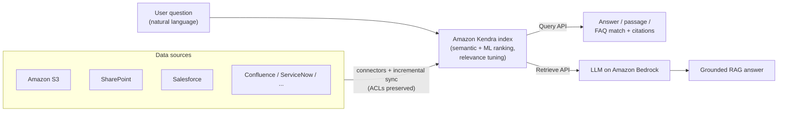

# Amazon Kendra

**Amazon Kendra** is a managed, ML-powered **intelligent enterprise search** service: users ask questions in natural language, and Kendra returns specific answers and the most relevant passages/documents from your indexed content — including an ACL-aware **Retrieve API** built for Retrieval Augmented Generation (RAG). ([How Kendra works](https://docs.aws.amazon.com/kendra/latest/dg/how-it-works.html), [Kendra features](https://aws.amazon.com/kendra/features/))

---

## 🧠 Mental model

Regular keyword search is a **library card catalog**: type the exact words on the spine, hope for a match. **Kendra is a knowledgeable librarian**: you ask *"what's our parental-leave policy for part-time staff?"* in plain English, and it understands *meaning* — pulling the right paragraph out of a 90-page HR PDF, even if none of your words appear verbatim.

Two ways to use that librarian:
- **Query API** → the librarian *answers you directly* (a passage, a document, or a matched FAQ) in a search app.
- **Retrieve API** → the librarian *hands relevant passages to an LLM*, which then writes a natural-language answer. This is Kendra as a **RAG retriever**.

Crucially, the librarian **checks your badge first**: with token/ACL filtering, users only get results from documents they're allowed to see.

---

## What it does

- **Intelligent semantic search** — deep-learning models rank by *meaning*, not just keywords, and can return a specific **answer**, a **document**, or an **FAQ match** rather than a list of blue links. ([Features](https://aws.amazon.com/kendra/features/))
- **Natural-language queries** — ask full questions ("how much annual leave do I accrue?") instead of typing keywords.
- **Pre-built connectors** to many data sources — Amazon S3, SharePoint, Salesforce, ServiceNow, Confluence, Google Drive, databases, websites, and more — handling common formats (HTML, Word, PowerPoint, PDF, Excel, plain text). ([Connectors](https://docs.aws.amazon.com/kendra/latest/dg/hiw-connector.html))
- **Incremental sync + incremental learning** — connectors sync source changes, and Kendra **continuously optimizes results** based on user clicks and feedback. ([Incremental learning](https://aws.amazon.com/kendra/features/))
- **Relevance tuning** — boost results by data source, author, or **freshness/recency**, and add **custom synonyms** for domain vocabulary. ([Relevance tuning](https://docs.aws.amazon.com/kendra/latest/dg/tuning.html))
- **Access-control-aware results** — honors source **document ACLs / token-based user-context filtering** so users only see permitted content. ([User context filtering](https://docs.aws.amazon.com/kendra/latest/dg/user-context-filter.html))
- **Retrieve API for RAG** — returns semantically relevant passages with chunking optimized for LLM payloads; pair with Amazon Bedrock to build grounded generative apps. ([Retrieve API / RAG](https://docs.aws.amazon.com/kendra/latest/dg/searching-retrieve.html))
- **Kendra GenAI Index** — a newer index option purpose-built for GenAI/RAG, offering enhanced semantic retrieval and usable as a **Bedrock Knowledge Base** retriever while keeping connectors, metadata, relevance tuning, and user-context filtering. ([Kendra GenAI Index](https://aws.amazon.com/blogs/machine-learning/introducing-amazon-kendra-genai-index-enhanced-semantic-search-and-retrieval-capabilities/))
- **Custom Document Enrichment, Experience Builder (no-code search app), analytics dashboard, and query autocomplete.** ([Features](https://aws.amazon.com/kendra/features/))

---

## When to use it (and vs alternatives)

| Scenario | Pick | Why (and not the others) |
|---|---|---|
| Natural-language **enterprise search** over messy internal docs, with connectors and ACL filtering | **Amazon Kendra** | Purpose-built ML search that understands questions and returns answers/passages, permissions-aware, minimal tuning. |
| A **retriever** to ground an LLM (RAG) using existing enterprise content | **Kendra** (Retrieve API / **GenAI Index**) | Delivers ACL-aware, LLM-ready passages; plugs into Bedrock. |
| You need a **general-purpose search/analytics/vector engine** you fully control (log search, custom scoring, your own embeddings, k-NN) | **Amazon OpenSearch Service** | More flexible and lower-level; you build ranking, embeddings, and relevance yourself. Kendra is managed and opinionated. |
| A **finished conversational assistant** over enterprise data (chat UI, generation, actions, connectors) with no pipeline to build | **Amazon Q Business** | Full RAG assistant that *can use Kendra as its retriever*; Kendra alone is search/retrieval, not a chat+generation app. |
| Store and query your **own vector embeddings** at scale | **OpenSearch (k-NN)**, Aurora/RDS pgvector, or a Bedrock Knowledge Base | Kendra abstracts embeddings away; choose a vector DB when you want direct control of vectors. |

**Kendra vs OpenSearch (the classic exam contrast):** **Kendra = managed, ML "just-works" question-answering search** with pre-built connectors and semantic ranking out of the box. **OpenSearch = a flexible, general-purpose search/analytics engine** (also does vector k-NN) where *you* own the relevance logic and embeddings. Choose Kendra for fast, accurate NL search over documents with least effort; choose OpenSearch for custom search/analytics/logging or when you need full control.

**Kendra vs Q Business:** Kendra *finds* content (search/retrieval). Q Business *converses and generates* grounded, cited answers and can perform actions — and can use Kendra underneath as its retriever.

---

## Pricing model

Verify current numbers in the pricing page; know the **dimensions**. ([Kendra pricing](https://aws.amazon.com/kendra/pricing/))

- **Index edition** — choose the index type, which sets accuracy/capabilities and price:
  - **Developer Edition** — for proof-of-concept; not for production, no high availability.
  - **Enterprise Edition** — production-grade with high availability.
  - **GenAI Enterprise Edition** — highest accuracy with the latest retrieval/semantic models, for production RAG and search.
- **Index capacity (hourly)** — a base index includes one **storage unit** (document count / extracted-text size) and one **query unit** (queries per second). You add more **storage** and **query** units as needed. Query units are **shared across the Query and Retrieve APIs**.
- **Connectors** — a monthly per-index connector charge plus per-hour **sync** and per-document **scanning** costs during synchronization.
- **Free trial** — new accounts get a limited free-usage window on eligible editions.

Key takeaway for the exam: **Kendra bills largely on provisioned index capacity (storage + query units) by the hour**, not purely per-query — so an idle index still costs money.

---

## 🎯 On the exam

**Reflexes — "if you see X, pick Y":**
- "**Natural-language search** over enterprise documents / connectors / least effort" → **Amazon Kendra**.
- "**Retriever for RAG** / ground an LLM with enterprise content / ACL-aware passages" → **Kendra Retrieve API** (or **GenAI Index** for Bedrock Knowledge Bases).
- "Boost recent docs / a trusted source / add synonyms" → **relevance tuning**.
- "Results must respect who can see what" → **user-context / ACL filtering**.
- "General search/analytics, **log analytics**, custom vector k-NN, our own relevance" → **Amazon OpenSearch Service**, not Kendra.
- "Finished **chat assistant** over company data, no pipeline" → **Amazon Q Business** (may use Kendra as retriever).

**Traps:**
- **Kendra is search/retrieval, not a chatbot.** It returns answers/passages; it doesn't *generate* conversational responses on its own — pair it with an LLM (Bedrock) for that, or use Q Business.
- **Kendra vs OpenSearch:** managed ML QA-search (Kendra) vs flexible general engine you tune yourself (OpenSearch). Don't pick OpenSearch when the scenario stresses "natural-language answers with minimal ML effort."
- **Capacity-based billing:** you pay for provisioned index units by the hour even when idle — relevant to cost-optimization questions.
- **Incremental learning ≠ retraining a model** — it's continuous re-ranking from user feedback/clicks, no ML work by you.
- **GenAI Index** is the RAG-optimized option and integrates with **Bedrock Knowledge Bases** — remember it exists for "highest-accuracy RAG retriever" scenarios.

---

## References

- What is Amazon Kendra: https://docs.aws.amazon.com/kendra/latest/dg/what-is-kendra.html
- How Amazon Kendra works: https://docs.aws.amazon.com/kendra/latest/dg/how-it-works.html
- Kendra features: https://aws.amazon.com/kendra/features/
- Data source connectors: https://docs.aws.amazon.com/kendra/latest/dg/hiw-connector.html
- Relevance tuning: https://docs.aws.amazon.com/kendra/latest/dg/tuning.html
- User context (ACL) filtering: https://docs.aws.amazon.com/kendra/latest/dg/user-context-filter.html
- Retrieve API for RAG: https://docs.aws.amazon.com/kendra/latest/dg/searching-retrieve.html
- Kendra GenAI Index (blog): https://aws.amazon.com/blogs/machine-learning/introducing-amazon-kendra-genai-index-enhanced-semantic-search-and-retrieval-capabilities/
- Retrievers for RAG workflows (Prescriptive Guidance): https://docs.aws.amazon.com/prescriptive-guidance/latest/retrieval-augmented-generation-options/rag-custom-retrievers.html
- Kendra pricing: https://aws.amazon.com/kendra/pricing/
