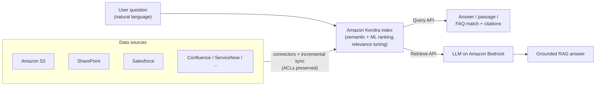

# Amazon Kendra

**Amazon Kendra** is a managed, ML-powered **intelligent enterprise search** service: users ask questions in natural language, and Kendra returns specific answers and the most relevant passages/documents from your indexed content — including an ACL-aware **Retrieve API** built for Retrieval Augmented Generation (RAG). ([How Kendra works](https://docs.aws.amazon.com/kendra/latest/dg/how-it-works.html), [Kendra features](https://aws.amazon.com/kendra/features/))

> **⚠️ Availability change (July 2026):** Amazon Kendra is **no longer open to new customers** as of July 30, 2026, and entered Maintenance Mode on June 30, 2026 (bug fixes and security updates only; no new features). **AWS recommends that all new search and RAG applications use Amazon Bedrock Managed Knowledge Base (BMKB) instead.** Existing customers continue to be supported. ([Kendra availability change](https://docs.aws.amazon.com/kendra/latest/dg/kendra-availability-change.html))

> **Why (the rationale):** Kendra gives you ML-powered "answer from a paragraph" search over messy enterprise documents (PDFs, SharePoint, Salesforce, etc.) with zero ML expertise and built-in ACL filtering. Pick it over OpenSearch when you want managed semantic search that just works rather than a general engine you tune yourself.
> **When to use (existing customers):** Internal knowledge bases, HR/IT self-service portals, RAG retriever for Bedrock when you need ACL-aware enterprise document grounding. Signal: "natural-language search," "intelligent enterprise search," "Q&A over company docs," "ACL-aware retrieval." **New projects should use Bedrock Managed Knowledge Base** — it provides native RAG (RetrieveAndGenerate API), hybrid search, selectable embedding models, and agentic retrieval without needing to provision a Kendra index.
> **Nuances & gotchas:** Kendra is search/retrieval only — it does NOT generate conversational responses on its own; pair with Bedrock or use Q Business for generation. Billing is by provisioned index capacity (hourly), so an idle index still costs money. **Kendra is sunset for new projects** — Bedrock Knowledge Bases is the current AWS-recommended path for new RAG builds. For new projects where you want a finished chat assistant (not a retrieval pipeline), Q Business is the faster path.

---

## 🧠 Mental model

Regular keyword search is a **library card catalog**: type the exact words on the spine, hope for a match. **Kendra is a knowledgeable librarian**: you ask *"what's our parental-leave policy for part-time staff?"* in plain English, and it understands *meaning* — pulling the right paragraph out of a 90-page HR PDF, even if none of your words appear verbatim.

Two ways to use that librarian:
- **Query API** → the librarian *answers you directly* (a passage, a document, or a matched FAQ) in a search app.
- **Retrieve API** → the librarian *hands relevant passages to an LLM*, which then writes a natural-language answer. This is Kendra as a **RAG retriever**.

Crucially, the librarian **checks your badge first**: with token/ACL filtering, users only get results from documents they're allowed to see.

```mermaid
flowchart LR
    subgraph SRC["Data sources"]
        S3["Amazon S3"]
        SP["SharePoint"]
        SF["Salesforce"]
        CF["Confluence / ServiceNow / ..."]
    end

    SRC -->|"connectors + incremental sync<br/>(ACLs preserved)"| IDX["Amazon Kendra index<br/>(semantic + ML ranking,<br/>relevance tuning)"]

    U["User question<br/>(natural language)"] --> IDX

    IDX -->|"Query API"| ANS["Answer / passage /<br/>FAQ match + citations"]
    IDX -->|"Retrieve API"| LLM["LLM on Amazon Bedrock"]
    LLM --> RAG["Grounded RAG answer"]
```

---

## What it does

> **Why (the rationale):** Semantic ranking understands question meaning, not just keyword overlap, so it finds the right paragraph in a 90-page PDF even when the user's words don't appear verbatim.
> **When to use:** Any enterprise-search scenario where keyword search returns too many irrelevant results or users ask full questions instead of typing keywords.
> **Nuances & gotchas:** Kendra returns answers/passages/FAQ matches — it is NOT a generative LLM. It does not write new sentences; it retrieves existing content. For generation, chain the Retrieve API with a Bedrock model.

- **Intelligent semantic search** — deep-learning models rank by *meaning*, not just keywords, and can return a specific **answer**, a **document**, or an **FAQ match** rather than a list of blue links. ([Features](https://aws.amazon.com/kendra/features/))
- **Natural-language queries** — ask full questions ("how much annual leave do I accrue?") instead of typing keywords.
- **Pre-built connectors** to many data sources — Amazon S3, SharePoint, Salesforce, ServiceNow, Confluence, Google Drive, databases, websites, and more — handling common formats (HTML, Word, PowerPoint, PDF, Excel, plain text). ([Connectors](https://docs.aws.amazon.com/kendra/latest/dg/hiw-connector.html)) **Why connectors matter:** Enterprise content lives in dozens of silos; without connectors you'd build custom ingestion pipelines for each source. Connectors handle auth, crawling, incremental sync, and ACL extraction automatically — you configure credentials, not ETL code.
- **Incremental sync + incremental learning** — connectors sync source changes, and Kendra **continuously optimizes results** based on user clicks and feedback. ([Incremental learning](https://aws.amazon.com/kendra/features/))
- **Relevance tuning** — boost results by data source, author, or **freshness/recency**, and add **custom synonyms** for domain vocabulary. ([Relevance tuning](https://docs.aws.amazon.com/kendra/latest/dg/tuning.html))
- **Access-control-aware results** — honors source **document ACLs / token-based user-context filtering** so users only see permitted content. ([User context filtering](https://docs.aws.amazon.com/kendra/latest/dg/user-context-filter.html)) **Why this is critical for enterprise:** In a typical organization, the same search index spans HR documents (visible to all), payroll records (finance only), and executive briefings (executives only). Without per-user ACL filtering at the retrieval layer, a search UI would expose confidential documents to unauthorized employees — even if the source system had access controls, a naive index strips them out.
- **Retrieve API for RAG** — returns semantically relevant passages with chunking optimized for LLM payloads; pair with Amazon Bedrock to build grounded generative apps. ([Retrieve API / RAG](https://docs.aws.amazon.com/kendra/latest/dg/searching-retrieve.html))

> **Why (the rationale):** The Retrieve API returns LLM-ready chunks from ACL-filtered enterprise content, making Kendra a managed retriever for Bedrock without you managing a vector store.
> **When to use:** When you need RAG over enterprise documents that already live in Kendra connectors (SharePoint, S3, Confluence, etc.) and must respect per-user document permissions. Signal: "RAG over enterprise content," "ACL-aware passages for LLM."
> **Nuances & gotchas:** Query units are shared between the Query API and Retrieve API — heavy RAG usage counts against the same throughput budget. For highest-accuracy RAG, use the **GenAI Index** variant, not a classic Enterprise Edition index.
- **Kendra GenAI Index** — a newer index option (introduced December 2024) purpose-built for GenAI/RAG, offering enhanced semantic retrieval via hybrid search (keyword + vector), semantic embedding, and re-ranker models; usable as a **Bedrock Knowledge Base** retriever while keeping connectors, metadata, relevance tuning, and user-context filtering. **Only available in US East (N. Virginia) and US West (Oregon).** ([Kendra GenAI Index](https://aws.amazon.com/blogs/machine-learning/introducing-amazon-kendra-genai-index-enhanced-semantic-search-and-retrieval-capabilities/))

> **Why (the rationale):** The GenAI Index uses a Transformer-based hybrid retrieval model (keyword + vector + re-ranker) giving higher semantic accuracy than the classic Enterprise Edition index, and it can plug directly into Bedrock Knowledge Bases as a managed retriever — keeping all Kendra connectors and ACL filtering while adding modern RAG quality. **Why Kendra is being superseded by Bedrock Knowledge Bases for new RAG:** Bedrock KB offers a native end-to-end RAG pipeline with a RetrieveAndGenerate API (no external LLM wiring needed), selectable embedding models, agentic multi-step retrieval, and managed vector storage — capabilities Kendra never built natively. With Kendra in Maintenance Mode as of June 2026, AWS now directs all new RAG projects to Bedrock Managed Knowledge Base.
> **When to use (existing Kendra customers):** Prefer GenAI Index over classic Enterprise Edition for Bedrock Knowledge Base integration. For all new projects, use Bedrock Managed Knowledge Base directly.
> **Nuances & gotchas:** GenAI Enterprise Edition is only available in 2 regions (us-east-1, us-west-2); classic Enterprise Edition has wider regional availability. GenAI Index supports English language content only. Classic Enterprise/Developer Edition indexes cannot be upgraded in place — you create a new index. **Kendra is in Maintenance Mode — no new features will be added.**
- **Custom Document Enrichment, Experience Builder (no-code search app), analytics dashboard, and query autocomplete.** ([Features](https://aws.amazon.com/kendra/features/))

---

## When to use it (and vs alternatives)

| Scenario | Pick | Why (and not the others) |
|---|---|---|
| Natural-language **enterprise search** over messy internal docs, with connectors and ACL filtering | **Amazon Kendra** (existing customers) / **Bedrock Managed Knowledge Base** (new projects) | Kendra is in Maintenance Mode (no new customers as of July 2026); BMKB is the recommended path for new builds. |
| A **retriever** to ground an LLM (RAG) using existing enterprise content | **Bedrock Managed Knowledge Base** (new) / **Kendra Retrieve API / GenAI Index** (existing) | BMKB delivers native RAG with RetrieveAndGenerate API and managed vector store. Kendra is legacy for existing deployments only. |
| You need a **general-purpose search/analytics/vector engine** you fully control (log search, custom scoring, your own embeddings, k-NN) | **Amazon OpenSearch Service** | More flexible and lower-level; you build ranking, embeddings, and relevance yourself. Kendra is managed and opinionated. |
| A **finished conversational assistant** over enterprise data (chat UI, generation, actions, connectors) with no pipeline to build | **Amazon Q Business** | Full RAG assistant that *can use Kendra as its retriever*; Kendra alone is search/retrieval, not a chat+generation app. |
| Store and query your **own vector embeddings** at scale | **OpenSearch (k-NN)**, Aurora/RDS pgvector, or a Bedrock Knowledge Base | Kendra abstracts embeddings away; choose a vector DB when you want direct control of vectors. |

> **Why (the rationale):** Kendra is purpose-built for natural-language enterprise search with managed connectors, ACL-aware ranking, and answer extraction — no ML tuning by you. OpenSearch is a general-purpose search/analytics engine where you own the relevance logic.
> **When to use:** Choose Kendra when the scenario emphasizes "intelligent search," "natural-language Q&A over documents," "minimum ML effort," or "ACL-aware results." Choose OpenSearch for log analytics, custom vector k-NN, or when you need full scoring control.
> **Nuances & gotchas:** For *new* enterprise RAG chat assistants (generation + search together), evaluate Amazon Q Business before building a Kendra + Bedrock pipeline from scratch — Q Business is the finished product; Kendra is the retrieval layer.

**Kendra vs OpenSearch (the classic exam contrast):** **Kendra = managed, ML "just-works" question-answering search** with pre-built connectors and semantic ranking out of the box. **OpenSearch = a flexible, general-purpose search/analytics engine** (also does vector k-NN) where *you* own the relevance logic and embeddings. Choose Kendra for fast, accurate NL search over documents with least effort; choose OpenSearch for custom search/analytics/logging or when you need full control.

**Kendra vs Q Business:** Kendra *finds* content (search/retrieval). Q Business *converses and generates* grounded, cited answers and can perform actions — and can use Kendra underneath as its retriever.

**Kendra vs Bedrock Managed Knowledge Base (the new primary contrast for exam):** Kendra (Maintenance Mode, no new customers) was a managed ML search index with 32+ connectors and ACL-aware retrieval. Bedrock Managed Knowledge Base (BMKB) is AWS's current recommendation — fully managed RAG pipeline, RetrieveAndGenerate API, agentic retrieval, selectable embedding models, managed vector store. BMKB has only 7 native connectors (vs Kendra's 32+) but provides native generation, while Kendra required an external LLM. **For exam: new RAG/search projects → BMKB; existing Kendra → maintain in place.**

---

## Pricing model

> **Why (the rationale):** Kendra bills on provisioned index capacity (not purely per-query), so understanding dimensions prevents surprise costs from idle indexes.
> **When to use:** Developer Edition is for POC only — never production. Enterprise Edition for standard production. GenAI Enterprise Edition when you need the highest-accuracy RAG retriever or Bedrock Knowledge Base integration.
> **Nuances & gotchas:** An idle Kendra index still incurs hourly charges for storage and query units. There is no "pause" mode — you must delete the index to stop billing. Free trial is time-limited; evaluate edition costs before committing.

Verify current numbers in the pricing page; know the **dimensions**. ([Kendra pricing](https://aws.amazon.com/kendra/pricing/))

- **Index edition** — choose the index type, which sets accuracy/capabilities and price:
  - **Developer Edition** — for proof-of-concept; not for production, no high availability.
  - **Enterprise Edition** — production-grade with high availability.
  - **GenAI Enterprise Edition** — highest accuracy with the latest retrieval/semantic models, for production RAG and search.
- **Index capacity (hourly)** — a base index includes one **storage unit** (document count / extracted-text size) and one **query unit** (queries per second). You add more **storage** and **query** units as needed. Query units are **shared across the Query and Retrieve APIs**.
- **Connectors** — a monthly per-index connector charge plus per-hour **sync** and per-document **scanning** costs during synchronization.
- **Free trial** — new accounts get a limited free-usage window on eligible editions.

Key takeaway for the exam: **Kendra bills largely on provisioned index capacity (storage + query units) by the hour**, not purely per-query — so an idle index still costs money.

---

## 🎯 On the exam

**Reflexes — "if you see X, pick Y":**
- "**Natural-language search** over enterprise documents / connectors / least effort" → **Amazon Kendra** (existing; for new projects: **Bedrock Managed Knowledge Base**).
- "**Retriever for RAG** / ground an LLM with enterprise content / ACL-aware passages" → **Bedrock Managed Knowledge Base** (new); **Kendra Retrieve API / GenAI Index** (existing).
- "Kendra is in **Maintenance Mode** / **no longer open to new customers**" → Migrate to or build new on **Bedrock Managed Knowledge Base**.
- "Boost recent docs / a trusted source / add synonyms" → **relevance tuning**.
- "Results must respect who can see what" → **user-context / ACL filtering**.
- "General search/analytics, **log analytics**, custom vector k-NN, our own relevance" → **Amazon OpenSearch Service**, not Kendra.
- "Finished **chat assistant** over company data, no pipeline" → **Amazon Q Business** (may use Kendra as retriever).

**Traps:**
- **Kendra is search/retrieval, not a chatbot.** It returns answers/passages; it doesn't *generate* conversational responses on its own — pair it with an LLM (Bedrock) for that, or use Q Business.
- **Kendra vs OpenSearch:** managed ML QA-search (Kendra) vs flexible general engine you tune yourself (OpenSearch). Don't pick OpenSearch when the scenario stresses "natural-language answers with minimal ML effort."
- **Kendra is in Maintenance Mode (June 2026) and closed to new customers (July 2026).** For new RAG/search applications, AWS recommends **Amazon Bedrock Managed Knowledge Base**. Exam questions framing a "new project" scenario should point to BMKB, not Kendra.
- **Capacity-based billing:** you pay for provisioned index units by the hour even when idle — relevant to cost-optimization questions.
- **Incremental learning ≠ retraining a model** — it's continuous re-ranking from user feedback/clicks, no ML work by you.
- **GenAI Index** is the RAG-optimized Kendra option (existing customers) — limited to us-east-1 and us-west-2, English-only, introduced Dec 2024; integrates with **Bedrock Knowledge Bases** as a managed retriever.

---

---

## Glossary

| Term | Simple explanation | Purpose |
|---|---|---|
| Amazon Kendra | Managed ML-powered enterprise search service that answers natural-language questions | Lets employees ask questions in plain English and get specific answers from internal docs |
| Intelligent search | Search that understands the meaning of a question, not just exact keywords | Returns precise answers or passages rather than a ranked list of links |
| Natural language query | A question asked in everyday speech ("what is our refund policy?") | Allows non-technical users to find information without knowing exact document terms |
| Query API | Kendra endpoint that returns an answer, passage, or FAQ match directly to a search app | Used when building an internal search UI for employees or customers |
| Retrieve API | Kendra endpoint that returns semantically relevant passages formatted for an LLM | Used when wiring Kendra as a retriever in a RAG pipeline with Amazon Bedrock |
| RAG | Retrieval-Augmented Generation — grounding an LLM's answer with retrieved documents | Reduces hallucination by giving the model factual context before it generates a response |
| Kendra index | The searchable store Kendra builds from your connected data sources | The core artifact you query; must be provisioned and kept running (costs money when idle) |
| Developer Edition | Low-cost Kendra index tier for proof-of-concept work; no high availability | Not suitable for production; used to evaluate Kendra before committing |
| Enterprise Edition | Production-grade Kendra index with high availability and SLA | Used for live customer or employee search applications |
| GenAI Enterprise Edition | Highest-accuracy Kendra index optimized for RAG and semantic search | Best choice when using Kendra as a retriever for a Bedrock Knowledge Base |
| Kendra GenAI Index | Newer index type purpose-built for generative AI and RAG workloads | Integrates with Bedrock Knowledge Bases while retaining connectors and ACL filtering |
| Data source connector | Pre-built integration that syncs content from a source (S3, SharePoint, Salesforce) into a Kendra index | Avoids manual ingestion; handles common file formats and preserves ACLs |
| Incremental sync | Connector behavior that only re-indexes content that has changed since the last sync | Keeps the index fresh without re-crawling everything each time |
| Incremental learning | Kendra's automatic re-ranking of results based on user clicks and feedback | Continuously improves relevance without you retraining an ML model |
| Relevance tuning | Settings that boost results by freshness, data source, or author, and add synonyms | Tailors Kendra's ranking to your domain's priorities |
| Custom synonyms | Domain-specific word lists that tell Kendra to treat different terms as equivalent | Ensures jargon or abbreviations match the right documents |
| ACL | Access Control List — per-document permission list defining who can read it | Kendra honors ACLs so users only see content they are authorized to access |
| User context filtering | Token-based filtering that scopes Kendra results to what the querying user is allowed to see | Prevents one user from seeing another user's private documents in search results |
| Semantic search | Search based on meaning and context rather than exact keyword matching | Finds the right answer even when the query words don't appear verbatim in the document |
| FAQ match | Kendra's ability to return a pre-authored question-answer pair when a query matches | Gives instant, authoritative answers for common questions |
| Storage unit | Unit of Kendra index capacity for document count and extracted text size | Determines how many documents the index can hold; billed hourly |
| Query unit | Unit of Kendra index capacity for queries per second | Determines query throughput; shared between Query and Retrieve APIs |
| Amazon OpenSearch Service | AWS-managed Elasticsearch/OpenSearch cluster for general search and analytics | Used when you need custom embeddings, log analytics, or full control over scoring |
| Amazon Q Business | Fully managed GenAI assistant that generates cited answers over enterprise data | A higher-level product that can use Kendra as its retriever; adds generation and actions |
| Bedrock Knowledge Base | Amazon Bedrock feature that manages a vector store for RAG applications | Can use a Kendra GenAI Index as its retriever for enterprise document grounding |
| k-NN | k-Nearest Neighbors — vector similarity search for finding semantically related items | Used in OpenSearch when you want direct control over your own embeddings |
| Custom Document Enrichment | Kendra feature to apply Lambda functions that modify or enrich documents at ingestion | Allows preprocessing (redaction, metadata extraction) before content enters the index |
| Experience Builder | No-code Kendra tool for creating a search application without writing code | Lets business teams launch an internal search portal quickly |

## References

- What is Amazon Kendra: https://docs.aws.amazon.com/kendra/latest/dg/what-is-kendra.html
- How Amazon Kendra works: https://docs.aws.amazon.com/kendra/latest/dg/how-it-works.html
- Kendra features: https://aws.amazon.com/kendra/features/
- Data source connectors: https://docs.aws.amazon.com/kendra/latest/dg/hiw-connector.html
- Relevance tuning: https://docs.aws.amazon.com/kendra/latest/dg/tuning.html
- User context (ACL) filtering: https://docs.aws.amazon.com/kendra/latest/dg/user-context-filter.html
- Retrieve API for RAG: https://docs.aws.amazon.com/kendra/latest/dg/searching-retrieve.html
- Kendra GenAI Index (blog): https://aws.amazon.com/blogs/machine-learning/introducing-amazon-kendra-genai-index-enhanced-semantic-search-and-retrieval-capabilities/
- Retrievers for RAG workflows (Prescriptive Guidance): https://docs.aws.amazon.com/prescriptive-guidance/latest/retrieval-augmented-generation-options/rag-custom-retrievers.html
- Kendra pricing: https://aws.amazon.com/kendra/pricing/
