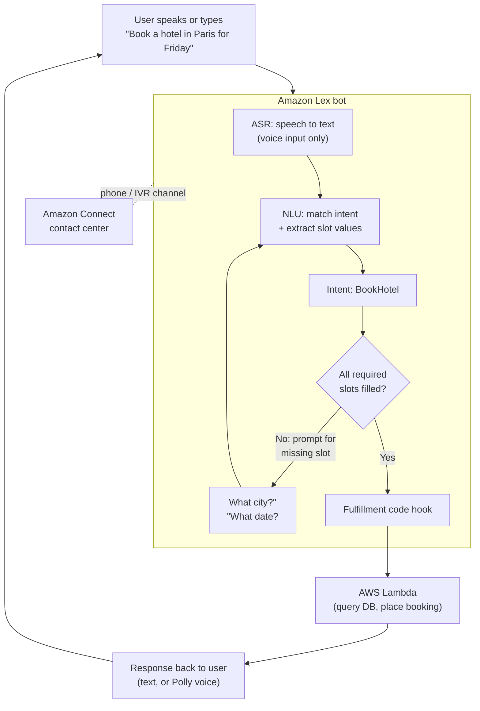

# Amazon Lex

**Amazon Lex is a fully managed AWS service for building conversational interfaces (chatbots, voice bots, and IVR systems) into any application using voice and text — powered by the same deep-learning technology that runs Amazon Alexa.** ([What is Amazon Lex V2](https://docs.aws.amazon.com/lexv2/latest/dg/what-is.html))

> **Exam scope:** Lex appears on both **AIF-C01** (as an AWS AI/ML service you should recognize) and **MLA-C01** (as a managed conversational-AI building block). You need to know *what it does*, its core building blocks (**intents, utterances, slots, fulfillment**), and *when to pick it over Amazon Q or Bedrock Agents*.

---

## 🧠 Mental model

Think of Lex as a **very good phone/chat receptionist that you train with examples instead of code.**

- You tell the receptionist the **jobs** it can help with → these are **intents** ("book a hotel", "order pizza", "check my balance").
- You give example **phrases** callers might say for each job → these are **sample utterances** ("I want to book a room", "get me a hotel"). Lex uses ML to generalize, so it understands phrasings you never typed.
- For each job, the receptionist knows which **pieces of information** it must collect before it can act → these are **slots** ("check-in date", "city", "number of nights"). Each slot has a **slot type** that defines valid values.
- Once every slot is filled, the receptionist **hands the completed order to the back office to actually do the work** → this is **fulfillment**, usually an **AWS Lambda** function.

Lex handles the hard part — **Automatic Speech Recognition (ASR)** to turn voice into text, and **Natural Language Understanding (NLU)** to map text to the right intent and extract slot values. You just supply the business logic. ([Lex V2 core concepts](https://docs.aws.amazon.com/lexv2/latest/dg/how-it-works.html))

---

---

## What it does

Amazon Lex V2 gives you a fully managed pipeline of ASR + NLU + dialog management. Core building blocks:

| Building block | What it is | Example |
|---|---|---|
| **Bot** | The container/application. Holds one or more **locales** (languages). | `TravelBot` |
| **Intent** | A goal the user wants to accomplish. A bot has many intents. | `BookHotel`, `BookCar`, `CancelBooking` |
| **Sample utterances** | Example phrases that map to an intent. Lex's ML **generalizes** beyond them. | "I need a room", "reserve a hotel" |
| **Slot** | A parameter Lex must collect to fulfill an intent. Can be **required** or optional; Lex prompts the user for missing required slots. | `CheckInDate`, `City`, `Nights` |
| **Slot type** | Defines the set of valid values for a slot. **Built-in** (e.g. `AMAZON.Date`, `AMAZON.Number`, `AMAZON.City`) or **custom** (a list of values you supply, with optional synonyms). | Custom `RoomType` = {suite, standard, deluxe} |
| **Prompts & responses** | The questions Lex asks to elicit slots, plus confirmation and closing messages. | "What city are you traveling to?" |
| **Code hooks** | Optional **Lambda** functions. A **dialog code hook** runs during the conversation to validate input / set slots dynamically; a **fulfillment code hook** runs when the intent is complete to *do the work*. | Validate date is in the future; call booking API |
| **Session & context** | Lex maintains **session state** and **session attributes** across turns, and supports **context tags** to control which intents are eligible next. | Carry `userId` across turns |

([Intent structure](https://docs.aws.amazon.com/lexv2/latest/dg/intent-structure.html) · [Built-in & custom slot types](https://docs.aws.amazon.com/lexv2/latest/dg/howitworks-builtins-slots.html) · [Lambda code hooks](https://docs.aws.amazon.com/lexv2/latest/dg/lambda.html))

**Key capabilities to remember:**

- **Voice *and* text** from one bot definition — a single bot serves web chat, SMS, and phone/IVR.
- **Multi-turn dialog management** — Lex automatically re-prompts for missing slots, confirms, and handles clarification.
- **Multi-language** via locales in one bot.
- **Generative AI features** (Lex V2) that use **Amazon Bedrock** foundation models to speed up bot building and improve understanding: **Assisted slot resolution**, **descriptive bot builder** (generate a bot from a description), **utterance generation**, and a **QnA intent** (`AMAZON.QnAIntent`) that answers questions from a Bedrock knowledge base instead of a scripted flow. ([Generative AI features for Lex V2](https://docs.aws.amazon.com/lexv2/latest/dg/generative-features.html))
- **`AMAZON.BedrockAgentIntent`** — hands a turn to a **Bedrock Agent** for multi-step, tool-using GenAI task completion. ([Bedrock agent intent](https://docs.aws.amazon.com/lexv2/latest/dg/generative-features.html))

### How it integrates with other AWS services

- **AWS Lambda** — fulfillment and dialog validation (the business logic).
- **Amazon Connect** — Lex is the natural-language brain for **contact-center IVR**; callers speak, Lex understands, Connect routes. This is the classic "self-service IVR" pattern. ([Amazon Connect + Lex](https://docs.aws.amazon.com/connect/latest/adminguide/amazon-lex.html))
- **Amazon Polly** — turns Lex's text responses into lifelike **speech** for voice channels.
- **Amazon Comprehend / Kendra** — sentiment analysis and document/knowledge search behind the conversation.
- **Amazon Bedrock** — powers the generative features above (descriptive builder, QnA intent, agent hand-off).
- **Channels** — deploy to Facebook Messenger, Slack, Twilio SMS, or your own app via the runtime API.

---

## When to use it (and vs alternatives)

Use Lex when you need a **structured, task-oriented conversation** with defined intents and parameters — booking, ordering, status checks, form-filling, IVR call steering.

| If you need… | Pick | Why |
|---|---|---|
| A **task bot / IVR** with defined **intents & slots**, voice + text, custom fulfillment logic | **Amazon Lex** | Purpose-built intent/slot NLU + ASR; deep **Amazon Connect** integration for contact centers |
| An **enterprise "chat with your company data" assistant** (no code, connects to SharePoint, S3, Salesforce, etc.) with built-in RAG and access controls | **Amazon Q Business** | Managed GenAI assistant over enterprise content; minimal setup, no intent modeling |
| A **coding / AWS-operations assistant** in the IDE, console, or CLI | **Amazon Q Developer** | Specialized for developers and AWS tasks |
| A **custom GenAI agent** that reasons, calls APIs/tools, and orchestrates multi-step workflows over foundation models | **Amazon Bedrock Agents** | Full control over FM, prompts, action groups, and knowledge bases |
| Raw **speech-to-text** or **text-to-speech** only (no dialog) | **Amazon Transcribe** / **Amazon Polly** | Lex bundles these but if you only need ASR or TTS, use them directly |

**The clean mental split:**
- **Lex = rules/intent bot.** *You* define the intents, slots, and flow. Deterministic, auditable, great for transactional tasks and IVR.
- **Amazon Q = ready-made GenAI assistant.** Point it at your data; it answers in natural language with little configuration.
- **Bedrock Agents = build-your-own GenAI agent.** Maximum flexibility over the model and tool-use for open-ended, multi-step tasks.

> These aren't mutually exclusive — a modern pattern is a **Lex bot as the front door** (channels, IVR, ASR/TTS) that delegates open-ended turns to a **Bedrock Agent** or **QnA intent** for GenAI answers.

---

## Pricing model

Amazon Lex V2 uses **pay-per-request** with **no upfront cost and no minimums**. You are billed per **API request** to the bot, priced by interaction type: ([Amazon Lex pricing](https://aws.amazon.com/lex/pricing/))

| Dimension | Price (US regions, verify current) |
|---|---|
| **Text request** (request-and-response) | **$0.00075** per request |
| **Speech request** (request-and-response) | **$0.004** per request |
| **Streaming — text** | **$0.00080** per request |
| **Streaming — speech** | **$0.0045** per request |
| **Automated Chatbot Designer** | Priced separately per unit of conversation transcript analyzed |

**Free Tier:** for the first 12 months, **10,000 text** and **5,000 speech** requests per month.

> Speech costs more than text because it includes ASR/TTS processing. You also pay separately for any **Lambda**, **Polly**, **Connect**, or **Bedrock** usage the bot invokes. Always confirm current numbers on the [official pricing page](https://aws.amazon.com/lex/pricing/) — exam questions test the *model* (per-request, voice > text), not the exact cents.

---

## 🎯 On the exam

**Reflexes — if you see this, pick Lex:**

- "Build a **chatbot** / **voice bot** / **IVR**" with **intents and slots** → **Amazon Lex.** This is the signature phrase.
- "Same technology as **Alexa**" → **Amazon Lex.**
- "Add a **conversational IVR** to a **contact center** / **Amazon Connect**" → **Lex** (for NLU) + **Connect** (routing), often + **Polly** (speech out).
- "Bot needs to **call a backend / place an order / validate input**" → **Lambda** fulfillment/dialog code hook.
- "Bot must **collect a date, number, city** from the user" → those are **slots** with **built-in slot types** (`AMAZON.Date`, etc.).

**Traps & disambiguation:**

- **Lex vs Amazon Q:** If the scenario is a **no-code assistant over enterprise documents/data** with built-in RAG → **Amazon Q Business**, *not* Lex. Lex is when *you model the intents yourself*.
- **Lex vs Bedrock Agents:** If it's an **open-ended, multi-step GenAI agent** that reasons and calls tools/APIs freely → **Bedrock Agents**. Lex is for **structured intent-based** conversations (though Lex can *delegate* to a Bedrock Agent).
- **Lex vs Comprehend:** Comprehend does **NLP on documents** (sentiment, entities, topics) — *not* interactive dialog. If there's a back-and-forth conversation, it's Lex.
- **Lex vs Transcribe/Polly:** Transcribe = speech→text, Polly = text→speech, standalone. Lex *uses* both but adds **understanding + dialog**. If the question is "just transcribe a call" → Transcribe.
- **Voice ≠ automatic Lex.** "Convert this recording to text" alone is **Transcribe**; Lex is when you need to *understand and respond*.
- Remember Lex maintains **session state / session attributes** across turns — you don't manage conversation memory yourself.

**"If you see X, pick this" cheat line:**
> *Build a chatbot or IVR with **intents and slots**, voice + text, backed by Lambda → **Amazon Lex.***

---

---

## Glossary

| Term | Simple explanation | Purpose |
|---|---|---|
| Amazon Lex | Fully managed AWS service for building chatbots and voice bots using the same technology as Alexa | Lets developers add conversational interfaces to apps without building NLU from scratch |
| Lex V2 | The current version of Amazon Lex with multi-language support and generative AI features | The version to use for all new bot development |
| ASR | Automatic Speech Recognition — converts spoken audio into written text | Enables voice-based input so users can speak rather than type |
| NLU | Natural Language Understanding — figures out what the user means from their words | Maps a user's phrase to the right intent and extracts slot values |
| Intent | A goal a user wants to accomplish, defined in the bot (e.g., "BookHotel") | The unit of conversational logic; each intent represents one task the bot can do |
| Sample utterances | Example phrases you provide to teach Lex how users might express an intent | Lex generalizes from these so it understands phrasings you never explicitly listed |
| Slot | A piece of information Lex must collect to fulfill an intent (e.g., city, date) | Represents a required parameter; Lex prompts the user until all required slots are filled |
| Slot type | Defines the set of valid values for a slot (built-in or custom) | Validates slot input and enables Lex to recognize canonical values and synonyms |
| Built-in slot type | Slot types provided by AWS for common data like dates, numbers, and cities | Saves you from defining common input formats yourself |
| Custom slot type | A slot type you define with a list of values and optional synonyms | Handles domain-specific values like room types or product categories |
| Fulfillment | The action taken when all required slots are collected (usually an AWS Lambda call) | Where the real work happens — calling an API, querying a database, placing an order |
| Dialog code hook | An optional Lambda function that runs during the conversation to validate input or dynamically set slots | Allows real-time business logic (e.g., check if a date is in the future) mid-conversation |
| Fulfillment code hook | A Lambda function that runs when an intent is complete to perform the actual task | Executes the backend action triggered by a completed intent |
| AWS Lambda | Serverless compute service used to run Lex code hooks | Provides the business logic and backend integration for Lex bots |
| Session state | Conversation state maintained by Lex across turns (including session attributes) | Allows the bot to remember context without you managing a conversation history manually |
| Session attributes | Key-value pairs carried through a Lex session (e.g., user ID, preferences) | Pass context between turns and to Lambda without user re-input |
| Context tags | Labels that control which intents are eligible in the next conversation turn | Implements conversational flow control (e.g., only offer CancelBooking after BookHotel) |
| Multi-turn dialog | Lex automatically re-prompts for missing slots across multiple exchanges | Enables natural back-and-forth conversation without custom state management |
| Locale | A language+region setting inside a Lex bot | Allows one bot definition to serve multiple languages |
| AMAZON.QnAIntent | Built-in Lex intent that answers open-ended questions from a Bedrock knowledge base | Adds GenAI Q&A capability to a structured Lex bot without writing a custom flow |
| AMAZON.BedrockAgentIntent | Built-in Lex intent that hands a conversation turn to a Bedrock Agent | Enables multi-step, tool-using GenAI task completion within a Lex bot |
| Descriptive bot builder | Lex V2 GenAI feature that generates a bot from a plain-English description | Speeds up bot creation by auto-generating intents, slots, and utterances |
| Utterance generation | Lex V2 GenAI feature that auto-suggests additional sample utterances for an intent | Increases NLU coverage without manually brainstorming phrases |
| Assisted slot resolution | Lex V2 GenAI feature that uses a foundation model to resolve ambiguous slot values | Improves accuracy when users give partial or informal slot answers |
| Amazon Connect | AWS cloud contact-center service that routes calls and integrates with Lex for IVR | Telephony layer; Lex provides the NLU brain for voice self-service flows |
| IVR | Interactive Voice Response — a phone system that understands and responds to callers | Common Lex use case; callers speak to get account info or route their call |
| Amazon Polly | AWS text-to-speech service that gives Lex responses a spoken voice | Converts Lex's text replies into natural-sounding audio for voice channels |
| Amazon Comprehend | AWS NLP service for analyzing text (sentiment, entities, topics) | Adds post-conversation analytics on top of a Lex transcript; does not do dialog |
| Amazon Q Business | Fully managed GenAI assistant over enterprise data with built-in RAG and connectors | Alternative when you need no-code document Q&A rather than structured intent modeling |
| Bedrock Agents | Amazon Bedrock feature for building open-ended, tool-using GenAI agents | Alternative when tasks require multi-step reasoning and dynamic API calls |
| Streaming request | Lex interaction mode that supports bidirectional audio/text streaming with lower latency | Used for real-time voice conversations where faster response feel is important |
| Free Tier | First 12 months: 10,000 text and 5,000 speech requests per month at no charge | Allows evaluation and small-scale prototyping without cost |

## References

- [What is Amazon Lex V2?](https://docs.aws.amazon.com/lexv2/latest/dg/what-is.html)
- [Amazon Lex V2 core concepts (how it works)](https://docs.aws.amazon.com/lexv2/latest/dg/how-it-works.html)
- [Intent structure](https://docs.aws.amazon.com/lexv2/latest/dg/intent-structure.html)
- [Built-in and custom slot types](https://docs.aws.amazon.com/lexv2/latest/dg/howitworks-builtins-slots.html)
- [Using Lambda functions (code hooks)](https://docs.aws.amazon.com/lexv2/latest/dg/lambda.html)
- [Generative AI features for Amazon Lex V2 (QnA intent, Bedrock agent intent, descriptive builder)](https://docs.aws.amazon.com/lexv2/latest/dg/generative-features.html)
- [Amazon Connect + Amazon Lex integration](https://docs.aws.amazon.com/connect/latest/adminguide/amazon-lex.html)
- [Amazon Lex pricing](https://aws.amazon.com/lex/pricing/)
- [Amazon Q Business (alternative)](https://docs.aws.amazon.com/amazonq/latest/qbusiness-ug/what-is.html)
- [Amazon Bedrock Agents (alternative)](https://docs.aws.amazon.com/bedrock/latest/userguide/agents.html)
