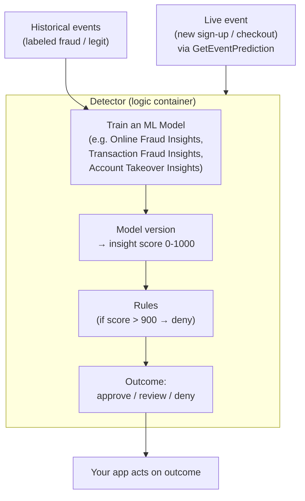

```mermaid
flowchart LR
    subgraph DATA["Your data (datasets in a Dataset Group)"]
        U["Users<br/>(demographics)"]
        I["Items<br/>(metadata)"]
        E["Interactions<br/>(clicks / buys)"]
    end

    DATA --> IMPORT["Import: S3 batch<br/>or PutEvents stream"]
    IMPORT --> RECIPE["Choose a Recipe<br/>(User-Personalization,<br/>Similar-Items,<br/>Personalized-Ranking)"]
    RECIPE --> TRAIN["Train a Solution<br/>+ Solution Version (model)"]
    TRAIN --> DEPLOY["Deploy a Campaign<br/>(real-time endpoint)"]

    APP["Your app / website"] -->|"GetRecommendations<br/>(userId)"| DEPLOY
    DEPLOY -->|"ranked item list"| APP
    APP -->|"live clicks via<br/>Event Tracker"| TRACK["PutEvents"]
    TRACK -.->|"keeps recs fresh<br/>+ cold-start"| DEPLOY
```

# Amazon Personalize & Amazon Fraud Detector

Two managed AWS AI services that put Amazon's own machine learning in your hands with little-to-no ML expertise: **Amazon Personalize** (real-time recommendations — the tech behind Amazon.com's "recommended for you") and **Amazon Fraud Detector** (real-time online-fraud detection). Both appear on **AIF-C01** and **MLA-C01** as recognize-the-use-case services.

> **How to study this page:** for the exam you mostly need the **trigger phrase → service** mapping and the core vocabulary of each. Both are covered below with their own full section.

---

# Part 1 — Amazon Personalize

**Amazon Personalize is a fully managed service that lets developers build applications with the same real-time, individualized recommendation technology used by Amazon.com — without needing machine-learning expertise.** ([What is Amazon Personalize](https://docs.aws.amazon.com/personalize/latest/dg/what-is-personalize.html))

## 🧠 Mental model

Think of Personalize as **"Amazon.com's recommendation brain, rented by the API."**

You give it three things it's hungry for:
1. **Who your users are** (Users dataset — demographics, membership tier).
2. **What your items are** (Items dataset — category, price, genre, description).
3. **What users did** (Interactions dataset — clicks, views, purchases, ratings). **This is the most important dataset.**

You pick a **recipe** (a pre-built algorithm for a recommendation *use case*), Personalize trains a private model on *your* data, and you deploy it. Then your app asks "what should I show **this** user **right now**?" and gets a ranked, personalized list back in real time. As new clicks stream in via the **event tracker**, recommendations stay fresh — even adjusting within a single session.

---

## What it does

**Datasets** (grouped in a **Dataset Group**): ([Datasets and schemas](https://docs.aws.amazon.com/personalize/latest/dg/how-it-works-dataset-schema.html))

| Dataset | Holds | Notes |
|---|---|---|
| **Interactions** | User–item events (view, click, purchase, watch). | **Required and most influential.** Behavioral signal. |
| **Users** | User metadata (age, gender, tier, location). | Optional; improves personalization. |
| **Items** | Item metadata (category, price, genre, description). | Optional; key for **cold-start** on new items. |

**Recipes** — pre-built algorithms chosen by *use case*: ([Choosing a recipe](https://docs.aws.amazon.com/personalize/latest/dg/working-with-predefined-recipes.html))

| Recipe | Use case | "If you see…" |
|---|---|---|
| **User-Personalization** (and **User-Personalization-v2**) | "Recommended for **you**" — personalized items per user; handles **cold-start** via item metadata + exploration. | *Homepage / feed recommendations* |
| **Similar-Items** (RELATED_ITEMS; also **Semantic-Similarity**) | "Customers who viewed this also viewed…" — items related to a given item. | *Product-detail-page "similar to this"* |
| **Personalized-Ranking** (and **-v2**) | Re-rank a *supplied* list of items in the best order for one user. | *Re-order search results / a curated collection for a user* |
| **Trending-Now / Popularity-Count** | Trending or most-popular items (non-personalized baseline). | *"Trending now" shelves* |

> **v2 recipes** (User-Personalization-v2, Personalized-Ranking-v2) use a **Transformer-based architecture**, scale to **up to 5 million items**, and give lower-latency, more relevant results.

**Key concepts:**

- **Solution / Solution Version** — a "solution" is the training configuration (dataset group + recipe); training it produces a **solution version** = the actual trained model.
- **Campaign** — a **real-time** deployment of a solution version (an inference endpoint your app calls with `GetRecommendations`). You provision minimum throughput (**TPS**).
- **Batch inference job** — generate recommendations for many users offline to S3 (no live campaign needed).
- **Event tracker + `PutEvents`** — streams **live** interactions so recommendations adapt in real time and within a session (**real-time personalization**).
- **Cold-start** — recommend **new users** (via exploration) and **new items** (via item metadata) that have little or no interaction history — a headline Personalize capability.
- **Filters** — business rules to include/exclude items (e.g., "don't recommend already-purchased," "in-stock only").
- **Recommenders (domain dataset groups)** — pre-optimized use cases for **e-commerce** and **video-on-demand** domains (e.g., "Recommended for you", "Most viewed") with less configuration.

**Common use cases:** product recommendations, personalized re-ranking of search/catalog, "frequently bought together," personalized marketing emails/notifications, video/content recommendations.

## When to use it (and vs alternatives)

| If you need… | Pick | Why |
|---|---|---|
| **Individualized recommendations / personalization** for users, in real time, no ML team | **Amazon Personalize** | Managed, Amazon.com-grade recommender; recipes + cold-start built in |
| Full control to build a **custom recommender / ranking model** yourself | **Amazon SageMaker AI** | You own the algorithm, features, infra |
| **Enterprise search / Q&A over documents** (not item recs) | **Amazon Kendra** / **Amazon Q** | Retrieval and search, not behavioral recommendations |
| **Semantic similarity via embeddings** in a general app | **Bedrock embeddings + vector store** | When you want raw embeddings, not a turnkey recommender |

## Pricing model

Pay-per-use, no minimums. Dimensions (v2 "Enhanced custom" recipes shown; **verify current** on the docs): ([Amazon Personalize pricing](https://aws.amazon.com/personalize/pricing/))

| Dimension | Price (verify) |
|---|---|
| **Data ingestion** | **$0.05 per GB** uploaded |
| **Training** (v2 recipes) | **$0.002 per 1,000 interactions** ingested for training |
| **Inference** (real-time + batch, v2) | **$0.15 per 1,000 recommendation requests** |
| **Legacy custom recipes** | Training **$0.24/hr**; real-time recommendations **tiered ~$0.0556 → $0.0139 per 1,000** |

> Real-time **campaigns** provision a minimum throughput (≈1 TPS) that you pay for while active. Exam-wise, know the *model* (ingestion + training + inference), not the cents.

## 🎯 On the exam (Personalize)

**Reflexes:**
- "**Recommendations / personalization / recommended for you**" → **Amazon Personalize.** Signature phrase.
- "Same technology as **Amazon.com**" → **Personalize.**
- "**Customers who bought/viewed this also…**" → **Similar-Items** recipe.
- "**Re-rank** a list of items for a specific user" → **Personalized-Ranking** recipe.
- "Recommend to **brand-new users / new items** with no history" → **cold-start** (User-Personalization).
- "Keep recommendations **fresh in real time / within a session**" → **event tracker + PutEvents**.

**Traps:**
- The **Interactions** dataset is the required, most important input — Users/Items are optional enhancers. A question saying "we only have a catalog, no user behavior" is a hint that results will be limited (cold-start territory).
- **Personalize ≠ Kendra/Q.** Kendra/Q = document search/Q&A; Personalize = behavioral item recommendations.
- **Campaign** = real-time endpoint; **batch inference job** = offline bulk to S3. Pick batch when there's no live latency need.

> ***If you see recommendations or personalization → Amazon Personalize.***

---

# Part 2 — Amazon Fraud Detector

**Amazon Fraud Detector is a fully managed service that uses machine learning — built on 20+ years of Amazon fraud-detection experience — to identify potentially fraudulent online activities such as payment fraud, account takeover, and fake account creation, with no ML expertise required.** ([What is Amazon Fraud Detector](https://docs.aws.amazon.com/frauddetector/latest/ug/what-is-frauddetector.html))

> ⚠️ **Important (2025+):** **Amazon Fraud Detector is closed to new customers.** For new builds AWS points to **Amazon SageMaker AI**, **AutoGluon**, and **AWS WAF**. It still appears on exams, so know the concepts and the trigger phrase. ([Fraud Detector pricing / status](https://aws.amazon.com/fraud-detector/pricing/))

## 🧠 Mental model

Think of Fraud Detector as **"Amazon's fraud team, packaged as an API."** You describe a business event you want to check (a sign-up, a checkout), feed it historical examples labeled fraud / legit, and Amazon trains a private fraud model on *your* data plus Amazon's own fraud intelligence. At runtime you send an event and get back a **risk score (0–1000)** plus a rule-driven **outcome** (approve / review / deny).

---

## What it does

**Core concepts:** ([Core concepts and terms](https://docs.aws.amazon.com/frauddetector/latest/ug/frauddetector-ml-concepts.html))

| Concept | What it is |
|---|---|
| **Event type** | Defines the **structure of the business activity** you evaluate (its variables, entity type, labels). E.g., an `account_registration` or `transaction` event. |
| **Variables / entities / labels** | **Variables** = data fields you send (email, IP, amount). **Entity** = who performed it (a customer). **Labels** classify historical events as fraud or legit. |
| **Model** | A trained ML model tied to a **model type** that picks algorithms/enrichments for a fraud kind: **Online Fraud Insights** (little historical data), **Transaction Fraud Insights** (card-not-present / payment fraud), **Account Takeover Insights** (login/ATO). |
| **Insight score** | Model output from **0 (least risky) to 1000 (most risky)**, quantifying fraud risk. Comes with **prediction explanations** showing each variable's impact. |
| **Rules** | If/then logic on the score and variables → outcomes, e.g. `$insightscore > 900 → deny`. Evaluated by a **rule execution mode** (first-matched or all-matched). |
| **Outcomes** | The results a rule returns (e.g., `approve`, `review`, `block`). |
| **Detector / detector version** | The container that combines the **model + rules** into deployable fraud-detection logic. |
| **`GetEventPrediction`** | Real-time API: send a live event, get score + outcomes back. Batch predictions also supported. |

**What it detects:** new-account fraud (**fake accounts**), **payment/transaction fraud** (card-not-present), **account takeover**, loyalty/promo abuse, guest checkout fraud.

## When to use it (and vs alternatives)

| If you need… | Pick | Why |
|---|---|---|
| **Detect online fraud** (payments, sign-ups, ATO) with **little ML expertise** | **Amazon Fraud Detector** *(existing customers)* | Turnkey ML + rules + Amazon fraud intelligence; **no model building** |
| A **new** fraud build (Fraud Detector is closed to new customers) | **Amazon SageMaker AI** / **AutoGluon** | Build/host a custom fraud classifier yourself |
| Block **web/bot/DDoS** and application-layer attacks at the edge | **AWS WAF** (+ Bot Control / Fraud Control) | Network/request-layer protection, not transaction risk scoring |
| **General anomaly detection** on metrics/streams | **SageMaker Random Cut Forest** / CloudWatch anomaly detection | Not fraud-specific labeled events |

## Pricing model

Pay-per-use, no minimums (verify — service is closed to new customers): ([Amazon Fraud Detector pricing](https://aws.amazon.com/fraud-detector/pricing/))

| Dimension | Price (verify) |
|---|---|
| **Fraud prediction — ML model** (Online/Transaction Fraud Insights) | **$0.03** per prediction (first 100k/mo), then **$0.0075** |
| **Fraud prediction — Account Takeover Insights** | **$0.001** per prediction (first 10M/mo), then lower tiers |
| **Fraud prediction — rules only** | **$0.005** per prediction (first 400k/mo), then lower tiers |
| **Model training** | **$0.39 per hour** |
| **Model hosting** | **$0.06 per hour** |
| **Data storage** | **$0.10 per GB** |

> Key exam takeaway on pricing: **ML-model predictions cost more than rules-only predictions**, and you pay for **training + hosting + per-prediction**.

## 🎯 On the exam (Fraud Detector)

**Reflexes:**
- "**Detect online fraud** with **little/no ML expertise**" → **Amazon Fraud Detector.** Signature phrase.
- "**Account takeover / fake accounts / payment (card-not-present) fraud**" → **Fraud Detector** (matching the Insights model types).
- "**Risk score** per event + **rules** to approve/review/deny" → Fraud Detector's **insight score (0–1000)** + **detector rules**.
- "Uses **Amazon's own fraud experience**" → Fraud Detector.

**Traps:**
- **Fraud Detector vs SageMaker:** if the scenario stresses **no ML expertise / managed**, it's Fraud Detector; if it stresses **custom model / full control**, it's SageMaker. (Also recall: new builds must use SageMaker/AutoGluon since Fraud Detector is closed to new customers.)
- **Fraud Detector vs AWS WAF:** WAF blocks **web/bot/DDoS traffic** at the request layer; Fraud Detector scores **business events** (transactions, sign-ups) for fraud risk. "Block bad HTTP requests / bots" → WAF, not Fraud Detector.
- **Fraud Detector vs GuardDuty / Macie:** those protect **AWS account/data security**, not customer transaction fraud.
- Score direction: **0 = least risky, 1000 = most risky** (higher = more fraud).

> ***If you see detect online fraud with little ML expertise → Amazon Fraud Detector.***

---

---

## Glossary

| Term | Simple explanation | Purpose |
|---|---|---|
| Amazon Personalize | Fully managed AWS service that delivers real-time individualized recommendations | Lets any developer add Amazon.com-quality recommendations without ML expertise |
| Dataset Group | Container that holds all related datasets for one Personalize use case | Organizes Users, Items, and Interactions data for a single recommendation system |
| Interactions dataset | Records of what users did — clicks, views, purchases, ratings | The most important and required input; provides the behavioral signal for training |
| Users dataset | Optional metadata about each user (age, membership tier, location) | Enriches personalization beyond behavior alone |
| Items dataset | Optional metadata about each item (category, price, genre) | Enables cold-start recommendations for new items |
| Recipe | A pre-built algorithm in Personalize tied to a specific recommendation use case | Abstracts ML algorithm selection so you pick by goal, not by math |
| User-Personalization | Recipe that generates a ranked "recommended for you" list per user | Handles homepage/feed recommendations and cold-start via item exploration |
| Similar-Items | Recipe that returns items related to a given item | Powers "customers who viewed this also viewed" product-detail shelves |
| Personalized-Ranking | Recipe that re-ranks a supplied list of items for a specific user | Personalizes search results or curated collections for each visitor |
| Trending-Now / Popularity-Count | Non-personalized recipes that surface trending or most-popular items | Provides a popularity baseline for users with no interaction history |
| Transformer-based architecture | Deep-learning design (used in v2 recipes) that captures context across sequences | Enables higher relevance and scales to up to 5 million items |
| Solution | The training configuration pairing a dataset group with a recipe | Defines how a model will be trained; not the model itself |
| Solution Version | The actual trained model produced by running a Solution | The artifact you deploy to serve recommendations |
| Campaign | A live real-time endpoint (inference deployment) of a Solution Version | What your app calls with GetRecommendations to get ranked item lists |
| TPS | Transactions Per Second — minimum throughput provisioned for a Campaign | Determines baseline latency and cost of a real-time recommendation endpoint |
| Batch inference job | Generates recommendations offline for many users at once and writes to S3 | Cost-effective alternative to a live Campaign when real-time latency isn't needed |
| Event Tracker | Personalize component that receives live user events via PutEvents | Keeps recommendations fresh in real time, including within a single session |
| PutEvents | API call that streams a live user interaction to Personalize | Updates the model's context so it adapts to what the user just did |
| Cold-start | The challenge of recommending to new users or new items with no history | Personalize handles it via item metadata exploration and User-Personalization |
| Filters | Business rules applied to recommendations to include or exclude items | Ensures excluded (already-purchased, out-of-stock) items are not surfaced |
| Recommenders | Pre-optimized use cases (e-commerce, video-on-demand) with minimal configuration | Faster setup for standard domains without choosing recipes manually |
| Amazon Fraud Detector | Fully managed ML service for detecting online fraud using Amazon's fraud expertise | Scores business events (sign-ups, checkouts) for fraud risk with no ML team needed |
| Event type | Schema defining the structure of a business event being evaluated for fraud | Tells Fraud Detector what fields to expect (email, IP, amount, etc.) |
| Variables | Data fields sent per event (e.g., email address, IP, transaction amount) | Feature inputs the ML model uses to compute a fraud risk score |
| Entity | Who performed the business event (e.g., a customer) | Provides identity context for the fraud model |
| Labels | Classification tags on historical events marking them as fraud or legitimate | Supervised training signal that teaches the model what fraud looks like |
| Online Fraud Insights | Fraud Detector model type suited for events with limited historical data | Good starting point when labeled fraud samples are scarce |
| Transaction Fraud Insights | Fraud Detector model type for card-not-present payment fraud | Specialized for e-commerce checkout and payment scenarios |
| Account Takeover Insights | Fraud Detector model type for login and account compromise fraud | Detects when a bad actor gains control of a legitimate user account |
| Insight score | A 0–1000 numeric output from a Fraud Detector model (higher = more risky) | Quantifies fraud risk so rules can decide to approve, review, or deny |
| Rules | If-then logic applied to insight scores and variables to produce outcomes | Lets business teams configure thresholds without touching the ML model |
| Outcomes | The result labels a rule returns (approve, review, block) | Drive your application's response to each scored event |
| Detector | The container combining a trained model and rules into deployable fraud logic | The unit you version and deploy for a particular fraud-detection scenario |
| GetEventPrediction | Real-time API that submits a live event and returns a score plus outcomes | The runtime call your application makes to check each transaction or sign-up |
| AutoGluon | Open-source AutoML library AWS recommends for new fraud-detection builds | Replacement option for Amazon Fraud Detector which is now closed to new customers |
| AWS WAF | Web Application Firewall — blocks bad HTTP requests, bots, and DDoS at the edge | Network/request-layer protection; not for scoring transaction fraud risk |
| Random Cut Forest | SageMaker unsupervised anomaly-detection algorithm | Used for general metric/stream anomaly detection, not labeled fraud classification |

## References

**Amazon Personalize**
- [What is Amazon Personalize?](https://docs.aws.amazon.com/personalize/latest/dg/what-is-personalize.html)
- [Datasets and schemas](https://docs.aws.amazon.com/personalize/latest/dg/how-it-works-dataset-schema.html)
- [Choosing a recipe](https://docs.aws.amazon.com/personalize/latest/dg/working-with-predefined-recipes.html)
- [User-Personalization-v2 recipe](https://docs.aws.amazon.com/personalize/latest/dg/native-recipe-user-personalization-v2.html)
- [Personalized-Ranking-v2 recipe](https://docs.aws.amazon.com/personalize/latest/dg/native-recipe-personalized-ranking-v2.html)
- [Recording real-time events (event tracker)](https://docs.aws.amazon.com/personalize/latest/dg/recording-events.html)
- [Amazon Personalize pricing](https://aws.amazon.com/personalize/pricing/)

**Amazon Fraud Detector**
- [What is Amazon Fraud Detector?](https://docs.aws.amazon.com/frauddetector/latest/ug/what-is-frauddetector.html)
- [Core concepts and terms](https://docs.aws.amazon.com/frauddetector/latest/ug/frauddetector-ml-concepts.html)
- [Model scores (insight scores)](https://docs.aws.amazon.com/frauddetector/latest/ug/model-scores.html)
- [Amazon Fraud Detector features](https://aws.amazon.com/fraud-detector/features/)
- [Amazon Fraud Detector pricing (and new-customer status)](https://aws.amazon.com/fraud-detector/pricing/)
