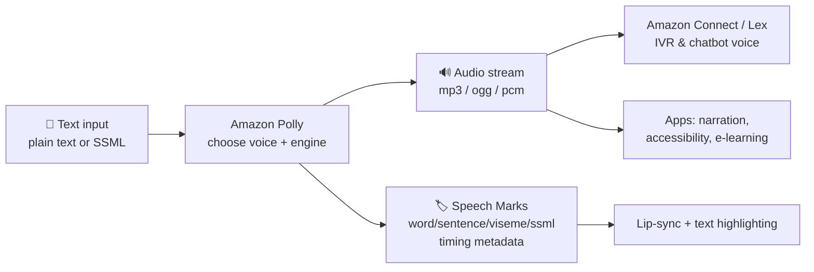

# Amazon Polly

Amazon Polly is AWS's fully managed **text-to-speech (TTS)** service that turns **written text into lifelike spoken audio** across dozens of languages and voices.

> **The one reflex:** *If you see "text-to-speech" / "text → voice/audio" / "give it a human voice" → **Amazon Polly**.*

## 🧠 Mental model

Think of Polly as a **professional voice-over artist on demand**. You hand it a script (plain text or marked-up with SSML), pick a voice and an engine (from robotic-but-cheap to studio-quality), and it reads it aloud in natural-sounding speech. It's the mirror image of Transcribe: Transcribe *listens and writes*; Polly *reads and speaks*.

## Input → Output

| Input | What Polly returns |
|-------|--------------------|
| Plain text | Synthesized audio stream (mp3 / ogg / pcm / µ-law / a-law) |
| Text + SSML markup | Audio with controlled pauses, emphasis, pitch, pronunciation |
| Text + request Speech Marks | JSON timing metadata (word/sentence/viseme/ssml marks) |
| Long document (async) | Audio delivered to an **S3 bucket** (optional SNS notify) |

## What it does

**Voice engines** (quality/cost tiers)
- **Standard** — original concatenative TTS; cheapest, more "synthetic." `$4 / 1M chars`.
- **Neural (NTTS)** — deep-learning voices; noticeably more natural. `$16 / 1M chars`.
- **Long-form** — optimized for **longer content** (articles, training, audiobooks); expressive and engaging over long passages. `$100 / 1M chars`.
- **Generative** — the most **human-like, emotionally engaged, conversational** voices (great for assistants and agents). `$30 / 1M chars`.
- *Not every voice exists on every engine* — Neural/Generative offer a curated set of higher-quality voices.

**Control & pronunciation**
- **SSML (Speech Synthesis Markup Language)** — W3C-standard XML markup to control pauses (`<break>`), emphasis, pitch/rate/volume (`<prosody>`), whispering, spelling out, saying dates/numbers, and phonetic pronunciation (`<phoneme>`).
- **Lexicons (custom pronunciation)** — upload a pronunciation lexicon so Polly says acronyms, brand names, or internal jargon correctly *without* editing every request.

**Timing metadata**
- **Speech Marks** — instead of (or alongside) audio, Polly returns JSON metadata with timing: **word**, **sentence**, **SSML**, and **viseme** marks. Used for **highlighting text as it's spoken** and **lip-syncing** avatars/characters (visemes = mouth shapes per phoneme).

**Delivery modes**
- **Real-time streaming** (`SynthesizeSpeech`) — low-latency audio for interactive apps; up to **6,000 characters** per request (3,000 billable). Formats: mp3, ogg_vorbis, ogg_opus, pcm, µ-law, a-law.
- **Asynchronous long audio** (`StartSpeechSynthesisTask`) — for large text up to **200,000 characters** (100,000 billable); Polly processes in the background and **writes the audio to S3**, optionally notifying via **SNS**.

**Common use cases**
- **IVR & contact centers** — natural prompts and dynamic responses in **Amazon Connect** / **Amazon Lex** voice bots.
- **Accessibility** — read-aloud for visually impaired users; screen-reader-style narration.
- **Content narration** — articles, e-learning, audiobooks, news, and video voice-overs.
- **Notifications & assistants** — spoken alerts, IoT device speech, virtual agents.

**Pairs well with**
- **Amazon Lex** — Lex handles the conversation (NLU/intents); Polly gives the bot its **voice** in speech interactions.
- **Amazon Connect** — out-of-the-box IVR; Polly voices prompts and responses (often via Lex in the contact flow).
- **Amazon Translate + Polly** — translate text, then speak it in the target language.

## When to use it (and vs alternatives)

| If you need… | Use |
|--------------|-----|
| Convert text into spoken audio | **Amazon Polly** |
| Most natural, conversational voice (assistant/agent) | Polly **Generative** engine |
| Long articles / audiobooks / training | Polly **Long-form** engine |
| Good quality at moderate cost | Polly **Neural** engine |
| Cheapest voice, quality less critical | Polly **Standard** engine |
| Precise pauses, emphasis, custom pronunciation | **SSML** + **lexicons** |
| Highlight/animate in sync with speech (lip-sync) | **Speech Marks** (visemes) |
| Speech → **text** (the reverse) | **Amazon Transcribe** (not Polly) |
| Understand meaning of text (sentiment/entities) | **Amazon Comprehend** (not Polly) |
| Conversational bot logic / intents | **Amazon Lex** (Polly supplies the voice) |

**Quick disambiguation**
- Text → speech = **Polly**. Speech → text = **Transcribe**. They are opposites.
- Polly makes the **sound**; **Lex** decides **what to say** and understands the user.

## Pricing model

Billed **per character** of input text (per 1 million characters), by **engine**. SSML tags are **not** counted toward billed characters. Rates below are US East (regional variation applies).

| Engine | Rate | 12-month free tier (chars/month) |
|--------|------|----------------------------------|
| Standard | $4.00 / 1M chars | 5,000,000 |
| Neural | $16.00 / 1M chars | 1,000,000 |
| Generative | $30.00 / 1M chars | 100,000 |
| Long-form | $100.00 / 1M chars | 500,000 |

- **Speech Marks requests are billed the same as speech** requests (per character).
- Real-time `SynthesizeSpeech`: 3,000 billable chars/request; async `StartSpeechSynthesisTask`: up to 100,000 billable chars.
- **Standard free tier is 5M chars/month**; Neural/Generative/Long-form free tiers apply for the **first 12 months**.

*Confirm current per-region rates — see References.*

## 🎯 On the exam

**Reflexes**
- **"Text-to-speech" / "convert text to audio" / "give the app/IVR a voice" → Amazon Polly.** (Highest-yield trigger.)
- **"Most natural / conversational / human-like voice"** → Polly **Generative** engine.
- **"Long articles / audiobooks / narration"** → Polly **Long-form** engine.
- **"Better than robotic, reasonable cost"** → Polly **Neural** engine.
- **"Control pauses, emphasis, pronunciation, whisper, say-as"** → **SSML**.
- **"Fix pronunciation of brand names / acronyms globally"** → **custom lexicons**.
- **"Highlight text as it's read" / "lip-sync an avatar"** → **Speech Marks** (visemes).
- **"Long text → audio file in S3, processed in background"** → **StartSpeechSynthesisTask (async)** delivering to S3 (+ SNS).
- **"IVR / contact-center voice prompts"** → **Polly with Amazon Connect / Amazon Lex**.

**Traps**
- Polly ≠ Transcribe. Polly is **text → speech**; Transcribe is **speech → text**. Don't pick Polly to transcribe a call.
- Polly ≠ Lex. **Lex** = conversation logic (intents, NLU); **Polly** = the voice that speaks. For a *voice chatbot* you often use **both** (and Connect for telephony).
- **Engine choice is a cost/quality trade-off** — Long-form is the most expensive per character; Generative is for the most natural conversational feel. Match the engine to the use case, not just "best."
- **SynthesizeSpeech has a character limit** (6,000 total / 3,000 billable). For long documents, use the **async** `StartSpeechSynthesisTask` (to S3) — a real-time single call won't fit.
- SSML characters are **not billed**; you're charged on the spoken text.

**If you see X, pick this**
| You see… | Pick |
|----------|------|
| "text to speech," "read aloud," "voice from text" | **Amazon Polly** |
| "natural/conversational voice," "AI agent voice" | Polly **Generative** |
| "audiobook / long article narration" | Polly **Long-form** |
| "control pronunciation/pauses/emphasis" | **SSML** |
| "pronounce brand names/acronyms correctly" | **lexicons** |
| "sync highlighting or lip movement" | **Speech Marks / visemes** |
| "long text → S3 audio file async" | **StartSpeechSynthesisTask** |
| "IVR / voice bot prompts" | **Polly + Connect / Lex** |

## References

- Amazon Polly — product page: https://aws.amazon.com/polly/
- Amazon Polly Features: https://aws.amazon.com/polly/features/
- Amazon Polly Pricing: https://aws.amazon.com/polly/pricing/
- How Amazon Polly works: https://docs.aws.amazon.com/polly/latest/dg/how-text-to-speech-works.html
- SynthesizeSpeech API: https://docs.aws.amazon.com/polly/latest/dg/API_SynthesizeSpeech.html
- StartSpeechSynthesisTask (long audio, async): https://docs.aws.amazon.com/polly/latest/dg/API_StartSpeechSynthesisTask.html
- Speech marks: https://docs.aws.amazon.com/polly/latest/dg/speechmarks.html
- Visemes and Amazon Polly: https://docs.aws.amazon.com/polly/latest/dg/viseme.html
- Amazon Polly FAQs: https://aws.amazon.com/polly/faqs/
