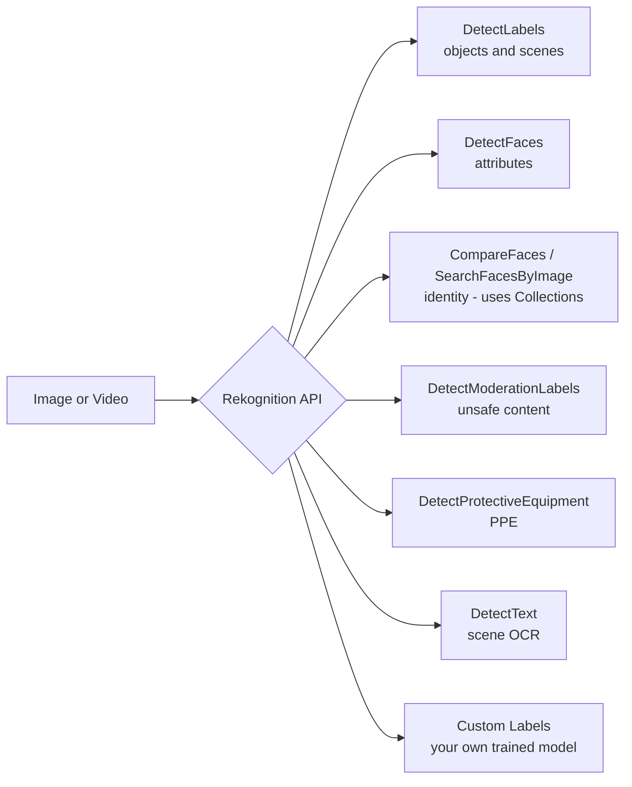

# Amazon Rekognition

**Amazon Rekognition is a managed computer-vision service that analyzes images and videos** — detecting objects, scenes, faces, text, unsafe content, and PPE — with no ML experience required. ([What is Rekognition](https://docs.aws.amazon.com/rekognition/latest/dg/what-is.html))

---

## 🧠 Mental model

Think of Rekognition as **a very fast, tireless security-guard-plus-photo-librarian looking at pictures and video**. Show it a photo and it tells you *what's in the scene* ("dog, beach, sunset"), *who is in it* (face match against your roster), *whether it's safe to show* (moderation), and *whether the worker is wearing a hard hat* (PPE). It reads the **words printed on things in a scene** (a street sign, a jersey number, a license plate) — but it is **not** the tool for reading a scanned contract or a tax form. That job belongs to **Textract**.

> The single most tested confusion on both exams: **Rekognition = photos and scenes and faces; Textract = documents.** ([Rekognition text detection](https://docs.aws.amazon.com/rekognition/latest/dg/text-detection.html))

| Input | Rekognition returns |
|-------|---------------------|
| Image (S3 object or bytes) | Labels, bounding boxes, faces + attributes, celebrities, moderation labels, PPE, scene text |
| Stored video (S3) | Async job → labels, shots, faces, moderation, people tracking over time |
| Streaming video (Kinesis Video Streams) | Real-time face search / connected-home label events |
| Face collection (your gallery) | Face vectors you index once, then search/compare against |

---

## What it does

**Image analysis (Group 2 detection APIs)**
- **Label / object / scene detection** (`DetectLabels`) — objects, scenes, activities, plus bounding boxes and image properties (dominant colors, sharpness, brightness). ([Labels](https://docs.aws.amazon.com/rekognition/latest/dg/labels.html))
- **Facial analysis** (`DetectFaces`) — per-face attributes: bounding box, age range, emotions, eyes open, glasses, pose, quality. ([Faces](https://docs.aws.amazon.com/rekognition/latest/dg/faces.html))
- **Text-in-image / scene OCR** (`DetectText`) — reads words *within a scene* (signs, product labels, jersey numbers). Optimized for short bursts of text, not dense documents. ([Text detection](https://docs.aws.amazon.com/rekognition/latest/dg/text-detection.html))
- **Content moderation** (`DetectModerationLabels`) — flags explicit, suggestive, violent, or otherwise unsafe content using a hierarchical taxonomy; **Custom Moderation** lets you fine-tune with your own examples. ([Moderation](https://docs.aws.amazon.com/rekognition/latest/dg/moderation.html))
- **PPE detection** (`DetectProtectiveEquipment`) — detects face covers, hand covers, and head covers on people in an image (workplace safety). ([PPE](https://docs.aws.amazon.com/rekognition/latest/dg/ppe-detection.html))
- **Celebrity recognition** (`RecognizeCelebrities`) — identifies well-known public figures. ([Celebrities](https://docs.aws.amazon.com/rekognition/latest/dg/celebrities.html))

**Identity — face comparison & search (Group 1 + Collections)**
- **Face comparison** (`CompareFaces`) — similarity between two faces in two images; no storage needed.
- **Collections** — you `IndexFaces` to store **face vectors** (mathematical templates, not the images) in a searchable container, then `SearchFacesByImage` / `SearchFaces` to find matches. This powers "is this person in our gallery?" use cases. ([Collections](https://docs.aws.amazon.com/rekognition/latest/dg/collections.html))
- **Face Liveness** (`StartFaceLivenessSession`) — detects a real, present user vs. a spoof (photo/replay) during onboarding.

**Video analysis**
- **Stored video** — async jobs (`StartLabelDetection`, `StartFaceSearch`, `StartContentModeration`, `StartSegmentDetection` for shots) that return results with timestamps; completion is signaled via Amazon SNS. ([Stored video](https://docs.aws.amazon.com/rekognition/latest/dg/video.html))
- **Streaming video events** — real-time processing off **Kinesis Video Streams** for connected-home labels (person/pet/package) and live face search. ([Streaming](https://docs.aws.amazon.com/rekognition/latest/dg/streaming-video.html))

**Custom Labels (Rekognition Custom Labels)**
- Train a model to detect **your** objects/logos/defects using AutoML — as few as ~10 labeled images to start; you pay for training hours and per-hour inference while the model is running. Use when the built-in labels don't cover your niche (e.g., "our brand's logo," "cracked circuit board"). ([Custom Labels](https://docs.aws.amazon.com/rekognition/latest/customlabels-dg/what-is.html))

---

## When to use it (and vs alternatives)

| You need to… | Use | Not this |
|---|---|---|
| Detect objects/scenes/faces in a **photo** | **Rekognition** image APIs | Textract (documents only) |
| Read text **printed in a scene** (sign, jersey, label) | **Rekognition** `DetectText` | Textract (dense scanned docs) |
| Read text/forms/tables from a **scanned document** | **Textract** | Rekognition |
| Search "is this person in our roster?" | **Rekognition Collections** (`IndexFaces` + `SearchFaces`) | CompareFaces (only 2 images, no gallery) |
| Compare exactly **two** faces | **Rekognition** `CompareFaces` | Collections (overkill) |
| Flag unsafe images/video | **Rekognition** content moderation | Comprehend (text sentiment, not images) |
| Detect **your custom** object/logo/defect | **Rekognition Custom Labels** | SageMaker (only if you need full control) |
| Full control over CV model + architecture | **SageMaker** (build/train your own) | Rekognition (managed, less flexible) |
| Analyze **live** camera feeds | **Rekognition Streaming** (Kinesis Video Streams) | Stored-video APIs |

**Rekognition vs. Textract (the classic exam trap):** Rekognition's `DetectText` reads *incidental scene text* and is tuned for short strings in photos/video. **Textract** is purpose-built for **documents** — preserving forms (key-value pairs), tables, reading order, and confidence scores. If the source is a scanned form, invoice, ID, or PDF, the answer is Textract, even though "detect text" appears in both. ([Textract vs Rekognition guidance](https://docs.aws.amazon.com/textract/latest/dg/what-is.html))

---

## Pricing model

Pay-as-you-go, no minimums; priced by **image**, **video minute**, **face vector stored**, or **inference/training hour**. Prices below are US East (N. Virginia); verify current rates on the pricing page. ([Rekognition pricing](https://aws.amazon.com/rekognition/pricing/))

| Dimension | Unit | Price (US East, first tier) |
|---|---|---|
| Image – Group 1 (face compare/index/search) | per image | $0.0010 (tiered down to $0.0004) |
| Image – Group 2 (labels, faces, moderation, text) | per image | $0.0010 (tiered down to $0.00025) |
| Image Properties | per image | $0.00075 |
| Stored video – Label Detection | per minute | $0.10 |
| Stored video – Shot (Segment) Detection | per minute | $0.05 |
| Stored video – Content Moderation | per minute | $0.10 |
| Streaming video – Label events | per minute | ~$0.00817 |
| **Face vector storage** (Collections) | per face vector / month | $0.00001 |
| Custom Labels – Training | per training hour | $1.00 |
| Custom Labels – Inference | per inference hour | $4.00 |
| Face Liveness | per check | $0.015 (tiered down) |
| Custom Moderation – Training | per hour | $5.00 |

**Cost reflexes:**
- **Video is billed per minute of footage analyzed** — much pricier per unit than a single image call.
- **Custom Labels bills per inference hour while the model is running**, not per image — you must **start** and **stop** the model. A model left running quietly bills 24×7. This is a frequent "why is my bill high?" scenario.
- Collections cost is dominated by **stored face vectors per month**, not by indexing.

---

## 🎯 On the exam

**Reflexes — if you see X, pick Rekognition:**
- "Analyze **images or video**," "detect **objects/scenes**," "identify **faces**," "**compare** faces," "search a **face collection**," "**celebrity** recognition," "**content moderation** / unsafe images," "**PPE** / hard hats / safety compliance," "detect text **in a photo/scene**," "**custom object/logo** detection" → **Rekognition**.
- "Real-time / **live camera** face search or home security events" → **Rekognition streaming with Kinesis Video Streams**.
- "Detect **our specific** product/logo/defect the built-in labels miss" → **Rekognition Custom Labels**.
- "Verify a **real live person** during KYC onboarding (anti-spoof)" → **Rekognition Face Liveness**.

**Traps:**
- **Rekognition vs Textract.** Both can "detect text." Scene/photo text → Rekognition; **scanned documents, forms, tables, invoices, IDs → Textract.** This is the #1 trap.
- **CompareFaces vs Collections.** Comparing exactly two images → `CompareFaces` (no storage). Searching an image against a **stored gallery of many people** → **Collections** (`IndexFaces` then `SearchFacesByImage`).
- **Rekognition stores face vectors, not photos.** Good answer for a privacy/"we don't retain images" question.
- **Custom Labels ≠ SageMaker.** Custom Labels = managed AutoML for a niche vision task with little data/expertise. Full control over model/architecture → SageMaker.
- **Moderation is for images/video.** Moderating **text**? That's Comprehend (toxicity/PII) or Bedrock Guardrails, not Rekognition.
- **Stored video is asynchronous** — you `Start…`, then poll or wait for an **SNS** notification and `Get…` the results. Don't expect a synchronous response for full videos.

---

---

## Glossary

| Term | Simple explanation | Purpose |
|---|---|---|
| Amazon Rekognition | A managed AWS computer-vision service that analyzes images and videos for objects, faces, text, and unsafe content | Adds visual intelligence to applications without requiring any ML expertise |
| Computer vision | A field of AI that enables computers to interpret and understand visual information from images and video | The underlying technology behind all Rekognition features |
| DetectLabels | A Rekognition API that identifies objects, scenes, activities, and image properties in a photo | Returns a structured list of what is visually present in an image, with confidence scores and bounding boxes |
| Bounding box | A rectangular region that marks exactly where in an image a detected object or face is located | Lets downstream applications highlight, crop, or count specific visual elements |
| DetectFaces | A Rekognition API that finds faces in an image and returns attributes like age range, emotions, and pose | Used for facial analysis without needing to identify who the person is |
| Face attributes | Properties of a detected face such as estimated age range, detected emotions, glasses, and eye openness | Provide demographic or behavioral signals from an image without requiring identity matching |
| CompareFaces | A Rekognition API that measures the similarity between exactly two faces from two separate images | Used for quick one-to-one identity checks without storing any face data |
| Collections | A Rekognition container that stores face vectors (mathematical templates) from indexed images for later searching | Powers "is this person in our database?" use cases at scale by comparing one face against many |
| IndexFaces | A Rekognition API that extracts a face vector from an image and stores it in a Collection | The step that adds a person to your searchable face gallery |
| SearchFacesByImage | A Rekognition API that takes a new photo and finds the closest matching face vectors in a Collection | Enables identity verification or access control by matching an incoming face to stored entries |
| Face vector | A mathematical numerical representation of a face's unique geometry | Stored in Collections instead of actual photos to protect privacy while enabling search |
| Face Liveness | A Rekognition feature that verifies a user is a real live person rather than a photo or video replay | Used in KYC (Know Your Customer) onboarding to prevent spoofing attacks |
| DetectText | A Rekognition API that reads words and phrases appearing within a scene in a photo or video frame | Used for reading text on signs, jerseys, product labels, or license plates in real-world images |
| Scene OCR | Reading incidental text that appears in a photograph, such as a street sign or product label | The distinguishing use case for Rekognition DetectText vs. the document-oriented Textract |
| DetectModerationLabels | A Rekognition API that flags explicit, violent, or otherwise unsafe content in images | Used to screen user-uploaded photos and videos before they are shown to other users |
| Content moderation | The process of automatically detecting and filtering inappropriate visual content | Keeps platforms safe and compliant with content policies at high volume |
| Custom Moderation | A Rekognition feature that lets you fine-tune content moderation with your own examples | Improves accuracy for platform-specific content policies that differ from generic categories |
| DetectProtectiveEquipment (PPE) | A Rekognition API that detects safety equipment like hard hats, face masks, and gloves on people | Automates workplace safety compliance audits using camera footage |
| RecognizeCelebrities | A Rekognition API that identifies well-known public figures in images | Used in media, sports, and entertainment to automatically tag or caption images with celebrity names |
| Stored video analysis | Async Rekognition jobs that process video files stored in S3 and return time-stamped results | Used for offline video analysis where real-time results are not needed |
| Streaming video analysis | Real-time Rekognition processing of live camera feeds via Kinesis Video Streams | Used for live face search, connected-home event detection, and real-time security monitoring |
| Kinesis Video Streams | An AWS service for ingesting, storing, and processing live video from cameras and devices | The required input for Rekognition streaming video analysis |
| Shot detection | A Rekognition stored-video feature that identifies when the camera cuts or scene changes in a video | Used in media and content indexing to segment video into individual shots |
| Rekognition Custom Labels | A Rekognition feature using AutoML that trains a model to detect your specific objects, logos, or defects | Used when the built-in label set doesn't cover your niche use case, requiring only a small labeled dataset |
| AutoML | Automated machine learning that handles model training and optimization for you | Makes building a custom vision model accessible without deep ML expertise |
| SNS (Simple Notification Service) | AWS's managed notification service | Used to alert your application when an async Rekognition video job completes |
| Amazon Textract | AWS's managed document OCR and structured extraction service | The right tool for scanned documents and forms, while Rekognition handles scene images and video |
| Amazon Comprehend | AWS's managed NLP service | Used for moderating or analyzing text content, while Rekognition handles visual content |
| SageMaker | AWS's full ML platform for building and training custom models | The alternative when you need full control over your computer vision model architecture |
| Group 1 APIs | Rekognition's billing category for face comparison and search APIs | Priced per image at a different rate from the Group 2 detection APIs |
| Group 2 APIs | Rekognition's billing category for labels, facial analysis, text detection, and moderation | Priced per image and discounted at higher volume |
| Inference hour | The billing unit for Rekognition Custom Labels while a model is actively running | A running Custom Labels model bills continuously, making it critical to stop the model when idle |

## References

- [What is Amazon Rekognition](https://docs.aws.amazon.com/rekognition/latest/dg/what-is.html)
- [Detecting labels](https://docs.aws.amazon.com/rekognition/latest/dg/labels.html)
- [Detecting and analyzing faces](https://docs.aws.amazon.com/rekognition/latest/dg/faces.html)
- [Searching faces with collections](https://docs.aws.amazon.com/rekognition/latest/dg/collections.html)
- [Comparing faces](https://docs.aws.amazon.com/rekognition/latest/dg/faces-comparefaces.html)
- [Recognizing celebrities](https://docs.aws.amazon.com/rekognition/latest/dg/celebrities.html)
- [Detecting text (scene OCR)](https://docs.aws.amazon.com/rekognition/latest/dg/text-detection.html)
- [Moderating content](https://docs.aws.amazon.com/rekognition/latest/dg/moderation.html)
- [Detecting PPE](https://docs.aws.amazon.com/rekognition/latest/dg/ppe-detection.html)
- [Working with stored videos](https://docs.aws.amazon.com/rekognition/latest/dg/video.html)
- [Streaming video events](https://docs.aws.amazon.com/rekognition/latest/dg/streaming-video.html)
- [Rekognition Custom Labels](https://docs.aws.amazon.com/rekognition/latest/customlabels-dg/what-is.html)
- [Amazon Rekognition pricing](https://aws.amazon.com/rekognition/pricing/)
- [Amazon Rekognition FAQs](https://aws.amazon.com/rekognition/faqs/)
