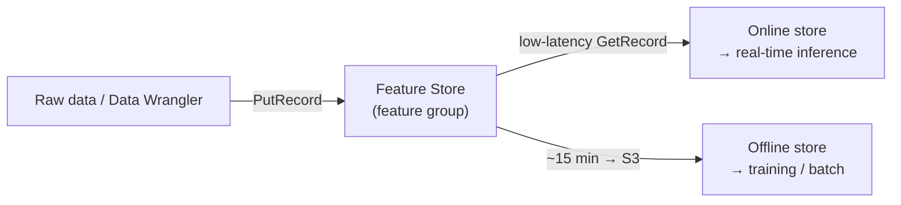
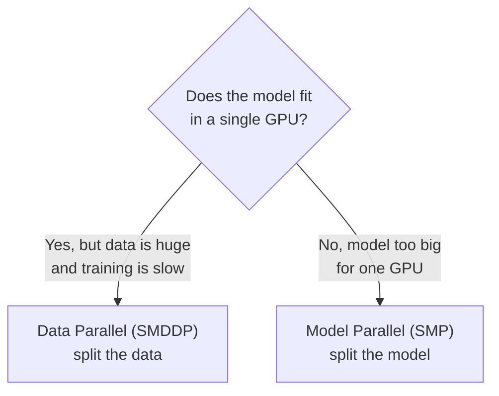
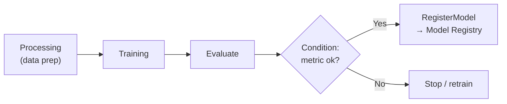
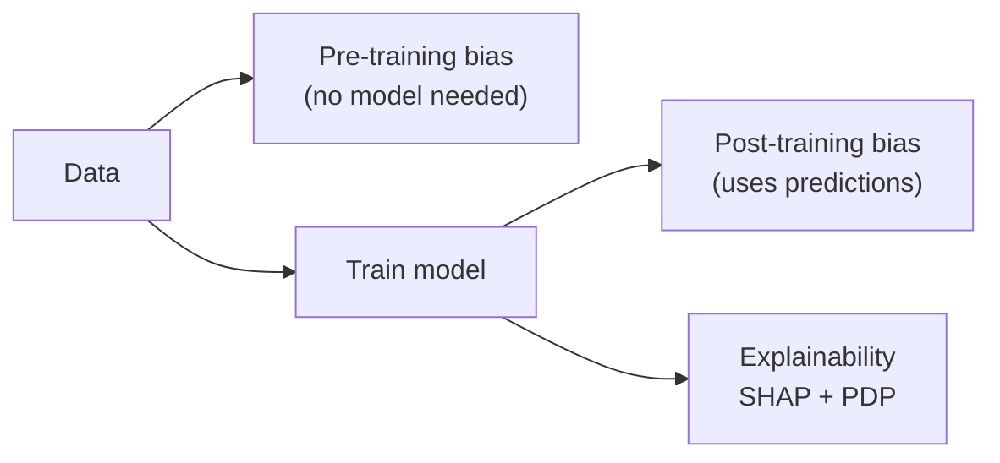
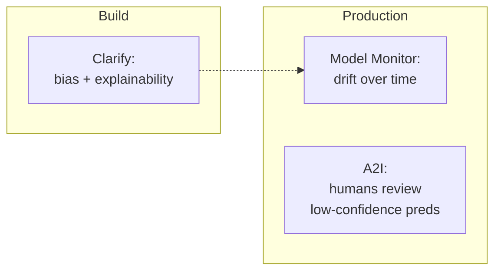

# Amazon SageMaker — Feature & Tooling Reference

> Companion to the main service deep-dive: [**./sagemaker.md**](./sagemaker.md). That page explains *what SageMaker is* and how the platform fits into the ML lifecycle. **This page is the flash-card catalogue** of the individual SageMaker features that appear on **both** the [AIF-C01](https://docs.aws.amazon.com/aws-certification/latest/examguides/ai-practitioner-01.html) and [MLA-C01](https://docs.aws.amazon.com/aws-certification/latest/examguides/machine-learning-engineer-associate-01.html) exams.

Both exams love to hand you a scenario and ask "which SageMaker feature?" The trap is that several features sound alike — **Clarify vs Model Monitor vs A2I**, **Ground Truth vs Ground Truth Plus**, **multi-model vs multi-container endpoints**, **Neo vs Inference Recommender**. Each entry below gives you a one-line mental model, what it does, when to reach for it, and a 🎯 *if you see X, pick this* trigger so you can answer on reflex.

> **AIF-C01** tests these at a "recognize the name and what it's for" depth. **MLA-C01** tests the same features at "know which one, know the parameters, know the gotchas" depth. Where the two diverge, it's called out.

---

## Table of Contents

**Data & features**
- [SageMaker Data Wrangler](#data-wrangler)
- [SageMaker Feature Store](#feature-store)
- [SageMaker Ground Truth (+ Ground Truth Plus)](#ground-truth)
- [SageMaker Processing](#processing)

**Build / train / tune**
- [SageMaker JumpStart](#jumpstart)
- [Built-in algorithms](#builtin-algos)
- [Automatic Model Tuning (AMT)](#amt)
- [SageMaker Experiments](#experiments)
- [SageMaker Debugger](#debugger)
- [Distributed training libraries](#distributed)

**Deploy / manage (MLOps)**
- [SageMaker Model Registry](#model-registry)
- [SageMaker Pipelines](#pipelines)
- [SageMaker Projects](#projects)
- [SageMaker Neo](#neo)
- [Inference Recommender](#inference-recommender)
- [Multi-model & multi-container endpoints](#multi-endpoints)
- [SageMaker Model Cards](#model-cards)

**Responsible AI / monitor**
- [SageMaker Clarify](#clarify)
- [SageMaker Model Monitor](#model-monitor)
- [SageMaker Role Manager](#role-manager)

**Reference**
- [Cheat table](#cheat-table)
- [Clarify vs Model Monitor vs A2I — the distinction that gets tested](#three-way)
- [References](#references)

---

## SageMaker Data Wrangler 

🧠 **Mental model:** the low-code, point-and-click *data-prep GUI* inside SageMaker Studio — "import, clean, transform, and visualize tabular data without writing much code."

**What it does:** Aggregates and prepares data for ML through a visual interface. Import from S3, Athena, Redshift, Snowflake, EMR, and more; apply 300+ built-in transforms (encode, impute, scale, join, flatten); run built-in analyses (data quality report, target leakage, bias via Clarify, quick model preview). It then **exports** the recipe as a runnable artifact — a Jupyter notebook, a **SageMaker Processing** job, a **Pipelines** step, or a **Feature Store** ingestion job.

**When to use it:** Early data exploration and feature engineering when you want speed and a UI over hand-written pandas, and want the resulting steps to be reproducible/production-izable.

🎯 **On the exam:** "visually prepare/transform data with minimal code," "300+ transformations," "detect target leakage / quick-fix data quality," "export prep steps to a Pipeline/Processing job" → **Data Wrangler**. Do not confuse with **Glue DataBrew** (a general-purpose AWS data-prep tool outside SageMaker) — if the scenario is inside SageMaker Studio and feeds an ML flow, pick Data Wrangler.

---

## SageMaker Feature Store 

🧠 **Mental model:** a *central repository for curated features* so training and serving read the exact same feature values — kills training/serving skew.

**What it does:** Stores, shares, and serves ML features organized into **feature groups**. Two backing stores, and you can enable either or both per feature group:

| | **Online store** | **Offline store** |
|---|---|---|
| Purpose | Real-time feature lookup for **inference** | Historical data for **training** & batch |
| Latency | Low-latency, high-availability | Not latency-sensitive |
| Backing | Standard or **InMemory** tier | **S3** (Glue or **Apache Iceberg** table format) |
| Access | `GetRecord` / `PutRecord` API | Query via Athena / read S3 |
| Write behavior | Immediate | `PutRecord` buffered, written to S3 within ~15 min |

When **both** are enabled they sync, so the features you trained on match the features you serve. Data Wrangler can export directly into a feature group.

**When to use it:** Multiple models/teams reuse the same features; you need consistent features across train and serve; you want point-in-time correct historical feature sets.

🎯 **On the exam:** "reuse features across teams/models," "avoid training-serving skew," "real-time feature lookup at inference" → **online store**; "build training dataset from historical features / point-in-time" → **offline store**.

---

## SageMaker Ground Truth (+ Ground Truth Plus) 

🧠 **Mental model:** the *data-labeling* service — turns raw data into labeled **training** datasets using humans (+ automation).

**What it does:**
- **Ground Truth** — you build and manage the labeling job. Choose your **workforce**: Amazon **Mechanical Turk** (public), a **vendor** company, or your **private** (in-house) workforce. Supports **automated data labeling** (active learning): the model auto-labels high-confidence items and routes only the uncertain ones to humans, cutting cost.
- **Ground Truth Plus** — a **turnkey / fully-managed** version. AWS sets up and runs the workflow **for you** with an expert workforce (Amazon-employed or curated vendors), delivering high-quality labels with **no need to build labeling apps or manage a workforce**. Progress tracked via dashboards; can reduce labeling cost up to ~40%.

| | **Ground Truth** | **Ground Truth Plus** |
|---|---|---|
| Who runs it | **You** manage the job & workforce | **AWS** manages it for you (turnkey) |
| Workforce | Mechanical Turk / vendor / private | Expert (Amazon or curated vendors) |
| Effort | Self-service | Hands-off |

**When to use it:** You need labeled data for **training** and either want control (Ground Truth) or want to outsource the whole operation to experts (Ground Truth Plus).

🎯 **On the exam:** "need to label a training dataset" → **Ground Truth**; "no in-house labeling team / want AWS to run labeling end-to-end" → **Ground Truth Plus**; "auto-label the easy ones, send only hard ones to humans" → **automated data labeling (active learning)**. ⚠️ Ground Truth labels **training data** — for human review of **live low-confidence predictions**, that is **[A2I](#three-way)**, not Ground Truth.

---

## SageMaker Processing 

🧠 **Mental model:** *managed, on-demand compute for any pre/post-processing job* — spin up a container, run your data processing / feature engineering / evaluation script, spin it down.

**What it does:** Runs data processing, feature engineering, model evaluation, and batch analysis workloads as managed jobs on ephemeral infrastructure. Bring a built-in container (scikit-learn, Spark, PyTorch, etc.) or your own; SageMaker provisions instances, runs the script against S3 input, writes output to S3, and tears down. It is the compute engine underneath Data Wrangler exports, Clarify jobs, and Model Monitor baseline/analysis jobs.

**When to use it:** Any batch data transformation or model-evaluation step you want managed, reproducible, and pipeline-able — especially as a **step in SageMaker Pipelines**.

🎯 **On the exam:** "run a preprocessing / feature-engineering / model-evaluation script on managed infra as a pipeline step" → **Processing job**. If the answer choices include Glue and the workload is *ML-lifecycle-adjacent inside SageMaker*, Processing is the SageMaker-native answer.

---

## SageMaker JumpStart 

🧠 **Mental model:** the *ML hub* — one-click **pre-trained models** (incl. foundation models) and **end-to-end solution templates** to get started fast.

**What it does:** A machine-learning hub providing:
- **Pre-trained models** you can deploy or **fine-tune** — foundation models (text/image/multimodal) and task models across vision, NLP, tabular.
- **Solution templates** — one-click, end-to-end reference solutions for common use cases (fraud detection, churn, demand forecasting, etc.) that wire up data processing → training → deployment.
- Classical **built-in algorithm** implementations for tabular tasks (XGBoost, LightGBM, CatBoost, scikit-learn, AutoGluon).

**When to use it:** You want to prototype quickly, deploy a pre-trained/foundation model, fine-tune on your own data, or start from a proven solution template rather than building from scratch.

🎯 **On the exam (AIF-C01 loves this one):** "quickest way to get started / pre-trained models / one-click solution templates inside SageMaker" → **JumpStart**. **JumpStart vs Bedrock:** JumpStart deploys FMs **into your SageMaker account on endpoints you manage** (more control, you own the infra); **Bedrock** is a **fully-serverless API** to FMs (no infra). "Managed endpoint / fine-tune in my account" → JumpStart; "serverless FM API, no endpoints" → Bedrock.

---

## Built-in algorithms 

🧠 **Mental model:** AWS-optimized, ready-to-train algorithm containers — you supply data + hyperparameters, no model code.

**What it does:** A library of pre-built, tuned algorithm containers spanning tabular (XGBoost, Linear Learner, K-NN, Factorization Machines), clustering (K-Means), dimensionality reduction (PCA), forecasting (DeepAR), NLP (BlazingText, Seq2Seq), and vision (Image Classification, Object Detection, Semantic Segmentation). **XGBoost** can be used two ways: as a **built-in algorithm** (just point at data) or as a **framework** (bring a custom training script for more control).

**When to use it:** Standard problem shape (tabular classification/regression, clustering, forecasting) where you want managed, scalable training without writing model code.

🎯 **On the exam:** memorize the mapping — **tabular classification/regression → XGBoost or Linear Learner**; **clustering → K-Means**; **dimensionality reduction → PCA**; **time-series forecasting → DeepAR**; **anomaly detection → Random Cut Forest (RCF)**; **topic modeling → LDA / NTM**; **word embeddings/text classification → BlazingText**; **recommendation/sparse → Factorization Machines**.

---

## Automatic Model Tuning (AMT) 

🧠 **Mental model:** *hyperparameter optimization (HPO) as a managed service* — runs many training jobs to find the best hyperparameter combo for your chosen metric.

**What it does:** You define hyperparameter ranges and an objective metric; AMT launches training jobs and searches for the best configuration using one of four strategies:

| Strategy | How it works | Best for |
|---|---|---|
| **Bayesian** (default) | Treats tuning as regression; each job informs the next (sequential) | Efficient search, fewer jobs; can't massively parallelize |
| **Random** | Samples independently; all jobs run **in parallel** | Speed via parallelism, big search spaces |
| **Hyperband** | Multi-fidelity: uses intermediate results to kill weak jobs early, reallocate to promising ones | Large/iterative models (deep nets); up to ~3x faster |
| **Grid** | Exhaustively tries every combo in the grid; deterministic/reproducible | Small discrete spaces, reproducible sweeps |

Supports **early stopping** and **warm start** (reuse prior tuning jobs).

🎯 **On the exam:** "automatically find the best hyperparameters" → **AMT**. Strategy triggers: "want each trial to learn from the last / most efficient" → **Bayesian**; "run all trials in parallel" → **Random**; "deep learning, stop bad jobs early, fastest for large models" → **Hyperband**; "reproducible / exhaustive small grid" → **Grid**.

---

## SageMaker Experiments 

🧠 **Mental model:** the *experiment tracker* — automatically logs and compares runs (params, metrics, artifacts) so results are reproducible.

**What it does:** Organizes, tracks, compares, and evaluates ML iterations. Each **run** captures inputs, hyperparameters, metrics, and output artifacts; you compare runs side-by-side in Studio to see which configuration performed best. Integrates with training jobs, Pipelines, and Debugger.

**When to use it:** You are iterating on models and need to know *which run produced which result* and reproduce the winner.

🎯 **On the exam:** "track, compare, and reproduce many training runs / hyperparameter iterations" → **Experiments**. (Contrast: **AMT** *searches* for good hyperparameters; **Experiments** *records and compares* what you ran.)

---

## SageMaker Debugger 

🧠 **Mental model:** the *training X-ray* — captures tensors during training to catch bad training behavior and system bottlenecks in real time.

**What it does:** Two jobs in one:
- **Debugging** — captures model output tensors during training and applies **built-in rules** to detect problems like vanishing/exploding gradients, overfitting, NaN loss, and poor weight initialization — alerting (or stopping the job) when a rule triggers.
- **Profiling** — monitors **system resource utilization** (CPU/GPU/memory/IO) and framework operations to find bottlenecks and under-utilized hardware.

Works with distributed training jobs.

**When to use it:** Training isn't converging, you suspect gradient issues/overfitting, or you want to know why GPUs are idle and where the training bottleneck is.

🎯 **On the exam:** "detect vanishing gradients / overfitting / NaN loss during training," "find GPU under-utilization / training bottlenecks" → **Debugger**. (Contrast with **Model Monitor**, which watches *deployed* models in production — Debugger is **training-time**.)

---

## Distributed training libraries 

🧠 **Mental model:** libraries to train **big models / big data faster** by splitting the work across many GPUs/instances.

**What it does:** Two complementary libraries:
- **SageMaker Distributed Data Parallel (SMDDP)** — replicates the model on each GPU and splits the **data** across them, with AWS-optimized collective-communication ops for near-linear scaling. Use when the **model fits in one GPU** but you want to speed up training on lots of data.
- **SageMaker Distributed Model Parallel (SMP)** — splits the **model itself** across GPUs. Use when the **model is too large to fit** in a single GPU's memory (large LLMs).

🎯 **On the exam:** "training is slow, model fits, lots of data → speed up" → **data parallel (SMDDP)**; "model too large for one GPU's memory" → **model parallel (SMP)**.

---

## SageMaker Model Registry 

🧠 **Mental model:** the *model catalog & version control* — a central place to register, version, and approve models before deployment.

**What it does:** Catalog models in **model groups** with versioned **model packages**; attach metadata and evaluation metrics; manage **approval status** (PendingManualApproval → Approved/Rejected); and trigger **CI/CD deployment** automatically on approval. Now integrates with **Model Cards** for unified governance.

**When to use it:** You need governed, versioned model promotion — "only approved model versions get deployed."

🎯 **On the exam:** "version models, manage approval status, gate deployment via CI/CD" → **Model Registry**. It's the hand-off point between training (Pipelines) and deployment.

---

## SageMaker Pipelines 

🧠 **Mental model:** the *native ML workflow orchestrator* — the purpose-built CI/CD engine for ML that chains data-prep → train → evaluate → register → deploy as a DAG.

**What it does:** Defines an ML workflow as a directed acyclic graph of **steps** (Processing, Training, Tuning, Model, RegisterModel, Condition, etc.). Runs are versioned, cached, and lineage-tracked; integrates with Model Registry for approval gates.

**When to use it:** You want a repeatable, automated, auditable ML workflow rather than manual notebook steps.

🎯 **On the exam:** "purpose-built CI/CD for ML / orchestrate the end-to-end ML workflow **inside SageMaker**" → **Pipelines**. Contrast with **Step Functions** (general-purpose orchestration across many AWS services) — if it's ML-native and answer choices include both, Pipelines is the ML-specific pick.

---

## SageMaker Projects 

🧠 **Mental model:** *MLOps in a box* — provisions a full CI/CD environment (repos + pipelines + templates) from a project template with one click.

**What it does:** Provisions standardized, end-to-end MLOps setups using templates: source-control repos (CodeCommit/GitHub/GitLab), boilerplate code, **build & deploy CI/CD pipelines** (CodePipeline/CodeBuild or your own), and wiring to Pipelines + Model Registry. It's the outer wrapper that stands up the whole team environment.

**When to use it:** You want a repeatable, governed MLOps foundation for a team, not just a single pipeline.

🎯 **On the exam:** the three MLOps pieces nest like this — **Projects** (provisions the whole CI/CD environment) ⊃ **Pipelines** (orchestrates the ML workflow) ⊃ **Model Registry** (catalogs/approves the models). "Set up standardized MLOps environment with repos + CI/CD templates" → **Projects**.

---

## SageMaker Neo 

🧠 **Mental model:** the *compile-once-run-anywhere optimizer* — compiles a trained model to run faster on a specific target (cloud instance or **edge device**).

**What it does:** Compiles/optimizes a trained model (TensorFlow, PyTorch, XGBoost, ONNX, etc.) for a **target hardware platform**, so it runs up to ~2x faster with a smaller footprint and **no accuracy loss** — including edge/IoT devices (via the Neo runtime / integration with AWS IoT Greengrass).

**When to use it:** You need to deploy to constrained **edge devices** or squeeze more inference performance out of a specific instance type.

🎯 **On the exam:** "optimize/compile a model to run on **edge devices** or a specific target hardware, faster, without accuracy loss" → **Neo**.

---

## Inference Recommender 

🧠 **Mental model:** the *right-sizing advisor for endpoints* — load-tests your model across instance types and recommends the best one for your latency/throughput/cost target.

**What it does:** Runs automated load tests and returns endpoint **instance-type and configuration recommendations** balancing latency, throughput, and cost. For Neo-supported frameworks it will automatically apply **Neo compilation** and include Neo-optimized options in its recommendations.

**When to use it:** You're about to deploy and don't know which instance type / how many instances to pick.

🎯 **On the exam:** "which instance type/size should I deploy on / right-size the endpoint via load testing" → **Inference Recommender**. (Contrast with **Neo**: Neo *compiles/optimizes the model*; Inference Recommender *picks the hardware*.)

---

## Multi-model & multi-container endpoints 

🧠 **Mental model:** two ways to host **many models on one endpoint** to save cost — same framework (multi-model) vs different frameworks/logic (multi-container).

**What it does:**

| | **Multi-Model Endpoint (MME)** | **Multi-Container Endpoint (MCE)** |
|---|---|---|
| Hosts | Thousands of models behind one endpoint, loaded on demand | Up to **15** distinct containers on one endpoint |
| Framework | **Same** framework/container for all models | **Different** frameworks/containers allowed |
| Invocation | Specify `TargetModel` per request | Invoke a specific container directly, **or** chain as a **serial inference pipeline** (output of one → input of next) |
| Best for | Many similar models (e.g., per-customer), cost efficiency | Heterogeneous models or preprocessing→model→postprocessing chains |

🎯 **On the exam:** "thousands of models, same framework, one endpoint, cost-efficient" → **multi-model endpoint**; "different frameworks / chain preprocessing→inference→postprocessing on one endpoint" → **multi-container endpoint (serial inference pipeline)**.

---

## SageMaker Model Cards 

🧠 **Mental model:** the *model's birth certificate / nutrition label* — standardized documentation of a model's intended use, risk, training data, and performance.

**What it does:** Creates centralized, standardized, **immutable** records documenting intended uses, risk rating, training details, evaluation results, and caveats — a single source of truth for **governance, audit, and accountability**. Integrates with Model Registry for unified governance.

**When to use it:** Governance/compliance requirements demand documented model provenance, intended use, and risk.

🎯 **On the exam (responsible-AI questions):** "document a model's intended use / risk rating / training data for governance and audit" → **Model Cards**.

---

## SageMaker Clarify 

🧠 **Mental model:** the *bias + explainability engine* — detects bias **before and after** training and explains **why** a model made a prediction.

**What it does:** Runs as a **Processing job** and provides:
- **Pre-training bias metrics** — computed on the **data** (no trained model needed), e.g., class imbalance across a sensitive facet.
- **Post-training bias metrics** — computed on **model predictions** (requires a trained model), catching bias introduced by the algorithm/hyperparameters.
- **Explainability** — feature attributions via model-agnostic **SHAP (KernelSHAP)** (per-prediction contribution of each feature) and **Partial Dependence Plots (PDP)**.
- Feeds bias-drift and feature-attribution-drift monitoring (with Model Monitor) post-deployment.

🎯 **On the exam:** "detect **bias** in data or model," "explain predictions / feature importance / SHAP values," "which features drove this prediction" → **Clarify**. "Bias **before** training, no model yet" → pre-training metrics; "bias from the trained model's predictions" → post-training metrics.

---

## SageMaker Model Monitor 

🧠 **Mental model:** the *production watchdog* — continuously monitors a **deployed** endpoint for drift and quality degradation and alerts you.

**What it does:** Captures live inference data and compares it against a **baseline** to detect drift across **four monitor types**:

| Monitor type | Watches for | Needs |
|---|---|---|
| **Data quality** | Drift in input feature statistics/schema vs baseline | Baseline stats |
| **Model quality** | Degradation in accuracy/precision/recall/etc. vs baseline | **Ground-truth labels** merged back in |
| **Bias drift** | Bias metrics drifting in production (via Clarify) | Clarify baseline |
| **Feature attribution drift** | Shift in relative feature importance (via Clarify SHAP) | Clarify baseline |

Emits results/violations to CloudWatch for alerting and scheduled runs.

🎯 **On the exam:** "monitor a **deployed/production** model over time" → **Model Monitor**. Sub-type triggers: "input data distribution changed" → **data quality**; "accuracy dropped (needs labels)" → **model quality**; "model became biased in production" → **bias drift**; "feature importance shifted" → **feature attribution drift**. ⚠️ Model Monitor = **production/inference-time**; **Debugger** = training-time.

---

## SageMaker Role Manager 

🧠 **Mental model:** the *least-privilege IAM helper for ML* — builds tailored IAM roles for ML personas from predefined templates in minutes.

**What it does:** Simplifies creating **least-privilege IAM roles** for ML practitioners based on the **persona** (data scientist, MLOps engineer, etc.) and the specific ML activities they need, using predefined policy templates — so you don't hand-craft IAM policies.

**When to use it:** Governance/security setup — you need scoped-down permissions for different ML users quickly.

🎯 **On the exam (security & governance):** "quickly create least-privilege IAM roles/permissions for ML users/personas" → **Role Manager**. (One of the three ML **governance** tools alongside **Model Cards** and the **Model Dashboard**.)

---

## Cheat table 

| Feature | Lifecycle stage | The one-liner the exam wants |
|---|---|---|
| **Data Wrangler** | Data prep | Low-code visual data prep, 300+ transforms, export to pipeline |
| **Feature Store** | Data prep / serving | Central feature repo; **online** = real-time inference, **offline** = training history |
| **Ground Truth** | Data labeling | Label **training** data; you manage workforce (MTurk/vendor/private) |
| **Ground Truth Plus** | Data labeling | **Turnkey** labeling — AWS runs it with expert workforce |
| **Processing** | Data prep / eval | Managed on-demand compute for pre/post-processing & model eval jobs |
| **JumpStart** | Build | ML hub: pre-trained/foundation models + one-click solution templates |
| **Built-in algorithms** | Build | AWS-optimized algo containers (XGBoost, K-Means, DeepAR, RCF…) — no model code |
| **Automatic Model Tuning (AMT)** | Train / tune | Managed HPO: Bayesian / Random / Hyperband / Grid |
| **Experiments** | Train | Track & compare training runs for reproducibility |
| **Debugger** | Train | **Training-time** X-ray: gradient issues, overfitting, GPU bottlenecks |
| **Distributed training** | Train | **SMDDP** = split data; **SMP** = split model (too big for one GPU) |
| **Model Registry** | Deploy / manage | Version + approve models; gate CI/CD deployment |
| **Pipelines** | Deploy / MLOps | Native ML CI/CD workflow orchestration (DAG) |
| **Projects** | Deploy / MLOps | Provision full MLOps environment (repos + CI/CD templates) |
| **Neo** | Deploy / edge | Compile/optimize model for target hardware / **edge** devices |
| **Inference Recommender** | Deploy | Load-test → recommend best **instance type/size** for the endpoint |
| **Multi-model endpoint** | Deploy | Many **same-framework** models on one endpoint (cost) |
| **Multi-container endpoint** | Deploy | Different containers / **serial inference pipeline** on one endpoint |
| **Model Cards** | Govern | Standardized, immutable model documentation for audit |
| **Clarify** | Responsible AI | **Bias** (pre/post-training) + **explainability** (SHAP, PDP) |
| **Model Monitor** | Monitor | **Production** drift watchdog: data / model quality / bias / feature-attribution drift |
| **Role Manager** | Govern / security | Least-privilege IAM roles for ML personas |

---

## Clarify vs Model Monitor vs A2I — the distinction that gets tested 

These three sound like "responsible AI / human-in-the-loop" but hit **different lifecycle stages**. Exam questions deliberately blur them.

| | **Clarify** | **Model Monitor** | **Amazon A2I** (Augmented AI) |
|---|---|---|---|
| **Job** | Detect bias + explain predictions | Detect drift/degradation over time | Route low-confidence predictions to **humans** |
| **When** | Data prep & post-training (point-in-time) | **Production**, continuous/scheduled | **Inference** (live) |
| **Output** | Bias metrics, SHAP, PDP reports | Drift alerts to CloudWatch | Human-reviewed results; new labeled data |
| **Human?** | No | No | **Yes — human review loop** |

🎯 **Triggers:** "is my model **biased** / explain a prediction" → **Clarify**. "has my **deployed** model **drifted** / accuracy dropped" → **Model Monitor**. "send **low-confidence live predictions to a human** for review" → **A2I**. And remember the labeling cousin: "label a **training** dataset with humans" → **Ground Truth** (not A2I).

> **A2I** is *Amazon Augmented AI*, a standalone AWS service (not branded "SageMaker"), but it appears in the same question pool. It reviews **inference-time** predictions; **Ground Truth** labels **training-time** data.

---

## References 

**Data & features**
- Data Wrangler / data prep — https://docs.aws.amazon.com/sagemaker/latest/dg/data-wrangler.html
- Feature Store — https://docs.aws.amazon.com/sagemaker/latest/dg/feature-store.html
- Feature Store storage configs (online vs offline) — https://docs.aws.amazon.com/sagemaker/latest/dg/feature-store-storage-configurations.html
- Ground Truth (data labeling with humans) — https://docs.aws.amazon.com/sagemaker/latest/dg/sms.html
- Ground Truth Plus — https://docs.aws.amazon.com/sagemaker/latest/dg/gtp.html
- Processing jobs — https://docs.aws.amazon.com/sagemaker/latest/dg/processing-job.html

**Build / train / tune**
- JumpStart (models & solutions) — https://docs.aws.amazon.com/sagemaker/latest/dg/studio-jumpstart.html
- JumpStart solution templates — https://docs.aws.amazon.com/sagemaker/latest/dg/jumpstart-solutions.html
- Built-in algorithms — https://docs.aws.amazon.com/sagemaker/latest/dg/algos.html
- Automatic Model Tuning (how it works / strategies) — https://docs.aws.amazon.com/sagemaker/latest/dg/automatic-model-tuning-how-it-works.html
- Experiments — https://docs.aws.amazon.com/sagemaker/latest/dg/experiments.html
- Debugger — https://docs.aws.amazon.com/sagemaker/latest/dg/train-debugger.html
- Distributed data parallel (SMDDP) — https://docs.aws.amazon.com/sagemaker/latest/dg/data-parallel.html
- Distributed model parallel (SMP) — https://docs.aws.amazon.com/sagemaker/latest/dg/model-parallel.html

**Deploy / manage (MLOps)**
- Model Registry — https://docs.aws.amazon.com/sagemaker/latest/dg/model-registry.html
- Pipelines — https://docs.aws.amazon.com/sagemaker/latest/dg/pipelines.html
- Projects (MLOps) — https://docs.aws.amazon.com/sagemaker/latest/dg/sagemaker-projects.html
- Neo (model compilation) — https://docs.aws.amazon.com/sagemaker/latest/dg/neo.html
- Inference Recommender — https://docs.aws.amazon.com/sagemaker/latest/dg/inference-recommender.html
- Multi-model endpoints — https://docs.aws.amazon.com/sagemaker/latest/dg/multi-model-endpoints.html
- Multi-container endpoints — https://docs.aws.amazon.com/sagemaker/latest/dg/multi-container-endpoints.html
- Model Cards — https://docs.aws.amazon.com/sagemaker/latest/dg/model-cards.html

**Responsible AI / monitor / govern**
- Clarify (fairness & explainability) — https://docs.aws.amazon.com/sagemaker/latest/dg/clarify-configure-processing-jobs.html
- Model Monitor — https://docs.aws.amazon.com/sagemaker/latest/dg/model-monitor.html
- Bias drift monitoring — https://docs.aws.amazon.com/sagemaker/latest/dg/clarify-model-monitor-bias-drift.html
- Feature attribution drift monitoring — https://docs.aws.amazon.com/sagemaker/latest/dg/clarify-model-monitor-feature-attribution-drift.html
- ML governance (Role Manager, Model Cards, Dashboard) — https://docs.aws.amazon.com/sagemaker/latest/dg/governance.html
- Amazon Augmented AI (A2I) — https://docs.aws.amazon.com/sagemaker/latest/dg/a2i-use-augmented-ai-a2i-human-review-loops.html

> Exam guides: [AIF-C01](https://docs.aws.amazon.com/aws-certification/latest/examguides/ai-practitioner-01.html) · [MLA-C01](https://docs.aws.amazon.com/aws-certification/latest/examguides/machine-learning-engineer-associate-01.html)
