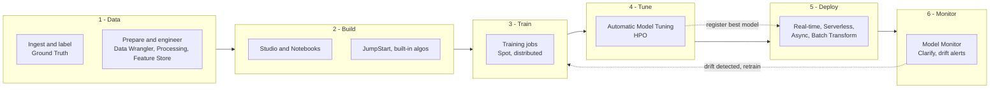

# Amazon SageMaker (AI)

**What it is:** Amazon SageMaker AI is AWS's fully managed platform for the *entire* machine-learning lifecycle — preparing data, building, training, and tuning custom models, then deploying and monitoring them at scale on managed compute.

> This page is the **overview / core-infrastructure** view of SageMaker. The many named sub-features (Clarify, Model Monitor, Feature Store, Data Wrangler, Ground Truth, JumpStart, Pipelines, Model Registry, Debugger, Neo, Model Cards, Inference Recommender, Autopilot, MLflow) each get deeper treatment on **[SageMaker features →](./sagemaker-features.md)**.
>
> Sources: [SageMaker AI product page](https://aws.amazon.com/sagemaker/ai/) · [SageMaker Developer Guide](https://docs.aws.amazon.com/sagemaker/latest/dg/whatis.html)

---

## 🧠 Mental model

Think of SageMaker as the **full ML factory**. Bedrock is a *catering service* — you order a finished meal (a foundation model) off a menu and it arrives cooked. SageMaker is the *factory that builds the kitchen*: you bring raw ingredients (your data), and SageMaker gives you every station on the assembly line —

- **Loading dock** → ingest and label raw data (Ground Truth, Data Wrangler, Processing jobs, Feature Store).
- **Workbench** → a place for engineers to experiment (Studio, Notebooks).
- **Assembly line** → train the product on rented industrial machines (Training jobs on GPU/CPU fleets, distributed training, Spot).
- **Quality tuning** → dial in the recipe automatically (Automatic Model Tuning).
- **Storefront** → serve the finished product to customers, live (real-time / serverless / async endpoints, Batch Transform).
- **Ongoing inspection** → make sure the product stays good over time (Model Monitor, Clarify).

The key exam distinction: **SageMaker = you own the model and the compute.** You choose instance types, you pay for instance-hours, and you get maximum control. That control is exactly why SageMaker dominates the **MLA-C01** (ML Engineer Associate) exam.

---

## The SageMaker ML lifecycle

The dashed loop matters: monitoring feeds back into retraining, and **SageMaker Pipelines** + **Model Registry** are what automate that loop (see [features page](./sagemaker-features.md)).

---

## The SageMaker family

| Capability | What it does | Exam / domain focus |
|---|---|---|
| **Studio** (unified IDE) | Web-based workbench: notebooks, experiments, pipelines, deploy — all in one console | MLA-C01 (all domains); AIF-C01 (awareness) |
| **Notebooks** | Managed Jupyter for interactive dev | MLA-C01 Dev |
| **Training jobs** | Managed, ephemeral training on rented instances | MLA-C01 Dev (Domain 2) — heavy |
| **Built-in algorithms** | 17+ AWS-optimized algorithms (XGBoost, Linear Learner, etc.) | MLA-C01 Dev |
| **Automatic Model Tuning (HPO)** | Searches hyperparameter space for you | MLA-C01 Dev |
| **Endpoints** (real-time / serverless / async) + **Batch Transform** | Serving options for predictions | MLA-C01 Deploy (Domain 3) — heaviest single topic |
| **Processing jobs** | Managed jobs for pre/post-processing, feature eng, eval | MLA-C01 Data (Domain 1) |
| **Data Wrangler / Feature Store / Ground Truth** | Data prep, feature reuse, labeling → [features](./sagemaker-features.md) | MLA-C01 Data (Domain 1) |
| **JumpStart** | Model hub: pretrained + foundation models, one-click deploy/fine-tune → [features](./sagemaker-features.md) | AIF-C01 + MLA-C01 |
| **Pipelines / Model Registry** | CI/CD & MLOps orchestration → [features](./sagemaker-features.md) | MLA-C01 Deploy + Monitor |
| **Model Monitor / Clarify** | Drift detection, bias, explainability → [features](./sagemaker-features.md) | AIF-C01 Responsible AI; MLA-C01 Monitor (Domain 4) |
| **Neo / Edge** | Compile models for edge/target hardware → [features](./sagemaker-features.md) | MLA-C01 Deploy |
| **Autopilot** | AutoML: builds candidate models automatically → [features](./sagemaker-features.md) | AIF-C01 + MLA-C01 |

> Naming note: AWS rebranded the ML platform to **"Amazon SageMaker AI"** and now uses **"Amazon SageMaker"** (Unified Studio) as a broader umbrella that also spans analytics/data. On both exams, "SageMaker" = the ML platform described here.
> Source: [SageMaker AI overview](https://aws.amazon.com/sagemaker/ai/)

---

## Core building blocks

### SageMaker Studio & Notebooks
- **Studio** — a single web IDE that fronts the whole lifecycle (build → train → tune → deploy → monitor). No infra to manage; you launch kernels on demand.
- **Notebook instances / Studio notebooks** — managed Jupyter environments for interactive experimentation. You pick the instance size; you pay for the time the notebook runs (a classic "remember to shut it down" cost trap).

### Training jobs
A **training job** is *ephemeral*: SageMaker spins up the instance(s) you specify, pulls your data from S3, runs the container, writes the model artifact to S3, and **tears the instances down**. You pay only for the training instance-hours consumed. Three ways to supply the training logic:

| Approach | You provide | Use when |
|---|---|---|
| **Built-in algorithms** | Just data + hyperparameters | AWS ships an optimized algo for your task (XGBoost, Linear Learner, K-Means, Image Classification, BlazingText, DeepAR, etc.) |
| **Script mode** (framework containers) | Your training **script**; AWS provides the framework container (TensorFlow, PyTorch, scikit-learn, Hugging Face, XGBoost) | You want a specific framework but not to build a container |
| **BYOC** (Bring Your Own Container) | A full custom **Docker image** in ECR | Custom dependencies, unusual frameworks, or full control |

> Source: [Use built-in algorithms / script mode / BYOC](https://docs.aws.amazon.com/sagemaker/latest/dg/algorithms-choose.html)

### Processing jobs
Managed, ephemeral compute for anything *around* training — data pre/post-processing, feature engineering, and model evaluation. Same "spin up → run container → write to S3 → tear down" pattern as training jobs, but decoupled from the training step so it slots cleanly into Pipelines.
> Source: [Processing jobs](https://docs.aws.amazon.com/sagemaker/latest/dg/processing-job.html)

### Automatic Model Tuning (Hyperparameter Optimization)
You define hyperparameter ranges and an objective metric; SageMaker launches many training jobs to find the best combination. Four search strategies — **memorize these for MLA-C01**:

| Strategy | How it works | When to pick it |
|---|---|---|
| **Bayesian** | Treats tuning as regression; each run informs the next. Sequential, so it **can't massively parallelize** | Default; want good results with few jobs |
| **Random** | Independent runs, no learning between them | Want the **largest number of parallel jobs**; big search budget |
| **Grid** | Methodically tries every combination in the grid | Reproducibility / transparency; explore space evenly (categorical params) |
| **Hyperband** | Uses intermediate results to kill underperformers early and re-allocate epochs; scales in parallel | Fastest for iterative (deep-learning) training with early-stopping signal |

> Source: [HPO tuning strategies](https://docs.aws.amazon.com/sagemaker/latest/dg/automatic-model-tuning-how-it-works.html)

### Endpoints & Batch Transform — the four inference options
This is the **single most heavily tested MLA-C01 decision.** Memorize the limits.

| Option | Best for | Payload | Processing time | Scales to zero? | Persistent? |
|---|---|---|---|---|---|
| **Real-time endpoint** | Low-latency, sustained traffic; live REST API | up to **25 MB** | 60 s (8 min streaming) | No (always-on instances; auto-scales min ≥ 1) | Yes |
| **Serverless inference** | Intermittent / unpredictable traffic; no infra to manage | up to **4 MB** | up to **60 s** | **Yes** (pay per use, no idle cost; cold starts) | Managed |
| **Asynchronous inference** | Large payloads, long processing, near-real-time | up to **1 GB** | up to **1 hour** | **Yes** (down to 0 when queue empty) | Yes (queued) |
| **Batch Transform** | Offline scoring of a whole dataset; no endpoint needed | GBs (large datasets) | up to **days** | N/A (ephemeral job) | No |

Quick reflex: **big payload / slow → async; whole dataset offline → batch; spiky traffic → serverless; steady low-latency → real-time.**
> Source: [Inference options in SageMaker AI](https://docs.aws.amazon.com/sagemaker/latest/dg/deploy-model-options.html)

### Spot training
Use **Managed Spot Training** to run training jobs on spare EC2 capacity for up to **~90% off** on-demand. SageMaker manages Spot interruptions via **checkpointing** to S3 (so an interrupted job resumes rather than restarts). Ideal for long, fault-tolerant training; set `max_wait` ≥ `max_run`.
> Source: [Managed Spot Training](https://docs.aws.amazon.com/sagemaker/latest/dg/model-managed-spot-training.html)

### Distributed training
For models/datasets too big for one instance, SageMaker offers two parallelism strategies (plus support for open-source frameworks like PyTorch DDP, DeepSpeed, FSDP):

- **Data parallelism** (SageMaker Distributed Data Parallel, SMDDP) — replicate the model across GPUs, split the *data*; best when the model fits on one GPU but the dataset is huge.
- **Model parallelism** (SageMaker Model Parallel, SMP) — split the *model* across GPUs; needed when the model itself is too large to fit on a single GPU (large LLMs).

Related throughput levers: **warm pools** (keep provisioned instances alive between jobs to skip startup) and **training plans** (reserve GPU capacity in advance).
> Source: [Distributed training options](https://docs.aws.amazon.com/sagemaker/latest/dg/distributed-training-options.html)

---

## When to use SageMaker vs Bedrock vs AWS AI services

| | **AWS AI services** (Rekognition, Comprehend, Transcribe, Textract, Polly, etc.) | **Amazon Bedrock** | **Amazon SageMaker AI** |
|---|---|---|---|
| **What you get** | Pre-trained APIs for common tasks | Managed foundation models (Claude, Llama, Titan, Nova…) via one API | Full platform to build/train/deploy *your own* models |
| **ML skill needed** | None — call an API | Low — prompt engineering, optional RAG/fine-tune | High — data science + ML engineering |
| **Control over model** | None | Choose model, prompt, fine-tune; no infra | Full — architecture, training, instance types |
| **Infrastructure** | Fully abstracted | Fully serverless | You pick instances / containers |
| **Pricing** | Per API call / per unit | Per token (on-demand) or provisioned throughput | Per instance-hour (compute) + storage |
| **Best when** | A standard task (OCR, sentiment, translation) fits an existing service | You want generative AI fast, minimal ops | You need a custom model, classical ML, or full control + cost optimization at scale |

Rule of thumb (and a common exam framing): **use the highest-level service that solves the problem.** Reach for an AI service if one exists; reach for Bedrock for generative AI without owning infra; reach for SageMaker when you must **train/customize your own model** or need instance-level cost/latency control. They're complementary — many architectures use Bedrock for the "brain" and SageMaker for specialized custom models.
> Sources: [Bedrock or SageMaker AI? (AWS decision guide)](https://docs.aws.amazon.com/decision-guides/latest/bedrock-or-sagemaker/bedrock-or-sagemaker.html) · [SageMaker AI](https://aws.amazon.com/sagemaker/ai/)

---

## Pricing model

SageMaker has **no upfront cost and no minimum fee** — you pay for the underlying resources each capability consumes, billed largely in **instance-seconds** (rounded, per-second billing on most components).

| Cost dimension | You pay for |
|---|---|
| **Training** | Training **instance-hours** for the life of the (ephemeral) job × instance rate |
| **Real-time endpoints** | Endpoint **instance-hours** — billed continuously **24/7 while the endpoint exists, even at zero traffic** (a top cost trap) |
| **Serverless inference** | Compute (duration × memory) + requests — **no charge for idle time** |
| **Async inference** | Instance-hours while running; **scales to 0** when the queue is empty |
| **Batch Transform** | Instance-hours only for the duration of the batch job |
| **Processing / Data Wrangler jobs** | Instance-hours for the processing instances |
| **Studio / Notebooks** | Instance-hours the notebook/kernel runs (Studio console itself is free) |
| **Storage & extras** | EBS/EFS volumes, Feature Store storage, model artifacts in S3, data transfer |

**Cost optimization levers (exam-relevant):**
- **Managed Spot Training** → up to ~90% off training compute.
- **Batch Transform / Serverless / Async** → avoid paying for idle always-on endpoints.
- **Auto-scaling** on real-time endpoints → scale instances to demand.
- **SageMaker Savings Plans** → commit to a consistent hourly compute spend (1- or 3-year) for **up to 64% off** on-demand. Applies across **Studio notebooks, training, processing, Data Wrangler, and real-time/batch inference** — regardless of instance family, size, or Region.

> Always price a specific instance/Region on the official calculator before quoting numbers.
> Sources: [SageMaker AI pricing](https://aws.amazon.com/sagemaker/ai/pricing/) · [SageMaker Savings Plans](https://aws.amazon.com/savingsplans/ml/)

---

## 🎯 On the exam

**Reflexes (see keyword → think this):**
- "Trained model, whole dataset, no live endpoint / offline" → **Batch Transform.**
- "Spiky / intermittent traffic, don't manage infra, OK with cold start" → **Serverless inference.**
- "Payload up to 1 GB and/or minutes-long processing, near-real-time" → **Asynchronous inference.**
- "Sustained low-latency live API" → **Real-time endpoint.**
- "Cheap training, fault-tolerant, long job" → **Managed Spot Training** (+ checkpointing).
- "Model too big for one GPU" → **model parallelism**; "dataset too big, model fits" → **data parallelism.**
- "Most parallel tuning jobs" → **Random** search; "smartest with few jobs" → **Bayesian**; "early-stop deep learning fast" → **Hyperband**; "reproducible/exhaustive" → **Grid.**
- "Custom Docker image / unusual dependencies" → **BYOC**; "just my script on TF/PyTorch" → **script mode**; "no code, standard task" → **built-in algorithm.**
- "Commit to steady ML compute for a discount" → **SageMaker Savings Plans.**

**Traps:**
- **Real-time endpoints bill 24/7** even with zero traffic — an idle endpoint is the classic surprise cost. Use serverless/async/batch or delete it.
- **Serverless ≠ async.** Serverless is for *spiky small* requests (≤ 4 MB, ≤ 60 s); async is for *large/slow* requests (≤ 1 GB, ≤ 1 hr). Don't swap them.
- **Bayesian tuning cannot massively parallelize** (it's sequential) — if a question stresses "run as many jobs in parallel as possible," the answer is **Random**, not Bayesian.
- Don't reach for SageMaker when an **AI service or Bedrock** already solves the task — the exam rewards the *least-custom* option that meets the requirement.
- **Managed Spot Training needs checkpointing** to be resilient to interruptions; without it, an interrupted job loses progress.
- Batch Transform is **not** an endpoint — no persistent infrastructure, no auto-scaling; it's an ephemeral job.

---

## References

- [Amazon SageMaker AI — product page](https://aws.amazon.com/sagemaker/ai/)
- [SageMaker Developer Guide — What is SageMaker AI](https://docs.aws.amazon.com/sagemaker/latest/dg/whatis.html)
- [Inference options in SageMaker AI](https://docs.aws.amazon.com/sagemaker/latest/dg/deploy-model-options.html)
- [Serverless Inference](https://docs.aws.amazon.com/sagemaker/latest/dg/serverless-endpoints.html) · [Asynchronous Inference](https://docs.aws.amazon.com/sagemaker/latest/dg/async-inference.html) · [Batch Transform](https://docs.aws.amazon.com/sagemaker/latest/dg/batch-transform.html)
- [Choose an algorithm / built-in vs script vs BYOC](https://docs.aws.amazon.com/sagemaker/latest/dg/algorithms-choose.html)
- [Automatic Model Tuning — how it works](https://docs.aws.amazon.com/sagemaker/latest/dg/automatic-model-tuning-how-it-works.html)
- [Managed Spot Training](https://docs.aws.amazon.com/sagemaker/latest/dg/model-managed-spot-training.html)
- [Distributed training options](https://docs.aws.amazon.com/sagemaker/latest/dg/distributed-training-options.html)
- [SageMaker AI pricing](https://aws.amazon.com/sagemaker/ai/pricing/) · [SageMaker Savings Plans](https://aws.amazon.com/savingsplans/ml/)
- [Bedrock or SageMaker AI? — AWS decision guide](https://docs.aws.amazon.com/decision-guides/latest/bedrock-or-sagemaker/bedrock-or-sagemaker.html)
- **Companion page:** [SageMaker features (Clarify, Model Monitor, Feature Store, Pipelines, JumpStart…) →](./sagemaker-features.md)
