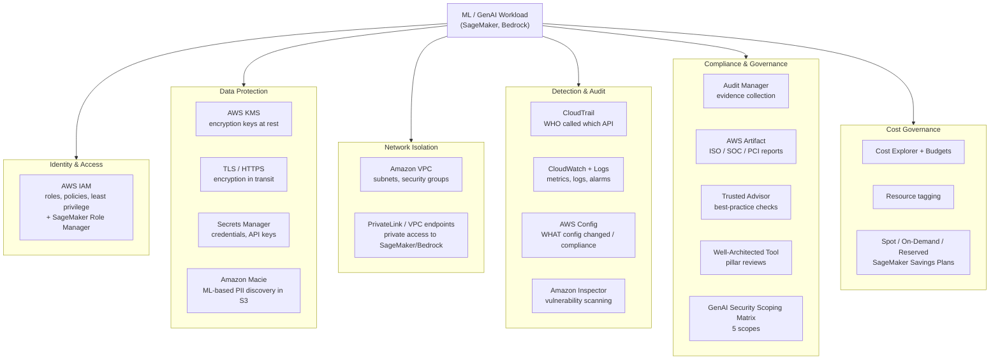

# AWS Security, Identity & Governance for AI/ML

> Deep-dive reference for **AIF-C01 Domain 5** (Security, Compliance, and Governance for AI Solutions) and **MLA-C01 Domain 4** (ML Solution Monitoring, Maintenance, and Security).

Security is one of the most heavily weighted and most "trap-heavy" areas on both AWS AI exams. The questions rarely ask you to *configure* anything — they ask you to **pick the right service for a stated goal** ("audit who called an API", "find PII in an S3 bucket", "keep traffic off the public internet"). This page walks every service you need, with a mental model, the ML-specific angle, and the exact "if you see X, pick this" trigger phrase the exam uses.

## The Shared Responsibility Model — the mental model behind everything

Every security question sits on top of one idea: **AWS secures the cloud; you secure what you put in the cloud.**

- **AWS — "Security *of* the cloud":** the physical hardware, data centers, networking, hypervisor, and the managed-service software. You never patch a Bedrock server or a SageMaker control plane — that's AWS's job. ([AWS Shared Responsibility Model](https://aws.amazon.com/compliance/shared-responsibility-model/))
- **You — "Security *in* the cloud":** your data, IAM identities and permissions, encryption choices, network configuration (VPC, security groups), and OS/app patching **when the service exposes them**.

The dividing line **slides with the service type** — this is the tested nuance:

| Service style | Example | Who patches the OS? | Your security job |
|---|---|---|---|
| **IaaS** (you run the box) | EC2, SageMaker training on your instance | **You** | OS patches, app config, security group, data, IAM |
| **Managed / PaaS** | Amazon SageMaker (managed), Amazon EMR | AWS runs infra; you configure | Data, IAM, encryption keys, VPC/network config |
| **Abstracted / fully managed** | Amazon S3, DynamoDB, **Amazon Bedrock** | **AWS** | Data classification, IAM, encryption *choice*, access policies |

> **In plain English:** the more "serverless"/managed the service, the less of the stack you own — but **you always own your data, your IAM permissions, and who can access what.** No AWS service ever makes those decisions for you. On the exam, if an answer says "AWS is responsible for encrypting your data / setting your IAM policy" it's **wrong** — that's always you.

For Bedrock specifically: AWS secures the foundation-model infrastructure; **you** control the IAM policies, guardrails, encryption keys, VPC endpoints, and what prompts/data you send. Your prompts and fine-tuning data are **not** used to train the base models. ([Bedrock security](https://docs.aws.amazon.com/bedrock/latest/userguide/security.html))

---

## Table of Contents

1. [Service landscape (diagram)](#landscape)
2. [AWS IAM](#iam)
3. [AWS KMS + encryption in transit](#kms)
4. [Amazon Macie](#macie)
5. [AWS PrivateLink / VPC endpoints](#privatelink)
6. [Amazon VPC, subnets & security groups](#vpc)
7. [AWS Secrets Manager](#secrets)
8. [AWS CloudTrail](#cloudtrail)
9. [Amazon CloudWatch + CloudWatch Logs](#cloudwatch)
10. [AWS Config](#config)
11. [Amazon Inspector](#inspector)
12. [AWS Audit Manager](#auditmanager)
13. [AWS Artifact](#artifact)
14. [AWS Trusted Advisor](#trustedadvisor)
15. [Cost governance (Cost Explorer, Budgets, tags, purchasing)](#cost)
16. [Governance frameworks (GenAI Scoping Matrix, Well-Architected Tool)](#frameworks)
17. [Decision cheat table](#cheat)
18. [References](#references)

---

## Service landscape 

---

## AWS IAM 

🧠 **Mental model:** IAM is the **front door and the guest list**. It answers "*who* can do *what* to *which* resource". Everything in AWS security starts here — no encryption or network control matters if the wrong identity has `*:*`.

**What it does:** IAM manages **identities** (users, groups, roles) and **policies** (JSON documents granting/denying actions on resources). The best practice is **least privilege** — grant only the permissions a principal actually needs. A **role** is an identity you *assume* temporarily (no long-lived credentials), which is how AWS services act on your behalf. ([IAM docs](https://docs.aws.amazon.com/IAM/latest/UserGuide/introduction.html))

**ML-specific use:**
- A **SageMaker execution role** is the IAM role that the SageMaker service *assumes* to access resources on your behalf — e.g., read training data from S3, write a model artifact, pull a container from ECR, or use a KMS key. ([SageMaker execution roles](https://docs.aws.amazon.com/sagemaker/latest/dg/sagemaker-roles.html))
- **Amazon SageMaker Role Manager** builds **persona-based, least-privilege IAM roles** through a console wizard. It ships **predefined personas** (e.g., Data Scientist, MLOps) and ML-activity templates; when you enable VPC or KMS customization, the generated policies are **scoped down** to those specific resources. Use it when the exam asks "how do I quickly create least-privilege roles for ML personas?" ([SageMaker Role Manager](https://docs.aws.amazon.com/sagemaker/latest/dg/role-manager.html))
- Prefer roles over embedding access keys in notebooks or training scripts.

🎯 **On the exam — if you see…**
- "control **who can** invoke a model / access an endpoint / call an API" → **IAM**
- "SageMaker needs to read from S3 / write model artifacts" → **SageMaker execution role**
- "quickly create **least-privilege** roles per ML **persona** without hand-writing JSON" → **SageMaker Role Manager**
- "grant temporary credentials without long-lived keys" → **IAM roles (STS AssumeRole)**

---

## AWS KMS + encryption in transit 

🧠 **Mental model:** KMS is the **key locker**. It creates, stores, rotates, and controls access to the encryption keys that lock your data **at rest**. TLS is the **armored truck** that protects data **in transit**.

**What it does (KMS):** AWS Key Management Service creates and manages **KMS keys** and integrates with S3, EBS, SageMaker, Bedrock, and most AWS services for **encryption at rest**. You choose between **AWS-managed keys**, **AWS-owned keys**, or **customer-managed keys (CMKs)** when you need control over rotation and key policies. Access to a key is governed by a **key policy** plus IAM. ([KMS docs](https://docs.aws.amazon.com/kms/latest/developerguide/overview.html))

**Encryption in transit:** AWS service endpoints use **TLS/HTTPS** by default. For ML this means training data, inference requests to a SageMaker endpoint, and Bedrock API calls are encrypted on the wire. For traffic **between** training nodes in a distributed job, SageMaker supports **inter-node (inter-container) traffic encryption**.

**ML-specific use:**
- Encrypt SageMaker **training/processing volumes**, **model artifacts** in S3, and **notebook storage** with a CMK.
- Bedrock lets you encrypt custom-model artifacts and job data with your own KMS key.
- A CMK gives you an **audit trail** (every key use is logged to CloudTrail) and the ability to **revoke** access org-wide by changing one key policy.

🎯 **On the exam — if you see…**
- "encrypt data **at rest** / manage **encryption keys** / rotate keys / bring your own key" → **KMS**
- "encrypt data **in transit** / protect API traffic" → **TLS / HTTPS** (not KMS)
- "control key access **and** get an audit trail of key usage" → **customer-managed KMS key + CloudTrail**

---

## Amazon Macie 

🧠 **Mental model:** Macie is the **PII bloodhound for S3**. It sniffs your buckets with ML and pattern matching and tells you where sensitive data lives.

**What it does:** Amazon Macie is a data security service that uses **machine learning and pattern matching** to **discover and classify sensitive data in Amazon S3** — PII, financial data, credentials — and to flag bucket-level risks (public, unencrypted, shared). It builds an **interactive data map** and can run one-time or scheduled **sensitive-data discovery jobs**. ([Macie docs](https://docs.aws.amazon.com/macie/latest/user/what-is-macie.html))

**ML-specific use:** Training corpora and data lakes routinely hide PII. Run Macie **before training or fine-tuning** to confirm your S3 datasets don't contain unredacted personal data, satisfying privacy/compliance requirements. Macie findings route to EventBridge/Security Hub for automated remediation.

🎯 **On the exam — if you see…**
- "**discover / find / classify PII** or sensitive data **in S3**" → **Macie** (this is the near-universal trigger)
- "which S3 buckets are unencrypted or public and hold sensitive data?" → **Macie**
- Do **not** pick Macie for non-S3 stores or for redacting text in prompts (that's **Bedrock Guardrails / Comprehend PII**).

---

## AWS PrivateLink / VPC endpoints 

🧠 **Mental model:** PrivateLink is a **private tunnel** from your VPC straight to an AWS service — **the public internet never sees the traffic**.

**What it does:** AWS PrivateLink provides **interface VPC endpoints** so resources in your VPC reach AWS services (SageMaker, Bedrock, S3 via gateway endpoint, etc.) **without** an internet gateway, NAT device, or public IP. Traffic stays on the AWS network. With **Private DNS enabled**, standard service DNS names route through the endpoint automatically — **no code changes**. You can attach **endpoint policies** to restrict what's callable through the endpoint. ([Bedrock VPC endpoints](https://docs.aws.amazon.com/bedrock/latest/userguide/vpc-interface-endpoints.html), [SageMaker VPC endpoints](https://docs.aws.amazon.com/sagemaker/latest/dg/interface-vpc-endpoint.html))

**ML-specific use:**
- Call **Amazon Bedrock** (`bedrock`, `bedrock-runtime`, `bedrock-agent`, `bedrock-agent-runtime`) privately so prompts/inference data never traverse the internet.
- Connect an **internet-isolated** SageMaker notebook/Studio to other AWS services via PrivateLink + security groups.

🎯 **On the exam — if you see…**
- "access Bedrock / SageMaker **privately** / **without traversing the public internet** / no internet gateway or NAT" → **PrivateLink (interface VPC endpoint)**
- "keep model **inference traffic on the AWS network**" → **VPC endpoint**
- "restrict which principals/APIs can be reached through the endpoint" → **VPC endpoint policy**

---

## Amazon VPC, subnets & security groups 

🧠 **Mental model:** A VPC is **your private slice of the AWS network**; **security groups** are the **firewall around each resource**; subnets decide public vs. private placement.

**What it does:** Amazon **VPC** is an isolated virtual network. **Subnets** partition it — **private subnets** have no direct internet route (ideal for training/inference). **Security groups** are **stateful** instance-level firewalls (allow rules only); **network ACLs** are **stateless** subnet-level firewalls. ([VPC docs](https://docs.aws.amazon.com/vpc/latest/userguide/what-is-amazon-vpc.html))

**ML-specific use:** Launch SageMaker training jobs, processing jobs, and endpoints **in your VPC** and in **private subnets** to isolate them. Combine with PrivateLink for AWS-service access and security groups to tightly scope inbound/outbound traffic. This "**VPC mode**" is the standard pattern for regulated ML workloads.

🎯 **On the exam — if you see…**
- "**isolate** the ML workload / run in a **private subnet** / no internet access" → **VPC + private subnet**
- "firewall at the **instance** level, stateful" → **security group**
- "firewall at the **subnet** level, stateless, allow/deny" → **network ACL**

---

## AWS Secrets Manager 

🧠 **Mental model:** Secrets Manager is the **vault for credentials** — DB passwords, third-party API keys, tokens — with **automatic rotation**.

**What it does:** Stores, encrypts (with KMS), and **automatically rotates** secrets, and serves them to apps via API/SDK so credentials never live in code. ([Secrets Manager docs](https://docs.aws.amazon.com/secretsmanager/latest/userguide/intro.html))

**ML-specific use:** Store the API key for an **external LLM/model provider**, a database credential a feature pipeline queries, or a token a SageMaker processing job needs — then grant the job's execution role read access. Keeps secrets out of notebooks, Dockerfiles, and Git.

🎯 **On the exam — if you see…**
- "store and **rotate** database creds / API keys / tokens securely" → **Secrets Manager**
- "config values / feature flags (non-secret), possibly cheaper" → **SSM Parameter Store** (distractor)

---

## AWS CloudTrail 

🧠 **Mental model:** CloudTrail is the **security camera on the API front door** — it records **WHO did WHAT, WHEN, and from WHERE**.

**What it does:** Logs every **API call / management event** in your account — the identity, timestamp, source IP, and parameters — for governance, auditing, and forensics. Delivers logs to S3 (and optionally CloudWatch Logs). ([CloudTrail docs](https://docs.aws.amazon.com/awscloudtrail/latest/userguide/cloudtrail-user-guide.html))

**ML-specific use:** Audit who invoked a Bedrock model, who created/deleted a SageMaker endpoint, or who used a KMS key. Essential evidence for compliance and incident investigation.

🎯 **On the exam — if you see…**
- "**who** called this API / made this change / accessed this resource" → **CloudTrail**
- "**audit trail** / API activity history / forensic investigation" → **CloudTrail**

---

## Amazon CloudWatch + CloudWatch Logs 

🧠 **Mental model:** CloudWatch is the **health monitor** — **metrics, logs, alarms, dashboards** for *how your workload is performing*.

**What it does:** Collects **metrics** (CPU, memory, invocation counts, latency), aggregates **logs** (CloudWatch Logs), fires **alarms** on thresholds, and renders **dashboards**. It's about **operational/performance monitoring**, not "who did it". ([CloudWatch docs](https://docs.aws.amazon.com/AmazonCloudWatch/latest/monitoring/WhatIsCloudWatch.html))

**ML-specific use:**
- Monitor **SageMaker endpoint** invocation latency, error rates, CPU/GPU utilization; alarm on spikes.
- Capture **training job logs** and **model-monitor** output in CloudWatch Logs.
- Trigger auto-scaling or notifications when an endpoint saturates.

🎯 **On the exam — if you see…**
- "monitor **performance / latency / utilization**, set an **alarm**, build a **dashboard**" → **CloudWatch**
- "collect application/training **logs**" → **CloudWatch Logs**

> ### 🔑 CloudTrail vs. Config vs. CloudWatch (the most-tested distinction)
> | Question asks… | Service | One-liner |
> |---|---|---|
> | **WHO** made an API call / change | **CloudTrail** | Identity + action + time + source IP |
> | **WHAT** a resource's config is / whether it's **compliant** | **AWS Config** | Configuration state + change history + rules |
> | **HOW** the workload is **performing** (metrics/logs/alarms) | **CloudWatch** | Operational monitoring & alerting |
>
> Memory hook: **CloudTrail = who**, **Config = what (state/compliance)**, **CloudWatch = how (health)**.

---

## AWS Config 

🧠 **Mental model:** Config is the **configuration historian and compliance auditor** — it tracks the **state** of every resource over time and checks it against **rules**.

**What it does:** Continuously records **resource configurations** and **changes** (a timeline per resource), and evaluates them against **Config rules** for compliance (e.g., "all S3 buckets must be encrypted", "SageMaker notebooks must be in a VPC"). Non-compliant resources are flagged and can be auto-remediated. ([Config docs](https://docs.aws.amazon.com/config/latest/developerguide/WhatIsConfig.html))

**ML-specific use:** Enforce that SageMaker notebook instances have **direct internet access disabled**, that endpoints use **KMS encryption**, or that training resources run **inside a VPC** — and get continuous compliance reporting.

🎯 **On the exam — if you see…**
- "is this resource **compliant** with policy / continuously **evaluate configuration**" → **AWS Config**
- "**what changed** on this resource and is the change allowed" → **AWS Config** (vs. CloudTrail's *who*)

---

## Amazon Inspector 

🧠 **Mental model:** Inspector is the **automated vulnerability scanner** for your compute and containers.

**What it does:** Continuously scans **EC2 instances, container images in ECR, and Lambda functions** for **software vulnerabilities (CVEs)** and unintended network exposure, prioritizing findings by risk. ([Inspector docs](https://docs.aws.amazon.com/inspector/latest/user/what-is-inspector.html))

**ML-specific use:** Scan the **custom container images** you build for SageMaker training/inference (pushed to ECR) and the EC2 instances behind self-managed ML infra for known CVEs before deployment.

🎯 **On the exam — if you see…**
- "scan for **vulnerabilities / CVEs** in EC2, **container images**, or Lambda" → **Amazon Inspector**

---

## AWS Audit Manager 

🧠 **Mental model:** Audit Manager is the **evidence-collecting robot for auditors** — it continuously gathers proof that you meet a framework's controls.

**What it does:** **Automates evidence collection** and maps it to control frameworks (SOC 2, PCI DSS, HIPAA, GDPR, ISO, plus custom), so you can produce **audit-ready reports** without manually screenshotting configs. ([Audit Manager docs](https://docs.aws.amazon.com/audit-manager/latest/userguide/what-is.html))

**ML-specific use:** Prove that your ML platform's controls (encryption, access, logging) satisfy a regulatory framework — continuously, not just at audit time.

🎯 **On the exam — if you see…**
- "**automate evidence collection** / prepare for an **audit** against a framework" → **Audit Manager**
- Contrast with **Artifact** (which gives you *AWS's own* compliance docs, below).

---

## AWS Artifact 

🧠 **Mental model:** Artifact is the **download portal for AWS's compliance paperwork** — you *get* reports, you don't *generate* them.

**What it does:** Self-service, on-demand access to **AWS's compliance reports and certifications** — **SOC 1/2/3, ISO 27001, PCI DSS**, plus agreements (BAA, GDPR). It proves the **AWS side** of the shared responsibility model is certified. ([Artifact docs](https://docs.aws.amazon.com/artifact/latest/ug/what-is-aws-artifact.html))

**ML-specific use:** When a customer/regulator asks "is the platform your model runs on SOC 2 / ISO certified?", download the report from Artifact.

🎯 **On the exam — if you see…**
- "**download** AWS's **SOC / ISO / PCI** compliance **reports**" → **AWS Artifact**
- Key contrast: **Artifact = AWS's certifications you retrieve**; **Audit Manager = evidence about *your* usage you collect**.

---

## AWS Trusted Advisor 

🧠 **Mental model:** Trusted Advisor is the **automated best-practice checklist** across five categories.

**What it does:** Inspects your account and gives **recommendations** across **cost optimization, performance, security, fault tolerance, and service limits/quotas** (e.g., unrestricted security groups, unused resources, exposed access keys). ([Trusted Advisor docs](https://docs.aws.amazon.com/awssupport/latest/user/trusted-advisor.html))

**ML-specific use:** Catch security misconfigurations (open security groups on ML infra), cost waste (idle endpoints/instances), and service-limit issues before scaling training.

🎯 **On the exam — if you see…**
- "**best-practice recommendations** across cost/security/performance/fault-tolerance/limits" → **Trusted Advisor**

---

## Cost governance 

🧠 **Mental model:** Cost governance = **see it (Cost Explorer), cap it (Budgets), attribute it (tags), buy it smart (purchasing options)**. ML/GPU spend is huge, so this is squarely on the exam.

**Visibility & control:**
- **AWS Cost Explorer** — visualize and **analyze** historical spend and usage, filter/group, and **forecast**. ([Cost Explorer](https://docs.aws.amazon.com/cost-management/latest/userguide/ce-what-is.html))
- **AWS Budgets** — set **cost/usage thresholds** and get **alerts** (or take action) when you approach/exceed them. ([Budgets](https://docs.aws.amazon.com/cost-management/latest/userguide/budgets-managing-costs.html))
- **Resource tagging** — attach key/value **tags** (e.g., `project=fraud-model`, `team=ds`) to **attribute cost** per project/team and enable **cost allocation** reports.

**Purchasing / pricing options (know when each fits):**

| Option | Commitment | Discount | ML fit |
|---|---|---|---|
| **On-Demand** | none | baseline | Spiky/unpredictable inference; dev |
| **Spot Instances** | none, **interruptible** | up to ~90% off | **Fault-tolerant training** with checkpointing; batch jobs |
| **Reserved Instances** | 1 or 3 yr, instance-bound | up to ~72% | Steady-state EC2 infra |
| **SageMaker Savings Plans** | 1 or 3 yr, **$/hr commit** | **up to ~64%** | Steady SageMaker usage (training, notebooks, real-time/batch inference) — flexible across instance family & Region |

Key exam facts: **Savings Plans do NOT apply to Spot** (Spot has its own market pricing). SageMaker Savings Plans automatically apply to eligible SageMaker usage (Studio/notebooks, Processing, Training, Real-Time & Batch inference). ([SageMaker/ML Savings Plans](https://aws.amazon.com/savingsplans/ml-pricing/))

🎯 **On the exam — if you see…**
- "**analyze / visualize / forecast** spend" → **Cost Explorer**
- "**alert** me when spend **exceeds a threshold**" → **AWS Budgets**
- "**attribute cost** by team/project" → **resource tagging / cost allocation tags**
- "cheapest option for **interruptible, fault-tolerant training**" → **Spot**
- "reduce steady **SageMaker** cost with a flexible commitment" → **SageMaker Savings Plans**

---

## Governance frameworks 

### AWS Generative AI Security Scoping Matrix — the 5 scopes

🧠 **Mental model:** A ladder of **increasing ownership and control** over the AI model/data — as you climb, **more of the security responsibility shifts to you**. It helps you scope risk *before* building. ([GenAI Scoping Matrix](https://aws.amazon.com/ai/security/generative-ai-scoping-matrix/), [Security Blog intro](https://aws.amazon.com/blogs/security/securing-generative-ai-an-introduction-to-the-generative-ai-security-scoping-matrix/))

| Scope | Name | Example | You own… |
|---|---|---|---|
| **1** | Consumer app (public 3rd-party) | ChatGPT, PartyRock | least — just your inputs/usage |
| **2** | Enterprise app (SaaS with your data) | a SaaS tool with embedded GenAI | your data fed to it, access config |
| **3** | Pre-trained models (you build the app) | app on **Amazon Bedrock** base models | app logic, prompts, data, IAM |
| **4** | Fine-tuned models | fine-tune a Bedrock/SageMaker model on your data | + the fine-tuning data & tuned model |
| **5** | Self-trained models (from scratch) | train your own FM on your data | **everything** — data, model, full stack |

The matrix pairs these scopes with **five security disciplines**: **Governance & compliance, Legal & privacy, Risk management, Controls, and Resilience.**

🎯 **On the exam — if you see…** "using **ChatGPT/public** service" → Scope 1; "**fine-tuning** a foundation model on our data" → Scope 4; "**training our own** model from scratch" → Scope 5; "**more control = more responsibility**" → the scoping matrix.

### AWS Well-Architected Tool

🧠 **Mental model:** A **self-assessment** that measures your workload against the **Well-Architected Framework pillars** and produces an improvement plan.

**What it does:** Reviews your architecture against the six pillars — **Operational Excellence, Security, Reliability, Performance Efficiency, Cost Optimization, Sustainability** — and flags risks with remediation guidance. There's a dedicated **Machine Learning Lens** and **Generative AI Lens** for AI workloads. ([Well-Architected Tool](https://docs.aws.amazon.com/wellarchitected/latest/userguide/intro.html))

🎯 **On the exam — if you see…** "**review my architecture** against best-practice **pillars** / identify architectural risk" → **Well-Architected Tool** (use the **ML / GenAI Lens** for AI workloads).

---

## Decision cheat table 

| If the goal is… | Pick |
|---|---|
| Audit **who** called an API / made a change | **CloudTrail** |
| Track resource **config state** & **compliance** | **AWS Config** |
| Monitor **performance/metrics/logs/alarms** | **CloudWatch** |
| Discover **PII/sensitive data in S3** (ML-based) | **Amazon Macie** |
| Download AWS **compliance reports** (SOC/ISO/PCI) | **AWS Artifact** |
| **Automate evidence collection** for an audit | **AWS Audit Manager** |
| Scan for **vulnerabilities/CVEs** (EC2, containers, Lambda) | **Amazon Inspector** |
| **Private connectivity** to SageMaker/Bedrock (no internet) | **PrivateLink / VPC endpoint** |
| Store & **rotate secrets** (creds, API keys) | **Secrets Manager** |
| Manage **encryption keys** (at rest) | **AWS KMS** |
| Encrypt data **in transit** | **TLS / HTTPS** |
| Control **who can do what** (least privilege) | **AWS IAM** |
| Quickly build **least-privilege ML persona roles** | **SageMaker Role Manager** |
| **Isolate** ML workload in a private network | **VPC + private subnets + security groups** |
| **Best-practice** recommendations (cost/security/perf/limits) | **Trusted Advisor** |
| **Analyze/forecast** spend | **Cost Explorer** |
| **Alert** on spend thresholds | **AWS Budgets** |
| Attribute cost by team/project | **Resource tagging** |
| Cheapest **interruptible** training | **Spot Instances** |
| Flexible commitment to cut steady **SageMaker** cost | **SageMaker Savings Plans** |
| Scope GenAI **risk/ownership** before building | **GenAI Security Scoping Matrix (5 scopes)** |
| Review architecture against **pillars** | **Well-Architected Tool (ML/GenAI Lens)** |

---

## References 

- AWS Shared Responsibility Model — https://aws.amazon.com/compliance/shared-responsibility-model/
- Amazon Bedrock security — https://docs.aws.amazon.com/bedrock/latest/userguide/security.html
- AWS IAM User Guide — https://docs.aws.amazon.com/IAM/latest/UserGuide/introduction.html
- SageMaker execution roles — https://docs.aws.amazon.com/sagemaker/latest/dg/sagemaker-roles.html
- Amazon SageMaker Role Manager — https://docs.aws.amazon.com/sagemaker/latest/dg/role-manager.html
- AWS KMS — https://docs.aws.amazon.com/kms/latest/developerguide/overview.html
- Amazon Macie — https://docs.aws.amazon.com/macie/latest/user/what-is-macie.html
- Bedrock interface VPC endpoints (PrivateLink) — https://docs.aws.amazon.com/bedrock/latest/userguide/vpc-interface-endpoints.html
- SageMaker interface VPC endpoints — https://docs.aws.amazon.com/sagemaker/latest/dg/interface-vpc-endpoint.html
- Amazon VPC — https://docs.aws.amazon.com/vpc/latest/userguide/what-is-amazon-vpc.html
- AWS Secrets Manager — https://docs.aws.amazon.com/secretsmanager/latest/userguide/intro.html
- AWS CloudTrail — https://docs.aws.amazon.com/awscloudtrail/latest/userguide/cloudtrail-user-guide.html
- Amazon CloudWatch — https://docs.aws.amazon.com/AmazonCloudWatch/latest/monitoring/WhatIsCloudWatch.html
- AWS Config — https://docs.aws.amazon.com/config/latest/developerguide/WhatIsConfig.html
- Amazon Inspector — https://docs.aws.amazon.com/inspector/latest/user/what-is-inspector.html
- AWS Audit Manager — https://docs.aws.amazon.com/audit-manager/latest/userguide/what-is.html
- AWS Artifact — https://docs.aws.amazon.com/artifact/latest/ug/what-is-aws-artifact.html
- AWS Trusted Advisor — https://docs.aws.amazon.com/awssupport/latest/user/trusted-advisor.html
- AWS Cost Explorer — https://docs.aws.amazon.com/cost-management/latest/userguide/ce-what-is.html
- AWS Budgets — https://docs.aws.amazon.com/cost-management/latest/userguide/budgets-managing-costs.html
- SageMaker / ML Savings Plans — https://aws.amazon.com/savingsplans/ml-pricing/
- Generative AI Security Scoping Matrix — https://aws.amazon.com/ai/security/generative-ai-scoping-matrix/
- Securing generative AI (Security Blog) — https://aws.amazon.com/blogs/security/securing-generative-ai-an-introduction-to-the-generative-ai-security-scoping-matrix/
- AWS Well-Architected Tool — https://docs.aws.amazon.com/wellarchitected/latest/userguide/intro.html
