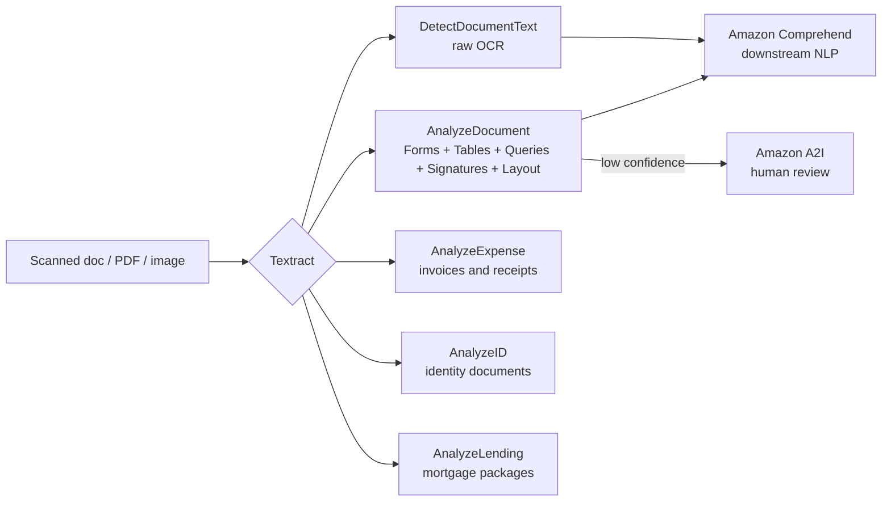

# Amazon Textract

**Amazon Textract is a managed service that extracts text, handwriting, forms, tables, and structured data from scanned documents and images** — going beyond simple OCR to preserve document structure. ([What is Textract](https://docs.aws.amazon.com/textract/latest/dg/what-is.html))

---

## 🧠 Mental model

Think of Textract as **a meticulous data-entry clerk who reads a scanned document and hands you a structured spreadsheet instead of a wall of text.** Plain OCR gives you a soup of characters; Textract understands that "Name: Jane Doe" is a **key-value pair**, that a grid of numbers is a **table**, and that a receipt has a **vendor, total, and line items**. It knows what a driver's license or passport field means (`AnalyzeID`) and what a receipt field means (`AnalyzeExpense`).

> The classic exam confusion: **Textract = documents (forms, tables, invoices, IDs); Rekognition = photos/scenes.** If it's a scanned form, invoice, ID card, or PDF → **Textract**. ([Rekognition text detection is scene text, not documents](https://docs.aws.amazon.com/rekognition/latest/dg/text-detection.html))

| Input | Textract API | Output |
|-------|--------------|--------|
| Scanned page / PDF | `DetectDocumentText` | Raw text + lines + words (OCR) |
| Form / questionnaire | `AnalyzeDocument` (FORMS) | Key-value pairs |
| Document with a grid | `AnalyzeDocument` (TABLES) | Structured tables (rows/cols) |
| "What's the invoice #?" | `AnalyzeDocument` (QUERIES) | Answers to natural-language questions |
| Receipt / invoice | `AnalyzeExpense` | Vendor, total, tax, line items |
| Driver's license / passport | `AnalyzeID` | Normalized ID fields |
| Mortgage loan package | `AnalyzeLending` | Page classification + routed extraction |

---

## What it does

**Raw OCR** — `DetectDocumentText` returns detected text as `LINE` and `WORD` blocks with bounding boxes and confidence scores. Reads printed text **and handwriting**. This is the cheap, "just give me the words" tier. ([Detecting text](https://docs.aws.amazon.com/textract/latest/dg/how-it-works-detecting.html))

**AnalyzeDocument** — the structured-analysis API; you request one or more feature types:
- **FORMS** — extracts **key-value pairs** (e.g., `Name → Jane Doe`), so you don't have to guess which text is a label vs. a value. ([Forms](https://docs.aws.amazon.com/textract/latest/dg/how-it-works-kvp.html))
- **TABLES** — reconstructs **tables** with rows, columns, and cell relationships. ([Tables](https://docs.aws.amazon.com/textract/latest/dg/how-it-works-tables.html))
- **QUERIES** — ask **natural-language questions** ("What is the customer's account number?") and get the answer, no template needed. **Custom Queries** can be tuned for your document types. ([Queries](https://docs.aws.amazon.com/textract/latest/dg/queryresponse.html))
- **SIGNATURES** — detects the presence and location of signatures.
- **LAYOUT** — identifies layout elements (titles, headers, paragraphs, lists) and preserves reading order — useful for feeding clean text into an LLM/RAG pipeline.

**AnalyzeExpense** — purpose-built for **invoices and receipts**; returns normalized summary fields (vendor name, total, tax, invoice date) and **line-item** groups (item, quantity, unit price). More accurate for financial docs than generic FORMS. ([AnalyzeExpense](https://docs.aws.amazon.com/textract/latest/dg/analyzing-document-expense.html))

**AnalyzeID** — extracts fields from **US identity documents** (driver's licenses, passports), normalizing them to consistent keys (e.g., `DATE_OF_BIRTH`, `DOCUMENT_NUMBER`) even when the source layout differs. ([AnalyzeID](https://docs.aws.amazon.com/textract/latest/dg/how-it-works-identity.html))

**AnalyzeLending** — for **mortgage/loan packages**: classifies each page (pay stub, W-2, bank statement, etc.), splits the package, and routes pages to the right extraction, returning normalized fields. ([AnalyzeLending](https://docs.aws.amazon.com/textract/latest/dg/lending-document-classification-extraction.html))

**Sync vs. async**
- **Synchronous** APIs (`DetectDocumentText`, `AnalyzeDocument`, `AnalyzeExpense`, `AnalyzeID`) process a **single-page image or a small document** and return results immediately. ([Sync](https://docs.aws.amazon.com/textract/latest/dg/sync.html))
- **Asynchronous** APIs (`StartDocumentTextDetection`, `StartDocumentAnalysis`, `StartExpenseAnalysis`, `StartLendingAnalysis`) handle **multi-page PDFs/TIFFs** stored in S3; you `Start…`, get a **JobId**, are notified via **SNS** on completion, then `Get…` the paginated results. ([Async](https://docs.aws.amazon.com/textract/latest/dg/async.html))

**Integrations you should know**
- **Amazon A2I (Augmented AI)** — route **low-confidence** extractions to **human reviewers** by setting confidence thresholds on key fields. Textract has a **built-in A2I integration** for exactly this human-in-the-loop review. ([A2I + Textract](https://docs.aws.amazon.com/textract/latest/dg/a2i-textract.html))
- **Amazon Comprehend** — feed Textract's extracted text **downstream into Comprehend** for NLP: entity recognition, PII redaction, sentiment, custom classification. Textract reads the document; Comprehend *understands* the language. ([Comprehend](https://docs.aws.amazon.com/comprehend/latest/dg/what-is.html))

---

## When to use it (and vs alternatives)

| You need to… | Use | Not this |
|---|---|---|
| Read text from a **scanned document / PDF** | **Textract** `DetectDocumentText` | Rekognition (scene text only) |
| Extract **key-value form fields** | **Textract** `AnalyzeDocument` FORMS | Plain OCR (loses structure) |
| Extract **tables** with rows/columns | **Textract** `AnalyzeDocument` TABLES | Manual parsing |
| Ask **questions** of a doc without a template | **Textract** QUERIES / Custom Queries | Building a fixed template |
| Process **invoices / receipts** | **Textract** `AnalyzeExpense` | Generic FORMS (less accurate) |
| Parse **driver's licenses / passports** | **Textract** `AnalyzeID` | Generic FORMS |
| Process **mortgage/loan packages** | **Textract** `AnalyzeLending` | Manual routing |
| Route **low-confidence** results to humans | **Textract + Amazon A2I** | Silent auto-accept |
| **Understand** the extracted text (entities, PII, sentiment) | **Comprehend** (downstream of Textract) | Textract alone |
| Read text in a **photo/scene** (sign, product label) | **Rekognition** `DetectText` | Textract |

**Textract vs. Rekognition text detection (the classic trap):** Rekognition's `DetectText` finds *incidental text in a scene* — short strings in photos/video. **Textract is built for documents** — it preserves forms, tables, reading order, and page structure, and offers expense/ID/lending specializations. Scanned form/invoice/ID/PDF → **Textract**, even though both services "detect text." ([Textract overview](https://docs.aws.amazon.com/textract/latest/dg/what-is.html))

---

## Pricing model

Pay-per-page, no minimums; each **feature is billed separately and additively** (e.g., FORMS + TABLES on one page = both charges). Async and sync use the **same per-page rate**. Prices below are US East (N. Virginia), first tier; verify current rates. ([Textract pricing](https://aws.amazon.com/textract/pricing/))

| API / feature | Unit | Price (first tier) |
|---|---|---|
| Detect Document Text (OCR) | per 1,000 pages | $1.50 (→ $0.60 beyond 1M) |
| AnalyzeDocument – **Forms** | per 1,000 pages | $50.00 |
| AnalyzeDocument – **Tables** | per 1,000 pages | $15.00 (→ $10.00) |
| AnalyzeDocument – **Queries** | per 1,000 pages | $15.00 |
| AnalyzeDocument – **Custom Queries** | per 1,000 pages | $25.00 (→ $15.00) |
| AnalyzeDocument – **Signatures** | per 1,000 pages | $3.50 (→ $1.40) |
| **AnalyzeExpense** | per 1,000 pages | $10.00 (→ $8.00) |
| **AnalyzeID** | per 1,000 pages | $25.00 (→ $10.00) |
| **AnalyzeLending** | per 1,000 pages | $70.00 (→ $55.00) |

**Free tier (3 months, new accounts):** Detect Document Text 1,000 pages/mo; Analyze Document (Forms/Tables) 100 pages/mo; AnalyzeExpense 100; AnalyzeID 100; AnalyzeLending 2,000.

**Cost reflexes:**
- **Features stack.** Requesting FORMS **and** TABLES on the same page bills for **both** — it's additive, not a max. Only request the features you need.
- **Basic OCR is ~30× cheaper than FORMS.** If you just need the raw text (e.g., to feed an LLM), `DetectDocumentText` is far cheaper than `AnalyzeDocument`.
- **Signature detection alone is cheap** and billed separately.

---

## 🎯 On the exam

**Reflexes — if you see X, pick Textract:**
- "**Extract text/forms/tables** from **scanned documents**," "**OCR** a PDF," "digitize **paper forms**," "**key-value** extraction" → **Textract**.
- "Process **invoices / receipts / expenses**" → **Textract `AnalyzeExpense`**.
- "Extract fields from **driver's licenses / passports / ID documents**" → **Textract `AnalyzeID`**.
- "Process **mortgage / loan** document packages, classify pages" → **Textract `AnalyzeLending`**.
- "Ask **questions** of a document without building a template" → **Textract Queries**.
- "Send **low-confidence** extractions to **human reviewers**" → **Textract + Amazon A2I**.
- "After extracting text, find **entities / PII / sentiment / topics**" → **Textract → Comprehend** (Textract extracts, Comprehend understands).

**Traps:**
- **Textract vs Rekognition.** Both "detect text." **Documents → Textract; photos/scenes → Rekognition.** #1 trap on both exams.
- **Multi-page PDF ⇒ asynchronous.** Sync APIs take a single-page image; **multi-page PDFs/TIFFs from S3 require the `Start…` async APIs**, with an **SNS** completion notification and `Get…` to retrieve. Expecting a synchronous multi-page response is wrong.
- **A2I is the "human review of low-confidence output" answer** — remember Textract's built-in A2I integration for confidence-threshold routing.
- **AnalyzeExpense/AnalyzeID over generic FORMS.** For receipts/invoices or IDs, the **specialized API is more accurate** and returns normalized fields; don't reach for generic `AnalyzeDocument` FORMS.
- **Textract doesn't do NLP.** Sentiment, entities, PII detection, language ID → **Comprehend**, chained after Textract.
- **Features bill separately.** A cost question hinting "why is analysis so expensive?" often means multiple feature types (FORMS+TABLES+QUERIES) were requested together.

---

## References

- [What is Amazon Textract](https://docs.aws.amazon.com/textract/latest/dg/what-is.html)
- [Detecting text (OCR)](https://docs.aws.amazon.com/textract/latest/dg/how-it-works-detecting.html)
- [Analyzing forms (key-value pairs)](https://docs.aws.amazon.com/textract/latest/dg/how-it-works-kvp.html)
- [Analyzing tables](https://docs.aws.amazon.com/textract/latest/dg/how-it-works-tables.html)
- [Using Queries](https://docs.aws.amazon.com/textract/latest/dg/queryresponse.html)
- [Analyzing invoices and receipts (AnalyzeExpense)](https://docs.aws.amazon.com/textract/latest/dg/analyzing-document-expense.html)
- [Analyzing identity documents (AnalyzeID)](https://docs.aws.amazon.com/textract/latest/dg/how-it-works-identity.html)
- [Analyzing lending documents (AnalyzeLending)](https://docs.aws.amazon.com/textract/latest/dg/lending-document-classification-extraction.html)
- [Synchronous operations](https://docs.aws.amazon.com/textract/latest/dg/sync.html)
- [Asynchronous operations](https://docs.aws.amazon.com/textract/latest/dg/async.html)
- [Human review with Amazon A2I](https://docs.aws.amazon.com/textract/latest/dg/a2i-textract.html)
- [Amazon Comprehend (downstream NLP)](https://docs.aws.amazon.com/comprehend/latest/dg/what-is.html)
- [Amazon Textract pricing](https://aws.amazon.com/textract/pricing/)
- [Amazon Textract FAQs](https://aws.amazon.com/textract/faqs/)
