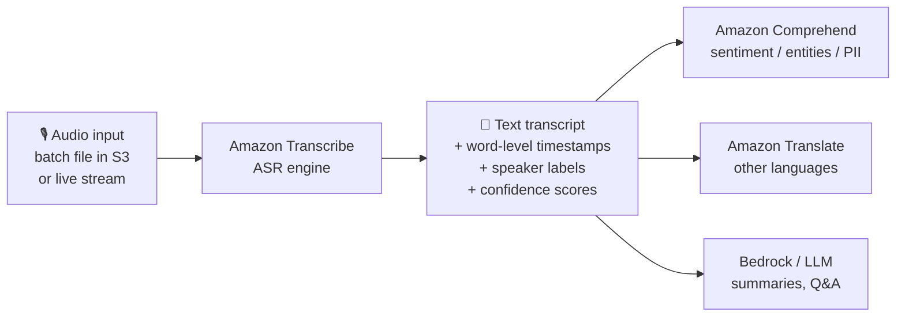

# Amazon Transcribe

Amazon Transcribe is AWS's fully managed **automatic speech recognition (ASR)** service that converts **speech into text** — from audio files or live audio streams.

> **The one reflex:** *If you see "speech-to-text" / "audio → text" / "transcribe a call or meeting" → **Amazon Transcribe**.*

## 🧠 Mental model

Think of Transcribe as a **tireless court stenographer in the cloud**. You feed it audio (a recorded meeting, a live phone call, a doctor's dictation) and it types out every word, notes *who* said it, timestamps each word, and can black out sensitive information (like a redacting clerk) before handing you the transcript. It doesn't understand *meaning* — that's Comprehend's job — it just faithfully writes down what was said.

## Input → Output

| Input | What Transcribe produces |
|-------|--------------------------|
| Audio file in S3 (batch) or live audio stream | JSON transcript with words, timestamps, confidence |
| Multi-speaker meeting | Same transcript **+ speaker labels** (diarization) |
| Two-channel call recording | Separate transcript **per channel** (agent vs. customer) |
| Audio of unknown language | Auto-detected language **+** transcript |
| Sensitive audio (SSNs, credit cards) | Transcript with **PII redacted** |

## What it does

**Core ASR**
- **Batch transcription** — process recorded audio stored in Amazon S3. `$0.006/min` (standard). Best for accuracy, large files, and features that need the whole file.
- **Real-time streaming transcription** — transcribe live audio over HTTP/2 or WebSocket with low latency (for live captions, live agent assist). `$0.01/min` (standard).

**Accuracy customization**
- **Custom vocabulary** — a list of domain terms, product names, acronyms, or jargon so Transcribe spells them correctly. Lightweight; good first step.
- **Custom Language Models (CLM)** — train a model on a **corpus of domain text** (e.g., legal, scientific, medical) for deeper accuracy gains than a vocabulary list. Only billed when applied to a job.
- **Vocabulary filtering** — mask, remove, or flag unwanted words (e.g., profanity).

**Speaker / channel handling**
- **Speaker diarization (partitioning)** — labels *who spoke when* on a **single-channel** recording (`spk_0`, `spk_1`, …). Use for meetings/interviews recorded on one track.
- **Channel identification** — transcribes each **audio channel separately** (e.g., a stereo call where agent = left, customer = right). Two-channel audio is billed as **one stream**.

**Language**
- **Automatic language identification** — detects the spoken language (or picks from a shortlist you provide) so you don't have to specify it up front. Supports 100+ languages via the newer speech-foundation-model ASR system.

**Privacy & moderation**
- **PII redaction (Automatic Content Redaction)** — identifies and redacts personally identifiable information (names, SSNs, card numbers) in the transcript.
- **Toxicity detection** — flags toxic speech in audio (harassment, hate, threats) for moderation of gaming / social / peer-to-peer audio.

**Specialized / higher-level offerings**
- **Amazon Transcribe Medical** — HIPAA-eligible medical ASR for clinical dictation and conversations; batch (Primary Care) and streaming (adds Cardiology, Neurology, Oncology, Radiology, Urology). `~$0.075/min`.
- **Amazon Transcribe Call Analytics** — purpose-built for **contact center** audio. Adds sentiment, call categories, talk-time/interruptions/loudness characteristics, issue detection, and **generative AI call summarization** — on top of the transcript. Post-call and real-time variants.
- **AWS HealthScribe** — generative-AI clinical documentation built on Transcribe (turns patient-clinician conversations into structured clinical notes).

**Pairs well with**
- **Amazon Comprehend** — run sentiment, entity, key-phrase, or topic analysis on the transcript.
- **Amazon Translate** — translate the transcript into other languages (e.g., transcribe → translate → subtitle).
- **Amazon Bedrock / LLMs** — summaries, Q&A, or RAG over transcripts.

## When to use it (and vs alternatives)

| If you need… | Use |
|--------------|-----|
| Convert any speech/audio to text | **Amazon Transcribe** |
| Live captions / real-time agent assist | Transcribe **streaming** |
| Highest accuracy on a recorded file | Transcribe **batch** |
| Medical/clinical dictation (HIPAA) | **Transcribe Medical** |
| Contact-center insights (sentiment, summaries, categories) from calls | **Transcribe Call Analytics** |
| Structured clinical notes from conversations | **AWS HealthScribe** |
| **Meaning** from text — sentiment, entities, PII in *text* | **Amazon Comprehend** (not Transcribe) |
| **Text → speech** (the reverse) | **Amazon Polly** (not Transcribe) |
| Translate text/speech to another language | **Amazon Translate** (after Transcribe) |

**Quick disambiguation**
- Speech → text = **Transcribe**. Text → speech = **Polly**. They are opposites.
- Transcribe gives you *words*; **Comprehend** tells you what the words *mean*.

## Pricing model

Billed **per second** of audio (one-second increments), with a **15-second minimum per request**. Rates are regional (US East N. Virginia shown).

| Dimension | Rate (approx., US East N. Virginia) |
|-----------|-------------------------------------|
| Batch transcription | $0.006 / minute |
| Streaming transcription | $0.01 / minute |
| Automatic Content Redaction (PII) add-on | from $0.0024 / minute (tiered) |
| Custom Language Model (applied) | tiered per-minute add-on |
| Transcribe Medical (batch & streaming) | ~$0.075 / minute |
| Call Analytics — post-call | from $0.0300 / minute (tiered) |
| Call Analytics — generative summarization add-on | from $0.0024 / minute (tiered) |
| **Free tier** | 60 audio minutes / month for the first 12 months |

- Volume **tiers** lower the per-minute rate as usage grows.
- **Two-channel audio counts as one stream** for billing.
- Custom vocabularies and vocabulary filtering are **free** to use; CLMs and content redaction add per-minute charges.

*Always confirm current rates in the region you deploy — see References.*

## 🎯 On the exam

**Reflexes**
- **"Speech-to-text" / "convert audio to text" → Amazon Transcribe.** (Highest-yield trigger.)
- **"Real-time / live captions / streaming audio"** → Transcribe **streaming**. **"Recorded file in S3 / highest accuracy"** → Transcribe **batch**.
- **"Medical / clinical / HIPAA-eligible transcription"** → **Transcribe Medical**.
- **"Call center + sentiment + summaries + call categories"** → **Transcribe Call Analytics** (don't stitch Transcribe + Comprehend by hand if Call Analytics is offered).
- **"Who said what" on one recording** → **speaker diarization**. **Separate agent/customer tracks** → **channel identification**.
- **"Improve accuracy for jargon / product names"** → **custom vocabulary** (quick) or **custom language model** (train on a text corpus, deeper).
- **"Detect the language automatically"** → **automatic language identification**.
- **"Remove SSNs / sensitive data from the transcript"** → **PII redaction / automatic content redaction**.

**Traps**
- Transcribe ≠ Comprehend. Transcribe produces *text*; if the question asks for **sentiment, entities, or PII detection on text**, that's **Comprehend**. (Note: Transcribe *does* offer transcript-level PII redaction, and Call Analytics bundles sentiment — read carefully.)
- Transcribe ≠ Polly. Polly is the **reverse** (text → speech). Don't pick Transcribe for "give the IVR a human voice."
- **Custom vocabulary** (a word list) vs **custom language model** (trained on a text corpus) — the CLM is the heavier, more accurate option; a vocabulary list is the quick fix.
- **Diarization** (one channel, label speakers) vs **channel identification** (multiple channels, one transcript each) — pick based on how the audio was recorded.
- Translation is **not** a Transcribe feature — pair with **Amazon Translate**.

**If you see X, pick this**
| You see… | Pick |
|----------|------|
| "transcribe," "speech to text," "captions," "audio → text" | **Amazon Transcribe** |
| "live / real-time transcription" | Transcribe **streaming** |
| "medical dictation," "HIPAA," "clinician" | **Transcribe Medical** |
| "contact center analytics," "call sentiment + summary" | **Transcribe Call Analytics** |
| "label each speaker" (single track) | **speaker diarization** |
| "agent on one channel, customer on another" | **channel identification** |
| "domain jargon / better accuracy" | **custom vocabulary / custom language model** |
| "redact PII from transcript" | **PII / automatic content redaction** |
| "detect spoken language" | **automatic language identification** |

## References

- Amazon Transcribe — product page: https://aws.amazon.com/transcribe/
- Amazon Transcribe Features: https://aws.amazon.com/transcribe/features/
- Amazon Transcribe Pricing: https://aws.amazon.com/transcribe/pricing/
- What is Amazon Transcribe? (Developer Guide): https://docs.aws.amazon.com/transcribe/latest/dg/what-is.html
- Partitioning speakers (diarization): https://docs.aws.amazon.com/transcribe/latest/dg/diarization.html
- Amazon Transcribe Medical: https://aws.amazon.com/transcribe/medical/
- AWS HealthScribe: https://docs.aws.amazon.com/transcribe/latest/dg/health-scribe.html
- Transcribe FAQs: https://aws.amazon.com/transcribe/faqs/
- New foundation-model ASR (100+ languages): https://aws.amazon.com/blogs/machine-learning/amazon-transcribe-announces-a-new-speech-foundation-model-powered-asr-system-that-expands-support-to-over-100-languages/
