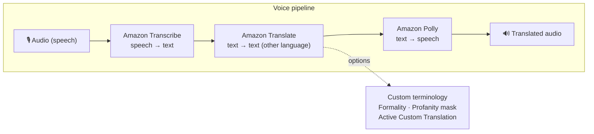

# Amazon Translate

**Amazon Translate** is a fully managed **neural machine translation (NMT)** service that translates text between languages in real time or in batch, with controls for custom terminology, formality, and profanity — no ML model to train or host.

---

## 🧠 Mental model

Think of Translate as a **tireless professional translator on demand**. You hand it text and a target language; it returns fluent, context-aware translation using deep-learning models (not word-by-word dictionaries). If your business has house rules — "always translate *AnyCompany* as *AnyCompany*, never localize it", "keep it formal", "bleep out profanity" — you hand it a small rulebook (**custom terminology** / **Active Custom Translation** / **formality** / **profanity masking**) and it obeys.

It's a **specialist tool**: it does one thing (translation) extremely well, cheaply, and predictably — unlike a general LLM that *can* translate but costs more and is less consistent.

**Input → output at a glance:**

| You send | You get |
|---|---|
| "Hello, how are you?" + target `es` | "Hola, ¿cómo estás?" |
| `auto` source + text | Translate auto-detects source language, then translates |
| Text + **custom terminology** (`AnyCompany → AnyCompany`) | Brand names preserved exactly |
| Text + **formality = FORMAL** (supported langs) | More formal register (e.g., German *Sie* vs *du*) |
| Text + **profanity masking ON** | Profane words replaced with `?$#@$` |
| A folder of docs in S3 (batch) | Translated docs written back to S3 |

---

## What it does

- **Neural machine translation** — context-aware translation across **75+ languages** and thousands of language pairs; translates between pairs using an intermediate representation.
- **Automatic source-language detection** — set source to `auto` and Translate calls Comprehend under the hood to detect the language.
- **Real-time translation** — synchronous `TranslateText` API (and real-time **document** translation for text/HTML/DOCX) for interactive, low-latency use (chat, apps, live captions).
- **Batch (asynchronous) translation** — `StartTextTranslationJob` translates large collections of documents in S3 in one job.
- **Custom terminology** — a glossary (CSV/TMX) that forces specific terms (brand names, product names, acronyms) to translate a fixed way. **No extra charge.**
- **Active Custom Translation (ACT)** — supply **parallel data** (your own example translations) and Translate tailors output to your style/domain **on the fly, without training a custom model**. Higher per-character price.
- **Formality** — set the politeness/register of the output. Supported for a subset of target languages: **French, German, Hindi, Italian, Japanese, Spanish**.
- **Profanity masking** — replace profane words/phrases in the output with a grawlix (`?$#@$`).
- **Encryption & privacy** — integrates with KMS; content isn't used to train the models.

**Delivery modes:** real-time (sync, per-request) and batch (async, over S3). Same per-character rate for standard text and batch; real-time *document* translation is priced by file type.

---

## When to use it (and vs alternatives)

| Scenario | Use | Why |
|---|---|---|
| Translate text/apps/chat between languages | **Amazon Translate** | Purpose-built NMT, cheap, low latency, consistent |
| Preserve brand/product names in translation | **Custom terminology** | Free glossary override |
| Match your domain style without training a model | **Active Custom Translation** (parallel data) | Adapts on the fly; no custom model to manage |
| Control politeness/register | **Formality setting** | Supported target languages only |
| Translate a folder of documents overnight | **Batch translation job** (S3) | Async, high volume |
| Translate **spoken audio** to another language | **Transcribe → Translate → Polly** | Chain: speech→text→translate→speech |
| Generation, summarization, reasoning *plus* translation in one prompt | **Bedrock (LLM)** | LLM is flexible/generative but pricier & less consistent for pure translation |
| Extract entities/sentiment (not translate) | **Amazon Comprehend** | Different job — NLP analysis, not translation |

**Translate vs a generic LLM for translation (exam framing):** Amazon Translate is the **specialist** — lower cost per character, lower latency, predictable/consistent output, glossary + formality + profanity controls, and easy batch over S3. A general LLM (Bedrock) *can* translate and is better when translation is bundled with other language tasks (summarize *then* translate, translate *while* answering), or for very nuanced/creative content — but it costs more, is less consistent, and can drift. **On the exam: "translate text between languages" (especially at scale / low cost / with a glossary) → Amazon Translate**, not a generic LLM.

---

## Pricing model

Pay-per-character (includes whitespace and punctuation), no minimum commitment, no volume tiers. Representative US pricing:

| Dimension | Price (approx.) |
|---|---|
| **Standard text translation** (real-time or batch) | ~$15.00 per **million characters** |
| **Active Custom Translation (ACT)** | ~$60.00 per million characters (≈4× standard) |
| **Real-time document translation** — text/HTML | ~$15.00 per million characters |
| **Real-time document translation** — DOCX | ~$30.00 per million characters |
| **Custom terminology** | **No additional charge** for the feature |
| Parallel data storage (for ACT) | 200 GB free per account; ~$0.023/GB-month excess |

**Free tier:** ~2 million characters/month for 12 months (standard text + batch); ~500K characters/month for 2 months for ACT. No free tier for real-time *document* translation.

> 💡 Exam-relevant cost trap: **ACT costs ~4× standard** — use plain **custom terminology (free)** when you only need to lock brand/term translations; reserve ACT for genuine style/domain adaptation. Batch and standard real-time text cost the same per character. *Always confirm current numbers on the pricing page.*

---

## 🎯 On the exam

**Reflexes — "if you see X, pick Translate":**

- "**Translate** text between languages" (app, website, chat, docs) → **Amazon Translate**.
- "Localize an app but **keep brand/product names** intact" → **Translate + custom terminology** (free).
- "Adapt translations to **our domain/style without training a model**" → **Active Custom Translation** (parallel data).
- "Control how **formal/polite** the translation is" → **Translate formality** (French, German, Hindi, Italian, Japanese, Spanish).
- "**Mask profanity** in output" → **Translate profanity masking**.
- "Translate a **large set of documents** in S3" → **Translate batch (async) job**.
- "Translate **spoken audio** into another language" (and maybe speak it back) → **Transcribe → Translate → Polly** pipeline.
- "Auto-**detect the source language** before translating" → Translate with source `auto` (uses Comprehend).

**Traps & distractors:**

- **Translate vs LLM/Bedrock:** for pure, high-volume, low-cost, consistent translation → **Translate**. Pick Bedrock only when translation is bundled with generation/summarization/reasoning in the same step. Don't over-engineer with an LLM when Translate fits.
- **Custom terminology vs Active Custom Translation:** terminology = *free glossary* to fix specific terms; ACT = *paid, style/domain adaptation* via parallel data. If the ask is "keep these exact terms" → terminology. If "match our tone/domain" → ACT.
- **The classic speech-translation chain is three services:** **Transcribe (speech→text) → Translate (text→text) → Polly (text→speech)**. Translate does **not** handle audio itself — a distractor may imply it does.
- **Formality is language-limited** — only the six supported target languages. A question expecting formality control in an unsupported language is a trap.
- **Translate ≠ Comprehend.** Translate = translation; Comprehend = entities/sentiment/PII/language detection. (Translate *uses* Comprehend for auto source detection, but they're distinct services.)
- **Same price for real-time text and batch text** — don't assume batch is cheaper. Real-time *document* (esp. DOCX) can cost more.

---

## References

- Amazon Translate — product page: https://aws.amazon.com/translate/
- Amazon Translate — features: https://aws.amazon.com/translate/details/
- Developer Guide (how it works): https://docs.aws.amazon.com/translate/latest/dg/how-it-works.html
- Customizing translations (overview): https://docs.aws.amazon.com/translate/latest/dg/customizing-translations.html
- Custom terminology: https://docs.aws.amazon.com/translate/latest/dg/how-custom-terminology.html
- Active Custom Translation: https://docs.aws.amazon.com/translate/latest/dg/customizing-translations-parallel-data.html
- Setting formality: https://docs.aws.amazon.com/translate/latest/dg/customizing-translations-formality.html
- Masking profanity: https://docs.aws.amazon.com/translate/latest/dg/customizing-translations-profanity.html
- Asynchronous batch translation: https://docs.aws.amazon.com/translate/latest/dg/async.html
- Amazon Translate pricing: https://aws.amazon.com/translate/pricing/
