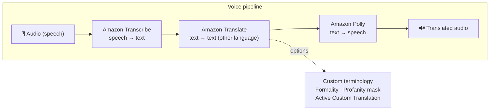

# Amazon Translate

**Amazon Translate** is a fully managed **neural machine translation (NMT)** service that translates text between languages in real time or in batch, with controls for custom terminology, formality, and profanity — no ML model to train or host.

> **Why (the rationale):** Amazon Translate is a purpose-built NMT service — lower cost per character, lower latency, and more consistent output than asking a general LLM to translate. It includes controls (custom terminology, formality, profanity masking, batch over S3) that LLMs don't expose natively. Pick Translate when the primary job is language conversion; pick Bedrock only when translation is bundled with generation or reasoning in the same step.
> **When to use:** Localize an app/website/chat, translate a large document corpus in S3, add live captions in another language, or build the middle step of a Transcribe → Translate → Polly speech-translation pipeline. Signal: "translate text between languages," "localize content," "multilingual," "keep brand names intact."
> **Nuances & gotchas:** Translate does NOT handle audio — the speech-translation pipeline requires three services (Transcribe → Translate → Polly). Formality control supports **11 target languages as of 2024** (Dutch, French, French-Canada, German, Hindi, Italian, Japanese, Korean, Portuguese-Portugal, Spanish, Spanish-Mexico); don't assume it works for all languages — verify the current list in the docs as AWS continues to add more. Active Custom Translation (ACT) costs ~4× standard — use free custom terminology for term-locking, reserve ACT for genuine style/domain adaptation. Batch and real-time text cost the same per character; DOCX real-time document translation costs more.

---

## 🧠 Mental model

Think of Translate as a **tireless professional translator on demand**. You hand it text and a target language; it returns fluent, context-aware translation using deep-learning models (not word-by-word dictionaries). If your business has house rules — "always translate *AnyCompany* as *AnyCompany*, never localize it", "keep it formal", "bleep out profanity" — you hand it a small rulebook (**custom terminology** / **Active Custom Translation** / **formality** / **profanity masking**) and it obeys.

It's a **specialist tool**: it does one thing (translation) extremely well, cheaply, and predictably — unlike a general LLM that *can* translate but costs more and is less consistent.

```mermaid
flowchart LR
    subgraph Voice pipeline
      A["🎙️ Audio (speech)"] --> B["Amazon Transcribe<br/>speech → text"]
      B --> C["Amazon Translate<br/>text → text (other language)"]
      C --> D["Amazon Polly<br/>text → speech"]
      D --> E["🔊 Translated audio"]
    end
    C -.->|options| F["Custom terminology<br/>Formality · Profanity mask<br/>Active Custom Translation"]
```

**Input → output at a glance:**

| You send | You get |
|---|---|
| "Hello, how are you?" + target `es` | "Hola, ¿cómo estás?" |
| `auto` source + text | Translate auto-detects source language, then translates |
| Text + **custom terminology** (`AnyCompany → AnyCompany`) | Brand names preserved exactly |
| Text + **formality = FORMAL** (11 supported target langs, e.g., German, Japanese, French) | More formal register (e.g., German *Sie* vs *du*; Japanese Teineigo vs Kudaketa) |
| Text + **profanity masking ON** | Profane words replaced with `?$#@$` |
| A folder of docs in S3 (batch) | Translated docs written back to S3 |

---

## What it does

> **Why (the rationale):** NMT understands context across the whole sentence (not word-by-word), producing fluent, natural-sounding translation — critical for user-facing content and customer communications.
> **When to use:** Any text translation task at scale: app UI, chat messages, help articles, legal documents, S3 document batches. Source `auto` detection is convenient when input language is unknown.
> **Nuances & gotchas:** Translate converts between language pairs via an intermediate representation — not all language pairs have equal quality; some low-resource language pairs may be less accurate than well-supported ones (e.g., English↔Spanish). Automatic source detection calls Amazon Comprehend under the hood — this is billed at Translate rates, not Comprehend rates.

- **Neural machine translation** — context-aware translation across **75+ languages** and thousands of language pairs; translates between pairs using an intermediate representation. **Why NMT over older statistical MT:** NMT reads the whole sentence at once (via encoder-decoder attention), capturing meaning and context rather than substituting words one-by-one — producing fluent, idiomatic output even for complex sentence structures.
- **Automatic source-language detection** — set source to `auto` and Translate calls Comprehend under the hood to detect the language.
- **Real-time translation** — synchronous `TranslateText` API (and real-time **document** translation for text/HTML/DOCX) for interactive, low-latency use (chat, apps, live captions).
- **Batch (asynchronous) translation** — `StartTextTranslationJob` translates large collections of documents in S3 in one job.

> **Why (the rationale):** Batch translation processes entire S3 folders of documents asynchronously — no per-file API calls, no timeout concerns, and the same per-character cost as real-time text translation.
> **When to use:** Large document corpora (product catalogs, knowledge bases, regulatory filings) where you need to translate hundreds or thousands of files overnight. Signal: "translate all documents in an S3 bucket," "batch localization job."
> **Nuances & gotchas:** Batch text/HTML and real-time text cost the SAME per character — batch is not cheaper. DOCX real-time document translation costs 2× more. Batch jobs write output to a destination S3 prefix; monitor job status via the API or EventBridge.
> **Why (the rationale):** Custom terminology prevents Translate from localizing brand names, product names, or legal terms that must remain fixed — it's a free override that requires no model training.
> **When to use:** Signal: "keep brand/product names exactly the same," "don't translate our trademark," "consistent term mapping." Works for up to thousands of terms per glossary.
> **Nuances & gotchas:** Custom terminology is FREE — there is no per-character surcharge. It forces an exact substitution; it does NOT adapt style or tone. For style/domain adaptation you need ACT. Terminology is applied at inference time, so you can update the glossary without retraining anything.

- **Custom terminology** — a glossary (CSV/TMX) that forces specific terms (brand names, product names, acronyms) to translate a fixed way. **No extra charge.** **Why:** Neural MT models are trained to localize everything — they will translate "AnyCompany" to its foreign-language equivalent or change product names unless you pin them with a glossary. Custom terminology applies an exact-match override at inference time with no retraining needed.
- **Active Custom Translation (ACT)** — supply **parallel data** (your own example source-target sentence pairs) and Translate tailors output to your style/domain **on the fly, without training a custom model**. Higher per-character price. **Why:** Custom terminology locks individual terms but can't adapt sentence structure, tone, or domain phrasing. ACT uses your bilingual examples to bias the model's output style without fine-tuning — giving domain-adapted quality (e.g., matching legal or medical register) without hosting a custom model.

> **Why (the rationale):** ACT adapts translation style and domain terminology using your own example sentence pairs — giving custom-model quality without the cost and complexity of hosting a custom model.
> **When to use:** When custom terminology is insufficient (you need tone, phrasing, or domain-specific sentence structure to match your style). Signal: "match our translation style," "adapt to our legal/medical/marketing register."
> **Nuances & gotchas:** ACT costs ~4× the standard translation rate (~$60 vs $15 per million characters). If you only need term-locking, use custom terminology (free). ACT adapts output on the fly — no separate training step, but you must upload parallel data (bilingual example pairs) first.
- **Formality** — set the politeness/register of the output. Supported for a subset of target languages: **Dutch, French, French (Canada), German, Hindi, Italian, Japanese, Korean, Portuguese (Portugal), Spanish, and Spanish (Mexico)** (11 languages as of 2024; always verify the current list in the [docs](https://docs.aws.amazon.com/translate/latest/dg/customizing-translations-formality.html) as AWS adds more). **Why:** Many languages have grammatically distinct formal and informal registers (e.g., German *Sie* vs *du*, Japanese Teineigo vs Kudaketa) — without formality control, Translate may produce the wrong register for a business context.
- **Profanity masking** — replace profane words/phrases in the output with a grawlix (`?$#@$`). **Why:** User-generated content (chat, reviews, support tickets) frequently contains profanity; masking it server-side before the translated text reaches a customer-facing UI avoids building a separate content-moderation pipeline for each target language.
- **Encryption & privacy** — integrates with KMS; content isn't used to train the models.

**Delivery modes:** real-time (sync, per-request) and batch (async, over S3). Same per-character rate for standard text and batch; real-time *document* translation is priced by file type.

---

## When to use it (and vs alternatives)

| Scenario | Use | Why |
|---|---|---|
| Translate text/apps/chat between languages | **Amazon Translate** | Purpose-built NMT, cheap, low latency, consistent |
| Preserve brand/product names in translation | **Custom terminology** | Free glossary override |
| Match your domain style without training a model | **Active Custom Translation** (parallel data) | Adapts on the fly; no custom model to manage |
| Control politeness/register | **Formality setting** | Supported target languages only |
| Translate a folder of documents overnight | **Batch translation job** (S3) | Async, high volume |
| Translate **spoken audio** to another language | **Transcribe → Translate → Polly** | Chain: speech→text→translate→speech |
| Generation, summarization, reasoning *plus* translation in one prompt | **Bedrock (LLM)** | LLM is flexible/generative but pricier & less consistent for pure translation |
| Extract entities/sentiment (not translate) | **Amazon Comprehend** | Different job — NLP analysis, not translation |

**Translate vs a generic LLM for translation (exam framing):** Amazon Translate is the **specialist** — lower cost per character, lower latency, predictable/consistent output, glossary + formality + profanity controls, and easy batch over S3. A general LLM (Bedrock) *can* translate and is better when translation is bundled with other language tasks (summarize *then* translate, translate *while* answering), or for very nuanced/creative content — but it costs more, is less consistent, and can drift. **On the exam: "translate text between languages" (especially at scale / low cost / with a glossary) → Amazon Translate**, not a generic LLM.

---

## Pricing model

Pay-per-character (includes whitespace and punctuation), no minimum commitment, no volume tiers. Representative US pricing:

| Dimension | Price (approx.) |
|---|---|
| **Standard text translation** (real-time or batch) | ~$15.00 per **million characters** |
| **Active Custom Translation (ACT)** | ~$60.00 per million characters (≈4× standard) |
| **Real-time document translation** — text/HTML | ~$15.00 per million characters |
| **Real-time document translation** — DOCX | ~$30.00 per million characters |
| **Custom terminology** | **No additional charge** for the feature |
| Parallel data storage (for ACT) | 200 GB free per account; ~$0.023/GB-month excess |

**Free tier:** ~2 million characters/month for 12 months (standard text + batch); ~500K characters/month for 2 months for ACT. No free tier for real-time *document* translation.

> 💡 Exam-relevant cost trap: **ACT costs ~4× standard** — use plain **custom terminology (free)** when you only need to lock brand/term translations; reserve ACT for genuine style/domain adaptation. Batch and standard real-time text cost the same per character. *Always confirm current numbers on the pricing page.*

---

## 🎯 On the exam

**Reflexes — "if you see X, pick Translate":**

- "**Translate** text between languages" (app, website, chat, docs) → **Amazon Translate**.
- "Localize an app but **keep brand/product names** intact" → **Translate + custom terminology** (free).
- "Adapt translations to **our domain/style without training a model**" → **Active Custom Translation** (parallel data).
- "Control how **formal/polite** the translation is" → **Translate formality** (Dutch, French, French-Canada, German, Hindi, Italian, Japanese, Korean, Portuguese-Portugal, Spanish, Spanish-Mexico — verify current list in docs).
- "**Mask profanity** in output" → **Translate profanity masking**.
- "Translate a **large set of documents** in S3" → **Translate batch (async) job**.
- "Translate **spoken audio** into another language" (and maybe speak it back) → **Transcribe → Translate → Polly** pipeline.
- "Auto-**detect the source language** before translating" → Translate with source `auto` (uses Comprehend).

**Traps & distractors:**

- **Translate vs LLM/Bedrock:** for pure, high-volume, low-cost, consistent translation → **Translate**. Pick Bedrock only when translation is bundled with generation/summarization/reasoning in the same step. Don't over-engineer with an LLM when Translate fits.
- **Custom terminology vs Active Custom Translation:** terminology = *free glossary* to fix specific terms; ACT = *paid, style/domain adaptation* via parallel data. If the ask is "keep these exact terms" → terminology. If "match our tone/domain" → ACT.
- **The classic speech-translation chain is three services:** **Transcribe (speech→text) → Translate (text→text) → Polly (text→speech)**. Translate does **not** handle audio itself — a distractor may imply it does.
- **Formality is language-limited** — only the supported target languages (11 as of 2024: Dutch, French, French-Canada, German, Hindi, Italian, Japanese, Korean, Portuguese-Portugal, Spanish, Spanish-Mexico). A question expecting formality control in an unsupported language (e.g., Chinese, Arabic) is a trap.
- **Translate ≠ Comprehend.** Translate = translation; Comprehend = entities/sentiment/PII/language detection. (Translate *uses* Comprehend for auto source detection, but they're distinct services.)
- **Same price for real-time text and batch text** — don't assume batch is cheaper. Real-time *document* (esp. DOCX) can cost more.

---

---

## Glossary

| Term | Simple explanation | Purpose |
|---|---|---|
| Amazon Translate | Fully managed AWS neural machine translation service that converts text between languages | Provides cheap, fast, consistent translation without building or hosting an ML model |
| NMT | Neural Machine Translation — deep-learning approach to translation that understands context | Produces fluent, natural-sounding translations instead of word-by-word substitutions |
| TranslateText | Synchronous Translate API for real-time text translation | Used in interactive apps, chat, and live caption pipelines |
| StartTextTranslationJob | Asynchronous Translate API that processes a batch of documents in S3 | Used for large overnight translation workloads across many files |
| Automatic source-language detection | Setting source language to `auto` so Translate identifies the input language via Comprehend | Removes the need to know or specify the source language before translating |
| Custom terminology | A glossary (CSV or TMX) that forces specific terms to always translate the same way | Preserves brand names, product names, and acronyms exactly as required |
| TMX | Translation Memory eXchange — standard file format for bilingual glossaries and memories | Supported format for uploading custom terminology or parallel data to Translate |
| Active Custom Translation (ACT) | Feature that uses parallel data (example translations) to adapt output to your style on the fly | Tailors translation to your domain without training or hosting a custom model |
| Parallel data | Your own example source-target translation pairs used to train ACT | Teaches Translate to mimic your organization's preferred phrasing and terminology |
| Formality | Translate option that controls the politeness register of the output (formal vs. informal) | Used for languages with distinct formal/informal forms; supported for 11 target languages as of 2024 (Dutch, French, French-Canada, German, Hindi, Italian, Japanese, Korean, Portuguese-Portugal, Spanish, Spanish-Mexico) — verify current list in docs |
| Profanity masking | Translate option that replaces offensive words in the output with a grawlix (`?$#@$`) | Keeps translated content appropriate for customer-facing or regulated contexts |
| Grawlix | Typographic placeholder (`?$#@$`) substituted for profane words when masking is on | Indicates redacted content while preserving sentence flow |
| Real-time document translation | Translate mode that converts a formatted document (text, HTML, DOCX) in one synchronous call | Preserves document structure and formatting alongside the translated content |
| Language pair | A specific source-language to target-language combination supported by Translate | Translate converts between pairs via an intermediate representation, enabling thousands of combinations |
| Amazon Comprehend | AWS NLP service for sentiment, entity, and language detection on text | Used under the hood by Translate for automatic source-language detection |
| Amazon Transcribe | AWS speech-to-text service that is the first step of the speech-translation pipeline | Converts audio to text before Translate handles the language conversion |
| Amazon Polly | AWS text-to-speech service that is the last step of the speech-translation pipeline | Speaks the translated text in the target language after Translate produces it |
| Amazon Bedrock | AWS platform for running foundation models including large language models | Alternative to Translate when translation is bundled with generation or reasoning in one prompt |
| KMS | AWS Key Management Service used to encrypt Translate data at rest | Ensures customer content sent to Translate is encrypted and not used to train AWS models |
| Per-character billing | Translate pricing model that charges by the number of input characters (including whitespace) | Predictable cost model; no minimum commitment or volume tiers |
| Free tier | ~2 million characters per month for 12 months for standard text translation | Allows experimentation and small-scale production without cost |

## References

- Amazon Translate — product page: https://aws.amazon.com/translate/
- Amazon Translate — features: https://aws.amazon.com/translate/details/
- Developer Guide (how it works): https://docs.aws.amazon.com/translate/latest/dg/how-it-works.html
- Customizing translations (overview): https://docs.aws.amazon.com/translate/latest/dg/customizing-translations.html
- Custom terminology: https://docs.aws.amazon.com/translate/latest/dg/how-custom-terminology.html
- Active Custom Translation: https://docs.aws.amazon.com/translate/latest/dg/customizing-translations-parallel-data.html
- Setting formality: https://docs.aws.amazon.com/translate/latest/dg/customizing-translations-formality.html
- Masking profanity: https://docs.aws.amazon.com/translate/latest/dg/customizing-translations-profanity.html
- Asynchronous batch translation: https://docs.aws.amazon.com/translate/latest/dg/async.html
- Amazon Translate pricing: https://aws.amazon.com/translate/pricing/
