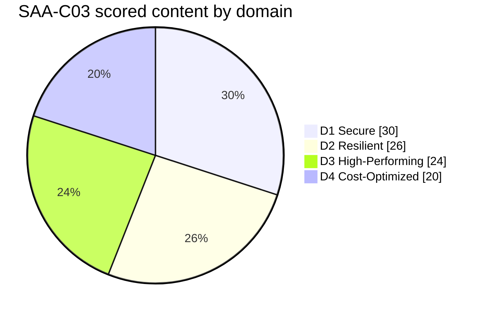
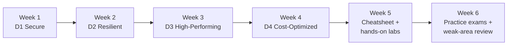

# SAA-C03 — Exam Overview & Study Plan

The **AWS Certified Solutions Architect – Associate (SAA-C03)** validates that you can design **secure, resilient, high-performing, and cost-optimized** architectures on AWS. It is scenario-based: almost every question describes a situation and asks for the *best* design given a qualifier (*MOST cost-effective*, *MOST highly available*, *LEAST operational overhead*, *BEST performance*).

> **Plain English:** SAA-C03 doesn't test whether you can *recite* what a service does — it tests whether you can *pick the right service for the situation*. The whole exam is pattern-matching "scenario → the AWS-recommended design." This course drills those patterns as **"🎯 On the exam"** reflexes on every page.

Sources: [SAA-C03 exam guide](https://docs.aws.amazon.com/aws-certification/latest/solutions-architect-associate-03/solutions-architect-associate-03.html) · [Exam guide PDF](https://d1.awsstatic.com/training-and-certification/docs-sa-assoc/AWS-Certified-Solutions-Architect-Associate_Exam-Guide_C03.pdf) · [Official certification page](https://aws.amazon.com/certification/certified-solutions-architect-associate/)

---

## Exam at a glance

| Item | Value |
|---|---|
| **Exam code** | SAA-C03 |
| **Level** | Associate |
| **Questions** | 65 total — **50 scored + 15 unscored** |
| **Question types** | Multiple choice (1 correct of 4) and multiple response (2+ correct of 5+) |
| **Time** | 130 minutes |
| **Passing score** | **720 / 1000** (scaled; ≈ 72%) |
| **Scoring model** | Compensatory — you only need to pass **overall**, no per-domain minimum |
| **Cost** | $150 USD |
| **Validity** | 3 years |
| **Delivery** | Pearson VUE / PSI — test center or online proctored |
| **Prerequisites** | None (AWS recommends ~1 year hands-on experience) |
| **Languages** | English, Japanese, Korean, Simplified Chinese, and more |

> **The 15 unscored questions look identical to scored ones** — never skip a question, and always answer (no penalty for guessing).

---

## Domain breakdown & what each covers

### Domain 1 — Design Secure Architectures (30%) — the biggest
Secure access to AWS resources; secure workloads/applications; data protection.
- **Identity & access:** IAM (users/groups/roles/policies, permission boundaries, policy evaluation), STS & cross-account `AssumeRole`, **IAM Identity Center**, **Organizations & SCPs**, MFA, **Cognito** (user vs identity pools).
- **Data protection:** **KMS** (key policies, envelope encryption, rotation), **Secrets Manager vs Parameter Store**, **ACM**, S3 encryption (SSE-S3/SSE-KMS/DSSE-KMS/SSE-C), TLS in transit.
- **Network & app security:** **Security Groups vs NACLs**, **VPC endpoints** (gateway vs interface/PrivateLink), **WAF**, **Shield**, **Network Firewall**; **GuardDuty / Inspector / Macie / Security Hub / Config / CloudTrail / Detective**; S3 Block Public Access, bucket policies, presigned URLs.

→ [Study page: 01 — Design Secure Architectures](01-design-secure-architectures.md)

### Domain 2 — Design Resilient Architectures (26%)
Highly available, fault-tolerant, and decoupled architectures; disaster recovery.
- **HA/fault tolerance:** Multi-AZ, **Auto Scaling Groups**, **ELB** (ALB/NLB/GWLB), health checks.
- **Decoupling:** **SQS / SNS / EventBridge / Step Functions / Amazon MQ**.
- **Disaster recovery:** the four strategies (**Backup & Restore, Pilot Light, Warm Standby, Multi-Site**) mapped to **RTO/RPO**; **AWS Backup**, **Elastic Disaster Recovery**.
- **DNS & data resilience:** **Route 53** routing policies + failover; **RDS Multi-AZ vs read replicas**, **Aurora Global Database**, **DynamoDB global tables**, **S3 versioning/replication**.

→ [Study page: 02 — Design Resilient Architectures](02-design-resilient-architectures.md)

### Domain 3 — Design High-Performing Architectures (24%)
Performant and scalable compute, storage, databases, and networking.
- **Compute/storage/database selection:** EC2 families, Lambda, ECS/EKS/Fargate; **EBS** types, **EFS**, **FSx** variants; **RDS/Aurora**, **DynamoDB** (+ **DAX**), **ElastiCache** (Redis vs Memcached), **RDS Proxy**.
- **Caching & edge:** **CloudFront**, **Global Accelerator** (and when to use which).
- **Networking & analytics:** VPC endpoints, Transit Gateway, Direct Connect vs VPN; **Kinesis**, **Athena**, **Glue**, **EMR**, **Redshift**, **OpenSearch**.

→ [Study page: 03 — Design High-Performing Architectures](03-design-high-performing-architectures.md)

### Domain 4 — Design Cost-Optimized Architectures (20%) — the smallest
Cost-effective compute, storage, database, and networking.
- **Pricing models:** On-Demand, **Reserved Instances**, **Savings Plans**, **Spot**, Dedicated Hosts; **Compute Optimizer** right-sizing.
- **Storage/database cost:** **S3 storage classes + lifecycle + Intelligent-Tiering**, EBS gp3, snapshots/DLM; **Aurora Serverless v2**, DynamoDB on-demand vs provisioned.
- **Networking cost:** data-transfer pricing, **NAT Gateway vs gateway VPC endpoint**, CloudFront to cut egress.
- **Cost tools:** **Cost Explorer**, **Budgets**, **CUR**, **Trusted Advisor**, consolidated billing.

→ [Study page: 04 — Design Cost-Optimized Architectures](04-design-cost-optimized-architectures.md)

---

## The mental model that answers most questions

Every scenario is really asking *"optimize for one of four things."* Read the **qualifier** first, then pick the design that wins on that axis:

| The qualifier says… | You are being tested on… | Reach for… |
|---|---|---|
| "most **secure** / least privilege / encrypted / private" | **Domain 1** | IAM roles, KMS, SG/NACL, VPC endpoints, Guard/Inspector/Macie |
| "**highly available** / fault-tolerant / survive an AZ or Region failure / decouple" | **Domain 2** | Multi-AZ, Auto Scaling, ELB, SQS/SNS, Route 53 failover, Aurora Global |
| "**best performance** / fastest / highest throughput / lowest latency" | **Domain 3** | right instance/volume, DAX/ElastiCache, CloudFront/Global Accelerator |
| "**most cost-effective** / cheapest / lowest cost" | **Domain 4** | Spot/Savings Plans, S3 IA/Glacier, gateway endpoints, right-sizing |

> **When two answers both "work,"** the qualifier decides. A working but pricey option loses to a working cheaper one on a *cost* question — and vice-versa on an *availability* question. Also prefer **managed / less operational overhead** unless the question rewards control.

---

## 5–6 week study plan

| Week | Focus | Do this |
|---|---|---|
| 1 | **Domain 1 (30%)** | Read [01](01-design-secure-architectures.md); in the console: create an IAM role + cross-account trust, a KMS key, a Security Group vs NACL, an S3 bucket policy |
| 2 | **Domain 2 (26%)** | Read [02](02-design-resilient-architectures.md); stand up an ALB + Auto Scaling Group across 2 AZs; wire SQS → Lambda; try an RDS Multi-AZ |
| 3 | **Domain 3 (24%)** | Read [03](03-design-high-performing-architectures.md); compare EBS gp3 vs io2; create a CloudFront distribution; a DynamoDB table + DAX |
| 4 | **Domain 4 (20%)** | Read [04](04-design-cost-optimized-architectures.md); set S3 lifecycle rules; add a gateway VPC endpoint; open Cost Explorer + a Budget |
| 5 | **Consolidate** | Study the [cheatsheet](05-core-services-cheatsheet.md) — memorize the **"if you see X → pick Y"** table cold |
| 6 | **Practice** | Work the [58-question bank](99-practice-questions.md) + timed full-length practice exams; re-read every **🎯 On the exam** callout for missed topics |

**Readiness signal:** you consistently score **≥ 80%** on practice exams and can instantly recognize the classic disambiguations (SG vs NACL, Multi-AZ vs read replica, RI vs Savings Plan vs Spot, EBS vs EFS vs FSx, S3 storage class by access pattern, CloudFront vs Global Accelerator).

---

## Exam-day tactics

- **Read the qualifier first.** *MOST cost-effective / MOST available / LEAST operational overhead / BEST performance* is what separates the right answer from a workable-but-wrong distractor.
- **Eliminate, don't just select.** Two options are usually clearly wrong (wrong service or fails a hard requirement). Cut those, then let the qualifier break the tie between the last two.
- **Prefer managed + serverless** when the question rewards *low operational overhead*; prefer *reserved/Spot* on cost; prefer *Multi-AZ/Multi-Region* on availability.
- **Watch the hard constraints:** "must be private/no internet" → VPC endpoint / PrivateLink; "no code changes" → managed feature; "existing on-prem" → hybrid (Direct Connect / Storage Gateway / DataSync).
- **Time budget:** 130 min / 65 Q ≈ **2 min/question**. Flag long scenarios and return to them; don't sink 6 minutes into one item.
- **Never leave blanks** — no penalty for guessing, and unscored questions look identical to scored ones.

---

## Glossary

| Term | Simple explanation | Purpose |
|---|---|---|
| **SAA-C03** | Exam code for AWS Solutions Architect – Associate | The certification this course prepares you for |
| **Region** | A geographic area with multiple isolated data centers | Data residency, latency, service availability |
| **Availability Zone (AZ)** | One or more discrete data centers within a Region | Deploy across AZs for high availability |
| **Compensatory scoring** | Overall scaled score decides pass/fail; no per-domain minimum | A weak domain can be offset by strong ones |
| **RTO** | Recovery Time Objective — how fast you must recover | Drives DR strategy choice |
| **RPO** | Recovery Point Objective — how much data loss is acceptable | Drives DR/replication choice |
| **Multi-AZ** | Running across ≥ 2 Availability Zones | High availability / automatic failover |
| **Managed service** | AWS runs the undifferentiated heavy lifting | Lower operational overhead (a frequent exam qualifier) |
| **Least privilege** | Grant only the permissions a principal needs | Core Domain-1 security principle |
| **Qualifier** | The optimize-for word in a question (cost / availability / performance / overhead) | Decides the "best" answer between workable options |
| **Well-Architected Framework** | AWS's design best-practices across 6 pillars | The philosophy the exam is built on |

---

## References

- [SAA-C03 official exam guide](https://docs.aws.amazon.com/aws-certification/latest/solutions-architect-associate-03/solutions-architect-associate-03.html)
- [SAA-C03 exam guide (PDF)](https://d1.awsstatic.com/training-and-certification/docs-sa-assoc/AWS-Certified-Solutions-Architect-Associate_Exam-Guide_C03.pdf)
- [AWS Certified Solutions Architect – Associate certification page](https://aws.amazon.com/certification/certified-solutions-architect-associate/)
- [AWS Well-Architected Framework](https://docs.aws.amazon.com/wellarchitected/latest/framework/welcome.html)
- [AWS Architecture Center](https://aws.amazon.com/architecture/)

---

*Part of the [AWS Solutions Architect Associate course](README.md) · SAA-C03.*
