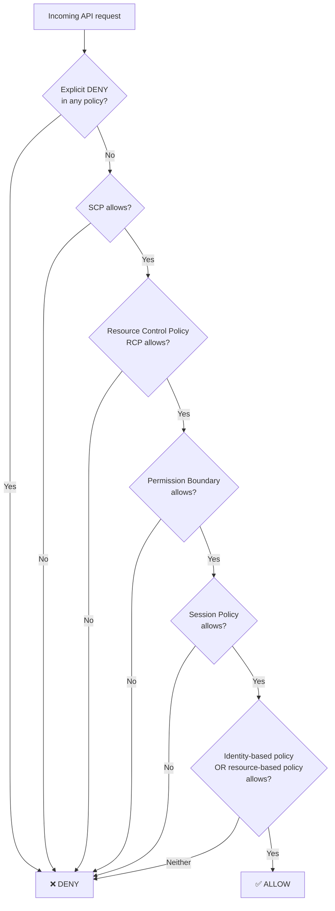
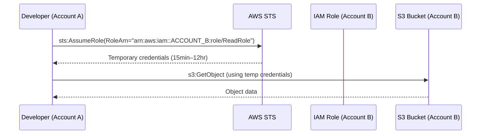
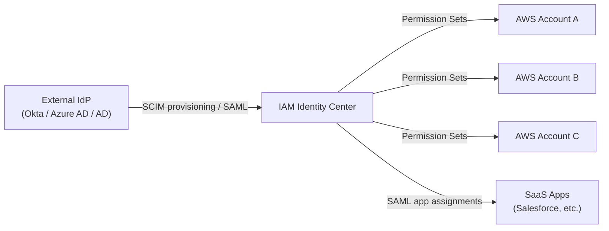
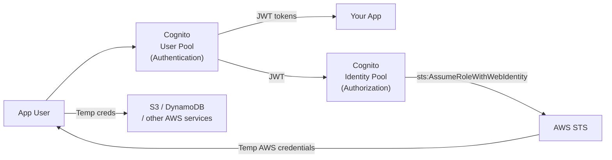
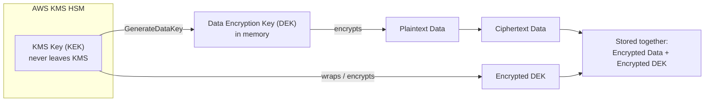
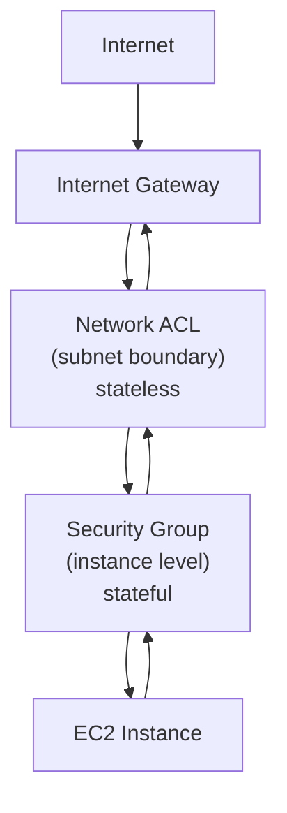
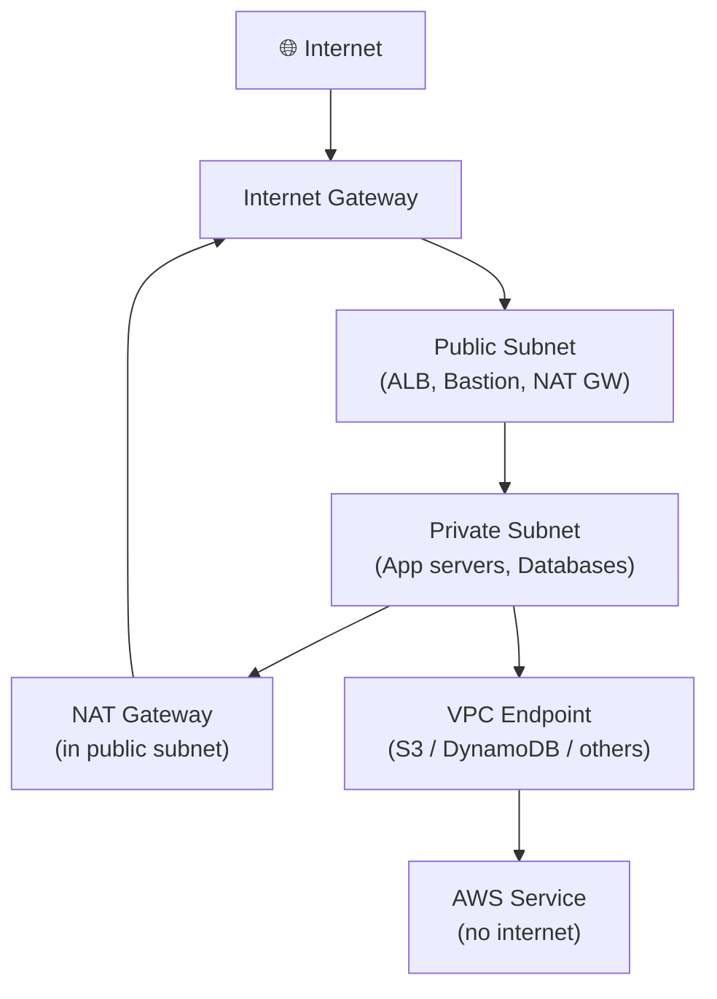

# Domain 1: Design Secure Architectures

> **30% of the SAA-C03 exam — the single largest domain. Master this and you are more than a third of the way to passing.**

Security is woven into every AWS solution. Domain 1 tests whether you can select the *right* security control for the *right* job — not just name services, but reason through how they interact, where they apply, and which one AWS prefers in each scenario-based question.

> **Plain English mental model:** Think of AWS security in four concentric rings.
> 1. **Who are you?** (IAM, Cognito, Identity Center, Organizations/SCPs)
> 2. **Is your data locked?** (KMS, CloudHSM, Secrets Manager, S3 encryption, ACM)
> 3. **Can the network reach it?** (Security Groups, NACLs, VPC endpoints, WAF, Shield, Network Firewall)
> 4. **Did anyone do something suspicious?** (GuardDuty, Inspector, Macie, Security Hub, Config, CloudTrail, Detective)
>
> Every exam question fits into one (or more) of these rings. Identify the ring first, then select the service.

---

## Table of Contents

1. [Task Statements Overview](#task-statements-overview)
2. [Identity & Access Management](#identity--access-management)
   - [IAM Core Concepts](#iam-core-concepts)
   - [IAM Policy Evaluation Logic](#iam-policy-evaluation-logic)
   - [STS & Cross-Account AssumeRole](#sts--cross-account-assumerole)
   - [IAM Identity Center (SSO)](#iam-identity-center-sso)
   - [AWS Organizations & SCPs](#aws-organizations--scps)
   - [Amazon Cognito](#amazon-cognito)
3. [Data Protection & Encryption](#data-protection--encryption)
   - [AWS KMS](#aws-kms)
   - [AWS CloudHSM](#aws-cloudhsm)
   - [Secrets Manager vs SSM Parameter Store](#secrets-manager-vs-ssm-parameter-store)
   - [AWS Certificate Manager (ACM)](#aws-certificate-manager-acm)
   - [S3 Encryption](#s3-encryption)
4. [Network Security](#network-security)
   - [Security Groups vs Network ACLs](#security-groups-vs-network-acls)
   - [VPC Design for Security](#vpc-design-for-security)
   - [VPC Endpoints & PrivateLink](#vpc-endpoints--privatelink)
   - [AWS WAF](#aws-waf)
   - [AWS Shield](#aws-shield)
   - [AWS Network Firewall](#aws-network-firewall)
5. [Detection & Governance](#detection--governance)
   - [Amazon GuardDuty](#amazon-guardduty)
   - [Amazon Inspector](#amazon-inspector)
   - [Amazon Macie](#amazon-macie)
   - [AWS Security Hub](#aws-security-hub)
   - [AWS Config](#aws-config)
   - [AWS CloudTrail](#aws-cloudtrail)
   - [Amazon Detective](#amazon-detective)
6. [S3 Security Controls](#s3-security-controls)
7. [Glossary](#glossary)
8. [References](#references)

---

## Task Statements Overview

Domain 1 is divided into three task statements per the [official SAA-C03 exam guide](https://docs.aws.amazon.com/aws-certification/latest/solutions-architect-associate-03/solutions-architect-associate-03.html):

| Task | Statement | Key Services |
|------|-----------|-------------|
| **1.1** | Design secure access to AWS resources | IAM, STS, Identity Center, Organizations, Cognito |
| **1.2** | Design secure workloads and applications | Security Groups, NACLs, VPC endpoints, WAF, Shield |
| **1.3** | Determine appropriate data security controls | KMS, CloudHSM, Secrets Manager, ACM, S3 encryption |

---

## Identity & Access Management

### IAM Core Concepts

[AWS IAM](https://docs.aws.amazon.com/IAM/latest/UserGuide/introduction.html) is the foundation of AWS security. It controls **who** (authentication) can do **what** (authorization) on **which resources**.

#### Building Blocks

| Concept | What it is | Key rule |
|---------|-----------|---------|
| **IAM User** | Permanent identity for a human or application | Has long-term access keys; avoid for production workloads — use roles instead |
| **IAM Group** | Collection of users sharing the same policy | Cannot be nested; cannot be referenced as a principal |
| **IAM Role** | Temporary identity assumed by a principal (user, service, account) | No long-term credentials; delivers short-lived tokens via STS |
| **Identity-based policy** | Attached to a user/group/role; defines what *they* can do | JSON; managed (AWS or customer) or inline |
| **Resource-based policy** | Attached to a resource (S3 bucket, KMS key, SQS queue); defines who can *use it* | Contains a `Principal` element; S3 bucket policies are the canonical example |
| **Permission boundary** | Limits the *maximum* permissions an IAM entity can have | Does not grant permissions by itself; used to delegate role/user creation safely |
| **IAM Instance Profile** | Container that passes an IAM role to an EC2 instance | One role per instance; credentials rotated automatically via instance metadata |

#### Least Privilege Principle

Always grant only the minimum permissions required. Use [AWS IAM Access Analyzer](https://docs.aws.amazon.com/IAM/latest/UserGuide/what-is-access-analyzer.html) to validate and tighten policies based on actual access patterns.

#### IAM Roles vs IAM Users

> **Why (the rationale):** IAM users carry permanent long-term access keys that never expire and accumulate over time — a single leaked key grants persistent access until someone manually deletes it. Roles issue short-lived STS tokens that expire automatically, eliminating that standing exposure. Roles also enable service-to-service trust without embedding credentials anywhere.
> **When to use:** Use an IAM role whenever code runs on AWS (EC2, Lambda, ECS, EKS, CodeBuild) or when a human needs cross-account access. Use an IAM user only for break-glass local CLI access or legacy systems that cannot assume roles.
> **Nuances & gotchas:** IAM Groups cannot be a principal in a trust policy, so you cannot say "any member of the Developers group may assume this role" — you must list individual users or federated identities. Roles can be assumed by multiple services and accounts simultaneously; users are one-to-one identities. Deleting an IAM user does not revoke issued access keys already in use — you must deactivate/delete the key first.

#### Access Keys vs Roles

| Approach | When to use | Risk |
|----------|------------|------|
| **Access keys** (long-term) | Local CLI dev only; break-glass scenarios | If leaked, permanent until manually rotated or deleted |
| **IAM roles** (short-term STS tokens) | EC2, Lambda, ECS, cross-account, CI/CD | Token expires automatically (15 min – 12 hrs) |

> **Best practice:** [Never embed access keys in application code or commit them to version control](https://docs.aws.amazon.com/IAM/latest/UserGuide/best-practices.html). Attach roles to compute resources instead.

#### Multi-Factor Authentication (MFA)

MFA adds a second factor (TOTP app, hardware token, or passkey) to IAM user sign-in and sensitive API calls. You can enforce MFA via an IAM policy condition:

```json
{
  "Condition": {
    "BoolIfExists": {
      "aws:MultiFactorAuthPresent": "true"
    }
  }
}
```

---

### IAM Policy Evaluation Logic

> **Why (the rationale):** AWS does not evaluate a single policy in isolation — every layer (SCP, RCP, permission boundary, session policy, identity policy, resource policy) must agree before access is granted. Understanding the evaluation order explains why adding an IAM Allow is sometimes not enough — a higher layer may be silently blocking the action.
> **When to use:** Apply this mental model whenever a permission is mysteriously denied despite an "Allow" existing, or when designing multi-account guardrails where you need to predict the effective permission set.
> **Nuances & gotchas:** An explicit `Deny` anywhere in any policy always wins — it cannot be overridden by any `Allow`. SCPs and RCPs are evaluated before identity/resource policies; if either is missing an Allow, the request is denied even if IAM grants it. The management (root) account of an AWS Organization is **never** restricted by SCPs. Resource-based policies can grant cross-account access without an identity-based policy only when both the principal and the resource are in the same account — cross-account still requires both sides to allow.

When a request arrives, AWS evaluates all applicable policies in this order ([AWS IAM policy evaluation logic](https://docs.aws.amazon.com/IAM/latest/UserGuide/reference_policies_evaluation-logic.html)):



**Key rule:** An explicit `Deny` **always wins** over any `Allow`. An action must be permitted by every applicable policy layer simultaneously.

Effective permissions = `SCP ∩ RCP ∩ PermissionBoundary ∩ SessionPolicy ∩ (IdentityPolicy ∪ ResourcePolicy)`

#### 🎯 On the exam

- **Permission boundary trap:** A boundary does not *grant* permissions — it only *caps* them. A user with `AdministratorAccess` and a boundary of `S3FullAccess` can only perform S3 actions.
- **SCP trap:** SCPs affect only *member accounts* in an AWS Organization, not the management (root) account. SCPs never *grant* permissions; they define a ceiling.
- **Resource-based policy shortcut:** If a resource-based policy allows an IAM principal in the **same account**, no identity-based policy is required (implicit allow). Cross-account still requires both.

---

### STS & Cross-Account AssumeRole

[AWS Security Token Service (STS)](https://docs.aws.amazon.com/STS/latest/APIReference/welcome.html) issues **temporary security credentials** (access key + secret key + session token) when a principal assumes a role.

> **Why (the rationale):** Sharing long-term access keys across accounts or embedding them in code creates a permanent credential leak risk. STS AssumeRole produces short-lived tokens (15 minutes to 12 hours) that expire automatically, limiting the blast radius of any compromise to the token's remaining lifetime. The cross-account trust is governed by IAM policy on both sides, so either account can revoke access instantly without touching the other.
> **When to use:** Any time a principal in Account A needs to act on resources in Account B. Also the mechanism behind EC2 instance profiles, Lambda execution roles, ECS task roles, and OIDC-based CI/CD federation (GitHub Actions → AssumeRoleWithWebIdentity).
> **Nuances & gotchas:** The default token duration is 1 hour; the maximum depends on the role's `MaxSessionDuration` setting (default 1 hour, max 12 hours). `sts:AssumeRole` from the management/root account is not restricted by SCPs. Revoking active sessions requires attaching an explicit Deny policy with a date condition (`aws:TokenIssueTime`) — simply removing the trust policy does not invalidate already-issued tokens until they naturally expire.

#### Cross-Account Access Flow



**Setup checklist:**
1. In **Account B**: Create a role with a *trust policy* allowing Account A's principal to call `sts:AssumeRole`.
2. In **Account A**: Attach a permission policy granting `sts:AssumeRole` on the Account B role ARN.
3. Application calls `sts:AssumeRole` → receives short-lived tokens → uses them for API calls.

#### EC2 Instance Profiles

When you attach an IAM role to an EC2 instance via an **instance profile**, the EC2 service calls `sts:AssumeRole` on your behalf. Applications retrieve credentials from the [instance metadata service (IMDS)](https://docs.aws.amazon.com/AWSEC2/latest/UserGuide/ec2-instance-metadata.html) at `http://169.254.169.254/latest/meta-data/iam/security-credentials/<role-name>`. Credentials rotate automatically — no code changes required.

#### 🎯 On the exam

- **Cross-account access → IAM role + AssumeRole, NOT access keys.** Sharing long-term access keys across accounts is a security anti-pattern.
- **EC2 app needs AWS access → instance profile**, never hard-coded credentials.
- `sts:AssumeRoleWithWebIdentity` is used for web-identity federation (e.g., Cognito, OIDC providers).
- `sts:AssumeRoleWithSAML` is used for SAML 2.0 federation (e.g., Active Directory).

---

### IAM Identity Center (SSO)

[AWS IAM Identity Center](https://aws.amazon.com/iam/identity-center/) (formerly AWS SSO) is the **recommended service for workforce identity management** across multiple AWS accounts. It provides a single sign-on portal where employees can access all assigned accounts and applications.

> **Why (the rationale):** Without Identity Center, managing hundreds of employees across dozens of accounts means creating individual IAM users in every account — a scaling nightmare and a security risk (stale accounts, inconsistent permissions). Identity Center centralizes login through one portal backed by the corporate IdP, issues short-lived credentials per session, and lets you manage access via Permission Sets applied across any number of accounts at once.
> **When to use:** When humans need access to multiple AWS accounts in an Organization. When your company already uses an IdP (Okta, Azure AD, Active Directory) and wants SSO. When you need to deprovision a departing employee's access from all accounts in one action.
> **Nuances & gotchas:** Identity Center is not for programmatic/machine access — CI/CD pipelines and scheduled jobs should use OIDC federation with `AssumeRoleWithWebIdentity` instead. Identity Center requires AWS Organizations to be enabled. Each user session vends short-lived STS credentials (not IAM user keys), but those credentials are scoped to the permission set — not the entire account. External IdP sync via SCIM only provisions the user objects; actual access requires explicit account assignments.

#### How It Works



**Key concepts:**
- **Permission Sets**: Reusable IAM policy bundles defined once and applied to any account. One permission set can be assigned to many accounts and many users/groups.
- **SCIM**: Identity Center auto-provisions users and groups from external IdPs (Okta, Azure AD) so there is no manual account management.
- **Not for automation**: IAM Identity Center requires interactive browser-based login. For CI/CD pipelines or scheduled jobs, use IAM roles with OIDC federation or EC2 instance profiles instead.

| | IAM (traditional) | IAM Identity Center |
|---|---|---|
| **Scope** | Single AWS account | Multiple accounts in an Organization |
| **User provisioning** | Manual IAM user creation | Automatic via SCIM from IdP |
| **Credential type** | Long-term keys or STS via AssumeRole | Short-lived STS tokens per session |
| **Best for** | Service-to-service, programmatic access | Human workforce, SSO |

#### 🎯 On the exam

- "Centralized SSO for hundreds of AWS accounts" → IAM Identity Center, not creating IAM users in each account.
- "Employees sign in with corporate credentials" → IAM Identity Center with external IdP federation.

---

### AWS Organizations & SCPs

[AWS Organizations](https://docs.aws.amazon.com/organizations/latest/userguide/orgs_introduction.html) lets you centrally manage multiple AWS accounts. **Service Control Policies (SCPs)** are attached to the Organization root, Organizational Units (OUs), or individual accounts to define the *maximum* permissions available.

> **Why (the rationale):** Individual account admins can always elevate IAM permissions within their account — SCPs are the only mechanism that can preventively constrain every principal in an account (including the account root user) from a central authority. This makes them the primary tool for enforcing organizational governance: region restrictions, service denylists, and compliance controls that cannot be overridden locally.
> **When to use:** When you need a guardrail that no IAM admin in a member account can bypass — for example, "no one in the Production OU may disable CloudTrail" or "no resources may be created outside ap-southeast-1." Applied to OUs for tiered controls (Sandbox OU gets looser SCPs than Production OU).
> **Nuances & gotchas:** SCPs never grant permissions — they only limit. Even `"Effect": "Allow", "Action": "*"` in an SCP doesn't give any access; IAM policies must still grant it. The management (root) account is completely unaffected by SCPs — governance of the management account must be handled out-of-band. SCPs do not affect service-linked roles. A `Deny` SCP applied to an OU cascades to all child OUs and accounts — there is no override at a lower level.

#### SCP Mechanics

- SCPs **never grant permissions**; they only restrict what member accounts can do.
- They apply to **all IAM principals in the member account**, including the root user of the member account.
- The **management (root) account is never affected** by SCPs.
- As of **September 2025**, SCPs support the full IAM policy language including `Conditions` in `Allow` statements, individual resource ARNs, and `NotAction`/`NotResource`.

**Example SCP — deny disabling CloudTrail:**
```json
{
  "Version": "2012-10-17",
  "Statement": [{
    "Sid": "DenyDisableCloudTrail",
    "Effect": "Deny",
    "Action": ["cloudtrail:DeleteTrail", "cloudtrail:StopLogging"],
    "Resource": "*"
  }]
}
```

#### Permission Boundary vs SCP

> **Why (the rationale):** SCPs and permission boundaries both cap effective permissions, but at different scopes and for different reasons. SCPs are a central governance tool applied by an Organization admin to entire accounts — preventing any IAM entity in that account from exceeding the cap. Permission boundaries are a delegation tool: a senior admin sets a boundary on a role/user so that a junior admin can freely create additional permissions within that role without escalating beyond the boundary.
> **When to use:** SCPs when you need account-wide or OU-wide policy enforcement (e.g., "no account in this OU can use us-west-1"). Permission boundaries when you want to delegate IAM user/role creation to a team but limit what those created identities can ever do (e.g., a developer can create Lambda execution roles, but only with S3 and CloudWatch permissions).
> **Nuances & gotchas:** Neither SCPs nor permission boundaries grant any permissions on their own — they only restrict. A permission boundary on a role does not affect what other principals can do *to* that role (only what the role itself can do). SCPs do not apply to service-linked roles.

| | SCP | Permission Boundary |
|---|---|---|
| **Applied to** | AWS account (org-level) | Individual IAM user or role |
| **Controls** | What the entire account can do | What a specific entity can do |
| **Set by** | Organization admin (central) | Local admin delegating role creation |
| **Grants permissions?** | No | No |

#### 🎯 On the exam

- "Prevent member accounts from leaving the Organization" → SCP with `Deny organizations:LeaveOrganization`.
- "Ensure no account can create public S3 buckets" → SCP (applies to all IAM entities including root).
- "Delegate safe role/user creation to a team" → permission boundary (cap their creations to specific services).

---

### Amazon Cognito

[Amazon Cognito](https://docs.aws.amazon.com/cognito/latest/developerguide/what-is-amazon-cognito.html) provides authentication, authorization, and user management for web and mobile applications — **not** for AWS employee workforce access (that's IAM Identity Center).

> **Why (the rationale):** External app users (customers, public) cannot have IAM users — that would be a massive IAM management problem and a security risk. Cognito provides a managed user directory and authentication layer specifically for external-facing applications, and then bridges those app identities to temporary AWS credentials so the app can call AWS services directly from the client (e.g., mobile app uploading to S3).
> **When to use:** Building a web or mobile app that needs user sign-up/sign-in, MFA, and/or direct access to AWS services from the client side. Use a User Pool for the authentication layer; add an Identity Pool when clients need temporary AWS credentials to call services like S3, DynamoDB, or IoT.
> **Nuances & gotchas:** User Pools and Identity Pools are separate services that are often confused. A User Pool alone gives you JWTs — it does NOT give AWS API credentials. Only an Identity Pool converts identities (including User Pool JWTs, social logins, or anonymous sessions) into temporary STS credentials. Identity Pools support unauthenticated (guest) access — you must explicitly disable this if you don't want it. Cognito User Pool tokens (JWTs) expire; the refresh token can be up to 10 years, but access/ID tokens default to 1 hour.

#### Cognito User Pools vs Identity Pools

> **Why (the rationale):** The two pools solve fundamentally different problems. A User Pool is a user directory — it handles sign-up, sign-in, MFA, and JWT issuance. An Identity Pool is a credentials broker — it accepts any identity (including a User Pool JWT, a Google token, or no identity at all) and exchanges it for temporary AWS STS credentials scoped to an IAM role. You need both when your app users must authenticate AND then directly call AWS services.
> **When to use:** User Pool alone: app login only, no direct AWS API access needed. Identity Pool alone: IoT devices or apps using a non-Cognito IdP (e.g., Google) that need AWS credentials directly. Both together: standard mobile/web app where users log in and then access their own S3 objects or DynamoDB records directly from the client.
> **Nuances & gotchas:** The Identity Pool issues different IAM role credentials based on whether the user is authenticated or unauthenticated — ensure the unauthenticated role is tightly scoped (or disabled). You can use identity pool role mapping rules to issue different roles per user attribute. Cognito does NOT integrate natively with SAML-only enterprise identity for machine-to-machine flows — that is the domain of IAM Identity Center.

#### User Pools vs Identity Pools



| | User Pool | Identity Pool |
|---|---|---|
| **Purpose** | Authentication (who are you?) | Authorization (what AWS can you use?) |
| **Output** | JWT tokens (ID, access, refresh) | Temporary AWS credentials (STS) |
| **Analogy** | Login page + user directory | IAM role vending machine |
| **Supports unauthenticated?** | No | Yes (guest access) |
| **Use case** | App sign-up/sign-in, MFA, social login | Access S3 from mobile app, IoT device auth |

**They are often used together:** User Pool authenticates the user → Identity Pool exchanges the JWT for temporary AWS credentials.

#### 🎯 On the exam

- "Mobile app users need to read from S3 directly" → Cognito Identity Pool (grants temp AWS credentials).
- "Add user sign-up and sign-in to your web app" → Cognito User Pool.
- "Social login with Google/Facebook" → User Pool with external IdP federation.

---

## Data Protection & Encryption

### AWS KMS

[AWS Key Management Service (KMS)](https://docs.aws.amazon.com/kms/latest/developerguide/concepts.html) is the central key management service. It stores and manages **KMS keys** (formerly Customer Master Keys / CMKs) inside FIPS 140-3 Level 3 validated HSMs (since February 2025).

> **Why (the rationale):** Storing encryption keys in application code or alongside encrypted data defeats encryption — if the attacker gets both, they can decrypt everything. KMS stores keys in HSMs that never expose plaintext key material, enforces access via key policies + IAM, and logs every cryptographic operation to CloudTrail. Envelope encryption means the KMS key never touches your data directly; only the small DEK travels, and even that stays encrypted when stored.
> **When to use:** Any time you need auditable, policy-controlled encryption for AWS service data at rest (S3, EBS, RDS, DynamoDB, Secrets Manager, etc.), or when you need to share encrypted data across accounts using a CMK.
> **Nuances & gotchas:** Every KMS API call costs money — SSE-KMS on S3 incurs a KMS `GenerateDataKey` call on every PUT and a `Decrypt` call on every GET; at high S3 request volume this adds up. IAM alone is NOT sufficient to use a KMS key — the key policy must also grant access; if you delete the default key policy statement granting account root access, you can permanently lock yourself out of the key. Key rotation does NOT re-encrypt existing data — old key versions are retained to decrypt existing ciphertext. Deleting a CMK has a 7-to-30-day waiting period; data encrypted with it cannot be recovered after deletion.

#### Key Types

| Key type | Who creates it | Who controls it | Cost | Auto-rotation |
|----------|---------------|-----------------|------|--------------|
| **AWS managed key** | AWS | AWS (on your behalf) | Free | Every year (automatic) |
| **Customer managed key (CMK)** | You | You (via key policy) | $1/month + API fees | Optional, annual by default; configurable |
| **AWS owned key** | AWS | AWS (shared across customers) | Free | AWS-managed |

#### Envelope Encryption

KMS uses envelope encryption to protect data at scale ([AWS envelope encryption docs](https://docs.aws.amazon.com/encryption-sdk/latest/developer-guide/concepts.html#envelope-encryption)):



**Decryption:** App sends encrypted DEK to KMS → KMS returns plaintext DEK (after checking key policy + IAM) → App decrypts data locally → plaintext DEK wiped from memory.

**Why?** The KMS key (root key) never leaves the HSM. Only the small DEK travels, and it is always encrypted with the root key.

#### Key Policies

Every KMS key has a **key policy** (resource-based policy). Unlike IAM policies, IAM permissions alone do *not* grant access to KMS keys — the key policy must also explicitly allow the principal. [AWS KMS key policies](https://docs.aws.amazon.com/kms/latest/developerguide/key-policies.html).

#### Key Rotation

- **AWS managed keys**: Rotate automatically every year.
- **Customer managed keys**: Optional; when enabled, rotate annually (default) or on-demand.
- **Key rotation does NOT re-encrypt existing data.** KMS keeps old key material to decrypt data encrypted with it. New encryptions use the new material.
- **2025 feature**: On-demand rotation for symmetric CMKs with imported key material (BYOK) — no key ID change, zero downtime.

#### 🎯 On the exam

- "Audit all KMS key usage" → CloudTrail (KMS API calls are logged).
- "Customer needs sole control of their key" → Customer managed key, not AWS managed.
- "Regulatory requirement: no AWS access to key material" → CloudHSM (see next section).
- "Encrypt 5 TB S3 object" → SSE-KMS (envelope encryption; KMS key wraps the DEK that encrypts the object).

---

### AWS CloudHSM

[AWS CloudHSM](https://aws.amazon.com/cloudhsm/) provides **dedicated, single-tenant HSM hardware** in your VPC. You own and control the key material — AWS cannot access it.

> **Why (the rationale):** KMS operates on shared (multi-tenant) HSM infrastructure — AWS manages the HSM and theoretically has operational access to the hardware, even though key access is policy-controlled. CloudHSM eliminates that concern by giving you dedicated hardware in your VPC where AWS has zero ability to access keys. It also supports industry-standard APIs (PKCS#11, JCE) that some applications (Oracle TDE, SSL offloading) require and that KMS does not expose.
> **When to use:** Compliance mandates requiring dedicated single-tenant key hardware, bring-your-own-key (BYOK) scenarios where you must import and retain sole custody, Oracle database Transparent Data Encryption (TDE), or custom cryptographic operations using PKCS#11/JCE that KMS does not support.
> **Nuances & gotchas:** CloudHSM does NOT integrate natively with most AWS services — you cannot use a CloudHSM key to encrypt an S3 bucket, EBS volume, or RDS instance the way KMS can. You are responsible for the HSM cluster's availability — deploy at least two HSM nodes across two AZs. Cost is approximately $1.60/hour per HSM node (plus data charges) regardless of usage, vs KMS's pay-per-API-call model. If you lose your CloudHSM credentials and all backups, the key material is irrecoverable.

| | KMS | CloudHSM |
|---|---|---|
| **Tenancy** | Shared (multi-tenant HSM) | Dedicated single-tenant hardware |
| **AWS access to keys** | AWS manages HSM, but key access is policy-controlled | AWS has **zero** access to keys |
| **FIPS level** | 140-3 Level 3 (since Feb 2025) | 140-3 Level 3 |
| **APIs** | AWS KMS API | PKCS#11, JCE, OpenSSL (industry standard) |
| **Integration** | Native with nearly all AWS services | Manual; used for custom crypto, Oracle TDE, SSL offload |
| **Cost** | $1/month/key + API fees | ~$1.60/hour per HSM cluster node |

**Use CloudHSM when:** BYOK with true single-tenancy, Oracle DB Transparent Data Encryption (TDE), custom PKCS#11 operations, or compliance mandating dedicated hardware.

#### 🎯 On the exam

- "Bring your own HSM / dedicated hardware" → CloudHSM.
- "Integrate with S3 encryption seamlessly" → KMS (CloudHSM has no direct S3 integration).
- "Strict regulation requiring dedicated key management hardware" → CloudHSM.

---

### Secrets Manager vs SSM Parameter Store

Both store sensitive configuration, but they serve different use cases:

> **Why (the rationale):** The key differentiator is automatic rotation. Secrets Manager has built-in Lambda-based rotation for RDS, Redshift, DocumentDB, and custom secrets — it automatically generates a new credential, updates the secret, and (for RDS) updates the database password in sync. Parameter Store has no native rotation mechanism; you must build and schedule a custom Lambda yourself. For anything that needs to rotate, Secrets Manager is the purpose-built choice.
> **When to use:** Secrets Manager for database passwords, API keys, and any credential that must rotate automatically or needs fine-grained cross-account access. Parameter Store for non-rotating application configuration, environment variables, feature flags, and scenarios with thousands of parameters where cost matters (Standard tier is free up to 10,000 parameters).
> **Nuances & gotchas:** Secrets Manager costs $0.40/secret/month — storing 10,000 secrets costs $4,000/month, making it unsuitable for high-volume configuration use cases. Parameter Store Standard is free but limited to 4 KB per parameter and 10,000 parameters per account/region; Advanced tier supports 8 KB and costs $0.05/parameter/month. Secrets Manager always encrypts with KMS (a cost per call); Parameter Store encrypts only `SecureString` type with KMS — `String` and `StringList` are plaintext. Parameter Store does NOT support cross-account access natively; Secrets Manager does via resource-based policy.

| Feature | Secrets Manager | SSM Parameter Store |
|---------|----------------|---------------------|
| **Primary purpose** | Secrets requiring automatic rotation | Configuration values, some secrets |
| **Automatic rotation** | **Yes** — native Lambda-based rotation for RDS, Redshift, DocumentDB, custom | No native rotation; requires custom Lambda |
| **Cost** | $0.40/secret/month + $0.05/10k API calls | Free (Standard tier, up to 10k params); $0.05/param/month (Advanced tier) |
| **Max size** | 65 KB | 4 KB (Standard), 8 KB (Advanced) |
| **Cross-account access** | Yes (resource-based policy) | No native cross-account |
| **Multi-region replication** | Yes (2025: enhanced cross-region) | No |
| **Versioning** | Yes | Yes |
| **KMS encryption** | Always encrypted (KMS) | Optional (SecureString uses KMS) |

**Decision rule:** Need auto-rotation (especially DB passwords) → **Secrets Manager**. Non-rotating config, environment variables, cost-sensitive at scale → **Parameter Store**.

#### 🎯 On the exam

- "Auto-rotate RDS database password every 30 days" → Secrets Manager, not Parameter Store.
- "Store 50,000 application config values cheaply" → SSM Parameter Store Standard (free for ≤10k, then Advanced at $0.05/param).
- "Lambda function needs the DB password at runtime securely" → either works, but Secrets Manager is preferred for credentials.

---

### AWS Certificate Manager (ACM)

[AWS Certificate Manager](https://docs.aws.amazon.com/acm/latest/userguide/acm-overview.html) provisions, manages, and auto-renews **TLS/SSL certificates** for use with AWS services.

> **Why (the rationale):** Manually purchasing, installing, and renewing TLS certificates is error-prone and leads to outages when certificates expire. ACM eliminates that by issuing free public certificates and auto-renewing them before expiry, with zero-downtime rotation on supported AWS services (ALB, CloudFront, API Gateway). The private key never leaves AWS — you cannot export it for public certificates.
> **When to use:** Securing any public-facing HTTPS endpoint on ALB, NLB, CloudFront, API Gateway, or Elastic Beanstalk. For internal services requiring a private CA (internal microservices, VPN endpoints), use ACM Private CA to issue private certificates.
> **Nuances & gotchas:** ACM public certificates **cannot be exported** — you cannot install one directly on an EC2 instance or on-premises server. The private key is managed entirely by ACM. For EC2-hosted TLS termination you must use a self-managed certificate or a private CA cert (which can be exported). ACM certificates are **region-specific** — to use one with CloudFront (a global service), the certificate must be provisioned in `us-east-1` specifically, regardless of where your origin resources are. ACM renewal is automatic but requires the DNS or email validation record to remain valid; removing the CNAME validation record will block renewal.

- **Public certificates**: Free; issued by Amazon's CA; auto-renewed.
- **Private certificates**: ACM Private CA (paid); issue certs for internal resources.
- **Where used**: ALB, NLB, CloudFront, API Gateway, Elastic Beanstalk. **Cannot** be used directly on EC2 — export private key option available only for private CA certs.
- **Encryption in transit**: ACM handles TLS termination at the load balancer. End-to-end TLS between ALB and EC2 requires a self-signed or ACM Private CA cert on the EC2 instance.

#### 🎯 On the exam

- "Free TLS certificate on ALB" → ACM public certificate.
- "TLS certificate on EC2 directly" → ACM cannot export public cert private keys; use self-signed or private CA cert.
- "Corporate PKI internal certificates" → ACM Private CA.

---

### S3 Encryption

Since **January 5, 2023**, Amazon S3 **automatically encrypts all new objects** with SSE-S3 by default ([AWS S3 encryption docs](https://docs.aws.amazon.com/AmazonS3/latest/userguide/UsingServerSideEncryption.html)).

> **Why (the rationale):** S3 holds some of the most sensitive data in many architectures. Encryption at rest protects against physical storage media theft and unauthorized access at the storage layer. The choice between SSE-S3, SSE-KMS, and SSE-C comes down to: who controls the key, what audit trail you need, and whether you must manage keys outside AWS. SSE-S3 is the zero-effort baseline; SSE-KMS adds key-level audit trails and policy control; SSE-C keeps key custody entirely outside AWS.
> **When to use:** SSE-S3 for the default case where you just need encryption with no special key control. SSE-KMS when you need CloudTrail audit records of every encrypt/decrypt, when compliance requires a CMK, or when you need cross-account key sharing. SSE-C when regulatory requirements mandate that AWS never stores or sees your key material. DSSE-KMS for CNSA Suite B / NSA dual-layer requirements.
> **Nuances & gotchas:** SSE-KMS generates a KMS API call (and incurs cost) on every S3 PUT and GET — at high throughput this can be significant; request KMS quota increases proactively. SSE-C requires the customer to send the key in every request header (PUT and GET) — AWS never stores it, so if you lose the key, the object is permanently unreadable. Client-side encryption (CSE) means AWS never sees plaintext at any point; SSE means AWS decrypts server-side (AWS sees plaintext in transit within the service). Enabling SSE-KMS on an existing bucket does NOT re-encrypt existing objects — you must copy them or use S3 Batch Operations to trigger re-encryption.

#### Server-Side Encryption (SSE) Options

| Mode | Key management | KMS calls? | Cost | Use case |
|------|---------------|-----------|------|---------|
| **SSE-S3** | AWS manages keys fully | No | Free | Default; no audit trail needed |
| **SSE-KMS** | KMS key (AWS managed or CMK) | Yes (GenerateDataKey + Decrypt) | KMS API fees | Audit trail, key policy control |
| **DSSE-KMS** | Two independent KMS encryption layers | Yes (2× per operation) | KMS API fees × 2 | CNSA 2.0 / NSA dual-layer compliance (launched Jun 2023) |
| **SSE-C** | You provide the key with every request | No | Free | You manage keys outside AWS; **disabled by default for new buckets as of April 2026** |

**Client-side encryption (CSE)**: Encrypt before upload. AWS never sees plaintext. Keys stay with the client.

#### 2025 / 2026 Updates

- **November 2025**: New `BlockedEncryptionTypes` setting via `PutBucketEncryption` API to enforce which encryption types are allowed on a bucket.
- **April 2026**: SSE-C disabled by default for new general-purpose buckets. Must be explicitly enabled via `BlockedEncryptionTypes: NONE`.

#### 🎯 On the exam

- "Audit who used which key to decrypt an S3 object" → SSE-KMS (KMS logs every API call in CloudTrail).
- "Regulatory requirement for dual-layer encryption" → DSSE-KMS.
- "No KMS costs for S3 encryption" → SSE-S3 (free).
- "Customer provides their own key material and AWS never stores it" → SSE-C.

---

## Network Security

### Security Groups vs Network ACLs

These are the two main VPC-level firewall controls. Understanding the **stateful vs stateless** distinction is critical.

> **Why (the rationale):** Security Groups operate at the instance/ENI level and are stateful — they automatically track connection state, so you only need one allow rule per direction of intended traffic. NACLs operate at the subnet level and are stateless — they evaluate each packet independently, making them the right tool for blocking specific IPs or CIDRs at the subnet boundary (Security Groups have no Deny capability). Using both gives defense in depth: NACL as a coarse subnet gate, SG as fine-grained per-instance control.
> **When to use:** Security Groups as the primary, instance-level firewall for all resources. NACLs as a supplementary subnet-level control when you need explicit IP Deny rules — for example, blocking a known attacker IP across an entire subnet, or adding an extra perimeter around a sensitive subnet.
> **Nuances & gotchas:** NACLs are stateless — if you allow inbound TCP 443, you must ALSO allow outbound on ephemeral ports 1024–65535 for the response traffic to leave the subnet; forgetting this causes mysterious connection timeouts. NACL rules are evaluated in numerical order and the first match wins — a lower-numbered Allow before a higher-numbered Deny means the Allow wins. Security Groups can only Allow; the implicit default is Deny for anything not explicitly allowed. Security Groups can reference other Security Groups as sources (e.g., "allow traffic from the ALB SG") — NACLs can only reference CIDRs. One NACL can be associated with multiple subnets, but each subnet can only have one NACL.



| Characteristic | Security Group | Network ACL |
|---------------|---------------|------------|
| **State** | **Stateful** — return traffic automatically allowed | **Stateless** — must explicitly allow both inbound AND outbound |
| **Rule types** | Allow rules only | Allow AND Deny rules |
| **Applied at** | Instance / ENI level | Subnet level |
| **Evaluation** | All rules evaluated before decision | Rules evaluated in **numbered order** (lowest first); first match wins |
| **Default (new VPC)** | No inbound allowed; all outbound allowed | Allow all inbound and outbound |
| **Default (default VPC)** | Allow all inbound from same SG; all outbound | Allow all |
| **Works across** | All instances in the group | All instances in the subnet |

**Stateful detail:** If a Security Group allows inbound TCP 443, the response packets back to the client are automatically permitted regardless of outbound rules. NACLs must have explicit outbound rules for ephemeral ports (1024–65535) to allow return traffic.

#### 🎯 On the exam

- **Stateful allow-only → Security Group; stateless allow+deny → NACL.**
- "Block a specific IP address" → NACL (Security Groups cannot explicitly deny).
- "Instance-level firewall" → Security Group. "Subnet-level firewall" → NACL.
- "NACL rule 100 ALLOW and rule 200 DENY on same traffic" → Rule 100 wins (lowest number first).

---

### VPC Design for Security

A well-architected VPC separates resources into public and private subnets:



**Key design decisions:**
- **Public subnet**: Has a route to the Internet Gateway. Resources with public IPs are reachable from the internet.
- **Private subnet**: No direct internet route. Uses a **NAT Gateway** (in the public subnet) for outbound-only internet access (e.g., downloading patches).
- **NAT Gateway vs NAT Instance**: NAT Gateway is managed, highly available (per AZ), and scales automatically. NAT Instance (EC2) requires manual management but allows security group customization. **Exam almost always prefers NAT Gateway.**

---

### VPC Endpoints & PrivateLink

[VPC Endpoints](https://docs.aws.amazon.com/vpc/latest/privatelink/what-is-privatelink.html) allow resources in a private subnet to communicate with AWS services **without traversing the internet**.

> **Why (the rationale):** Without VPC endpoints, private-subnet resources must route AWS API traffic through a NAT Gateway to the internet and back — adding latency, NAT data-processing charges, and an internet exposure surface. VPC endpoints keep traffic entirely within the AWS network backbone, eliminating internet dependency and NAT costs for AWS service calls.
> **When to use:** Whenever resources in private subnets need to call AWS services. For S3 and DynamoDB, prefer the free Gateway endpoint. For all other services (KMS, SSM, CloudWatch, Secrets Manager, ECR, etc.), use Interface endpoints.
> **Nuances & gotchas:** Gateway endpoints for S3 and DynamoDB are completely free — there is no per-hour or per-GB charge. Interface endpoints (PrivateLink) cost per AZ per hour plus per-GB data processed — in a 3-AZ setup with one endpoint per AZ, costs add up. Gateway endpoints work by adding a route-table entry — they require no DNS changes and no Security Group. Interface endpoints use an ENI in your subnet — they require Security Group rules allowing HTTPS (443) from the resources that use them. You can restrict which S3 buckets are accessible via a gateway endpoint using an endpoint policy, which is a useful perimeter control.

#### Gateway Endpoints vs Interface Endpoints

| | Gateway Endpoint | Interface Endpoint (PrivateLink) |
|---|---|---|
| **Supported services** | S3 and DynamoDB only | 100+ AWS services (KMS, SSM, SNS, SQS, CloudWatch, API GW…) |
| **Implementation** | Route table entry | Elastic Network Interface (ENI) in subnet |
| **DNS** | Uses existing S3/DynamoDB endpoints | Private DNS resolves service hostname to ENI IP |
| **Cost** | **Free** | Charged per AZ per hour + data processing |
| **Security** | Endpoint policy (like a resource-based policy) | Security groups + endpoint policy |
| **PrivateLink?** | No | Yes |

**When to use:**
- Private subnet → S3 or DynamoDB without NAT cost → **Gateway endpoint**.
- Private subnet → KMS, SSM, CloudWatch, or any other service → **Interface endpoint**.

#### 🎯 On the exam

- "Keep S3 traffic off the internet / avoid NAT Gateway data charges for S3" → S3 Gateway endpoint.
- "Private connectivity to a SaaS vendor's service" → PrivateLink / Interface endpoint.
- "VPC endpoint policy to restrict S3 access to specific buckets" → Gateway endpoint policy.

---

### AWS WAF

[AWS WAF](https://docs.aws.amazon.com/waf/latest/developerguide/what-is-aws-waf.html) is a **Layer 7 (application layer) web application firewall** that filters HTTP/HTTPS requests based on rules.

> **Why (the rationale):** Network-level controls (Security Groups, NACLs, Shield Standard) cannot inspect HTTP content — they see only IPs and ports. WAF fills this gap by examining the actual HTTP request body, headers, URIs, and query strings to block application-layer attacks like SQL injection, cross-site scripting, and credential stuffing. It also enables content-aware controls like geo-blocking and per-IP rate limiting that have no equivalent at L3/L4.
> **When to use:** Any public-facing web application or API that needs protection from OWASP Top 10 attacks, bot traffic, or abusive request rates. Deploy WAF on CloudFront for global edge filtering, on ALB for regional app protection, or on API Gateway for API-specific rules.
> **Nuances & gotchas:** WAF operates on HTTP/HTTPS (Layer 7) only — it does not protect against volumetric L3/L4 DDoS floods; that is Shield's job. WAF rules are evaluated as Web ACL Capacity Units (WCUs) — each rule type costs WCUs, and a Web ACL has a default limit of 1,500 WCUs; complex rule sets may require requesting a quota increase. Managed rule groups (e.g., AWS Core Rule Set) can produce false positives — test in Count mode before switching to Block. WAF on CloudFront must be deployed in `us-east-1`; WAF on ALB/API GW is regional. Rate-based rules count requests per 5-minute window per IP — they cannot rate-limit by user session or JWT identity alone.

- **Deployable on**: CloudFront, ALB, API Gateway, AWS AppSync, Cognito User Pool.
- **Rule types**: AWS managed rule groups (OWASP Top 10, SQL injection, XSS, Bot Control), custom rules (IP sets, geo-matching, rate limiting, string matching, regex).
- **Web ACL**: The container for rules; attached to a resource.
- **Shield Advanced**: Includes WAF AntiDDoS Application Managed Rules (AMR) at no extra WCU cost for protected resources (as of June 2025).

#### 🎯 On the exam

- "Block SQL injection and XSS" → AWS WAF.
- "Block traffic from specific countries" → WAF (geo-match rules).
- "Rate-limit an API to 1000 req/5min per IP" → WAF rate-based rules.
- WAF works at Layer 7; Shield works at Layers 3/4 (and Layer 7 with Advanced).

---

### AWS Shield

[AWS Shield](https://docs.aws.amazon.com/waf/latest/developerguide/ddos-overview.html) protects against **Distributed Denial of Service (DDoS)** attacks.

> **Why (the rationale):** DDoS attacks at Layer 3/4 (volumetric SYN floods, UDP reflection) can overwhelm a network before traffic reaches your application — WAF and Security Groups cannot help at that point. Shield Standard provides baseline L3/L4 DDoS scrubbing automatically and for free for all AWS customers. Shield Advanced adds dedicated DRT (DDoS Response Team) support, financial cost protection (AWS credits scaling costs incurred during an attack), and enhanced L7 protection when combined with WAF.
> **When to use:** Shield Standard is always on — nothing to enable. Shield Advanced when you have a high-profile application with real DDoS risk, need SLA-backed protection, want DRT on call, or need cost protection from scaling charges during an attack.
> **Nuances & gotchas:** Shield Advanced requires a 1-year subscription commitment at $3,000/month (plus data transfer out fees) — it is not pay-per-use. The cost protection only applies to scaling charges on resources that are explicitly protected by Shield Advanced — you must add each resource (ALB, CloudFront distribution, EIP, etc.) to your protection list. Shield Advanced does NOT protect resources not on that list, even in the same account. Shield Standard protects EC2, ELB, CloudFront, and Route 53 automatically, but provides no financial protection and no DRT access.

| | Shield Standard | Shield Advanced |
|---|---|---|
| **Cost** | Free (automatic for all AWS customers) | $3,000/month + data transfer fees; 1-year commitment |
| **Protection level** | L3/L4 DDoS (SYN floods, UDP reflection) | L3/L4 + L7 DDoS; more sophisticated attacks |
| **WAF integration** | No | Yes — WAF included; AntiDDoS AMR free for protected resources |
| **DDoS Response Team (DRT)** | No | Yes — 24/7 AWS experts |
| **Cost protection** | No | Yes — credits for scaling costs during attacks |
| **Attack visibility** | Basic metrics | Detailed attack diagnostics, CloudWatch dashboards |
| **Protected resources** | EC2, ELB, CloudFront, Route 53 (automatic) | ALB, CLB, EIP, CloudFront, Route 53, Global Accelerator (explicit) |

#### 🎯 On the exam

- "Protect against DDoS at no extra cost" → Shield Standard (always on, free).
- "Need 24/7 DRT support and cost protection during DDoS" → Shield Advanced.
- "Protect against Layer 7 application DDoS" → Shield Advanced + WAF.

---

### AWS Network Firewall

[AWS Network Firewall](https://docs.aws.amazon.com/network-firewall/latest/developerguide/what-is-aws-network-firewall.html) is a managed, **stateful/stateless network firewall and intrusion prevention system (IPS)** for VPCs.

> **Why (the rationale):** Security Groups and NACLs can filter by IP and port, but they cannot inspect packet content, detect known exploit patterns, or enforce domain-based egress filtering (e.g., "allow only api.example.com, block everything else"). Network Firewall fills that gap with deep packet inspection (DPI), Suricata-compatible IPS rules, and protocol-aware filtering — all centrally managed rather than per-instance.
> **When to use:** When you need centralized egress control (e.g., allowlist specific outbound FQDNs from private subnets), need to detect or block known exploit signatures (IPS mode), or must inspect TLS-encrypted traffic (with TLS inspection configured). Often deployed in a centralized "inspection VPC" behind AWS Transit Gateway in hub-and-spoke architectures.
> **Nuances & gotchas:** Network Firewall requires dedicated firewall subnets (one per AZ) and route table changes to steer traffic through it — it does NOT work passively like a NACL; you must actively redirect traffic. It costs per firewall endpoint per AZ per hour plus per-GB processed — in multi-AZ deployments, costs are per AZ. Suricata rules in Network Firewall use the same syntax as open-source Suricata but not all Suricata features are supported (e.g., some preprocessors are absent). Network Firewall does NOT replace WAF for Layer 7 HTTP-specific protection; the two complement each other.

- Deployed in a dedicated firewall subnet; traffic is routed through it.
- Supports **Suricata-compatible IPS rules** for deep packet inspection (DPI).
- Use for: centralized egress filtering, URL/domain filtering, protocol detection, blocking known malicious IPs.
- **Differs from Security Groups/NACLs**: More advanced (domain allow-lists, TLS inspection, Suricata rules); deployed centrally for an entire VPC vs per-instance.

| Service | Layer | Scope | Use case |
|---------|-------|-------|---------|
| Security Group | L4 (stateful) | Instance ENI | Allow/deny ports for specific instances |
| NACL | L3/L4 (stateless) | Subnet | Subnet-level IP/port filtering with deny |
| WAF | L7 (HTTP) | CloudFront / ALB / API GW | Web app protection (SQLi, XSS, bots) |
| Network Firewall | L3–L7 (IPS) | VPC / subnet | Deep packet inspection, domain filtering |
| Shield | L3/L4/L7 | Account-wide | DDoS protection |

#### 🎯 On the exam

- "Inspect and block outbound traffic to malicious domains from a VPC" → Network Firewall.
- "Centralized IPS/IDS for all VPC traffic" → Network Firewall.
- "Block Layer 7 HTTP attacks on a web application" → WAF (not Network Firewall).

---

## Detection & Governance

### Amazon GuardDuty

[Amazon GuardDuty](https://docs.aws.amazon.com/guardduty/latest/ug/what-is-guardduty.html) is a **threat detection service** that continuously analyzes logs and runtime behavior to identify malicious activity.

> **Why (the rationale):** Humans cannot manually review VPC Flow Logs, DNS logs, and CloudTrail events at scale fast enough to catch active threats. GuardDuty uses ML models and threat intelligence feeds to continuously correlate these sources and surface specific, actionable findings (e.g., "EC2 instance is querying a known C2 domain," "IAM credentials are being used from an unusual geolocation") — without requiring any log export or agent installation.
> **When to use:** Enable GuardDuty in every account and region as a baseline security control — it operates on existing AWS log sources with no infrastructure changes. Use multi-account delegation via Organizations to centralize findings in an administrator account.
> **Nuances & gotchas:** GuardDuty does NOT block anything — it detects and alerts. Automated remediation must be wired separately via EventBridge rules + Lambda. GuardDuty pricing is based on the volume of data analyzed (GB of VPC Flow Logs, number of CloudTrail events, etc.) — in busy accounts with high API call volumes or heavy VPC traffic, costs can be significant; use the cost estimator before enabling in production. Enabling GuardDuty does NOT enable CloudTrail or VPC Flow Logs — GuardDuty reads them if they exist; some data sources may need explicit enabling (e.g., S3 data events, EKS audit logs). Disabling GuardDuty deletes all findings immediately.

**Data sources analyzed:**
- VPC Flow Logs, DNS query logs, CloudTrail management events
- S3 data events, EKS audit logs, ECS/EKS runtime
- EC2 runtime (malware detection, behavioral anomalies)
- Lambda network activity

**2025 / re:Invent 2024–2025 updates:**
- **Extended Threat Detection**: ML correlates multiple events (from different sources) into a single attack sequence finding — lateral movement, privilege escalation, data exfiltration.
- **EC2 and ECS Extended Threat Detection** added at re:Invent 2025.

- Enable it in minutes — **no agents, no log shipping**, no infrastructure changes.
- Multi-account: delegate to a GuardDuty administrator account via Organizations.

#### 🎯 On the exam

- **"Detect threats from logs and network traffic" → GuardDuty** (not Inspector, not Macie).
- "Suspicious API calls, port scans, crypto-mining EC2" → GuardDuty.
- GuardDuty finds are sent to Security Hub and EventBridge for automated remediation.

---

### Amazon Inspector

[Amazon Inspector](https://docs.aws.amazon.com/inspector/latest/user/what-is-inspector.html) is a **vulnerability assessment service** that scans workloads for known CVEs and software vulnerabilities.

> **Why (the rationale):** GuardDuty detects attacks in progress; Inspector finds the vulnerabilities that would make those attacks possible. By continuously scanning EC2, ECR images, and Lambda functions against the CVE database and network reachability data, Inspector tells you which vulnerabilities are exploitable from the internet (higher risk) vs. isolated on a private instance (lower risk), enabling prioritized patching.
> **When to use:** Enable Inspector in all accounts where you run EC2 instances, push container images to ECR, or deploy Lambda functions. Prioritize fixing findings with high Inspector Risk Scores — those combine CVE severity with actual network reachability.
> **Nuances & gotchas:** Inspector does NOT test for misconfigurations (IAM overpermissions, open S3 buckets) — that is Config and Security Hub's job. Inspector v2 (the current version) is fundamentally different from Inspector Classic — it scans automatically and continuously, whereas Classic required you to manually define assessment targets and schedules. Inspector uses the SSM Agent for EC2 scanning — instances must have SSM Agent installed and the appropriate IAM role attached; without this, EC2 instances will not be scanned. Inspector findings in ECR are per-image per-layer — a base image vulnerability will appear on every derived image, which can look like a large number of findings.

**What it scans:**
- EC2 instances (OS packages, application packages)
- Amazon ECR container images (on push or continuously)
- Lambda functions (function code and layers)
- **2025**: SAST (source code), SCA (dependency analysis), and IaC scanning (Terraform, CloudFormation)

- Uses the **Common Vulnerabilities and Exposures (CVE)** database.
- **No manual scheduling** — findings are updated automatically as new CVEs are published.
- Risk scores combine CVE severity + network reachability.

#### 🎯 On the exam

- **"Scan EC2 / ECR / Lambda for CVEs and vulnerabilities" → Inspector.**
- "Find and prioritize OS patch requirements" → Inspector.
- Do not confuse with GuardDuty (runtime threats) or Macie (data classification).

---

### Amazon Macie

[Amazon Macie](https://docs.aws.amazon.com/macie/latest/user/what-is-macie.html) uses **machine learning to discover, classify, and protect sensitive data in S3**.

> **Why (the rationale):** Organizations accumulate data in S3 over time and often do not know exactly which buckets contain PII, financial records, or health data — especially after data migrations or development test data leaks into production buckets. Macie automates the discovery and classification of that sensitive data across all S3 buckets, surfacing both data exposure (PII found in a public bucket) and access risk (cross-account or public bucket with sensitive data).
> **When to use:** When you need to demonstrate data classification and protection controls for compliance (GDPR, HIPAA, PCI DSS). When onboarding new S3 data lakes or auditing existing buckets for accidental PII storage. Enable it at the Organization level to cover all accounts.
> **Nuances & gotchas:** Macie is **S3-only** — it does not scan RDS, DynamoDB, EFS, or other storage services. Macie costs are based on the number of S3 buckets evaluated per month (for bucket inventory) and the amount of data scanned (per GB). Scanning all data in large buckets can be expensive — use sampling mode for initial scans to estimate cost. Macie uses managed data identifiers (built-in patterns) and custom data identifiers (your own regex) — the managed identifiers cover common PII types globally but may need tuning for region-specific formats. Findings are generated per S3 object, not per bucket; a bucket with 1 million objects can generate a very large number of findings.

- Detects PII (names, SSNs, credit card numbers, health information), financial data, credentials.
- Identifies **S3 buckets with overly permissive access** (public, cross-account shared).
- Generates findings in Security Hub.
- Sampling mode for large buckets; full scan for compliance.

#### 🎯 On the exam

- **"Find PII / sensitive data in S3" → Macie.**
- "S3 data classification at scale" → Macie.
- "Detect exposed S3 buckets containing PHI" → Macie.

---

### AWS Security Hub

[AWS Security Hub](https://docs.aws.amazon.com/securityhub/latest/userguide/what-is-securityhub.html) is a **centralized security posture management (CSPM) and finding aggregation service**.

> **Why (the rationale):** Without Security Hub, security findings are scattered across GuardDuty, Inspector, Macie, Config, IAM Access Analyzer — each with its own console and no unified view of overall posture. Security Hub normalizes all findings into the ASFF (Amazon Security Finding Format), runs automated compliance checks against industry benchmarks, and provides a single prioritized view across hundreds of accounts.
> **When to use:** As the central aggregator in any multi-account AWS environment. Enable Security Hub in every account via Organizations delegation, and nominate a security account as the administrator to receive aggregated findings from all member accounts.
> **Nuances & gotchas:** Security Hub does NOT detect threats itself — it aggregates from services that do (GuardDuty, Inspector, Macie, etc.). Those services must be independently enabled; Security Hub does not enable them for you. Security Hub has a cost per compliance check per resource per month — in large environments with many resources and many enabled standards, this can be substantial; audit which compliance standards you actually need. The ASFF finding format has a severity normalization (INFORMATIONAL / LOW / MEDIUM / HIGH / CRITICAL) that may differ from the originating service's own severity scale. Cross-region aggregation requires explicit configuration; Security Hub is regional by default.

- Aggregates findings from GuardDuty, Inspector, Macie, Firewall Manager, IAM Access Analyzer, Config, and third-party tools.
- Runs automated **compliance checks** against standards: CIS AWS Foundations Benchmark, AWS Foundational Security Best Practices, PCI DSS, NIST 800-53.
- **2025 update**: 1-year trend data and period-over-period analysis makes it a full CSPM tool, not just a finding aggregator.
- Multi-account: designate an administrator account.

#### 🎯 On the exam

- "Single pane of glass for security findings across accounts" → Security Hub.
- "Check compliance against CIS AWS benchmarks" → Security Hub.
- Security Hub does not detect threats itself; it aggregates from services that do.

---

### AWS Config

[AWS Config](https://docs.aws.amazon.com/config/latest/developerguide/WhatIsConfig.html) continuously **records configuration state** of AWS resources and evaluates them against desired configurations (rules).

> **Why (the rationale):** After a security incident or an audit finding, you need to answer "what did this resource's configuration look like at a specific point in time, and when did it change?" CloudTrail tells you who made the API call; Config tells you what the resulting configuration was and whether it drifted from your compliance baseline. Config rules continuously evaluate resources as they change, enabling near-real-time compliance monitoring without manual audits.
> **When to use:** When you need configuration history and point-in-time state ("what were this security group's rules last Tuesday?"). When you need ongoing compliance checking ("alert me when any security group allows 0.0.0.0/0 on port 22"). When you need automated remediation for configuration drift via Config + SSM Automation.
> **Nuances & gotchas:** Config does NOT prevent changes — it records and evaluates after the fact. It is a detective control, not a preventive one (SCPs/permission boundaries are preventive). Config rules have two trigger types: configuration change (evaluated when the resource changes) and periodic (evaluated on a schedule) — choose based on how quickly you need to detect drift. Config costs per configuration item recorded and per rule evaluation — in large accounts with thousands of resources and many rules, costs accumulate quickly. Config requires explicit setup per region; enabling it in us-east-1 does not record resources in eu-west-1. The Config Aggregator provides multi-account/multi-region visibility but must be explicitly configured.

- **Configuration history**: "What did this resource look like at 2pm yesterday?" → Config.
- **Compliance rules**: Check if S3 buckets have encryption, security groups are not open to 0.0.0.0/0, CloudTrail is enabled.
- **Remediation**: Integrate with Systems Manager Automation to auto-remediate non-compliant resources.
- **Config Aggregator**: Multi-account, multi-region view.

> "CloudWatch tells me **what's happening**, CloudTrail tells me **who did what**, Config tells me **what changed** — and whether it breaks the rules."

#### 🎯 On the exam

- "Was this S3 bucket encrypted yesterday?" → AWS Config (configuration history).
- "Continuous compliance checking for all EC2 security group rules" → AWS Config with managed rules.
- Config ≠ CloudTrail: Config tracks *resource state*; CloudTrail tracks *API calls*.

---

### AWS CloudTrail

[AWS CloudTrail](https://docs.aws.amazon.com/awscloudtrail/latest/userguide/cloudtrail-user-guide.html) records **every API call** made in your AWS account — who called it, from where, when, and with what parameters.

> **Why (the rationale):** Without an API audit log, there is no way to answer "who deleted that resource?" or "was this IAM change authorized?" after the fact. CloudTrail is the immutable paper trail of every control-plane action — it provides the forensic foundation for incident investigation, compliance auditing (SOC 2, PCI DSS, HIPAA all require audit logs), and security alerts on sensitive API calls.
> **When to use:** CloudTrail management events are enabled by default for 90 days in the Event History — but you must create an explicit Trail (sending to S3 and/or CloudWatch Logs) for long-term retention, cross-account aggregation, or to enable data events and Insights. Enable an Organization Trail from the management account to capture all member accounts in one trail.
> **Nuances & gotchas:** Management events are on by default for 90-day Event History only — this is NOT a persistent trail. Data events (S3 object-level: GetObject, PutObject, DeleteObject; Lambda Invoke) are **off by default** and must be explicitly enabled — many teams miss this and cannot audit S3 data access after an incident. CloudTrail logs have up to a 15-minute delivery delay to S3 — they are not real-time; use CloudWatch Logs subscription filters for near-real-time alerting. Log file integrity validation uses SHA-256 digest files stored alongside logs — validate these if you suspect log tampering. CloudTrail does NOT log every AWS action — some services/events are not logged (e.g., read-only metadata calls like `DescribeInstances` may not appear in all configurations); check the service-specific documentation.

**Event types:**
- **Management events** (control plane): CreateBucket, RunInstances, DeleteRole — on by default.
- **Data events** (data plane): S3 GetObject/PutObject, Lambda Invoke — **off by default**; must be explicitly enabled.
- **Insights events**: Unusual activity patterns (sudden spike in API calls).

- By default, trails store events in **CloudWatch Logs** and **S3**.
- **Log file integrity validation**: SHA-256 digest files ensure logs haven't been tampered with.
- **Organization trail**: Single trail covering all member accounts — crucial for centralized audit.

#### 🎯 On the exam

- "Who deleted the S3 bucket?" → CloudTrail.
- "Audit KMS decrypt API calls" → CloudTrail (management events).
- "Track which IAM principal made API calls to production" → CloudTrail.
- CloudTrail ≠ CloudWatch Logs: CloudTrail is the source of API audit logs; CloudWatch Logs can be a destination.

---

### Amazon Detective

[Amazon Detective](https://docs.aws.amazon.com/detective/latest/adminguide/what-is-detective.html) analyzes and **visualizes security findings** to help you understand root cause during incident investigation.

> **Why (the rationale):** When GuardDuty surfaces a finding like "EC2 instance is communicating with a known C2 server," the next question is "what else did this instance or the actor do?" — tracing that manually through CloudTrail JSON and VPC Flow Logs is slow and error-prone. Detective pre-processes those same data sources into a graph model and provides interactive visualizations (timelines, entity relationships, geolocation maps) so an analyst can pivot from a finding to the full attack story in minutes rather than hours.
> **When to use:** During active incident investigation after GuardDuty generates a finding. To understand the scope and blast radius of a compromise — which roles were used, which instances were involved, what data was accessed. Detective is a reactive, investigation tool; use GuardDuty for detection.
> **Nuances & gotchas:** Detective is NOT a real-time alerting tool — it is used after the fact for investigation. It requires GuardDuty to be enabled in the same account/region (Detective ingests GuardDuty findings). Detective retains up to 1 year of behavioral data — this also means it takes time to build a meaningful baseline after initial enabling. Like other services, Detective is regional and must be enabled per region. It has a separate cost based on the volume of log data ingested (VPC Flow Logs, CloudTrail, GuardDuty findings).

- Automatically ingests VPC Flow Logs, CloudTrail events, and GuardDuty findings.
- Uses ML and graph-based analysis to show relationships: which IP contacted which instance, which role was used to make which API calls.
- **Used after** GuardDuty surfaces a finding to *investigate* it, not to detect in real time.

| Service | Question answered | Timing |
|---------|-----------------|--------|
| GuardDuty | "Is something malicious happening?" | Real-time detection |
| Inspector | "What vulnerabilities exist?" | Continuous scanning |
| Macie | "Is sensitive data exposed?" | Continuous scanning |
| Security Hub | "What's my overall security posture?" | Aggregation / compliance |
| Detective | "What exactly happened and how?" | Post-incident investigation |
| CloudTrail | "Who called which API?" | Audit log |
| Config | "What was the resource state?" | Configuration history |

#### 🎯 On the exam

- "Root cause analysis of a GuardDuty finding" → Amazon Detective.
- "Visualize attack path after a security incident" → Amazon Detective.

---

## S3 Security Controls

S3 objects can be secured through multiple overlapping mechanisms. The tightest security comes from layering them.

### Bucket Policies

Resource-based IAM policies attached to a bucket. Can allow/deny access based on:
- Principal (IAM user, role, account, service)
- Conditions (IP address, VPC endpoint, MFA, time, SSL-only)
- `aws:SecureTransport: "true"` to enforce HTTPS

```json
{
  "Statement": [{
    "Effect": "Deny",
    "Principal": "*",
    "Action": "s3:*",
    "Resource": ["arn:aws:s3:::my-bucket", "arn:aws:s3:::my-bucket/*"],
    "Condition": { "Bool": { "aws:SecureTransport": "false" } }
  }]
}
```

### S3 Block Public Access

[S3 Block Public Access](https://docs.aws.amazon.com/AmazonS3/latest/userguide/access-control-block-public-access.html) has four independent settings (can be applied at account, bucket, or access point level):

> **Why (the rationale):** Bucket policies and ACLs are powerful enough to make a bucket public — but human error (a misplaced `"Principal": "*"`) or a misunderstood ACL can expose sensitive data publicly without any warning. Block Public Access is a safety override that sits above those policies and can prevent any public exposure regardless of what the bucket policy or ACL says, even if a developer inadvertently creates one.
> **When to use:** Enable all four settings at the **account level** as a default baseline for every new AWS account. Override at the individual bucket level only for specific use cases that genuinely require public access (e.g., a static website bucket fronted by CloudFront — though even then, restricting direct S3 access via OAC and using CloudFront as the only public endpoint is preferred over truly public S3).
> **Nuances & gotchas:** Block Public Access does NOT block presigned URLs — a presigned URL is considered an authorized, credential-bearing request and bypasses these settings. It also does NOT block cross-account access that is explicitly granted in a bucket policy (only public/anonymous access). The four settings are independent — you can `IgnorePublicAcls` without `BlockPublicAcls`, for example. Account-level Block Public Access overrides bucket-level settings — you must remove the account-level block before you can make any bucket public. New S3 buckets created after April 2023 have Block Public Access enabled by default at the bucket level.

| Setting | What it does |
|---------|-------------|
| `BlockPublicAcls` | Prevents new ACLs that grant public access |
| `IgnorePublicAcls` | Ignores existing public ACLs |
| `BlockPublicPolicy` | Blocks new bucket policies granting public access |
| `RestrictPublicBuckets` | Restricts bucket to only AWS services and authorized users |

**Recommendation**: Enable all four at the account level by default; selectively disable per bucket only when needed (e.g., static website hosting via CloudFront).

### ACLs (Legacy)

S3 ACLs (Access Control Lists) are a legacy mechanism. AWS recommends disabling ACLs and using **bucket policies and IAM** instead. New S3 buckets have **Object Ownership** set to `BucketOwnerEnforced` by default, which disables ACLs.

### Presigned URLs

A presigned URL grants time-limited access to a private S3 object without requiring the requester to have AWS credentials:

> **Why (the rationale):** You often need to let an unauthenticated end user (a customer, a partner) download or upload a specific S3 object without making the bucket public and without giving them AWS credentials. Presigned URLs embed the signer's authorization into a time-limited URL — the requester gets access to exactly that one object for exactly that duration, and the bucket stays private.
> **When to use:** Serving temporary download links for private content (e.g., a document delivery system, a secure file share). Allowing direct client-to-S3 uploads (presigned PUT URLs) without routing large files through your application server — this reduces server load and bandwidth costs while keeping the bucket private.
> **Nuances & gotchas:** The presigned URL inherits the permissions of the IAM principal that generated it at the time of generation — if those permissions are later revoked, existing presigned URLs can still work until they expire (IAM permission removal does not immediately invalidate presigned URLs; however, revoking the session or deleting the IAM entity does). If a presigned URL is generated by a role's temporary credentials, the URL expires at the earlier of: the URL's own expiry or the role session's expiry — setting a URL expiry longer than the role session's remaining lifetime does not extend the URL's validity. Maximum expiry for presigned URLs generated with temporary credentials (STS/role) is 12 hours; for IAM user credentials, up to 7 days. Block Public Access does NOT block presigned URL access.

- Generated by a principal with S3 read access.
- Embedded with the signer's credentials and an expiry time.
- Anyone with the URL can access the object until expiry.
- Use case: Temporary download/upload links for end users; file sharing.
- **Block Public Access does NOT block presigned URLs** — they are considered authorized requests.

### S3 Access Points

[S3 Access Points](https://docs.aws.amazon.com/AmazonS3/latest/userguide/access-points.html) are named network endpoints with their own access policies, simplifying access management for shared datasets:

- Each access point has its own hostname, policy, and (optionally) VPC restriction.
- Limit: thousands of access points per bucket.
- Simpler than managing a monolithic bucket policy for many applications/teams.
- **VPC-restricted access point**: Only accessible from within a specified VPC (data never traverses the internet).

#### 🎯 On the exam

- "Restrict S3 access to traffic from a specific VPC only" → VPC-restricted S3 Access Point or S3 bucket policy with `aws:SourceVpc` condition.
- "Allow temporary public download without making bucket public" → Presigned URL.
- "Multiple teams share one bucket with isolated access policies" → S3 Access Points.
- "All S3 buckets must be private by default" → Enable S3 Block Public Access at the account level.

---

## Glossary

| Term | Simple explanation | Purpose |
|------|--------------------|---------|
| **IAM User** | Permanent named identity in AWS | Long-term credentials for humans / legacy apps |
| **IAM Group** | Named set of users sharing policies | Simplify policy management |
| **IAM Role** | Temporary identity assumed by any principal | Avoid long-term credentials; cross-account/service access |
| **Instance Profile** | Container linking an IAM role to an EC2 instance | Let EC2 assume a role automatically |
| **Identity-based policy** | IAM policy attached to a user/group/role | Define what the identity can do |
| **Resource-based policy** | Policy attached to a resource (S3, KMS…) | Define who can access the resource |
| **Permission boundary** | Max permissions cap on an IAM entity | Safe delegation of role/user creation |
| **SCP (Service Control Policy)** | Max permissions cap on an AWS account in an Org | Preventive guardrails across accounts |
| **RCP (Resource Control Policy)** | Max permissions on resources across an Org | Prevent sharing outside org |
| **AWS STS** | Security Token Service; issues temporary creds | AssumeRole, federation, short-lived access |
| **IAM Identity Center** | Multi-account SSO and workforce identity hub | Single sign-on across all accounts |
| **Amazon Cognito** | App-facing user auth and AWS credential vending | Web/mobile app authentication & authorization |
| **User Pool** | Cognito user directory + JWT issuer | App sign-up/sign-in |
| **Identity Pool** | Cognito AWS credentials vending machine | Exchange JWT for temp AWS credentials |
| **AWS KMS** | Managed key management + envelope encryption | Encrypt data at rest across AWS services |
| **CMK / KMS Key** | Cryptographic key stored in KMS | Root key for envelope encryption |
| **Envelope Encryption** | Encrypt a data key with a root key | Efficient large-data encryption without sending data to KMS |
| **Data Encryption Key (DEK)** | Per-object symmetric key | Encrypt the actual data |
| **AWS CloudHSM** | Dedicated single-tenant HSM hardware in your VPC | Strict compliance, BYOK, custom crypto |
| **Secrets Manager** | Managed secrets store with auto-rotation | DB passwords, API keys with rotation |
| **SSM Parameter Store** | Configuration and secrets store | App config, non-rotating secrets, cheaper at scale |
| **ACM** | AWS Certificate Manager; managed TLS certs | Free public TLS certs for AWS services |
| **SSE-S3** | S3-managed server-side encryption | Default encryption; free |
| **SSE-KMS** | KMS-managed server-side encryption for S3 | Audit trail, key policy control |
| **DSSE-KMS** | Dual-layer KMS encryption for S3 | CNSA 2.0 / NSA compliance |
| **SSE-C** | Customer-provided key for S3 encryption | You manage keys outside AWS |
| **Security Group** | Stateful instance-level firewall | Allow inbound/outbound traffic for instances |
| **Network ACL (NACL)** | Stateless subnet-level firewall | Allow and deny traffic at subnet boundary |
| **NAT Gateway** | Managed NAT for private subnet outbound internet | Let private instances reach internet without being reachable |
| **VPC Endpoint** | Private connection from VPC to AWS services | Keep traffic off the internet |
| **Gateway Endpoint** | VPC endpoint type for S3 and DynamoDB | Free; route-table-based |
| **Interface Endpoint** | PrivateLink-based VPC endpoint (ENI) | Private access to 100+ AWS services |
| **AWS WAF** | Layer 7 web application firewall | Block SQLi, XSS, bots, geo-restrict |
| **Shield Standard** | Free DDoS protection (L3/L4) for all accounts | Automatic baseline DDoS defense |
| **Shield Advanced** | Paid DDoS protection (L3/L4/L7) + DRT | Enterprise DDoS defense + cost protection |
| **AWS Network Firewall** | Managed stateful/stateless IPS for VPCs | Deep packet inspection, domain filtering |
| **GuardDuty** | ML-based threat detection from logs/runtime | Detect malicious activity in real time |
| **Inspector** | CVE vulnerability scanner for EC2/ECR/Lambda | Find software vulnerabilities |
| **Macie** | ML-based PII/sensitive data discovery in S3 | Data classification and exposure detection |
| **Security Hub** | Central security posture management | Aggregate findings, check compliance benchmarks |
| **AWS Config** | Resource configuration recorder and compliance checker | Track config changes, enforce rules |
| **CloudTrail** | API call audit log for every AWS action | Who did what, when, from where |
| **Amazon Detective** | Graph-based security incident investigation | Root cause analysis after GuardDuty finding |
| **S3 Block Public Access** | Account/bucket-level override blocking public access | Prevent accidental public bucket exposure |
| **Presigned URL** | Time-limited signed URL to a private S3 object | Temporary access without AWS credentials |
| **S3 Access Point** | Named S3 endpoint with its own policy/VPC scope | Simplified per-team/per-app S3 access management |
| **MFA** | Multi-factor authentication | Second factor for IAM user login and sensitive APIs |
| **FIPS 140-3** | US government hardware security module standard | Regulatory compliance for cryptographic modules |

---

## References

- [SAA-C03 Exam Guide (Official PDF)](https://docs.aws.amazon.com/pdfs/aws-certification/latest/solutions-architect-associate-03/solutions-architect-associate-03.pdf)
- [Domain 1 Official Content](https://docs.aws.amazon.com/aws-certification/latest/solutions-architect-associate-03/solutions-architect-associate-03-domain1.html)
- [AWS IAM User Guide](https://docs.aws.amazon.com/IAM/latest/UserGuide/introduction.html)
- [IAM Policy Evaluation Logic](https://docs.aws.amazon.com/IAM/latest/UserGuide/reference_policies_evaluation-logic.html)
- [IAM Permissions Boundaries](https://docs.aws.amazon.com/IAM/latest/UserGuide/access_policies_boundaries.html)
- [AWS IAM Identity Center](https://aws.amazon.com/iam/identity-center/)
- [AWS Organizations SCPs](https://docs.aws.amazon.com/organizations/latest/userguide/orgs_manage_policies_scps.html)
- [Amazon Cognito User Pools](https://docs.aws.amazon.com/cognito/latest/developerguide/cognito-user-pools.html)
- [AWS KMS Key Concepts](https://docs.aws.amazon.com/kms/latest/developerguide/concepts.html)
- [AWS KMS Key Rotation](https://docs.aws.amazon.com/kms/latest/developerguide/rotate-keys.html)
- [AWS KMS FAQs](https://aws.amazon.com/kms/faqs/)
- [AWS CloudHSM FAQs](https://aws.amazon.com/cloudhsm/faqs/)
- [Choosing an AWS Cryptography Service](https://docs.aws.amazon.com/decision-guides/latest/cryptography-on-aws-how-to-choose/guide.html)
- [AWS Secrets Manager vs Parameter Store (Caylent)](https://caylent.com/blog/parameter-store-vs-secrets-manager)
- [AWS Certificate Manager Overview](https://docs.aws.amazon.com/acm/latest/userguide/acm-overview.html)
- [S3 Server-Side Encryption (SSE-S3)](https://docs.aws.amazon.com/AmazonS3/latest/userguide/UsingServerSideEncryption.html)
- [S3 SSE-KMS](https://docs.aws.amazon.com/AmazonS3/latest/userguide/specifying-kms-encryption.html)
- [S3 SSE-C](https://docs.aws.amazon.com/AmazonS3/latest/userguide/ServerSideEncryptionCustomerKeys.html)
- [S3 Block Public Access](https://docs.aws.amazon.com/AmazonS3/latest/userguide/access-control-block-public-access.html)
- [S3 Access Points](https://docs.aws.amazon.com/AmazonS3/latest/userguide/access-points.html)
- [VPC Security Groups (EC2)](https://docs.aws.amazon.com/vpc/latest/userguide/vpc-security-groups.html)
- [VPC Network ACLs](https://docs.aws.amazon.com/vpc/latest/userguide/vpc-network-acls.html)
- [AWS PrivateLink & VPC Endpoints](https://docs.aws.amazon.com/vpc/latest/privatelink/what-is-privatelink.html)
- [S3 Gateway Endpoints](https://docs.aws.amazon.com/vpc/latest/privatelink/vpc-endpoints-s3.html)
- [AWS WAF What Is It](https://docs.aws.amazon.com/waf/latest/developerguide/what-is-aws-waf.html)
- [AWS Shield DDoS Overview](https://docs.aws.amazon.com/waf/latest/developerguide/ddos-overview.html)
- [AWS Network Firewall](https://docs.aws.amazon.com/network-firewall/latest/developerguide/what-is-aws-network-firewall.html)
- [Amazon GuardDuty](https://docs.aws.amazon.com/guardduty/latest/ug/what-is-guardduty.html)
- [Amazon Inspector](https://docs.aws.amazon.com/inspector/latest/user/what-is-inspector.html)
- [Amazon Macie](https://docs.aws.amazon.com/macie/latest/user/what-is-macie.html)
- [AWS Security Hub](https://docs.aws.amazon.com/securityhub/latest/userguide/what-is-securityhub.html)
- [AWS Config](https://docs.aws.amazon.com/config/latest/developerguide/WhatIsConfig.html)
- [AWS CloudTrail](https://docs.aws.amazon.com/awscloudtrail/latest/userguide/cloudtrail-user-guide.html)
- [Amazon Detective](https://docs.aws.amazon.com/detective/latest/adminguide/what-is-detective.html)
- [IAM Roles for EC2 (Instance Profiles)](https://docs.aws.amazon.com/IAM/latest/UserGuide/id_roles_use_switch-role-ec2.html)
- [FIPS 140-3 on AWS](https://aws.amazon.com/compliance/fips/)
- [KMS On-Demand Rotation for Imported Keys (June 2025)](https://aws.amazon.com/about-aws/whats-new/2025/06/aws-kms-on-demand-key-rotation-imported-keys)

---

*Part of the [AWS Solutions Architect Associate course](README.md) · SAA-C03.*
