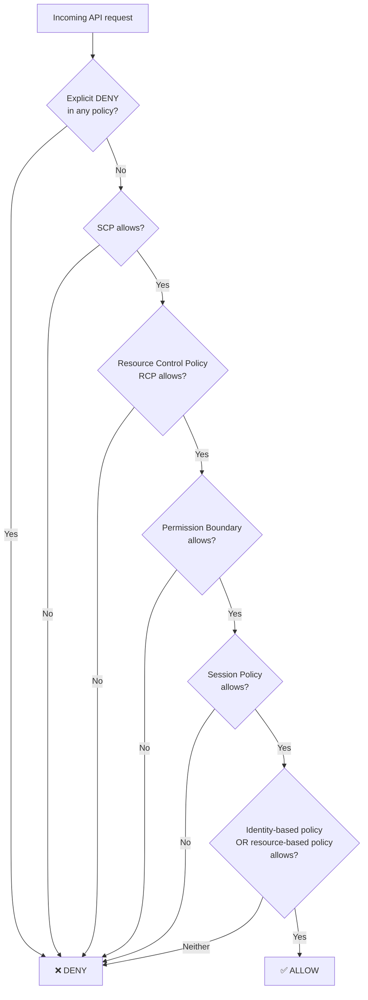
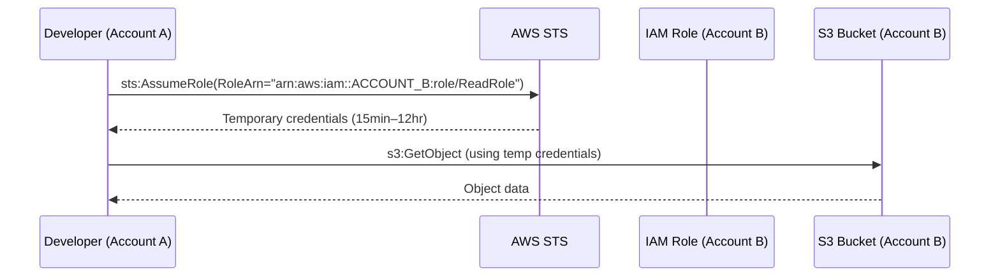
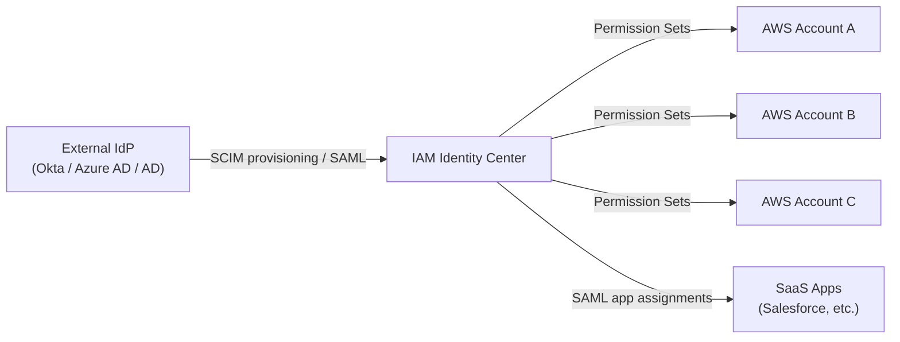
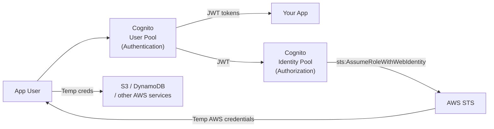
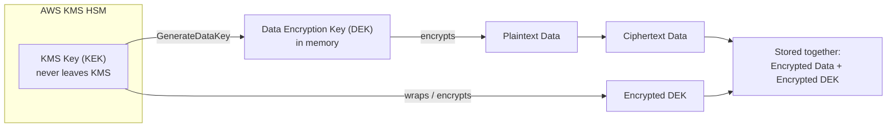
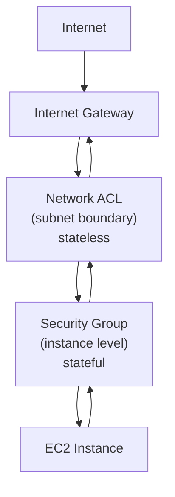
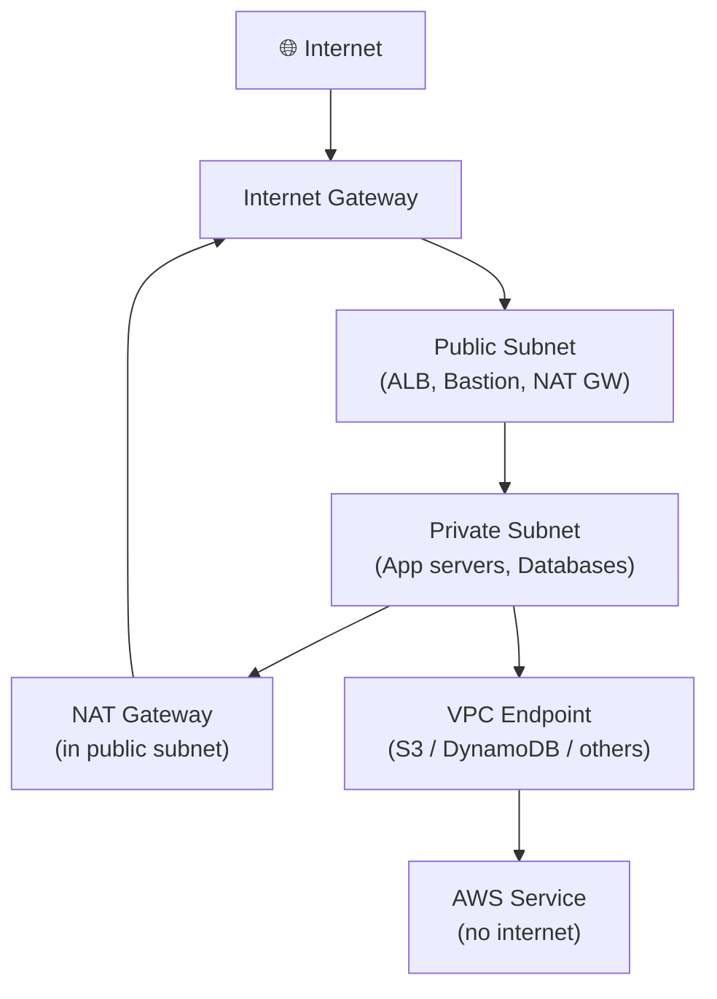

# Domain 1: Design Secure Architectures

> **30% of the SAA-C03 exam — the single largest domain. Master this and you are more than a third of the way to passing.**

Security is woven into every AWS solution. Domain 1 tests whether you can select the *right* security control for the *right* job — not just name services, but reason through how they interact, where they apply, and which one AWS prefers in each scenario-based question.

> **Plain English mental model:** Think of AWS security in four concentric rings.
> 1. **Who are you?** (IAM, Cognito, Identity Center, Organizations/SCPs)
> 2. **Is your data locked?** (KMS, CloudHSM, Secrets Manager, S3 encryption, ACM)
> 3. **Can the network reach it?** (Security Groups, NACLs, VPC endpoints, WAF, Shield, Network Firewall)
> 4. **Did anyone do something suspicious?** (GuardDuty, Inspector, Macie, Security Hub, Config, CloudTrail, Detective)
>
> Every exam question fits into one (or more) of these rings. Identify the ring first, then select the service.

---

## Table of Contents

1. [Task Statements Overview](#task-statements-overview)
2. [Identity & Access Management](#identity--access-management)
   - [IAM Core Concepts](#iam-core-concepts)
   - [IAM Policy Evaluation Logic](#iam-policy-evaluation-logic)
   - [STS & Cross-Account AssumeRole](#sts--cross-account-assumerole)
   - [IAM Identity Center (SSO)](#iam-identity-center-sso)
   - [AWS Organizations & SCPs](#aws-organizations--scps)
   - [Amazon Cognito](#amazon-cognito)
3. [Data Protection & Encryption](#data-protection--encryption)
   - [AWS KMS](#aws-kms)
   - [AWS CloudHSM](#aws-cloudhsm)
   - [Secrets Manager vs SSM Parameter Store](#secrets-manager-vs-ssm-parameter-store)
   - [AWS Certificate Manager (ACM)](#aws-certificate-manager-acm)
   - [S3 Encryption](#s3-encryption)
4. [Network Security](#network-security)
   - [Security Groups vs Network ACLs](#security-groups-vs-network-acls)
   - [VPC Design for Security](#vpc-design-for-security)
   - [VPC Endpoints & PrivateLink](#vpc-endpoints--privatelink)
   - [AWS WAF](#aws-waf)
   - [AWS Shield](#aws-shield)
   - [AWS Network Firewall](#aws-network-firewall)
5. [Detection & Governance](#detection--governance)
   - [Amazon GuardDuty](#amazon-guardduty)
   - [Amazon Inspector](#amazon-inspector)
   - [Amazon Macie](#amazon-macie)
   - [AWS Security Hub](#aws-security-hub)
   - [AWS Config](#aws-config)
   - [AWS CloudTrail](#aws-cloudtrail)
   - [Amazon Detective](#amazon-detective)
6. [S3 Security Controls](#s3-security-controls)
7. [Glossary](#glossary)
8. [References](#references)

---

## Task Statements Overview

Domain 1 is divided into three task statements per the [official SAA-C03 exam guide](https://docs.aws.amazon.com/aws-certification/latest/solutions-architect-associate-03/solutions-architect-associate-03.html):

| Task | Statement | Key Services |
|------|-----------|-------------|
| **1.1** | Design secure access to AWS resources | IAM, STS, Identity Center, Organizations, Cognito |
| **1.2** | Design secure workloads and applications | Security Groups, NACLs, VPC endpoints, WAF, Shield |
| **1.3** | Determine appropriate data security controls | KMS, CloudHSM, Secrets Manager, ACM, S3 encryption |

---

## Identity & Access Management

### IAM Core Concepts

[AWS IAM](https://docs.aws.amazon.com/IAM/latest/UserGuide/introduction.html) is the foundation of AWS security. It controls **who** (authentication) can do **what** (authorization) on **which resources**.

#### Building Blocks

| Concept | What it is | Key rule |
|---------|-----------|---------|
| **IAM User** | Permanent identity for a human or application | Has long-term access keys; avoid for production workloads — use roles instead |
| **IAM Group** | Collection of users sharing the same policy | Cannot be nested; cannot be referenced as a principal |
| **IAM Role** | Temporary identity assumed by a principal (user, service, account) | No long-term credentials; delivers short-lived tokens via STS |
| **Identity-based policy** | Attached to a user/group/role; defines what *they* can do | JSON; managed (AWS or customer) or inline |
| **Resource-based policy** | Attached to a resource (S3 bucket, KMS key, SQS queue); defines who can *use it* | Contains a `Principal` element; S3 bucket policies are the canonical example |
| **Permission boundary** | Limits the *maximum* permissions an IAM entity can have | Does not grant permissions by itself; used to delegate role/user creation safely |
| **IAM Instance Profile** | Container that passes an IAM role to an EC2 instance | One role per instance; credentials rotated automatically via instance metadata |

#### Least Privilege Principle

Always grant only the minimum permissions required. Use [AWS IAM Access Analyzer](https://docs.aws.amazon.com/IAM/latest/UserGuide/what-is-access-analyzer.html) to validate and tighten policies based on actual access patterns.

#### Access Keys vs Roles

| Approach | When to use | Risk |
|----------|------------|------|
| **Access keys** (long-term) | Local CLI dev only; break-glass scenarios | If leaked, permanent until manually rotated or deleted |
| **IAM roles** (short-term STS tokens) | EC2, Lambda, ECS, cross-account, CI/CD | Token expires automatically (15 min – 12 hrs) |

> **Best practice:** [Never embed access keys in application code or commit them to version control](https://docs.aws.amazon.com/IAM/latest/UserGuide/best-practices.html). Attach roles to compute resources instead.

#### Multi-Factor Authentication (MFA)

MFA adds a second factor (TOTP app, hardware token, or passkey) to IAM user sign-in and sensitive API calls. You can enforce MFA via an IAM policy condition:

```json
{
  "Condition": {
    "BoolIfExists": {
      "aws:MultiFactorAuthPresent": "true"
    }
  }
}
```

---

### IAM Policy Evaluation Logic

When a request arrives, AWS evaluates all applicable policies in this order ([AWS IAM policy evaluation logic](https://docs.aws.amazon.com/IAM/latest/UserGuide/reference_policies_evaluation-logic.html)):



**Key rule:** An explicit `Deny` **always wins** over any `Allow`. An action must be permitted by every applicable policy layer simultaneously.

Effective permissions = `SCP ∩ RCP ∩ PermissionBoundary ∩ SessionPolicy ∩ (IdentityPolicy ∪ ResourcePolicy)`

#### 🎯 On the exam

- **Permission boundary trap:** A boundary does not *grant* permissions — it only *caps* them. A user with `AdministratorAccess` and a boundary of `S3FullAccess` can only perform S3 actions.
- **SCP trap:** SCPs affect only *member accounts* in an AWS Organization, not the management (root) account. SCPs never *grant* permissions; they define a ceiling.
- **Resource-based policy shortcut:** If a resource-based policy allows an IAM principal in the **same account**, no identity-based policy is required (implicit allow). Cross-account still requires both.

---

### STS & Cross-Account AssumeRole

[AWS Security Token Service (STS)](https://docs.aws.amazon.com/STS/latest/APIReference/welcome.html) issues **temporary security credentials** (access key + secret key + session token) when a principal assumes a role.

#### Cross-Account Access Flow



**Setup checklist:**
1. In **Account B**: Create a role with a *trust policy* allowing Account A's principal to call `sts:AssumeRole`.
2. In **Account A**: Attach a permission policy granting `sts:AssumeRole` on the Account B role ARN.
3. Application calls `sts:AssumeRole` → receives short-lived tokens → uses them for API calls.

#### EC2 Instance Profiles

When you attach an IAM role to an EC2 instance via an **instance profile**, the EC2 service calls `sts:AssumeRole` on your behalf. Applications retrieve credentials from the [instance metadata service (IMDS)](https://docs.aws.amazon.com/AWSEC2/latest/UserGuide/ec2-instance-metadata.html) at `http://169.254.169.254/latest/meta-data/iam/security-credentials/<role-name>`. Credentials rotate automatically — no code changes required.

#### 🎯 On the exam

- **Cross-account access → IAM role + AssumeRole, NOT access keys.** Sharing long-term access keys across accounts is a security anti-pattern.
- **EC2 app needs AWS access → instance profile**, never hard-coded credentials.
- `sts:AssumeRoleWithWebIdentity` is used for web-identity federation (e.g., Cognito, OIDC providers).
- `sts:AssumeRoleWithSAML` is used for SAML 2.0 federation (e.g., Active Directory).

---

### IAM Identity Center (SSO)

[AWS IAM Identity Center](https://aws.amazon.com/iam/identity-center/) (formerly AWS SSO) is the **recommended service for workforce identity management** across multiple AWS accounts. It provides a single sign-on portal where employees can access all assigned accounts and applications.

#### How It Works



**Key concepts:**
- **Permission Sets**: Reusable IAM policy bundles defined once and applied to any account. One permission set can be assigned to many accounts and many users/groups.
- **SCIM**: Identity Center auto-provisions users and groups from external IdPs (Okta, Azure AD) so there is no manual account management.
- **Not for automation**: IAM Identity Center requires interactive browser-based login. For CI/CD pipelines or scheduled jobs, use IAM roles with OIDC federation or EC2 instance profiles instead.

| | IAM (traditional) | IAM Identity Center |
|---|---|---|
| **Scope** | Single AWS account | Multiple accounts in an Organization |
| **User provisioning** | Manual IAM user creation | Automatic via SCIM from IdP |
| **Credential type** | Long-term keys or STS via AssumeRole | Short-lived STS tokens per session |
| **Best for** | Service-to-service, programmatic access | Human workforce, SSO |

#### 🎯 On the exam

- "Centralized SSO for hundreds of AWS accounts" → IAM Identity Center, not creating IAM users in each account.
- "Employees sign in with corporate credentials" → IAM Identity Center with external IdP federation.

---

### AWS Organizations & SCPs

[AWS Organizations](https://docs.aws.amazon.com/organizations/latest/userguide/orgs_introduction.html) lets you centrally manage multiple AWS accounts. **Service Control Policies (SCPs)** are attached to the Organization root, Organizational Units (OUs), or individual accounts to define the *maximum* permissions available.

#### SCP Mechanics

- SCPs **never grant permissions**; they only restrict what member accounts can do.
- They apply to **all IAM principals in the member account**, including the root user of the member account.
- The **management (root) account is never affected** by SCPs.
- As of **September 2025**, SCPs support the full IAM policy language including `Conditions` in `Allow` statements, individual resource ARNs, and `NotAction`/`NotResource`.

**Example SCP — deny disabling CloudTrail:**
```json
{
  "Version": "2012-10-17",
  "Statement": [{
    "Sid": "DenyDisableCloudTrail",
    "Effect": "Deny",
    "Action": ["cloudtrail:DeleteTrail", "cloudtrail:StopLogging"],
    "Resource": "*"
  }]
}
```

#### Permission Boundary vs SCP

| | SCP | Permission Boundary |
|---|---|---|
| **Applied to** | AWS account (org-level) | Individual IAM user or role |
| **Controls** | What the entire account can do | What a specific entity can do |
| **Set by** | Organization admin (central) | Local admin delegating role creation |
| **Grants permissions?** | No | No |

#### 🎯 On the exam

- "Prevent member accounts from leaving the Organization" → SCP with `Deny organizations:LeaveOrganization`.
- "Ensure no account can create public S3 buckets" → SCP (applies to all IAM entities including root).
- "Delegate safe role/user creation to a team" → permission boundary (cap their creations to specific services).

---

### Amazon Cognito

[Amazon Cognito](https://docs.aws.amazon.com/cognito/latest/developerguide/what-is-amazon-cognito.html) provides authentication, authorization, and user management for web and mobile applications — **not** for AWS employee workforce access (that's IAM Identity Center).

#### User Pools vs Identity Pools



| | User Pool | Identity Pool |
|---|---|---|
| **Purpose** | Authentication (who are you?) | Authorization (what AWS can you use?) |
| **Output** | JWT tokens (ID, access, refresh) | Temporary AWS credentials (STS) |
| **Analogy** | Login page + user directory | IAM role vending machine |
| **Supports unauthenticated?** | No | Yes (guest access) |
| **Use case** | App sign-up/sign-in, MFA, social login | Access S3 from mobile app, IoT device auth |

**They are often used together:** User Pool authenticates the user → Identity Pool exchanges the JWT for temporary AWS credentials.

#### 🎯 On the exam

- "Mobile app users need to read from S3 directly" → Cognito Identity Pool (grants temp AWS credentials).
- "Add user sign-up and sign-in to your web app" → Cognito User Pool.
- "Social login with Google/Facebook" → User Pool with external IdP federation.

---

## Data Protection & Encryption

### AWS KMS

[AWS Key Management Service (KMS)](https://docs.aws.amazon.com/kms/latest/developerguide/concepts.html) is the central key management service. It stores and manages **KMS keys** (formerly Customer Master Keys / CMKs) inside FIPS 140-3 Level 3 validated HSMs (since February 2025).

#### Key Types

| Key type | Who creates it | Who controls it | Cost | Auto-rotation |
|----------|---------------|-----------------|------|--------------|
| **AWS managed key** | AWS | AWS (on your behalf) | Free | Every year (automatic) |
| **Customer managed key (CMK)** | You | You (via key policy) | $1/month + API fees | Optional, annual by default; configurable |
| **AWS owned key** | AWS | AWS (shared across customers) | Free | AWS-managed |

#### Envelope Encryption

KMS uses envelope encryption to protect data at scale ([AWS envelope encryption docs](https://docs.aws.amazon.com/encryption-sdk/latest/developer-guide/concepts.html#envelope-encryption)):



**Decryption:** App sends encrypted DEK to KMS → KMS returns plaintext DEK (after checking key policy + IAM) → App decrypts data locally → plaintext DEK wiped from memory.

**Why?** The KMS key (root key) never leaves the HSM. Only the small DEK travels, and it is always encrypted with the root key.

#### Key Policies

Every KMS key has a **key policy** (resource-based policy). Unlike IAM policies, IAM permissions alone do *not* grant access to KMS keys — the key policy must also explicitly allow the principal. [AWS KMS key policies](https://docs.aws.amazon.com/kms/latest/developerguide/key-policies.html).

#### Key Rotation

- **AWS managed keys**: Rotate automatically every year.
- **Customer managed keys**: Optional; when enabled, rotate annually (default) or on-demand.
- **Key rotation does NOT re-encrypt existing data.** KMS keeps old key material to decrypt data encrypted with it. New encryptions use the new material.
- **2025 feature**: On-demand rotation for symmetric CMKs with imported key material (BYOK) — no key ID change, zero downtime.

#### 🎯 On the exam

- "Audit all KMS key usage" → CloudTrail (KMS API calls are logged).
- "Customer needs sole control of their key" → Customer managed key, not AWS managed.
- "Regulatory requirement: no AWS access to key material" → CloudHSM (see next section).
- "Encrypt 5 TB S3 object" → SSE-KMS (envelope encryption; KMS key wraps the DEK that encrypts the object).

---

### AWS CloudHSM

[AWS CloudHSM](https://aws.amazon.com/cloudhsm/) provides **dedicated, single-tenant HSM hardware** in your VPC. You own and control the key material — AWS cannot access it.

| | KMS | CloudHSM |
|---|---|---|
| **Tenancy** | Shared (multi-tenant HSM) | Dedicated single-tenant hardware |
| **AWS access to keys** | AWS manages HSM, but key access is policy-controlled | AWS has **zero** access to keys |
| **FIPS level** | 140-3 Level 3 (since Feb 2025) | 140-3 Level 3 |
| **APIs** | AWS KMS API | PKCS#11, JCE, OpenSSL (industry standard) |
| **Integration** | Native with nearly all AWS services | Manual; used for custom crypto, Oracle TDE, SSL offload |
| **Cost** | $1/month/key + API fees | ~$1.60/hour per HSM cluster node |

**Use CloudHSM when:** BYOK with true single-tenancy, Oracle DB Transparent Data Encryption (TDE), custom PKCS#11 operations, or compliance mandating dedicated hardware.

#### 🎯 On the exam

- "Bring your own HSM / dedicated hardware" → CloudHSM.
- "Integrate with S3 encryption seamlessly" → KMS (CloudHSM has no direct S3 integration).
- "Strict regulation requiring dedicated key management hardware" → CloudHSM.

---

### Secrets Manager vs SSM Parameter Store

Both store sensitive configuration, but they serve different use cases:

| Feature | Secrets Manager | SSM Parameter Store |
|---------|----------------|---------------------|
| **Primary purpose** | Secrets requiring automatic rotation | Configuration values, some secrets |
| **Automatic rotation** | **Yes** — native Lambda-based rotation for RDS, Redshift, DocumentDB, custom | No native rotation; requires custom Lambda |
| **Cost** | $0.40/secret/month + $0.05/10k API calls | Free (Standard tier, up to 10k params); $0.05/param/month (Advanced tier) |
| **Max size** | 65 KB | 4 KB (Standard), 8 KB (Advanced) |
| **Cross-account access** | Yes (resource-based policy) | No native cross-account |
| **Multi-region replication** | Yes (2025: enhanced cross-region) | No |
| **Versioning** | Yes | Yes |
| **KMS encryption** | Always encrypted (KMS) | Optional (SecureString uses KMS) |

**Decision rule:** Need auto-rotation (especially DB passwords) → **Secrets Manager**. Non-rotating config, environment variables, cost-sensitive at scale → **Parameter Store**.

#### 🎯 On the exam

- "Auto-rotate RDS database password every 30 days" → Secrets Manager, not Parameter Store.
- "Store 50,000 application config values cheaply" → SSM Parameter Store Standard (free for ≤10k, then Advanced at $0.05/param).
- "Lambda function needs the DB password at runtime securely" → either works, but Secrets Manager is preferred for credentials.

---

### AWS Certificate Manager (ACM)

[AWS Certificate Manager](https://docs.aws.amazon.com/acm/latest/userguide/acm-overview.html) provisions, manages, and auto-renews **TLS/SSL certificates** for use with AWS services.

- **Public certificates**: Free; issued by Amazon's CA; auto-renewed.
- **Private certificates**: ACM Private CA (paid); issue certs for internal resources.
- **Where used**: ALB, NLB, CloudFront, API Gateway, Elastic Beanstalk. **Cannot** be used directly on EC2 — export private key option available only for private CA certs.
- **Encryption in transit**: ACM handles TLS termination at the load balancer. End-to-end TLS between ALB and EC2 requires a self-signed or ACM Private CA cert on the EC2 instance.

#### 🎯 On the exam

- "Free TLS certificate on ALB" → ACM public certificate.
- "TLS certificate on EC2 directly" → ACM cannot export public cert private keys; use self-signed or private CA cert.
- "Corporate PKI internal certificates" → ACM Private CA.

---

### S3 Encryption

Since **January 5, 2023**, Amazon S3 **automatically encrypts all new objects** with SSE-S3 by default ([AWS S3 encryption docs](https://docs.aws.amazon.com/AmazonS3/latest/userguide/UsingServerSideEncryption.html)).

#### Server-Side Encryption (SSE) Options

| Mode | Key management | KMS calls? | Cost | Use case |
|------|---------------|-----------|------|---------|
| **SSE-S3** | AWS manages keys fully | No | Free | Default; no audit trail needed |
| **SSE-KMS** | KMS key (AWS managed or CMK) | Yes (GenerateDataKey + Decrypt) | KMS API fees | Audit trail, key policy control |
| **DSSE-KMS** | Two independent KMS encryption layers | Yes (2× per operation) | KMS API fees × 2 | CNSA 2.0 / NSA dual-layer compliance (launched Jun 2023) |
| **SSE-C** | You provide the key with every request | No | Free | You manage keys outside AWS; **disabled by default for new buckets as of April 2026** |

**Client-side encryption (CSE)**: Encrypt before upload. AWS never sees plaintext. Keys stay with the client.

#### 2025 / 2026 Updates

- **November 2025**: New `BlockedEncryptionTypes` setting via `PutBucketEncryption` API to enforce which encryption types are allowed on a bucket.
- **April 2026**: SSE-C disabled by default for new general-purpose buckets. Must be explicitly enabled via `BlockedEncryptionTypes: NONE`.

#### 🎯 On the exam

- "Audit who used which key to decrypt an S3 object" → SSE-KMS (KMS logs every API call in CloudTrail).
- "Regulatory requirement for dual-layer encryption" → DSSE-KMS.
- "No KMS costs for S3 encryption" → SSE-S3 (free).
- "Customer provides their own key material and AWS never stores it" → SSE-C.

---

## Network Security

### Security Groups vs Network ACLs

These are the two main VPC-level firewall controls. Understanding the **stateful vs stateless** distinction is critical.



| Characteristic | Security Group | Network ACL |
|---------------|---------------|------------|
| **State** | **Stateful** — return traffic automatically allowed | **Stateless** — must explicitly allow both inbound AND outbound |
| **Rule types** | Allow rules only | Allow AND Deny rules |
| **Applied at** | Instance / ENI level | Subnet level |
| **Evaluation** | All rules evaluated before decision | Rules evaluated in **numbered order** (lowest first); first match wins |
| **Default (new VPC)** | No inbound allowed; all outbound allowed | Allow all inbound and outbound |
| **Default (default VPC)** | Allow all inbound from same SG; all outbound | Allow all |
| **Works across** | All instances in the group | All instances in the subnet |

**Stateful detail:** If a Security Group allows inbound TCP 443, the response packets back to the client are automatically permitted regardless of outbound rules. NACLs must have explicit outbound rules for ephemeral ports (1024–65535) to allow return traffic.

#### 🎯 On the exam

- **Stateful allow-only → Security Group; stateless allow+deny → NACL.**
- "Block a specific IP address" → NACL (Security Groups cannot explicitly deny).
- "Instance-level firewall" → Security Group. "Subnet-level firewall" → NACL.
- "NACL rule 100 ALLOW and rule 200 DENY on same traffic" → Rule 100 wins (lowest number first).

---

### VPC Design for Security

A well-architected VPC separates resources into public and private subnets:



**Key design decisions:**
- **Public subnet**: Has a route to the Internet Gateway. Resources with public IPs are reachable from the internet.
- **Private subnet**: No direct internet route. Uses a **NAT Gateway** (in the public subnet) for outbound-only internet access (e.g., downloading patches).
- **NAT Gateway vs NAT Instance**: NAT Gateway is managed, highly available (per AZ), and scales automatically. NAT Instance (EC2) requires manual management but allows security group customization. **Exam almost always prefers NAT Gateway.**

---

### VPC Endpoints & PrivateLink

[VPC Endpoints](https://docs.aws.amazon.com/vpc/latest/privatelink/what-is-privatelink.html) allow resources in a private subnet to communicate with AWS services **without traversing the internet**.

#### Gateway Endpoints vs Interface Endpoints

| | Gateway Endpoint | Interface Endpoint (PrivateLink) |
|---|---|---|
| **Supported services** | S3 and DynamoDB only | 100+ AWS services (KMS, SSM, SNS, SQS, CloudWatch, API GW…) |
| **Implementation** | Route table entry | Elastic Network Interface (ENI) in subnet |
| **DNS** | Uses existing S3/DynamoDB endpoints | Private DNS resolves service hostname to ENI IP |
| **Cost** | **Free** | Charged per AZ per hour + data processing |
| **Security** | Endpoint policy (like a resource-based policy) | Security groups + endpoint policy |
| **PrivateLink?** | No | Yes |

**When to use:**
- Private subnet → S3 or DynamoDB without NAT cost → **Gateway endpoint**.
- Private subnet → KMS, SSM, CloudWatch, or any other service → **Interface endpoint**.

#### 🎯 On the exam

- "Keep S3 traffic off the internet / avoid NAT Gateway data charges for S3" → S3 Gateway endpoint.
- "Private connectivity to a SaaS vendor's service" → PrivateLink / Interface endpoint.
- "VPC endpoint policy to restrict S3 access to specific buckets" → Gateway endpoint policy.

---

### AWS WAF

[AWS WAF](https://docs.aws.amazon.com/waf/latest/developerguide/what-is-aws-waf.html) is a **Layer 7 (application layer) web application firewall** that filters HTTP/HTTPS requests based on rules.

- **Deployable on**: CloudFront, ALB, API Gateway, AWS AppSync, Cognito User Pool.
- **Rule types**: AWS managed rule groups (OWASP Top 10, SQL injection, XSS, Bot Control), custom rules (IP sets, geo-matching, rate limiting, string matching, regex).
- **Web ACL**: The container for rules; attached to a resource.
- **Shield Advanced**: Includes WAF AntiDDoS Application Managed Rules (AMR) at no extra WCU cost for protected resources (as of June 2025).

#### 🎯 On the exam

- "Block SQL injection and XSS" → AWS WAF.
- "Block traffic from specific countries" → WAF (geo-match rules).
- "Rate-limit an API to 1000 req/5min per IP" → WAF rate-based rules.
- WAF works at Layer 7; Shield works at Layers 3/4 (and Layer 7 with Advanced).

---

### AWS Shield

[AWS Shield](https://docs.aws.amazon.com/waf/latest/developerguide/ddos-overview.html) protects against **Distributed Denial of Service (DDoS)** attacks.

| | Shield Standard | Shield Advanced |
|---|---|---|
| **Cost** | Free (automatic for all AWS customers) | $3,000/month + data transfer fees; 1-year commitment |
| **Protection level** | L3/L4 DDoS (SYN floods, UDP reflection) | L3/L4 + L7 DDoS; more sophisticated attacks |
| **WAF integration** | No | Yes — WAF included; AntiDDoS AMR free for protected resources |
| **DDoS Response Team (DRT)** | No | Yes — 24/7 AWS experts |
| **Cost protection** | No | Yes — credits for scaling costs during attacks |
| **Attack visibility** | Basic metrics | Detailed attack diagnostics, CloudWatch dashboards |
| **Protected resources** | EC2, ELB, CloudFront, Route 53 (automatic) | ALB, CLB, EIP, CloudFront, Route 53, Global Accelerator (explicit) |

#### 🎯 On the exam

- "Protect against DDoS at no extra cost" → Shield Standard (always on, free).
- "Need 24/7 DRT support and cost protection during DDoS" → Shield Advanced.
- "Protect against Layer 7 application DDoS" → Shield Advanced + WAF.

---

### AWS Network Firewall

[AWS Network Firewall](https://docs.aws.amazon.com/network-firewall/latest/developerguide/what-is-aws-network-firewall.html) is a managed, **stateful/stateless network firewall and intrusion prevention system (IPS)** for VPCs.

- Deployed in a dedicated firewall subnet; traffic is routed through it.
- Supports **Suricata-compatible IPS rules** for deep packet inspection (DPI).
- Use for: centralized egress filtering, URL/domain filtering, protocol detection, blocking known malicious IPs.
- **Differs from Security Groups/NACLs**: More advanced (domain allow-lists, TLS inspection, Suricata rules); deployed centrally for an entire VPC vs per-instance.

| Service | Layer | Scope | Use case |
|---------|-------|-------|---------|
| Security Group | L4 (stateful) | Instance ENI | Allow/deny ports for specific instances |
| NACL | L3/L4 (stateless) | Subnet | Subnet-level IP/port filtering with deny |
| WAF | L7 (HTTP) | CloudFront / ALB / API GW | Web app protection (SQLi, XSS, bots) |
| Network Firewall | L3–L7 (IPS) | VPC / subnet | Deep packet inspection, domain filtering |
| Shield | L3/L4/L7 | Account-wide | DDoS protection |

#### 🎯 On the exam

- "Inspect and block outbound traffic to malicious domains from a VPC" → Network Firewall.
- "Centralized IPS/IDS for all VPC traffic" → Network Firewall.
- "Block Layer 7 HTTP attacks on a web application" → WAF (not Network Firewall).

---

## Detection & Governance

### Amazon GuardDuty

[Amazon GuardDuty](https://docs.aws.amazon.com/guardduty/latest/ug/what-is-guardduty.html) is a **threat detection service** that continuously analyzes logs and runtime behavior to identify malicious activity.

**Data sources analyzed:**
- VPC Flow Logs, DNS query logs, CloudTrail management events
- S3 data events, EKS audit logs, ECS/EKS runtime
- EC2 runtime (malware detection, behavioral anomalies)
- Lambda network activity

**2025 / re:Invent 2024–2025 updates:**
- **Extended Threat Detection**: ML correlates multiple events (from different sources) into a single attack sequence finding — lateral movement, privilege escalation, data exfiltration.
- **EC2 and ECS Extended Threat Detection** added at re:Invent 2025.

- Enable it in minutes — **no agents, no log shipping**, no infrastructure changes.
- Multi-account: delegate to a GuardDuty administrator account via Organizations.

#### 🎯 On the exam

- **"Detect threats from logs and network traffic" → GuardDuty** (not Inspector, not Macie).
- "Suspicious API calls, port scans, crypto-mining EC2" → GuardDuty.
- GuardDuty finds are sent to Security Hub and EventBridge for automated remediation.

---

### Amazon Inspector

[Amazon Inspector](https://docs.aws.amazon.com/inspector/latest/user/what-is-inspector.html) is a **vulnerability assessment service** that scans workloads for known CVEs and software vulnerabilities.

**What it scans:**
- EC2 instances (OS packages, application packages)
- Amazon ECR container images (on push or continuously)
- Lambda functions (function code and layers)
- **2025**: SAST (source code), SCA (dependency analysis), and IaC scanning (Terraform, CloudFormation)

- Uses the **Common Vulnerabilities and Exposures (CVE)** database.
- **No manual scheduling** — findings are updated automatically as new CVEs are published.
- Risk scores combine CVE severity + network reachability.

#### 🎯 On the exam

- **"Scan EC2 / ECR / Lambda for CVEs and vulnerabilities" → Inspector.**
- "Find and prioritize OS patch requirements" → Inspector.
- Do not confuse with GuardDuty (runtime threats) or Macie (data classification).

---

### Amazon Macie

[Amazon Macie](https://docs.aws.amazon.com/macie/latest/user/what-is-macie.html) uses **machine learning to discover, classify, and protect sensitive data in S3**.

- Detects PII (names, SSNs, credit card numbers, health information), financial data, credentials.
- Identifies **S3 buckets with overly permissive access** (public, cross-account shared).
- Generates findings in Security Hub.
- Sampling mode for large buckets; full scan for compliance.

#### 🎯 On the exam

- **"Find PII / sensitive data in S3" → Macie.**
- "S3 data classification at scale" → Macie.
- "Detect exposed S3 buckets containing PHI" → Macie.

---

### AWS Security Hub

[AWS Security Hub](https://docs.aws.amazon.com/securityhub/latest/userguide/what-is-securityhub.html) is a **centralized security posture management (CSPM) and finding aggregation service**.

- Aggregates findings from GuardDuty, Inspector, Macie, Firewall Manager, IAM Access Analyzer, Config, and third-party tools.
- Runs automated **compliance checks** against standards: CIS AWS Foundations Benchmark, AWS Foundational Security Best Practices, PCI DSS, NIST 800-53.
- **2025 update**: 1-year trend data and period-over-period analysis makes it a full CSPM tool, not just a finding aggregator.
- Multi-account: designate an administrator account.

#### 🎯 On the exam

- "Single pane of glass for security findings across accounts" → Security Hub.
- "Check compliance against CIS AWS benchmarks" → Security Hub.
- Security Hub does not detect threats itself; it aggregates from services that do.

---

### AWS Config

[AWS Config](https://docs.aws.amazon.com/config/latest/developerguide/WhatIsConfig.html) continuously **records configuration state** of AWS resources and evaluates them against desired configurations (rules).

- **Configuration history**: "What did this resource look like at 2pm yesterday?" → Config.
- **Compliance rules**: Check if S3 buckets have encryption, security groups are not open to 0.0.0.0/0, CloudTrail is enabled.
- **Remediation**: Integrate with Systems Manager Automation to auto-remediate non-compliant resources.
- **Config Aggregator**: Multi-account, multi-region view.

> "CloudWatch tells me **what's happening**, CloudTrail tells me **who did what**, Config tells me **what changed** — and whether it breaks the rules."

#### 🎯 On the exam

- "Was this S3 bucket encrypted yesterday?" → AWS Config (configuration history).
- "Continuous compliance checking for all EC2 security group rules" → AWS Config with managed rules.
- Config ≠ CloudTrail: Config tracks *resource state*; CloudTrail tracks *API calls*.

---

### AWS CloudTrail

[AWS CloudTrail](https://docs.aws.amazon.com/awscloudtrail/latest/userguide/cloudtrail-user-guide.html) records **every API call** made in your AWS account — who called it, from where, when, and with what parameters.

**Event types:**
- **Management events** (control plane): CreateBucket, RunInstances, DeleteRole — on by default.
- **Data events** (data plane): S3 GetObject/PutObject, Lambda Invoke — **off by default**; must be explicitly enabled.
- **Insights events**: Unusual activity patterns (sudden spike in API calls).

- By default, trails store events in **CloudWatch Logs** and **S3**.
- **Log file integrity validation**: SHA-256 digest files ensure logs haven't been tampered with.
- **Organization trail**: Single trail covering all member accounts — crucial for centralized audit.

#### 🎯 On the exam

- "Who deleted the S3 bucket?" → CloudTrail.
- "Audit KMS decrypt API calls" → CloudTrail (management events).
- "Track which IAM principal made API calls to production" → CloudTrail.
- CloudTrail ≠ CloudWatch Logs: CloudTrail is the source of API audit logs; CloudWatch Logs can be a destination.

---

### Amazon Detective

[Amazon Detective](https://docs.aws.amazon.com/detective/latest/adminguide/what-is-detective.html) analyzes and **visualizes security findings** to help you understand root cause during incident investigation.

- Automatically ingests VPC Flow Logs, CloudTrail events, and GuardDuty findings.
- Uses ML and graph-based analysis to show relationships: which IP contacted which instance, which role was used to make which API calls.
- **Used after** GuardDuty surfaces a finding to *investigate* it, not to detect in real time.

| Service | Question answered | Timing |
|---------|-----------------|--------|
| GuardDuty | "Is something malicious happening?" | Real-time detection |
| Inspector | "What vulnerabilities exist?" | Continuous scanning |
| Macie | "Is sensitive data exposed?" | Continuous scanning |
| Security Hub | "What's my overall security posture?" | Aggregation / compliance |
| Detective | "What exactly happened and how?" | Post-incident investigation |
| CloudTrail | "Who called which API?" | Audit log |
| Config | "What was the resource state?" | Configuration history |

#### 🎯 On the exam

- "Root cause analysis of a GuardDuty finding" → Amazon Detective.
- "Visualize attack path after a security incident" → Amazon Detective.

---

## S3 Security Controls

S3 objects can be secured through multiple overlapping mechanisms. The tightest security comes from layering them.

### Bucket Policies

Resource-based IAM policies attached to a bucket. Can allow/deny access based on:
- Principal (IAM user, role, account, service)
- Conditions (IP address, VPC endpoint, MFA, time, SSL-only)
- `aws:SecureTransport: "true"` to enforce HTTPS

```json
{
  "Statement": [{
    "Effect": "Deny",
    "Principal": "*",
    "Action": "s3:*",
    "Resource": ["arn:aws:s3:::my-bucket", "arn:aws:s3:::my-bucket/*"],
    "Condition": { "Bool": { "aws:SecureTransport": "false" } }
  }]
}
```

### S3 Block Public Access

[S3 Block Public Access](https://docs.aws.amazon.com/AmazonS3/latest/userguide/access-control-block-public-access.html) has four independent settings (can be applied at account, bucket, or access point level):

| Setting | What it does |
|---------|-------------|
| `BlockPublicAcls` | Prevents new ACLs that grant public access |
| `IgnorePublicAcls` | Ignores existing public ACLs |
| `BlockPublicPolicy` | Blocks new bucket policies granting public access |
| `RestrictPublicBuckets` | Restricts bucket to only AWS services and authorized users |

**Recommendation**: Enable all four at the account level by default; selectively disable per bucket only when needed (e.g., static website hosting via CloudFront).

### ACLs (Legacy)

S3 ACLs (Access Control Lists) are a legacy mechanism. AWS recommends disabling ACLs and using **bucket policies and IAM** instead. New S3 buckets have **Object Ownership** set to `BucketOwnerEnforced` by default, which disables ACLs.

### Presigned URLs

A presigned URL grants time-limited access to a private S3 object without requiring the requester to have AWS credentials:

- Generated by a principal with S3 read access.
- Embedded with the signer's credentials and an expiry time.
- Anyone with the URL can access the object until expiry.
- Use case: Temporary download/upload links for end users; file sharing.
- **Block Public Access does NOT block presigned URLs** — they are considered authorized requests.

### S3 Access Points

[S3 Access Points](https://docs.aws.amazon.com/AmazonS3/latest/userguide/access-points.html) are named network endpoints with their own access policies, simplifying access management for shared datasets:

- Each access point has its own hostname, policy, and (optionally) VPC restriction.
- Limit: thousands of access points per bucket.
- Simpler than managing a monolithic bucket policy for many applications/teams.
- **VPC-restricted access point**: Only accessible from within a specified VPC (data never traverses the internet).

#### 🎯 On the exam

- "Restrict S3 access to traffic from a specific VPC only" → VPC-restricted S3 Access Point or S3 bucket policy with `aws:SourceVpc` condition.
- "Allow temporary public download without making bucket public" → Presigned URL.
- "Multiple teams share one bucket with isolated access policies" → S3 Access Points.
- "All S3 buckets must be private by default" → Enable S3 Block Public Access at the account level.

---

## Glossary

| Term | Simple explanation | Purpose |
|------|--------------------|---------|
| **IAM User** | Permanent named identity in AWS | Long-term credentials for humans / legacy apps |
| **IAM Group** | Named set of users sharing policies | Simplify policy management |
| **IAM Role** | Temporary identity assumed by any principal | Avoid long-term credentials; cross-account/service access |
| **Instance Profile** | Container linking an IAM role to an EC2 instance | Let EC2 assume a role automatically |
| **Identity-based policy** | IAM policy attached to a user/group/role | Define what the identity can do |
| **Resource-based policy** | Policy attached to a resource (S3, KMS…) | Define who can access the resource |
| **Permission boundary** | Max permissions cap on an IAM entity | Safe delegation of role/user creation |
| **SCP (Service Control Policy)** | Max permissions cap on an AWS account in an Org | Preventive guardrails across accounts |
| **RCP (Resource Control Policy)** | Max permissions on resources across an Org | Prevent sharing outside org |
| **AWS STS** | Security Token Service; issues temporary creds | AssumeRole, federation, short-lived access |
| **IAM Identity Center** | Multi-account SSO and workforce identity hub | Single sign-on across all accounts |
| **Amazon Cognito** | App-facing user auth and AWS credential vending | Web/mobile app authentication & authorization |
| **User Pool** | Cognito user directory + JWT issuer | App sign-up/sign-in |
| **Identity Pool** | Cognito AWS credentials vending machine | Exchange JWT for temp AWS credentials |
| **AWS KMS** | Managed key management + envelope encryption | Encrypt data at rest across AWS services |
| **CMK / KMS Key** | Cryptographic key stored in KMS | Root key for envelope encryption |
| **Envelope Encryption** | Encrypt a data key with a root key | Efficient large-data encryption without sending data to KMS |
| **Data Encryption Key (DEK)** | Per-object symmetric key | Encrypt the actual data |
| **AWS CloudHSM** | Dedicated single-tenant HSM hardware in your VPC | Strict compliance, BYOK, custom crypto |
| **Secrets Manager** | Managed secrets store with auto-rotation | DB passwords, API keys with rotation |
| **SSM Parameter Store** | Configuration and secrets store | App config, non-rotating secrets, cheaper at scale |
| **ACM** | AWS Certificate Manager; managed TLS certs | Free public TLS certs for AWS services |
| **SSE-S3** | S3-managed server-side encryption | Default encryption; free |
| **SSE-KMS** | KMS-managed server-side encryption for S3 | Audit trail, key policy control |
| **DSSE-KMS** | Dual-layer KMS encryption for S3 | CNSA 2.0 / NSA compliance |
| **SSE-C** | Customer-provided key for S3 encryption | You manage keys outside AWS |
| **Security Group** | Stateful instance-level firewall | Allow inbound/outbound traffic for instances |
| **Network ACL (NACL)** | Stateless subnet-level firewall | Allow and deny traffic at subnet boundary |
| **NAT Gateway** | Managed NAT for private subnet outbound internet | Let private instances reach internet without being reachable |
| **VPC Endpoint** | Private connection from VPC to AWS services | Keep traffic off the internet |
| **Gateway Endpoint** | VPC endpoint type for S3 and DynamoDB | Free; route-table-based |
| **Interface Endpoint** | PrivateLink-based VPC endpoint (ENI) | Private access to 100+ AWS services |
| **AWS WAF** | Layer 7 web application firewall | Block SQLi, XSS, bots, geo-restrict |
| **Shield Standard** | Free DDoS protection (L3/L4) for all accounts | Automatic baseline DDoS defense |
| **Shield Advanced** | Paid DDoS protection (L3/L4/L7) + DRT | Enterprise DDoS defense + cost protection |
| **AWS Network Firewall** | Managed stateful/stateless IPS for VPCs | Deep packet inspection, domain filtering |
| **GuardDuty** | ML-based threat detection from logs/runtime | Detect malicious activity in real time |
| **Inspector** | CVE vulnerability scanner for EC2/ECR/Lambda | Find software vulnerabilities |
| **Macie** | ML-based PII/sensitive data discovery in S3 | Data classification and exposure detection |
| **Security Hub** | Central security posture management | Aggregate findings, check compliance benchmarks |
| **AWS Config** | Resource configuration recorder and compliance checker | Track config changes, enforce rules |
| **CloudTrail** | API call audit log for every AWS action | Who did what, when, from where |
| **Amazon Detective** | Graph-based security incident investigation | Root cause analysis after GuardDuty finding |
| **S3 Block Public Access** | Account/bucket-level override blocking public access | Prevent accidental public bucket exposure |
| **Presigned URL** | Time-limited signed URL to a private S3 object | Temporary access without AWS credentials |
| **S3 Access Point** | Named S3 endpoint with its own policy/VPC scope | Simplified per-team/per-app S3 access management |
| **MFA** | Multi-factor authentication | Second factor for IAM user login and sensitive APIs |
| **FIPS 140-3** | US government hardware security module standard | Regulatory compliance for cryptographic modules |

---

## References

- [SAA-C03 Exam Guide (Official PDF)](https://docs.aws.amazon.com/pdfs/aws-certification/latest/solutions-architect-associate-03/solutions-architect-associate-03.pdf)
- [Domain 1 Official Content](https://docs.aws.amazon.com/aws-certification/latest/solutions-architect-associate-03/solutions-architect-associate-03-domain1.html)
- [AWS IAM User Guide](https://docs.aws.amazon.com/IAM/latest/UserGuide/introduction.html)
- [IAM Policy Evaluation Logic](https://docs.aws.amazon.com/IAM/latest/UserGuide/reference_policies_evaluation-logic.html)
- [IAM Permissions Boundaries](https://docs.aws.amazon.com/IAM/latest/UserGuide/access_policies_boundaries.html)
- [AWS IAM Identity Center](https://aws.amazon.com/iam/identity-center/)
- [AWS Organizations SCPs](https://docs.aws.amazon.com/organizations/latest/userguide/orgs_manage_policies_scps.html)
- [Amazon Cognito User Pools](https://docs.aws.amazon.com/cognito/latest/developerguide/cognito-user-pools.html)
- [AWS KMS Key Concepts](https://docs.aws.amazon.com/kms/latest/developerguide/concepts.html)
- [AWS KMS Key Rotation](https://docs.aws.amazon.com/kms/latest/developerguide/rotate-keys.html)
- [AWS KMS FAQs](https://aws.amazon.com/kms/faqs/)
- [AWS CloudHSM FAQs](https://aws.amazon.com/cloudhsm/faqs/)
- [Choosing an AWS Cryptography Service](https://docs.aws.amazon.com/decision-guides/latest/cryptography-on-aws-how-to-choose/guide.html)
- [AWS Secrets Manager vs Parameter Store (Caylent)](https://caylent.com/blog/parameter-store-vs-secrets-manager)
- [AWS Certificate Manager Overview](https://docs.aws.amazon.com/acm/latest/userguide/acm-overview.html)
- [S3 Server-Side Encryption (SSE-S3)](https://docs.aws.amazon.com/AmazonS3/latest/userguide/UsingServerSideEncryption.html)
- [S3 SSE-KMS](https://docs.aws.amazon.com/AmazonS3/latest/userguide/specifying-kms-encryption.html)
- [S3 SSE-C](https://docs.aws.amazon.com/AmazonS3/latest/userguide/ServerSideEncryptionCustomerKeys.html)
- [S3 Block Public Access](https://docs.aws.amazon.com/AmazonS3/latest/userguide/access-control-block-public-access.html)
- [S3 Access Points](https://docs.aws.amazon.com/AmazonS3/latest/userguide/access-points.html)
- [VPC Security Groups (EC2)](https://docs.aws.amazon.com/vpc/latest/userguide/vpc-security-groups.html)
- [VPC Network ACLs](https://docs.aws.amazon.com/vpc/latest/userguide/vpc-network-acls.html)
- [AWS PrivateLink & VPC Endpoints](https://docs.aws.amazon.com/vpc/latest/privatelink/what-is-privatelink.html)
- [S3 Gateway Endpoints](https://docs.aws.amazon.com/vpc/latest/privatelink/vpc-endpoints-s3.html)
- [AWS WAF What Is It](https://docs.aws.amazon.com/waf/latest/developerguide/what-is-aws-waf.html)
- [AWS Shield DDoS Overview](https://docs.aws.amazon.com/waf/latest/developerguide/ddos-overview.html)
- [AWS Network Firewall](https://docs.aws.amazon.com/network-firewall/latest/developerguide/what-is-aws-network-firewall.html)
- [Amazon GuardDuty](https://docs.aws.amazon.com/guardduty/latest/ug/what-is-guardduty.html)
- [Amazon Inspector](https://docs.aws.amazon.com/inspector/latest/user/what-is-inspector.html)
- [Amazon Macie](https://docs.aws.amazon.com/macie/latest/user/what-is-macie.html)
- [AWS Security Hub](https://docs.aws.amazon.com/securityhub/latest/userguide/what-is-securityhub.html)
- [AWS Config](https://docs.aws.amazon.com/config/latest/developerguide/WhatIsConfig.html)
- [AWS CloudTrail](https://docs.aws.amazon.com/awscloudtrail/latest/userguide/cloudtrail-user-guide.html)
- [Amazon Detective](https://docs.aws.amazon.com/detective/latest/adminguide/what-is-detective.html)
- [IAM Roles for EC2 (Instance Profiles)](https://docs.aws.amazon.com/IAM/latest/UserGuide/id_roles_use_switch-role-ec2.html)
- [FIPS 140-3 on AWS](https://aws.amazon.com/compliance/fips/)
- [KMS On-Demand Rotation for Imported Keys (June 2025)](https://aws.amazon.com/about-aws/whats-new/2025/06/aws-kms-on-demand-key-rotation-imported-keys)

---

*Part of the [AWS Solutions Architect Associate course](README.md) · SAA-C03.*
