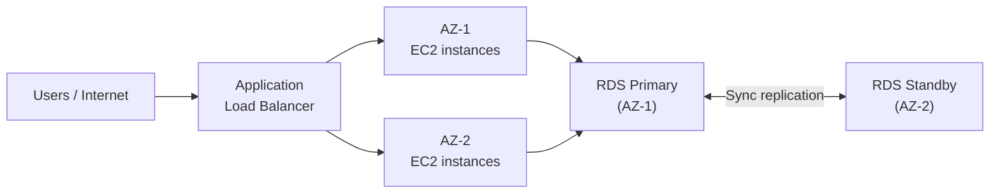
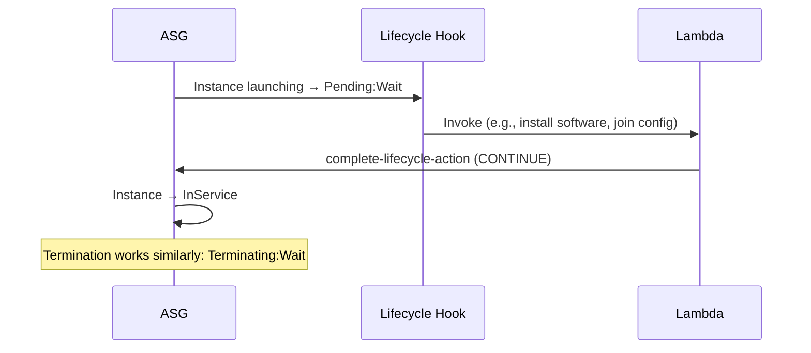
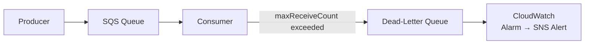
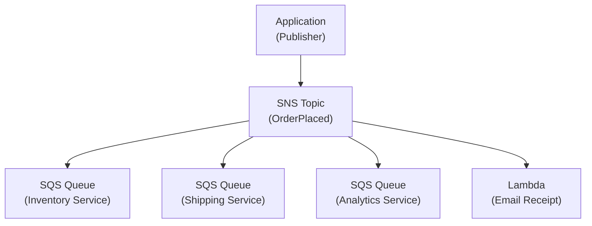
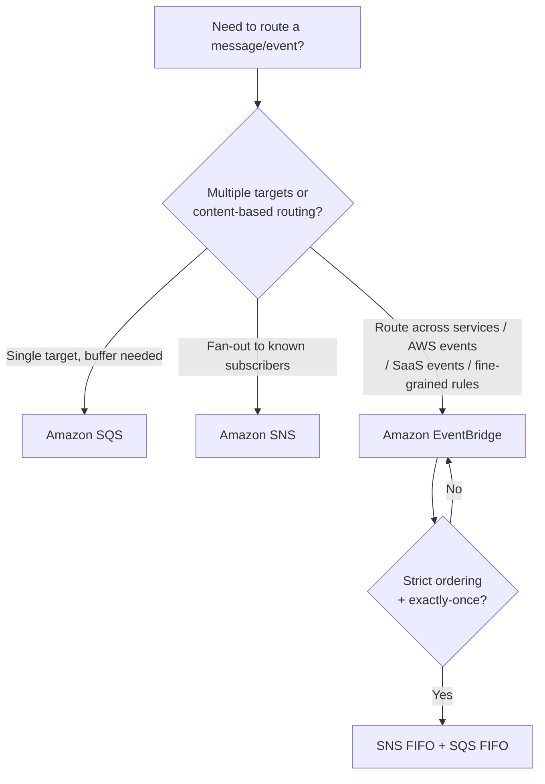
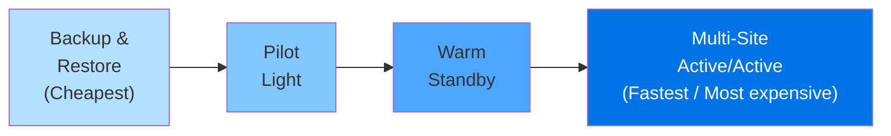
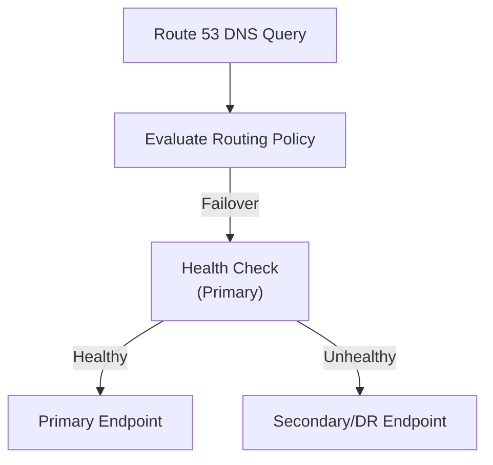
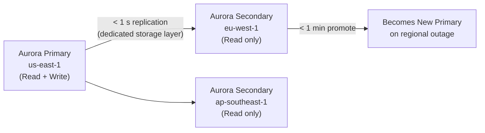

# Domain 2: Design Resilient Architectures

> **Exam weight: 26% of SAA-C03** — the single largest domain. Expect ~13 scenario-based questions on high availability, fault tolerance, decoupling, disaster recovery, DNS resilience, and data-layer durability.

> **Plain English:** "Resilient" means your system keeps running when things break. This domain tests whether you know *which AWS knob to turn* when a question says "eliminate single points of failure", "decouple a tightly coupled app", "survive a regional outage", or "recover faster from disaster". Master the reflexes — the exam rarely describes a service; it describes a business problem and asks which service or config solves it.

---

## Table of Contents

1. [High Availability & Fault Tolerance](#1-high-availability--fault-tolerance)
   - 1.1 [Regions, Availability Zones & Local Zones](#11-regions-availability-zones--local-zones)
   - 1.2 [Multi-AZ Design Patterns](#12-multi-az-design-patterns)
   - 1.3 [Auto Scaling Groups (ASG)](#13-auto-scaling-groups-asg)
   - 1.4 [Elastic Load Balancing (ELB)](#14-elastic-load-balancing-elb)
2. [Decoupling / Loose Coupling](#2-decoupling--loose-coupling)
   - 2.1 [Amazon SQS](#21-amazon-sqs)
   - 2.2 [Amazon SNS](#22-amazon-sns)
   - 2.3 [Amazon EventBridge](#23-amazon-eventbridge)
   - 2.4 [AWS Step Functions](#24-aws-step-functions)
   - 2.5 [Amazon MQ](#25-amazon-mq)
   - 2.6 [Choosing a Messaging Service](#26-choosing-a-messaging-service)
3. [Disaster Recovery Strategies](#3-disaster-recovery-strategies)
   - 3.1 [RTO & RPO Defined](#31-rto--rpo-defined)
   - 3.2 [The Four DR Strategies](#32-the-four-dr-strategies)
   - 3.3 [AWS Backup](#33-aws-backup)
   - 3.4 [AWS Elastic Disaster Recovery](#34-aws-elastic-disaster-recovery)
4. [DNS & Traffic Resilience](#4-dns--traffic-resilience)
   - 4.1 [Route 53 Routing Policies](#41-route-53-routing-policies)
   - 4.2 [Health Checks & DNS Failover](#42-health-checks--dns-failover)
5. [Resilient Data Layer](#5-resilient-data-layer)
   - 5.1 [RDS Multi-AZ vs Read Replicas](#51-rds-multi-az-vs-read-replicas)
   - 5.2 [Amazon Aurora](#52-amazon-aurora)
   - 5.3 [Amazon DynamoDB](#53-amazon-dynamodb)
   - 5.4 [Amazon S3 Durability & Replication](#54-amazon-s3-durability--replication)
   - 5.5 [EFS, FSx & EBS](#55-efs-fsx--ebs)
   - 5.6 [AWS DataSync & Storage Gateway](#56-aws-datasync--storage-gateway)
6. [Glossary](#glossary)
7. [References](#references)

---

## 1. High Availability & Fault Tolerance

### 1.1 Regions, Availability Zones & Local Zones

| Concept | Definition | Resilience use |
|---|---|---|
| **AWS Region** | Geographic area with ≥ 3 isolated AZs | Cross-region DR, data sovereignty |
| **Availability Zone (AZ)** | One or more discrete data centers with independent power, cooling, networking | Multi-AZ HA within a region |
| **Local Zone** | AWS infrastructure closer to a population centre, attached to a parent Region | Ultra-low latency for specific cities |
| **Wavelength Zone** | Infrastructure embedded in telecom 5G networks | Mobile/edge <10 ms latency |
| **AWS Outposts** | AWS rack deployed on-prem | Hybrid low-latency requirements |

**Key rule:** Placing resources in ≥ 2 AZs eliminates the AZ as a single point of failure. Placing workloads in ≥ 2 Regions eliminates the Region as a SPOF. AZ failures are far more common exam scenario than regional failures.

Sources: [AWS Global Infrastructure](https://aws.amazon.com/about-aws/global-infrastructure/) · [Regions and AZs docs](https://docs.aws.amazon.com/AWSEC2/latest/UserGuide/using-regions-availability-zones.html)

---

### 1.2 Multi-AZ Design Patterns

- **Active-active:** All AZs serve traffic simultaneously (e.g., EC2 behind ALB across 3 AZs).
- **Active-passive (standby):** Primary AZ serves traffic; standby AZ takes over on failure (e.g., RDS Multi-AZ standby instance).
- **Best practice:** Spread ASG `min`, `desired`, and `max` values across all AZs in a region; use ELB to route only to healthy targets.

---

### 1.3 Auto Scaling Groups (ASG)

An Auto Scaling Group maintains a fleet of EC2 instances, automatically launching or terminating them to meet demand and replace unhealthy instances.

Sources: [EC2 Auto Scaling User Guide](https://docs.aws.amazon.com/autoscaling/ec2/userguide/what-is-amazon-ec2-auto-scaling.html)

#### Scaling Policy Types

| Policy Type | How it works | Best for |
|---|---|---|
| **Target Tracking** | Set a target metric value (e.g., CPU = 50%); ASG adds/removes instances to maintain it — like a thermostat | Most workloads; AWS recommends as default |
| **Step Scaling** | Define step adjustments: breach by X → add Y instances, breach by X+10 → add Y+Z instances | Workloads needing proportional response to alarm severity |
| **Simple Scaling** | One scaling adjustment per alarm breach; has a cooldown period | Legacy; AWS recommends target tracking instead |
| **Scheduled Scaling** | Change `min`/`max`/`desired` at a specific time | Known traffic patterns (e.g., business hours) |
| **Predictive Scaling** | ML-based; forecasts future demand and scales proactively | Cyclical, recurring load patterns |

Sources: [Dynamic Scaling policies](https://docs.aws.amazon.com/autoscaling/ec2/userguide/as-scale-based-on-demand.html) · [Predictive Scaling](https://docs.aws.amazon.com/autoscaling/ec2/userguide/ec2-auto-scaling-predictive-scaling.html)

#### ASG Key Configuration Parameters

| Parameter | Description |
|---|---|
| `MinSize` | Floor — ASG never goes below this |
| `MaxSize` | Ceiling — ASG never exceeds this |
| `DesiredCapacity` | Target number of running instances right now |
| `DefaultCooldown` | Seconds to wait after scaling before another activity (default: 300 s) |
| `HealthCheckGracePeriod` | Seconds to wait after launch before health checks start (default: 300 s); set longer than instance boot time |

#### Health Check Types

ASG can use any combination of these to determine instance health:

| Health Check | What it checks | Must enable? |
|---|---|---|
| **EC2 status checks** | Instance running + underlying hardware (system/status checks) | Always on (default) |
| **ELB health checks** | Load balancer reports instance healthy for serving traffic | Must enable on ASG |
| **VPC Lattice health checks** | VPC Lattice target group reports healthy | Must enable on ASG |
| **EBS health checks** | EBS volumes reachable and passing I/O checks | Must enable on ASG |
| **Custom health checks** | Application-defined via `set-instance-health` API | Must enable |

Sources: [Health checks overview](https://docs.aws.amazon.com/autoscaling/ec2/userguide/health-checks-overview.html)

#### Lifecycle Hooks

Lifecycle hooks pause instance transitions so you can run custom actions (scripts, Lambda functions) **before** an instance enters service or **before** it is terminated.

- Default timeout: **3600 seconds (1 hour)**; max 7200 s.
- If hook times out without a response, default result applies (CONTINUE or ABANDON).

Sources: [Lifecycle hooks](https://docs.aws.amazon.com/autoscaling/ec2/userguide/lifecycle-hooks.html)

#### 🎯 On the exam — ASG

- **"Replace unhealthy instances automatically"** → ASG with EC2 or ELB health checks enabled.
- **"App needs 10 minutes to initialize before receiving traffic"** → set `HealthCheckGracePeriod` ≥ 600 s AND use lifecycle hooks.
- **"Run a cleanup script before termination"** → Lifecycle hook on `autoscaling:EC2_INSTANCE_TERMINATING`.
- **"Scale before traffic spike known in advance"** → Scheduled scaling or Predictive scaling.
- **"Maintain CPU at 60%"** → Target tracking policy on `ASGAverageCPUUtilization`.
- **"Scale based on SQS queue depth"** → Target tracking with a custom CloudWatch metric (ApproximateNumberOfMessagesVisible).

---

### 1.4 Elastic Load Balancing (ELB)

ELB automatically distributes incoming traffic across multiple targets (EC2, containers, Lambda, IPs) in one or more AZs.

Sources: [ELB User Guide](https://docs.aws.amazon.com/elasticloadbalancing/latest/userguide/what-is-load-balancing.html)

#### Load Balancer Comparison

| Feature | **ALB** (Application) | **NLB** (Network) | **GLB** (Gateway) | **CLB** (Classic) |
|---|---|---|---|---|
| OSI Layer | Layer 7 (HTTP/HTTPS) | Layer 4 (TCP/UDP/TLS) | Layer 3+4 (GENEVE) | Layer 4+7 |
| Protocols | HTTP, HTTPS, gRPC, WebSocket | TCP, UDP, TLS | IP protocols | TCP, SSL, HTTP, HTTPS |
| Primary use | Microservices, host/path routing | Ultra-low latency, static IP, TLS passthrough | Virtual appliances (firewall, IDS/IPS, DPI) | Legacy workloads only |
| Target types | Instance, IP, Lambda | Instance, IP, ALB | Instance, IP | Instance |
| Cross-zone LB default | **Enabled** (free) | **Disabled** (charges if enabled) | **Disabled** (charges if enabled) | Disabled |
| Sticky sessions | Yes (cookie-based) | Yes (source IP-based) | No | Yes |
| Static IP / EIP | Via NLB in front | **Yes** (per AZ) | No | No |
| WebSocket | Yes | Yes | No | No |
| Path/host routing | Yes | No | No | No |

> **Cross-zone load balancing:** When enabled, each load balancer node distributes traffic across all registered targets in ALL enabled AZs (not just its own AZ). ALB always does this; NLB/GLB default off.

#### Target Groups

Target groups route requests to registered targets (EC2 instances, IPs, Lambda, other ALBs) and perform health checks.

- Each target group has its own **health check settings** (protocol, path, port, healthy threshold, unhealthy threshold, timeout, interval).
- ALB rules route to target groups based on conditions (path, host header, HTTP method, query string, source IP).
- NLB target groups support TCP/UDP/TLS health checks.

#### 🎯 On the exam — ELB

- **"Route /api to one service, /web to another"** → ALB path-based routing rules.
- **"Need a static IP for the load balancer"** → NLB (one EIP per AZ).
- **"Inspect/filter traffic with a firewall appliance"** → Gateway Load Balancer.
- **"HTTP → HTTPS redirect"** → ALB listener rule (redirect action).
- **"Legacy app using JVM with JMS"** → NLB or CLB for TCP passthrough; usually NLB.
- **"Cross-zone is off and AZs have unequal instance counts causing uneven load"** → Enable cross-zone load balancing on NLB.

---

## 2. Decoupling / Loose Coupling

**Tight coupling** = services call each other directly; if one fails or slows, the caller fails. **Loose coupling** = services communicate via an intermediary (queue, topic, event bus); each side can fail or scale independently.

---

### 2.1 Amazon SQS

Amazon Simple Queue Service — a fully managed message queue for decoupling distributed components.

Sources: [SQS Developer Guide](https://docs.aws.amazon.com/AWSSimpleQueueService/latest/SQSDeveloperGuide/welcome.html) · [SQS vs SNS vs EventBridge decision guide](https://docs.aws.amazon.com/pdfs/decision-guides/latest/sns-or-sqs-or-eventbridge/sns-or-sqs-or-eventbridge.pdf)

#### Standard vs FIFO Queue

| Feature | **Standard Queue** | **FIFO Queue** |
|---|---|---|
| Throughput | Unlimited (nearly) | 300 TPS (3,000 with batching); High-throughput mode up to 70,000 TPS |
| Ordering | Best-effort (not guaranteed) | Strict FIFO within a message group |
| Delivery | **At-least-once** (duplicates possible) | **Exactly-once** (deduplication within 5-min window) |
| Deduplication | No | Yes — by deduplication ID |
| Message groups | No | Yes — MessageGroupId enables parallel consumers per group |
| Use cases | Decoupling at scale, idempotent consumers | Financial transactions, ordering systems, strictly ordered workflows |
| Queue name suffix | (any) | Must end in `.fifo` |

#### Key SQS Settings

| Setting | Default | Range | Purpose |
|---|---|---|---|
| **Visibility Timeout** | 30 s | 0 s – 12 hours | Time a message is hidden from other consumers while being processed; extend if processing takes longer |
| **Message Retention** | 4 days | 60 s – 14 days | How long unprocessed messages stay in queue |
| **Max Message Size** | 256 KB | 1 B – 256 KB (up to 2 GB via S3 pointer) | Payload size limit |
| **Delay Queue** | 0 s | 0 s – 15 min | Postpone delivery of new messages |
| **Long Polling (`WaitTimeSeconds`)** | 0 s (short polling) | 1–20 s | Reduces empty responses; wait up to 20 s for a message — **saves cost** |
| **Receive Message Wait Time** | 0 s | 0–20 s | Queue-level default for long polling |

#### Dead-Letter Queue (DLQ)

- A separate SQS queue where messages are sent after exceeding `maxReceiveCount` (the number of receive attempts).
- Preserves failed messages for debugging without blocking the main queue.
- **DLQ must be the same type** (Standard DLQ for Standard queue; FIFO DLQ for FIFO queue).
- Set up a CloudWatch alarm on `ApproximateNumberOfMessagesVisible` on the DLQ.

Sources: [SQS DLQ](https://docs.aws.amazon.com/AWSSimpleQueueService/latest/SQSDeveloperGuide/sqs-dead-letter-queues.html)

#### 🎯 On the exam — SQS

- **"Decouple producer from consumer with buffering"** → SQS Standard queue.
- **"Process messages in exact order, no duplicates"** → SQS FIFO queue.
- **"Messages failing repeatedly clog the queue"** → Add a DLQ with `maxReceiveCount`.
- **"Reduce empty poll API calls / cost"** → Enable long polling (`WaitTimeSeconds=20`).
- **"Consumer taking longer than 30 s"** → Increase `VisibilityTimeout` to match processing time.
- **"Scale EC2 fleet based on queue backlog"** → ASG target tracking with `ApproximateNumberOfMessagesVisible / NumberOfInstances` custom metric.

---

### 2.2 Amazon SNS

Amazon Simple Notification Service — a fully managed pub/sub messaging service for fan-out notifications.

Sources: [SNS Developer Guide](https://docs.aws.amazon.com/sns/latest/dg/welcome.html)

#### Core Concepts

| Concept | Description |
|---|---|
| **Topic** | Communication channel; publishers send messages to it |
| **Subscription** | An endpoint subscribed to a topic; receives copies of each message |
| **Subscriber types** | SQS, Lambda, HTTP/HTTPS, Email, SMS, Amazon Kinesis Data Firehose, mobile push |
| **Fan-out pattern** | One SNS message → distributed to multiple SQS queues → independent consumers |
| **Message filtering** | Subscription filter policies let subscribers receive only matching messages (by attribute) |
| **FIFO topics** | SNS FIFO + SQS FIFO = ordered, deduplicated fan-out |

#### SNS Fan-Out Pattern

**Why fan-out via SNS → SQS (not SNS directly to consumers)?**
- SQS provides durability and buffering — messages persist if the consumer is down.
- Decouples processing speed (consumer processes at own pace).

#### 🎯 On the exam — SNS

- **"Send the same event to multiple downstream systems"** → SNS fan-out to multiple SQS queues.
- **"Only send certain message types to each subscriber"** → SNS subscription filter policies.
- **"Alert operations team + trigger Lambda on same event"** → SNS topic with SQS + Lambda subscriptions.
- **"Ordered fan-out"** → SNS FIFO + SQS FIFO subscriptions.

---

### 2.3 Amazon EventBridge

Amazon EventBridge — a serverless event bus that routes events from AWS services, SaaS apps, and custom apps to targets.

Sources: [EventBridge User Guide](https://docs.aws.amazon.com/eventbridge/latest/userguide/eb-what-is.html)

#### Key Concepts

| Concept | Description |
|---|---|
| **Event bus** | Pipeline that receives events; default bus receives all AWS service events automatically |
| **Rule** | Matches events by pattern (event source, detail-type, detail) and routes to targets |
| **Target** | Where matched events go — Lambda, SQS, SNS, Step Functions, ECS task, API Gateway, etc. |
| **Schema registry** | Auto-discovers and stores event schemas for IDE code-completion |
| **EventBridge Pipes** | Point-to-point integration between a source (SQS, DynamoDB stream) and a target with optional enrichment |
| **EventBridge Scheduler** | Create scheduled jobs (cron or rate expressions) that invoke AWS targets without running EC2 |

#### EventBridge vs SNS vs SQS (Exam Decision Tree)

#### 🎯 On the exam — EventBridge

- **"Trigger Lambda when an EC2 instance changes state"** → EventBridge rule on EC2 state-change events (default event bus).
- **"Route events from Salesforce to AWS"** → EventBridge SaaS integration (partner event bus).
- **"Run a Lambda every night at 2 AM"** → EventBridge Scheduler (or scheduled rule with cron expression).
- **"Route events differently based on event content (detail fields)"** → EventBridge content-based filtering rules.
- **"Decouple producer from consumer, producer doesn't know consumers"** → EventBridge (true decoupling; SNS requires subscription management).

---

### 2.4 AWS Step Functions

Fully managed workflow orchestration service for coordinating multi-step distributed applications.

Sources: [Step Functions Developer Guide](https://docs.aws.amazon.com/step-functions/latest/dg/welcome.html)

| Feature | Detail |
|---|---|
| **State machine** | Visual workflow defined in Amazon States Language (ASL/JSON) |
| **Standard workflows** | Max duration 1 year; exactly-once execution; auditable execution history |
| **Express workflows** | Max duration 5 minutes; at-least-once; high event rate (100,000 executions/s) |
| **Integrations** | Lambda, ECS, DynamoDB, SNS, SQS, Bedrock, Glue, SageMaker, 220+ services via SDK integrations |
| **Error handling** | Built-in retry and catch blocks per state |
| **Use cases** | Order processing, ETL orchestration, ML model training pipelines, human approval workflows |

**Key distinction:** Step Functions *orchestrates* (one service calls others in sequence/parallel). EventBridge *routes events* (fire-and-forget patterns). Use Step Functions when you need visible, auditable, long-running workflows with error handling.

---

### 2.5 Amazon MQ

Managed message broker service supporting standard protocols.

Sources: [Amazon MQ User Guide](https://docs.aws.amazon.com/amazon-mq/latest/developer-guide/welcome.html) · [SQS vs SNS vs MQ comparison](https://docs.aws.amazon.com/AWSSimpleQueueService/latest/SQSDeveloperGuide/welcome.html#sqs-difference-from-amazon-mq-sns)

| Feature | Detail |
|---|---|
| **Brokers supported** | Apache ActiveMQ, RabbitMQ |
| **Protocols** | AMQP, JMS, MQTT, OpenWire, STOMP |
| **Primary use** | Lift-and-shift of on-premises message broker workloads to AWS |
| **HA** | Active/standby pair in two AZs; automatic failover |
| **vs SQS/SNS** | SQS/SNS are cloud-native, virtually unlimited scale; Amazon MQ is for legacy protocol compatibility |

#### 🎯 On the exam — Amazon MQ

- **"Migrate on-premises app using JMS or AMQP without rewriting"** → Amazon MQ (not SQS).
- **"New cloud-native application needs a queue"** → SQS (not Amazon MQ).
- **"RabbitMQ on-prem, want managed service"** → Amazon MQ for RabbitMQ.

---

### 2.6 Choosing a Messaging Service

| Scenario | Service |
|---|---|
| Buffer work between app tiers, one consumer per message | **SQS Standard** |
| Strict order + exactly-once (financial transactions) | **SQS FIFO** |
| Fan-out one event to many subscribers simultaneously | **SNS** |
| Route AWS service events or SaaS events with content filtering | **EventBridge** |
| Scheduled invocations (cron jobs without EC2) | **EventBridge Scheduler** |
| Multi-step orchestration with error handling & visibility | **Step Functions** |
| Lift-and-shift legacy broker (JMS, AMQP, MQTT, STOMP) | **Amazon MQ** |
| Real-time streaming data / ordered by shard / replay | **Amazon Kinesis** |

---

## 3. Disaster Recovery Strategies

### 3.1 RTO & RPO Defined

| Metric | Full name | Meaning |
|---|---|---|
| **RPO** | Recovery Point Objective | Maximum acceptable data loss measured in time — "how old can our recovered data be?" |
| **RTO** | Recovery Time Objective | Maximum acceptable downtime after a disaster — "how long can we be down?" |

Lower RPO and RTO = less risk, but more cost. DR strategy selection is fundamentally a cost-vs-risk trade-off.

Sources: [Disaster Recovery of Workloads on AWS whitepaper](https://docs.aws.amazon.com/whitepapers/latest/disaster-recovery-workloads-on-aws/disaster-recovery-options-in-the-cloud.html)

---

### 3.2 The Four DR Strategies

#### Strategy Comparison Table

| Strategy | RPO | RTO | Cost | DR Region state | Failover mechanism |
|---|---|---|---|---|---|
| **Backup & Restore** | Hours | 24 hours or less | Lowest | No running resources; data in S3/Glacier | Restore from backup + redeploy via IaC |
| **Pilot Light** | Minutes | Hours | Low–medium | Core data tier always on (DB replicated); compute "dark" | Boot and scale compute from pre-baked AMIs |
| **Warm Standby** | Seconds | Minutes | Medium–high | Scaled-down but fully functional copy always running | Scale up to production capacity |
| **Multi-Site Active/Active** | Near-zero | Near-zero | Highest | Full production in all regions, serving live traffic | Traffic re-weighting; no traditional failover needed |

#### 3.2.1 Backup & Restore

- Periodic snapshots (EBS snapshots, RDS snapshots, DynamoDB backups) stored in S3 or AWS Backup.
- AMIs copied to DR region.
- IaC (CloudFormation / CDK) stored in source control so entire infrastructure can be redeployed on demand.
- **Key risk:** Restoration is a **control plane** operation — if the control plane is degraded during a disaster, RTO increases.

#### 3.2.2 Pilot Light

- Continuous data replication to DR region (S3 CRR, RDS cross-region read replica, Aurora Global Database, DynamoDB Global Tables).
- Application servers not deployed; AMIs pre-staged.
- On failover: deploy compute via CloudFormation, promote DB read replica to primary.
- **AWS Elastic Disaster Recovery** uses the pilot light strategy (block-level replication of servers).

#### 3.2.3 Warm Standby

- A **scaled-down but fully functional** copy of production runs in the DR region.
- Difference from pilot light: warm standby can **immediately handle traffic at reduced capacity** without "switching on" servers.
- On failover: Route 53 / Global Accelerator shifts traffic; Auto Scaling scales up to full production capacity.
- **Pilot light vs Warm Standby mnemonic:** Pilot light = servers off, only data lives there. Warm standby = servers running (small fleet), data there, just scale up.

#### 3.2.4 Multi-Site Active/Active

- Full production in 2+ regions simultaneously; users served from nearest/healthiest region.
- No traditional failover — if a region fails, traffic is re-weighted (Route 53 weighted/latency policy or Global Accelerator traffic dial).
- **Write strategies:**
  - *Write global:* All writes go to one primary region (Aurora Global Database) — simplest consistency.
  - *Write local:* Writes go to nearest region (DynamoDB Global Tables with last-writer-wins).
  - *Write partitioned:* Writes partitioned by key across regions (S3 bidirectional replication).
- Most complex and expensive; near-zero RTO/RPO for infrastructure failures (data corruption still needs point-in-time backups).

Sources: [AWS DR Options whitepaper](https://docs.aws.amazon.com/whitepapers/latest/disaster-recovery-workloads-on-aws/disaster-recovery-options-in-the-cloud.html) · [Multi-site Active/Active blog](https://aws.amazon.com/blogs/architecture/disaster-recovery-dr-architecture-on-aws-part-iv-multi-site-active-active/)

#### 🎯 On the exam — DR Strategies

- **"Cheapest DR, some data loss acceptable"** → Backup & Restore.
- **"Recover in minutes, minimal cost, data always synced"** → Pilot Light.
- **"Can't wait hours to recover, want proven runbook"** → Warm Standby.
- **"Survive regional outage with near-zero downtime AND data loss"** → Multi-Site Active/Active.
- **"RPO of 15 minutes, RTO of 1 hour"** → Pilot Light or Warm Standby depending on exact requirements.
- **"Active-active → traffic just re-routes"** → No failover event; Multi-Site.

---

### 3.3 AWS Backup

Centralized, policy-based backup service for AWS resources.

Sources: [AWS Backup Developer Guide](https://docs.aws.amazon.com/aws-backup/latest/devguide/whatisbackup.html)

| Feature | Detail |
|---|---|
| **Supported resources** | EBS volumes, EC2 instances, RDS (incl. Aurora), DynamoDB, EFS, FSx (Windows, Lustre, ONTAP, OpenZFS), Storage Gateway, DocumentDB, Neptune |
| **Backup plans** | Define backup frequency, retention, and vault |
| **Cross-region copy** | Copy backups to a different AWS region for DR |
| **Cross-account copy** | Protects against account compromise / insider threats |
| **Vault Lock** | WORM protection on backup vault (cannot delete backups for defined retention period) |
| **AWS Backup Audit Manager** | Compliance reporting on backup activities |

**Important:** AWS Backup restore is **not automatic** — restoration must be triggered manually or via automation (SNS + Lambda). Build scheduled restore tests.

---

### 3.4 AWS Elastic Disaster Recovery

Sources: [AWS Elastic Disaster Recovery](https://aws.amazon.com/disaster-recovery/)

- Continuously replicates **server-hosted applications** using **block-level replication** into AWS (or between AWS regions).
- Maintains a staging area in a VPC with lightweight replication servers and EBS volumes.
- On failover: spins up full-capacity recovery instances from the staged volumes in the target VPC.
- Implements the **Pilot Light** strategy.
- Use cases:
  - On-premises to AWS DR
  - Other cloud to AWS DR
  - EC2 to EC2 within AWS (for OS/app-level replication, not RDS-managed services)
- **RPO:** Seconds (block-level replication).
- **RTO:** Minutes (replication server to full instance).

---

## 4. DNS & Traffic Resilience

### 4.1 Route 53 Routing Policies

Amazon Route 53 is AWS's authoritative DNS service. Routing policies determine how Route 53 responds to DNS queries.

Sources: [Route 53 routing policy docs](https://docs.aws.amazon.com/Route53/latest/DeveloperGuide/routing-policy.html)

| Routing Policy | How it works | Best for |
|---|---|---|
| **Simple** | Returns one value (or random if multiple values in one record) | Single resource; no health checks (health checks not supported for alias records in simple routing) |
| **Weighted** | Distributes traffic proportionally by weight (0–255); weight 0 = no traffic | A/B testing, blue/green deployments, gradual traffic shifting |
| **Latency** | Routes to the region with the lowest measured latency for the user | Multi-region deployments wanting lowest latency |
| **Failover** | Active-passive: primary gets traffic; if health check fails, traffic goes to secondary | Active-passive DR |
| **Geolocation** | Routes based on the **geographic location of the user** | Content localization, legal compliance (serve EU users to EU region) |
| **Geoproximity** | Routes based on location of **resources** with optional bias to shift traffic boundaries | Fine-tune traffic distribution between locations; uses Route 53 Traffic Flow |
| **Multivalue Answer** | Returns up to 8 healthy records chosen at random | Pseudo load-balancing at DNS level; not a replacement for ELB |
| **IP-based** | Routes based on user's originating IP address (CIDR blocks) | ISP-specific routing, known IP ranges |

#### Key distinctions — Geolocation vs Geoproximity

- **Geolocation** = which country/continent the user is coming from. Deterministic.
- **Geoproximity** = distance between user and resource + optional bias. Use Traffic Flow visual editor to add/remove bias to shift the routing boundary.

---

### 4.2 Health Checks & DNS Failover

Route 53 health checks monitor endpoint health and can trigger automatic DNS failover.

Sources: [Route 53 health checks](https://docs.aws.amazon.com/Route53/latest/DeveloperGuide/dns-failover.html)

| Health Check Type | Monitors |
|---|---|
| **Endpoint** | HTTP/HTTPS/TCP endpoint (IP or domain); checks every 10 or 30 s from multiple AWS locations |
| **Calculated** | Aggregates multiple child health checks (AND/OR/threshold logic) |
| **CloudWatch alarm** | Triggers unhealthy when a CloudWatch alarm enters ALARM state |

**DNS failover pattern:**
1. Create **two records** with the same name: one as PRIMARY (failover routing), one as SECONDARY.
2. Attach a Route 53 health check to the PRIMARY record.
3. Route 53 automatically returns the SECONDARY record when the PRIMARY health check fails.
4. TTL should be low (60 s or less) to minimize DNS caching during failover.

**Private hosted zones:** Health checks of private resources require CloudWatch alarm-based health checks (Route 53 health checkers are public).

#### 🎯 On the exam — Route 53

- **"Active-passive DNS failover"** → Failover routing policy + Route 53 health check on primary.
- **"Route based on where the user is located (country)"** → Geolocation routing.
- **"Route to lowest latency region"** → Latency routing policy.
- **"Blue/green or canary deployment at DNS level"** → Weighted routing (e.g., 90/10 weight split).
- **"Not a substitute for load balancer"** → Multivalue answer — it returns multiple IPs but has no connection draining or session stickiness.
- **"DNS failover for a private (VPC-internal) resource"** → CloudWatch alarm health check (not endpoint health check, which requires public access).

---

## 5. Resilient Data Layer

### 5.1 RDS Multi-AZ vs Read Replicas

Sources: [RDS Multi-AZ](https://docs.aws.amazon.com/AmazonRDS/latest/UserGuide/Concepts.MultiAZ.html) · [RDS Read Replicas](https://docs.aws.amazon.com/AmazonRDS/latest/UserGuide/USER_ReadRepl.html)

| Feature | **Multi-AZ** | **Read Replica** |
|---|---|---|
| **Purpose** | High Availability / Fault Tolerance | Read scalability (and cross-region DR) |
| **Replication** | Synchronous (primary → standby in same/different AZ) | Asynchronous (primary → replica) |
| **Replica accepts reads?** | **No** (standby is passive; not accessible until failover) | **Yes** (serves SELECT queries) |
| **Failover** | Automatic (~60–120 s); DNS CNAME flips to standby | Manual promotion required |
| **Cross-region** | No (within region only) | Yes (cross-region read replicas supported) |
| **Use for DR** | Within-region HA | Cross-region DR (promote replica to become primary) |
| **Engines** | All RDS engines | MySQL, MariaDB, PostgreSQL, Oracle (limited), SQL Server (limited) |
| **Number of replicas** | 1 standby (or 2 for Multi-AZ DB cluster) | Up to 5 per source instance (can chain) |

#### 🎯 On the exam — RDS

- **"HA for a database / survive AZ failure"** → RDS Multi-AZ.
- **"Scale read traffic from reporting queries"** → Read Replica.
- **"Cross-region DR for RDS"** → Cross-region Read Replica → promote on disaster.
- **"Multi-AZ standby doesn't help with reads"** → True. It's passive. Use read replicas for reads.
- **"Aurora Multi-AZ"** → Aurora is always Multi-AZ by design; replicas serve reads AND act as failover targets.

---

### 5.2 Amazon Aurora

Aurora is a MySQL/PostgreSQL-compatible relational database built for the cloud with native HA across 3 AZs.

Sources: [Aurora User Guide](https://docs.aws.amazon.com/AmazonRDS/latest/AuroraUserGuide/CHAP_AuroraOverview.html) · [Aurora Global Database](https://docs.aws.amazon.com/AmazonRDS/latest/AuroraUserGuide/aurora-global-database.html)

#### Aurora Architecture

- **Storage:** 6 copies of data across 3 AZs (2 per AZ); tolerates loss of 2 copies for writes, 3 for reads.
- **Cluster:** 1 writer + up to 15 reader instances; readers share the same storage volume.
- **Failover:** If writer fails, a reader is promoted; typically completes in **~30 seconds** (faster than standard RDS Multi-AZ ~60–120 s).
- **Endpoints:**
  - *Cluster endpoint* → always the writer
  - *Reader endpoint* → load-balances reads across all readers
  - *Instance endpoint* → specific instance

#### Aurora Global Database

| Feature | Detail |
|---|---|
| **Regions** | 1 primary (read/write) + up to **10 secondary** (read-only) regions |
| **Replication lag** | Typically **< 1 second** to secondary regions |
| **Failover RTO** | **< 1 minute** to promote a secondary to primary |
| **Replication mechanism** | Dedicated storage-level infrastructure (not DB-layer replication) |
| **RPO** | Seconds (configurable RPO lag monitoring) |
| **Use case** | Cross-region disaster recovery + globally distributed read performance |
| **Engines** | Aurora MySQL, Aurora PostgreSQL |

Sources: [Aurora Global Database docs](https://docs.aws.amazon.com/AmazonRDS/latest/AuroraUserGuide/aurora-global-database.html)

#### Aurora Serverless v2

- Scales compute (ACUs) up and down automatically within seconds.
- No pre-provisioning; pay per ACU-second.
- Supports both MySQL and PostgreSQL compatibility.
- Can be used as a read replica in a provisioned Aurora cluster.

#### 🎯 On the exam — Aurora

- **"Cross-region low-RPO relational DB"** → Aurora Global Database (< 1 s replication, < 1 min failover).
- **"Scale reads for Aurora"** → Add Aurora read replicas (up to 15); use reader endpoint.
- **"Faster failover than RDS Multi-AZ"** → Aurora (~30 s vs RDS ~60–120 s).
- **"Variable/unpredictable workload"** → Aurora Serverless v2.
- **"Active-active relational DB across regions"** → Aurora Global Database with write forwarding or DynamoDB Global Tables.

---

### 5.3 Amazon DynamoDB

Fully managed, serverless, key-value and document NoSQL database with single-digit millisecond performance at any scale.

Sources: [DynamoDB Developer Guide](https://docs.aws.amazon.com/amazondynamodb/latest/developerguide/Introduction.html) · [DynamoDB Global Tables](https://docs.aws.amazon.com/amazondynamodb/latest/developerguide/globaltables.V2.html)

#### Resilience Features

| Feature | Detail |
|---|---|
| **Default durability** | Data replicated across 3 AZs within a region |
| **Global Tables** | Multi-region, multi-active tables; replicates in milliseconds; last-writer-wins conflict resolution |
| **Point-in-Time Recovery (PITR)** | Continuous backups; restore to any second within the last 35 days |
| **On-demand backup** | Manual snapshots; no performance impact; no expiry |
| **Streams** | Ordered change log of item-level modifications; retained 24 hours; used for replication, triggers |

#### DynamoDB Global Tables

- Active-active across ≥ 2 regions: all replicas accept reads and writes.
- Use when you need **write local** strategy (writes go to nearest region).
- **Last-writer-wins** for concurrent conflict resolution.
- Requires PITR enabled on the table.

Sources: [DynamoDB Global Tables V2](https://docs.aws.amazon.com/amazondynamodb/latest/developerguide/globaltables.V2.html)

#### 🎯 On the exam — DynamoDB

- **"Global active-active NoSQL DB with ms replication"** → DynamoDB Global Tables.
- **"Restore table to 3 days ago"** → DynamoDB PITR.
- **"Trigger Lambda on every item change"** → DynamoDB Streams → Lambda.
- **"Zero-downtime, any-scale NoSQL"** → DynamoDB (on-demand capacity mode).

---

### 5.4 Amazon S3 Durability & Replication

Sources: [S3 User Guide](https://docs.aws.amazon.com/AmazonS3/latest/userguide/Welcome.html) · [S3 Replication](https://docs.aws.amazon.com/AmazonS3/latest/userguide/replication.html)

#### Durability & Availability

| Feature | Value |
|---|---|
| **Durability** | **99.999999999% (11 nines)** — S3 stores objects redundantly across ≥ 3 AZs |
| **Standard availability** | 99.99% |
| **One Zone-IA availability** | 99.5% (single AZ — not resilient to AZ failure) |
| **Glacier** | 11 nines durability; for archival; retrieval from minutes to hours |

#### S3 Versioning

- Retains all versions of every object.
- Protects against accidental deletion (delete marker added; prior versions retrievable).
- Required for replication and MFA Delete.

#### S3 Replication

| Feature | **Cross-Region Replication (CRR)** | **Same-Region Replication (SRR)** |
|---|---|---|
| **Destination** | Different AWS region | Same region, different bucket |
| **Use cases** | DR, compliance, latency reduction for multi-region | Log aggregation, data sovereignty within region, test/prod copies |
| **Requires versioning?** | Yes — on both source and destination | Yes — on both |
| **Replication scope** | New objects only (by default; can replicate existing with batch replication) |  |
| **Delete markers** | Not replicated by default (enable delete marker replication optionally) |  |
| **S3 RTC** | S3 Replication Time Control: 99.99% of objects replicated within 15 minutes; comes with SLA |  |

#### 🎯 On the exam — S3

- **"Protect against accidental deletion"** → Enable versioning (+ MFA Delete for extra protection).
- **"DR copy of S3 data in another region"** → S3 CRR.
- **"Compliance copy in same region"** → S3 SRR.
- **"Guarantee replication within 15 minutes with SLA"** → S3 RTC.
- **"Don't use S3 One Zone-IA for critical data"** → Single AZ; not resilient to AZ failure.

---

### 5.5 EFS, FSx & EBS

#### Amazon EFS (Elastic File System)

Sources: [EFS User Guide](https://docs.aws.amazon.com/efs/latest/ug/whatisefs.html)

- Fully managed, shared NFS file system; **automatically replicates data across all AZs in a region**.
- Accessible simultaneously from multiple EC2 instances across AZs (shared POSIX file system).
- **EFS Replication:** Can replicate an EFS file system to another region for DR (near real-time, RPO minutes).
- Storage classes: Standard (multi-AZ), One Zone (single AZ — cheaper, less resilient).
- Use for shared file storage across multiple EC2 instances, Lambda, ECS tasks.

#### Amazon FSx

| FSx Variant | Protocol | HA Mode | Use case |
|---|---|---|---|
| **FSx for Windows File Server** | SMB, NFS | Multi-AZ (synchronous replication) or Single-AZ | Windows workloads, Active Directory |
| **FSx for Lustre** | Lustre (POSIX) | Single-AZ | HPC, ML training, scratch/persistent |
| **FSx for NetApp ONTAP** | NFS, SMB, iSCSI | Multi-AZ or Single-AZ | Enterprise storage, hybrid |
| **FSx for OpenZFS** | NFS | Single-AZ | Linux workloads needing ZFS features |

- FSx for Windows File Server Multi-AZ uses **synchronous replication** between two AZs with automatic failover (~30 s).

Sources: [FSx for Windows HA](https://docs.aws.amazon.com/fsx/latest/WindowsGuide/high-availability-multiAZ.html)

#### Amazon EBS (Elastic Block Store)

- Persistent block storage for EC2; **tied to one AZ** (not inherently multi-AZ).
- **EBS Snapshots:** Point-in-time snapshot stored in S3 (multi-AZ within region); can be copied to another region.
- **EBS Multi-Attach:** Attach one `io1`/`io2` volume to up to 16 instances in the same AZ (cluster storage use case).
- **Snapshots for DR:** Copy snapshots to another region → launch from snapshot in DR region.

Sources: [EBS User Guide](https://docs.aws.amazon.com/ebs/latest/userguide/what-is-ebs.html)

#### 🎯 On the exam — Storage

- **"Shared file system across multiple EC2 instances"** → EFS (not EBS).
- **"Windows file server HA"** → FSx for Windows File Server Multi-AZ.
- **"EBS is AZ-scoped"** → Can't mount the same EBS volume from another AZ; use snapshots to move between AZs.
- **"EBS snapshot DR"** → Copy snapshot cross-region; launch new volume from it.

---

### 5.6 AWS DataSync & Storage Gateway

#### AWS DataSync

Sources: [AWS DataSync User Guide](https://docs.aws.amazon.com/datasync/latest/userguide/what-is-datasync.html)

- Automated, **online** data transfer service; transfers data between on-premises and AWS (NFS, SMB, HDFS, S3 API, EFS, FSx) or between AWS services.
- Transfers up to **10x faster** than open-source tools by using parallel multi-part transfers and network optimization.
- Supports scheduling, bandwidth throttling, checksums, and encryption in transit.
- **Use for:** Migrating data to AWS, recurring transfers for DR replication, archiving cold data from on-premises to S3 Glacier.

#### AWS Storage Gateway

Sources: [Storage Gateway User Guide](https://docs.aws.amazon.com/storagegateway/latest/userguide/WhatIsStorageGateway.html)

| Gateway Type | Protocol | Stores to | Use case |
|---|---|---|---|
| **S3 File Gateway** | NFS, SMB | Amazon S3 | On-prem apps access S3 as a file share |
| **FSx File Gateway** | SMB | Amazon FSx for Windows | Locally cache FSx for Windows data |
| **Volume Gateway (Stored)** | iSCSI | On-prem (snapshots to S3) | Primary data on-prem; snapshots for backup |
| **Volume Gateway (Cached)** | iSCSI | S3 (cache on-prem) | Primary data in S3; hot data cached locally |
| **Tape Gateway** | iSCSI VTL | S3 + S3 Glacier | Replace physical tape libraries |

#### 🎯 On the exam — DataSync vs Storage Gateway

- **"One-time or periodic migration of large data sets to AWS"** → AWS DataSync.
- **"On-prem app needs to write files that land in S3"** → S3 File Gateway.
- **"Replace physical tape backup with cloud"** → Tape Gateway.
- **"On-prem app needs iSCSI block storage backed by S3"** → Volume Gateway.
- **"Hybrid DR: local storage with cloud backup"** → Volume Gateway (stored mode) — data on-prem, snapshots in S3.

---

## Glossary

| Term | Simple explanation | Purpose |
|---|---|---|
| **AZ (Availability Zone)** | Isolated data center cluster within a Region | Eliminate single data center as SPOF |
| **ASG (Auto Scaling Group)** | Fleet of EC2s that auto-scales and replaces unhealthy instances | HA + right-sized capacity |
| **ALB** | Layer-7 HTTP/HTTPS load balancer with path/host routing | Microservices traffic distribution |
| **NLB** | Layer-4 TCP/UDP load balancer with static IP | Low latency, static IP requirements |
| **GLB** | Layer-3/4 load balancer for virtual network appliances | Third-party security appliance inline |
| **SQS** | Managed message queue; decouples producer from consumer | Buffering, loose coupling |
| **FIFO Queue** | SQS queue guaranteeing strict order + exactly-once delivery | Ordered, idempotent workloads |
| **DLQ** | Dead-letter queue; receives messages that fail processing repeatedly | Debug failed messages |
| **Visibility Timeout** | Time a message is hidden from other consumers while being processed | Prevent duplicate processing |
| **Long Polling** | SQS consumer waits up to 20 s for a message before returning | Reduce empty API calls and cost |
| **SNS** | Pub/sub notification service; fan-out to multiple subscribers | One-to-many messaging |
| **EventBridge** | Serverless event bus with content-based routing rules | Event-driven architecture, AWS service event routing |
| **Step Functions** | Workflow orchestration service; visual state machine | Multi-step, auditable workflows |
| **Amazon MQ** | Managed broker for AMQP/JMS/MQTT/STOMP | Lift-and-shift legacy message brokers |
| **RTO** | Max acceptable downtime after a disaster | DR strategy target |
| **RPO** | Max acceptable data loss (in time) | DR strategy target |
| **Backup & Restore** | Periodic snapshots; restore to rebuild on disaster | Cheapest DR |
| **Pilot Light** | Core data replicated; compute dark until failover | Low-cost DR, minutes RTO |
| **Warm Standby** | Scaled-down but running copy of production in DR region | Minutes RTO, seconds RPO |
| **Multi-Site Active/Active** | Full production in multiple regions simultaneously | Near-zero RTO/RPO |
| **AWS Backup** | Centralized policy-based backup across AWS services | Backup management and compliance |
| **AWS Elastic DR** | Block-level continuous replication; pilot light for server workloads | On-prem to AWS DR |
| **Route 53** | AWS authoritative DNS with routing policies and health checks | Traffic routing, DNS failover |
| **Failover Routing** | Active-passive Route 53 policy; secondary activated on health check failure | DNS-level HA |
| **Weighted Routing** | Route 53 distributes traffic by percentage weight | A/B testing, blue/green |
| **Geolocation Routing** | Route based on user's country/continent | Compliance, localization |
| **Latency Routing** | Route to lowest-latency AWS region for the user | Performance optimization |
| **RDS Multi-AZ** | Synchronous standby in another AZ; auto failover ~60–120 s | DB fault tolerance |
| **RDS Read Replica** | Async copy of DB serving reads; can be cross-region | Read scaling + cross-region DR |
| **Aurora Global Database** | Up to 10 secondary regions; < 1 s replication; < 1 min failover | Cross-region relational DB DR |
| **DynamoDB Global Tables** | Multi-region, multi-active NoSQL; last-writer-wins | Global active-active NoSQL |
| **PITR** | Point-in-Time Recovery; restore to any second in last 35 days (DynamoDB) | Accidental deletion/corruption recovery |
| **S3 CRR** | Cross-Region Replication; async copy objects to another region | S3 DR, compliance |
| **S3 SRR** | Same-Region Replication; copy objects within same region to another bucket | Log aggregation, test/prod copies |
| **EFS** | Managed shared NFS file system, multi-AZ by default | Shared file storage across instances |
| **EBS Snapshot** | Point-in-time snapshot of EBS volume stored in S3 | Backup, AMI creation, cross-region DR |
| **Lifecycle Hook** | Pause ASG instance launch/termination for custom actions | Bootstrapping, graceful drain |
| **Cross-Zone Load Balancing** | LB node routes to targets in ALL AZs, not just its own | Even distribution across AZs |
| **DataSync** | Fast online data transfer service (on-prem ↔ AWS or AWS ↔ AWS) | Data migration, DR replication |
| **Storage Gateway** | Hybrid storage service bridging on-prem and AWS storage | Hybrid cloud storage |

---

## References

- [SAA-C03 Exam Guide (HTML)](https://docs.aws.amazon.com/aws-certification/latest/examguides/solutions-architect-associate-03.html)
- [SAA-C03 Exam Guide (PDF)](https://d1.awsstatic.com/training-and-certification/docs-sa-assoc/AWS-Certified-Solutions-Architect-Associate_Exam-Guide_C03.pdf)
- [EC2 Auto Scaling User Guide](https://docs.aws.amazon.com/autoscaling/ec2/userguide/what-is-amazon-ec2-auto-scaling.html)
- [EC2 Auto Scaling Health Checks](https://docs.aws.amazon.com/autoscaling/ec2/userguide/health-checks-overview.html)
- [EC2 Auto Scaling Dynamic Scaling](https://docs.aws.amazon.com/autoscaling/ec2/userguide/as-scale-based-on-demand.html)
- [EC2 Auto Scaling Lifecycle Hooks](https://docs.aws.amazon.com/autoscaling/ec2/userguide/lifecycle-hooks.html)
- [Elastic Load Balancing User Guide](https://docs.aws.amazon.com/elasticloadbalancing/latest/userguide/what-is-load-balancing.html)
- [Amazon SQS Developer Guide](https://docs.aws.amazon.com/AWSSimpleQueueService/latest/SQSDeveloperGuide/welcome.html)
- [Amazon SQS Dead-Letter Queues](https://docs.aws.amazon.com/AWSSimpleQueueService/latest/SQSDeveloperGuide/sqs-dead-letter-queues.html)
- [Amazon SNS Developer Guide](https://docs.aws.amazon.com/sns/latest/dg/welcome.html)
- [Amazon EventBridge User Guide](https://docs.aws.amazon.com/eventbridge/latest/userguide/eb-what-is.html)
- [AWS Step Functions Developer Guide](https://docs.aws.amazon.com/step-functions/latest/dg/welcome.html)
- [Amazon MQ Developer Guide](https://docs.aws.amazon.com/amazon-mq/latest/developer-guide/welcome.html)
- [SQS vs SNS vs EventBridge Decision Guide (PDF)](https://docs.aws.amazon.com/pdfs/decision-guides/latest/sns-or-sqs-or-eventbridge/sns-or-sqs-or-eventbridge.pdf)
- [Disaster Recovery of Workloads on AWS Whitepaper](https://docs.aws.amazon.com/whitepapers/latest/disaster-recovery-workloads-on-aws/disaster-recovery-options-in-the-cloud.html)
- [DR Part IV: Multi-site Active/Active (AWS Blog)](https://aws.amazon.com/blogs/architecture/disaster-recovery-dr-architecture-on-aws-part-iv-multi-site-active-active/)
- [AWS Backup Developer Guide](https://docs.aws.amazon.com/aws-backup/latest/devguide/whatisbackup.html)
- [AWS Elastic Disaster Recovery](https://aws.amazon.com/disaster-recovery/)
- [Route 53 Routing Policies](https://docs.aws.amazon.com/Route53/latest/DeveloperGuide/routing-policy.html)
- [Route 53 DNS Failover](https://docs.aws.amazon.com/Route53/latest/DeveloperGuide/dns-failover.html)
- [Amazon RDS Multi-AZ](https://docs.aws.amazon.com/AmazonRDS/latest/UserGuide/Concepts.MultiAZ.html)
- [Amazon RDS Read Replicas](https://docs.aws.amazon.com/AmazonRDS/latest/UserGuide/USER_ReadRepl.html)
- [Amazon Aurora Overview](https://docs.aws.amazon.com/AmazonRDS/latest/AuroraUserGuide/CHAP_AuroraOverview.html)
- [Aurora Global Database](https://docs.aws.amazon.com/AmazonRDS/latest/AuroraUserGuide/aurora-global-database.html)
- [Amazon DynamoDB Developer Guide](https://docs.aws.amazon.com/amazondynamodb/latest/developerguide/Introduction.html)
- [DynamoDB Global Tables](https://docs.aws.amazon.com/amazondynamodb/latest/developerguide/globaltables.V2.html)
- [Amazon S3 Replication](https://docs.aws.amazon.com/AmazonS3/latest/userguide/replication.html)
- [Amazon EFS User Guide](https://docs.aws.amazon.com/efs/latest/ug/whatisefs.html)
- [Amazon EBS User Guide](https://docs.aws.amazon.com/ebs/latest/userguide/what-is-ebs.html)
- [FSx for Windows File Server HA](https://docs.aws.amazon.com/fsx/latest/WindowsGuide/high-availability-multiAZ.html)
- [AWS DataSync User Guide](https://docs.aws.amazon.com/datasync/latest/userguide/what-is-datasync.html)
- [AWS Storage Gateway User Guide](https://docs.aws.amazon.com/storagegateway/latest/userguide/WhatIsStorageGateway.html)
- [AWS Well-Architected Reliability Pillar — DR](https://docs.aws.amazon.com/wellarchitected/latest/reliability-pillar/rel_planning_for_recovery_disaster_recovery.html)

---

*Part of the [AWS Solutions Architect Associate course](README.md) · SAA-C03.*
