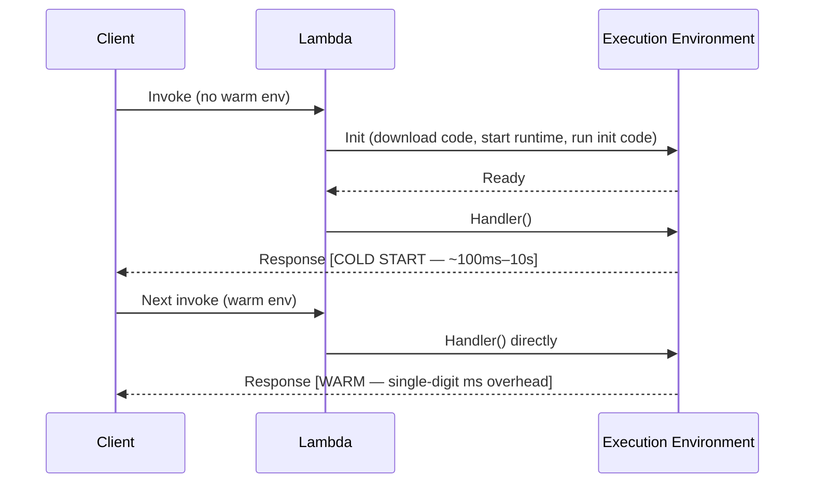
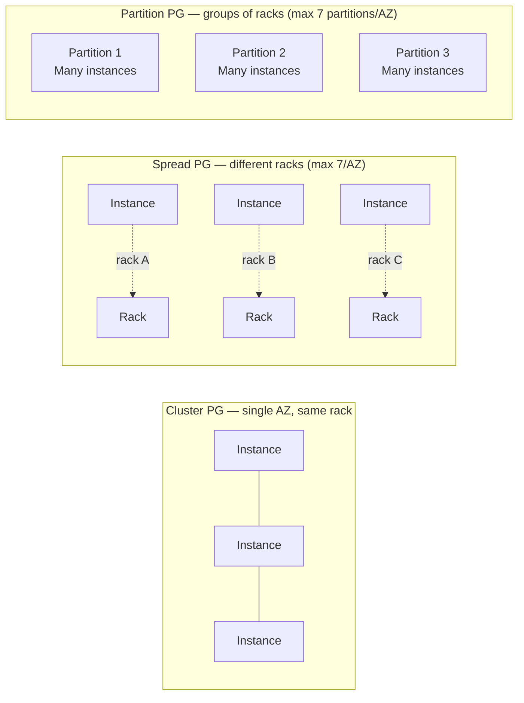
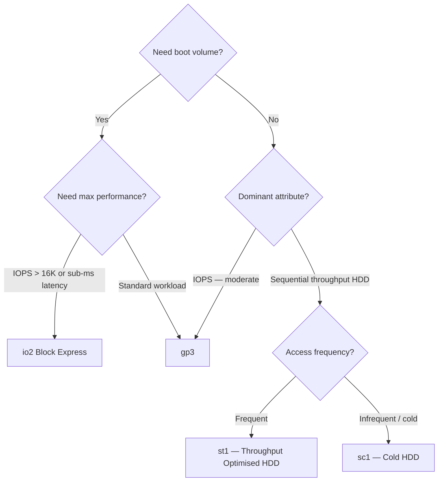
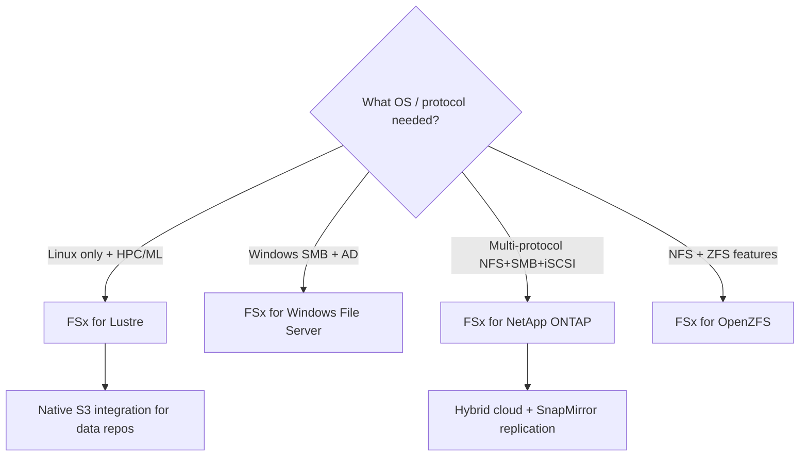
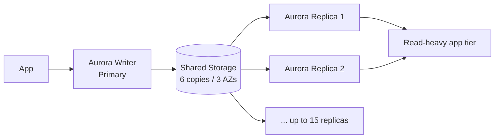
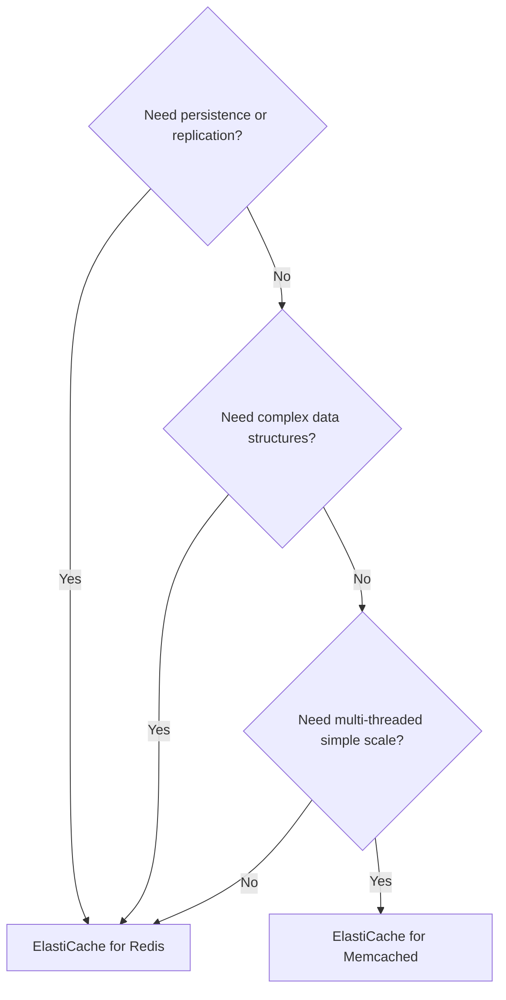
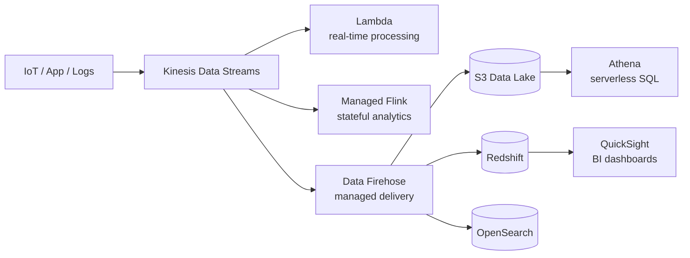
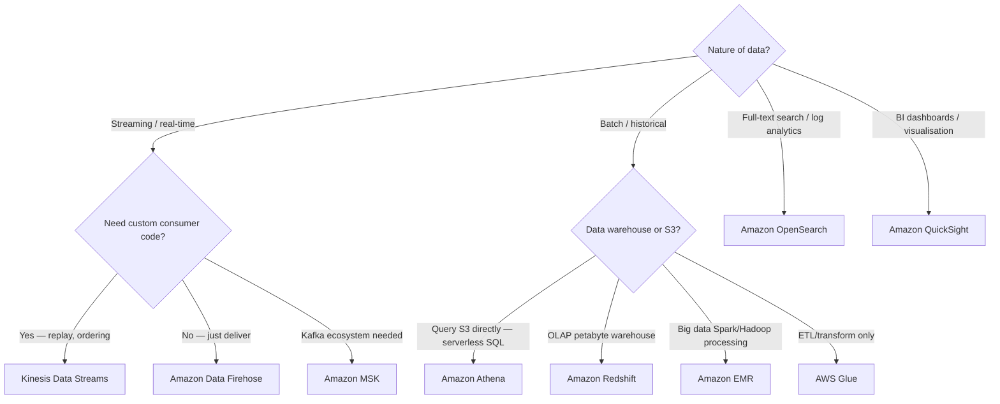

# Domain 3: Design High-Performing Architectures

> **Exam weight: 24% of SAA-C03 (approximately 15–16 questions)**
> Exam: 65 questions · 130 min · pass at 720/1000 · scenario-based

This domain asks you to select the right AWS service — and the right configuration of that service — to meet a performance target. Think in terms of: *compute sizing*, *storage IOPS vs throughput*, *database read scaling vs write scaling*, *cache placement*, *network path optimisation*, and *analytics pipeline design*.

> **Plain English:** The exam gives you a bottleneck (slow queries, high latency, big data backlog) and asks which AWS knob to turn. Master the *selection decision trees* in this page and you will recognise the right answer even in unfamiliar scenario wording.

---

## Table of Contents

1. [High-Performing Compute](#1-high-performing-compute)
   - EC2 Instance Families & Selection
   - AWS Lambda — Memory, Concurrency & Provisioned Concurrency
   - ECS / EKS / Fargate
   - Auto Scaling for Performance
   - Placement Groups
   - Elastic Fabric Adapter (EFA)
   - AWS Graviton
2. [High-Performing Storage](#2-high-performing-storage)
   - EBS Volume Types
   - Instance Store
   - Amazon EFS
   - Amazon FSx
   - S3 Performance Patterns
3. [High-Performing Databases](#3-high-performing-databases)
   - RDS & Aurora
   - DynamoDB
   - ElastiCache — Redis vs Memcached
   - RDS Proxy
4. [Caching & Edge Acceleration](#4-caching--edge-acceleration)
   - Amazon CloudFront
   - DynamoDB DAX
   - ElastiCache (as a cache layer)
   - AWS Global Accelerator
   - CloudFront vs Global Accelerator Decision
5. [High-Performing Networking](#5-high-performing-networking)
   - VPC Endpoints & PrivateLink
   - Transit Gateway
   - Enhanced Networking
   - Direct Connect vs Site-to-Site VPN
   - Route 53 Latency Routing
6. [Data & Analytics for Scale](#6-data--analytics-for-scale)
   - Kinesis Family
   - Amazon Athena
   - AWS Glue
   - Amazon EMR
   - Amazon Redshift
   - Amazon OpenSearch Service
   - Amazon MSK
   - Amazon QuickSight
7. [Glossary](#glossary)
8. [References](#references)

---

## 1. High-Performing Compute

### EC2 Instance Families & Selection

AWS offers [over 750 EC2 instance types](https://aws.amazon.com/ec2/instance-types/) grouped into families. Pick the family whose dominant resource matches the bottleneck:

| Family prefix | Optimised for | Typical SAA-C03 scenario |
|---|---|---|
| **M** (general purpose) | Balanced CPU/RAM | Web servers, app servers |
| **C** (compute) | High vCPU-to-RAM ratio | CPU-intensive batch, HPC, video encoding |
| **R** (memory) | High RAM-to-vCPU ratio | In-memory caches, SAP HANA, large DBs |
| **X** (extreme memory) | Highest RAM (up to 24 TiB) | SAP HANA, Apache Spark |
| **I** (storage) | High local NVMe IOPS | NoSQL, data warehousing with local storage |
| **D** (dense storage) | High local HDD capacity | MapReduce, HDFS |
| **G/P** (GPU) | Parallel floating-point | ML training, graphics rendering |
| **Inf** (Inferentia) | ML inference chips | Cost-effective model serving |
| **Trn** (Trainium) | ML training chips | Low-cost training |
| **HPC** (hpc7g, etc.) | MPI/HPC networking | Tightly coupled HPC jobs |

**Selection principle:** When the question mentions a *specific bottleneck* (slow CPU → C family; out-of-memory → R family; disk I/O → I family), match the family. When cost is the constraint alongside performance, consider Graviton variants (see below).

---

### AWS Lambda — Memory, Concurrency & Provisioned Concurrency

[Lambda concurrency](https://docs.aws.amazon.com/lambda/latest/dg/lambda-concurrency.html) = the number of in-flight requests handled simultaneously.

**Memory:** Lambda allocates CPU proportionally to memory. More memory → more vCPU → faster execution. Memory range: **128 MB – 10,240 MB** in 1 MB increments.

**Two concurrency controls ([AWS docs](https://docs.aws.amazon.com/lambda/latest/dg/provisioned-concurrency.html)):**

| Control | What it does | Cost |
|---|---|---|
| **Reserved concurrency** | Hard ceiling + guaranteed floor — no other function can steal this capacity; also prevents function from exceeding limit | No extra charge |
| **Provisioned concurrency** | Pre-initialised execution environments — eliminates cold starts, double-digit ms response | Additional charge per GB-hour |

**Cold start anatomy:**

**Provisioned concurrency** eliminates the Init phase — environments are pre-warmed. Use [Application Auto Scaling](https://docs.aws.amazon.com/lambda/latest/dg/provisioned-concurrency.html#managing-provisioned-concurency) to scale provisioned concurrency on a schedule or based on the `LambdaProvisionedConcurrencyUtilization` metric (target ~70%).

**Key rule:** Provisioned concurrency must point to a **version or alias** — NOT `$LATEST`.

---

### ECS / EKS / Fargate

| Service | Control plane | You manage | Best for |
|---|---|---|---|
| **ECS + EC2** | ECS | EC2 instances, scaling | Cost-optimised containers with predictable load |
| **ECS + Fargate** | ECS | Nothing (serverless) | Variable/spiky workloads; no cluster ops |
| **EKS + EC2** | Kubernetes | Nodes, add-ons | Kubernetes-native apps, complex scheduling |
| **EKS + Fargate** | Kubernetes | Nothing | K8s workloads without node management |

For *high performance*: ECS/EKS on EC2 lets you pick instance family (C for CPU, R for memory). Fargate abstracts this — specify vCPU and memory directly (0.25–16 vCPU; 0.5–120 GB RAM for ECS Fargate).

---

### Auto Scaling for Performance

[EC2 Auto Scaling](https://docs.aws.amazon.com/autoscaling/ec2/userguide/what-is-amazon-ec2-auto-scaling.html) maintains performance under variable load:

- **Target Tracking:** Keep a metric (CPU, ALB request count per target) at a target value — simplest; preferred for most scenarios.
- **Step Scaling:** Add/remove capacity in steps based on alarm breach magnitude.
- **Scheduled Scaling:** Pre-scale for known traffic events (e.g., flash sales).
- **Predictive Scaling:** ML-based forecast — scales proactively before load arrives.

**Warm pools** (EC2 Auto Scaling): pre-initialise instances in `Stopped` state so they join quickly without full boot delay.

---

### Placement Groups

[Placement groups](https://docs.aws.amazon.com/AWSEC2/latest/UserGuide/placement-groups.html) control physical placement of EC2 instances:

| Type | Benefit | Risk | Use case |
|---|---|---|---|
| **Cluster** | Ultra-low latency (10 Gbps+ between instances), high network throughput | All instances in one AZ/rack — correlated failure | HPC, big data jobs, tightly-coupled MPI |
| **Spread** | Maximum availability — each instance on isolated hardware | Max 7 instances per AZ | Critical distinct instances (e.g., primary DB + replica) |
| **Partition** | Large distributed apps with rack-level isolation, aware of which partition they are on | — | Hadoop, Cassandra, Kafka |

---

### Elastic Fabric Adapter (EFA)

[EFA](https://aws.amazon.com/hpc/efa/) is a network interface for EC2 that enables **OS-bypass** communication between instances using the libfabric API. Delivers HPC-class inter-node latency and bandwidth — required for tightly-coupled MPI workloads, ML training across multiple nodes.

EFA is **only used with Cluster placement groups** for maximum benefit. Supported on specific instance types (Hpc, P4, Trn1, etc.).

---

### AWS Graviton

[AWS Graviton](https://aws.amazon.com/ec2/graviton/) processors are ARM-based chips designed by AWS:

| Generation | Key benefit | Notable instance types |
|---|---|---|
| Graviton2 | Up to 40% better price-performance vs x86 | M6g, C6g, R6g, T4g |
| Graviton3 | ~25% better compute vs Graviton2 | C7g, M7g, R7g |
| Graviton3E | High-bandwidth for HPC | Hpc7g |
| Graviton4 | Latest gen | R8g, M8g, C8g |

Graviton also runs in **Fargate** and **Lambda** (arm64 architecture). Select arm64 in Lambda → up to 34% better price-performance for eligible workloads.

#### 🎯 On the exam — Compute

- **Lowest latency between EC2 instances + HPC MPI** → Cluster placement group + EFA
- **Critical small set of instances — hardware fault isolation** → Spread placement group
- **Large distributed app (Kafka, Hadoop) needing rack isolation** → Partition placement group
- **Lambda cold starts causing latency** → Provisioned concurrency (must target alias or version, not $LATEST)
- **Limit a Lambda from overwhelming downstream DB** → Reserved concurrency (acts as ceiling)
- **Best price-performance compute** → Graviton instance family or Lambda arm64
- **Serverless containers, no cluster management** → Fargate (ECS or EKS)

---

## 2. High-Performing Storage

### EBS Volume Types

Source: [Amazon EBS volume types — AWS docs](https://docs.aws.amazon.com/ebs/latest/userguide/ebs-volume-types.html)

#### SSD Volumes

| Attribute | gp3 | gp2 | io2 Block Express | io1 |
|---|---|---|---|---|
| **Type** | General Purpose SSD | General Purpose SSD | Provisioned IOPS SSD | Provisioned IOPS SSD |
| **Durability** | 99.8–99.9% | 99.8–99.9% | **99.999%** | 99.8–99.9% |
| **Volume size** | 1 GiB – 64 TiB | 1 GiB – 16 TiB | 4 GiB – 64 TiB | 4 GiB – 16 TiB |
| **Max IOPS** | **80,000** (Nitro) | 16,000 | **256,000** (Nitro) | 64,000 |
| **Max throughput** | **2,000 MiB/s** | 250 MiB/s | **4,000 MiB/s** | 1,000 MiB/s |
| **Baseline IOPS** | 3,000 (free, independent of size) | 3 IOPS/GiB | Provisioned separately | Provisioned separately |
| **Multi-attach** | No | No | Yes | Yes |
| **Boot volume** | Yes | Yes | Yes | Yes |
| **Latency** | Single-digit ms | Single-digit ms | < 500 µs average | Sub-ms |
| **Best for** | Most workloads, boot, dev/test | Older default workloads | Mission-critical DBs, SAP HANA | I/O-intensive DBs needing > 16K IOPS |

**gp3 vs gp2:** gp3 decouples IOPS from size — you can provision up to 16,000 IOPS and 1,000 MiB/s *independently* without adding storage. gp3 is almost always cheaper and better than gp2.

#### HDD Volumes

| Attribute | st1 (Throughput Optimised HDD) | sc1 (Cold HDD) |
|---|---|---|
| **Volume size** | 125 GiB – 16 TiB | 125 GiB – 16 TiB |
| **Max IOPS** | 500 (1 MiB I/O) | 250 (1 MiB I/O) |
| **Max throughput** | **500 MiB/s** | 250 MiB/s |
| **Burst throughput** | 250 MiB/s per TB | 80 MiB/s per TB |
| **Boot volume** | No | No |
| **Best for** | Big data, data warehouses, log processing (sequential reads) | Infrequently accessed cold data, lowest cost |

---

### Instance Store

[Instance store](https://docs.aws.amazon.com/AWSEC2/latest/UserGuide/InstanceStorage.html) provides **ephemeral** NVMe block storage physically attached to the host server.

- **Performance:** Extremely high IOPS and throughput (e.g., i4i.32xlarge: 4 million IOPS, 80 Gbps).
- **Persistence:** Data is **lost** when the instance stops, terminates, hibernates, or the hardware fails.
- **Use cases:** Temporary scratch data, buffer/cache, replicated data (e.g., Kafka brokers, Cassandra nodes — data is replicated to other nodes anyway).

---

### Amazon EFS

[Amazon EFS](https://docs.aws.amazon.com/efs/latest/ug/performance.html) is a managed, elastic NFS file system for Linux.

#### Performance Modes (set at creation, cannot change)

| Mode | Latency | Use case |
|---|---|---|
| **General Purpose** (default) | Lower | Web serving, CMS, development |
| **Max I/O** | Slightly higher | Highly parallel big data, media processing |

#### Throughput Modes

| Mode | How throughput is determined | Best for |
|---|---|---|
| **Elastic** (recommended default) | Automatically scales up/down with workload | Spiky or unpredictable workloads |
| **Provisioned** | You set a fixed MiB/s regardless of storage size | Workloads needing consistent throughput |
| **Bursting** (legacy) | Scales with storage size; earns burst credits | Low/moderate, size-dependent workloads |

EFS supports **Multi-AZ** access, SMB is **not** supported (that's FSx for Windows). EFS is billed per GB-month stored.

---

### Amazon FSx

[Amazon FSx](https://aws.amazon.com/fsx/) offers fully managed third-party file systems. Choose based on workload type:

| FSx Variant | Protocol | OS support | Max throughput | Key differentiator | SAA-C03 scenario |
|---|---|---|---|---|---|
| **FSx for Lustre** | Lustre (POSIX) | Linux only | **1,000+ GB/s** | HPC, ML training, integrates with S3 | HPC/ML with shared FS, integrate S3 data lake |
| **FSx for Windows File Server** | SMB | Windows (+ Linux via Samba) | Up to 12 GB/s | Windows ACLs, DFS, AD integration | Windows shared file share (CIFS/SMB) |
| **FSx for NetApp ONTAP** | NFS, SMB, iSCSI | Windows, Linux, macOS | Up to 80 GB/s | Multi-protocol, SnapMirror, tiering, instant clones | Lift-and-shift NetApp, multi-OS access, hybrid cloud |
| **FSx for OpenZFS** | NFS | Windows, Linux, macOS | Up to 12.5 GB/s | ZFS features (snapshots, clones), sub-ms latency | ZFS workloads, low-latency NFS |

---

### S3 Performance Patterns

[S3 performance best practices](https://docs.aws.amazon.com/AmazonS3/latest/userguide/optimizing-performance.html):

- **Baseline throughput:** S3 supports at least **3,500 PUT/COPY/POST/DELETE** and **5,500 GET/HEAD** requests per second **per prefix** per bucket.
- **Parallelise with prefixes:** Distribute objects across multiple prefixes to multiply request rates (4 prefixes → 22,000 GET/s).
- **Multipart upload:** Required for objects > 5 GB; recommended for > 100 MB. Parallelises upload of large objects.
- **Byte-range fetches:** Download a specific byte range with `Range` HTTP header — parallelise downloads, retry only failed parts.
- **S3 Transfer Acceleration:** Routes uploads through CloudFront edge locations via optimised AWS backbone — best for long-distance transfers (e.g., user in Asia uploading to bucket in US-EAST-1). [FAQ](https://aws.amazon.com/s3/transfer-acceleration/)
- **S3 Select / Glacier Select:** Push down SQL filtering to S3 — retrieve subset of data, reducing bandwidth and cost.

#### 🎯 On the exam — Storage

- **High IOPS at lowest cost** → **gp3** (3,000 IOPS free; provision more up to 16,000 independently)
- **Sustained max IOPS with highest durability / sub-ms latency** → **io2 Block Express** (256K IOPS, 99.999% durability)
- **Big sequential throughput, HPC shared FS, integrates with S3** → **FSx for Lustre**
- **Windows shared file share (CIFS/SMB) with AD** → **FSx for Windows File Server**
- **Multi-protocol (NFS+SMB), NetApp lift-and-shift, cross-region SnapMirror** → **FSx for NetApp ONTAP**
- **Scratch/temporary ultra-fast storage that can be lost** → **Instance store**
- **Shared POSIX file system for Linux EC2 / Lambda / ECS** → **EFS**
- **Long-distance S3 upload acceleration** → **S3 Transfer Acceleration**
- **Parallelise large object uploads** → **Multipart upload**
- **Cannot be boot volume** → st1, sc1

---

## 3. High-Performing Databases

### RDS & Aurora

#### RDS Read Replicas

[RDS read replicas](https://docs.aws.amazon.com/AmazonRDS/latest/UserGuide/USER_ReadRepl.html) offload read traffic from the primary:

- Up to **5 read replicas** per RDS instance (MySQL, MariaDB, PostgreSQL, Oracle, SQL Server).
- Replication is **asynchronous** — eventual consistency.
- Can be in a different AZ or different Region (cross-region read replicas).
- Can be promoted to standalone DB (disaster recovery use case).
- Each read replica has its own DNS endpoint — app must be read-replica-aware.

#### Amazon Aurora

[Aurora](https://docs.aws.amazon.com/AmazonRDS/latest/AuroraUserGuide/CHAP_AuroraOverview.html) is AWS's high-performance relational DB engine:

- **Shared storage architecture:** 6 copies of data across 3 AZs automatically. Up to **15 Aurora Replicas** (vs 5 for RDS).
- **Aurora Global Database:** Primary region + up to 5 secondary read-only regions. < 1 second replication lag. Failover in < 1 minute.
- **Aurora Serverless v2:** Automatically scales capacity from 0.5 to 128 Aurora Capacity Units (ACUs). Scales in fine-grained increments (0.5 ACU steps). Supports Multi-AZ, Global Database, RDS Proxy, IAM auth, Performance Insights. [AWS blog](https://aws.amazon.com/blogs/database/read-scalability-with-amazon-aurora-serverless-v2/)

---

### DynamoDB

[DynamoDB](https://docs.aws.amazon.com/amazondynamodb/latest/developerguide/Introduction.html) is a serverless key-value/document NoSQL database delivering single-digit millisecond performance at any scale.

#### Partition Key Design

[Best practices](https://docs.aws.amazon.com/amazondynamodb/latest/developerguide/bp-partition-key-design.html): Each partition supports **3,000 RCU/s** and **1,000 WCU/s**. A *hot partition* (one key getting all the traffic) causes throttling.

**Strategies to avoid hot partitions:**
- Choose high-cardinality attributes as partition key (e.g., `user_id`, `order_id`).
- **Write sharding:** Append a random suffix (1–N) to the key and scatter writes; scatter-gather reads.
- For time-series: include a date shard in the key.

#### GSI vs LSI

| Feature | **GSI** (Global Secondary Index) | **LSI** (Local Secondary Index) |
|---|---|---|
| Partition key | Different from base table | Same as base table |
| Sort key | Any attribute | Different attribute |
| Creation timing | Anytime | Only at table creation |
| Consistency | Eventually consistent only | Strongly or eventually consistent |
| Throughput | Own RCU/WCU provisioned separately | Shares table's throughput |
| Use case | Query on any non-key attribute | Query same partition key with different sort |

#### Capacity Modes

| Mode | How it works | Best for |
|---|---|---|
| **On-demand** | Pay per request; auto-scales instantly | Unpredictable/spiky traffic, new tables |
| **Provisioned** | Set RCU/WCU; use Auto Scaling to adjust | Predictable traffic; cost optimization |
| **Provisioned + Auto Scaling** | DynamoDB automatically adjusts provisioned capacity | Gradually changing predictable load |

#### DynamoDB DAX

[DAX](https://docs.aws.amazon.com/amazondynamodb/latest/developerguide/DAX.html) (DynamoDB Accelerator) is a fully managed, in-memory cache for DynamoDB:

- Delivers **microsecond** read latency (vs single-digit ms for DynamoDB directly).
- API-compatible — no application code changes beyond pointing to DAX endpoint.
- Write-through cache; supports strongly consistent reads from DynamoDB (bypasses cache).
- Best for: read-heavy workloads, repeated reads of same items, gaming leaderboards, session stores.

---

### ElastiCache — Redis vs Memcached

[ElastiCache](https://docs.aws.amazon.com/AmazonElastiCache/latest/red-ug/WhatIs.html) provides managed in-memory caching:

| Feature | **Redis** | **Memcached** |
|---|---|---|
| Data structures | Strings, lists, sets, sorted sets, hashes, streams, HyperLogLog, geospatial | Strings only |
| Persistence | Yes (RDB snapshots + AOF) | No |
| Replication | Yes (read replicas) | No |
| Multi-AZ / failover | Yes (automatic) | No |
| Pub/Sub messaging | Yes | No |
| Lua scripting | Yes | No |
| Clustering (horizontal scale) | Yes (Redis Cluster — up to 500 nodes) | Yes (multi-threaded, simpler sharding) |
| Encryption at rest/in-transit | Yes | Yes |
| Session store | Yes | Yes (simpler) |
| Leaderboards / sorted sets | Yes | No |
| **Choose when** | Need persistence, replication, complex data types, Pub/Sub, Geo queries | Need pure horizontal scale, simplest possible cache, multi-threaded performance |

---

### RDS Proxy

[RDS Proxy](https://docs.aws.amazon.com/AmazonRDS/latest/UserGuide/rds-proxy.html) is a fully managed database proxy that sits between the application and RDS/Aurora:

- **Problem it solves:** Serverless apps (Lambda) and microservices open many short-lived DB connections, overwhelming the DB connection pool. Each Lambda invocation creates a new connection.
- **How it helps:** Maintains a pool of long-lived connections to the DB and multiplexes thousands of application connections onto them.
- Supports RDS MySQL, PostgreSQL, MariaDB, and Aurora MySQL/PostgreSQL.
- IAM authentication and Secrets Manager integration.
- Automatic failover to standby replica in < 66 seconds (faster than without proxy).

#### 🎯 On the exam — Databases

- **Microsecond DynamoDB reads** → **DAX**
- **Sub-millisecond relational cache / leaderboards / Pub-Sub** → **ElastiCache for Redis**
- **Simple horizontal cache scale, no persistence needed** → **ElastiCache for Memcached**
- **Lambda functions overwhelming RDS with too many connections** → **RDS Proxy**
- **Global RDS with < 1s cross-region replication** → **Aurora Global Database**
- **Auto-scaling relational DB capacity without managing instances** → **Aurora Serverless v2**
- **DynamoDB throttling despite adequate table capacity** → hot partition — redesign partition key or use write sharding
- **Query DynamoDB on a non-key attribute** → **GSI**
- **Query same partition key with alternate sort key + strong consistency** → **LSI** (must be created at table creation)

---

## 4. Caching & Edge Acceleration

### Amazon CloudFront

[CloudFront](https://docs.aws.amazon.com/AmazonCloudFront/latest/DeveloperGuide/Introduction.html) is a CDN with 400+ Points of Presence (PoPs) globally:

- Caches **static content** (images, CSS, JS, video) at edge — reduces origin load.
- **Dynamic content acceleration:** Routes requests over AWS backbone even when content is not cached.
- **Lambda@Edge / CloudFront Functions:** Run code at edge for request/response manipulation.
- **Origin types:** S3, ALB, EC2, API Gateway, custom HTTP origins.
- Uses **HTTP/HTTPS** (Layer 7); supports WebSocket.
- Integrates with **WAF**, **Shield**, **ACM** (free SSL certs for CloudFront).
- **Cache invalidation:** API call to remove objects before TTL expires.

---

### DynamoDB DAX (as edge cache)

See [section 3](#dynamodb-dax) above. DAX sits *in-region* between application and DynamoDB — it is a *near-data* cache, not an edge/CDN cache.

---

### AWS Global Accelerator

[Global Accelerator](https://aws.amazon.com/global-accelerator/) improves availability and performance for **non-HTTP** and **HTTP** applications by routing traffic over the AWS global network:

- Provides **2 static Anycast IP addresses** — never change regardless of endpoint changes.
- Routes traffic to the nearest healthy regional endpoint (ALB, NLB, EC2, Elastic IP).
- Supports **TCP and UDP** — gaming, IoT, VoIP, and HTTP.
- **No caching** — proxies packets at the edge, unlike CloudFront.
- Fast failover (< 30 seconds) between regions.

---

### CloudFront vs Global Accelerator — Decision Table

| Dimension | CloudFront | Global Accelerator |
|---|---|---|
| **Caching** | Yes — caches at edge | No — proxies only |
| **Protocols** | HTTP/HTTPS, WebSocket | TCP, UDP (any protocol) |
| **Static IP** | No (DNS-based) | Yes — 2 static Anycast IPs |
| **Content type** | Static + dynamic content | Any application traffic |
| **Regional failover** | Via origin failover | Automatic < 30 s |
| **Use case** | Website/API acceleration, CDN, video streaming | Non-HTTP apps, games, static-IP requirement, latency-sensitive TCP/UDP |
| **DDoS protection** | AWS Shield Standard (free) | AWS Shield Standard (free) |

#### 🎯 On the exam — Caching & Edge

- **Static/dynamic content at edge, CDN** → **CloudFront**
- **Static IP + TCP/UDP acceleration + regional failover** → **Global Accelerator**
- **Microsecond DynamoDB reads** → **DAX**
- **Application-level caching (session state, DB query results)** → **ElastiCache**
- **CloudFront + dynamic content** → still CloudFront (it accelerates dynamic content too via AWS backbone)
- **Gaming UDP or IoT MQTT needing static IP** → **Global Accelerator** (not CloudFront)

---

## 5. High-Performing Networking

### VPC Endpoints & PrivateLink

[VPC Endpoints](https://docs.aws.amazon.com/vpc/latest/privatelink/vpc-endpoints.html) allow private connectivity from your VPC to AWS services without traversing the internet:

| Type | How | Services | Use case |
|---|---|---|---|
| **Gateway endpoint** | Route table entry | S3, DynamoDB only | Private S3/DynamoDB access at no cost |
| **Interface endpoint (PrivateLink)** | ENI in your subnet with private IP | 100s of AWS services + SaaS | Private access to any PrivateLink-enabled service |

**AWS PrivateLink** is also how SaaS vendors expose services to customers privately — service consumer creates an Interface endpoint; service provider registers a VPC Endpoint Service.

---

### Transit Gateway

[Transit Gateway (TGW)](https://docs.aws.amazon.com/vpc/latest/tgw/what-is-transit-gateway.html) is a regional network hub that connects VPCs and on-premises networks:

- Replaces complex full-mesh VPC peering (N×(N-1)/2 peering connections → 1 TGW).
- Supports thousands of VPC attachments.
- **TGW Network Manager** for global network monitoring.
- **Inter-region peering:** Connect TGWs across regions over AWS backbone.
- Supports VPN and Direct Connect Gateway attachments.

---

### Enhanced Networking

[Enhanced networking](https://docs.aws.amazon.com/AWSEC2/latest/UserGuide/enhanced-networking.html) delivers higher bandwidth, higher PPS (packets per second), lower latency:

- **ENA (Elastic Network Adapter):** Up to **100 Gbps** on supported instances. Default on Nitro instances.
- **EFA (Elastic Fabric Adapter):** Built on ENA + OS-bypass for HPC/ML (see section 1).
- **SR-IOV:** Underlying technology in both.

---

### Direct Connect vs Site-to-Site VPN

| Dimension | AWS Direct Connect | AWS Site-to-Site VPN |
|---|---|---|
| **Connectivity** | Dedicated private circuit (1/10/100 Gbps) | IPsec tunnel over public internet |
| **Latency** | Consistent, low | Variable (internet-dependent) |
| **Bandwidth** | Dedicated; predictable | Up to 1.25 Gbps per tunnel |
| **Setup time** | Weeks to months | Minutes to hours |
| **Cost** | Higher (port hours + data transfer) | Lower |
| **Encryption** | Not encrypted by default (add MACsec or VPN over DX) | Encrypted (IPsec) |
| **Resilience** | Use two DX connections or DX + VPN backup | Multiple tunnels per connection |
| **Use case** | Large data transfers, consistent performance, compliance | Quick/temporary connectivity, DR backup for DX |

**Accelerated Site-to-Site VPN:** Uses Global Accelerator to route VPN traffic over AWS backbone — improves performance of VPN while keeping IPsec encryption.

---

### Route 53 Latency Routing

[Route 53 latency routing](https://docs.aws.amazon.com/Route53/latest/DeveloperGuide/routing-policy-latency.html) routes DNS queries to the region that provides the lowest latency for the end user:

- AWS measures latency from user's region to each configured region and routes to the best.
- Use with **health checks** for automatic failover.
- Combine with **CloudFront** for active-active multi-region architecture.

**Other Route 53 routing policies for performance:**
- **Geolocation:** Route based on user's geographic location (compliance or language-specific content).
- **Geoproximity:** Route based on distance, with bias adjustments.
- **Weighted:** Traffic splitting for blue/green or canary deployments.

#### 🎯 On the exam — Networking

- **Private access to S3/DynamoDB without NAT or IGW** → **Gateway VPC Endpoint** (free)
- **Private access to other AWS services or SaaS** → **Interface VPC Endpoint (PrivateLink)**
- **Connect many VPCs and on-premises, avoid mesh peering** → **Transit Gateway**
- **Consistent, high-bandwidth on-premises to AWS** → **Direct Connect**
- **Quick/temporary or backup connectivity** → **Site-to-Site VPN**
- **HPC inter-node communication** → **EFA + Cluster placement group**
- **Route users to lowest-latency region** → **Route 53 latency routing**
- **Static IP for on-premises with hardcoded IPs connecting to AWS** → **Global Accelerator**

---

## 6. Data & Analytics for Scale

### Kinesis Family

[Amazon Kinesis](https://aws.amazon.com/kinesis/) is the AWS streaming data platform:

| Service | What it does | Retention | Consumers | When to use |
|---|---|---|---|---|
| **Kinesis Data Streams (KDS)** | Real-time ingestion & processing | 24 h default (up to 365 days) | Custom (Lambda, KCL apps, Flink) | When you need custom processing, replay, ordering per shard |
| **Amazon Data Firehose** | Managed delivery pipeline (no code) | None (near real-time, 60s min) | S3, Redshift, OpenSearch, Splunk, HTTP | When you want managed load into a destination with no consumer code |
| **Amazon Managed Service for Apache Flink** | Stateful stream processing with Apache Flink | Reads from KDS or MSK | Output to KDS, Firehose, S3, RDS | When you need complex event processing, aggregations, windowing |

**KDS throughput:** 1 MB/s or 1,000 records/s per shard (write); 2 MB/s per shard (read). Add shards to scale.

---

### Amazon Athena

[Athena](https://docs.aws.amazon.com/athena/latest/ug/what-is.html) is a **serverless interactive query service** using standard SQL to analyse data directly in S3:

- Pay per query (per TB of data scanned).
- Supports Parquet, ORC, JSON, CSV, Avro — columnar formats (Parquet/ORC) dramatically reduce cost and improve speed.
- Integrates with **AWS Glue Data Catalog** for schema metadata.
- No infrastructure to manage.
- **Federated queries:** Query data in RDS, DynamoDB, Redshift, on-premises via connectors.

---

### AWS Glue

[AWS Glue](https://docs.aws.amazon.com/glue/latest/dg/what-is-glue.html) is a serverless ETL (Extract, Transform, Load) service:

- **Glue Data Catalog:** Central metadata repository (schema, tables) — used by Athena, EMR, Redshift Spectrum.
- **Glue Crawlers:** Automatically scan data sources and populate the Data Catalog.
- **Glue ETL Jobs:** Spark-based transformations (Python/Scala) run serverlessly.
- **Glue DataBrew:** Visual data preparation (no-code).
- Use when you need to transform/prepare data before loading into a data warehouse or data lake.

---

### Amazon EMR

[Amazon EMR](https://docs.aws.amazon.com/emr/latest/ManagementGuide/emr-what-is-emr.html) is a managed big data platform running **Apache Spark, Hadoop, Hive, Presto, HBase, Flink** on EC2 or EKS or Serverless:

- Best for large-scale batch processing, ML feature engineering, log analysis.
- Supports Spot instances for significant cost savings on transient workloads.
- **EMR Serverless:** No cluster management — run Spark/Hive jobs without provisioning.
- Choose EMR over Glue when you need full control of Spark configuration, complex multi-step pipelines, or frameworks beyond Spark (e.g., HBase).

---

### Amazon Redshift

[Redshift](https://docs.aws.amazon.com/redshift/latest/gsg/new-user.html) is a petabyte-scale **columnar OLAP** data warehouse:

- Massively parallel processing (MPP) — distributes queries across nodes.
- **Redshift Serverless:** Auto-scales compute capacity; pay per second of usage.
- **Redshift Spectrum:** Query data directly in S3 without loading into Redshift (uses Glue Data Catalog).
- **RA3 nodes:** Separate compute and managed storage (in S3) — scale each independently.
- **AQUA (Advanced Query Accelerator):** Distributed hardware-accelerated cache.
- Use for: structured BI queries, dashboards, complex joins across large tables — **not** for real-time or operational workloads.

---

### Amazon OpenSearch Service

[Amazon OpenSearch Service](https://docs.aws.amazon.com/opensearch-service/latest/developerguide/what-is.html) (successor to Elasticsearch Service) provides managed search and analytics:

- Supports full-text search, log analytics, real-time application monitoring.
- Ingestion: Kinesis Data Streams → OpenSearch Ingestion pipeline → OpenSearch.
- **OpenSearch Dashboards** (formerly Kibana) for visualisation.
- Use for: search over application data, log analytics (e.g., ELK stack), real-time monitoring.

---

### Amazon MSK

[Amazon Managed Streaming for Apache Kafka (MSK)](https://docs.aws.amazon.com/msk/latest/developerguide/what-is-msk.html) is a fully managed Apache Kafka service:

- Choose MSK over Kinesis when: you need Apache Kafka specifically (existing Kafka ecosystem, Kafka Connect, Kafka Streams, MirrorMaker).
- **MSK Serverless:** Auto-scales storage and throughput.
- Higher operational ceiling than Kinesis for very high throughput Kafka workloads.

---

### Amazon QuickSight

[Amazon QuickSight](https://docs.aws.amazon.com/quicksight/latest/user/welcome.html) is a cloud-native BI and visualisation service:

- **SPICE** (Super-fast Parallel In-memory Calculation Engine): In-memory caching of datasets for fast dashboards.
- ML insights: anomaly detection, forecasting built-in.
- Connect to Redshift, RDS, Athena, S3, OpenSearch, on-premises sources.
- Per-session pricing for readers — no server to manage.

---

### Analytics Service Decision Tree

| Service | When to choose | NOT for |
|---|---|---|
| **Kinesis Data Streams** | Real-time custom processing, replay, ordering | Managed delivery without code |
| **Data Firehose** | Managed streaming delivery to S3/Redshift/OpenSearch | Complex transformations, sub-60s latency |
| **Managed Flink** | Stateful stream analytics, windowing, aggregation | Simple delivery |
| **MSK** | Existing Kafka workloads, Kafka ecosystem | Greenfield if Kinesis suffices |
| **Athena** | Ad-hoc serverless SQL over S3 | OLAP with complex joins at scale (use Redshift) |
| **Glue** | ETL, data catalogue, crawlers | Query engine |
| **EMR** | Large-scale Spark/Hadoop, full framework control | Simple ETL (use Glue) |
| **Redshift** | Structured OLAP warehouse, complex BI queries | Operational OLTP, real-time |
| **OpenSearch** | Full-text search, log analytics, real-time monitoring | OLAP analytics |
| **QuickSight** | BI dashboards, visualisations | Data processing |

#### 🎯 On the exam — Analytics

- **Real-time streaming ingestion with custom processing / replay** → **Kinesis Data Streams**
- **Streaming data delivery to S3/Redshift/OpenSearch — no code** → **Amazon Data Firehose**
- **Serverless SQL over data in S3** → **Amazon Athena** (pair with Glue Data Catalog)
- **Petabyte data warehouse for BI** → **Amazon Redshift**
- **Apache Kafka managed service** → **Amazon MSK**
- **Full-text search / Kibana dashboards** → **Amazon OpenSearch Service**
- **BI dashboards, ML insights** → **Amazon QuickSight**
- **Need to transform data before loading to warehouse** → **AWS Glue ETL**
- **Large-scale Spark/Hadoop with full control** → **Amazon EMR**

---

## Glossary

| Term | Simple explanation | Purpose |
|---|---|---|
| **IOPS** | I/O operations per second | Measures how fast a disk can handle random read/write operations |
| **Throughput** | Data transferred per second (MiB/s or GB/s) | Measures how fast sequential data can be read/written |
| **Provisioned concurrency** | Pre-warmed Lambda environments | Eliminates Lambda cold starts for latency-sensitive apps |
| **Reserved concurrency** | Hard limit on Lambda simultaneous executions | Guarantees capacity; prevents function from overwhelming downstream |
| **Cluster placement group** | EC2 instances co-located in same rack/AZ | Ultra-low latency inter-instance networking for HPC |
| **Spread placement group** | Each EC2 on separate hardware | Maximum fault isolation for small critical sets |
| **Partition placement group** | Groups of instances on different rack sets | Rack-level isolation for large distributed apps |
| **EFA** | OS-bypass network adapter for EC2 | HPC/ML inter-node communication at near-wire-speed |
| **Graviton** | AWS ARM-based processor | Up to 40% better price-performance vs x86 |
| **gp3** | General Purpose SSD v3 | Default EBS choice; decoupled IOPS/throughput from size |
| **io2 Block Express** | Highest-performance EBS SSD | 256K IOPS, 4K MiB/s, 99.999% durability for critical DBs |
| **st1** | Throughput Optimised HDD | Sequential big-data workloads (log, warehouse, MapReduce) |
| **sc1** | Cold HDD | Lowest-cost infrequently accessed cold data |
| **Instance store** | Ephemeral NVMe local to EC2 host | Highest IOPS/throughput; data lost on stop/terminate |
| **EFS** | Elastic File System (NFS) | Shared POSIX file system for Linux; scales automatically |
| **FSx for Lustre** | Managed Lustre parallel file system | HPC, ML training — integrates with S3; Linux only |
| **FSx for Windows** | Managed Windows SMB file share | Windows shared drives with AD integration |
| **FSx for NetApp ONTAP** | Managed ONTAP with NFS/SMB/iSCSI | Multi-protocol, hybrid cloud, SnapMirror replication |
| **S3 Transfer Acceleration** | S3 upload via CloudFront edge locations | Accelerates long-distance S3 uploads |
| **DAX** | DynamoDB Accelerator | Microsecond in-memory cache for DynamoDB |
| **GSI** | Global Secondary Index (DynamoDB) | Query on any non-primary-key attribute; any time |
| **LSI** | Local Secondary Index (DynamoDB) | Alternate sort key on same partition; created at table creation only |
| **RDS Proxy** | Connection pooler for RDS/Aurora | Manages thousands of short-lived Lambda/microservice connections |
| **Aurora Serverless v2** | Auto-scaling Aurora capacity | Scales in 0.5 ACU steps; no idle capacity waste |
| **ElastiCache Redis** | Managed Redis | Complex data types, persistence, replication, Pub/Sub |
| **ElastiCache Memcached** | Managed Memcached | Simple, horizontally scaled, multi-threaded cache |
| **CloudFront** | AWS CDN (400+ PoPs) | Static/dynamic content caching and acceleration at edge |
| **Global Accelerator** | Anycast TCP/UDP accelerator | Static IPs, non-HTTP acceleration, fast regional failover |
| **VPC Gateway Endpoint** | Free private route to S3/DynamoDB | Avoid internet for S3/DynamoDB access |
| **PrivateLink / Interface Endpoint** | Private ENI to AWS/SaaS service | Private connectivity to any PrivateLink-enabled service |
| **Transit Gateway** | Regional hub connecting VPCs and on-prem | Replaces complex mesh peering |
| **Direct Connect** | Dedicated private circuit to AWS | Consistent, high-bandwidth, low-latency on-prem connectivity |
| **Kinesis Data Streams** | Real-time streaming ingestion | Custom consumer processing with ordering and replay |
| **Data Firehose** | Managed streaming delivery | No-code streaming load to S3/Redshift/OpenSearch |
| **Managed Flink** | Apache Flink on AWS | Stateful stream analytics with windowing |
| **MSK** | Managed Apache Kafka | Kafka ecosystem compatibility |
| **Athena** | Serverless SQL over S3 | Ad-hoc queries on S3 data — pay per TB scanned |
| **Glue** | Serverless ETL + data catalogue | Transform data; maintain schema metadata |
| **EMR** | Managed Spark/Hadoop | Large-scale batch data processing |
| **Redshift** | Columnar OLAP data warehouse | Petabyte BI analytics |
| **OpenSearch** | Managed search + log analytics | Full-text search, Kibana dashboards |
| **QuickSight** | Cloud-native BI + dashboards | Visualisations, ML insights, SPICE in-memory caching |

---

## References

- [SAA-C03 Exam Guide — Domain 3: Design High-Performing Architectures](https://docs.aws.amazon.com/aws-certification/latest/examguides/solutions-architect-associate-03-domain3.html)
- [Amazon EBS Volume Types](https://docs.aws.amazon.com/ebs/latest/userguide/ebs-volume-types.html)
- [Amazon EBS General Purpose SSD (gp3) volumes](https://docs.aws.amazon.com/ebs/latest/userguide/general-purpose.html)
- [AWS Lambda Provisioned Concurrency](https://docs.aws.amazon.com/lambda/latest/dg/provisioned-concurrency.html)
- [Lambda Concurrency — Reserved and Provisioned](https://docs.aws.amazon.com/lambda/latest/dg/lambda-concurrency.html)
- [EC2 Placement Groups](https://docs.aws.amazon.com/AWSEC2/latest/UserGuide/placement-groups.html)
- [Elastic Fabric Adapter (EFA)](https://aws.amazon.com/hpc/efa/)
- [AWS Graviton Processors](https://aws.amazon.com/ec2/graviton/)
- [Amazon FSx — When to Choose FSx](https://aws.amazon.com/fsx/when-to-choose-fsx/)
- [Amazon EFS Performance](https://docs.aws.amazon.com/efs/latest/ug/performance.html)
- [S3 Performance Optimisation](https://docs.aws.amazon.com/AmazonS3/latest/userguide/optimizing-performance.html)
- [S3 Transfer Acceleration](https://aws.amazon.com/s3/transfer-acceleration/)
- [DynamoDB Partition Key Best Practices](https://docs.aws.amazon.com/amazondynamodb/latest/developerguide/bp-partition-key-design.html)
- [DynamoDB DAX](https://docs.aws.amazon.com/amazondynamodb/latest/developerguide/DAX.html)
- [Aurora Serverless v2 — Read Scalability](https://aws.amazon.com/blogs/database/read-scalability-with-amazon-aurora-serverless-v2/)
- [Amazon ElastiCache for Redis](https://docs.aws.amazon.com/AmazonElastiCache/latest/red-ug/WhatIs.html)
- [RDS Proxy](https://docs.aws.amazon.com/AmazonRDS/latest/UserGuide/rds-proxy.html)
- [Amazon CloudFront Developer Guide](https://docs.aws.amazon.com/AmazonCloudFront/latest/DeveloperGuide/Introduction.html)
- [AWS Global Accelerator FAQs](https://aws.amazon.com/global-accelerator/faqs/)
- [CloudFront vs Global Accelerator — Well-Architecting Online Applications](https://aws.amazon.com/blogs/networking-and-content-delivery/well-architecting-online-applications-with-cloudfront-and-aws-global-accelerator/)
- [VPC Endpoints and AWS PrivateLink](https://docs.aws.amazon.com/vpc/latest/privatelink/vpc-endpoints.html)
- [AWS Transit Gateway](https://docs.aws.amazon.com/vpc/latest/tgw/what-is-transit-gateway.html)
- [Route 53 Latency Routing](https://docs.aws.amazon.com/Route53/latest/DeveloperGuide/routing-policy-latency.html)
- [Choosing an AWS Analytics Service](https://docs.aws.amazon.com/decision-guides/latest/analytics-on-aws-how-to-choose/analytics-on-aws-how-to-choose.html)
- [Build Modern Data Streaming Architectures on AWS](https://docs.aws.amazon.com/whitepapers/latest/build-modern-data-streaming-analytics-architectures/streaming-analytics-architecture-patterns-using-a-modern-data-architecture.html)
- [Amazon Kinesis Data Streams](https://docs.aws.amazon.com/streams/latest/dev/introduction.html)
- [Amazon Data Firehose FAQs](https://aws.amazon.com/firehose/faqs/)
- [Amazon Athena](https://docs.aws.amazon.com/athena/latest/ug/what-is.html)
- [AWS Glue](https://docs.aws.amazon.com/glue/latest/dg/what-is-glue.html)
- [Amazon EMR](https://docs.aws.amazon.com/emr/latest/ManagementGuide/emr-what-is-emr.html)
- [Amazon Redshift](https://docs.aws.amazon.com/redshift/latest/gsg/new-user.html)
- [Amazon OpenSearch Service](https://docs.aws.amazon.com/opensearch-service/latest/developerguide/what-is.html)
- [Amazon MSK](https://docs.aws.amazon.com/msk/latest/developerguide/what-is-msk.html)
- [Amazon QuickSight](https://docs.aws.amazon.com/quicksight/latest/user/welcome.html)

---

*Part of the [AWS Solutions Architect Associate course](README.md) · SAA-C03.*
