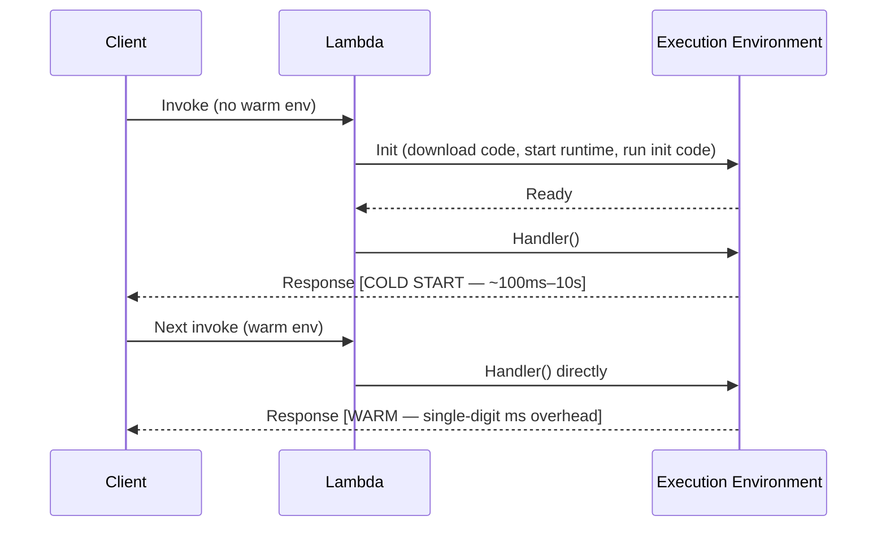
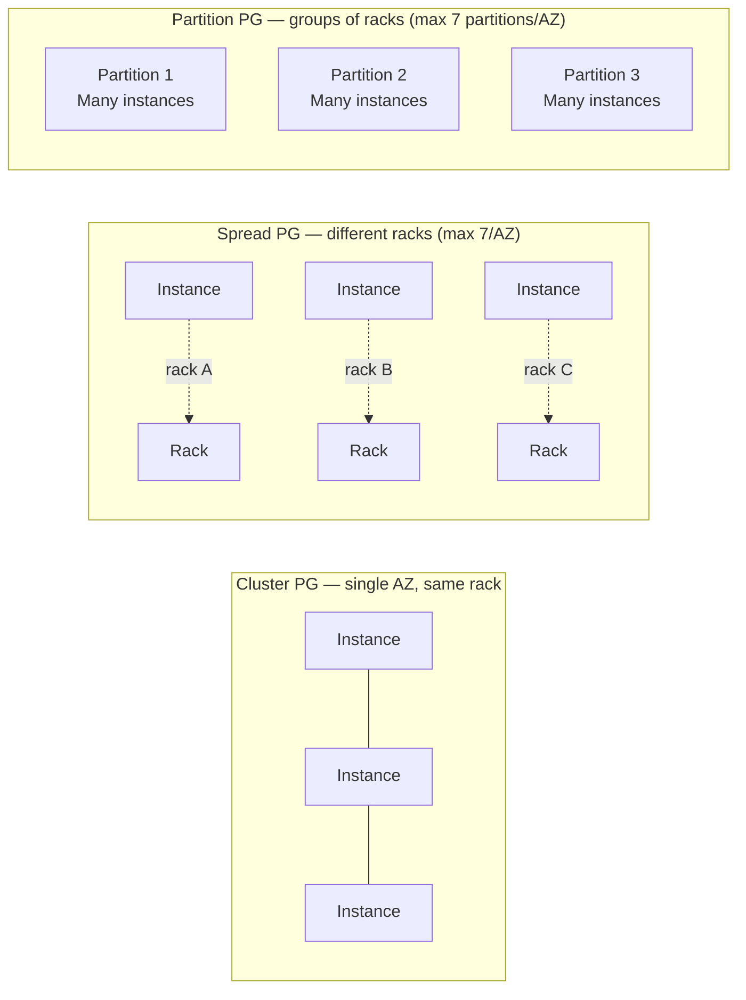
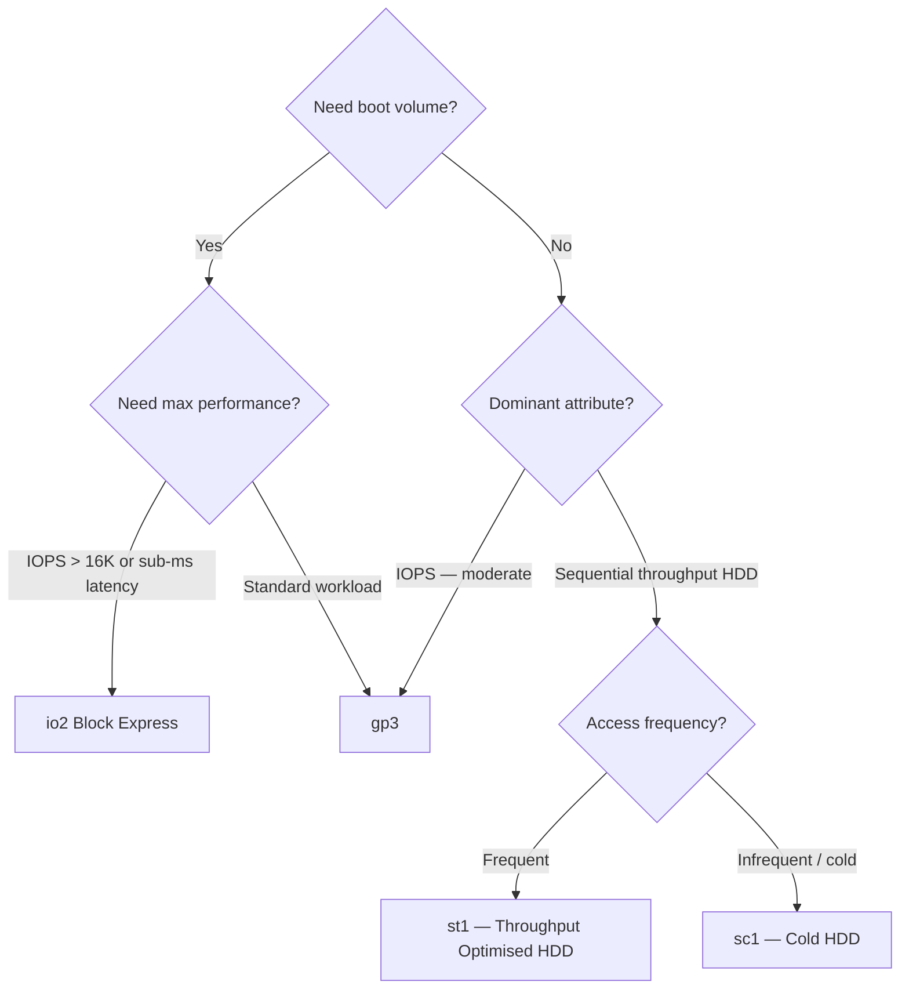
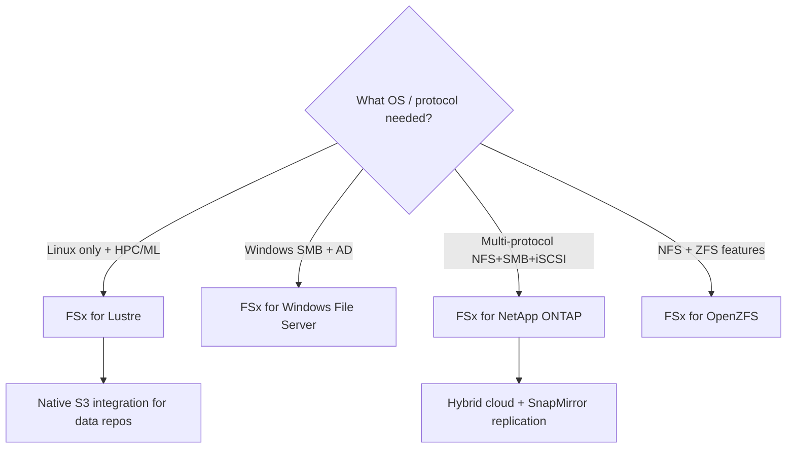
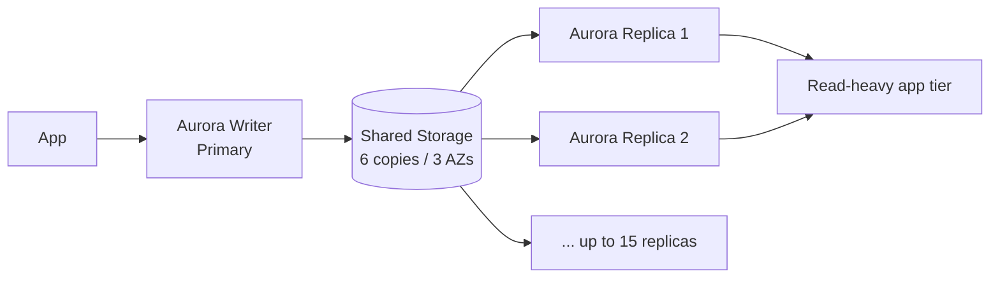
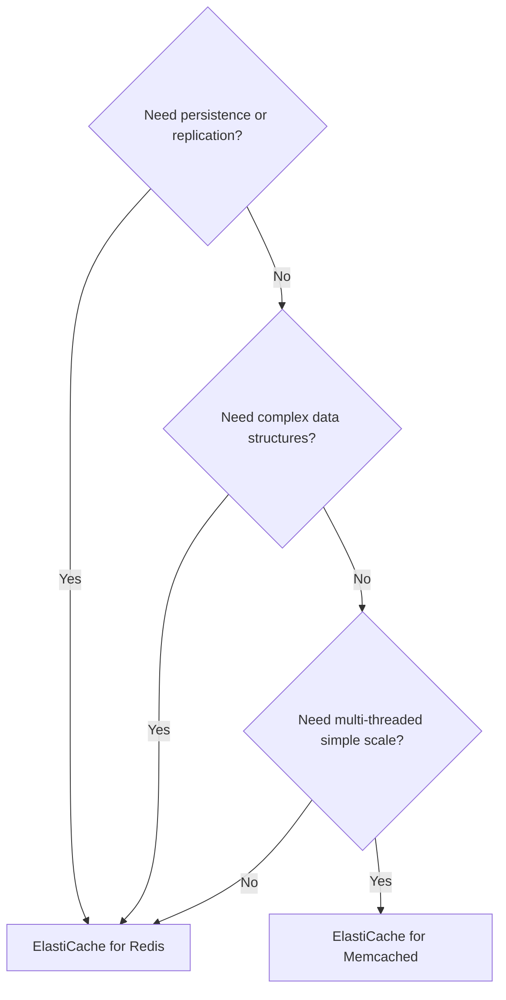
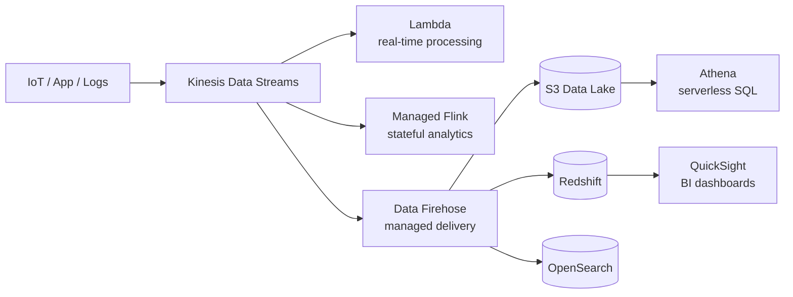
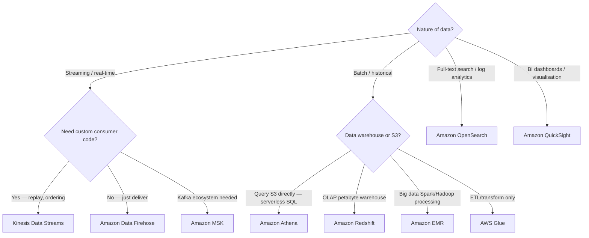

# Domain 3: Design High-Performing Architectures

> **Exam weight: 24% of SAA-C03 (approximately 15–16 questions)**
> Exam: 65 questions · 130 min · pass at 720/1000 · scenario-based

This domain asks you to select the right AWS service — and the right configuration of that service — to meet a performance target. Think in terms of: *compute sizing*, *storage IOPS vs throughput*, *database read scaling vs write scaling*, *cache placement*, *network path optimisation*, and *analytics pipeline design*.

> **Plain English:** The exam gives you a bottleneck (slow queries, high latency, big data backlog) and asks which AWS knob to turn. Master the *selection decision trees* in this page and you will recognise the right answer even in unfamiliar scenario wording.

---

## Table of Contents

1. [High-Performing Compute](#1-high-performing-compute)
   - EC2 Instance Families & Selection
   - AWS Lambda — Memory, Concurrency & Provisioned Concurrency
   - ECS / EKS / Fargate
   - Auto Scaling for Performance
   - Placement Groups
   - Elastic Fabric Adapter (EFA)
   - AWS Graviton
2. [High-Performing Storage](#2-high-performing-storage)
   - EBS Volume Types
   - Instance Store
   - Amazon EFS
   - Amazon FSx
   - S3 Performance Patterns
3. [High-Performing Databases](#3-high-performing-databases)
   - RDS & Aurora
   - DynamoDB
   - ElastiCache — Redis vs Memcached
   - RDS Proxy
4. [Caching & Edge Acceleration](#4-caching--edge-acceleration)
   - Amazon CloudFront
   - DynamoDB DAX
   - ElastiCache (as a cache layer)
   - AWS Global Accelerator
   - CloudFront vs Global Accelerator Decision
5. [High-Performing Networking](#5-high-performing-networking)
   - VPC Endpoints & PrivateLink
   - Transit Gateway
   - Enhanced Networking
   - Direct Connect vs Site-to-Site VPN
   - Route 53 Latency Routing
6. [Data & Analytics for Scale](#6-data--analytics-for-scale)
   - Kinesis Family
   - Amazon Athena
   - AWS Glue
   - Amazon EMR
   - Amazon Redshift
   - Amazon OpenSearch Service
   - Amazon MSK
   - Amazon QuickSight
7. [Glossary](#glossary)
8. [References](#references)

---

## 1. High-Performing Compute

### EC2 Instance Families & Selection

AWS offers [over 750 EC2 instance types](https://aws.amazon.com/ec2/instance-types/) grouped into families. Pick the family whose dominant resource matches the bottleneck:

| Family prefix | Optimised for | Typical SAA-C03 scenario |
|---|---|---|
| **M** (general purpose) | Balanced CPU/RAM | Web servers, app servers |
| **C** (compute) | High vCPU-to-RAM ratio | CPU-intensive batch, HPC, video encoding |
| **R** (memory) | High RAM-to-vCPU ratio | In-memory caches, SAP HANA, large DBs |
| **X** (extreme memory) | Highest RAM (up to 24 TiB) | SAP HANA, Apache Spark |
| **I** (storage) | High local NVMe IOPS | NoSQL, data warehousing with local storage |
| **D** (dense storage) | High local HDD capacity | MapReduce, HDFS |
| **G/P** (GPU) | Parallel floating-point | ML training, graphics rendering |
| **Inf** (Inferentia) | ML inference chips | Cost-effective model serving |
| **Trn** (Trainium) | ML training chips | Low-cost training |
| **HPC** (hpc7g, etc.) | MPI/HPC networking | Tightly coupled HPC jobs |

**Selection principle:** When the question mentions a *specific bottleneck* (slow CPU → C family; out-of-memory → R family; disk I/O → I family), match the family. When cost is the constraint alongside performance, consider Graviton variants (see below).

> **Why (the rationale):** EC2 instance families let you match the dominant hardware resource to the dominant workload bottleneck — avoiding over-provisioning while hitting performance targets.
> **When to use:** Exam scenario names a constraint: "CPU-bound encoding" → C family; "memory-intensive in-memory DB" → R/X family; "high random I/O NoSQL" → I family; "GPU ML training" → P/G family; "ML inference at scale" → Inf family.
> **Nuances & gotchas:** Inf (Inferentia) is inference-only, not training; Trn (Trainium) is training-only. GPU instances (P/G) are very expensive — use only when parallelism can exploit CUDA/GPU cores. HPC (hpc7g) requires EFA and Cluster placement group to realise benefit. D-family uses magnetic HDD (high capacity/low IOPS), not NVMe — don't confuse with I-family's NVMe.

---

### AWS Lambda — Memory, Concurrency & Provisioned Concurrency

[Lambda concurrency](https://docs.aws.amazon.com/lambda/latest/dg/lambda-concurrency.html) = the number of in-flight requests handled simultaneously.

**Memory:** Lambda allocates CPU proportionally to memory. More memory → more vCPU → faster execution. Memory range: **128 MB – 10,240 MB** in 1 MB increments.

**Two concurrency controls ([AWS docs](https://docs.aws.amazon.com/lambda/latest/dg/provisioned-concurrency.html)):**

| Control | What it does | Cost |
|---|---|---|
| **Reserved concurrency** | Hard ceiling + guaranteed floor — no other function can steal this capacity; also prevents function from exceeding limit | No extra charge |
| **Provisioned concurrency** | Pre-initialised execution environments — eliminates cold starts, double-digit ms response | Additional charge per GB-hour |

**Cold start anatomy:**

**Provisioned concurrency** eliminates the Init phase — environments are pre-warmed. Use [Application Auto Scaling](https://docs.aws.amazon.com/lambda/latest/dg/provisioned-concurrency.html#managing-provisioned-concurency) to scale provisioned concurrency on a schedule or based on the `LambdaProvisionedConcurrencyUtilization` metric (target ~70%).

**Key rule:** Provisioned concurrency must point to a **version or alias** — NOT `$LATEST`.

> **Why (the rationale):** Lambda cold starts add 100 ms–10 s of latency at first invocation; provisioned concurrency pre-warms environments to eliminate this. Reserved concurrency acts as a hard cap to protect downstream systems from being overwhelmed.
> **When to use:** Provisioned concurrency → latency-sensitive APIs, real-time applications where cold start is unacceptable. Reserved concurrency → throttle a Lambda to protect a downstream DB or third-party API; guarantee minimum capacity for a critical function.
> **Nuances & gotchas:** Provisioned concurrency costs extra (per GB-hour of provisioned environments) even if unused — size it carefully. Reserved concurrency of 0 effectively disables a function entirely. Provisioned concurrency does NOT apply to `$LATEST` — it requires a published version or an alias. Scaling provisioned concurrency via Application Auto Scaling targets `LambdaProvisionedConcurrencyUtilization`; recommended target ~70%. Memory controls CPU allocation — doubling memory can halve execution time, often reducing net cost.

---

### ECS / EKS / Fargate

| Service | Control plane | You manage | Best for |
|---|---|---|---|
| **ECS + EC2** | ECS | EC2 instances, scaling | Cost-optimised containers with predictable load |
| **ECS + Fargate** | ECS | Nothing (serverless) | Variable/spiky workloads; no cluster ops |
| **EKS + EC2** | Kubernetes | Nodes, add-ons | Kubernetes-native apps, complex scheduling |
| **EKS + Fargate** | Kubernetes | Nothing | K8s workloads without node management |

For *high performance*: ECS/EKS on EC2 lets you pick instance family (C for CPU, R for memory). Fargate abstracts this — specify vCPU and memory directly (0.25–16 vCPU; 0.5–120 GB RAM for ECS Fargate).

> **Why (the rationale):** ECS simplifies container orchestration without Kubernetes complexity; EKS is for Kubernetes-native workloads. Fargate removes all node/cluster management overhead — the trade-off is less control over instance type and slightly higher per-unit cost.
> **When to use:** ECS + Fargate → spiky/variable container workloads, teams that want serverless containers. ECS + EC2 → predictable load needing cost optimisation (can use Spot). EKS → existing Kubernetes manifests, Helm charts, or complex scheduling requirements. EKS + Fargate → K8s workloads without any node management.
> **Nuances & gotchas:** Fargate does NOT support GPU instances or Windows containers on EKS Fargate. ECS on EC2 requires you to manage instance scaling separately from task scaling. EKS control plane costs ~$0.10/hr regardless of node count. ECS and EKS are different control planes — you cannot mix tasks/pods between them. Fargate uses ephemeral storage (20 GB default, up to 200 GB); there is no persistent local disk — use EFS for shared persistent storage.

---

### Auto Scaling for Performance

[EC2 Auto Scaling](https://docs.aws.amazon.com/autoscaling/ec2/userguide/what-is-amazon-ec2-auto-scaling.html) maintains performance under variable load:

- **Target Tracking:** Keep a metric (CPU, ALB request count per target) at a target value — simplest; preferred for most scenarios.
- **Step Scaling:** Add/remove capacity in steps based on alarm breach magnitude.
- **Scheduled Scaling:** Pre-scale for known traffic events (e.g., flash sales).
- **Predictive Scaling:** ML-based forecast — scales proactively before load arrives.

**Warm pools** (EC2 Auto Scaling): pre-initialise instances in `Stopped` state so they join quickly without full boot delay.

> **Why (the rationale):** Auto Scaling maintains performance under unpredictable load without paying for always-on capacity; each policy type trades off responsiveness, simplicity, and cost differently.
> **When to use:** Target Tracking → most scenarios (simplest, self-adjusting). Step Scaling → when you need different scaling magnitudes per alarm threshold. Scheduled Scaling → known traffic patterns (daily peaks, flash sales). Predictive Scaling → recurring cyclical load where pre-scaling before the burst matters.
> **Nuances & gotchas:** Target Tracking cannot scale to zero — minimum capacity is 1 unless combined with scheduled scaling. Predictive Scaling requires at least 24 hours of historical CloudWatch data to generate a forecast. Warm pools reduce instance launch latency but incur cost for stopped instances. Auto Scaling does NOT automatically replace unhealthy instances unless you enable health check replacement.

---

### Placement Groups

[Placement groups](https://docs.aws.amazon.com/AWSEC2/latest/UserGuide/placement-groups.html) control physical placement of EC2 instances:

| Type | Benefit | Risk | Use case |
|---|---|---|---|
| **Cluster** | Ultra-low latency (10 Gbps+ between instances), high network throughput | All instances in one AZ/rack — correlated failure | HPC, big data jobs, tightly-coupled MPI |
| **Spread** | Maximum availability — each instance on isolated hardware | Max 7 instances per AZ | Critical distinct instances (e.g., primary DB + replica) |
| **Partition** | Large distributed apps with rack-level isolation, aware of which partition they are on | — | Hadoop, Cassandra, Kafka |

> **Why — Cluster placement group:** Collocates instances on the same rack/AZ for the lowest possible inter-instance latency and highest bandwidth — needed for tightly coupled HPC/MPI jobs where inter-node communication dominates runtime.
> **When to use:** HPC MPI workloads, big-data jobs requiring high aggregate network throughput between nodes, ML training across multiple GPU instances.
> **Nuances & gotchas:** Cluster PG is in a single AZ — if the AZ or rack has a failure, all instances are affected (correlated failure risk). Adding instances later may fail with "insufficient capacity" if the rack is full — launch all instances at once. Not suitable for HA workloads. Must use Enhanced Networking (ENA/EFA) to realise full bandwidth.

> **Why — Spread placement group:** Places each instance on distinct underlying hardware (separate racks), maximising fault isolation for a small set of critical instances.
> **When to use:** Small number of critical instances that must not fail together — e.g., primary DB + standby, ZooKeeper quorum, primary + secondary application nodes.
> **Nuances & gotchas:** Hard limit of **7 instances per AZ** per spread PG — not suitable for large fleets. Spread PG can span multiple AZs (up to 7 per AZ in each AZ). Not for large distributed apps — use Partition PG instead.

> **Why — Partition placement group:** Groups instances into logical partitions where each partition is on a separate set of racks, providing rack-level isolation across a large fleet.
> **When to use:** Large distributed/replicated workloads — Hadoop HDFS, Apache Cassandra, Apache Kafka — where you want topology awareness (instances can query which partition they are in) and rack-level isolation without the 7-instance limit.
> **Nuances & gotchas:** Up to **7 partitions per AZ**; each partition can hold many instances (no per-partition instance limit). Instances within the same partition still share physical racks — a rack failure affects a partition, not the whole cluster. Not the same as Spread (which guarantees each instance on its own rack).

---

### Elastic Fabric Adapter (EFA)

[EFA](https://aws.amazon.com/hpc/efa/) is a network interface for EC2 that enables **OS-bypass** communication between instances using the libfabric API. Delivers HPC-class inter-node latency and bandwidth — required for tightly-coupled MPI workloads, ML training across multiple nodes.

EFA is **only used with Cluster placement groups** for maximum benefit. Supported on specific instance types (Hpc, P4, Trn1, etc.).

> **Why (the rationale):** Standard TCP/IP adds OS-level overhead for every packet; EFA's OS-bypass delivers near-wire-speed latency for MPI all-reduce and ML collective operations that would otherwise be bottlenecked by the OS network stack.
> **When to use:** Tightly coupled HPC MPI workloads (fluid dynamics, molecular dynamics, seismic analysis), large-scale ML training with collective communications (NCCL, MPI) across multiple GPU/Trn1 nodes.
> **Nuances & gotchas:** EFA is a Linux-only feature — not supported on Windows. Works only within a single VPC/AZ (used with Cluster PG). EFA does NOT improve single-instance network performance — only inter-instance performance in HPC scenarios. ENA (standard enhanced networking) is still used for all other network traffic on the same instance alongside EFA.

---

### AWS Graviton

[AWS Graviton](https://aws.amazon.com/ec2/graviton/) processors are ARM-based chips designed by AWS:

| Generation | Key benefit | Notable instance types |
|---|---|---|
| Graviton2 | Up to 40% better price-performance vs x86 | M6g, C6g, R6g, T4g |
| Graviton3 | ~25% better compute vs Graviton2 | C7g, M7g, R7g |
| Graviton3E | High-bandwidth for HPC | Hpc7g |
| Graviton4 | Latest gen | R8g, M8g, C8g |

Graviton also runs in **Fargate** and **Lambda** (arm64 architecture). Select arm64 in Lambda → up to 34% better price-performance for eligible workloads.

> **Why (the rationale):** Graviton ARM processors deliver better price-performance than equivalent x86 instances by AWS's own silicon design, without vendor licensing costs — ideal when you need performance at lower spend.
> **When to use:** Any Linux-compatible workload that can be compiled for arm64 — web servers, APIs, containers, Java/Python/Node.js apps. Lambda arm64 is a simple toggle for 20–34% cost savings on compute-bound functions.
> **Nuances & gotchas:** Graviton is ARM64 — binaries compiled for x86 will NOT run without recompilation or emulation. Windows workloads cannot use Graviton (Windows on ARM EC2 is not supported on AWS). Managed services like RDS, ElastiCache, OpenSearch also offer Graviton instances — same selection logic applies. Not suitable for workloads with x86-only dependencies (specific ISA intrinsics, 32-bit executables).

#### 🎯 On the exam — Compute

- **Lowest latency between EC2 instances + HPC MPI** → Cluster placement group + EFA
- **Critical small set of instances — hardware fault isolation** → Spread placement group
- **Large distributed app (Kafka, Hadoop) needing rack isolation** → Partition placement group
- **Lambda cold starts causing latency** → Provisioned concurrency (must target alias or version, not $LATEST)
- **Limit a Lambda from overwhelming downstream DB** → Reserved concurrency (acts as ceiling)
- **Best price-performance compute** → Graviton instance family or Lambda arm64
- **Serverless containers, no cluster management** → Fargate (ECS or EKS)

---

## 2. High-Performing Storage

### EBS Volume Types

Source: [Amazon EBS volume types — AWS docs](https://docs.aws.amazon.com/ebs/latest/userguide/ebs-volume-types.html)

#### SSD Volumes

| Attribute | gp3 | gp2 | io2 Block Express | io1 |
|---|---|---|---|---|
| **Type** | General Purpose SSD | General Purpose SSD | Provisioned IOPS SSD | Provisioned IOPS SSD |
| **Durability** | 99.8–99.9% | 99.8–99.9% | **99.999%** | 99.8–99.9% |
| **Volume size** | 1 GiB – 64 TiB | 1 GiB – 16 TiB | 4 GiB – 64 TiB | 4 GiB – 16 TiB |
| **Max IOPS** | **80,000** (Nitro) | 16,000 | **256,000** (Nitro) | 64,000 |
| **Max throughput** | **2,000 MiB/s** | 250 MiB/s | **4,000 MiB/s** | 1,000 MiB/s |
| **Baseline IOPS** | 3,000 (free, independent of size) | 3 IOPS/GiB | Provisioned separately | Provisioned separately |
| **Multi-attach** | No | No | Yes | Yes |
| **Boot volume** | Yes | Yes | Yes | Yes |
| **Latency** | Single-digit ms | Single-digit ms | < 500 µs average | Sub-ms |
| **Best for** | Most workloads, boot, dev/test | Older default workloads | Mission-critical DBs, SAP HANA | I/O-intensive DBs needing > 16K IOPS |

**gp3 vs gp2:** gp3 decouples IOPS from size — you can provision up to 16,000 IOPS and 1,000 MiB/s *independently* without adding storage. gp3 is almost always cheaper and better than gp2.

> **Why — gp3:** Replaces gp2 as the default general-purpose SSD. Decouples IOPS and throughput from volume size, giving you control without paying for unnecessary storage.
> **When to use:** Default choice for boot volumes, development workloads, general databases, and any workload not requiring > 16,000 IOPS or sub-millisecond latency.
> **Nuances & gotchas:** gp2 ties IOPS to size (3 IOPS/GiB, max 16,000 IOPS at 5.3+ TiB); gp3 gives 3,000 IOPS free regardless of size. gp3 baseline throughput is 125 MiB/s free; provisioning higher throughput (up to 1,000 MiB/s) costs extra. gp3 does NOT support Multi-Attach (io1/io2 do). Max 80,000 IOPS only on Nitro-based instances.

> **Why — io2 Block Express:** The only EBS volume type offering sub-millisecond average latency, up to 256,000 IOPS, 4,000 MiB/s throughput, and 99.999% durability — for mission-critical databases.
> **When to use:** SAP HANA, Oracle, SQL Server with > 64,000 IOPS needs, or any workload requiring 99.999% volume durability and sub-ms consistent latency.
> **Nuances & gotchas:** io2 Block Express is only available on Nitro instances. io2 (non-Block Express) has the same 64,000 IOPS cap as io1. Multi-Attach (attach same io2 to up to 16 Nitro instances) requires a cluster-aware file system — NOT a standard file system. io2 Block Express requires compatible instance type; not all io2-supported instances support Block Express.

> **Why — st1 (Throughput Optimised HDD):** Delivers high sequential throughput at much lower cost than SSDs — ideal for workloads that read/write large blocks sequentially, not random I/O.
> **When to use:** Big data processing (Hadoop), data warehousing input data, log processing, streaming ingest to disk — any workload whose bottleneck is sequential MB/s, not IOPS.
> **Nuances & gotchas:** st1 and sc1 CANNOT be boot volumes. st1 is optimised for throughput, not IOPS — random I/O workloads will see poor performance. Burst throughput of 250 MiB/s per TB (max 500 MiB/s) is credit-based; sustained workloads may not sustain burst. sc1 is cheaper but max 250 MiB/s — use only for cold, infrequently accessed archival data.

#### HDD Volumes

| Attribute | st1 (Throughput Optimised HDD) | sc1 (Cold HDD) |
|---|---|---|
| **Volume size** | 125 GiB – 16 TiB | 125 GiB – 16 TiB |
| **Max IOPS** | 500 (1 MiB I/O) | 250 (1 MiB I/O) |
| **Max throughput** | **500 MiB/s** | 250 MiB/s |
| **Burst throughput** | 250 MiB/s per TB | 80 MiB/s per TB |
| **Boot volume** | No | No |
| **Best for** | Big data, data warehouses, log processing (sequential reads) | Infrequently accessed cold data, lowest cost |

---

### Instance Store

[Instance store](https://docs.aws.amazon.com/AWSEC2/latest/UserGuide/InstanceStorage.html) provides **ephemeral** NVMe block storage physically attached to the host server.

- **Performance:** Extremely high IOPS and throughput (e.g., i4i.32xlarge: 4 million IOPS, 80 Gbps).
- **Persistence:** Data is **lost** when the instance stops, terminates, hibernates, or the hardware fails.
- **Use cases:** Temporary scratch data, buffer/cache, replicated data (e.g., Kafka brokers, Cassandra nodes — data is replicated to other nodes anyway).

> **Why (the rationale):** Instance store is physically attached to the host server — no network hop — delivering the highest possible IOPS and throughput of any EC2 storage option at no additional cost (included in instance price).
> **When to use:** Scratch space for HPC jobs, temporary buffers, shuffle storage for Spark/Hadoop, or replicated distributed databases (Kafka, Cassandra) where application-level replication makes storage loss tolerable.
> **Nuances & gotchas:** Instance store is ephemeral — data is permanently lost on instance stop, termination, hibernation, or host hardware failure. You CANNOT detach and reattach instance store volumes (unlike EBS). Cannot be snapshotted to S3. Not suitable as a primary data store for anything that must survive a reboot/stop. Instance store size and type are fixed by the instance type — you cannot resize independently.

---

### Amazon EFS

[Amazon EFS](https://docs.aws.amazon.com/efs/latest/ug/performance.html) is a managed, elastic NFS file system for Linux.

#### Performance Modes (set at creation, cannot change)

| Mode | Latency | Use case |
|---|---|---|
| **General Purpose** (default) | Lower | Web serving, CMS, development |
| **Max I/O** | Slightly higher | Highly parallel big data, media processing |

#### Throughput Modes

| Mode | How throughput is determined | Best for |
|---|---|---|
| **Elastic** (recommended default) | Automatically scales up/down with workload | Spiky or unpredictable workloads |
| **Provisioned** | You set a fixed MiB/s regardless of storage size | Workloads needing consistent throughput |
| **Bursting** (legacy) | Scales with storage size; earns burst credits | Low/moderate, size-dependent workloads |

EFS supports **Multi-AZ** access, SMB is **not** supported (that's FSx for Windows). EFS is billed per GB-month stored.

> **Why (the rationale):** EFS provides a fully managed, elastic shared file system accessible from multiple EC2 instances, containers, and Lambda simultaneously — removing the need to pre-provision or manage storage capacity.
> **When to use:** Shared POSIX file system for Linux workloads — CMS web farms, container shared volumes (ECS/EKS), Lambda accessing shared files, home directories, code repositories accessed by multiple compute nodes.
> **Nuances & gotchas:** EFS is NFS (Linux only) — Windows workloads need FSx for Windows (SMB). Performance mode is set at creation and CANNOT be changed later. Max I/O mode has slightly higher latency than General Purpose — use only for highly parallel workloads with 10s to 100s of nodes. Elastic throughput mode (recommended) automatically bursts; Provisioned throughput costs extra regardless of usage. EFS One Zone stores data in a single AZ — cheaper but no Multi-AZ redundancy. EFS is billed per GB stored (no pre-provisioning) — can be more expensive than EBS for large fixed datasets.

---

### Amazon FSx

[Amazon FSx](https://aws.amazon.com/fsx/) offers fully managed third-party file systems. Choose based on workload type:

| FSx Variant | Protocol | OS support | Max throughput | Key differentiator | SAA-C03 scenario |
|---|---|---|---|---|---|
| **FSx for Lustre** | Lustre (POSIX) | Linux only | **1,000+ GB/s** | HPC, ML training, integrates with S3 | HPC/ML with shared FS, integrate S3 data lake |
| **FSx for Windows File Server** | SMB | Windows (+ Linux via Samba) | Up to 12 GB/s | Windows ACLs, DFS, AD integration | Windows shared file share (CIFS/SMB) |
| **FSx for NetApp ONTAP** | NFS, SMB, iSCSI | Windows, Linux, macOS | Up to 80 GB/s | Multi-protocol, SnapMirror, tiering, instant clones | Lift-and-shift NetApp, multi-OS access, hybrid cloud |
| **FSx for OpenZFS** | NFS | Windows, Linux, macOS | Up to 12.5 GB/s | ZFS features (snapshots, clones), sub-ms latency | ZFS workloads, low-latency NFS |

> **Why — FSx for Lustre:** Lustre is the de facto parallel file system for HPC and ML — it can deliver over 1 TB/s aggregate throughput by striping data across multiple OSTs, and it integrates natively with S3 as a data repository.
> **When to use:** HPC simulations, ML training where many GPU/CPU nodes need simultaneous high-throughput access to a shared dataset; scenarios where you want to import from / export to an S3 data lake.
> **Nuances & gotchas:** Linux-only (Lustre client). Two deployment types: Scratch (no replication, cheaper, temporary) vs Persistent (replicates within AZ, for long-running workloads). S3 integration is lazy — data is loaded on first access (lazy loading) unless you explicitly import it. FSx for Lustre does NOT span AZs — it's a single-AZ service.

> **Why — FSx for Windows File Server:** Provides fully managed Windows SMB shares with native Active Directory, DFS Namespaces, and Windows ACL support — the only AWS managed option for Windows CIFS/SMB.
> **When to use:** Windows workloads needing shared drives (\\server\share), lift-and-shift of on-premises Windows file servers, any workload requiring SMB protocol, AD integration, or DFS.
> **Nuances & gotchas:** EFS does NOT support SMB/Windows — you must use FSx for Windows for Windows file shares. FSx for Windows can also be accessed from Linux using Samba. Supports Multi-AZ for HA. Not suitable for Linux HPC workloads — use FSx for Lustre.

> **Why — FSx for NetApp ONTAP:** The only FSx variant supporting NFS + SMB + iSCSI simultaneously, with enterprise ONTAP features (SnapMirror, instant clones, tiering to S3) — ideal for multi-OS environments and hybrid cloud.
> **When to use:** Lift-and-shift of existing NetApp ONTAP arrays, workloads needing simultaneous NFS + SMB access (mixed Windows/Linux), cross-region replication via SnapMirror, or storage tiering from SSD to S3.
> **Nuances & gotchas:** Most feature-rich and typically most expensive FSx option. iSCSI support means it can also serve as block storage to on-premises servers. SnapMirror provides cross-region DR replication — unique among FSx variants. Instant clones (FlexClone) create space-efficient writable copies instantly — useful for dev/test.

> **Why — FSx for OpenZFS:** Provides sub-millisecond NFS latency with ZFS features (snapshots, data compression, instant clones) — best for workloads needing very low NFS latency with copy-on-write semantics.
> **When to use:** Lift-and-shift of ZFS workloads (OpenZFS on Linux, Solaris ZFS), dev/test environments needing instant clones, applications requiring NFS with consistent sub-ms latency.
> **Nuances & gotchas:** NFS only (no SMB, no iSCSI). Single-AZ deployment — not Multi-AZ. Instant clones (ZFS clones) are space-efficient but clone and parent share blocks — deleting parent requires clone promotion. Lower max throughput ceiling than FSx for Lustre — not suitable for HPC at scale.

---

### S3 Performance Patterns

[S3 performance best practices](https://docs.aws.amazon.com/AmazonS3/latest/userguide/optimizing-performance.html):

- **Baseline throughput:** S3 supports at least **3,500 PUT/COPY/POST/DELETE** and **5,500 GET/HEAD** requests per second **per prefix** per bucket.
- **Parallelise with prefixes:** Distribute objects across multiple prefixes to multiply request rates (4 prefixes → 22,000 GET/s).
- **Multipart upload:** Required for objects > 5 GB; recommended for > 100 MB. Parallelises upload of large objects.
- **Byte-range fetches:** Download a specific byte range with `Range` HTTP header — parallelise downloads, retry only failed parts.
- **S3 Transfer Acceleration:** Routes uploads through CloudFront edge locations via optimised AWS backbone — best for long-distance transfers (e.g., user in Asia uploading to bucket in US-EAST-1). [FAQ](https://aws.amazon.com/s3/transfer-acceleration/)
- **S3 Select / Glacier Select:** Push down SQL filtering to S3 — retrieve subset of data, reducing bandwidth and cost.

> **Why — Multipart upload:** Uploading a large object as a single stream is slow and must restart from scratch on failure. Multipart splits the object into parts uploaded in parallel, then assembled server-side — faster and more resilient.
> **When to use:** Required for objects > 5 GB; AWS recommends using it for objects > 100 MB. Use it for any large file upload (video, database dumps, ML model artifacts).
> **Nuances & gotchas:** If a multipart upload is never completed, incomplete parts accumulate in S3 and are billed — set an S3 Lifecycle rule to abort incomplete multipart uploads after N days. Maximum part size: 5 GB; minimum (except last part): 5 MB; max 10,000 parts per object.

> **Why — S3 Transfer Acceleration:** Routes uploads through the nearest CloudFront edge location and then over the AWS private backbone to the destination region — dramatically improving long-distance upload speed.
> **When to use:** Users in distant geographies uploading to a single-region S3 bucket (e.g., APAC users uploading to us-east-1). Only beneficial for cross-region/long-distance transfers.
> **Nuances & gotchas:** Transfer Acceleration costs extra per GB transferred (on top of standard S3 transfer pricing) — it does NOT help for same-region or short-distance transfers, and AWS even provides a speed comparison tool to check before enabling. Transfer Acceleration does NOT cache content — it is upload acceleration only (not a CDN). Uses a different endpoint URL (`bucketname.s3-accelerate.amazonaws.com`).

> **Why — Byte-range fetches:** Downloading a large object in parallel byte-range requests dramatically increases throughput and allows retry of only failed ranges, similar to how download managers work.
> **When to use:** Downloading large S3 objects (video files, large datasets) where maximising download throughput or partial retrieval of object headers/metadata is needed.
> **Nuances & gotchas:** S3 returns partial content (HTTP 206 Partial Content) — application must reassemble ranges. Also useful to fetch just the first N bytes of an object (e.g., read file headers) without downloading the entire object. Does not require any S3 configuration — it's a standard HTTP Range header feature.

#### 🎯 On the exam — Storage

- **High IOPS at lowest cost** → **gp3** (3,000 IOPS free; provision more up to 16,000 independently)
- **Sustained max IOPS with highest durability / sub-ms latency** → **io2 Block Express** (256K IOPS, 99.999% durability)
- **Big sequential throughput, HPC shared FS, integrates with S3** → **FSx for Lustre**
- **Windows shared file share (CIFS/SMB) with AD** → **FSx for Windows File Server**
- **Multi-protocol (NFS+SMB), NetApp lift-and-shift, cross-region SnapMirror** → **FSx for NetApp ONTAP**
- **Scratch/temporary ultra-fast storage that can be lost** → **Instance store**
- **Shared POSIX file system for Linux EC2 / Lambda / ECS** → **EFS**
- **Long-distance S3 upload acceleration** → **S3 Transfer Acceleration**
- **Parallelise large object uploads** → **Multipart upload**
- **Cannot be boot volume** → st1, sc1

---

## 3. High-Performing Databases

### RDS & Aurora

#### RDS Read Replicas

[RDS read replicas](https://docs.aws.amazon.com/AmazonRDS/latest/UserGuide/USER_ReadRepl.html) offload read traffic from the primary:

- Up to **5 read replicas** per RDS instance (MySQL, MariaDB, PostgreSQL, Oracle, SQL Server).
- Replication is **asynchronous** — eventual consistency.
- Can be in a different AZ or different Region (cross-region read replicas).
- Can be promoted to standalone DB (disaster recovery use case).
- Each read replica has its own DNS endpoint — app must be read-replica-aware.

> **Why (the rationale):** RDS read replicas offload read traffic from the primary instance, scaling read throughput horizontally without scaling the primary (which handles writes).
> **When to use:** Read-heavy workloads (reporting, analytics queries, read-intensive APIs) where the primary is CPU or I/O saturated by reads. Cross-region replicas serve both read scaling and DR purposes.
> **Nuances & gotchas:** Replication is asynchronous — replicas may lag behind the primary (eventual consistency). A read replica promoted to standalone loses its replica relationship — you cannot re-attach it. Each replica has its own endpoint — the application must direct reads to replica endpoints; RDS does NOT automatically load-balance reads (unlike Aurora). Cross-region read replicas incur data transfer costs. Read replicas do NOT provide automatic failover — for HA failover use Multi-AZ (which is a standby, not a read replica).

#### Amazon Aurora

[Aurora](https://docs.aws.amazon.com/AmazonRDS/latest/AuroraUserGuide/CHAP_AuroraOverview.html) is AWS's high-performance relational DB engine:

- **Shared storage architecture:** 6 copies of data across 3 AZs automatically. Up to **15 Aurora Replicas** (vs 5 for RDS).
- **Aurora Global Database:** Primary region + up to 5 secondary read-only regions. < 1 second replication lag. Failover in < 1 minute.
- **Aurora Serverless v2:** Automatically scales capacity from 0.5 to 128 Aurora Capacity Units (ACUs). Scales in fine-grained increments (0.5 ACU steps). Supports Multi-AZ, Global Database, RDS Proxy, IAM auth, Performance Insights. [AWS blog](https://aws.amazon.com/blogs/database/read-scalability-with-amazon-aurora-serverless-v2/)

> **Why — Aurora vs RDS:** Aurora uses a shared distributed storage layer (6 copies across 3 AZs) that eliminates storage replication lag, supports up to 15 read replicas (vs 5 for RDS), and provides sub-10ms replica lag — making it substantially faster at scale.
> **When to use Aurora:** MySQL/PostgreSQL-compatible workloads that need more than 5 read replicas, global low-latency replication (Aurora Global Database), or want storage to auto-scale without managing disk size.
> **Nuances & gotchas:** Aurora reader endpoint load-balances reads across all replicas automatically — unlike standard RDS. Aurora Global Database secondary regions are read-only; promotion to writer takes < 1 minute for planned failover. Aurora does NOT support Oracle or SQL Server — use RDS for those. Aurora storage auto-scales in 10 GiB increments up to 128 TiB — you never set storage size manually.

> **Why — Aurora Serverless v2:** Eliminates the need to manage or pre-size database instances — capacity scales in 0.5 ACU steps within seconds, paying only for what's consumed.
> **When to use:** Variable/unpredictable relational workloads, development/test environments, multi-tenant SaaS with per-tenant spikes, or any scenario where provisioning a fixed instance would waste money at low load.
> **Nuances & gotchas:** Aurora Serverless v2 does NOT scale to zero (minimum 0.5 ACU) — use Aurora Serverless v1 if you need scale-to-zero (but v1 has longer cold start and fewer feature support). v2 supports Multi-AZ, Global Database, RDS Proxy — v1 does not. ACU scaling can take a few seconds — during a sudden burst, a brief performance dip may occur before scaling completes. Billed per ACU-hour consumed.

---

### DynamoDB

[DynamoDB](https://docs.aws.amazon.com/amazondynamodb/latest/developerguide/Introduction.html) is a serverless key-value/document NoSQL database delivering single-digit millisecond performance at any scale.

#### Partition Key Design

[Best practices](https://docs.aws.amazon.com/amazondynamodb/latest/developerguide/bp-partition-key-design.html): Each partition supports **3,000 RCU/s** and **1,000 WCU/s**. A *hot partition* (one key getting all the traffic) causes throttling.

**Strategies to avoid hot partitions:**
- Choose high-cardinality attributes as partition key (e.g., `user_id`, `order_id`).
- **Write sharding:** Append a random suffix (1–N) to the key and scatter writes; scatter-gather reads.
- For time-series: include a date shard in the key.

> **Why (the rationale):** DynamoDB distributes data by partition key hash — a low-cardinality or skewed key concentrates all traffic on one partition, causing throttling even when total table capacity appears sufficient.
> **When to use write sharding:** When the natural partition key is low-cardinality or time-based (e.g., `status = "PENDING"`, `date = "2026-08-10"`) and writes would concentrate on a single partition.
> **Nuances & gotchas:** Each partition supports 3,000 RCU/s and 1,000 WCU/s — these are PER-PARTITION limits, not table-wide. With Adaptive Capacity, DynamoDB automatically reallocates capacity to hot partitions, but it cannot exceed the per-partition ceiling. On-demand mode also has per-partition limits — it is NOT immune to hot partition throttling on sudden extreme traffic spikes. Write sharding adds scatter-gather complexity to reads.

#### GSI vs LSI

| Feature | **GSI** (Global Secondary Index) | **LSI** (Local Secondary Index) |
|---|---|---|
| Partition key | Different from base table | Same as base table |
| Sort key | Any attribute | Different attribute |
| Creation timing | Anytime | Only at table creation |
| Consistency | Eventually consistent only | Strongly or eventually consistent |
| Throughput | Own RCU/WCU provisioned separately | Shares table's throughput |
| Use case | Query on any non-key attribute | Query same partition key with different sort |

> **Why — GSI:** Allows querying DynamoDB on any attribute as the partition key — essentially a new logical projection of the table maintained asynchronously.
> **When to use:** You need to query on an attribute that is not the table's partition key — e.g., query orders by `customer_id` when the table partition key is `order_id`. Can be added at any time.
> **Nuances & gotchas:** GSIs support eventually consistent reads ONLY — you cannot request strong consistency from a GSI. GSIs have their own provisioned RCU/WCU separate from the base table — underpowering the GSI causes GSI write throttling which can back-pressure base table writes. Only projected attributes are available from a GSI (choose ALL, KEYS_ONLY, or INCLUDE at creation). GSI can be added or deleted at any time after table creation.

> **Why — LSI:** Enables querying items in the same partition with a different sort key — for one-to-many relationships where multiple sort orders on the same entity are needed.
> **When to use:** Query same partition key with an alternate sort key AND you need strong consistency — e.g., game scores for a `user_id` sorted by date in one query and by score in another.
> **Nuances & gotchas:** LSI CANNOT be added after table creation — this is a permanent, irrevocable design decision. LSI shares the table's RCU/WCU (no separate capacity). LSI contributes to the 10 GB per-partition item collection size limit; exceeding it causes `ItemCollectionSizeLimitExceededException` on writes. If you missed creating the LSI at table creation, you must create a new table and migrate data.

#### Capacity Modes

| Mode | How it works | Best for |
|---|---|---|
| **On-demand** | Pay per request; auto-scales instantly | Unpredictable/spiky traffic, new tables |
| **Provisioned** | Set RCU/WCU; use Auto Scaling to adjust | Predictable traffic; cost optimization |
| **Provisioned + Auto Scaling** | DynamoDB automatically adjusts provisioned capacity | Gradually changing predictable load |

> **Why (the rationale):** Capacity mode determines whether you pay for consumed requests (On-Demand) or reserved throughput (Provisioned) — the choice trades cost predictability vs flexibility.
> **When to use:** On-Demand → new tables with unknown traffic, highly spiky or unpredictable workloads. Provisioned → steady, predictable traffic where over-provisioning can be minimised; Provisioned + Auto Scaling → workloads that scale gradually (not sudden spikes).
> **Nuances & gotchas:** On-Demand is more expensive per request than Provisioned at high steady-state traffic — run the math at scale. Switching from Provisioned to On-Demand can be done at any time; switching from On-Demand back to Provisioned can only be done once per 24 hours. On-Demand still has per-partition throughput limits — sudden 2× traffic spikes may cause brief throttling even in On-Demand mode (though DynamoDB doubles the peak capacity it adapts to).

#### DynamoDB DAX

[DAX](https://docs.aws.amazon.com/amazondynamodb/latest/developerguide/DAX.html) (DynamoDB Accelerator) is a fully managed, in-memory cache for DynamoDB:

- Delivers **microsecond** read latency (vs single-digit ms for DynamoDB directly).
- API-compatible — no application code changes beyond pointing to DAX endpoint.
- Write-through cache; supports strongly consistent reads from DynamoDB (bypasses cache).
- Best for: read-heavy workloads, repeated reads of same items, gaming leaderboards, session stores.

> **Why (the rationale):** DAX reduces DynamoDB read latency from single-digit milliseconds to microseconds by caching item-level and query results in a managed in-memory cluster — no code changes to query logic required.
> **When to use:** Read-heavy DynamoDB workloads with hot items accessed repeatedly — gaming leaderboards, product catalogs, session caches, repeated GetItem/Query on the same keys.
> **Nuances & gotchas:** DAX is for DynamoDB ONLY — it does NOT work with RDS, Aurora, or any other database (use ElastiCache for those). DAX is a write-through cache — writes go to DynamoDB first, then update the cache. Strongly consistent reads bypass the DAX cache and go directly to DynamoDB. DAX runs inside your VPC and requires a DAX cluster (not serverless) — you pay per node-hour. DAX does NOT help with write-heavy workloads or table scans on non-cached data.

---

### ElastiCache — Redis vs Memcached

[ElastiCache](https://docs.aws.amazon.com/AmazonElastiCache/latest/red-ug/WhatIs.html) provides managed in-memory caching:

| Feature | **Redis** | **Memcached** |
|---|---|---|
| Data structures | Strings, lists, sets, sorted sets, hashes, streams, HyperLogLog, geospatial | Strings only |
| Persistence | Yes (RDB snapshots + AOF) | No |
| Replication | Yes (read replicas) | No |
| Multi-AZ / failover | Yes (automatic) | No |
| Pub/Sub messaging | Yes | No |
| Lua scripting | Yes | No |
| Clustering (horizontal scale) | Yes (Redis Cluster — up to 500 nodes) | Yes (multi-threaded, simpler sharding) |
| Encryption at rest/in-transit | Yes | Yes |
| Session store | Yes | Yes (simpler) |
| Leaderboards / sorted sets | Yes | No |
| **Choose when** | Need persistence, replication, complex data types, Pub/Sub, Geo queries | Need pure horizontal scale, simplest possible cache, multi-threaded performance |

> **Why — ElastiCache Redis:** Provides a feature-rich in-memory store with persistence, replication, Multi-AZ failover, complex data structures (sorted sets, streams, pub/sub) — the right choice when the cache also needs to be durable or highly available.
> **When to use:** Session state that must survive cache node failure, leaderboards (sorted sets), real-time Pub/Sub messaging, rate limiting, geospatial queries, or any scenario needing HA with automatic failover.
> **Nuances & gotchas:** Memcached has NO persistence and NO replication — a Memcached node failure means all cached data is lost. Memcached is multi-threaded (better CPU utilisation on high-core machines); Redis is single-threaded per shard but supports Redis Cluster for horizontal scale. Redis Cluster shards data across up to 500 nodes but adds complexity for cross-shard operations. For the exam: if the scenario mentions persistence, replication, Pub/Sub, sorted sets, or HA → Redis. "Simple horizontal cache with no persistence" → Memcached. ElastiCache (either engine) is NOT a replacement for DAX for DynamoDB — they serve different layers.

---

### RDS Proxy

[RDS Proxy](https://docs.aws.amazon.com/AmazonRDS/latest/UserGuide/rds-proxy.html) is a fully managed database proxy that sits between the application and RDS/Aurora:

- **Problem it solves:** Serverless apps (Lambda) and microservices open many short-lived DB connections, overwhelming the DB connection pool. Each Lambda invocation creates a new connection.
- **How it helps:** Maintains a pool of long-lived connections to the DB and multiplexes thousands of application connections onto them.
- Supports RDS MySQL, PostgreSQL, MariaDB, and Aurora MySQL/PostgreSQL.
- IAM authentication and Secrets Manager integration.
- Automatic failover to standby replica in < 66 seconds (faster than without proxy).

> **Why (the rationale):** Lambda and microservices open and close database connections per invocation — at scale this overwhelms RDS/Aurora's connection limit (PostgreSQL max ~5,000, MySQL ~16,000 depending on instance). RDS Proxy pools and multiplexes these connections onto a smaller set of long-lived DB connections.
> **When to use:** Lambda functions connecting to RDS/Aurora (classic scenario), microservices architectures with many short-lived connections, any workload that causes `too many connections` errors at the database.
> **Nuances & gotchas:** RDS Proxy is NOT free — it costs per vCPU-hour of the underlying DB instance. RDS Proxy does NOT speed up queries — it only manages connections. It does improve failover time: RDS Proxy pins connections to the new primary automatically in < 66 s vs the typical 1–2 minute DNS propagation without proxy. RDS Proxy requires the DB to be in the same VPC (or accessible via VPC). Supports MySQL, PostgreSQL, MariaDB, and Aurora equivalents — does NOT support Oracle or SQL Server.

#### 🎯 On the exam — Databases

- **Microsecond DynamoDB reads** → **DAX**
- **Sub-millisecond relational cache / leaderboards / Pub-Sub** → **ElastiCache for Redis**
- **Simple horizontal cache scale, no persistence needed** → **ElastiCache for Memcached**
- **Lambda functions overwhelming RDS with too many connections** → **RDS Proxy**
- **Global RDS with < 1s cross-region replication** → **Aurora Global Database**
- **Auto-scaling relational DB capacity without managing instances** → **Aurora Serverless v2**
- **DynamoDB throttling despite adequate table capacity** → hot partition — redesign partition key or use write sharding
- **Query DynamoDB on a non-key attribute** → **GSI**
- **Query same partition key with alternate sort key + strong consistency** → **LSI** (must be created at table creation)

---

## 4. Caching & Edge Acceleration

### Amazon CloudFront

[CloudFront](https://docs.aws.amazon.com/AmazonCloudFront/latest/DeveloperGuide/Introduction.html) is a CDN with 400+ Points of Presence (PoPs) globally:

- Caches **static content** (images, CSS, JS, video) at edge — reduces origin load.
- **Dynamic content acceleration:** Routes requests over AWS backbone even when content is not cached.
- **Lambda@Edge / CloudFront Functions:** Run code at edge for request/response manipulation.
- **Origin types:** S3, ALB, EC2, API Gateway, custom HTTP origins.
- Uses **HTTP/HTTPS** (Layer 7); supports WebSocket.
- Integrates with **WAF**, **Shield**, **ACM** (free SSL certs for CloudFront).
- **Cache invalidation:** API call to remove objects before TTL expires.

> **Why (the rationale):** CloudFront caches content at 400+ global edge locations — users retrieve cached content from a nearby PoP instead of hitting the origin, reducing latency and origin load dramatically.
> **When to use:** Static content delivery (images, CSS, JS, video), dynamic content acceleration via AWS backbone, API acceleration, S3 static website with global users, any scenario requiring a CDN.
> **Nuances & gotchas:** CloudFront caches HTTP/HTTPS content (Layer 7) — it does NOT accelerate raw TCP/UDP (use Global Accelerator for that). CloudFront does NOT provide static IP addresses — it uses DNS (AnyCast DNS); if on-premises requires a static IP, use Global Accelerator. Cache invalidations cost money after the first 1,000 paths/month free. Lambda@Edge runs in AWS Regions nearest the origin; CloudFront Functions run at all edge locations and are cheaper but limited to lightweight JS. CloudFront signed URLs/cookies are the way to restrict content access — S3 pre-signed URLs don't leverage CloudFront caching.

---

### DynamoDB DAX (as edge cache)

See [section 3](#dynamodb-dax) above. DAX sits *in-region* between application and DynamoDB — it is a *near-data* cache, not an edge/CDN cache.

---

### AWS Global Accelerator

[Global Accelerator](https://aws.amazon.com/global-accelerator/) improves availability and performance for **non-HTTP** and **HTTP** applications by routing traffic over the AWS global network:

- Provides **2 static Anycast IP addresses** — never change regardless of endpoint changes.
- Routes traffic to the nearest healthy regional endpoint (ALB, NLB, EC2, Elastic IP).
- Supports **TCP and UDP** — gaming, IoT, VoIP, and HTTP.
- **No caching** — proxies packets at the edge, unlike CloudFront.
- Fast failover (< 30 seconds) between regions.

> **Why (the rationale):** Global Accelerator routes user traffic over the AWS private global network from the nearest edge PoP to the regional endpoint — reducing the number of internet hops and providing consistent low latency globally, with static IPs that never change.
> **When to use:** TCP/UDP applications (gaming, IoT, VoIP), HTTP applications needing static IPs (on-premises whitelisting), multi-region active-active with fast failover (< 30 s), or any scenario where the bottleneck is internet routing variability.
> **Nuances & gotchas:** Global Accelerator does NOT cache content — it is NOT a CDN. Use CloudFront for caching HTTP; use Global Accelerator for IP-level routing and non-HTTP protocols. The 2 static Anycast IPs are permanent — endpoints (ALB, NLB, EC2, EIP) behind them can change without changing client config. Global Accelerator supports both TCP and UDP — CloudFront supports HTTP/HTTPS and WebSocket only. DDoS protection via AWS Shield Standard is included (same as CloudFront).

---

### CloudFront vs Global Accelerator — Decision Table

| Dimension | CloudFront | Global Accelerator |
|---|---|---|
| **Caching** | Yes — caches at edge | No — proxies only |
| **Protocols** | HTTP/HTTPS, WebSocket | TCP, UDP (any protocol) |
| **Static IP** | No (DNS-based) | Yes — 2 static Anycast IPs |
| **Content type** | Static + dynamic content | Any application traffic |
| **Regional failover** | Via origin failover | Automatic < 30 s |
| **Use case** | Website/API acceleration, CDN, video streaming | Non-HTTP apps, games, static-IP requirement, latency-sensitive TCP/UDP |
| **DDoS protection** | AWS Shield Standard (free) | AWS Shield Standard (free) |

#### 🎯 On the exam — Caching & Edge

- **Static/dynamic content at edge, CDN** → **CloudFront**
- **Static IP + TCP/UDP acceleration + regional failover** → **Global Accelerator**
- **Microsecond DynamoDB reads** → **DAX**
- **Application-level caching (session state, DB query results)** → **ElastiCache**
- **CloudFront + dynamic content** → still CloudFront (it accelerates dynamic content too via AWS backbone)
- **Gaming UDP or IoT MQTT needing static IP** → **Global Accelerator** (not CloudFront)

---

## 5. High-Performing Networking

### VPC Endpoints & PrivateLink

[VPC Endpoints](https://docs.aws.amazon.com/vpc/latest/privatelink/vpc-endpoints.html) allow private connectivity from your VPC to AWS services without traversing the internet:

| Type | How | Services | Use case |
|---|---|---|---|
| **Gateway endpoint** | Route table entry | S3, DynamoDB only | Private S3/DynamoDB access at no cost |
| **Interface endpoint (PrivateLink)** | ENI in your subnet with private IP | 100s of AWS services + SaaS | Private access to any PrivateLink-enabled service |

**AWS PrivateLink** is also how SaaS vendors expose services to customers privately — service consumer creates an Interface endpoint; service provider registers a VPC Endpoint Service.

> **Why — Gateway Endpoint:** Lets EC2/Lambda access S3 and DynamoDB without traversing the public internet, NAT Gateway, or IGW — improving security and eliminating NAT data-processing charges.
> **When to use:** Any workload in a private subnet that needs to access S3 or DynamoDB — add a Gateway endpoint to the route table. It's free and has no bandwidth limit.
> **Nuances & gotchas:** Gateway endpoints support ONLY S3 and DynamoDB — nothing else. They work via route table entries (not ENIs) and are region-specific. A Gateway endpoint cannot be used from on-premises (Direct Connect / VPN) — use Interface endpoints for that. Gateway endpoints are free; Interface endpoints cost per hour and per GB.

> **Why — Interface Endpoint (PrivateLink):** Provides a private ENI in your subnet that routes to any PrivateLink-enabled AWS service (over 100 services) or SaaS product — without an IGW, NAT, or public IP.
> **When to use:** Private subnet access to services beyond S3/DynamoDB (e.g., Secrets Manager, KMS, ECR, CloudWatch, SSM, API Gateway), or accessing partner SaaS privately, or allowing on-premises systems via Direct Connect to reach AWS services privately.
> **Nuances & gotchas:** Interface endpoints cost ~$0.01/hr per AZ plus $0.01/GB — this adds up at scale (unlike Gateway endpoints which are free). Each service needs its own endpoint. DNS resolution must be enabled (private DNS by default) — the service's default DNS name resolves to the private IP of the endpoint. Interface endpoints can be accessed from on-premises via Direct Connect or VPN (Gateway endpoints cannot).

---

### Transit Gateway

[Transit Gateway (TGW)](https://docs.aws.amazon.com/vpc/latest/tgw/what-is-transit-gateway.html) is a regional network hub that connects VPCs and on-premises networks:

- Replaces complex full-mesh VPC peering (N×(N-1)/2 peering connections → 1 TGW).
- Supports thousands of VPC attachments.
- **TGW Network Manager** for global network monitoring.
- **Inter-region peering:** Connect TGWs across regions over AWS backbone.
- Supports VPN and Direct Connect Gateway attachments.

> **Why (the rationale):** VPC peering scales as O(N²) — connecting N VPCs requires N×(N-1)/2 peering connections, each managed separately. Transit Gateway collapses this to a hub-and-spoke model with one attachment per VPC, plus centralised routing policy.
> **When to use:** Connecting more than ~5–10 VPCs, hybrid connectivity (many VPCs to on-premises via single Direct Connect or VPN), shared services VPC pattern, multi-region network with TGW inter-region peering.
> **Nuances & gotchas:** TGW is regional — it does NOT span regions natively; use inter-region TGW peering for cross-region. Transit Gateway costs per attachment per hour PLUS per GB processed — can be expensive at high traffic volumes. VPC peering is free (just data transfer costs) — for simple two-VPC connectivity, peering may be cheaper. TGW supports transitive routing (A → TGW → B); VPC peering is non-transitive. TGW route tables control which attachments can talk to each other (segmentation).

---

### Enhanced Networking

[Enhanced networking](https://docs.aws.amazon.com/AWSEC2/latest/UserGuide/enhanced-networking.html) delivers higher bandwidth, higher PPS (packets per second), lower latency:

- **ENA (Elastic Network Adapter):** Up to **100 Gbps** on supported instances. Default on Nitro instances.
- **EFA (Elastic Fabric Adapter):** Built on ENA + OS-bypass for HPC/ML (see section 1).
- **SR-IOV:** Underlying technology in both.

---

### Direct Connect vs Site-to-Site VPN

| Dimension | AWS Direct Connect | AWS Site-to-Site VPN |
|---|---|---|
| **Connectivity** | Dedicated private circuit (1/10/100 Gbps) | IPsec tunnel over public internet |
| **Latency** | Consistent, low | Variable (internet-dependent) |
| **Bandwidth** | Dedicated; predictable | Up to 1.25 Gbps per tunnel |
| **Setup time** | Weeks to months | Minutes to hours |
| **Cost** | Higher (port hours + data transfer) | Lower |
| **Encryption** | Not encrypted by default (add MACsec or VPN over DX) | Encrypted (IPsec) |
| **Resilience** | Use two DX connections or DX + VPN backup | Multiple tunnels per connection |
| **Use case** | Large data transfers, consistent performance, compliance | Quick/temporary connectivity, DR backup for DX |

**Accelerated Site-to-Site VPN:** Uses Global Accelerator to route VPN traffic over AWS backbone — improves performance of VPN while keeping IPsec encryption.

> **Why — Direct Connect:** Provides a dedicated private circuit from on-premises to AWS — eliminating internet variability for workloads that need consistent high bandwidth or low latency, such as large data migrations, hybrid applications, or compliance requirements mandating private connectivity.
> **When to use:** Large sustained data transfers, latency-sensitive hybrid apps, compliance mandating traffic not traverse the public internet, bandwidth needs exceeding VPN limits (> 1.25 Gbps).
> **Nuances & gotchas:** Direct Connect is NOT encrypted by default — add MACsec (at the DX port level) or run a VPN tunnel over the DX connection for encryption. Setup takes weeks to months — not suitable for urgent connectivity. A single DX connection is a single point of failure — for HA, use two DX connections (to different DX locations) or DX + VPN as backup. Direct Connect Gateway allows a single DX connection to reach multiple AWS regions. VPN is encrypted (IPsec) but limited to ~1.25 Gbps per tunnel and subject to internet variability.

> **Why — Site-to-Site VPN:** Provides encrypted IPsec connectivity over the public internet in minutes — useful for quick setup, temporary connectivity, or as a backup for Direct Connect.
> **When to use:** Quick or temporary on-premises to AWS connectivity, DR backup for a Direct Connect failure, development/test environments, or when budget does not justify Direct Connect.
> **Nuances & gotchas:** Each VPN connection provides two redundant tunnels (active/passive) — max ~1.25 Gbps per tunnel. Multiple VPN connections can be aggregated via ECMP on a Transit Gateway. Internet-based routing means latency is variable. Accelerated VPN (over Global Accelerator) improves latency but costs more.

---

### Route 53 Latency Routing

[Route 53 latency routing](https://docs.aws.amazon.com/Route53/latest/DeveloperGuide/routing-policy-latency.html) routes DNS queries to the region that provides the lowest latency for the end user:

- AWS measures latency from user's region to each configured region and routes to the best.
- Use with **health checks** for automatic failover.
- Combine with **CloudFront** for active-active multi-region architecture.

**Other Route 53 routing policies for performance:**
- **Geolocation:** Route based on user's geographic location (compliance or language-specific content).
- **Geoproximity:** Route based on distance, with bias adjustments.
- **Weighted:** Traffic splitting for blue/green or canary deployments.

#### 🎯 On the exam — Networking

- **Private access to S3/DynamoDB without NAT or IGW** → **Gateway VPC Endpoint** (free)
- **Private access to other AWS services or SaaS** → **Interface VPC Endpoint (PrivateLink)**
- **Connect many VPCs and on-premises, avoid mesh peering** → **Transit Gateway**
- **Consistent, high-bandwidth on-premises to AWS** → **Direct Connect**
- **Quick/temporary or backup connectivity** → **Site-to-Site VPN**
- **HPC inter-node communication** → **EFA + Cluster placement group**
- **Route users to lowest-latency region** → **Route 53 latency routing**
- **Static IP for on-premises with hardcoded IPs connecting to AWS** → **Global Accelerator**

---

## 6. Data & Analytics for Scale

### Kinesis Family

[Amazon Kinesis](https://aws.amazon.com/kinesis/) is the AWS streaming data platform:

| Service | What it does | Retention | Consumers | When to use |
|---|---|---|---|---|
| **Kinesis Data Streams (KDS)** | Real-time ingestion & processing | 24 h default (up to 365 days) | Custom (Lambda, KCL apps, Flink) | When you need custom processing, replay, ordering per shard |
| **Amazon Data Firehose** | Managed delivery pipeline (no code) | None (near real-time, 60s min) | S3, Redshift, OpenSearch, Splunk, HTTP | When you want managed load into a destination with no consumer code |
| **Amazon Managed Service for Apache Flink** | Stateful stream processing with Apache Flink | Reads from KDS or MSK | Output to KDS, Firehose, S3, RDS | When you need complex event processing, aggregations, windowing |

**KDS throughput:** 1 MB/s or 1,000 records/s per shard (write); 2 MB/s per shard (read). Add shards to scale.

> **Why — Kinesis Data Streams:** Provides durable, ordered, replayable real-time streaming ingestion with customisable consumer code — ideal when downstream processing must be flexible or when multiple consumers read the same stream independently.
> **When to use:** Real-time analytics pipelines needing custom processing (Lambda, KCL, Flink), when you need to replay data, when ordering per shard matters, or when multiple independent consumers need to read the same stream.
> **Nuances & gotchas:** KDS does NOT deliver to S3/Redshift/OpenSearch on its own — use Firehose for managed delivery. Each shard supports 1 MB/s write and 2 MB/s read — you must provision enough shards or use On-Demand mode. Default retention is 24 hours (extendable to 365 days at extra cost). With standard consumers, each shard supports up to 5 reads/s — use Enhanced Fan-Out (EFO) for up to 2 MB/s per consumer per shard with dedicated throughput. KDS is NOT serverless in provisioned mode — shard management is your responsibility.

> **Why — Amazon Data Firehose:** A fully managed, zero-code streaming delivery pipeline — you configure a source and destination and Firehose handles batching, compression, encryption, format conversion, and delivery.
> **When to use:** Delivering streaming data to S3, Redshift, OpenSearch, Splunk, or HTTP endpoints without writing consumer code. Common pattern: IoT → KDS → Firehose → S3 → Athena.
> **Nuances & gotchas:** Firehose is near-real-time (minimum 60-second buffering window, or 1 MB buffer size trigger) — it is NOT true real-time/millisecond latency. Firehose cannot replay data (no retention) — it's a delivery pipe, not a stream store. Firehose can convert JSON to Parquet/ORC in-flight (via Glue schema) before landing in S3, reducing Athena query costs. Firehose can invoke Lambda for lightweight inline transformations before delivery.

---

### Amazon Athena

[Athena](https://docs.aws.amazon.com/athena/latest/ug/what-is.html) is a **serverless interactive query service** using standard SQL to analyse data directly in S3:

- Pay per query (per TB of data scanned).
- Supports Parquet, ORC, JSON, CSV, Avro — columnar formats (Parquet/ORC) dramatically reduce cost and improve speed.
- Integrates with **AWS Glue Data Catalog** for schema metadata.
- No infrastructure to manage.
- **Federated queries:** Query data in RDS, DynamoDB, Redshift, on-premises via connectors.

> **Why (the rationale):** Athena removes the need to load or transform data before querying — run standard SQL directly against data already in S3, paying only for the bytes scanned.
> **When to use:** Ad-hoc analysis of data in S3 (logs, JSON exports, CSV dumps), one-off queries on an S3 data lake, querying Glue-catalogued tables, cost-effective analytics without an always-on cluster.
> **Nuances & gotchas:** Athena costs $5 per TB scanned — use columnar formats (Parquet/ORC) and partitioning to reduce scanned bytes by 10–100×. Athena is NOT suitable for complex OLAP joins at petabyte scale with sub-second SLAs — use Redshift for that. Athena Federated Query uses Lambda-based connectors and is slower than native S3 queries. Athena is serverless — no cluster to manage, but also no persistent compute for warm caches between queries.

---

### AWS Glue

[AWS Glue](https://docs.aws.amazon.com/glue/latest/dg/what-is-glue.html) is a serverless ETL (Extract, Transform, Load) service:

- **Glue Data Catalog:** Central metadata repository (schema, tables) — used by Athena, EMR, Redshift Spectrum.
- **Glue Crawlers:** Automatically scan data sources and populate the Data Catalog.
- **Glue ETL Jobs:** Spark-based transformations (Python/Scala) run serverlessly.
- **Glue DataBrew:** Visual data preparation (no-code).
- Use when you need to transform/prepare data before loading into a data warehouse or data lake.

> **Why (the rationale):** Glue provides a serverless ETL engine plus a centralised metadata catalog (Glue Data Catalog) that Athena, EMR, and Redshift Spectrum can all query for schema information — the glue between raw S3 data and query engines.
> **When to use:** ETL pipelines to transform raw data before loading to Redshift or S3 data lake, auto-discovering schemas of new data sources (Glue Crawlers), maintaining a central schema catalog shared by Athena/EMR/Redshift Spectrum.
> **Nuances & gotchas:** Glue ETL jobs run on Apache Spark serverlessly — there is a startup delay (minutes) for each job. Glue is NOT a query engine (that's Athena/Redshift). Glue Crawlers run on a schedule or on-demand — they do not update the catalog in real time. Glue DataBrew is a separate no-code data preparation tool. For simple data movement without transformation, use AWS Data Pipeline or Firehose instead. Glue is billed per DPU-second of ETL job execution.

---

### Amazon EMR

[Amazon EMR](https://docs.aws.amazon.com/emr/latest/ManagementGuide/emr-what-is-emr.html) is a managed big data platform running **Apache Spark, Hadoop, Hive, Presto, HBase, Flink** on EC2 or EKS or Serverless:

- Best for large-scale batch processing, ML feature engineering, log analysis.
- Supports Spot instances for significant cost savings on transient workloads.
- **EMR Serverless:** No cluster management — run Spark/Hive jobs without provisioning.
- Choose EMR over Glue when you need full control of Spark configuration, complex multi-step pipelines, or frameworks beyond Spark (e.g., HBase).

> **Why (the rationale):** EMR provides fully managed clusters running the open-source big data ecosystem (Spark, Hadoop, Hive, Presto, HBase, Flink) with fine-grained tuning control — for workloads where Glue's serverless Spark is insufficient or too limited.
> **When to use:** Large-scale batch processing (log analytics, ML feature engineering, genomics), workloads requiring Hadoop ecosystem tools beyond Spark (HBase, Presto, Hive), complex multi-step pipelines needing Spark configuration tuning, or cost-sensitive batch jobs using Spot instances.
> **Nuances & gotchas:** EMR on EC2 requires cluster management (instance sizing, scaling) — EMR Serverless removes this but has less tuning control. EMR clusters can use Spot instances for significant cost savings on fault-tolerant batch jobs (task nodes only — keep core nodes on On-Demand). EMR is billed per EC2 instance-hour plus EMR service charge — keep clusters transient (create for job, terminate after) to minimise cost. EMR does NOT replace Glue for simple ETL — Glue is simpler for standard transform/load tasks.

---

### Amazon Redshift

[Redshift](https://docs.aws.amazon.com/redshift/latest/gsg/new-user.html) is a petabyte-scale **columnar OLAP** data warehouse:

- Massively parallel processing (MPP) — distributes queries across nodes.
- **Redshift Serverless:** Auto-scales compute capacity; pay per second of usage.
- **Redshift Spectrum:** Query data directly in S3 without loading into Redshift (uses Glue Data Catalog).
- **RA3 nodes:** Separate compute and managed storage (in S3) — scale each independently.
- **AQUA (Advanced Query Accelerator):** Distributed hardware-accelerated cache.
- Use for: structured BI queries, dashboards, complex joins across large tables — **not** for real-time or operational workloads.

> **Why (the rationale):** Redshift's columnar MPP architecture stores data in columns (enabling compression and column-pruning for queries), distributes query execution across many compute nodes, and is purpose-built for analytical queries joining large tables — far faster than row-based OLTP databases for these patterns.
> **When to use:** Petabyte-scale structured OLAP analytics, complex BI queries with multi-table joins, dashboards connecting to Redshift directly, historical data analysis where sub-second latency is not required.
> **Nuances & gotchas:** Redshift is NOT for OLTP (high-concurrency transactional inserts/updates/deletes) — use RDS/Aurora. Redshift Spectrum queries S3 directly (without loading data) but is slower and costs extra per TB scanned. RA3 nodes decouple compute and storage (in managed S3 cache) — scale each independently. Redshift does NOT auto-scale compute like Aurora Serverless — use Redshift Serverless if you need auto-scaling. Distribution style (KEY, ALL, EVEN) and sort keys dramatically affect query performance — poor design leads to data skew and slow queries.

---

### Amazon OpenSearch Service

[Amazon OpenSearch Service](https://docs.aws.amazon.com/opensearch-service/latest/developerguide/what-is.html) (successor to Elasticsearch Service) provides managed search and analytics:

- Supports full-text search, log analytics, real-time application monitoring.
- Ingestion: Kinesis Data Streams → OpenSearch Ingestion pipeline → OpenSearch.
- **OpenSearch Dashboards** (formerly Kibana) for visualisation.
- Use for: search over application data, log analytics (e.g., ELK stack), real-time monitoring.

> **Why (the rationale):** OpenSearch provides full-text search with relevance ranking, and near-real-time log analytics with rich aggregations — use cases that SQL/columnar databases handle poorly. It is the managed ELK (Elasticsearch + Kibana) stack replacement on AWS.
> **When to use:** Full-text search over documents/product catalogs, log analytics (ingesting CloudWatch or application logs), real-time operational dashboards (via OpenSearch Dashboards), and anomaly detection on time-series log data.
> **Nuances & gotchas:** OpenSearch is NOT a relational database — it does not support SQL joins or ACID transactions. OpenSearch scales horizontally by adding nodes/shards but requires careful index shard design (too few → hot shards; too many → overhead). OpenSearch Serverless is available but has different pricing and limitations vs provisioned. For the exam: "search" or "log analytics" or "Kibana dashboards" → OpenSearch. "OLAP analytics" → Redshift. "Ad-hoc SQL on S3" → Athena.

---

### Amazon MSK

[Amazon Managed Streaming for Apache Kafka (MSK)](https://docs.aws.amazon.com/msk/latest/developerguide/what-is-msk.html) is a fully managed Apache Kafka service:

- Choose MSK over Kinesis when: you need Apache Kafka specifically (existing Kafka ecosystem, Kafka Connect, Kafka Streams, MirrorMaker).
- **MSK Serverless:** Auto-scales storage and throughput.
- Higher operational ceiling than Kinesis for very high throughput Kafka workloads.

> **Why (the rationale):** MSK provides a fully managed Apache Kafka cluster — for teams already using Kafka (Kafka Connect, Kafka Streams, MirrorMaker, Schema Registry) it avoids re-architecting to Kinesis.
> **When to use:** Existing Kafka-based applications being migrated to AWS, workloads needing Kafka Connect sources/sinks, Kafka Streams stateful processing, or throughput requirements exceeding what Kinesis can provide cost-effectively.
> **Nuances & gotchas:** MSK is more expensive and more operationally complex than Kinesis Data Streams — for greenfield streaming on AWS, Kinesis is simpler. MSK does NOT provide a managed schema registry by default (use AWS Glue Schema Registry). MSK Serverless has throughput and partition limits; provisioned MSK gives more control. Unlike Kinesis shards, Kafka partitions can be added but NOT removed. MSK nodes store data on attached EBS — storage costs scale with retention period and data volume.

---

### Amazon QuickSight

[Amazon QuickSight](https://docs.aws.amazon.com/quicksight/latest/user/welcome.html) is a cloud-native BI and visualisation service:

- **SPICE** (Super-fast Parallel In-memory Calculation Engine): In-memory caching of datasets for fast dashboards.
- ML insights: anomaly detection, forecasting built-in.
- Connect to Redshift, RDS, Athena, S3, OpenSearch, on-premises sources.
- Per-session pricing for readers — no server to manage.

---

### Analytics Service Decision Tree

| Service | When to choose | NOT for |
|---|---|---|
| **Kinesis Data Streams** | Real-time custom processing, replay, ordering | Managed delivery without code |
| **Data Firehose** | Managed streaming delivery to S3/Redshift/OpenSearch | Complex transformations, sub-60s latency |
| **Managed Flink** | Stateful stream analytics, windowing, aggregation | Simple delivery |
| **MSK** | Existing Kafka workloads, Kafka ecosystem | Greenfield if Kinesis suffices |
| **Athena** | Ad-hoc serverless SQL over S3 | OLAP with complex joins at scale (use Redshift) |
| **Glue** | ETL, data catalogue, crawlers | Query engine |
| **EMR** | Large-scale Spark/Hadoop, full framework control | Simple ETL (use Glue) |
| **Redshift** | Structured OLAP warehouse, complex BI queries | Operational OLTP, real-time |
| **OpenSearch** | Full-text search, log analytics, real-time monitoring | OLAP analytics |
| **QuickSight** | BI dashboards, visualisations | Data processing |

#### 🎯 On the exam — Analytics

- **Real-time streaming ingestion with custom processing / replay** → **Kinesis Data Streams**
- **Streaming data delivery to S3/Redshift/OpenSearch — no code** → **Amazon Data Firehose**
- **Serverless SQL over data in S3** → **Amazon Athena** (pair with Glue Data Catalog)
- **Petabyte data warehouse for BI** → **Amazon Redshift**
- **Apache Kafka managed service** → **Amazon MSK**
- **Full-text search / Kibana dashboards** → **Amazon OpenSearch Service**
- **BI dashboards, ML insights** → **Amazon QuickSight**
- **Need to transform data before loading to warehouse** → **AWS Glue ETL**
- **Large-scale Spark/Hadoop with full control** → **Amazon EMR**

---

## Glossary

| Term | Simple explanation | Purpose |
|---|---|---|
| **IOPS** | I/O operations per second | Measures how fast a disk can handle random read/write operations |
| **Throughput** | Data transferred per second (MiB/s or GB/s) | Measures how fast sequential data can be read/written |
| **Provisioned concurrency** | Pre-warmed Lambda environments | Eliminates Lambda cold starts for latency-sensitive apps |
| **Reserved concurrency** | Hard limit on Lambda simultaneous executions | Guarantees capacity; prevents function from overwhelming downstream |
| **Cluster placement group** | EC2 instances co-located in same rack/AZ | Ultra-low latency inter-instance networking for HPC |
| **Spread placement group** | Each EC2 on separate hardware | Maximum fault isolation for small critical sets |
| **Partition placement group** | Groups of instances on different rack sets | Rack-level isolation for large distributed apps |
| **EFA** | OS-bypass network adapter for EC2 | HPC/ML inter-node communication at near-wire-speed |
| **Graviton** | AWS ARM-based processor | Up to 40% better price-performance vs x86 |
| **gp3** | General Purpose SSD v3 | Default EBS choice; decoupled IOPS/throughput from size |
| **io2 Block Express** | Highest-performance EBS SSD | 256K IOPS, 4K MiB/s, 99.999% durability for critical DBs |
| **st1** | Throughput Optimised HDD | Sequential big-data workloads (log, warehouse, MapReduce) |
| **sc1** | Cold HDD | Lowest-cost infrequently accessed cold data |
| **Instance store** | Ephemeral NVMe local to EC2 host | Highest IOPS/throughput; data lost on stop/terminate |
| **EFS** | Elastic File System (NFS) | Shared POSIX file system for Linux; scales automatically |
| **FSx for Lustre** | Managed Lustre parallel file system | HPC, ML training — integrates with S3; Linux only |
| **FSx for Windows** | Managed Windows SMB file share | Windows shared drives with AD integration |
| **FSx for NetApp ONTAP** | Managed ONTAP with NFS/SMB/iSCSI | Multi-protocol, hybrid cloud, SnapMirror replication |
| **S3 Transfer Acceleration** | S3 upload via CloudFront edge locations | Accelerates long-distance S3 uploads |
| **DAX** | DynamoDB Accelerator | Microsecond in-memory cache for DynamoDB |
| **GSI** | Global Secondary Index (DynamoDB) | Query on any non-primary-key attribute; any time |
| **LSI** | Local Secondary Index (DynamoDB) | Alternate sort key on same partition; created at table creation only |
| **RDS Proxy** | Connection pooler for RDS/Aurora | Manages thousands of short-lived Lambda/microservice connections |
| **Aurora Serverless v2** | Auto-scaling Aurora capacity | Scales in 0.5 ACU steps; no idle capacity waste |
| **ElastiCache Redis** | Managed Redis | Complex data types, persistence, replication, Pub/Sub |
| **ElastiCache Memcached** | Managed Memcached | Simple, horizontally scaled, multi-threaded cache |
| **CloudFront** | AWS CDN (400+ PoPs) | Static/dynamic content caching and acceleration at edge |
| **Global Accelerator** | Anycast TCP/UDP accelerator | Static IPs, non-HTTP acceleration, fast regional failover |
| **VPC Gateway Endpoint** | Free private route to S3/DynamoDB | Avoid internet for S3/DynamoDB access |
| **PrivateLink / Interface Endpoint** | Private ENI to AWS/SaaS service | Private connectivity to any PrivateLink-enabled service |
| **Transit Gateway** | Regional hub connecting VPCs and on-prem | Replaces complex mesh peering |
| **Direct Connect** | Dedicated private circuit to AWS | Consistent, high-bandwidth, low-latency on-prem connectivity |
| **Kinesis Data Streams** | Real-time streaming ingestion | Custom consumer processing with ordering and replay |
| **Data Firehose** | Managed streaming delivery | No-code streaming load to S3/Redshift/OpenSearch |
| **Managed Flink** | Apache Flink on AWS | Stateful stream analytics with windowing |
| **MSK** | Managed Apache Kafka | Kafka ecosystem compatibility |
| **Athena** | Serverless SQL over S3 | Ad-hoc queries on S3 data — pay per TB scanned |
| **Glue** | Serverless ETL + data catalogue | Transform data; maintain schema metadata |
| **EMR** | Managed Spark/Hadoop | Large-scale batch data processing |
| **Redshift** | Columnar OLAP data warehouse | Petabyte BI analytics |
| **OpenSearch** | Managed search + log analytics | Full-text search, Kibana dashboards |
| **QuickSight** | Cloud-native BI + dashboards | Visualisations, ML insights, SPICE in-memory caching |

---

## References

- [SAA-C03 Exam Guide — Domain 3: Design High-Performing Architectures](https://docs.aws.amazon.com/aws-certification/latest/examguides/solutions-architect-associate-03-domain3.html)
- [Amazon EBS Volume Types](https://docs.aws.amazon.com/ebs/latest/userguide/ebs-volume-types.html)
- [Amazon EBS General Purpose SSD (gp3) volumes](https://docs.aws.amazon.com/ebs/latest/userguide/general-purpose.html)
- [AWS Lambda Provisioned Concurrency](https://docs.aws.amazon.com/lambda/latest/dg/provisioned-concurrency.html)
- [Lambda Concurrency — Reserved and Provisioned](https://docs.aws.amazon.com/lambda/latest/dg/lambda-concurrency.html)
- [EC2 Placement Groups](https://docs.aws.amazon.com/AWSEC2/latest/UserGuide/placement-groups.html)
- [Elastic Fabric Adapter (EFA)](https://aws.amazon.com/hpc/efa/)
- [AWS Graviton Processors](https://aws.amazon.com/ec2/graviton/)
- [Amazon FSx — When to Choose FSx](https://aws.amazon.com/fsx/when-to-choose-fsx/)
- [Amazon EFS Performance](https://docs.aws.amazon.com/efs/latest/ug/performance.html)
- [S3 Performance Optimisation](https://docs.aws.amazon.com/AmazonS3/latest/userguide/optimizing-performance.html)
- [S3 Transfer Acceleration](https://aws.amazon.com/s3/transfer-acceleration/)
- [DynamoDB Partition Key Best Practices](https://docs.aws.amazon.com/amazondynamodb/latest/developerguide/bp-partition-key-design.html)
- [DynamoDB DAX](https://docs.aws.amazon.com/amazondynamodb/latest/developerguide/DAX.html)
- [Aurora Serverless v2 — Read Scalability](https://aws.amazon.com/blogs/database/read-scalability-with-amazon-aurora-serverless-v2/)
- [Amazon ElastiCache for Redis](https://docs.aws.amazon.com/AmazonElastiCache/latest/red-ug/WhatIs.html)
- [RDS Proxy](https://docs.aws.amazon.com/AmazonRDS/latest/UserGuide/rds-proxy.html)
- [Amazon CloudFront Developer Guide](https://docs.aws.amazon.com/AmazonCloudFront/latest/DeveloperGuide/Introduction.html)
- [AWS Global Accelerator FAQs](https://aws.amazon.com/global-accelerator/faqs/)
- [CloudFront vs Global Accelerator — Well-Architecting Online Applications](https://aws.amazon.com/blogs/networking-and-content-delivery/well-architecting-online-applications-with-cloudfront-and-aws-global-accelerator/)
- [VPC Endpoints and AWS PrivateLink](https://docs.aws.amazon.com/vpc/latest/privatelink/vpc-endpoints.html)
- [AWS Transit Gateway](https://docs.aws.amazon.com/vpc/latest/tgw/what-is-transit-gateway.html)
- [Route 53 Latency Routing](https://docs.aws.amazon.com/Route53/latest/DeveloperGuide/routing-policy-latency.html)
- [Choosing an AWS Analytics Service](https://docs.aws.amazon.com/decision-guides/latest/analytics-on-aws-how-to-choose/analytics-on-aws-how-to-choose.html)
- [Build Modern Data Streaming Architectures on AWS](https://docs.aws.amazon.com/whitepapers/latest/build-modern-data-streaming-analytics-architectures/streaming-analytics-architecture-patterns-using-a-modern-data-architecture.html)
- [Amazon Kinesis Data Streams](https://docs.aws.amazon.com/streams/latest/dev/introduction.html)
- [Amazon Data Firehose FAQs](https://aws.amazon.com/firehose/faqs/)
- [Amazon Athena](https://docs.aws.amazon.com/athena/latest/ug/what-is.html)
- [AWS Glue](https://docs.aws.amazon.com/glue/latest/dg/what-is-glue.html)
- [Amazon EMR](https://docs.aws.amazon.com/emr/latest/ManagementGuide/emr-what-is-emr.html)
- [Amazon Redshift](https://docs.aws.amazon.com/redshift/latest/gsg/new-user.html)
- [Amazon OpenSearch Service](https://docs.aws.amazon.com/opensearch-service/latest/developerguide/what-is.html)
- [Amazon MSK](https://docs.aws.amazon.com/msk/latest/developerguide/what-is-msk.html)
- [Amazon QuickSight](https://docs.aws.amazon.com/quicksight/latest/user/welcome.html)

---

*Part of the [AWS Solutions Architect Associate course](README.md) · SAA-C03.*
